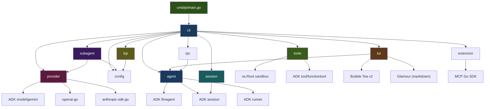
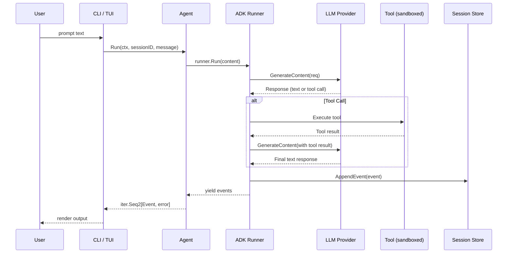
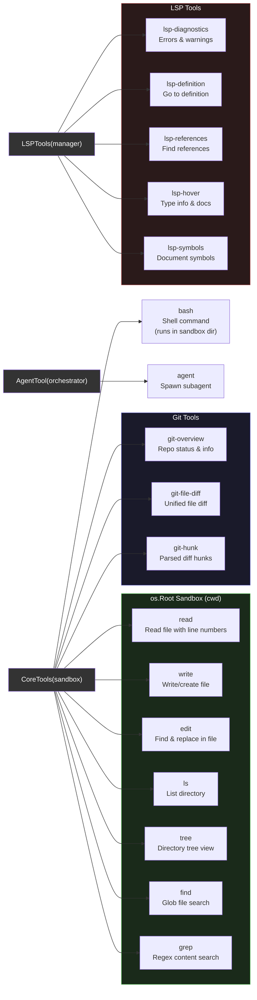
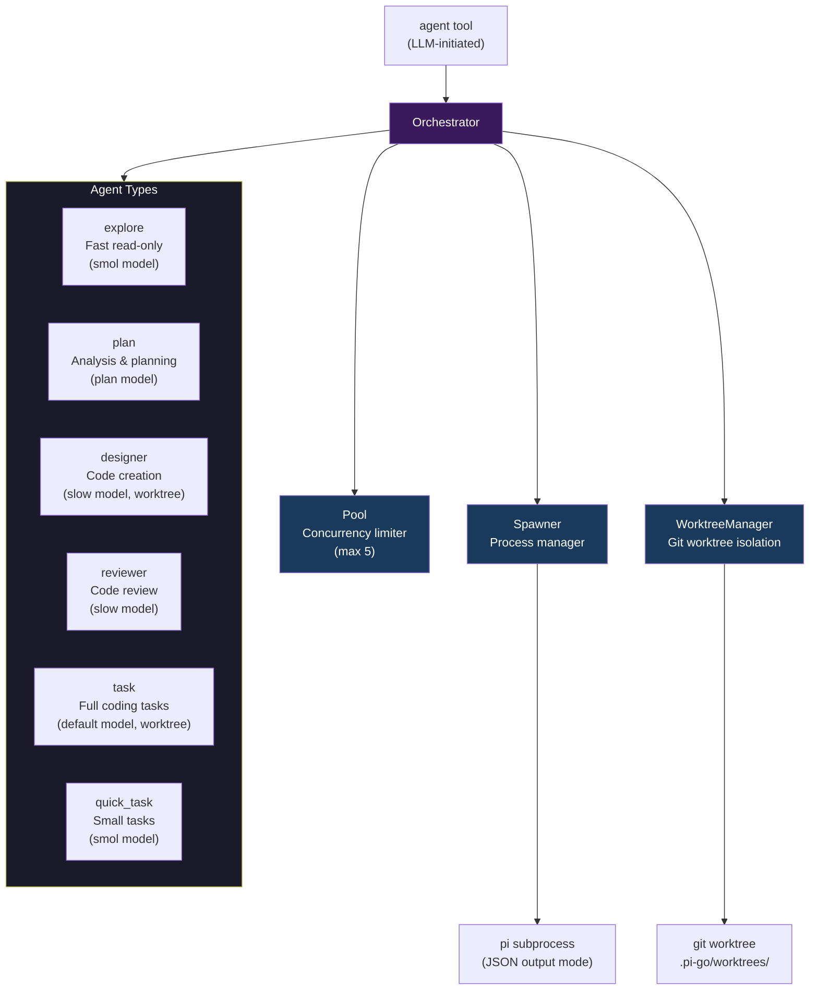
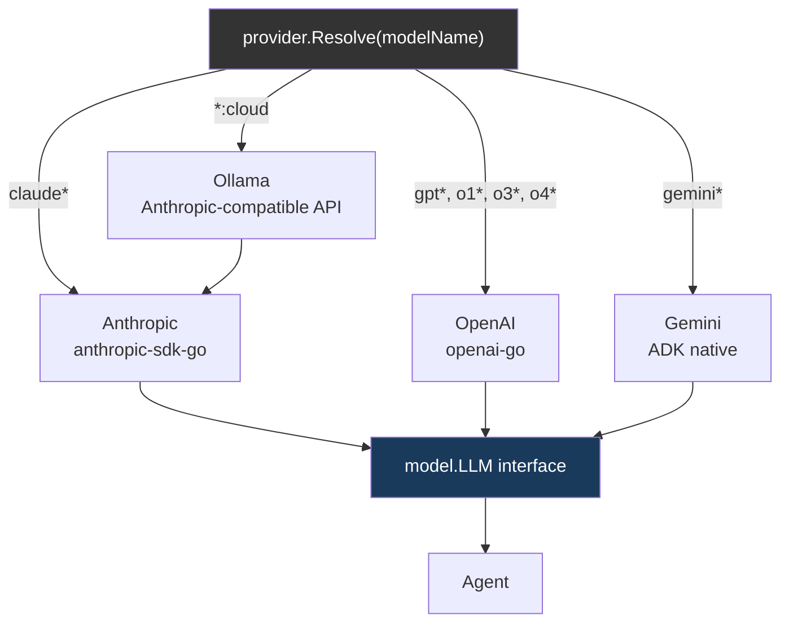
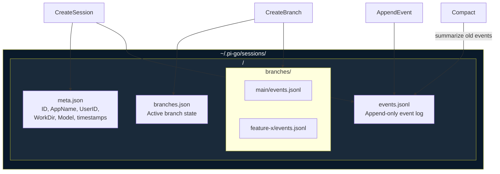
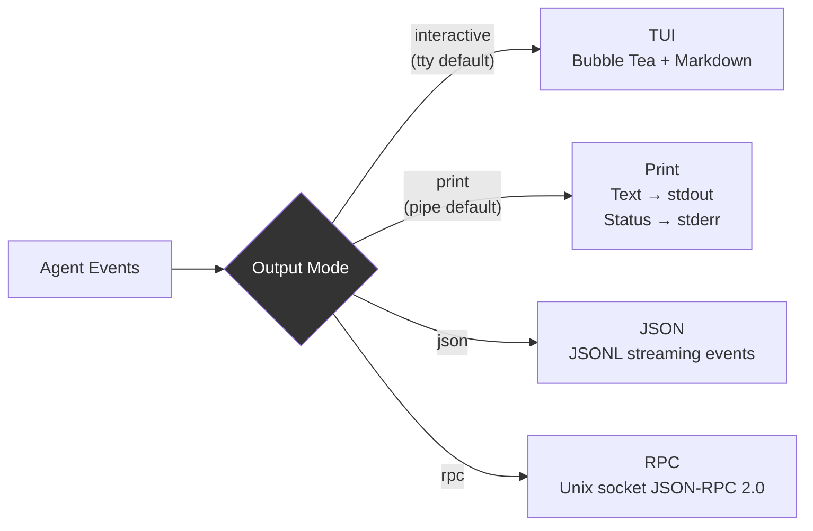
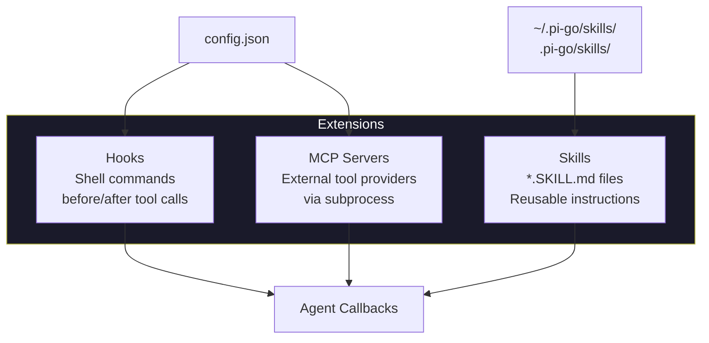
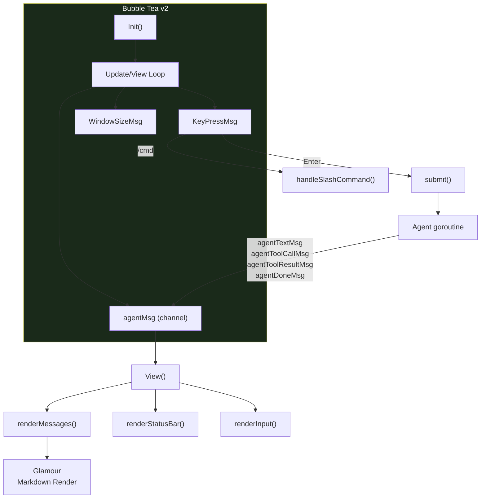
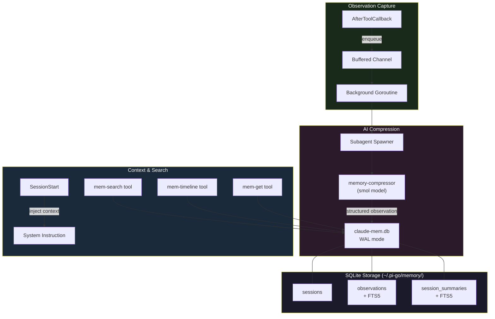

# pi-go Architecture

## Overview

pi-go is a coding agent built on [Google ADK Go](https://google.golang.org/adk) with multi-provider LLM support, sandboxed tool execution, session persistence, an interactive terminal UI, LSP integration, and a subagent orchestration system.

## Package Structure

```
pi-go/
├── cmd/pi/main.go                  # Entry point → cli.Execute()
└── internal/
    ├── agent/                       # ADK agent setup, retry logic
    ├── cli/                         # CLI flags, output modes, wiring
    ├── config/                      # Config loading (global + project), model roles
    ├── extension/                   # Hooks, skills, MCP integration
    ├── lsp/                         # LSP integration (protocol, client, manager, languages, hooks)
    ├── provider/                    # LLM providers (Anthropic, OpenAI, Gemini)
    ├── rpc/                         # Unix socket JSON-RPC server
    ├── session/                     # JSONL persistence, branching, compaction
    ├── subagent/                    # Subagent orchestration (pool, spawner, worktree, orchestrator)
    ├── tools/                       # Sandboxed tools (read, write, edit, bash, grep, find, ls, tree, git, lsp, agent)
    └── tui/                         # Bubble Tea v2 interactive UI
```

## Dependency Graph



## Request Flow



## Tool System



All file tools operate through the `Sandbox` which uses Go's `os.Root` to restrict access to the working directory tree. Paths cannot escape via `..` or symlinks.

| Tool | Input | Output | Limits |
|------|-------|--------|--------|
| read | file_path, offset, limit | content, total_lines | 2000 lines default, 100KB |
| write | file_path, content | path, bytes_written | Auto-creates parent dirs |
| edit | file_path, old_string, new_string | path, replacements | Unique match required |
| bash | command, timeout | stdout, stderr, exit_code | 2min default, 10min max |
| grep | pattern, path, glob | matches, total_matches | 200 matches max |
| find | pattern, path | files, total_files | 500 results max |
| ls | path | entries (name, is_dir, size) | — |
| tree | path, depth | tree, dirs, files | Depth 10 max, 500 entries |
| git-overview | — | branch, commits, staged, unstaged, untracked | 10s timeout |
| git-file-diff | file, staged | diff | 10s timeout |
| git-hunk | file, staged | hunks (header, content, lines) | 10s timeout |

## Model Roles

The model roles system maps abstract role names to specific LLM models, enabling different components to use appropriate models for their task complexity.

```
config.json:
{
  "roles": {
    "default": { "model": "claude-sonnet-4-20250514" },
    "smol":    { "model": "claude-haiku-3-20240307" },
    "plan":    { "model": "claude-sonnet-4-20250514" },
    "slow":    { "model": "claude-opus-4-20250514" }
  }
}
```

`ResolveRole(role)` resolves a role name to a model and provider. Falls back to "default" role if the requested role is not configured. The provider is auto-detected from the model name prefix (claude→anthropic, gpt/o1-4→openai, gemini→gemini).

CLI flags `--smol`, `--plan`, `--slow` override the active role for a single invocation.

## Subagent System

The subagent system enables the main agent to spawn autonomous child agents for parallel task execution.



Each agent type defines: model role, worktree isolation, system instruction, and allowed tools. The orchestrator validates agent type, resolves the model via roles, acquires a pool slot, optionally creates a git worktree for isolation, and spawns a `pi` subprocess in JSON output mode. Events stream back via JSONL.

## LSP Integration

The LSP system provides language intelligence through two mechanisms:

**Hooks** (automatic, via `AfterToolCallback`):
- **Format-on-write**: After `write` or `edit` tool calls, requests formatting from the language server and applies edits (5s timeout)
- **Diagnostics-on-edit**: After file modifications, collects compiler errors/warnings with a 2s delay for server processing

**Explicit tools** (LLM-invoked):
- `lsp-diagnostics` — Get errors and warnings for a file
- `lsp-definition` — Go to definition of symbol at position
- `lsp-references` — Find all references to a symbol
- `lsp-hover` — Get type information and documentation
- `lsp-symbols` — List all symbols in a file

The `Manager` starts language servers on demand based on file extension, caches connections, and shuts them down on exit. Supported languages: Go (gopls), TypeScript (typescript-language-server), Python (pylsp), Rust (rust-analyzer).

## Provider System



Each provider implements the ADK `model.LLM` interface:

```go
type LLM interface {
    Name() string
    GenerateContent(ctx, req *LLMRequest, stream bool) iter.Seq2[*LLMResponse, error]
}
```

**API keys** from environment: `ANTHROPIC_API_KEY`, `OPENAI_API_KEY`, `GOOGLE_API_KEY`
**Base URLs** from environment: `ANTHROPIC_BASE_URL`, `OPENAI_BASE_URL`, `GEMINI_BASE_URL`

## Session Management



- **Persistence**: JSONL append-only event log per session
- **Branching**: Fork conversations, switch between branches
- **Compaction**: Replace old events with summary when token count exceeds threshold
- **Resume**: `--continue` resumes last session, `--session <id>` resumes specific session

## Output Modes



**JSON event types**: `message_start`, `text_delta`, `tool_call`, `tool_result`, `message_end`

## Extension System



**Hooks**: Execute shell commands before/after tool execution. Tool name + args/results passed as JSON on stdin.

**Skills**: Markdown instruction files with YAML frontmatter. Loaded from global and project directories.

**MCP**: Launch external tool servers as subprocesses. Tools bridged into agent's toolset via ADK.

## Configuration

```
~/.pi-go/config.json          # Global config
.pi-go/config.json             # Project config (overrides global)
.pi-go/AGENTS.md               # Project-specific agent instructions
~/.pi-go/skills/*.SKILL.md     # Global skills
.pi-go/skills/*.SKILL.md       # Project skills (override global)
~/.pi-go/sessions/             # Session storage
```

## Retry & Error Handling

```mermaid
graph TD
    call["LLM Call"] --> check{Error?}
    check -->|No| done["Success"]
    check -->|Yes| transient{Transient?}
    transient -->|"429, 5xx,<br/>timeout, reset"| retry["Wait (exp backoff)<br/>1s → 2s → 4s"]
    transient -->|"400, auth,<br/>other"| fail["Fail immediately"]
    retry --> attempt{Retries<br/>exhausted?}
    attempt -->|No| call
    attempt -->|Yes| fail

    style retry fill:#5c5c1a,color:#fff
    style fail fill:#5c1a1a,color:#fff
    style done fill:#1a5c1a,color:#fff
```

Defaults: 3 retries, 1s initial delay, 30s max delay. Partial results prevent retry to preserve data integrity.

## TUI Architecture



**Slash commands**: `/help`, `/clear`, `/model`, `/session`, `/branch`, `/compact`, `/commit`, `/agents`, `/exit`

**Keyboard**: Enter (submit), Ctrl+C/Esc (quit), Up/Down (history), PgUp/PgDown (scroll), Enter/Esc (commit confirm/cancel)

## Memory System (Planned)

Persistent memory compression system inspired by [claude-mem](https://github.com/thedotmack/claude-mem), implemented natively in Go.



**Core Components:**
- **Observation Capture**: `AfterToolCallback` enqueues tool usage to a buffered channel (non-blocking)
- **AI Compression**: Background goroutine spawns `memory-compressor` subagent (smol model) to extract structured observations
- **SQLite Storage**: `modernc.org/sqlite` (pure Go, no CGO) with FTS5 full-text search
- **Context Injection**: Recent observations injected into system instruction at session start
- **Search Tools**: Native `mem-search`, `mem-timeline`, `mem-get` tools registered in `CoreTools()`

**Data Model:**
| Table | Key Fields |
|-------|------------|
| sessions | id, session_id, project, started_at, status |
| observations | id, session_id, project, title, type, text, source_files, created_at |
| session_summaries | id, session_id, project, request, investigated, learned, completed, next_steps |

**3-Layer Search Workflow:**
1. `mem-search(query)` — compact index with IDs (~50-100 tokens/result)
2. `mem-timeline(anchor=ID)` — chronological context around results
3. `mem-get(ids=[...])` — full details for filtered IDs (~500-1000 tokens/result)

See `specs/claude-mem/` for the full design specification.
