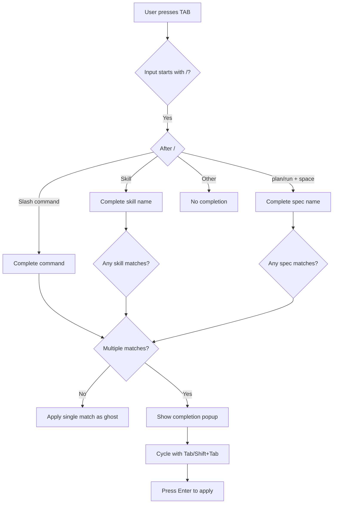

# Design: Better Completion Commands

## Objective
Improve TAB completion in pi-go's interactive TUI to support multiple matches, cycling, skill completion, spec completion, and a better visual presentation.

## Architecture Overview

### Components

1. **Completion Engine** (`completion.go` in `internal/tui/`)
   - Central completion logic
   - Handles command, skill, and spec completion
   - Returns ranked list of matches

2. **Completion Popup** (optional enhancement)
   - Multi-match selection UI
   - Arrow key navigation
   - Enter to select

3. **Data Providers**
   - Skills: from `~/.pi-go/skills/` and `.pi-go/skills/`
   - Specs: from `specs/` in current working directory

### Mermaid Diagram



## Component Details

### 1. Completion Engine (`completion.go`)

```go
// CompletionType represents the type of completion being performed.
type CompletionType int

const (
    CompletionTypeNone     CompletionType = iota
    CompletionTypeCommand               // /help, /plan, etc.
    CompletionTypeSkill                // /skill-name
    CompletionTypeSpec                 // /plan <spec-name> or /run <spec-name>
)

// CompletionCandidate represents a single completion option.
type CompletionCandidate struct {
    Text        string // The completion text
    Description string // Optional description for display
    Type        CompletionType
}

// CompleteResult holds the result of a completion attempt.
type CompleteResult struct {
    Candidates []CompletionCandidate // All matching candidates
    Selected   int                    // Index of currently selected (for cycling)
    Type       CompletionType
}

// Complete analyzes the input and returns all matching candidates.
func (m *model) Complete(input string, cursorPos int) CompleteResult

// CycleSelection cycles through candidates.
// dir: -1 for previous, +1 for next
func (r *CompleteResult) CycleSelection(dir int)

// ApplySelection returns the text with completion applied.
func (r *CompleteResult) ApplySelection(index int) string
```

### 2. Extended Model (`tui.go` additions)

```go
type model struct {
    // ... existing fields ...
    
    // Completion state.
    completion     string        // ghost autocomplete suggestion (existing)
    completion     *CompleteResult // NEW: enhanced completion with multi-match
    completionMode bool          // NEW: whether we're in completion selection mode
    selectedIndex  int           // NEW: currently selected candidate index
}
```

### 3. Config Updates

```go
type Config struct {
    // ... existing fields ...
    
    // Completion settings.
    // Skills is loaded from skill directories for completion.
    Skills []extension.Skill
}
```

## Data Models

### CompletionCandidate

| Field | Type | Description |
|-------|------|-------------|
| Text | `string` | The completion text to apply |
| Description | `string` | Optional description shown in popup |
| Type | `CompletionType` | What kind of completion this is |

### Completion Flow

1. **Parse input**:
   - If input starts with `/` → command completion
   - If input is `/<word> ` → spec completion for `/plan` or `/run`
   - If input matches a skill name → skill completion

2. **Collect candidates**:
   - Commands: from `slashCommands` list
   - Skills: from `config.Skills` or dynamically loaded
   - Specs: from `specs/` subdirectories containing `PROMPT.md`

3. **Rank and filter**:
   - Filter by prefix match (case-insensitive)
   - Sort alphabetically

4. **Return results**:
   - Single match: apply as ghost text
   - Multiple matches: show popup or cycle

## Error Handling

- **No matches**: Return empty result, no completion UI
- **File system errors** (missing skills/specs dirs): Log and continue with empty list
- **Invalid input**: Gracefully return no completion

## Acceptance Criteria

### Feature: Better Completion Behavior
- **Given** user has typed `/pl`, **when** they press TAB, **then** completion shows `/plan` as ghost text
- **Given** user has typed `/`, **when** they press TAB, **then** all commands are shown
- **Given** multiple matches exist, **when** user presses TAB, **then** they can cycle through options

### Feature: Skill Completion
- **Given** skills exist in `~/.pi-go/skills/`, **when** user types `/<skill-start>`, **then** matching skills appear in completion
- **Given** no skills exist, **when** user types `/`, **then** only built-in commands are shown

### Feature: Spec Completion  
- **Given** spec directories exist in `specs/`, **when** user types `/plan `, **then** spec names appear in completion
- **Given** spec directories exist, **when** user types `/run my-`, **then** specs starting with "my-" appear

### Feature: Better UI/UX
- **Given** multiple matches, **when** cycling, **then** visual indicator shows current selection
- **Given** pressing Enter on a selection, **then** input is updated to selected value

## Testing Strategy

1. **Unit Tests**:
   - `completeSlashCommand` returns correct matches
   - `matchingSkills` filters correctly
   - `matchingSpecs` returns correct list
   - Cycling logic works correctly

2. **Integration Tests**:
   - Full TAB flow with mock file system
   - Spec completion with actual specs directory
   - Skill completion with mock skills

3. **Manual Testing**:
   - Interactive TUI with real spec/skills directories

## Implementation Steps (High-Level)

1. Create `completion.go` with completion engine
2. Add completion mode to model
3. Add skills to Config
4. Implement skill matching
5. Implement spec matching  
6. Add completion popup/cycling UI
7. Wire up TAB handler
8. Add tests