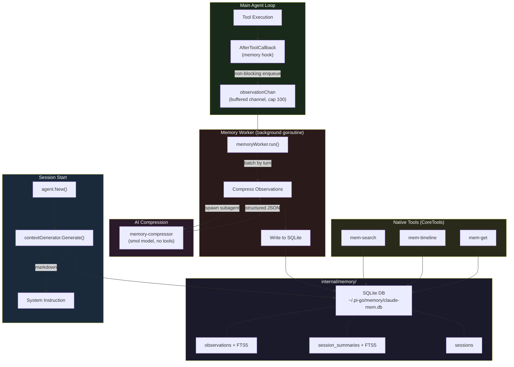
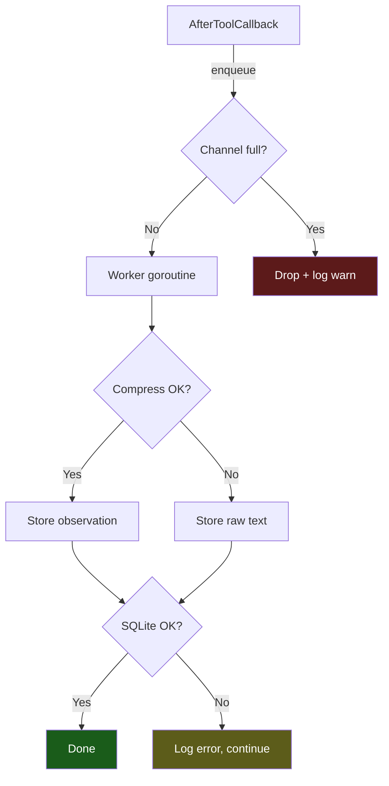

# Design: Native claude-mem Implementation in pi-go

## Overview

Implement a persistent memory compression system natively in pi-go that automatically captures tool usage observations during coding sessions, compresses them with AI into structured observations, stores them in SQLite with full-text search, and injects relevant context into future sessions. Inspired by [claude-mem](https://github.com/thedotmack/claude-mem), re-implemented in Go to leverage pi-go's existing agent, tool, and subagent infrastructure.

## Detailed Requirements

### Functional Requirements

1. **Automatic Observation Capture**: Every tool execution (read, write, edit, bash, grep, etc.) is captured as a raw observation via the existing `AfterToolCallback` mechanism.

2. **AI Compression**: Raw tool observations are compressed by a background subagent (`memory-compressor`, smol model) into structured observations with: title, type (decision/bugfix/feature/refactor/discovery/change), source files, and narrative text.

3. **Persistent Storage**: Observations and session summaries stored in SQLite (`~/.pi-go/memory/claude-mem.db`) with WAL mode and FTS5 full-text search.

4. **Context Injection**: At session start, recent relevant observations are compiled into a markdown summary and injected into the agent's system instruction.

5. **Search Tools**: Three native tools for progressive-disclosure memory search:
   - `mem-search` — compact index with IDs
   - `mem-timeline` — chronological context around an observation
   - `mem-get` — full details for specific observation IDs

6. **Session Summaries**: At session end (or on `/stop`), generate a structured summary (request, investigated, learned, completed, next_steps) via the compression subagent.

7. **Privacy**: Respect `<private>` tags — content wrapped in `<private>...</private>` is never stored.

8. **Project Scoping**: Observations are scoped to the project (working directory). Context injection and search default to the current project but support cross-project queries.

### Non-Functional Requirements

1. **Non-blocking**: Observation capture must not add latency to the main agent loop. The `AfterToolCallback` enqueues and returns immediately.
2. **Pure Go**: Use `modernc.org/sqlite` — no CGO dependency.
3. **Single binary**: No external worker service or subprocess. Everything runs in-process.
4. **Graceful degradation**: If compression fails or SQLite is unavailable, the main agent continues unaffected.
5. **Token efficiency**: Context injection respects a configurable token budget (default: 8K tokens). Progressive disclosure minimizes unnecessary token usage.

## Architecture Overview



### Key Architectural Decisions

1. **In-process, not external worker**: Unlike TypeScript claude-mem which runs a separate HTTP worker on port 37777, we run everything in-process. This avoids subprocess management, port conflicts, and health checks. The tradeoff is memory usage, but SQLite is lightweight.

2. **Buffered channel, not database queue**: Pending observations flow through a Go channel (cap 100), not a database table. Simpler, no polling, and if the process dies the pending queue is lost (acceptable — observations are best-effort).

3. **Subagent for compression, not in-process API call**: Reuse the existing subagent spawner rather than making direct API calls. This keeps the compression isolated and reuses the model role system.

4. **Native tools, not MCP server**: Register search tools directly in `CoreTools()` rather than running a separate MCP server. Eliminates subprocess overhead and simplifies deployment.

5. **Single session ID**: Reuse pi-go's existing session UUID rather than maintaining separate `content_session_id` / `memory_session_id`. The TypeScript version needed two IDs because compression ran in a separate SDK session; ours runs in-process.

## Components and Interfaces

### Package: `internal/memory`

New package containing all memory system code.

```
internal/memory/
├── db.go              # Database initialization, migrations, connection
├── store.go           # Observation and summary CRUD operations
├── search.go          # FTS5 search, timeline, batch get
├── context.go         # Context generation for session start injection
├── worker.go          # Background observation processing goroutine
├── compress.go        # Subagent-based AI compression logic
├── privacy.go         # <private> tag stripping
├── types.go           # Shared types (Observation, Summary, Session, etc.)
└── memory_test.go     # Tests
```

### Interface: `Store`

```go
package memory

type Store interface {
    // Session management
    CreateSession(ctx context.Context, session *Session) error
    CompleteSession(ctx context.Context, sessionID string) error

    // Observation CRUD
    InsertObservation(ctx context.Context, obs *Observation) error
    GetObservations(ctx context.Context, ids []int64) ([]*Observation, error)

    // Session summary
    UpsertSummary(ctx context.Context, sum *SessionSummary) error

    // Search
    Search(ctx context.Context, query SearchQuery) (*SearchResult, error)
    Timeline(ctx context.Context, anchorID int64, before, after int) ([]*Observation, error)

    // Context generation
    RecentObservations(ctx context.Context, project string, limit int) ([]*Observation, error)
    RecentSummaries(ctx context.Context, project string, limit int) ([]*SessionSummary, error)

    // Lifecycle
    Close() error
}
```

### Interface: `Worker`

```go
type Worker struct {
    store      Store
    compressor *Compressor
    obsChan    chan RawObservation
    done       chan struct{}
}

func NewWorker(store Store, compressor *Compressor) *Worker
func (w *Worker) Enqueue(obs RawObservation)       // non-blocking, drops if full
func (w *Worker) Start(ctx context.Context)          // starts background goroutine
func (w *Worker) Shutdown(ctx context.Context) error // drain and stop
```

### Interface: `Compressor`

```go
type Compressor struct {
    orchestrator *subagent.Orchestrator
}

func NewCompressor(orch *subagent.Orchestrator) *Compressor

// CompressObservation sends raw tool data to memory-compressor subagent
// Returns structured observation or error
func (c *Compressor) CompressObservation(ctx context.Context, raw RawObservation) (*Observation, error)

// SummarizeSession sends session observations to subagent for summary
func (c *Compressor) SummarizeSession(ctx context.Context, obs []*Observation) (*SessionSummary, error)
```

### Integration: `AfterToolCallback`

```go
// BuildMemoryCallback creates an AfterToolCallback that captures tool usage.
// Added to the callback chain in cli.go alongside compactor and LSP callbacks.
func BuildMemoryCallback(worker *Worker, sessionID string, project string) tool.AfterToolCallback {
    return func(ctx tool.Context, t tool.Tool, args, result map[string]any, err error) (map[string]any, error) {
        if err != nil {
            return result, nil // skip failed tools
        }
        worker.Enqueue(RawObservation{
            SessionID: sessionID,
            Project:   project,
            ToolName:  t.Name(),
            ToolInput: args,
            ToolOutput: result,
            Timestamp: time.Now(),
        })
        return result, nil // never modify result, never error
    }
}
```

### Integration: Context Injection

```go
// GenerateContext builds a markdown string of recent observations for system instruction injection.
// Called during agent setup in cli.go, appended to the system instruction.
func GenerateContext(store Store, project string, tokenBudget int) (string, error)
```

Output format (injected as part of system instruction):

```markdown
# [project-name] recent context

**Legend:** | bugfix | feature | refactor | change | discovery

## Session: <title> (Mar 20 at 2:30 AM)
| ID | Time | T | Title | Read | Work |
|----|------|---|-------|------|------|
| #42 | 2:31 AM | feature | Added retry logic to API client | 120 | 850 |
| #43 | 2:35 AM | bugfix | Fixed nil pointer in session store | 80 | 1200 |

Access past observations with mem-search, mem-timeline, mem-get tools.
```

### Search Tools (registered in CoreTools)

```go
// mem-search: Full-text search over observations
type MemSearchInput struct {
    Query   string `json:"query"`
    Project string `json:"project,omitempty"`
    Type    string `json:"type,omitempty"`      // observation type filter
    Limit   int    `json:"limit,omitempty"`      // default 20
    Offset  int    `json:"offset,omitempty"`
}
type MemSearchOutput struct {
    Results []SearchResultRow `json:"results"`
    Total   int               `json:"total"`
}

// mem-timeline: Chronological context around an observation
type MemTimelineInput struct {
    Anchor      int64  `json:"anchor"`                  // observation ID
    DepthBefore int    `json:"depth_before,omitempty"`   // default 3
    DepthAfter  int    `json:"depth_after,omitempty"`    // default 3
    Project     string `json:"project,omitempty"`
}
type MemTimelineOutput struct {
    Observations []*Observation `json:"observations"`
}

// mem-get: Fetch full details for specific observation IDs
type MemGetInput struct {
    IDs []int64 `json:"ids"`
}
type MemGetOutput struct {
    Observations []*Observation `json:"observations"`
}
```

## Data Models

### SQLite Schema

```sql
-- Sessions table
CREATE TABLE IF NOT EXISTS sessions (
    id          INTEGER PRIMARY KEY AUTOINCREMENT,
    session_id  TEXT UNIQUE NOT NULL,
    project     TEXT NOT NULL,
    user_prompt TEXT,
    started_at  TEXT NOT NULL,
    started_at_epoch INTEGER NOT NULL,
    completed_at TEXT,
    completed_at_epoch INTEGER,
    status      TEXT CHECK(status IN ('active', 'completed', 'failed')) NOT NULL DEFAULT 'active'
);
CREATE INDEX idx_sessions_project ON sessions(project);
CREATE INDEX idx_sessions_started ON sessions(started_at_epoch DESC);

-- Observations table
CREATE TABLE IF NOT EXISTS observations (
    id              INTEGER PRIMARY KEY AUTOINCREMENT,
    session_id      TEXT NOT NULL,
    project         TEXT NOT NULL,
    title           TEXT,
    type            TEXT NOT NULL CHECK(type IN ('decision', 'bugfix', 'feature', 'refactor', 'discovery', 'change')),
    text            TEXT,
    source_files    TEXT,       -- JSON array of file paths
    tool_name       TEXT,
    prompt_number   INTEGER,
    discovery_tokens INTEGER DEFAULT 0,
    created_at      TEXT NOT NULL,
    created_at_epoch INTEGER NOT NULL,
    FOREIGN KEY(session_id) REFERENCES sessions(session_id) ON DELETE CASCADE
);
CREATE INDEX idx_obs_session ON observations(session_id);
CREATE INDEX idx_obs_project ON observations(project);
CREATE INDEX idx_obs_type ON observations(type);
CREATE INDEX idx_obs_created ON observations(created_at_epoch DESC);
CREATE INDEX idx_obs_project_created ON observations(project, created_at_epoch DESC);

-- FTS5 for observations
CREATE VIRTUAL TABLE observations_fts USING fts5(
    title, text, source_files,
    content='observations', content_rowid='id'
);

-- Sync triggers for observations_fts
CREATE TRIGGER observations_ai AFTER INSERT ON observations BEGIN
    INSERT INTO observations_fts(rowid, title, text, source_files)
    VALUES (new.id, new.title, new.text, new.source_files);
END;
CREATE TRIGGER observations_ad AFTER DELETE ON observations BEGIN
    INSERT INTO observations_fts(observations_fts, rowid, title, text, source_files)
    VALUES('delete', old.id, old.title, old.text, old.source_files);
END;
CREATE TRIGGER observations_au AFTER UPDATE ON observations BEGIN
    INSERT INTO observations_fts(observations_fts, rowid, title, text, source_files)
    VALUES('delete', old.id, old.title, old.text, old.source_files);
    INSERT INTO observations_fts(rowid, title, text, source_files)
    VALUES (new.id, new.title, new.text, new.source_files);
END;

-- Session summaries
CREATE TABLE IF NOT EXISTS session_summaries (
    id              INTEGER PRIMARY KEY AUTOINCREMENT,
    session_id      TEXT UNIQUE NOT NULL,
    project         TEXT NOT NULL,
    request         TEXT,
    investigated    TEXT,
    learned         TEXT,
    completed       TEXT,
    next_steps      TEXT,
    discovery_tokens INTEGER DEFAULT 0,
    created_at      TEXT NOT NULL,
    created_at_epoch INTEGER NOT NULL,
    FOREIGN KEY(session_id) REFERENCES sessions(session_id) ON DELETE CASCADE
);
CREATE INDEX idx_sum_project ON session_summaries(project);
CREATE INDEX idx_sum_created ON session_summaries(created_at_epoch DESC);

-- FTS5 for session summaries
CREATE VIRTUAL TABLE session_summaries_fts USING fts5(
    request, investigated, learned, completed, next_steps,
    content='session_summaries', content_rowid='id'
);

-- Sync triggers for session_summaries_fts (same pattern as observations)

-- Migration tracking
CREATE TABLE IF NOT EXISTS schema_versions (
    id         INTEGER PRIMARY KEY,
    version    INTEGER UNIQUE NOT NULL,
    applied_at TEXT NOT NULL
);
```

### Go Types

```go
package memory

import "time"

type Session struct {
    ID          int64
    SessionID   string
    Project     string
    UserPrompt  string
    StartedAt   time.Time
    CompletedAt *time.Time
    Status      string // "active", "completed", "failed"
}

type ObservationType string

const (
    TypeDecision  ObservationType = "decision"
    TypeBugfix    ObservationType = "bugfix"
    TypeFeature   ObservationType = "feature"
    TypeRefactor  ObservationType = "refactor"
    TypeDiscovery ObservationType = "discovery"
    TypeChange    ObservationType = "change"
)

type Observation struct {
    ID              int64
    SessionID       string
    Project         string
    Title           string
    Type            ObservationType
    Text            string
    SourceFiles     []string // stored as JSON array
    ToolName        string
    PromptNumber    int
    DiscoveryTokens int
    CreatedAt       time.Time
}

type SessionSummary struct {
    ID              int64
    SessionID       string
    Project         string
    Request         string
    Investigated    string
    Learned         string
    Completed       string
    NextSteps       string
    DiscoveryTokens int
    CreatedAt       time.Time
}

// RawObservation is the uncompressed tool event captured by AfterToolCallback
type RawObservation struct {
    SessionID  string
    Project    string
    ToolName   string
    ToolInput  map[string]any
    ToolOutput map[string]any
    Timestamp  time.Time
}

type SearchQuery struct {
    Query   string
    Project string
    Type    ObservationType
    Limit   int
    Offset  int
}

type SearchResultRow struct {
    ID        int64           `json:"id"`
    Title     string          `json:"title"`
    Type      ObservationType `json:"type"`
    CreatedAt time.Time       `json:"created_at"`
    ReadCost  int             `json:"read"`  // estimated tokens to read full observation
    WorkCost  int             `json:"work"`  // discovery_tokens (work invested)
}

type SearchResult struct {
    Rows  []SearchResultRow `json:"results"`
    Total int               `json:"total"`
}
```

## Error Handling

### Principles

1. **Never block the main agent loop**: The `AfterToolCallback` must always return `(result, nil)`. Any error in memory capture is logged but never propagated.

2. **Graceful degradation at every layer**:
   - Channel full → drop observation, log warning
   - Subagent compression fails → store raw observation text as fallback
   - SQLite unavailable → disable memory system, log error at startup
   - FTS5 unavailable → fall back to LIKE queries
   - Context generation fails → return empty context, log error

3. **Startup resilience**: If `~/.pi-go/memory/claude-mem.db` cannot be opened (permissions, corruption), the memory system is disabled for the session with a warning. The agent runs normally without memory.

4. **Shutdown**: On shutdown, the worker drains pending observations with a 5-second timeout. Unprocessed observations are lost (acceptable for best-effort capture).

### Error Flow



## Acceptance Criteria

### Observation Capture

**Given** the memory system is enabled and the agent executes a tool
**When** the `AfterToolCallback` fires
**Then** a `RawObservation` is enqueued to the worker channel within 1ms (non-blocking)

**Given** the worker channel is full (100 items)
**When** a new observation is enqueued
**Then** the observation is dropped and a warning is logged

### AI Compression

**Given** a `RawObservation` with tool_name="write" and tool_input containing file_path
**When** the memory-compressor subagent processes it
**Then** the result is a structured `Observation` with title, type, and source_files extracted

**Given** the compression subagent times out or fails
**When** the worker processes the raw observation
**Then** a fallback observation is stored with the tool name as title and raw text as content

### Storage

**Given** the memory database does not exist
**When** the memory system initializes
**Then** the database is created at `~/.pi-go/memory/claude-mem.db` with all tables and FTS5 indexes

**Given** the database exists with an older schema version
**When** the memory system initializes
**Then** pending migrations are applied in order

### Context Injection

**Given** there are 50 observations for the current project in the last 24 hours
**When** a new session starts
**Then** the most recent observations (up to token budget) are formatted as markdown and injected into the system instruction

**Given** no observations exist for the current project
**When** a new session starts
**Then** no memory context is injected (empty string)

### Search Tools

**Given** observations exist with text matching "authentication bug"
**When** `mem-search(query="authentication bug")` is called
**Then** matching observations are returned as a compact table with IDs, titles, types, and timestamps

**Given** observation #42 exists with 3 observations before and after it
**When** `mem-timeline(anchor=42, depth_before=3, depth_after=3)` is called
**Then** observations #39-#45 are returned in chronological order

**Given** observations #42 and #43 exist
**When** `mem-get(ids=[42, 43])` is called
**Then** full observation details are returned for both IDs

### Privacy

**Given** tool output contains `<private>secret API key</private>`
**When** the observation is processed
**Then** the private content is stripped before storage, replaced with `[PRIVATE]`

### Session Summary

**Given** a session with 10 observations is ending
**When** the shutdown hook fires
**Then** a structured session summary is generated and stored

## Testing Strategy

### Unit Tests (`internal/memory/*_test.go`)

1. **db_test.go**: Database creation, migrations, WAL mode, FTS5 availability check
2. **store_test.go**: CRUD operations, search queries, timeline queries (using `:memory:` SQLite)
3. **privacy_test.go**: `<private>` tag stripping in various positions
4. **context_test.go**: Context generation formatting, token budget enforcement
5. **worker_test.go**: Enqueue/dequeue, channel-full drop behavior, shutdown drain
6. **compress_test.go**: Mock subagent responses, fallback on failure

### Integration Tests

1. **Callback integration**: Verify `BuildMemoryCallback` captures real tool executions
2. **Search tool integration**: End-to-end search → timeline → get workflow
3. **Context injection**: Verify context appears in system instruction after observations are stored

### Test Approach

- Use `:memory:` SQLite for all unit tests (fast, no cleanup)
- Mock the `Compressor` interface for worker tests (avoid spawning real subagents)
- Use `t.TempDir()` for integration tests that need file-based SQLite
- Target 80%+ coverage on `internal/memory/`

## Appendices

### A. Technology Choices

| Choice | Alternative | Rationale |
|--------|------------|-----------|
| `modernc.org/sqlite` | `mattn/go-sqlite3` (CGO) | Pure Go, no CGO dependency, fits pi-go's build model |
| In-process worker | External HTTP worker (port 37777) | Simpler deployment, no process management, single binary |
| Subagent for compression | Direct API call | Reuses existing infrastructure, model role system, pool management |
| Native tools | MCP server | No subprocess overhead, simpler integration |
| Buffered channel | Database queue | Simpler, no polling, acceptable loss on crash |

### B. Research Findings Summary

See `specs/claude-mem/research/` for detailed findings:
1. **Hooks**: `AfterToolCallback` is the integration point. LSP hook is the reference pattern.
2. **SQLite**: No existing usage. `modernc.org/sqlite` recommended.
3. **MCP**: pi-go is MCP client only. Native tools via `CoreTools()` are preferred.
4. **Subagents**: Pool (5 slots) + spawner exists. Background spawn with `memory-compressor` agent.
5. **Sessions**: UUID-based, file JSONL. Reuse session ID directly.

### C. Differences from TypeScript claude-mem

| Feature | TypeScript claude-mem | pi-go native |
|---------|----------------------|-------------|
| Worker | External HTTP service (port 37777) | In-process goroutine |
| Compression | Claude Agent SDK (separate session) | Subagent spawner (child process) |
| Database | Bun SQLite | modernc.org/sqlite |
| Search | MCP server + HTTP API | Native tools in CoreTools() |
| Session IDs | content_session_id + memory_session_id | Single session UUID |
| Web viewer | React UI at localhost:37777 | Not included (future: TUI dashboard) |
| Vector search | Chroma DB | Not included (FTS5 is sufficient initially) |
| Hooks | 5 shell script hooks | Go AfterToolCallback + system instruction |

### D. Configuration

```json
// ~/.pi-go/config.json
{
  "memory": {
    "enabled": true,
    "db_path": "~/.pi-go/memory/claude-mem.db",
    "token_budget": 8000,
    "compression_model_role": "smol",
    "max_pending_observations": 100,
    "context_lookback_hours": 72,
    "excluded_tools": ["mem-search", "mem-timeline", "mem-get"],
    "excluded_projects": []
  }
}
```

### E. File Changes Summary

| File | Change |
|------|--------|
| `internal/memory/` (new) | Entire memory package |
| `internal/subagent/bundled/memory-compressor.md` (new) | Compression agent definition |
| `internal/tools/registry.go` | Add `newMemSearchTool`, `newMemTimelineTool`, `newMemGetTool` |
| `internal/tools/mem_search.go` (new) | Search tool implementations |
| `internal/cli/cli.go` | Wire memory worker, callback, context injection |
| `internal/config/config.go` | Add `MemoryConfig` struct |
| `go.mod` | Add `modernc.org/sqlite` |
