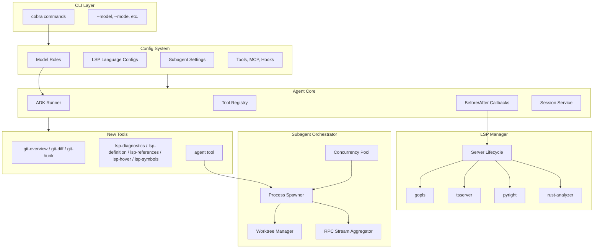
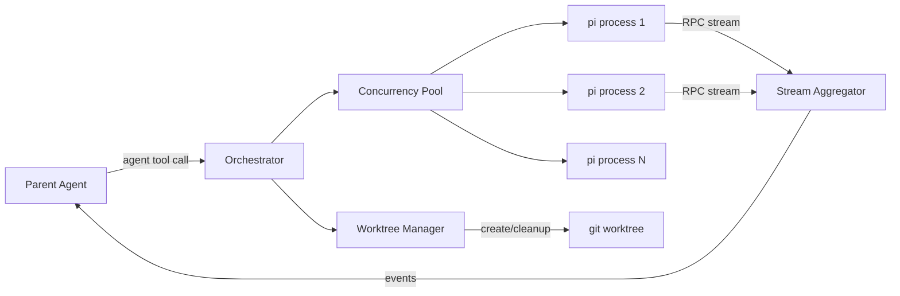
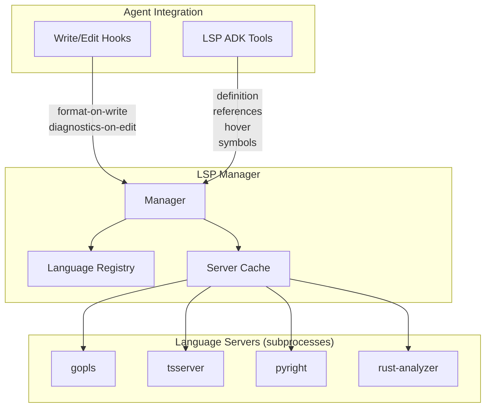

# Design Document: Enhance pi-go with oh-my-pi Features

## Overview

This document describes the design for enhancing pi-go with four high-value feature areas inspired by [oh-my-pi](https://github.com/can1357/oh-my-pi):

1. **Model Roles** — Config-based role-to-model routing (default, smol, slow, plan, commit)
2. **AI Git Commits** — Git inspection tools + `/commit` slash command with conventional commit generation
3. **Subagent System** — Process-based multi-agent with 6 types, streaming RPC, worktree isolation
4. **LSP Integration** — 6 essential operations, 4 languages, auto hooks + explicit tools

The design targets pi-go's Go/ADK architecture and allows clean-slate restructuring of config and session formats.

---

## Detailed Requirements

### Model Roles
- 5 fixed roles: `default`, `smol`, `slow`, `plan`, `commit`
- User maps roles to specific model names in config.json
- Each role resolves to a provider+model pair at runtime
- CLI flag `--model` overrides the `default` role
- Subagents select roles based on their agent type

### AI Git Commits
- 3 ADK tools: `git-overview`, `git-file-diff`, `git-hunk` — callable by LLM
- `/commit` slash command orchestrating the full commit workflow
- Conventional commit format validation (type(scope): description)
- No split commits or changelog generation (future extension)

### Subagent System
- Process-based: each subagent is a separate `pi` process
- 6 agent types: explore, plan, designer, reviewer, task, quick_task
- Parallel execution with configurable limit (default: 5)
- Worktree isolation by type: task/reviewer/designer get worktrees; explore/plan/quick_task share cwd
- Role-based model assignment per agent type
- Streaming results via RPC (text deltas, tool calls visible to parent)

### LSP Integration
- 6 operations: diagnostics, definition, references, hover, symbols, format-on-write
- 4 languages out-of-box: Go (gopls), TypeScript/JS (typescript-language-server), Python (pyright), Rust (rust-analyzer)
- On-demand + persistent lifecycle (start on first use, keep alive for session)
- Dual integration: auto hooks (format-on-write, diagnostics-on-edit) + explicit ADK tools

---

## Architecture Overview



---

## Components and Interfaces

### 1. Model Roles (`internal/config/`)

#### Config Schema (New)

```go
type Config struct {
    Roles           map[string]RoleConfig `json:"roles"`           // NEW
    LSP             *LSPConfig            `json:"lsp,omitempty"`   // NEW
    Subagents       *SubagentConfig       `json:"subagents,omitempty"` // NEW
    DefaultProvider string                `json:"defaultProvider"`
    ThinkingLevel   string                `json:"thinkingLevel"`
    Theme           string                `json:"theme"`
    Tools           map[string]any        `json:"tools,omitempty"`
    MCP             *MCPConfig            `json:"mcp,omitempty"`
    Hooks           []HookConfig          `json:"hooks,omitempty"`
}

type RoleConfig struct {
    Model    string `json:"model"`              // e.g., "gemini-2.0-flash"
    Provider string `json:"provider,omitempty"` // override; auto-detected if empty
}
```

Note: `DefaultModel` is removed. The `default` role replaces it.

#### Example Config

```json
{
  "roles": {
    "default": {"model": "claude-sonnet-4-20250514"},
    "smol":    {"model": "gemini-2.0-flash"},
    "slow":    {"model": "claude-opus-4-20250514"},
    "plan":    {"model": "claude-opus-4-20250514"},
    "commit":  {"model": "gemini-2.0-flash"}
  },
  "defaultProvider": "anthropic",
  "lsp": {
    "languages": {
      "go":         {"command": "gopls", "args": ["serve"]},
      "typescript": {"command": "typescript-language-server", "args": ["--stdio"]},
      "python":     {"command": "pyright-langserver", "args": ["--stdio"]},
      "rust":       {"command": "rust-analyzer"}
    }
  },
  "subagents": {
    "maxConcurrent": 5,
    "roleMapping": {
      "explore":    "smol",
      "plan":       "slow",
      "designer":   "slow",
      "reviewer":   "default",
      "task":       "default",
      "quick_task": "smol"
    }
  }
}
```

#### Role Resolution

```go
// ResolveRole returns the model name and provider for a given role.
// Falls back: requested role → "default" role → error
func (c *Config) ResolveRole(role string) (model string, provider string, error)
```

Resolution chain:
1. Look up `role` in `Roles` map
2. If not found, fall back to `"default"` role
3. If provider empty in role config, auto-detect from model name prefix
4. Return error if no default role configured

#### CLI Integration

- `--model` flag sets the `default` role at runtime (overrides config)
- New flags: `--smol`, `--slow`, `--plan` select respective roles for the session
- `/model` slash command shows all role mappings

---

### 2. Git Tools (`internal/tools/`)

Three new tools registered in `CoreTools()`:

#### git-overview Tool

```go
type GitOverviewInput struct {
    // No required params — shows current repo state
    IncludeStaged   bool `json:"include_staged,omitempty"`   // default true
    IncludeUnstaged bool `json:"include_unstaged,omitempty"` // default true
    IncludeUntracked bool `json:"include_untracked,omitempty"` // default true
}

type GitOverviewOutput struct {
    Branch        string   `json:"branch"`
    RecentCommits []string `json:"recent_commits"` // last 10, oneline
    StagedFiles   []string `json:"staged_files"`
    UnstagedFiles []string `json:"unstaged_files"`
    UntrackedFiles []string `json:"untracked_files"`
    Upstream      string   `json:"upstream,omitempty"`
    AheadBehind   string   `json:"ahead_behind,omitempty"`
}
```

Implementation: Runs `git status --porcelain`, `git log --oneline -10`, `git branch -vv` via `exec.Command` within sandbox directory.

#### git-file-diff Tool

```go
type GitFileDiffInput struct {
    File   string `json:"file"`              // file path relative to repo root
    Staged bool   `json:"staged,omitempty"`  // diff staged vs HEAD (default: unstaged)
}

type GitFileDiffOutput struct {
    File    string `json:"file"`
    Diff    string `json:"diff"`    // unified diff output
    Stats   string `json:"stats"`   // e.g., "+15 -3"
}
```

Implementation: Runs `git diff [--cached] -- <file>`. Output truncated to 100KB.

#### git-hunk Tool

```go
type GitHunkInput struct {
    File string `json:"file"` // file path
}

type GitHunkOutput struct {
    File  string `json:"file"`
    Hunks []Hunk `json:"hunks"`
}

type Hunk struct {
    Header  string `json:"header"`  // @@ line
    Content string `json:"content"` // hunk diff content
    Lines   struct {
        Added   int `json:"added"`
        Removed int `json:"removed"`
    } `json:"lines"`
}
```

Implementation: Parses `git diff` output into individual hunks.

#### /commit Slash Command

Workflow:
1. Run `git-overview` to assess current state
2. Run `git-file-diff` for each changed file
3. Compose prompt: "Generate a conventional commit message for these changes"
4. Send to LLM using `commit` role model
5. Present proposed message to user for confirmation
6. Execute `git add` + `git commit -m "<message>"` on approval

Added to TUI slash command handler in `internal/tui/tui.go`.

---

### 3. Subagent System (`internal/subagent/`)

New package `internal/subagent/` with the following components:



#### Agent Tool (ADK Tool)

```go
type AgentInput struct {
    Type        string `json:"type"`                  // explore|plan|designer|reviewer|task|quick_task
    Prompt      string `json:"prompt"`                // task description
    Worktree    bool   `json:"worktree,omitempty"`    // override default isolation
    Background  bool   `json:"background,omitempty"`  // don't block parent
}

type AgentOutput struct {
    AgentID  string `json:"agent_id"`           // UUID for tracking
    Status   string `json:"status"`             // running|completed|failed
    Result   string `json:"result,omitempty"`   // final text output
    Worktree string `json:"worktree,omitempty"` // worktree path if created
}
```

#### Orchestrator

```go
type Orchestrator struct {
    config    *config.SubagentConfig
    pool      *Pool           // semaphore-based concurrency limiter
    agents    map[string]*RunningAgent
    mu        sync.RWMutex
}

// Spawn creates and starts a new subagent process.
func (o *Orchestrator) Spawn(ctx context.Context, input AgentInput) (<-chan Event, error)

// List returns all running/completed agents.
func (o *Orchestrator) List() []AgentStatus

// Cancel stops a running agent by ID.
func (o *Orchestrator) Cancel(agentID string) error
```

#### Process Spawner

Each subagent is launched as:

```bash
pi --mode json --model <role-resolved-model> --session <new-uuid> [--workdir <worktree-path>]
```

With the prompt piped via stdin or passed as argument.

Communication flow:
1. Parent spawns `pi` process with `--mode json`
2. Sends prompt via RPC `prompt` method on subprocess socket
3. Reads streaming JSONL events from subprocess stdout
4. Events forwarded to parent agent as tool result stream
5. On completion, collects final result text

#### Concurrency Pool

```go
type Pool struct {
    sem chan struct{} // buffered channel as semaphore
}

func NewPool(maxConcurrent int) *Pool
func (p *Pool) Acquire(ctx context.Context) error  // blocks until slot available
func (p *Pool) Release()
```

#### Worktree Manager

```go
type WorktreeManager struct {
    repoRoot string
    active   map[string]string // agentID → worktree path
    mu       sync.Mutex
}

// Create makes a new git worktree for a subagent.
// Branch name: pi-agent-<agentID-short>
func (wm *WorktreeManager) Create(agentID string) (path string, error)

// Cleanup removes the worktree and deletes the branch.
func (wm *WorktreeManager) Cleanup(agentID string) error

// MergeBack merges worktree changes back to the parent branch.
func (wm *WorktreeManager) MergeBack(agentID string) error
```

Implementation: Uses `git worktree add` / `git worktree remove` via exec.

#### Agent Type Definitions

```go
var AgentTypes = map[string]AgentTypeDef{
    "explore": {
        Role:        "smol",
        Worktree:    false,
        Instruction: "You are an exploration agent. Search and read the codebase to answer questions. Do not modify files.",
        Tools:       []string{"read", "grep", "find", "ls", "tree"}, // read-only tools
    },
    "plan": {
        Role:        "slow",
        Worktree:    false,
        Instruction: "You are a planning agent. Analyze requirements and create detailed implementation plans. Do not modify files.",
        Tools:       []string{"read", "grep", "find", "ls", "tree"},
    },
    "designer": {
        Role:        "slow",
        Worktree:    true,
        Instruction: "You are a design agent. Create UI/UX designs, mockups, and design documents.",
        Tools:       []string{"read", "write", "edit", "bash", "grep", "find", "ls", "tree"},
    },
    "reviewer": {
        Role:        "default",
        Worktree:    true,
        Instruction: "You are a code review agent. Review code changes, identify issues, suggest improvements. Report findings with priority levels.",
        Tools:       []string{"read", "grep", "find", "ls", "tree", "git-overview", "git-file-diff", "git-hunk"},
    },
    "task": {
        Role:        "default",
        Worktree:    true,
        Instruction: "You are a task execution agent. Implement the requested changes following best practices.",
        Tools:       []string{"read", "write", "edit", "bash", "grep", "find", "ls", "tree"},
    },
    "quick_task": {
        Role:        "smol",
        Worktree:    false,
        Instruction: "You are a quick task agent. Handle small, focused tasks efficiently.",
        Tools:       []string{"read", "write", "edit", "bash", "grep", "find", "ls", "tree"},
    },
}
```

#### Streaming Protocol

Subagent events streamed to parent use the existing JSON mode event schema:

```go
type Event struct {
    Type    string `json:"type"`    // text_delta, tool_call, tool_result, message_end, error
    AgentID string `json:"agent_id"`
    Data    any    `json:"data"`
}
```

The parent agent's `agent` tool accumulates streamed text and returns the final result as the tool output. During streaming, events can optionally be displayed in the TUI.

---

### 4. LSP Integration (`internal/lsp/`)

New package `internal/lsp/` implementing a JSON-RPC 2.0 LSP client.



#### Language Registry

```go
type LanguageConfig struct {
    Command        string            `json:"command"`
    Args           []string          `json:"args"`
    FileExtensions []string          `json:"fileExtensions"`   // e.g., [".go"]
    RootMarkers    []string          `json:"rootMarkers"`      // e.g., ["go.mod"]
    InitOptions    map[string]any    `json:"initOptions,omitempty"`
}

// Built-in defaults (overridable via config)
var DefaultLanguages = map[string]LanguageConfig{
    "go": {
        Command:        "gopls",
        Args:           []string{"serve"},
        FileExtensions: []string{".go"},
        RootMarkers:    []string{"go.mod", "go.sum"},
    },
    "typescript": {
        Command:        "typescript-language-server",
        Args:           []string{"--stdio"},
        FileExtensions: []string{".ts", ".tsx", ".js", ".jsx"},
        RootMarkers:    []string{"tsconfig.json", "package.json"},
    },
    "python": {
        Command:        "pyright-langserver",
        Args:           []string{"--stdio"},
        FileExtensions: []string{".py", ".pyi"},
        RootMarkers:    []string{"pyproject.toml", "setup.py", "requirements.txt"},
    },
    "rust": {
        Command:        "rust-analyzer",
        Args:           []string{},
        FileExtensions: []string{".rs"},
        RootMarkers:    []string{"Cargo.toml"},
    },
}
```

#### LSP Manager

```go
type Manager struct {
    config    map[string]LanguageConfig
    servers   map[string]*Server  // language name → running server
    mu        sync.RWMutex
}

// ServerFor returns (or starts) the language server for the given file.
func (m *Manager) ServerFor(filePath string) (*Server, error)

// Shutdown stops all running language servers.
func (m *Manager) Shutdown()
```

#### LSP Server (per language)

```go
type Server struct {
    lang      string
    cmd       *exec.Cmd
    stdin     io.WriteCloser
    stdout    io.ReadCloser
    nextID    atomic.Int64
    pending   map[int64]chan *Response  // request ID → response channel
    mu        sync.Mutex
}

// Initialize sends the LSP initialize request.
func (s *Server) Initialize(rootURI string) error

// Request sends a JSON-RPC request and waits for response.
func (s *Server) Request(method string, params any) (*Response, error)

// Notify sends a JSON-RPC notification (no response expected).
func (s *Server) Notify(method string, params any) error
```

Communication uses JSON-RPC 2.0 over stdio (stdin/stdout) with Content-Length headers per the LSP specification.

#### LSP Operations

| Operation | LSP Method | Use Case |
|-----------|------------|----------|
| Diagnostics | `textDocument/publishDiagnostics` | Errors/warnings after edit |
| Definition | `textDocument/definition` | Go to definition |
| References | `textDocument/references` | Find all references |
| Hover | `textDocument/hover` | Type info, documentation |
| Symbols | `textDocument/documentSymbol` | List functions/types in file |
| Format | `textDocument/formatting` | Format file on write |

#### Hook Integration (Auto)

LSP hooks are injected into the agent's `AfterToolCallbacks`:

```go
// BuildLSPHooks returns after-tool callbacks for write and edit tools.
func BuildLSPHooks(mgr *Manager) []llmagent.AfterToolCallback {
    return []llmagent.AfterToolCallback{
        func(ctx tool.Context, t tool.Tool, args, result map[string]any, err error) {
            toolName := t.Name()
            if toolName != "write" && toolName != "edit" {
                return
            }
            filePath := args["file_path"].(string)
            server, err := mgr.ServerFor(filePath)
            if err != nil {
                return // no LSP for this file type
            }

            // 1. Notify server of file change
            server.Notify("textDocument/didChange", ...)

            // 2. Format on write
            if toolName == "write" {
                edits, _ := server.Request("textDocument/formatting", ...)
                applyEdits(filePath, edits) // apply formatting
            }

            // 3. Get diagnostics
            diags, _ := server.Request("textDocument/diagnostic", ...)
            if len(diags) > 0 {
                // Inject diagnostics into tool result for LLM awareness
                result["lsp_diagnostics"] = formatDiagnostics(diags)
            }
        },
    }
}
```

This means after every `write` or `edit` tool call:
1. The file is formatted by the language server
2. Diagnostics (errors/warnings) are appended to the tool result
3. The LLM sees diagnostics and can self-correct

#### Explicit LSP Tools (ADK Tools)

Five tools registered in `CoreTools()`:

```go
// lsp-diagnostics: Get errors/warnings for a file
type LSPDiagnosticsInput struct {
    File string `json:"file"` // file path
}

// lsp-definition: Go to definition of symbol at position
type LSPDefinitionInput struct {
    File   string `json:"file"`
    Line   int    `json:"line"`   // 1-based
    Column int    `json:"column"` // 1-based
}

// lsp-references: Find all references to symbol at position
type LSPReferencesInput struct {
    File   string `json:"file"`
    Line   int    `json:"line"`
    Column int    `json:"column"`
}

// lsp-hover: Get type/doc info for symbol at position
type LSPHoverInput struct {
    File   string `json:"file"`
    Line   int    `json:"line"`
    Column int    `json:"column"`
}

// lsp-symbols: List all symbols in a file
type LSPSymbolsInput struct {
    File string `json:"file"`
}
```

---

## Data Models

### Updated Config Schema

```go
type Config struct {
    // Model Roles (replaces DefaultModel)
    Roles           map[string]RoleConfig `json:"roles"`
    DefaultProvider string                `json:"defaultProvider"`
    ThinkingLevel   string                `json:"thinkingLevel"`
    Theme           string                `json:"theme"`

    // LSP
    LSP *LSPConfig `json:"lsp,omitempty"`

    // Subagents
    Subagents *SubagentConfig `json:"subagents,omitempty"`

    // Existing
    Tools map[string]any `json:"tools,omitempty"`
    MCP   *MCPConfig     `json:"mcp,omitempty"`
    Hooks []HookConfig   `json:"hooks,omitempty"`
}

type RoleConfig struct {
    Model    string `json:"model"`
    Provider string `json:"provider,omitempty"`
}

type LSPConfig struct {
    Enabled   bool                       `json:"enabled"`   // default true
    Languages map[string]LanguageConfig  `json:"languages"`
}

type SubagentConfig struct {
    MaxConcurrent int               `json:"maxConcurrent"` // default 5
    RoleMapping   map[string]string `json:"roleMapping"`   // agent type → role name
}
```

### Config Defaults

```go
func Defaults() *Config {
    return &Config{
        Roles: map[string]RoleConfig{
            "default": {Model: "claude-sonnet-4-20250514"},
        },
        DefaultProvider: "anthropic",
        ThinkingLevel:   "medium",
        LSP: &LSPConfig{
            Enabled:   true,
            Languages: DefaultLanguages,
        },
        Subagents: &SubagentConfig{
            MaxConcurrent: 5,
            RoleMapping: map[string]string{
                "explore":    "smol",
                "plan":       "slow",
                "designer":   "slow",
                "reviewer":   "default",
                "task":       "default",
                "quick_task": "smol",
            },
        },
    }
}
```

---

## Error Handling

### Model Roles
- Missing role falls back to `default`; missing `default` returns `ErrNoDefaultRole`
- Invalid provider auto-detected from model prefix; unknown prefix returns `ErrUnknownProvider`

### Git Tools
- Not a git repo: return clear error "not a git repository"
- No changes: return empty diff with status message
- Binary files: skip diff content, report as binary
- Large diffs: truncate to 100KB with truncation notice

### Subagent System
- Pool exhausted: block with context timeout; return `ErrConcurrencyLimit` on timeout
- Process crash: capture stderr, return error with last output
- Worktree creation fails: fall back to shared cwd with warning
- Worktree cleanup fails: log warning, don't block parent
- Merge conflicts: report conflict to parent, don't auto-resolve

### LSP
- Language server not installed: log warning, skip LSP for that language. Don't fail agent startup.
- Server crash: attempt one restart. If restart fails, disable LSP for that language for session.
- Format timeout: skip formatting after 5s, continue with unformatted file
- Diagnostics timeout: skip diagnostics after 3s, continue without
- Initialization fails: disable server for session, log error

---

## Acceptance Criteria

### Model Roles

```gherkin
Given a config with roles {"default": "claude-sonnet-4", "smol": "gemini-2.0-flash"}
When the agent starts with no flags
Then the default role model "claude-sonnet-4" is used

Given the same config
When the agent starts with --smol flag
Then the smol role model "gemini-2.0-flash" is used

Given a config with only a "default" role
When resolving the "plan" role
Then the "default" role is used as fallback

Given a config with no roles defined
When the agent starts
Then an error is returned: "no default model role configured"
```

### Git Tools

```gherkin
Given a git repository with staged and unstaged changes
When the LLM calls git-overview
Then it receives branch name, recent commits, and file lists by status

Given a modified file "main.go"
When the LLM calls git-file-diff with file="main.go"
Then it receives the unified diff output

Given a file with multiple change hunks
When the LLM calls git-hunk with file="main.go"
Then it receives an array of individual hunks with headers and stats

Given staged changes in the repo
When the user runs /commit
Then the agent generates a conventional commit message
And presents it for user confirmation
And commits on approval
```

### Subagent System

```gherkin
Given a running agent session
When the LLM calls the agent tool with type="explore" and a prompt
Then a new pi process starts with the smol role model
And streams events back to the parent
And returns the final result as tool output

Given maxConcurrent=2 and 2 agents already running
When a 3rd agent is spawned
Then it blocks until a slot is available or times out

Given a task agent spawn
When the task begins
Then a git worktree is created for isolation
And the worktree is cleaned up after completion

Given an explore agent spawn
When the task begins
Then no worktree is created (shares parent cwd)

Given a running subagent
When the parent calls cancel
Then the subagent process is terminated
And resources are cleaned up
```

### LSP Integration

```gherkin
Given gopls is installed and a .go file is edited
When the edit tool completes
Then the file is auto-formatted by gopls
And any diagnostics are appended to the tool result

Given no language server installed for a file type
When the file is edited
Then the edit completes normally without LSP features
And a warning is logged

Given a Go source file
When the LLM calls lsp-definition with a position
Then it receives the file path and line of the definition

Given a Go source file
When the LLM calls lsp-symbols
Then it receives a list of functions, types, and variables with their positions

Given a language server crashes during session
When the next LSP operation is requested
Then the server is restarted automatically
And the operation is retried once
```

---

## Testing Strategy

### Unit Tests

- **Config**: Role resolution with fallbacks, config merging, validation
- **Git tools**: Output parsing (diff, hunk splitting, status parsing) using fixture data
- **Subagent types**: Role mapping, worktree decision logic, agent type validation
- **LSP protocol**: JSON-RPC message encoding/decoding, Content-Length framing
- **LSP manager**: Language detection from file extension, server lifecycle states
- **Concurrency pool**: Acquire/release, timeout, context cancellation

### Integration Tests

- **Git tools**: Real git repo created in temp dir, actual git operations
- **LSP**: Mock language server (echo server implementing LSP protocol subset)
- **Subagent**: Spawn real `pi` process with `--mode json`, verify event stream
- **Config**: Load from files, merge global + project configs

### E2E Tests

- **Full commit flow**: Create repo → make changes → `/commit` → verify commit message format
- **Subagent explore**: Spawn explore agent → ask about codebase → verify answer references real files
- **LSP diagnostics**: Edit Go file with syntax error → verify diagnostics returned in tool result
- **Role switching**: Start with default → spawn smol subagent → verify different model used

---

## Appendices

### A. Technology Choices

| Component | Library/Approach | Rationale |
|-----------|-----------------|-----------|
| Git operations | `exec.Command("git", ...)` | Simpler than go-git; git CLI is universal and well-tested |
| LSP transport | Custom JSON-RPC over stdio | LSP spec requires Content-Length framing; no suitable Go LSP client library exists |
| Subagent IPC | Existing RPC protocol | Reuses pi-go's `--mode json` output; no new protocol needed |
| Concurrency | `chan struct{}` semaphore | Go-native, zero dependencies |
| Worktrees | `exec.Command("git", "worktree", ...)` | Simple, reliable, well-documented git feature |

### B. Research Findings

- **oh-my-pi** implements these features in TypeScript+Rust (~30K+ LOC). Pi-go's Go implementation should be more compact due to Go's stdlib.
- oh-my-pi's hashline edit system is not included — requires model-specific prompt engineering and custom diff algorithm. Can be added later.
- oh-my-pi's TTSR (pattern-triggered rules) is omitted — clever but tightly coupled to streaming implementation.
- ADK Go v0.6.0 does not have built-in multi-agent orchestration, so process-based subagents are the right approach.

### C. Alternative Approaches Considered

| Decision | Alternative | Why Rejected |
|----------|-------------|--------------|
| Process-based subagents | ADK-native multi-agent | ADK Go lacks multi-agent support; process isolation provides natural worktree support |
| Git via exec.Command | go-git library | go-git adds ~20MB binary size; CLI covers all needed operations |
| Custom JSON-RPC for LSP | go-langserver or lsp-go | Existing libraries are server-side (for building LSP servers, not clients) |
| Config-based roles | Convention-based auto-detection | User control preferred; auto-detection can be added as enhancement later |
| 4 initial languages | All 40+ from oh-my-pi | Maintenance burden; user can add more via config |

### D. New Package Structure

```
internal/
├── agent/          # existing — updated for role-based model selection
├── cli/            # existing — new flags (--smol, --slow, --plan)
├── config/         # existing — expanded schema
├── lsp/            # NEW — LSP client, manager, language registry
│   ├── client.go       # JSON-RPC 2.0 LSP client
│   ├── manager.go      # server lifecycle management
│   ├── languages.go    # built-in language configs
│   └── protocol.go     # LSP types (Position, Range, Diagnostic, etc.)
├── provider/       # existing — uses role resolution
├── rpc/            # existing
├── session/        # existing
├── subagent/       # NEW — orchestrator, spawner, pool, worktree
│   ├── orchestrator.go # top-level coordination
│   ├── spawner.go      # process management
│   ├── pool.go         # concurrency limiter
│   ├── worktree.go     # git worktree lifecycle
│   └── types.go        # agent type definitions
├── tools/          # existing — new git tools + LSP tools + agent tool
│   ├── git_overview.go # NEW
│   ├── git_diff.go     # NEW
│   ├── git_hunk.go     # NEW
│   ├── lsp.go          # NEW — LSP tool wrappers
│   └── agent.go        # NEW — agent spawn tool
├── tui/            # existing — /commit command, subagent display
└── extension/      # existing — LSP hooks integration
```

### E. Estimated New Code

| Package | Files | Est. LOC | Complexity |
|---------|-------|----------|------------|
| config (changes) | 1 | ~150 | Low |
| tools/git_* | 3 | ~400 | Medium |
| tools/lsp.go | 1 | ~200 | Low |
| tools/agent.go | 1 | ~150 | Medium |
| lsp/ | 4 | ~800 | High |
| subagent/ | 5 | ~700 | High |
| cli (changes) | 1 | ~100 | Low |
| tui (changes) | 1 | ~150 | Medium |
| agent (changes) | 1 | ~100 | Low |
| **Total** | **~18** | **~2,750** | — |

This represents ~27% growth from the current ~10,356 LOC codebase.
