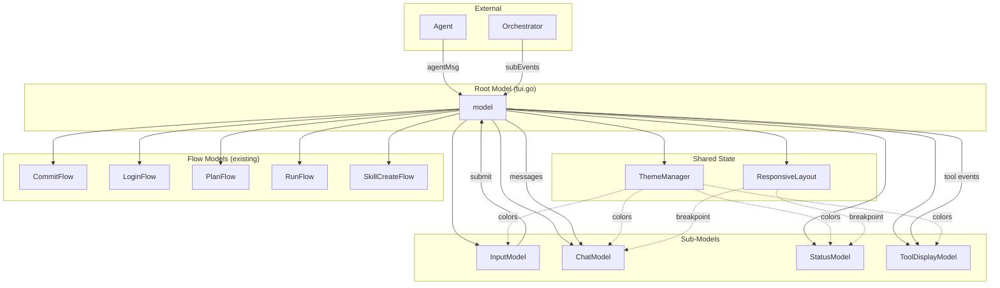

# nanocoder-tui — Detailed Design

## Overview

Refactor pi-go's monolithic TUI (`internal/tui/tui.go`, ~2600 lines) into composable Bubble Tea v2 sub-models and add 9 features inspired by nanocoder's TUI design. The core idea: decompose the single `model` struct into focused components (input, chat, status, theme, tool display), then layer on new capabilities (theming, @mentions, context tracking, tool previews, responsive layout, compact toggle, mode indicator, bash streaming, rich history).

## Detailed Requirements

### Functional Requirements

1. **Theme System** — 39 themes from nanocoder's `themes.json`, 13 color roles (text, base, primary, tool, success, error, secondary, info, warning, diffAdded, diffRemoved, diffAddedText, diffRemovedText), runtime switching via `/theme` command, persisted in user config.

2. **Responsive Terminal Layout** — Minimal adaptation: truncate file paths and abbreviate status labels on narrow terminals (< 60 cols). No layout restructuring.

3. **Tool Formatter Previews** — Per-tool renderers that produce rich display summaries (e.g., diff view for edits, syntax-highlighted code for reads, command + exit code for bash). Display-only — existing approval flow unchanged.

4. **File @Mentions** — Typing `@` in input triggers fuzzy file autocomplete. Selected file path is inserted as `@path/to/file` reference. Agent decides whether to read. Tab to select, arrow keys to navigate candidates.

5. **Context Window Percentage** — Always visible in the input/status area. Tracks token usage as percentage of model context limit. Warning color at configurable threshold (default 60%).

6. **Bash Streaming Progress** — Real-time output display during bash tool execution. Show command, live output preview, exit code on completion, estimated token count. Escape to cancel.

7. **Compact/Expanded Tool Toggle** — Ctrl+O toggles between full tool output and a running tally of tool counts. Accumulated counts shown on expand.

8. **Mode Indicator** — Visual indicator mapping to pi-go's existing modes (chat, plan). Displayed near the input area. Shows current mode with distinct color.

9. **Prompt History with Full State** — History entries preserve @mention references alongside text. Up/down arrows restore the exact input state including file references.

### Non-Functional Requirements

- Refactoring must not break existing functionality — all current slash commands, flows, and agent integration must work identically
- Theme system must use `//go:embed` for zero external file dependencies
- Sub-model decomposition should reduce `tui.go` from ~2600 lines to < 500 lines (routing + composition only)
- Each sub-model should be independently testable

## Architecture Overview



## Components and Interfaces

### 1. ThemeManager (`internal/tui/theme.go`)

Not a tea.Model — shared state passed by pointer to all rendering components.

```go
//go:embed themes.json
var themesJSON []byte

type ThemeManager struct {
    themes  map[string]Theme
    current string
}

type Theme struct {
    Name        string      `json:"name"`
    DisplayName string      `json:"displayName"`
    ThemeType   string      `json:"themeType"` // "dark" | "light"
    Colors      ThemeColors `json:"colors"`
}

type ThemeColors struct {
    Text            lipgloss.Color
    Base            lipgloss.Color
    Primary         lipgloss.Color
    Tool            lipgloss.Color
    Success         lipgloss.Color
    Error           lipgloss.Color
    Secondary       lipgloss.Color
    Info            lipgloss.Color
    Warning         lipgloss.Color
    DiffAdded       lipgloss.Color
    DiffRemoved     lipgloss.Color
    DiffAddedText   lipgloss.Color
    DiffRemovedText lipgloss.Color
}

func NewThemeManager() *ThemeManager
func (t *ThemeManager) Colors() ThemeColors
func (t *ThemeManager) SetTheme(name string) error
func (t *ThemeManager) Current() Theme
func (t *ThemeManager) List() []Theme
func (t *ThemeManager) IsDark() bool
```

**Theme persistence:** Current theme stored in `~/.pi-go/config.json` under `"theme"` key. Loaded on startup, saved on `/theme <name>`.

### 2. ResponsiveLayout (`internal/tui/layout.go`)

Utility for terminal-width-aware rendering decisions.

```go
type Breakpoint int

const (
    BreakpointNarrow Breakpoint = iota // < 60
    BreakpointNormal                    // 60-100
    BreakpointWide                      // > 100
)

type Layout struct {
    Width      int
    Height     int
    Breakpoint Breakpoint
}

func NewLayout(w, h int) Layout
func (l Layout) TruncatePath(path string, max int) string
func (l Layout) StatusWidth() int
func (l Layout) ChatWidth() int
func (l Layout) MaxPathLen() int  // 30 narrow, 50 normal, 80 wide
```

### 3. InputModel (`internal/tui/input.go`)

Handles text input, cursor, @mentions, completion, and history.

```go
type InputState struct {
    Text       string            // display text
    CursorPos  int
    Mentions   []FileMention     // @file references in the input
}

type FileMention struct {
    Path     string   // resolved file path
    StartIdx int      // position in Text
    EndIdx   int      // position in Text
}

type InputModel struct {
    state         InputState
    history       []InputState    // full state history
    historyIdx    int

    // Completion
    completion     string         // ghost text
    completionResult *CompleteResult
    completionMode   bool
    selectedIndex    int
    cyclingIdx       int

    // @mention autocomplete
    mentionMode    bool
    mentionCandidates []string
    mentionSelected   int

    // Shared refs
    theme  *ThemeManager
    layout Layout
}

func NewInputModel(theme *ThemeManager) InputModel
func (m InputModel) Update(msg tea.Msg) (InputModel, tea.Cmd)
func (m InputModel) View() string
func (m InputModel) Value() string           // assembled prompt text
func (m InputModel) MentionPaths() []string  // referenced file paths
func (m InputModel) IsEmpty() bool
func (m InputModel) Reset() InputModel
```

**@Mention flow:**
1. User types `@` → enter mention mode
2. Fuzzy match files in working directory (glob-based, not full content scan)
3. Show up to 5 candidates below input
4. Tab selects, arrows navigate, space/enter exits mention mode
5. Display shows `@filename`, prompt sent to agent includes `[Referenced file: path/to/file]`

**History:**
- `[]InputState` preserving text + mentions
- Max 1000 entries (same as current)
- Persisted to `~/.pi-go/history.json` (upgrade from plain text to JSON for state)
- Up/Down arrows cycle history, restoring full InputState

### 4. ChatModel (`internal/tui/chat.go`)

Handles message list, scrolling, and markdown rendering.

```go
type ChatModel struct {
    messages  []message
    scroll    int
    renderer  *glamour.TermRenderer

    // Streaming state
    streaming string
    thinking  string

    // Shared refs
    theme  *ThemeManager
    layout Layout
    tools  *ToolDisplayModel  // for formatted tool output
}

func NewChatModel(theme *ThemeManager) ChatModel
func (m ChatModel) Update(msg tea.Msg) (ChatModel, tea.Cmd)
func (m ChatModel) View() string
func (m *ChatModel) AddMessage(msg message)
func (m *ChatModel) UpdateStreaming(text string)
func (m *ChatModel) Clear()
func (m ChatModel) Messages() []message
```

**Rendering pipeline** (same as current, but using theme colors):
- User messages: `theme.Primary` for `>` prefix
- Assistant: glamour markdown (theme-aware style selection: dark/light based on `theme.IsDark()`)
- Tool: delegate to `ToolDisplayModel` for formatted output
- Thinking: `theme.Secondary` + italic
- Subagent: `theme.Info` for agent info

### 5. StatusModel (`internal/tui/status.go`)

Status bar with context percentage and mode indicator.

```go
type StatusModel struct {
    providerName string
    modelName    string
    gitBranch    string
    mode         string        // "chat" | "plan"

    // Context tracking
    contextPercent float64     // 0-100
    contextLimit   int         // model's max tokens
    contextUsed    int         // estimated tokens used

    // Active operations
    activeTools  map[string]time.Time
    activeTool   string
    toolStart    time.Time

    // Subagent tracking
    runState     *RunStatusInfo

    // Trace
    traceCount   int

    // Shared refs
    theme  *ThemeManager
    layout Layout
}

func NewStatusModel(theme *ThemeManager) StatusModel
func (m StatusModel) Update(msg tea.Msg) (StatusModel, tea.Cmd)
func (m StatusModel) View() string
func (m *StatusModel) SetContextUsage(used, limit int)
func (m *StatusModel) SetMode(mode string)
func (m *StatusModel) SetActiveTools(tools map[string]time.Time)
```

**Context percentage display:**
```
provider | model | ctx: 45% [████████░░░░░░░░] | ⌂ main | tool: read (1.2s)
```
- Bar uses `theme.Success` (< 60%), `theme.Warning` (60-80%), `theme.Error` (> 80%)
- On narrow terminals: `ctx: 45%` without the bar

**Mode indicator:**
```
[chat] or [plan]
```
- `chat` in `theme.Primary`, `plan` in `theme.Warning`
- Displayed at start of status bar

### 6. ToolDisplayModel (`internal/tui/tool_display.go`)

Tool formatting, previews, compact toggle, and bash streaming.

```go
type ToolDisplayModel struct {
    compact       bool                    // compact mode active
    compactCounts map[string]int          // tool name → count
    formatters    map[string]ToolFormatter

    // Bash streaming
    bashStreams   map[string]*BashStream  // executionID → stream

    // Shared refs
    theme  *ThemeManager
    layout Layout
}

type ToolFormatter func(name string, args map[string]any, result string, colors ThemeColors) string

type BashStream struct {
    Command       string
    OutputPreview string
    IsComplete    bool
    ExitCode      *int
    StartTime     time.Time
}

func NewToolDisplayModel(theme *ThemeManager) ToolDisplayModel
func (m ToolDisplayModel) Update(msg tea.Msg) (ToolDisplayModel, tea.Cmd)
func (m ToolDisplayModel) FormatToolCall(name string, args map[string]any) string
func (m ToolDisplayModel) FormatToolResult(name string, result string) string
func (m *ToolDisplayModel) ToggleCompact()
func (m ToolDisplayModel) IsCompact() bool
func (m ToolDisplayModel) CompactView() string     // running tally
func (m *ToolDisplayModel) StartBashStream(id, command string)
func (m *ToolDisplayModel) UpdateBashStream(id, output string)
func (m *ToolDisplayModel) CompleteBashStream(id string, exitCode int)
func (m ToolDisplayModel) BashStreamView(id string) string
```

**Built-in formatters:**

| Tool | Preview Format |
|------|---------------|
| `read` | Syntax-highlighted with line numbers (existing, themed) |
| `write` | `✓ path (N bytes)` |
| `edit` | Diff view: red for removed, green for added (using diffAdded/diffRemoved colors) |
| `bash` | Live streaming: command + output preview + exit code + tokens |
| `grep` | Highlighted matches with file:line context |
| `find`/`ls`/`tree` | Colored paths (dirs bold, files normal) |
| `agent` | Agent type + title + event stream |

**Compact mode (Ctrl+O):**
```
tools: read(3) edit(2) bash(1) grep(5)
```

**Bash streaming:**
```
⚒ bash: npm test
  > PASS src/app.test.ts (2.1s)
  > PASS src/utils.test.ts (0.8s)
  > ▌                              ← live cursor
```
On completion:
```
⚒ bash: npm test
  ● exit 0 (~340 tokens)
```

### 7. Root Model Composition (`internal/tui/tui.go`)

After refactoring, the root model becomes a thin router:

```go
type model struct {
    // Configuration
    cfg    Config
    ctx    context.Context
    cancel context.CancelFunc

    // Sub-models
    input   InputModel
    chat    ChatModel
    status  StatusModel
    tools   ToolDisplayModel

    // Shared state
    theme   *ThemeManager
    layout  Layout

    // Agent execution
    running bool
    agentCh chan agentMsg

    // Flow states (unchanged)
    commit          *commitState
    login           *loginState
    plan            *planState
    run             *runState
    pendingSkillCreate *pendingSkillCreate

    // Quit
    quitting bool
}
```

**Update() routing:**
```go
func (m *model) Update(msg tea.Msg) (tea.Model, tea.Cmd) {
    var cmds []tea.Cmd

    switch msg := msg.(type) {
    case tea.WindowSizeMsg:
        m.layout = NewLayout(msg.Width, msg.Height)
        // propagate to sub-models

    case tea.KeyPressMsg:
        if m.activeFlow() != nil {
            return m.routeToFlow(msg)
        }
        if msg.String() == "ctrl+o" {
            m.tools.ToggleCompact()
            return m, nil
        }
        m.input, cmd = m.input.Update(msg)
        cmds = append(cmds, cmd)

    case agentTextMsg, agentThinkingMsg:
        m.chat, cmd = m.chat.Update(msg)
        cmds = append(cmds, cmd)

    case agentToolCallMsg, agentToolResultMsg:
        m.tools, cmd = m.tools.Update(msg)
        m.chat, cmd2 = m.chat.Update(msg)
        cmds = append(cmds, cmd, cmd2)

    // ... flow messages routed to respective flows
    }

    return m, tea.Batch(cmds...)
}
```

**View() composition:**
```go
func (m *model) View() tea.View {
    v := tea.NewView()

    content := m.chat.View() + "\n" +
               m.status.View() + "\n" +
               m.input.View()

    // Viewport clipping (same as current)
    lines := strings.Split(content, "\n")
    available := m.layout.Height - 2 // leave room for chrome
    if len(lines) > available {
        lines = lines[len(lines)-available:]
    }

    v.SetContent(strings.Join(lines, "\n"))
    v.AltScreen = true
    return v
}
```

## Data Models

### Theme Persistence
```json
// ~/.pi-go/config.json
{
  "theme": "tokyo-night"
}
```

### History Format (upgrade)
```json
// ~/.pi-go/history.json
[
  {
    "text": "fix the login bug in @src/auth/login.go",
    "mentions": [
      {"path": "src/auth/login.go", "startIdx": 23, "endIdx": 42}
    ]
  }
]
```

Backward compatible: if `history.json` doesn't exist, import from plain text `history` file on first run.

## Error Handling

- **Theme loading failure:** Fall back to hardcoded default theme (current color scheme as "pi-classic")
- **Invalid theme name:** Return error from `SetTheme()`, keep current theme
- **@mention file not found:** Show candidate but mark with `(not found)` — still insert path, agent handles
- **Bash stream disconnection:** Show last known output + "stream lost" indicator
- **History corruption:** Log warning, start fresh history
- **Glamour render failure:** Fall back to plain text (existing behavior, preserved)

## Acceptance Criteria

### Theme System
- **Given** pi-go starts, **When** no theme is configured, **Then** "tokyo-night" is used as default
- **Given** user runs `/theme dracula`, **When** the theme exists, **Then** all UI colors change immediately and the choice persists across restarts
- **Given** user runs `/theme`, **When** no argument, **Then** list all 39 available themes with current marked
- **Given** user runs `/theme nonexistent`, **When** theme doesn't exist, **Then** show error with closest matches

### Responsive Layout
- **Given** terminal width < 60, **When** rendering status bar, **Then** file paths truncated to 30 chars and labels abbreviated
- **Given** terminal is resized, **When** WindowSizeMsg received, **Then** layout breakpoint updates and next render adapts

### Tool Formatter Previews
- **Given** an `edit` tool result, **When** rendering in chat, **Then** show diff with green/red coloring using theme diff colors
- **Given** a `read` tool result, **When** rendering, **Then** show syntax-highlighted code with line numbers
- **Given** compact mode is active, **When** tool result arrives, **Then** increment count instead of showing full output

### File @Mentions
- **Given** user types `@src/`, **When** in input, **Then** show fuzzy file completions from working directory
- **Given** user selects a file with Tab, **When** submitting prompt, **Then** prompt includes `[Referenced file: path]` for the agent
- **Given** user presses Up arrow, **When** previous input had @mentions, **Then** full InputState restored including mentions

### Context Window Percentage
- **Given** agent is running, **When** tokens accumulate, **Then** status bar shows updated percentage with color-coded bar
- **Given** context usage exceeds 60%, **When** rendering, **Then** percentage shown in warning color
- **Given** context usage exceeds 80%, **When** rendering, **Then** percentage shown in error color

### Bash Streaming
- **Given** bash tool is executing, **When** output arrives, **Then** show live preview in chat area
- **Given** bash completes, **When** rendering result, **Then** show exit code dot (green/red) and token estimate
- **Given** bash is running, **When** user presses Escape, **Then** cancel execution

### Compact/Expanded Toggle
- **Given** user presses Ctrl+O, **When** in expanded mode, **Then** switch to compact (running tally)
- **Given** user presses Ctrl+O, **When** in compact mode, **Then** expand and flush accumulated counts

### Mode Indicator
- **Given** user is in normal chat, **When** rendering, **Then** show `[chat]` in primary color
- **Given** user starts `/plan`, **When** plan flow active, **Then** show `[plan]` in warning color

### Prompt History
- **Given** user submits input with @mentions, **When** pressing Up arrow later, **Then** full state restored with @mention positions
- **Given** fresh install with old plain-text history, **When** starting, **Then** migrate to JSON format preserving entries

### Refactoring
- **Given** all changes applied, **When** running existing test suite, **Then** all tests pass
- **Given** refactored code, **When** counting lines in tui.go, **Then** root model is < 500 lines

## Testing Strategy

### Unit Tests
- **ThemeManager:** Load embedded JSON, set/get themes, fallback on invalid, hex→lipgloss conversion
- **InputModel:** @mention detection, cursor navigation, history cycling, state preservation
- **StatusModel:** Context percentage rendering, mode indicator, responsive truncation
- **ToolDisplayModel:** Each formatter, compact toggle, bash stream lifecycle
- **Layout:** Breakpoint calculation, path truncation

### Integration Tests (teatest)
- Full model: submit prompt → agent messages → rendered output matches theme colors
- Theme switching mid-conversation: verify colors change in subsequent renders
- @mention flow: type `@` → see candidates → Tab select → submit → verify prompt content
- Compact toggle: send tool results → Ctrl+O → verify compact view → Ctrl+O → verify expanded

### Backward Compatibility
- All existing slash commands work unchanged
- Session save/load works with new message format
- History migration from plain text to JSON
- No change to agent/orchestrator interfaces

## Appendices

### A. Technology Choices

| Component | Choice | Rationale |
|-----------|--------|-----------|
| Themes | nanocoder's themes.json (39 themes) | Proven, covers all major editor themes, 13 color roles sufficient |
| Theme storage | `//go:embed` | Zero external deps, single binary |
| Hex colors | `lipgloss.Color("#hex")` | Native support, no conversion needed |
| History format | JSON | Needed for structured InputState, backward-compatible migration |
| File autocomplete | `filepath.Glob` + fuzzy scoring | Simple, no external deps, fast enough for TUI |
| Markdown | glamour (existing) | Already integrated, theme-aware via dark/light detection |
| Syntax highlight | chroma (existing) | Already integrated, monokai style |

### B. Research Findings Summary

- Nanocoder's Ink/React architecture maps cleanly to Bubble Tea sub-models
- The 13-color-role system covers all of pi-go's current hardcoded colors plus adds diff highlighting
- `//go:embed` for themes.json adds ~800 bytes to binary — negligible
- Bubble Tea v2's `tea.View` with AltScreen handles viewport management, no custom scrolling needed
- Current pi-go has 6 natural component boundaries matching the proposed sub-model split

### C. Alternative Approaches Considered

1. **Build custom theme format** — Rejected: nanocoder's format is proven and directly reusable
2. **Full responsive layout (3 breakpoints with different layouts)** — Deferred: user chose minimal responsive (truncation only)
3. **Replace approval flow with nanocoder-style confirm/cancel** — Rejected: user wants display-only previews
4. **Inject full file content for @mentions** — Rejected: user prefers path-only reference, agent reads if needed
5. **Cross-session persistent history** — Deferred to future iteration
