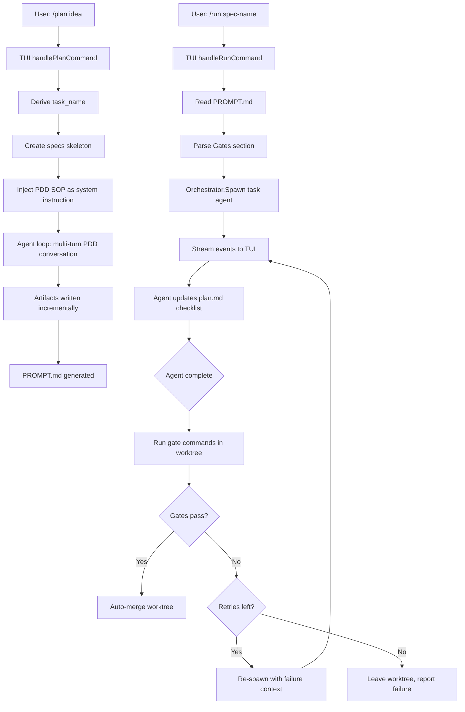

# Design: /plan and /run Commands with PDD SOP Workflow

## Overview

Add two new slash commands to pi-go that implement a Prompt-Driven Development pipeline:

- **`/plan <rough idea>`** — Interactive multi-turn PDD session that produces structured spec artifacts (`specs/{task_name}/`) culminating in a `PROMPT.md` ready for autonomous execution.
- **`/run <spec-name>`** — Spawns a task subagent in an isolated git worktree to execute the `PROMPT.md`, with streaming output, plan.md progress tracking, build/test gates, auto-retry on failure, and auto-merge on success.

Together they form pi-go's native `plan → run` pipeline, inspired by ralph-orchestrator but simplified to leverage the existing subagent system.

## Detailed Requirements

### /plan Command

1. User invokes `/plan <rough idea text>` in the TUI
2. The current agent session is repurposed with the PDD SOP injected as a system instruction
3. The LLM drives the multi-turn conversation following the SOP phases:
   - **Skeleton creation**: Create `specs/{task_name}/` with rough-idea.md, empty requirements.md, research/ directory
   - **Requirements clarification**: Ask questions one at a time, append Q&A to requirements.md incrementally
   - **Research**: Investigate codebase, technologies; write findings to `research/` as topic files
   - **Design**: Write `design.md` — standalone document with architecture, components, acceptance criteria
   - **Implementation plan**: Write `plan.md` — numbered steps with checklist
   - **PROMPT.md generation**: Compressed briefing with Objective, Key Requirements, Acceptance Criteria, Gates, References, Constraints
4. The LLM discovers project build/test commands during the plan phase and embeds them in PROMPT.md's `## Gates` section
5. `task_name` is derived as kebab-case from the rough idea
6. Uses the "default" model role with full tool access

### /run Command

1. User invokes `/run <spec-name>` in the TUI
2. Command reads `specs/<spec-name>/PROMPT.md`
3. Spawns a "task" type subagent via the Orchestrator with:
   - PROMPT.md content as the prompt
   - Git worktree isolation
   - Full streaming output to TUI
4. As the agent completes plan steps, it updates `plan.md` checklist (`[ ]` → `[x]`)
5. On agent completion, parses `## Gates` from PROMPT.md and runs each gate command in the worktree
6. If gates pass → auto-merge worktree branch back to current branch
7. If gates fail → re-spawn agent with failure output to fix issues (max 3 retries)
8. After max retries exhausted → leave worktree intact, report failure

### PDD SOP Instruction

- Shipped as an embedded Go string constant (default)
- Can be overridden by placing a file at `.pi-go/sops/pdd.md` in the project root or `~/.pi-go/sops/pdd.md` globally
- Override resolution: project-level → global-level → embedded default

## Architecture Overview



## Components and Interfaces

### 1. PDD SOP Loader (`internal/sop/`)

New package responsible for loading SOP instructions.

```go
package sop

// Load returns the PDD SOP instruction text.
// Resolution order: project .pi-go/sops/pdd.md → global ~/.pi-go/sops/pdd.md → embedded default.
func LoadPDD(workDir string) (string, error)

// Embedded default SOP constant.
const DefaultPDDSOP = `...`
```

### 2. Plan Command Handler (`internal/tui/plan.go`)

New file containing the `/plan` command logic.

```go
// handlePlanCommand processes "/plan <rough idea>" input.
// 1. Extracts rough idea text from input
// 2. Derives task_name as kebab-case
// 3. Creates specs/{task_name}/ skeleton via file writes
// 4. Loads PDD SOP instruction
// 5. Injects SOP + skeleton context as system instruction override
// 6. Sends the rough idea as the first user message to the agent
// 7. Returns to normal agent loop (LLM drives the PDD conversation)
func (m *model) handlePlanCommand(parts []string) (tea.Model, tea.Cmd)

// toKebabCase converts a rough idea string to a kebab-case task name.
func toKebabCase(idea string) string
```

### 3. Run Command Handler (`internal/tui/run.go`)

New file containing the `/run` command logic.

```go
// handleRunCommand processes "/run <spec-name>" input.
// 1. Validates specs/<spec-name>/PROMPT.md exists
// 2. Reads PROMPT.md content
// 3. Parses ## Gates section for gate commands
// 4. Spawns task subagent via Orchestrator
// 5. Sets up streaming event forwarding to TUI
// 6. On completion, runs gate validation
// 7. Handles merge or retry logic
func (m *model) handleRunCommand(parts []string) (tea.Model, tea.Cmd)

// parseGates extracts gate commands from PROMPT.md content.
// Returns list of Gate{Name, Command} from the ## Gates section.
func parseGates(promptMD string) []Gate

// Gate represents a validation gate command.
type Gate struct {
    Name    string // e.g., "build", "test"
    Command string // e.g., "go build ./..."
}

// runState tracks /run execution state.
type runState struct {
    specName   string
    promptMD   string
    gates      []Gate
    agentID    string
    retries    int
    maxRetries int // default: 3
    phase      string // "running", "gating", "merging", "failed"
}
```

### 4. Gate Runner (`internal/tui/gates.go`)

```go
// runGates executes gate commands in the worktree directory.
// Returns nil if all gates pass, or error with failure details.
func runGates(ctx context.Context, worktreePath string, gates []Gate) (string, error)
```

### 5. TUI Message Types

```go
// runAgentEventMsg wraps streaming events from /run subagent.
type runAgentEventMsg struct {
    event subagent.Event
}

// runAgentDoneMsg signals the /run subagent has completed.
type runAgentDoneMsg struct {
    agentID string
    result  string
    err     error
}

// runGateResultMsg signals gate validation results.
type runGateResultMsg struct {
    passed  bool
    output  string
    err     error
}

// runMergeResultMsg signals merge completion.
type runMergeResultMsg struct {
    output string
    err    error
}
```

### 6. System Instruction Injection

For `/plan`, the agent's system instruction needs to be augmented with the PDD SOP. Two approaches considered:

**Chosen approach**: Create a new agent session with the SOP prepended to the system instruction. The `/plan` command:
1. Loads the PDD SOP text
2. Constructs a combined system instruction: `PDD SOP + "\n\nProject context:\n" + existing system instruction`
3. Resets the agent conversation (like `/clear`)
4. Sets the new system instruction
5. Sends the rough idea as the first user message

This keeps the agent loop unchanged — the LLM simply follows the SOP instructions naturally.

### 7. PROMPT.md Template

The PDD SOP instruction includes the PROMPT.md template that the LLM should produce:

```markdown
# <Title>

## Objective
<1-3 sentences>

## Key Requirements
1. **<Name>** — <description>

## Acceptance Criteria
### <Feature Area>
- Given <precondition>, when <action>, then <expected outcome>

## Gates
- **build**: `<build command>`
- **test**: `<test command>`

## Reference
- Design: `specs/<task_name>/design.md`
- Plan: `specs/<task_name>/plan.md`
- Requirements: `specs/<task_name>/requirements.md`
- Research: `specs/<task_name>/research/`

## Constraints
- <constraints discovered during planning>
```

### 8. Plan.md Checklist Updates

The `/run` agent's instruction includes guidance to update `plan.md` checklist items:
- After completing each step, change `- [ ] Step N:` to `- [x] Step N:`
- This is done via the agent's write/edit tools in the worktree
- After merge, the updated plan.md reflects progress in the main branch

## Data Models

### Run Execution State

```go
type runState struct {
    specName     string       // e.g., "plan-command-sop"
    specDir      string       // e.g., "specs/plan-command-sop"
    promptMD     string       // Full PROMPT.md content
    gates        []Gate       // Parsed gate commands
    agentID      string       // Current subagent ID
    worktreePath string       // Worktree directory path
    retries      int          // Current retry count
    maxRetries   int          // Max retries (default 3)
    phase        string       // "running" | "gating" | "merging" | "retrying" | "done" | "failed"
    gateOutput   string       // Last gate failure output (for retry context)
}
```

### Gate Definition

```go
type Gate struct {
    Name    string // Human-readable name
    Command string // Shell command to execute
}
```

## Error Handling

### /plan Errors
| Error | Handling |
|-------|----------|
| No rough idea provided | Show usage: `/plan <rough idea text>` |
| `specs/{task_name}/` already exists | Show error, suggest different name or manual cleanup |
| SOP file override not readable | Fall back to embedded default, log warning |
| Agent session reset fails | Show error, suggest `/clear` manually |

### /run Errors
| Error | Handling |
|-------|----------|
| No spec-name provided | Show usage: `/run <spec-name>` |
| `specs/<spec-name>/PROMPT.md` not found | Show error, list available specs |
| No `## Gates` section in PROMPT.md | Skip gate validation, merge directly |
| Orchestrator.Spawn fails | Show error (pool full, worktree creation failed, etc.) |
| Agent crashes mid-execution | Show error, leave worktree for inspection |
| Gate fails, retries exhausted | Show failure output, leave worktree path for manual fix |
| Merge conflict | Show conflict details, leave worktree for manual resolution |

## Acceptance Criteria

### /plan Command
- Given user types `/plan add rate limiting to API`, when command executes, then `specs/add-rate-limiting-to-api/` directory is created with rough-idea.md
- Given `/plan` starts, when LLM drives conversation, then requirements.md is updated after each Q&A exchange
- Given PDD SOP completes, when all phases done, then PROMPT.md exists with Objective, Key Requirements, Acceptance Criteria, Gates, Reference, and Constraints sections
- Given `.pi-go/sops/pdd.md` exists in project, when `/plan` runs, then custom SOP is used instead of embedded default
- Given no custom SOP file, when `/plan` runs, then embedded default SOP is used
- Given rough idea "build a rate limiter", when task_name derived, then result is "build-a-rate-limiter"

### /run Command
- Given valid spec-name with PROMPT.md, when `/run spec-name` executes, then task subagent spawns in isolated worktree
- Given running subagent, when events stream, then TUI shows text deltas, tool calls, and tool results in real-time
- Given agent completes a plan step, when step finished, then plan.md checklist item is marked `[x]`
- Given agent completes successfully, when gates pass, then worktree branch is auto-merged to current branch
- Given agent completes, when gate fails, then agent is re-spawned with failure context
- Given gate fails 3 times, when max retries exhausted, then worktree is left intact and failure is reported
- Given no `## Gates` section in PROMPT.md, when agent completes, then merge proceeds without validation
- Given `specs/<spec-name>/PROMPT.md` does not exist, when `/run` invoked, then error shown with list of available specs

### Integration
- Given `/plan` completes producing PROMPT.md, when user runs `/run` with same spec-name, then the full plan-to-execution pipeline works end-to-end
- Given `/run` with full streaming, when user checks `/agents`, then the running task agent is visible

## Testing Strategy

### Unit Tests
- `TestToKebabCase` — various inputs (spaces, special chars, mixed case)
- `TestParseGates` — extract gates from PROMPT.md content
- `TestParseGates_NoSection` — missing Gates section returns empty list
- `TestParseGates_Malformed` — graceful handling of bad format
- `TestLoadPDD_EmbeddedDefault` — no override file, returns embedded
- `TestLoadPDD_ProjectOverride` — project file takes precedence
- `TestLoadPDD_GlobalOverride` — global file used when no project file

### Integration Tests
- `TestPlanCommand_CreatesSpecSkeleton` — verify directory structure created
- `TestPlanCommand_ExistingDir` — verify error on duplicate
- `TestRunCommand_SpawnsAgent` — verify orchestrator called with correct args
- `TestRunCommand_GatePass` — verify merge on gate success
- `TestRunCommand_GateFailRetry` — verify retry spawns new agent with context
- `TestRunCommand_MaxRetries` — verify failure after 3 retries
- `TestRunCommand_NoGates` — verify merge without validation

### E2E Tests
- `TestE2E_PlanToRun` — full pipeline: `/plan` generates PROMPT.md, `/run` executes it

## Appendices

### Technology Choices
- No new dependencies — uses existing subagent/orchestrator, TUI framework, file tools
- PDD SOP stored as Go `embed` directive for the default, `os.ReadFile` for overrides
- Gate commands executed via `exec.Command` in worktree directory (same pattern as existing bash tool)

### Alternative Approaches Considered

1. **Custom TUI state machine for /plan** — Rejected (Q5). Too complex, the agent loop already handles multi-turn conversations well. The PDD SOP as system instruction is simpler and more flexible.

2. **In-session execution for /run** — Rejected (Q4). Subagent with worktree provides isolation, non-blocking execution, and clean merge semantics.

3. **Manual merge after /run** — Rejected (Q10). Auto-merge reduces friction. Gate validation provides the safety net.

4. **Hardcoded Go gate commands** — Rejected (Q12). Discovering during /plan makes it project-agnostic.

### File Map

| New File | Purpose |
|----------|---------|
| `internal/sop/sop.go` | PDD SOP loader (embedded + override) |
| `internal/sop/pdd_default.go` | Embedded default PDD SOP constant |
| `internal/tui/plan.go` | /plan command handler |
| `internal/tui/run.go` | /run command handler + gate runner |
| `internal/tui/run_test.go` | Tests for /run (gate parsing, state management) |
| `internal/tui/plan_test.go` | Tests for /plan (kebab-case, skeleton creation) |
| `internal/sop/sop_test.go` | Tests for SOP loading |
