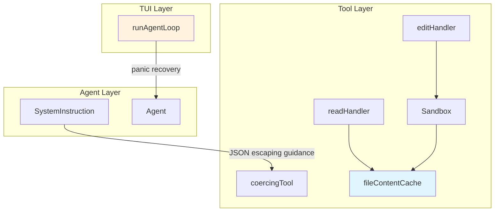

# Design: Session Log Optimizations

## Objective

Implement 6 optimizations to improve the reliability, robustness, and performance of the pi-go coding agent's tool layer.

---

## Current State

### Tool Layer Architecture

```
cli.go
└── tools.NewSandbox(cwd) → Sandbox
    └── tools.CoreTools(sandbox) → []tool.Tool
        ├── readHandler(sb, input)     ← No caching, no retry
        ├── editHandler(sb, input)     ← No retry, exact match only
        ├── Sandbox.ReadFile/WriteFile  ← No retry, no atomicity
        └── 8 other tools...

agent.go
└── SystemInstruction (8 sections, no JSON escaping guidance)

tui.go
└── runAgentLoop() ← No panic recovery
```

### Key Issues

1. **No JSON escaping guidance** - LLMs may send malformed paths
2. **Edit failures** - "old_string not found" with no retry or suggestions
3. **Security unclear** - Path escape errors confusing without context
4. **Read failures** - No retry for transient filesystem errors
5. **No panic recovery** - TUI goroutines can die silently
6. **No file caching** - Every read hits filesystem fresh

---

## Desired End State

### After All Optimizations

```
cli.go
└── tools.NewSandbox(cwd) → Sandbox (+ transient retry)
    └── tools.CoreTools(sandbox) → []tool.Tool
        ├── readHandler(sb, input, cache)     ← + caching, + retry
        ├── editHandler(sb, input)            ← + retry, + fuzzy hints
        ├── Sandbox.ReadFile/WriteFile         ← + transient retry
        └── 8 other tools...

agent.go
└── SystemInstruction (9 sections, + JSON escaping)

tui.go
└── runAgentLoop() ← + panic recovery

internal/tools/
└── cache.go ← New file content cache
```

---

## Architecture Diagram



---

## Component Specifications

### 1. System Instruction Enhancement

**File**: `internal/agent/agent.go` (lines 36-112)

**Change**: Add JSON escaping section to `SystemInstruction`

```go
// New section to add around line 103 (before Subagents section):

# JSON String Escaping

When sending tool parameters that contain file paths or strings with special characters:
- Always escape backslashes in JSON: use `\\` not `\`
- For Windows paths like `C:\Users\test`, send as `"C:\\Users\\test"` in JSON
- Verify paths are properly escaped before calling tools that require file_path

Example INCORRECT (will cause tool errors):
{"file_path": "C:\Users\test\file.go"}

Example CORRECT:
{"file_path": "C:\\Users\\test\\file.go"}
```

### 2. Edit Handler Retry

**File**: `internal/tools/edit.go`

**Changes**:
- Add `reReadFile()` helper for retry logic
- Add `buildEditNotFoundError()` for enhanced errors
- Modify `editHandler` to retry once on "not found"

```go
// Add to edit.go

func reReadFile(sb *Sandbox, path string) ([]byte, error) {
    return sb.ReadFile(path)
}

func buildEditNotFoundError(input EditInput, content string) error {
    preview := content
    if len(preview) > 500 {
        preview = preview[:500] + "\n..."
    }
    return fmt.Errorf(`old_string not found in file

Expected:
%s

File preview (first 500 chars):
%s

Suggestions:
- Verify the exact text matches including whitespace
- Use the Read tool to see current file content
- Try a smaller, unique portion of the old_string`,
        input.OldString, preview)
}
```

**editHandler modification** (around lines 50-65):

```go
// Replace the single read with retry logic:
data, err := sb.ReadFile(input.FilePath)
if err != nil {
    return EditOutput{}, fmt.Errorf("reading file: %w", err)
}
content := string(data)
count := strings.Count(content, input.OldString)

// If not found, retry once (file may have been modified)
if count == 0 {
    data2, err2 := reReadFile(sb, input.FilePath)
    if err2 == nil {
        content = string(data2)
        count = strings.Count(content, input.OldString)
    }
}

if count == 0 {
    return EditOutput{}, buildEditNotFoundError(input, content)
}
```

### 3. Sandbox Documentation

**File**: `internal/tools/sandbox.go`

**Add godoc to `Sandbox` struct and `Resolve` method**:

```go
// Sandbox provides a secure file system abstraction that restricts
// all file operations to a specific directory tree.
//
// SECURITY MODEL:
//   - All file paths are resolved relative to the sandbox root
//   - Access outside the sandbox is blocked via os.Root (Go 1.24+)
//   - This prevents the agent from accessing sensitive files outside
//     the working directory
//
// LIMITATIONS:
//   - Files outside the sandbox cannot be accessed
//   - Symlinks pointing outside are blocked
//   - Absolute paths are converted to relative
//
// WORKAROUNDS:
//   - Change the working directory to access different files
//   - Use tools that explicitly access external resources (e.g., fetch URLs)
type Sandbox struct { ... }

// Resolve converts an absolute or relative path to a relative path
// under the sandbox root. os.Root enforces that the resolved path
// cannot escape the directory tree (via ".." or symlinks).
//
// SECURITY: This is intentional. The sandbox restricts file system
// access to prevent the agent from reading/writing files outside
// the working directory.
//
// ERROR: Returns error if absolute path is outside sandbox.
// Include sandbox path in error message for debugging.
func (s *Sandbox) Resolve(name string) (string, error) { ... }
```

### 4. File Read Retry

**File**: `internal/tools/sandbox.go`

**Add retry constants and functions**:

```go
const (
    maxReadRetries   = 3
    readRetryDelay   = 50 * time.Millisecond
)

// isTransientReadError returns true for errors that might succeed on retry.
func isTransientReadError(err error) bool {
    if err == nil {
        return false
    }
    msg := err.Error()
    transient := []string{
        "text file busy",
        "resource temporarily unavailable",
        "input/output error",
    }
    for _, t := range transient {
        if strings.Contains(msg, t) {
            return true
        }
    }
    // Also check standard interfaces
    if errors.Is(err, syscall.ETIMEDOUT) {
        return true
    }
    return false
}
```

**Modify `ReadFile` method**:

```go
func (s *Sandbox) ReadFile(name string) ([]byte, error) {
    rel, err := s.Resolve(name)
    if err != nil {
        return nil, err
    }

    var lastErr error
    for attempt := 0; attempt < maxReadRetries; attempt++ {
        data, err := s.root.ReadFile(rel)
        if err == nil {
            return data, nil
        }

        if !isTransientReadError(err) {
            return nil, err
        }
        lastErr = err

        if attempt < maxReadRetries-1 {
            time.Sleep(readRetryDelay * time.Duration(attempt+1))
        }
    }
    return nil, lastErr
}
```

### 5. TUI Panic Recovery

**File**: `internal/tui/tui.go`

**Modify `runAgentLoop`** (around line 1365):

```go
func (m *model) runAgentLoop(prompt string) {
    defer close(m.agentCh)
    defer func() {  // ADD: panic recovery
        if r := recover(); r != nil {
            log.Printf("agent loop panicked: %v\n%s", r, debug.Stack())
            m.agentCh <- agentDoneMsg{err: fmt.Errorf("agent panic: %v", r)}
        }
    }()

    for ev, err := range m.cfg.Agent.RunStreaming(m.ctx, m.cfg.SessionID, prompt) {
        // ... existing code ...
    }
}
```

**Add import** (if not present):
```go
import (
    "runtime/debug"
)
```

### 6. File Content Cache

**New File**: `internal/tools/cache.go`

```go
package tools

import (
    "sync"
    "time"
)

// fileContentCache stores recently read file contents to reduce duplicate reads.
type fileContentCache struct {
    mu      sync.RWMutex
    entries map[string]*cachedFile
    maxSize int           // max entries before eviction
    maxAge  time.Duration // max age before refresh
}

type cachedFile struct {
    content    []byte
    totalLines int
    readAt     time.Time
    size       int64
    mtime      int64 // modification time for invalidation
}

// NewFileContentCache creates a new file content cache.
func NewFileContentCache(maxSize int, maxAge time.Duration) *fileContentCache {
    return &fileContentCache{
        entries: make(map[string]*cachedFile),
        maxSize: maxSize,
        maxAge:  maxAge,
    }
}

// Get returns cached content if valid (mtime matches).
func (c *fileContentCache) Get(path string, mtime int64) []byte {
    c.mu.RLock()
    defer c.mu.RUnlock()
    
    entry, ok := c.entries[path]
    if !ok {
        return nil
    }
    if entry.mtime != mtime {
        return nil // invalidated
    }
    if time.Since(entry.readAt) > c.maxAge {
        return nil // expired
    }
    return entry.content
}

// Put stores content in cache.
func (c *fileContentCache) Put(path string, content []byte, mtime int64) {
    c.mu.Lock()
    defer c.mu.Unlock()
    
    // Evict oldest if at capacity
    if len(c.entries) >= c.maxSize {
        c.evictOldest()
    }
    
    c.entries[path] = &cachedFile{
        content: content,
        readAt:  time.Now(),
        mtime:  mtime,
        size:   int64(len(content)),
    }
}

// Invalidate removes a path from cache.
func (c *fileContentCache) Invalidate(path string) {
    c.mu.Lock()
    defer c.mu.Unlock()
    delete(c.entries, path)
}

func (c *fileContentCache) evictOldest() {
    var oldest string
    var oldestTime time.Time
    for path, entry := range c.entries {
        if oldestTime.IsZero() || entry.readAt.Before(oldestTime) {
            oldest = path
            oldestTime = entry.readAt
        }
    }
    if oldest != "" {
        delete(c.entries, oldest)
    }
}
```

**Integration with readHandler** (`read.go`):

```go
type readHandlerDeps struct {
    sandbox *Sandbox
    cache   *fileContentCache
}

func readHandler(sb *Sandbox, input ReadInput) (ReadOutput, error) {
    return readHandlerWithDeps(sb, input, nil)
}

func readHandlerWithDeps(sb *Sandbox, input ReadInput, cache *fileContentCache) (ReadOutput, error) {
    if input.FilePath == "" {
        return ReadOutput{}, fmt.Errorf("file_path is required")
    }

    // Get file info for mtime-based cache
    info, err := sb.Stat(input.FilePath)
    if err != nil {
        return ReadOutput{}, fmt.Errorf("reading file: %w", err)
    }
    mtime := info.ModTime().Unix()

    // Check cache first
    if cache != nil {
        if cached := cache.Get(input.FilePath, mtime); cached != nil {
            return processReadOutput(string(cached), input.Offset, input.Limit)
        }
    }

    // Read from filesystem
    data, err := sb.ReadFile(input.FilePath)
    if err != nil {
        return ReadOutput{}, fmt.Errorf("reading file: %w", err)
    }
    content := string(data)

    // Update cache
    if cache != nil {
        cache.Put(input.FilePath, data, mtime)
    }

    return processReadOutput(content, input.Offset, input.Limit)
}

// Invalidate cache after edit
func InvalidateCache(cache *fileContentCache, path string) {
    if cache != nil {
        cache.Invalidate(path)
    }
}
```

---

## Data Models

### FileContentCache

```go
type fileContentCache struct {
    mu      sync.RWMutex
    entries map[string]*cachedFile  // path → cached content
    maxSize int                      // LRU eviction threshold
    maxAge  time.Duration            // staleness threshold
}

type cachedFile struct {
    content    []byte    // raw file content
    readAt     time.Time // when cached
    mtime      int64     // file modification time
}
```

### Session State Keys (for future)

```go
const (
    KeyFileReads = "file_reads"  // []FileReadEntry
)

type FileReadEntry struct {
    Path      string    `json:"path"`
    Lines     int       `json:"lines"`
    ReadAt    time.Time `json:"read_at"`
    Truncated bool      `json:"truncated"`
}
```

---

## Patterns to Follow

### Panic Recovery (from compactor.go:159-163)

```go
func safeOperation(input T) (result T) {
    result = input
    defer func() {
        if r := recover(); r != nil {
            log.Printf("operation %q panicked: %v", name, r)
        }
    }()
    return processed
}
```

### Transient Error Detection (from agent/retry.go)

```go
func isTransient(err error) bool {
    patterns := []string{"timeout", "connection refused", ...}
    for _, p := range patterns {
        if strings.Contains(err.Error(), p) {
            return true
        }
    }
    return false
}
```

### Channel-Based Error Propagation (from tui.go)

```go
type agentDoneMsg struct{ err error }

func worker() {
    defer close(ch)
    defer func() {
        if r := recover(); r != nil {
            ch <- agentDoneMsg{err: fmt.Errorf("panic: %v", r)}
        }
    }()
    // ... work ...
}
```

---

## Error Handling Strategy

| Component | Error Handling | Retry Strategy |
|---|---|---|
| `editHandler` | Return enhanced error with preview | 1 re-read on "not found" |
| `Sandbox.ReadFile` | Return nil on transient, propagate others | 3 retries with backoff |
| `readHandler` | Return error immediately | No internal retry (relies on cache) |
| `runAgentLoop` | Send error via channel, log stack | No retry (goroutine restart) |

---

## Acceptance Criteria

### Optimization 1: JSON Validation

- **Given** the system prompt contains JSON escaping guidance, **when** an LLM generates tool parameters with a Windows path, **then** the path should be properly escaped as `"C:\\Users\\test"`.

### Optimization 2: old_string Not Found

- **Given** an edit operation where the old_string is not found, **when** the file was recently modified, **then** the handler re-reads the file once and retries the match.
- **Given** an edit operation where old_string is still not found after retry, **when** the handler fails, **then** the error includes the expected old_string, a file preview (500 chars), and suggestions.

### Optimization 3: Path Escapes Security

- **Given** a file access attempt outside the sandbox, **when** the error is returned, **then** the error message explains the sandbox restriction and suggests alternatives.

### Optimization 4: File Read Retry

- **Given** a file read that encounters a transient error (e.g., "text file busy"), **when** the error is transient, **then** the handler retries up to 3 times with increasing delay.
- **Given** a file read that encounters a non-transient error (e.g., permission denied), **when** the error is permanent, **then** the handler returns immediately without retry.

### Optimization 5: Test Panics

- **Given** a panic in `runAgentLoop`, **when** the panic occurs, **then** it is recovered, logged with stack trace, and sent as an error message via channel.

### Optimization 6: File Content Cache

- **Given** a file is read twice in quick succession, **when** the second read occurs, **then** the content is served from cache if mtime matches.
- **Given** a file is written or edited, **when** the cache contains that file, **then** the cache entry is invalidated.

---

## Testing Strategy

### Unit Tests

1. **edit_test.go**: Test retry logic with mocked filesystem
2. **cache_test.go**: Test hit/miss/invalidation behavior
3. **sandbox_test.go**: Test transient error detection and retry

### Integration Tests

1. **tools_test.go**: Test edit → cache invalidation flow
2. **tui_test.go**: Test panic recovery in goroutine (mock agent)

### Race Detection

```bash
go test -race ./internal/tools/... ./internal/tui/...
```

---

## Implementation Order

1. **Optimization 3** (Security docs) - No code, pure documentation
2. **Optimization 1** (JSON instructions) - Add to system prompt
3. **Optimization 2** (Edit retry) - Modify edit.go
4. **Optimization 4** (Read retry) - Modify sandbox.go
5. **Optimization 5** (Panic recovery) - Modify tui.go
6. **Optimization 6** (File cache) - New cache.go + modify read.go

---

## Files to Modify

| File | Changes |
|---|---|
| `internal/agent/agent.go` | Add JSON escaping to SystemInstruction |
| `internal/tools/edit.go` | Add retry + enhanced error messages |
| `internal/tools/sandbox.go` | Add transient retry + godoc |
| `internal/tools/cache.go` | **NEW** - File content cache |
| `internal/tools/read.go` | Integrate cache |
| `internal/tui/tui.go` | Add panic recovery to runAgentLoop |
| `ARCHITECTURE.md` | Add security section (optional) |
