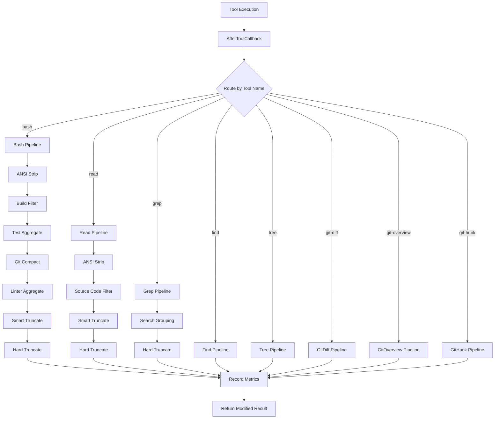

# Design — RTK Output Compactor for pi-go

## Overview

A Go-native output compaction system that reduces token consumption by intelligently processing tool output before it reaches the LLM. Implemented as an ADK `AfterToolCallback` that replaces the existing per-tool truncation with a centralized, multi-stage compaction pipeline.

The compactor fires after every tool execution, detects the output type (build log, test result, git diff, linter output, etc.), and applies appropriate compaction techniques. Session metrics track savings and are viewable via `/rtk stats`.

---

## Detailed Requirements

### Functional
1. Compact output from all tools: bash, read, grep, find, tree, git-diff, git-overview, git-hunk
2. Apply 9 compaction stages: ANSI stripping, test aggregation, build filtering, git compaction, linter aggregation, search grouping, smart truncation, hard truncation, source code filtering
3. Replace existing `truncateOutput()` / `truncateLine()` calls in tools — compactor is the single point of output processing
4. Enabled by default with all stages active
5. Configurable per-stage toggles in config.json
6. Track per-session compaction metrics (original size, compacted size, techniques used, per tool)
7. `/rtk stats` slash command displays session metrics
8. TUI shows compaction indicator on tool output (not sent to LLM)

### Non-Functional
- Compaction must be fast (< 10ms for typical output) — no external processes
- Must not lose critical information (errors, failures, file paths)
- Must be deterministic — same input produces same output

---

## Architecture Overview



### Callback Placement

```
Shell hooks (config.json) → RTK Compactor → LSP hooks → Final result to LLM
```

Wired in `cli.go`:
```go
afterCBs := extension.BuildAfterToolCallbacks(hooks)
afterCBs = append(afterCBs, tools.BuildCompactorCallback(compactorCfg, metrics))
afterCBs = append(afterCBs, lsp.BuildLSPAfterToolCallback(lspMgr))
```

---

## Components and Interfaces

### Core Types

```go
// CompactorConfig holds all compaction settings, loaded from config.json.
type CompactorConfig struct {
    Enabled                bool `json:"enabled"`
    StripAnsi              bool `json:"strip_ansi"`
    AggregateTestOutput    bool `json:"aggregate_test_output"`
    FilterBuildOutput      bool `json:"filter_build_output"`
    CompactGitOutput       bool `json:"compact_git_output"`
    AggregateLinterOutput  bool `json:"aggregate_linter_output"`
    GroupSearchOutput      bool `json:"group_search_output"`
    SmartTruncate          bool `json:"smart_truncate"`
    SourceCodeFiltering    string `json:"source_code_filtering"` // "none", "minimal", "aggressive"

    // Limits (doubled from rtk-optimizer defaults)
    MaxChars          int `json:"max_chars"`           // 24000
    MaxLines          int `json:"max_lines"`            // 440
    MaxTestFailures   int `json:"max_test_failures"`    // 10
    MaxTestFailLines  int `json:"max_test_fail_lines"`  // 8
    MaxBuildErrors    int `json:"max_build_errors"`      // 10
    MaxBuildErrLines  int `json:"max_build_err_lines"`   // 20
    MaxDiffLines      int `json:"max_diff_lines"`        // 100
    MaxDiffHunkLines  int `json:"max_diff_hunk_lines"`   // 20
    MaxStatusFiles    int `json:"max_status_files"`      // 10
    MaxLogEntries     int `json:"max_log_entries"`        // 40
    MaxLinterRules    int `json:"max_linter_rules"`      // 20
    MaxLinterFiles    int `json:"max_linter_files"`      // 20
    MaxSearchPerFile  int `json:"max_search_per_file"`   // 20
    MaxSearchTotal    int `json:"max_search_total"`      // 100
}

// CompactResult is returned by each compaction pipeline.
type CompactResult struct {
    Output     string   // compacted output text
    Techniques []string // techniques applied (e.g., "ansi", "test-aggregate")
    OrigSize   int      // original size in bytes
    CompSize   int      // compacted size in bytes
}

// CompactMetrics tracks per-session compaction statistics.
type CompactMetrics struct {
    mu      sync.Mutex
    Records []CompactRecord
}

type CompactRecord struct {
    Tool       string   `json:"tool"`
    Techniques []string `json:"techniques"`
    OrigSize   int      `json:"orig_size"`
    CompSize   int      `json:"comp_size"`
    Timestamp  time.Time `json:"timestamp"`
}
```

### Callback Builder

```go
// BuildCompactorCallback creates an AfterToolCallback that compacts tool output.
func BuildCompactorCallback(cfg CompactorConfig, metrics *CompactMetrics) llmagent.AfterToolCallback {
    return func(ctx tool.Context, t tool.Tool, args, result map[string]any, err error) (map[string]any, error) {
        if !cfg.Enabled || err != nil {
            return result, nil
        }

        compacted := compactToolResult(t.Name(), args, result, cfg)
        if compacted != nil {
            metrics.Record(compacted)
            // Replace relevant fields in result with compacted output
            applyCompaction(result, compacted)
        }

        return result, nil
    }
}
```

### Pipeline Router

```go
// compactToolResult routes to the appropriate compaction pipeline.
func compactToolResult(toolName string, args, result map[string]any, cfg CompactorConfig) *CompactResult {
    switch toolName {
    case "bash":
        return compactBash(result, args, cfg)
    case "read":
        return compactRead(result, cfg)
    case "grep":
        return compactGrep(result, cfg)
    case "find":
        return compactFind(result, cfg)
    case "tree":
        return compactTree(result, cfg)
    case "git_file_diff":
        return compactGitDiff(result, cfg)
    case "git_overview":
        return compactGitOverview(result, cfg)
    case "git_hunk":
        return compactGitHunk(result, cfg)
    default:
        return nil
    }
}
```

### Technique Functions

Each technique is a pure function `func(input string, cfg CompactorConfig) (output string, applied bool)`:

```go
// ANSI stripping
func stripAnsi(s string) (string, bool)

// Command detection (determines which techniques to apply for bash)
func detectCommand(args map[string]any) string

// Build output filtering
func filterBuildOutput(s string, cfg CompactorConfig) (string, bool)

// Test output aggregation
func aggregateTestOutput(s string, cfg CompactorConfig) (string, bool)

// Git output compaction
func compactGitDiff(s string, cfg CompactorConfig) (string, bool)
func compactGitStatus(s string, cfg CompactorConfig) (string, bool)
func compactGitLog(s string, cfg CompactorConfig) (string, bool)

// Linter aggregation
func aggregateLinterOutput(s string, cfg CompactorConfig) (string, bool)

// Search grouping
func groupSearchOutput(s string, cfg CompactorConfig) (string, bool)

// Source code filtering (for read tool)
func filterSourceCode(s string, level string, cfg CompactorConfig) (string, bool)

// Smart truncation (priority-based line selection)
func smartTruncate(s string, cfg CompactorConfig) (string, bool)

// Hard truncation (absolute limit)
func hardTruncate(s string, maxChars int) (string, bool)
```

---

## Data Models

### Config.json Extension

```json
{
  "compactor": {
    "enabled": true,
    "strip_ansi": true,
    "aggregate_test_output": true,
    "filter_build_output": true,
    "compact_git_output": true,
    "aggregate_linter_output": true,
    "group_search_output": true,
    "smart_truncate": true,
    "source_code_filtering": "none",
    "max_chars": 24000,
    "max_lines": 440
  }
}
```

All fields optional — defaults applied for missing values.

### Session Metrics Persistence

Metrics stored in session directory alongside events:
```
~/.pi-go/sessions/<session-id>/
├── meta.json
├── events.jsonl
├── branches.json
└── compactor-metrics.json    ← NEW
```

Format:
```json
{
  "records": [
    {
      "tool": "bash",
      "techniques": ["ansi", "test-aggregate"],
      "orig_size": 12400,
      "comp_size": 850,
      "timestamp": "2026-03-17T12:00:00Z"
    }
  ],
  "summary": {
    "total_orig": 145000,
    "total_comp": 23000,
    "savings_pct": 84.1,
    "by_tool": {
      "bash": { "count": 15, "orig": 120000, "comp": 18000 },
      "read": { "count": 8, "orig": 20000, "comp": 4000 },
      "grep": { "count": 5, "orig": 5000, "comp": 1000 }
    }
  }
}
```

### TUI Compaction Indicator

Tool output messages in TUI get a subtle suffix when compacted:

```
─── bash ──────────────────────────────── [compacted 93% · ansi,test-agg]
```

Stored in the TUI `message` struct:
```go
type message struct {
    // ... existing fields ...
    compactInfo string // e.g., "93% · ansi,test-agg" — empty if not compacted
}
```

---

## Error Handling

- **Compaction failure**: If any technique panics or errors, skip that technique and continue pipeline. Log warning. Never fail the tool call due to compaction.
- **Config parse failure**: Use defaults for any unparsable fields. Log warning.
- **Metrics persistence failure**: Log warning, continue without metrics. Non-blocking.
- **Empty output**: Skip compaction entirely if tool output is empty or nil.

---

## Acceptance Criteria

### Core Compaction

```
Given a bash tool call running `go test ./...` with 500 lines of test output
When the AfterToolCallback fires
Then the output is compacted to a summary (PASS: N, FAIL: N, SKIP: N + failure details)
And the compacted output is ≤ 440 lines
And ANSI escape codes are stripped
And a CompactRecord is saved to metrics
```

```
Given a bash tool call running `go build ./...` with compiler errors
When the AfterToolCallback fires
Then only error/warning lines are preserved (up to 10 errors, 20 lines each)
And progress/info lines are removed
```

```
Given a bash tool call running `golangci-lint run`
When the AfterToolCallback fires
Then output is grouped by rule and file
And limited to top 20 rules and top 20 files
```

```
Given a bash tool call running `git diff` with a large diff
When the AfterToolCallback fires
Then diff is summarized to file-level changes with line counts
And limited to 100 lines total, 20 lines per hunk
```

```
Given a read tool call returning a 1500-line Go file
When source_code_filtering is "minimal"
Then comments and blank line runs are stripped
And output is smart-truncated to 440 lines preserving imports and signatures
```

```
Given a grep tool call returning 150 matches across 30 files
When the AfterToolCallback fires
Then results are grouped by file with match counts
And limited to 20 matches per file, 100 total
```

### Configuration

```
Given config.json has compactor.enabled = false
When any tool call completes
Then no compaction is applied
And no metrics are recorded
```

```
Given config.json has compactor.aggregate_test_output = false
When a bash tool call runs `go test ./...`
Then test output is NOT aggregated
But other enabled stages (ANSI strip, hard truncate) still apply
```

### Metrics

```
Given a session with 10 compacted tool calls
When user runs /rtk stats
Then a summary is displayed showing total savings, per-tool breakdown, and technique counts
```

### TUI

```
Given a tool call whose output was compacted
When the tool result is displayed in the TUI
Then a compaction indicator shows savings percentage and techniques used
And the indicator is NOT included in the result sent to the LLM
```

### Existing Truncation Removal

```
Given the compactor is enabled (default)
When any tool produces output
Then truncateOutput() and truncateLine() are no longer called within tool implementations
And the compactor AfterToolCallback handles all output size management
```

---

## Testing Strategy

### Unit Tests
- Each technique function tested independently with representative inputs
- Command detection tested with diverse bash commands
- Config defaults and normalization tested
- Metrics accumulation and summary calculation tested

### Integration Tests
- Full pipeline tests: raw tool output → compacted output
- Callback wiring test: verify compactor fires in correct order
- Config toggle tests: verify individual stages can be disabled
- Metrics persistence: write and read back from session directory

### Regression Tests
- Ensure no information loss for short outputs (below limits)
- Verify error output is never compacted away
- Edge cases: empty output, binary output, unicode, very long single lines

### Benchmark Tests
- Compaction latency for typical outputs (target < 10ms)
- Memory allocation per compaction call

---

## Appendices

### A. Technology Choices

- **Pure Go regex** (`regexp` stdlib) for pattern matching — no external regex library needed
- **No external binary** — all compaction logic in Go
- **ADK AfterToolCallback** — proven pattern (LSP hooks already demonstrate result modification)
- **JSON config** — consistent with existing pi-go config system

### B. Research Findings

- ADK supports 12 callback types; pi-go currently uses 2 (BeforeToolCallback, AfterToolCallback)
- LSP hooks in `lsp/hooks.go` provide working example of result map modification
- Callback composition is sequential — slice order determines execution order
- Existing truncation is 100KB hard limit + 500 chars/line — no semantic awareness
- pi-rtk-optimizer's biggest wins come from test aggregation and build filtering

### C. Alternative Approaches Considered

1. **BeforeToolCallback approach** — Rewrite commands to produce less output. Rejected: deferred to Phase 2, and output compaction gives more consistent savings without changing tool behavior.

2. **Per-tool compaction inside tools** — Add compaction logic within each tool's Run method. Rejected: violates single-responsibility, harder to configure centrally, duplicates logic.

3. **Separate compactor package** — `internal/compactor/` as standalone. Rejected: user prefers keeping it in `internal/tools/` close to the tools.

4. **Streaming compaction** — Process output chunks as they stream. Rejected: ADK callbacks operate on complete results, not streams. Would require ADK changes.

### D. File Plan

| File | Purpose |
|------|---------|
| `internal/tools/compactor.go` | Core types, config, callback builder, pipeline router |
| `internal/tools/compactor_bash.go` | Bash pipeline: command detection + stage orchestration |
| `internal/tools/compactor_read.go` | Read pipeline: source code filtering + truncation |
| `internal/tools/compactor_search.go` | Grep/find/tree compaction |
| `internal/tools/compactor_git.go` | Git diff/status/log/overview/hunk compaction |
| `internal/tools/compactor_ansi.go` | ANSI escape code stripping |
| `internal/tools/compactor_test.go` | Unit tests for all techniques |
| `internal/tools/compactor_metrics.go` | Metrics tracking and persistence |
| `internal/config/config.go` | Add `Compactor CompactorConfig` field |
| `internal/cli/cli.go` | Wire compactor callback |
| `internal/tui/tui.go` | `/rtk stats` command + compaction indicator |
