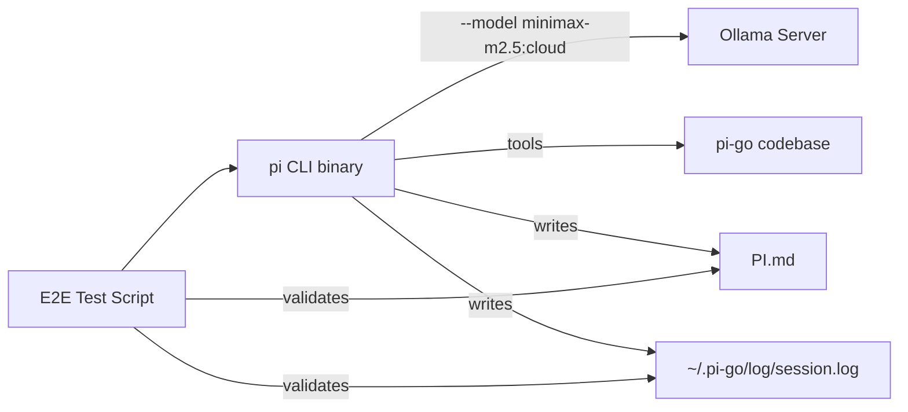

# Design: Simple Ollama E2E Test

## Overview

An end-to-end test that validates the pi CLI tool works correctly with a real Ollama backend. The test runs `pi --model minimax-m2.5:cloud`, instructs the agent to explore the codebase and generate a `PI.md` project overview, then verifies success via log analysis and output validation.

## Detailed Requirements

1. **Real Ollama integration**: Test connects to a live Ollama instance (not mocked)
2. **Model**: `minimax-m2.5:cloud` — routes through Ollama via `:cloud` suffix
3. **Task**: Agent explores the pi-go codebase and generates `PI.md` with project overview
4. **Log validation**: Session JSONL logs must contain zero tool errors
5. **Command completeness**: Every tool_call must have a corresponding tool_result (no skipped commands)
6. **Dependency freshness**: All Go dependencies updated to latest before test execution
7. **Prerequisite**: Ollama must be running with the model available

## Architecture Overview



## Components and Interfaces

### 1. Test Runner Script (`scripts/test-ollama-e2e.sh`)

A shell script that:
- Checks prerequisites (Ollama running, model available)
- Updates dependencies (`go get -u ./...`)
- Builds pi binary
- Runs pi with the test prompt in print mode
- Validates PI.md was created with content
- Validates session logs have no errors
- Reports pass/fail

### 2. Log Validator (`scripts/validate-logs.sh`)

Parses the latest session JSONL log and checks:
- No entries with `"type":"error"`
- All `tool_call` entries have matching `tool_result`
- No tool_result content contains error indicators

### 3. PI.md Validator

Checks the generated PI.md:
- File exists and is non-empty
- Contains expected sections (project name, architecture, components)
- Minimum length threshold (> 500 chars)

## Data Models

### Session Log Entry (JSONL)
```json
{
  "timestamp": "2026-03-16T15:00:00Z",
  "type": "tool_call|tool_result|llm_text|error|info",
  "agent": "main",
  "tool": "tree",
  "args": {"path": "."},
  "content": "..."
}
```

## Error Handling

- **Ollama not running**: Test skips with clear message
- **Model not available**: Test skips with instructions to pull model
- **Timeout**: 5-minute timeout for the full agent run
- **PI.md not created**: Test fails with log dump for debugging
- **Log errors found**: Test fails listing each error entry

## Acceptance Criteria

**Given** Ollama is running with `minimax-m2.5:cloud` available
**When** `pi --model minimax-m2.5:cloud --mode print` is run with a prompt to explore and generate PI.md
**Then** PI.md is created with meaningful project overview content (> 500 chars)

**Given** the test completes successfully
**When** the session log file is parsed
**Then** there are zero entries with `type: "error"`

**Given** the test completes successfully
**When** tool_call and tool_result entries are paired in the log
**Then** every tool_call has a corresponding tool_result (no skipped commands)

**Given** go.mod dependencies
**When** `go get -u ./...` is run
**Then** all dependencies are at latest compatible versions and the project builds successfully

## Testing Strategy

- **Manual E2E**: Run the script against a real Ollama instance
- **CI integration**: Can be added as optional CI step with Ollama service container
- **Log-driven debugging**: All failures include log file path for investigation

## Appendices

### Technology Choices

- **Shell script over Go test**: The test orchestrates external processes (build, run pi, validate) — shell is simpler and more transparent than a Go test with `os/exec`
- **Print mode**: Uses `--mode print` for non-interactive output capture
- **JSONL parsing**: Uses `jq` for log validation — standard, expressive, already available on dev machines

### Research Findings

- Only `github.com/modelcontextprotocol/go-sdk` needs updating (v1.4.0 → v1.4.1)
- All other 8 direct dependencies are at latest versions
- Ollama uses Anthropic-compatible API — no special client needed
- pi-go already has lenient schema validation and type coercion for LLM quirks

### Alternative Approaches Considered

1. **Go test file**: More structured but harder to debug, requires build tags, can't easily show live output
2. **Makefile target**: Good for CI but less self-documenting than a standalone script
3. **Both**: Script + Makefile target that calls the script — chosen approach
