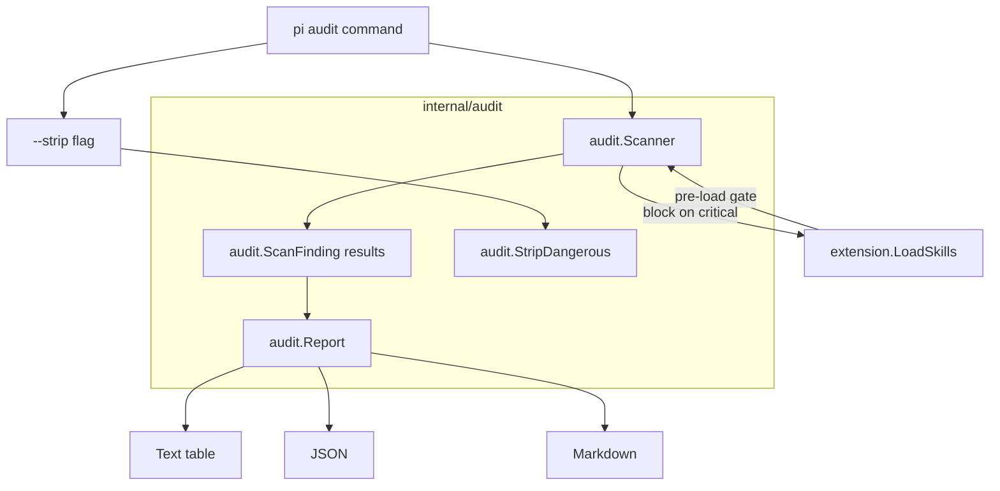

# Skills Audit - Design Document

## Overview

Add a `pi audit` CLI command and an `internal/audit` package that scans SKILL.md files for hidden Unicode characters and other security threats before they are loaded into the agent. Inspired by Microsoft APM's audit architecture, adapted for pi-go's Go codebase and skill system.

## Detailed Requirements

1. **Detect hidden Unicode characters** in SKILL.md files that could embed invisible instructions tokenizable by LLMs
2. **Classify findings by severity**: critical (must block), warning (suspicious), info (harmless)
3. **Scan before load**: integrate into `extension.LoadSkills()` to block dangerous skills by default
4. **CLI command `pi audit`**: standalone scanning with reporting and remediation
5. **Strip mode**: auto-remove dangerous characters from skill files
6. **Multiple output formats**: text (terminal table), JSON (CI/CD), Markdown (reports)
7. **Exit codes for CI**: 0=clean, 1=critical, 2=warnings

## Architecture Overview



## Components and Interfaces

### Package `internal/audit`

#### Scanner

```go
// ScanFinding represents a single suspicious character detected in a file.
type ScanFinding struct {
    File        string   // file path
    Line        int      // 1-based line number
    Column      int      // 1-based column position
    Char        string   // character representation
    Codepoint   string   // hex format, e.g. "U+200B"
    Severity    Severity // critical, warning, info
    Category    string   // classification (e.g. "bidi-override", "zero-width")
    Description string   // human-readable explanation
}

type Severity int

const (
    Info Severity = iota
    Warning
    Critical
)

// ScanResult holds aggregated scan results.
type ScanResult struct {
    Findings      []ScanFinding
    FilesScanned  int
    CriticalCount int
    WarningCount  int
    InfoCount     int
}

// ScanText scans a string for hidden Unicode characters.
// Returns findings with positions relative to the content.
func ScanText(content string, filename string) []ScanFinding

// ScanFile reads a file and scans its content.
func ScanFile(path string) ([]ScanFinding, error)

// ScanSkillDirs scans all SKILL.md files in the given directories.
func ScanSkillDirs(dirs ...string) (*ScanResult, error)

// HasCritical returns true if any finding has Critical severity.
func HasCritical(findings []ScanFinding) bool

// StripDangerous removes critical and warning-level characters from content,
// preserving info-level characters and legitimate emoji ZWJ sequences.
func StripDangerous(content string) string
```

#### Character Classification

Three severity tiers, matching APM's proven categorization:

**Critical** (no legitimate use in prompts - block loading):
| Category | Codepoints | Risk |
|----------|-----------|------|
| Unicode tag chars | U+E0001-U+E007F | Encode hidden ASCII text |
| BiDi overrides | U+202A-U+202E, U+2066-U+2069 | Reverse text direction to hide content |
| Variation selectors (SMP) | U+E0100-U+E01EF | "Glassworm" supply-chain vector |

**Warning** (suspicious - report but allow with `--force`):
| Category | Codepoints | Risk |
|----------|-----------|------|
| Zero-width chars | U+200B (ZWSP), U+200C (ZWNJ), U+200D (ZWJ) | Can hide instructions |
| BMP variation selectors | U+FE00-U+FE0F | Character variant encoding |
| BiDi marks | U+200E, U+200F, U+061C | Directional markers |
| Invisible math operators | U+2061-U+2064 | Invisible content |
| Interlinear annotation | U+FFF9-U+FFFB | Annotation markers |

**Info** (mostly harmless - only shown with `--verbose`):
| Category | Codepoints | Risk |
|----------|-----------|------|
| Unusual whitespace | NBSP, various width spaces | Formatting artifacts |
| BOM at file start | U+FEFF | Encoding marker |
| Emoji presentation | U+FE0F in emoji context | Normal emoji rendering |

**Smart context rules:**
- ZWJ (U+200D) between emoji characters is downgraded to info
- BOM at position 0 is info; mid-file BOM is warning

#### Performance

- **ASCII fast-path**: check if content is pure ASCII first (common case for skill files). Skip character-by-character scan if so.
- **Pre-built lookup map**: `map[rune]characterInfo` built at init time for O(1) classification
- No external dependencies

#### Report

```go
// FormatText renders findings as a terminal table with severity coloring.
func FormatText(result *ScanResult, verbose bool) string

// FormatJSON renders findings as structured JSON.
func FormatJSON(result *ScanResult) ([]byte, error)

// FormatMarkdown renders findings as GitHub-flavored markdown.
func FormatMarkdown(result *ScanResult) string
```

### CLI Command: `pi audit`

New cobra subcommand in `internal/cli/audit.go`:

```
pi audit [flags]

Scan skill files for hidden Unicode characters and security threats.

Flags:
  --dir string      Scan specific directory (default: all skill dirs)
  --file string     Scan a single file
  --strip           Remove dangerous characters from files
  --dry-run         Preview strip operations without modifying files
  --force           Allow loading skills with warnings (skip blocking)
  --verbose, -v     Show info-level findings
  --format string   Output format: text, json, markdown (default: text)
  --output string   Write report to file (auto-detects format from extension)

Exit codes:
  0  Clean (no findings or info-only)
  1  Critical findings detected
  2  Warning findings detected
```

### Integration with Skill Loading

Modify `extension.LoadSkills()` to accept an audit option:

```go
// LoadOptions configures skill loading behavior.
type LoadOptions struct {
    // AuditMode controls security scanning during load.
    // "block" (default): block skills with critical findings
    // "warn": log warnings but load all skills
    // "skip": no scanning
    AuditMode string
}

// LoadSkills discovers and loads skills, scanning for security issues.
func LoadSkills(opts LoadOptions, dirs ...string) ([]Skill, *audit.ScanResult, error)
```

**Load-time behavior:**
1. Discover all SKILL.md files as before
2. Scan each file with `audit.ScanFile()`
3. If critical findings: skip the skill, log warning to stderr
4. If warning findings: log to stderr, still load
5. Return scan results alongside skills for caller inspection

In `cli.go`, the integration point at line ~308:

```go
skills, scanResult, _ := extension.LoadSkills(
    extension.LoadOptions{AuditMode: "block"},
    skillDirs...,
)
if scanResult != nil && scanResult.CriticalCount > 0 {
    fmt.Fprintf(os.Stderr,
        "pi-go: %d skill(s) blocked due to critical security findings. Run 'pi audit' for details.\n",
        scanResult.CriticalCount)
}
```

## Data Models

```go
// internal/audit/chars.go

type characterInfo struct {
    severity    Severity
    category    string
    description string
}

// charTable is the pre-built lookup table, initialized in init().
var charTable map[rune]characterInfo
```

The lookup table is built once at package init from declarative range definitions:

```go
func init() {
    charTable = make(map[rune]characterInfo)
    // Critical: Unicode tag characters
    for r := rune(0xE0001); r <= 0xE007F; r++ {
        charTable[r] = characterInfo{Critical, "unicode-tag", "Unicode tag character — can encode hidden ASCII"}
    }
    // Critical: BiDi overrides
    for _, r := range []rune{0x202A, 0x202B, 0x202C, 0x202D, 0x202E, 0x2066, 0x2067, 0x2068, 0x2069} {
        charTable[r] = characterInfo{Critical, "bidi-override", "Bidirectional override — can reverse text to hide content"}
    }
    // ... warning and info entries
}
```

## Error Handling

- File read errors (permission denied, not UTF-8): logged as warnings, file skipped, scan continues
- Invalid paths: validated before scanning, clear error messages
- `--strip` validates files resolve within expected directories (no path traversal)
- `--strip` creates backup before modifying (`.bak` suffix)

## Acceptance Criteria

**Given** a SKILL.md file containing a Unicode tag character (U+E0001),
**When** `pi audit` is run,
**Then** a critical finding is reported with file path, line, column, and codepoint, and exit code is 1.

**Given** a SKILL.md file with critical findings,
**When** `extension.LoadSkills()` runs with default audit mode,
**Then** the skill is NOT loaded and a warning is printed to stderr.

**Given** a SKILL.md file with only warning-level findings,
**When** `extension.LoadSkills()` runs,
**Then** the skill IS loaded and warnings are printed to stderr.

**Given** a clean SKILL.md file (ASCII only),
**When** `audit.ScanText()` is called,
**Then** it returns an empty findings slice via the ASCII fast-path.

**Given** `pi audit --strip` is run on a file with dangerous characters,
**When** the command completes,
**Then** critical and warning characters are removed, info-level characters are preserved, and a backup file is created.

**Given** `pi audit --format json --output report.json`,
**When** the command completes,
**Then** a valid JSON file is written with summary and findings arrays.

**Given** a SKILL.md with ZWJ (U+200D) between emoji characters,
**When** scanned,
**Then** the ZWJ is classified as info (not warning).

**Given** `pi audit --dry-run --strip`,
**When** run,
**Then** a preview is shown but no files are modified.

## Testing Strategy

1. **Unit tests** (`internal/audit/`):
   - `scanner_test.go`: test each character category detection, ASCII fast-path, emoji ZWJ context, BOM handling
   - `report_test.go`: test each output format (text, JSON, markdown)
   - `strip_test.go`: test dangerous char removal, emoji preservation, backup creation

2. **Integration tests** (`internal/extension/`):
   - `skills_test.go`: test LoadSkills with audit integration - clean files load, critical files blocked, warning files loaded with result

3. **CLI tests** (`internal/cli/`):
   - `audit_test.go`: test command execution, exit codes, flag combinations

4. **Test fixtures**: create `testdata/` files with known Unicode characters embedded for deterministic testing

## Appendices

### Technology Choices

- **Pure Go, no dependencies**: `unicode/utf8` stdlib is sufficient for character classification
- **Pre-built map vs switch**: map provides O(1) lookup for ranges; switch would require many range checks
- **ASCII fast-path**: `strings.IndexFunc` with non-ASCII check, avoids rune iteration for clean files

### Research Findings (Microsoft APM)

See [research/apm-audit-architecture.md](research/apm-audit-architecture.md) for detailed analysis. Key takeaways adopted:
- Three-tier severity model (critical/warning/info)
- Character category table with "Glassworm" vector coverage
- Smart ZWJ/BOM context handling
- SecurityGate pattern (centralized policy enforcement)
- ASCII fast-path optimization

### Alternative Approaches Considered

1. **External scanner binary**: rejected — adds deployment complexity, Go stdlib is sufficient
2. **Regex-based detection**: rejected — hidden Unicode chars can't be reliably matched with regex patterns
3. **LLM-based content analysis**: rejected for V1 — too slow for pre-load gate; could be added later for prompt injection detection
4. **Scan all files, not just SKILL.md**: deferred — start with skills, expand to CLAUDE.md/configs later
