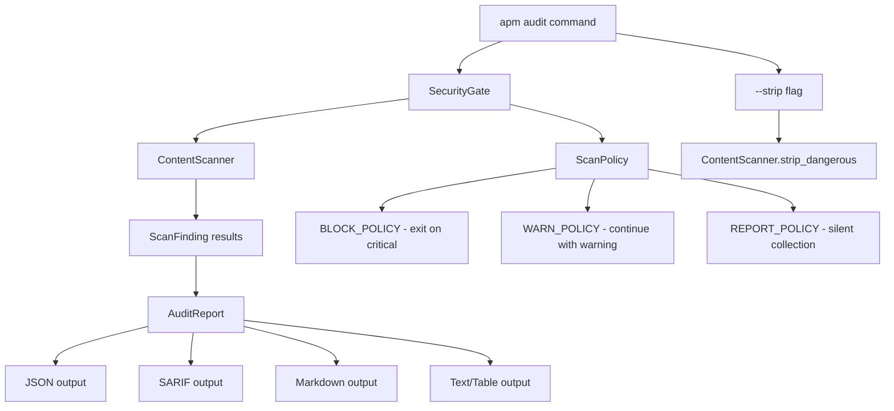

# Microsoft APM Audit Architecture

Source: https://github.com/microsoft/apm/tree/main/src/apm_cli

## Overview

APM (Application Package Manager) includes a built-in `apm audit` command that scans prompt files for hidden Unicode characters that could embed malicious instructions invisible to humans but tokenizable by LLMs.

## Architecture

## Key Components

### 1. ContentScanner (`security/content_scanner.py`)

The core detection engine. Scans text character-by-character looking for hidden Unicode characters.

**Severity Levels:**

| Level | Characters | Risk |
|-------|-----------|------|
| **Critical** | Unicode tag chars (U+E0001-E007F), BiDi overrides (LRE, RLE, LRO, RLO, etc.), Variation selectors SMP (U+E0100-E01EF "Glassworm attack vector") | No legitimate use in prompts; can hide instructions |
| **Warning** | Zero-width chars (ZWSP, ZWNJ, ZWJ), BMP variation selectors (U+FE00-FE0F), BiDi marks (LRM, RLM, ALM), Invisible math operators, Interlinear annotation markers | Common debris but can hide instructions |
| **Info** | Unusual whitespace (NBSP, ideographic space), Emoji presentation selector, BOM at file start | Mostly harmless |

**Performance Optimizations:**
- Pre-built lookup table for O(1) character classification
- ASCII fast-path skips processing for ~90% of files (pure ASCII detected early)
- No external dependencies

**Smart Context Detection:**
- ZWJ (Zero Width Joiner) between emoji characters is downgraded to "info" (legitimate emoji sequences like family emoji)
- BOM at start of file is "info", but mid-file BOM is "warning"

**Key Methods:**
- `scan_text(content, filename)` - scan string, returns `List[ScanFinding]`
- `scan_file(path)` - reads UTF-8 file, delegates to `scan_text()`
- `strip_dangerous(content)` - removes critical+warning chars, preserves info-level and emoji ZWJ sequences
- `classify(findings)` - returns `(has_critical, severity_counts)`

### 2. SecurityGate (`security/gate.py`)

Centralized scanning entry point. All commands pass through SecurityGate instead of reimplementing scan logic.

**ScanPolicy** - commands declare intent:
- `on_critical`: "block" | "warn" | "ignore"
- `force_overrides`: allows `--force` to bypass blocking

**ScanVerdict** - encapsulates results:
- `findings_by_file`, `has_critical`, `should_block`
- `critical_count`, `warning_count`, `files_scanned`

**Key Design Principle:** Commands declare intent via policy; the gate enforces consistently. This prevents inconsistencies across different commands.

### 3. AuditReport (`security/audit_report.py`)

Serializes findings into multiple formats:
- **JSON** - APM's native format with summary + items
- **SARIF 2.1.0** - for GitHub Advanced Security integration
- **Markdown** - for GitHub Actions step summaries
- **Text** - Rich table format for terminal

### 4. Audit Command (`commands/audit.py`, 570 lines)

CLI entry point with options:
- `package` - scan specific package
- `--file` - scan arbitrary file outside APM management
- `--strip` - remove dangerous/suspicious characters
- `--dry-run` - preview strip operations
- `--verbose/-v` - show info-level findings too
- `--format` - text/json/sarif/markdown
- `--output` - write results to file

**Exit codes:** 0 (clean), 1 (critical), 2 (warnings only)

**Security features:**
- Path traversal validation prevents crafted lockfiles from escaping project root
- UTF-8 encoding enforcement
- Symlink safety (never follows symlinks)

## Detected Character Categories (Complete)

### Critical (no legitimate use in prompts)
1. **Unicode Tag Characters** (U+E0001-U+E007F) - can encode hidden ASCII text
2. **BiDi Overrides** - LRE (U+202A), RLE (U+202B), PDF (U+202C), LRO (U+202D), RLO (U+202E), LRI (U+2066), RLI (U+2067), FSI (U+2068), PDI (U+2069)
3. **Variation Selectors SMP** (U+E0100-U+E01EF) - "Glassworm supply-chain attack vector"

### Warning (can hide instructions)
4. **Zero-Width Characters** - ZWSP (U+200B), ZWNJ (U+200C), ZWJ (U+200D, unless emoji context)
5. **BMP Variation Selectors** (U+FE00-U+FE0F)
6. **BiDi Marks** - LRM (U+200E), RLM (U+200F), ALM (U+061C)
7. **Invisible Math Operators** - function application, invisible times, separator, plus
8. **Interlinear Annotation** markers
9. **Deprecated Formatting** characters

### Info (mostly harmless)
10. **Unusual Whitespace** - NBSP, various width spaces, ideographic space
11. **Emoji Presentation Selector**
12. **BOM at file start**

## Integration Points

- SecurityGate is called by install, compile, and run commands - not just audit
- SARIF output enables GitHub Code Scanning integration
- Markdown output enables GitHub Actions step summary display
- JSON output enables programmatic CI/CD pipeline integration
