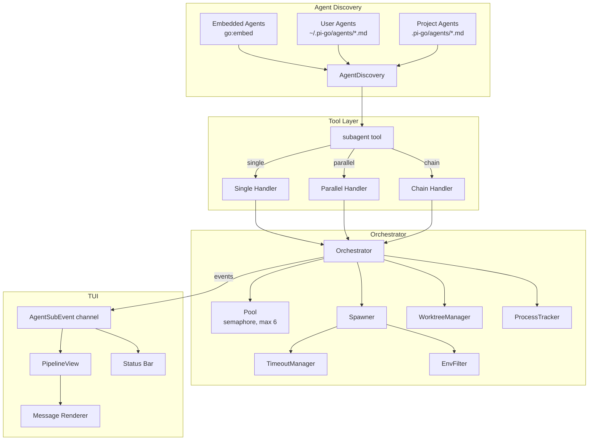
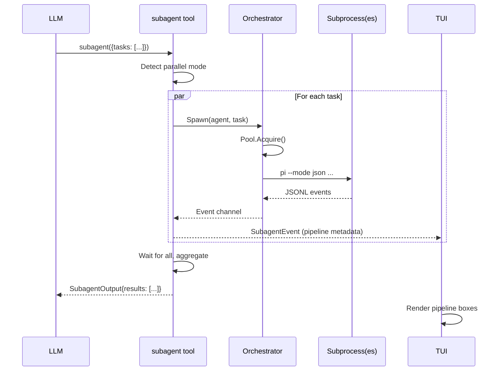

# Design: Skills Subagents

## Overview

Replace pi-go's hardcoded agent type system with a discoverable, markdown-defined agent architecture supporting three execution modes (single, parallel, chain) with a visual pipeline TUI for multi-agent workflows. Agents are defined as markdown files with YAML frontmatter, discovered from bundled (embedded), user, and project directories with priority override.

## Detailed Requirements

### Agent Definition System
- **R1:** Convert existing 6 hardcoded agent types to bundled markdown files
- **R2:** Add `code-reviewer` and `spec-reviewer` agents, replacing the single `reviewer` (total: 8 bundled)
- **R3:** Embed bundled agents via `go:embed`, overridable from filesystem
- **R4:** Discovery priority: project (`.pi-go/agents/`) > user (`~/.pi-go/agents/`) > bundled (embedded)
- **R5:** Agent frontmatter fields: `name`, `description`, `tools`, `model`/`role`, `worktree`, `timeout`

### Subagent Tool
- **R6:** Replace `agent` tool with `subagent` tool
- **R7:** Three execution modes: single (`{agent, task}`), parallel (`{tasks: [...]}`), chain (`{chain: [...]}`)
- **R8:** Per-call `agentScope` parameter: `"user"` (default), `"project"`, `"both"`
- **R9:** Project agents require user confirmation prompt before execution
- **R10:** Chain mode supports `{previous}` (text) and `{previous_json}` (structured) placeholders

### Process Management
- **R11:** Inactivity timeout: 120s default (no output = kill)
- **R12:** Absolute timeout: 10min default, per-agent override via frontmatter `timeout` field
- **R13:** Timeout fallback chain: agent frontmatter → `PI_SUBAGENT_TIMEOUT_MS` env var → 10min default
- **R14:** Strict environment allowlist with `PI_SUBAGENT_ENV_PASSTHROUGH` for extras
- **R15:** Default concurrency: 6, configurable via `PI_SUBAGENT_CONCURRENCY` env var
- **R16:** Max parallel tasks per call: 8

### TUI
- **R17:** Pipeline visualization (box-drawing state machine) for parallel and chain modes only
- **R18:** Single mode keeps current event stream rendering
- **R19:** Adaptive layout: full boxes (≥100 cols), stacked (≥60), compact inline (<60)
- **R20:** `/agents` lists available definitions, `/agents status` shows running agents

## Architecture Overview



### Key Architectural Decisions

1. **Single `subagent` tool with internal mode dispatch** — works within ADK's sequential tool model. One tool call internally manages parallel goroutines.
2. **Agent definitions as data, not code** — markdown files parsed at discovery time, no Go code changes needed to add/modify agents.
3. **Embedded + filesystem layering** — `go:embed` ensures bundled agents always exist; filesystem allows override without recompilation.
4. **Pipeline visualization as message rendering** — rendered inline with tool result messages, not a separate panel.

## Components and Interfaces

### 1. Agent Discovery (`internal/subagent/agents.go` — new file)

```go
// AgentScope controls which directories to search
type AgentScope string

const (
    AgentScopeUser    AgentScope = "user"
    AgentScopeProject AgentScope = "project"
    AgentScopeBoth    AgentScope = "both"
)

// AgentConfig represents a parsed agent definition
type AgentConfig struct {
    Name        string   // from frontmatter
    Description string   // from frontmatter
    Tools       []string // from frontmatter, comma-separated
    Role        string   // from frontmatter (maps to config role → model)
    Worktree    bool     // from frontmatter, default false
    Timeout     int      // from frontmatter, milliseconds, 0 = use default
    SystemPrompt string  // markdown body after frontmatter
    Source      string   // "bundled", "user", "project"
    FilePath    string   // path to .md file (empty for embedded)
}

// AgentDiscoveryResult holds discovered agents and metadata
type AgentDiscoveryResult struct {
    Agents          []AgentConfig
    ProjectAgentsDir string // nil if no project agents dir found
}

// DiscoverAgents finds agents from all configured sources
// Priority: project > user > bundled (by name override)
func DiscoverAgents(cwd string, scope AgentScope) AgentDiscoveryResult

// LoadAgentsFromDir parses all .md files in a directory
func LoadAgentsFromDir(dir string, source string) []AgentConfig

// LoadBundledAgents returns agents from go:embed filesystem
func LoadBundledAgents() []AgentConfig

// ParseAgentFile parses a single agent markdown file
func ParseAgentFile(content []byte, source string, filePath string) (*AgentConfig, error)
```

### 2. Bundled Agents (`internal/subagent/bundled/` — new directory)

```
internal/subagent/bundled/
├── embed.go          # go:embed directive and accessor
├── explore.md
├── plan.md
├── designer.md
├── code-reviewer.md
├── spec-reviewer.md
├── task.md
├── quick-task.md
└── worker.md         # new general-purpose agent
```

```go
// embed.go
package bundled

import "embed"

//go:embed *.md
var FS embed.FS
```

### 3. Subagent Tool (`internal/tools/subagent.go` — replaces agent.go)

```go
// SubagentInput defines the tool parameters
type SubagentInput struct {
    // Single mode
    Agent string `json:"agent,omitempty"`
    Task  string `json:"task,omitempty"`
    Cwd   string `json:"cwd,omitempty"`

    // Parallel mode
    Tasks []TaskItem `json:"tasks,omitempty"`

    // Chain mode
    Chain []ChainItem `json:"chain,omitempty"`

    // Scope
    AgentScope string `json:"agent_scope,omitempty"` // "user", "project", "both"
}

type TaskItem struct {
    Agent string `json:"agent"`
    Task  string `json:"task"`
    Cwd   string `json:"cwd,omitempty"`
}

type ChainItem struct {
    Agent string `json:"agent"`
    Task  string `json:"task"` // supports {previous} and {previous_json}
    Cwd   string `json:"cwd,omitempty"`
}

// SubagentOutput returned to the LLM
type SubagentOutput struct {
    Mode    string         `json:"mode"`    // "single", "parallel", "chain"
    Results []AgentResult  `json:"results"`
    Summary string         `json:"summary"`
}

type AgentResult struct {
    Agent    string `json:"agent"`
    AgentID  string `json:"agent_id"`
    Status   string `json:"status"`   // "completed", "failed", "timeout"
    Result   string `json:"result"`
    Error    string `json:"error,omitempty"`
    Duration string `json:"duration"`
}

// SubagentEventCallback extends AgentEventCallback with pipeline metadata
type SubagentEventCallback func(event SubagentEvent)

type SubagentEvent struct {
    AgentID    string `json:"agent_id"`
    Kind       string `json:"kind"`       // "spawn", "text_delta", "tool_call", "tool_result", "error", "done"
    Content    string `json:"content"`
    PipelineID string `json:"pipeline_id"` // groups agents in same call
    Mode       string `json:"mode"`        // "single", "parallel", "chain"
    Step       int    `json:"step"`        // position in chain (1-based), or parallel index
    Total      int    `json:"total"`       // total agents in pipeline
}

// NewSubagentTool creates the subagent tool
func NewSubagentTool(orch *subagent.Orchestrator, onEvent SubagentEventCallback) (tool.Tool, error)

// SubagentTools returns []tool.Tool containing the subagent tool
func SubagentTools(orch *subagent.Orchestrator, onEvent SubagentEventCallback) ([]tool.Tool, error)
```

### 4. Enhanced Orchestrator (`internal/subagent/orchestrator.go` — modified)

```go
// Changes to Orchestrator:

// NewOrchestrator now accepts pool size from config/env
func NewOrchestrator(cfg *config.Config, repoRoot string, opts ...OrchestratorOption) *Orchestrator

type OrchestratorOption func(*Orchestrator)

func WithPoolSize(size int) OrchestratorOption
func WithInactivityTimeout(d time.Duration) OrchestratorOption
func WithAbsoluteTimeout(d time.Duration) OrchestratorOption

// Spawn now accepts AgentConfig instead of type string
// Old: Spawn(ctx, AgentInput{Type: "explore", Prompt: "..."})
// New: Spawn(ctx, SpawnInput{Agent: agentConfig, Prompt: "...", ...})
type SpawnInput struct {
    Agent       AgentConfig
    Prompt      string
    Cwd         string
    Worktree    *bool  // override agent's worktree setting
    SkipCleanup bool
}

func (o *Orchestrator) Spawn(ctx context.Context, input SpawnInput) (<-chan Event, string, error)
```

### 5. Enhanced Spawner (`internal/subagent/spawner.go` — modified)

```go
// SpawnOpts updated for new features
type SpawnOpts struct {
    AgentID            string
    Model              string
    WorkDir            string
    Prompt             string
    Instruction        string
    Tools              []string          // tool whitelist for subprocess
    InactivityTimeout  time.Duration     // 0 = default 120s
    AbsoluteTimeout    time.Duration     // 0 = default 10min
    Env                map[string]string // filtered environment
}
```

### 6. Environment Filter (`internal/subagent/env.go` — new file)

```go
// AllowedPrefixes for environment variable passthrough
var AllowedPrefixes = []string{"PI_", "GO", "LC_", "XDG_"}

// AllowedExplicit variables always passed through
var AllowedExplicit = map[string]bool{
    "PATH": true, "HOME": true, "SHELL": true, "TERM": true,
    "USER": true, "LOGNAME": true, "TMPDIR": true,
    "EDITOR": true, "VISUAL": true, "SSH_AUTH_SOCK": true,
    "COLORTERM": true, "FORCE_COLOR": true, "NO_COLOR": true,
    "LANG": true, "LANGUAGE": true,
    // API keys needed by subprocess
    "ANTHROPIC_API_KEY": true, "OPENAI_API_KEY": true, "GEMINI_API_KEY": true,
    "ANTHROPIC_BASE_URL": true, "OPENAI_BASE_URL": true, "GEMINI_BASE_URL": true,
}

// BuildSubagentEnv creates filtered environment for subprocess
func BuildSubagentEnv(extra map[string]string) []string

// getPassthroughVars reads PI_SUBAGENT_ENV_PASSTHROUGH
func getPassthroughVars() []string
```

### 7. Timeout Manager (`internal/subagent/timeout.go` — new file)

```go
const (
    DefaultInactivityTimeout = 120 * time.Second
    DefaultAbsoluteTimeout   = 10 * time.Minute
)

// GetAbsoluteTimeout resolves timeout: agent config → env var → default
func GetAbsoluteTimeout(agentTimeout int) time.Duration

// GetInactivityTimeout resolves from env var or default
func GetInactivityTimeout() time.Duration
```

### 8. Pipeline View (`internal/tui/pipeline.go` — new file)

```go
// PipelineView represents a multi-agent execution visualization
type PipelineView struct {
    ID      string       // unique pipeline ID
    Mode    string       // "parallel" or "chain"
    Agents  []AgentBlock
    StartAt time.Time
}

type AgentBlock struct {
    AgentID     string
    Name        string
    State       AgentState // Pending, Running, Done, Failed
    Duration    time.Duration
    CurrentTool string
    Events      []agentEv
    Error       string
}

type AgentState int

const (
    AgentPending AgentState = iota
    AgentRunning
    AgentDone
    AgentFailed
)

// RenderPipeline renders the pipeline visualization
func RenderPipeline(p PipelineView, width int) string

// renderPipelineBoxes — full box layout for width ≥ 100
func renderPipelineBoxes(p PipelineView, width int) string

// renderPipelineStacked — stacked boxes for width ≥ 60
func renderPipelineStacked(p PipelineView, width int) string

// renderPipelineCompact — inline status for width < 60
func renderPipelineCompact(p PipelineView) string
```

#### Box Rendering Examples

**Parallel (≥100 cols):**
```
┌─ parallel (3 agents) ─────────────────────────────┐
│                                                     │
│  ┌──────────┐   ┌──────────┐   ┌──────────┐       │
│  │ worker   │   │ worker   │   │ worker   │       │
│  │ ✓ 12.3s  │   │ ▶ 8.1s  │   │ ▶ 6.4s  │       │
│  │ 3 files  │   │ ⚙ edit   │   │ ⚙ bash  │       │
│  └──────────┘   └──────────┘   └──────────┘       │
│                                                     │
│  Progress: 1/3 done                                 │
└─────────────────────────────────────────────────────┘
```

**Chain (≥100 cols):**
```
┌─ chain (3 steps) ──────────────────────────────────┐
│                                                     │
│  ┌────────────┐     ┌────────────┐     ┌──────────┐│
│  │ implementer│────▶│ spec-review│────▶│ code-rev ││
│  │ ✓ 45.2s   │     │ ▶ 12.1s   │     │ ○ pending││
│  └────────────┘     └────────────┘     └──────────┘│
│                                                     │
│  Step 2/3: spec-review                              │
└─────────────────────────────────────────────────────┘
```

**Compact (<60 cols):**
```
[✓ impl] [▶ spec-rev] [○ code-rev]  chain 2/3
```

#### State Colors

| State | Icon | Color (ANSI 256) |
|-------|------|------------------|
| Pending | ○ | 245 (dim gray) |
| Running | ▶ | 214 (orange) |
| Done | ✓ | 35 (green) |
| Failed | ✗ | 196 (red) |

### 9. TUI Integration (`internal/tui/tui.go` — modified)

```go
// Extended event type
type SubagentEvent struct {
    AgentID    string
    Kind       string
    Content    string
    PipelineID string
    Mode       string
    Step       int
    Total      int
}

// New field on model
type model struct {
    // ... existing fields ...
    pipelines map[string]*PipelineView // pipelineID → view
}

// Updated /agents command handling
// /agents       → list available agent definitions
// /agents status → list running agents
```

### 10. CLI Wiring (`internal/cli/cli.go` — modified)

```go
// Replace agent tool creation with subagent tool
// Old:
//   agentTools, err := tools.AgentTools(orch, agentEventCB)
// New:
//   subagentTools, err := tools.SubagentTools(orch, subagentEventCB)

// Pool size from env
poolSize := getEnvInt("PI_SUBAGENT_CONCURRENCY", 6)
orch := subagent.NewOrchestrator(cfg, repoRoot, subagent.WithPoolSize(poolSize))
```

## Data Models

### Agent Markdown Format

```yaml
---
name: implementer
description: Implement tasks via TDD and commit small changes
tools: read, write, edit, bash, lsp
role: default
worktree: true
timeout: 600000
---

You are an implementation subagent.

## TDD Approach
...
```

**Required fields:** `name`, `description`
**Optional fields:** `tools`, `role` (default: "default"), `worktree` (default: false), `timeout` (ms, default: 0 = global default)

### Environment Variables

| Variable | Default | Description |
|----------|---------|-------------|
| `PI_SUBAGENT_CONCURRENCY` | 6 | Max concurrent subagents |
| `PI_SUBAGENT_TIMEOUT_MS` | 600000 | Absolute timeout (ms) |
| `PI_SUBAGENT_INACTIVITY_MS` | 120000 | Inactivity timeout (ms) |
| `PI_SUBAGENT_ENV_PASSTHROUGH` | "" | Comma-separated extra env vars to pass |

### Event Flow



## Error Handling

### Spawn Failures
- **Unknown agent:** Return error listing available agents (with source)
- **Role not configured:** Return error suggesting config change
- **Pool exhausted + context cancelled:** Return timeout error
- **Worktree creation failure:** Cleanup, release pool slot, return error

### Execution Failures
- **Inactivity timeout (120s):** SIGTERM → 5s → SIGKILL, return with status "timeout", error message
- **Absolute timeout:** Same kill sequence, return with status "timeout"
- **Process crash:** Capture stderr, return with status "failed"
- **Non-zero exit:** Return result so far + error message

### Mode-Specific Error Handling
- **Parallel:** All agents run to completion regardless of individual failures. Aggregated result shows per-agent status.
- **Chain:** Stops at first failure. Returns completed steps + failed step. Does not execute remaining steps.
- **Single:** Returns result or error directly.

### Project Agent Confirmation
- If `agentScope` includes project agents and user declines confirmation, return "Canceled: project-local agents not approved."

## Acceptance Criteria

### Agent Discovery

**AC1:** Given bundled agent files embedded via `go:embed`, when pi-go starts with no user or project agents, then all 8 bundled agents are available.

**AC2:** Given a user agent file at `~/.pi-go/agents/custom.md` with valid frontmatter, when discovery runs with scope "user", then the custom agent appears in the list.

**AC3:** Given a project agent at `.pi-go/agents/explore.md` that overrides the bundled `explore`, when discovery runs with scope "both", then the project version is used.

**AC4:** Given an agent file missing the `name` field, when discovery runs, then the file is silently skipped.

### Subagent Tool — Single Mode

**AC5:** Given a valid agent name and task, when `subagent({agent: "explore", task: "find main.go"})` is called, then a subprocess is spawned, events stream to TUI, and the result is returned.

**AC6:** Given an unknown agent name, when `subagent({agent: "nonexistent", task: "..."})` is called, then an error is returned listing available agents.

### Subagent Tool — Parallel Mode

**AC7:** Given 3 independent tasks, when `subagent({tasks: [{agent: "worker", task: "..."}, ...]})` is called, then all 3 agents run concurrently and results are aggregated.

**AC8:** Given parallel mode with one failing agent, when execution completes, then the result shows 2 succeeded + 1 failed with the error message.

**AC9:** Given more than 8 parallel tasks, when the tool is called, then it returns an error without spawning any agents.

### Subagent Tool — Chain Mode

**AC10:** Given a 3-step chain, when step 1 completes with output "hello", then step 2's `{previous}` is replaced with "hello".

**AC11:** Given a chain where step 2 fails, when execution stops, then step 3 is not executed and the result includes step 1 (completed) and step 2 (failed).

**AC12:** Given `{previous_json}` in a chain task, when the previous agent outputs valid JSON, then the placeholder is replaced with the JSON string.

### Timeouts

**AC13:** Given a subagent producing no output for 120 seconds, when the inactivity timeout fires, then the process is killed and "timeout" status is returned.

**AC14:** Given `PI_SUBAGENT_TIMEOUT_MS=30000`, when a subagent runs for 30 seconds, then it is killed regardless of activity.

**AC15:** Given an agent with `timeout: 300000` in frontmatter, when it runs, then the 5-minute timeout is used instead of the default 10 minutes.

### Environment

**AC16:** Given `PI_SUBAGENT_ENV_PASSTHROUGH=MY_VAR`, when a subagent spawns, then `MY_VAR` is in its environment but `RANDOM_SECRET` is not.

**AC17:** Given the allowlist includes `ANTHROPIC_API_KEY`, when a subagent spawns, then it can access the API.

### TUI Pipeline

**AC18:** Given a parallel execution of 3 agents in a terminal ≥100 cols wide, when agents are running, then side-by-side boxes are rendered with live state updates.

**AC19:** Given a chain execution, when step 2 is running, then the visualization shows step 1 (✓), step 2 (▶), step 3 (○) with arrows between them.

**AC20:** Given a terminal <60 cols wide, when a pipeline runs, then compact inline format is rendered.

### Slash Commands

**AC21:** Given 8 bundled agents and 2 user agents, when `/agents` is typed, then all 10 are listed with name, description, and source.

**AC22:** Given 2 running subagents, when `/agents status` is typed, then both are shown with agent name, type, elapsed time, and status.

### Concurrency

**AC23:** Given `PI_SUBAGENT_CONCURRENCY=3` and 5 parallel tasks, when the tool runs, then at most 3 agents execute simultaneously.

### Agent Scope

**AC24:** Given project agents in `.pi-go/agents/` and scope "both", when the subagent tool is called, then the user is prompted to confirm project agents before execution.

**AC25:** Given the user declines project agent confirmation, when the tool handles the response, then it returns a cancellation message without spawning any agents.

## Testing Strategy

### Unit Tests

1. **Agent discovery** (`agents_test.go`)
   - Parse valid/invalid markdown frontmatter
   - Priority override (project > user > bundled)
   - Scope filtering (user only, project only, both)
   - Embedded FS loading
   - Missing directory handling

2. **Environment filter** (`env_test.go`)
   - Allowlist filtering
   - Prefix matching
   - Passthrough var parsing
   - API key inclusion

3. **Timeout resolution** (`timeout_test.go`)
   - Agent-level override
   - Env var override
   - Default fallback
   - Invalid values handling

4. **Pipeline rendering** (`pipeline_test.go`)
   - Box rendering at different widths
   - State transitions (pending → running → done/failed)
   - Chain arrow rendering
   - Compact mode
   - Edge cases: 1 agent, 8 agents, long names

5. **Subagent tool** (`subagent_test.go`)
   - Mode detection (single/parallel/chain)
   - Invalid parameters (no mode, multiple modes)
   - Agent name validation
   - `{previous}` and `{previous_json}` replacement

### Integration Tests

6. **Orchestrator spawn** (`orchestrator_test.go`)
   - Spawn with AgentConfig (not hardcoded type)
   - Concurrent spawns respect pool limit
   - Worktree creation/cleanup with new config
   - Shutdown cancels all agents

7. **End-to-end subagent execution** (requires pi binary)
   - Single mode: spawn, stream events, collect result
   - Parallel mode: concurrent execution, aggregated results
   - Chain mode: output piping between steps
   - Timeout behavior (inactivity + absolute)

### TUI Tests

8. **Pipeline view updates** (`pipeline_test.go`)
   - Event routing to correct pipeline
   - State transitions on events
   - Multiple concurrent pipelines

9. **Slash command routing** (`tui_test.go`)
   - `/agents` triggers definition listing
   - `/agents status` triggers running list

## Appendices

### A. Technology Choices

| Choice | Rationale |
|--------|-----------|
| `go:embed` for bundled agents | Single binary distribution, no external files needed |
| YAML frontmatter + markdown body | Identical to existing skill format, familiar to users |
| `errgroup` for parallel execution | Standard Go pattern, context cancellation support |
| Box-drawing Unicode characters | Already used in TUI, no additional dependencies |
| Lipgloss v2 styling | Already in use, provides color and layout primitives |

### B. Research Findings

See `research/` directory for full findings:
- `01-pi-superpowers-plus-architecture.md` — Source repo analysis
- `02-pi-go-subagent-internals.md` — Existing system deep dive
- `03-parallel-sequential-orchestration.md` — Execution model analysis
- `04-tui-pipeline-visualization.md` — TUI rendering capabilities

**Key insight:** ADK processes tool calls sequentially, so parallel/chain execution must happen *inside* a single tool handler using goroutines. This is the same approach pi-superpowers-plus uses.

### C. Alternative Approaches Considered

1. **Background mode + polling** — Agent tool returns immediately, separate tool to check status. Rejected: LLMs are poor at managing async state, adds complexity.

2. **Custom ADK runner with parallel tool execution** — Fork ADK to execute independent tools concurrently. Rejected: High effort, breaks ADK assumptions, maintenance burden.

3. **Two tools (`agent` + `subagent`)** — Keep old tool for backward compatibility. Rejected: User chose clean replacement, avoids confusion.

4. **External agent config files only** — No `go:embed`. Rejected: Breaks single-binary distribution, agents might not be found.

### D. Files Changed

| File | Action | Description |
|------|--------|-------------|
| `internal/subagent/types.go` | Modify | Remove `AgentTypes` map, update `SpawnInput` |
| `internal/subagent/orchestrator.go` | Modify | Accept `AgentConfig`, options pattern, env pool size |
| `internal/subagent/spawner.go` | Modify | Add timeout management, env filtering, tool flags |
| `internal/subagent/pool.go` | Modify | Configurable size from env var |
| `internal/subagent/agents.go` | New | Agent discovery, parsing, priority resolution |
| `internal/subagent/bundled/` | New | 8 embedded agent markdown files + embed.go |
| `internal/subagent/env.go` | New | Environment allowlist filtering |
| `internal/subagent/timeout.go` | New | Timeout resolution chain |
| `internal/tools/agent.go` | Delete | Replaced by subagent.go |
| `internal/tools/subagent.go` | New | Subagent tool with 3 modes |
| `internal/tui/pipeline.go` | New | Pipeline box visualization |
| `internal/tui/tui.go` | Modify | Pipeline routing, /agents commands, event types |
| `internal/cli/cli.go` | Modify | Wire subagent tool, env var pool size |
