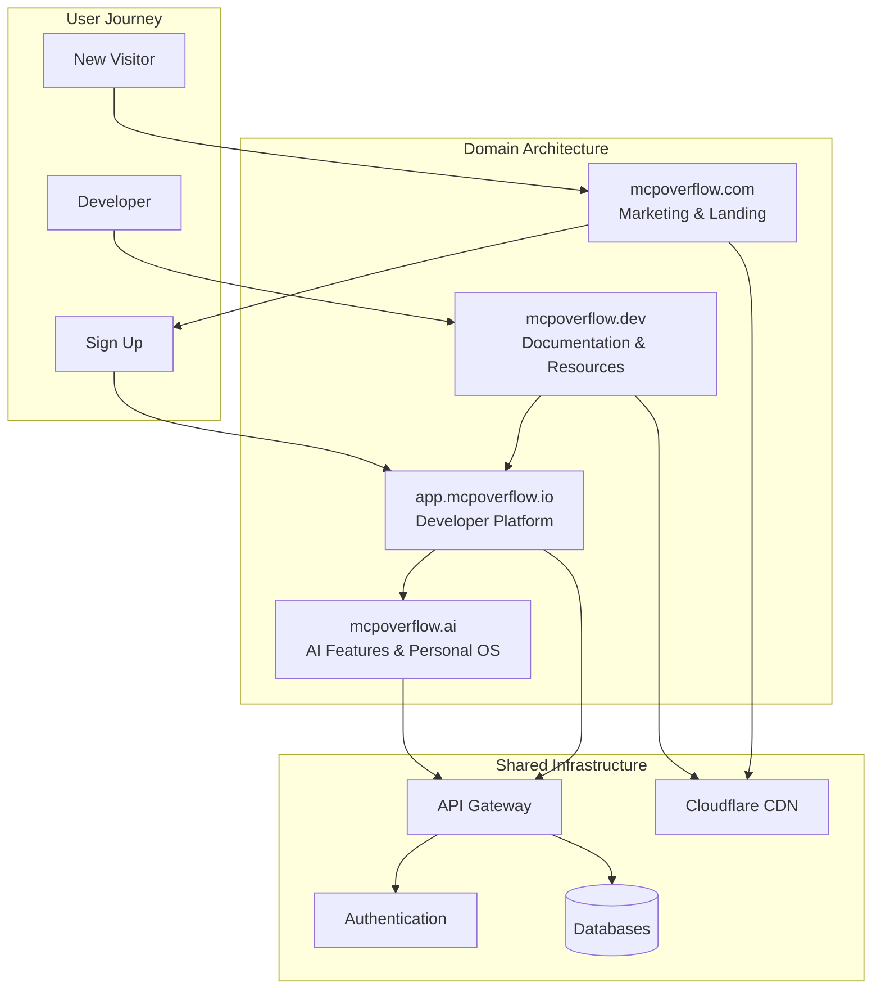
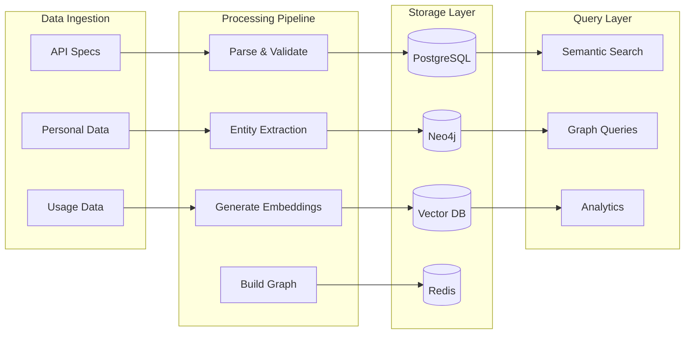

# Design Document

## Overview

MCPoverflow is designed as a comprehensive Personal AI Operating System that evolves from a simple MCP connector generator into a sophisticated platform for AI-human collaboration. The system follows a microservices architecture built on Cloudflare's edge computing platform, with advanced AI capabilities powered by vector databases, knowledge graphs, and multi-model orchestration.

The platform is designed in four evolutionary phases:
1. **Universal API Builder** - Core MCP connector generation
2. **Personal Data Integration** - Connect user's digital life
3. **AI Memory Layer** - Semantic understanding and context
4. **Personal AI OS** - Full automation and collaboration platform

## Architecture

### Domain Architecture Strategy

MCPoverflow utilizes a multi-domain architecture to provide specialized experiences:



**Domain Responsibilities:**

- **mcpoverflow.com**: SEO-optimized marketing site with product information, pricing, and conversion funnels
- **app.mcpoverflow.io**: Full-featured developer platform for creating, managing, and deploying MCP connectors
- **mcpoverflow.ai**: AI-powered interface for Personal AI OS features, knowledge graphs, and intelligent insights
- **mcpoverflow.dev**: Comprehensive developer documentation, API references, tutorials, and community resources

### High-Level Architecture

```mermaid
graph TB
    subgraph "Frontend Layer"
        UI[Next.js Dashboard]
        CLI[CLI Tool]
        SDK[SDKs - JS/Python/Go]
    end
    
    subgraph "API Gateway"
        GW[Cloudflare Workers Gateway]
        AUTH[Authentication Service]
        RATE[Rate Limiting]
    end
    
    subgraph "Core Services"
        PARSER[API Parser Service]
        GENERATOR[Code Generator Service]
        DEPLOY[Deployment Service]
        MONITOR[Monitoring Service]
    end
    
    subgraph "AgentKit Integration Layer"
        AGENTKIT_PROXY[AgentKit Proxy Service]
        AGENT_RUNTIME[Agent Runtime Manager]
        AGENT_COLLAB[Multi-Agent Orchestration]
        AGENT_MEMORY[Agent Memory System]
        AGENT_METRICS[Agent Observability]
    end
    
    subgraph "AI Services"
        EMBED[Embedding Service]
        SEARCH[Semantic Search]
        GRAPH[Knowledge Graph]
        INSIGHTS[Insights Engine]
        ORCHESTRATOR[AI Orchestrator]
    end
    
    subgraph "Data Layer"
        POSTGRES[(PostgreSQL)]
        REDIS[(Redis Cache)]
        NEO4J[(Neo4j Graph)]
        VECTOR[(Vector DB)]
        R2[(Cloudflare R2)]
        KV[(Cloudflare KV)]
        D1[(Cloudflare D1)]
    end
    
    subgraph "External Agent Ecosystems"
        OPENAI_AGENTKIT[OpenAI AgentKit]
        CLAUDE_AGENTS[Anthropic Claude Agents]
        LUNA_AGENTS[LunaOS Agents]
    end
    
    subgraph "External Integrations"
        APIS[Third-party APIs]
        EMAIL[Email Providers]
        CALENDAR[Calendar Services]
        FILES[File Storage]
        MESSAGING[Messaging Platforms]
    end
    
    UI --> GW
    CLI --> GW
    SDK --> GW
    
    GW --> AUTH
    GW --> RATE
    GW --> PARSER
    GW --> GENERATOR
    GW --> DEPLOY
    GW --> MONITOR
    
    GENERATOR --> AGENTKIT_PROXY
    DEPLOY --> AGENT_RUNTIME
    MONITOR --> AGENT_METRICS
    
    AGENTKIT_PROXY --> OPENAI_AGENTKIT
    AGENTKIT_PROXY --> CLAUDE_AGENTS
    AGENTKIT_PROXY --> LUNA_AGENTS
    
    AGENT_RUNTIME --> KV
    AGENT_MEMORY --> D1
    AGENT_COLLAB --> R2
    
    PARSER --> EMBED
    GENERATOR --> SEARCH
    MONITOR --> GRAPH
    INSIGHTS --> ORCHESTRATOR
    
    PARSER --> POSTGRES
    GENERATOR --> REDIS
    SEARCH --> VECTOR
    GRAPH --> NEO4J
    DEPLOY --> R2
    
    PARSER --> APIS
    EMBED --> EMAIL
    SEARCH --> CALENDAR
    GRAPH --> FILES
    INSIGHTS --> MESSAGING
```



### AgentKit Integration Architecture

```mermaid
graph TB
    subgraph "Generated MCP Connector"
        MCP_SERVER[MCP Server Code]
        AGENTKIT_RUNTIME[AgentKit Runtime Bindings]
        AGENTKIT_YAML[agentkit.yaml Descriptor]
        MANIFEST[manifest.json with AgentKit Metadata]
    end
    
    subgraph "AgentKit Proxy Layer"
        PROXY[AgentKit Proxy Worker]
        CIRCUIT_BREAKER[Circuit Breaker]
        RETRY_LOGIC[Retry Logic]
        TRACE_LOGGING[Trace Logging]
    end
    
    subgraph "Agent Lifecycle Management"
        REGISTRATION[Auto Registration]
        VERSIONING[Version Management]
        RECONCILIATION[Reconciliation Service]
        DEREGISTRATION[Auto Deregistration]
    end
    
    subgraph "Multi-Agent Collaboration"
        INVOKE_API[invoke() API]
        EXCHANGE_API[exchange() API]
        SHARED_CONTEXT[Shared Context KV]
        CONVERSATION_HISTORY[Conversation History R2]
    end
    
    subgraph "Agent Memory System"
        SHORT_TERM[Short-term Memory KV]
        LONG_TERM[Long-term Memory D1]
        MEMORY_API[Memory Query API]
        EXPIRATION[Memory Expiration]
    end
    
    subgraph "External Agent Ecosystems"
        OPENAI[OpenAI AgentKit]
        ANTHROPIC[Anthropic Claude Agents]
        LUNA[LunaOS Agents]
    end
    
    MCP_SERVER --> AGENTKIT_RUNTIME
    AGENTKIT_RUNTIME --> AGENTKIT_YAML
    AGENTKIT_YAML --> MANIFEST
    
    MANIFEST --> PROXY
    PROXY --> CIRCUIT_BREAKER
    CIRCUIT_BREAKER --> RETRY_LOGIC
    RETRY_LOGIC --> TRACE_LOGGING
    
    TRACE_LOGGING --> REGISTRATION
    REGISTRATION --> VERSIONING
    VERSIONING --> RECONCILIATION
    RECONCILIATION --> DEREGISTRATION
    
    REGISTRATION --> OPENAI
    REGISTRATION --> ANTHROPIC
    REGISTRATION --> LUNA
    
    OPENAI --> INVOKE_API
    ANTHROPIC --> EXCHANGE_API
    INVOKE_API --> SHARED_CONTEXT
    EXCHANGE_API --> CONVERSATION_HISTORY
    
    SHARED_CONTEXT --> SHORT_TERM
    CONVERSATION_HISTORY --> LONG_TERM
    SHORT_TERM --> MEMORY_API
    LONG_TERM --> EXPIRATION
```

### Service Architecture

#### 1. Frontend Layer

**Multi-Domain Frontend Architecture**
- **Marketing Site (mcpoverflow.com)**: Next.js with static generation for SEO
- **Developer Platform (app.mcpoverflow.io)**: Next.js dashboard with SSR
- **AI Platform (mcpoverflow.ai)**: React SPA for AI-powered features
- **Documentation (mcpoverflow.dev)**: Next.js with MDX for developer docs
- Real-time updates via WebSocket connections
- Responsive design with Tailwind CSS across all domains
- Component library using Shadcn/ui for consistency
- State management with Zustand
- Cloudflare Pages deployment for global edge distribution

**CLI Tool**
- Built with Go for cross-platform compatibility and consistency with generator
- Auto-completion and colorized output
- Configuration management
- Direct API integration
- TinyGo compilation support for local testing

**SDKs**
- TypeScript/JavaScript SDK for web applications
- Python SDK for data science workflows
- Go SDK for high-performance applications
- Auto-generated from OpenAPI specifications

#### 2. API Gateway Layer

**Cloudflare Workers Gateway**
- Edge-deployed for global low latency
- Request routing and load balancing
- SSL termination and security headers
- CORS handling and preflight requests

**Authentication Service**
- JWT-based authentication
- OAuth 2.0 integration (Google, Apple, GitHub)
- API key management
- Session handling and refresh tokens

**Rate Limiting**
- Per-user and per-endpoint limits
- Sliding window algorithm
- Graceful degradation
- Usage analytics and billing integration

#### 3. Core Services

**API Parser Service**
- OpenAPI 3.x and Swagger 2.0 support
- GraphQL schema parsing
- Postman collection processing
- Validation and error reporting
- AST generation and caching

**Code Generator Service**
- Template-based code generation with primary focus on Go/TinyGo
- Cloudflare Workers optimization for Go runtime
- Authentication flow generation
- UI component generation
- Testing code generation

**Deployment Service**
- Cloudflare Workers deployment
- Multi-platform deployment (Vercel, AWS Lambda, etc.)
- Version management and rollback
- Health checks and monitoring

**Monitoring Service**
- Real-time metrics collection
- Error tracking and alerting
- Performance monitoring
- Usage analytics

#### 4. AgentKit Integration Layer

**AgentKit Proxy Service**
- Secure proxy for OpenAI AgentKit API communication with endpoints:
  - `POST /register` - Agent registration
  - `DELETE /unregister` - Agent deregistration  
  - `GET /status/:id` - Agent status monitoring
- Circuit breaker and retry logic for reliability
- Authentication via Cloudflare Secrets (`OPENAI_API_KEY`)
- Request/response logging and tracing with trace headers
- Rate limiting and error handling with HTTP 403 for unauthorized access

**Agent Runtime Manager**
- Automatic agent registration on connector deployment using `registerAgent()`
- Agent manifest generation with `agentkit.yaml` descriptors
- Multi-ecosystem adapter support:
  - OpenAI AgentKit (primary)
  - Anthropic Claude Agents
  - LunaOS Agents
- Agent versioning and update management with auto-sync
- Reconciliation and consistency checking every 10 minutes
- Mapping table: `connector_id → agentkit_id → manifest_url → runtime → version`

**Multi-Agent Orchestration**
- Inter-agent communication via AgentKit's `invoke()` and `exchange()` APIs
- Shared context management in Cloudflare KV with `contextId`
- Agent collaboration workflow visualization in dashboard
- Cross-agent memory and state synchronization
- Agent conversation persistence in R2 storage

**Agent Memory System**
- Short-term memory storage in Cloudflare KV (`memory:<agentId>`)
- Long-term memory in D1 database with vector embeddings
- Memory query API at `/memory/context` for agents
- Automatic memory expiration after 24 hours for inactive sessions
- Memory restoration for new sessions with context loading

**Agent Observability**
- Comprehensive metrics tracking:
  - Invocation rate and response latency
  - Uptime and error rate monitoring
  - Agent collaboration statistics
- Dashboard integration with per-connector and runtime metrics
- Unified metrics endpoint `/metrics/:connectorId`
- Alert system for >3 failed registrations
- Integration with PostHog and Grafana for analytics

#### 5. AI Services Layer

**Embedding Service**
- Text-to-vector conversion using OpenAI Ada-002
- Batch processing for efficiency
- Caching and deduplication
- Multi-language support

**Semantic Search**
- Hybrid search (vector + keyword)
- Query understanding and expansion
- Result ranking and filtering
- Real-time indexing

**Knowledge Graph**
- Entity extraction and resolution
- Relationship inference
- Graph traversal and querying
- Temporal reasoning

**Insights Engine**
- Pattern recognition and anomaly detection
- Proactive suggestion generation
- Summarization and analysis
- Predictive analytics

**AI Orchestrator**
- Multi-model coordination
- Context management and passing
- Cost optimization
- Performance monitoring

### Data Architecture

#### Primary Databases

**PostgreSQL (Supabase)**
- User accounts and authentication
- API configurations and metadata
- Deployment history and logs
- Billing and subscription data
- Audit logs and compliance data

**Redis Cache**
- Session storage
- API response caching
- Rate limiting counters
- Real-time data
- Job queues

**Neo4j Graph Database**
- Knowledge graph storage
- Entity and relationship data
- Graph traversal queries
- Temporal data modeling
- Schema evolution

**Vector Database (Pinecone/Weaviate)**
- Document embeddings
- Semantic search indexes
- Similarity computations
- Real-time updates
- Metadata filtering

**Cloudflare R2**
- Generated code artifacts
- User-uploaded files
- Backup and archival data
- Static assets
- Log files

#### Data Flow Architecture



## Components and Interfaces

### Core Components

#### 1. API Parser Component

**Purpose**: Parse and validate API specifications from multiple formats

**Interfaces**:
```typescript
interface APIParser {
  parseOpenAPI(spec: string | object): ParsedAPI;
  parseGraphQL(schema: string): ParsedAPI;
  parsePostman(collection: object): ParsedAPI;
  validate(spec: ParsedAPI): ValidationResult;
  extractMetadata(spec: ParsedAPI): APIMetadata;
}

interface ParsedAPI {
  id: string;
  title: string;
  version: string;
  baseUrl: string;
  endpoints: Endpoint[];
  schemas: Schema[];
  authentication: AuthConfig;
  metadata: APIMetadata;
}

interface Endpoint {
  path: string;
  method: HTTPMethod;
  operationId: string;
  summary: string;
  description: string;
  parameters: Parameter[];
  requestBody?: RequestBody;
  responses: Response[];
  security?: SecurityRequirement[];
}
```

**Implementation Details**:
- Uses `kin-openapi` library for OpenAPI parsing
- Custom GraphQL introspection parser
- Postman collection transformer
- Comprehensive validation with detailed error messages
- Caching layer for parsed specifications

#### 2. Code Generator Component

**Purpose**: Generate MCP server code and UI components

**Interfaces**:
```typescript
interface CodeGenerator {
  generateMCPServer(api: ParsedAPI, config: GenerationConfig): GeneratedCode;
  generateAuthFlow(auth: AuthConfig): AuthCode;
  generateUIComponents(endpoints: Endpoint[]): UIComponents;
  generateTests(api: ParsedAPI): TestCode;
}

interface GenerationConfig {
  runtime: Runtime; // 'typescript' | 'go' | 'docker'
  authentication: AuthMethod[];
  includeUI: boolean;
  includeTests: boolean;
  customTemplates?: Template[];
}

interface GeneratedCode {
  server: CodeFile[];
  authentication: CodeFile[];
  ui?: CodeFile[];
  tests?: CodeFile[];
  manifest: MCPManifest;
  readme: string;
}
```

**Implementation Details**:
- Handlebars template engine for code generation
- Runtime-specific templates (TypeScript, Go, Docker)
- Authentication flow generators for OAuth 2.0, API keys, JWT
- React component generation with Tailwind CSS
- Comprehensive test generation

#### 3. Deployment Manager

**Purpose**: Deploy generated MCP servers to various platforms

**Interfaces**:
```typescript
interface DeploymentManager {
  deploy(code: GeneratedCode, target: DeploymentTarget): DeploymentResult;
  rollback(deploymentId: string): DeploymentResult;
  getStatus(deploymentId: string): DeploymentStatus;
  getLogs(deploymentId: string): LogEntry[];
}

interface DeploymentTarget {
  platform: Platform; // 'cloudflare' | 'vercel' | 'aws' | 'gcp' | 'azure'
  credentials: PlatformCredentials;
  configuration: DeploymentConfig;
}

interface DeploymentResult {
  deploymentId: string;
  url: string;
  status: DeploymentStatus;
  logs: LogEntry[];
  rollbackUrl?: string;
}
```

**Implementation Details**:
- Platform-specific deployment adapters
- Blue-green deployment strategy
- Automated rollback capabilities
- Real-time deployment monitoring
- Health check integration

#### 4. Personal Data Connector

**Purpose**: Connect and sync personal data sources

**Interfaces**:
```typescript
interface PersonalDataConnector {
  connectEmail(provider: EmailProvider, credentials: Credentials): Connection;
  connectCalendar(provider: CalendarProvider, credentials: Credentials): Connection;
  connectFiles(provider: FileProvider, credentials: Credentials): Connection;
  connectMessaging(provider: MessagingProvider, credentials: Credentials): Connection;
  sync(connectionId: string): SyncResult;
  search(query: SearchQuery): SearchResult[];
}

interface Connection {
  id: string;
  provider: DataProvider;
  status: ConnectionStatus;
  lastSync: Date;
  syncFrequency: SyncFrequency;
  permissions: Permission[];
}

interface SyncResult {
  connectionId: string;
  itemsProcessed: number;
  itemsAdded: number;
  itemsUpdated: number;
  errors: SyncError[];
  nextSync: Date;
}
```

**Implementation Details**:
- Provider-specific adapters (Gmail, Outlook, Google Drive, etc.)
- Incremental sync with change detection
- OAuth 2.0 flow management
- Data transformation and normalization
- Privacy-preserving data processing

#### 5. Knowledge Graph Engine

**Purpose**: Build and query semantic knowledge graph

**Interfaces**:
```typescript
interface KnowledgeGraphEngine {
  extractEntities(content: string): Entity[];
  inferRelationships(entities: Entity[]): Relationship[];
  resolveEntities(entities: Entity[]): EntityResolution[];
  query(cypher: string): QueryResult;
  traverse(startNode: string, pattern: TraversalPattern): TraversalResult;
}

interface Entity {
  id: string;
  type: EntityType; // 'Person' | 'Organization' | 'Project' | 'Concept' | 'Event'
  properties: Record<string, any>;
  confidence: number;
  sources: DataSource[];
}

interface Relationship {
  id: string;
  type: RelationshipType;
  source: string;
  target: string;
  properties: Record<string, any>;
  confidence: number;
  temporal?: TemporalInfo;
}
```

**Implementation Details**:
- Named Entity Recognition (NER) using spaCy or similar
- Relationship extraction using LLMs
- Entity resolution with fuzzy matching
- Neo4j graph database integration
- Temporal relationship modeling

#### 6. Semantic Search Engine

**Purpose**: Provide intelligent search across all user data

**Interfaces**:
```typescript
interface SemanticSearchEngine {
  index(document: Document): IndexResult;
  search(query: SearchQuery): SearchResult[];
  suggest(partial: string): Suggestion[];
  explain(query: string, result: SearchResult): Explanation;
}

interface SearchQuery {
  text: string;
  filters?: SearchFilter[];
  limit?: number;
  offset?: number;
  includeMetadata?: boolean;
}

interface SearchResult {
  id: string;
  content: string;
  metadata: DocumentMetadata;
  score: number;
  highlights: Highlight[];
  relatedEntities: Entity[];
}
```

**Implementation Details**:
- Vector embeddings using OpenAI Ada-002
- Hybrid search combining vector and keyword search
- Query understanding and expansion
- Result ranking with multiple factors
- Real-time indexing pipeline

### Integration Interfaces

#### External API Integration

```typescript
interface ExternalAPIClient {
  authenticate(credentials: Credentials): AuthResult;
  makeRequest(request: APIRequest): APIResponse;
  handleRateLimit(response: APIResponse): RateLimitResult;
  refreshToken(refreshToken: string): TokenResult;
}

interface APIRequest {
  endpoint: string;
  method: HTTPMethod;
  headers: Record<string, string>;
  body?: any;
  timeout?: number;
}
```

#### AI Model Integration

```typescript
interface AIModelOrchestrator {
  selectModel(task: AITask): ModelSelection;
  executeTask(task: AITask, model: AIModel): TaskResult;
  combineResults(results: TaskResult[]): CombinedResult;
  optimizeCost(tasks: AITask[]): OptimizationResult;
}

interface AITask {
  type: TaskType; // 'reasoning' | 'generation' | 'analysis' | 'vision'
  input: any;
  requirements: TaskRequirements;
  context?: ConversationContext;
}
```

## Data Models

### Core Data Models

#### User and Organization

```typescript
interface User {
  id: string;
  email: string;
  name: string;
  avatar?: string;
  preferences: UserPreferences;
  subscription: Subscription;
  organizations: OrganizationMembership[];
  createdAt: Date;
  updatedAt: Date;
}

interface Organization {
  id: string;
  name: string;
  slug: string;
  settings: OrganizationSettings;
  subscription: Subscription;
  members: OrganizationMembership[];
  createdAt: Date;
  updatedAt: Date;
}

interface OrganizationMembership {
  userId: string;
  organizationId: string;
  role: Role; // 'owner' | 'admin' | 'developer' | 'viewer'
  permissions: Permission[];
  joinedAt: Date;
}
```

#### API and Connector Models

```typescript
interface APIIntegration {
  id: string;
  userId: string;
  organizationId?: string;
  name: string;
  description: string;
  specification: APISpecification;
  configuration: IntegrationConfig;
  deployment?: Deployment;
  status: IntegrationStatus;
  metrics: UsageMetrics;
  createdAt: Date;
  updatedAt: Date;
}

interface APISpecification {
  format: SpecFormat; // 'openapi' | 'graphql' | 'postman'
  version: string;
  content: string | object;
  hash: string;
  metadata: SpecMetadata;
}

interface Deployment {
  id: string;
  integrationId: string;
  platform: DeploymentPlatform;
  url: string;
  version: string;
  status: DeploymentStatus;
  logs: DeploymentLog[];
  deployedAt: Date;
}
```

#### Personal Data Models

```typescript
interface DataConnection {
  id: string;
  userId: string;
  provider: DataProvider;
  type: DataType; // 'email' | 'calendar' | 'files' | 'messaging'
  credentials: EncryptedCredentials;
  configuration: ConnectionConfig;
  status: ConnectionStatus;
  lastSync: Date;
  syncStats: SyncStatistics;
  createdAt: Date;
}

interface Document {
  id: string;
  connectionId: string;
  externalId: string;
  type: DocumentType;
  title: string;
  content: string;
  metadata: DocumentMetadata;
  embedding?: number[];
  entities: EntityReference[];
  indexedAt: Date;
  updatedAt: Date;
}

interface EntityReference {
  entityId: string;
  entityType: EntityType;
  confidence: number;
  mentions: TextSpan[];
}
```

#### Knowledge Graph Models

```typescript
// Neo4j Node Models
interface PersonNode {
  id: string;
  name: string;
  email?: string;
  title?: string;
  organization?: string;
  aliases: string[];
  confidence: number;
  sources: string[];
  createdAt: Date;
  updatedAt: Date;
}

interface ProjectNode {
  id: string;
  name: string;
  description?: string;
  status: ProjectStatus;
  startDate?: Date;
  endDate?: Date;
  tags: string[];
  confidence: number;
  sources: string[];
}

// Neo4j Relationship Models
interface WorksWithRelationship {
  type: 'WORKS_WITH';
  since?: Date;
  until?: Date;
  context: string[];
  strength: number;
  confidence: number;
}

interface ParticipatedInRelationship {
  type: 'PARTICIPATED_IN';
  role?: string;
  startDate?: Date;
  endDate?: Date;
  contribution: string[];
  confidence: number;
}
```

#### AgentKit Models

```typescript
interface AgentKitManifest {
  id: string;
  connectorId: string;
  agentKitId?: string;
  runtime: AgentRuntime; // 'cloudflare-go' | 'cloudflare-ts' | 'docker' | 'railway'
  manifestUrl: string;
  version: string;
  permissions: AgentPermission[];
  status: AgentStatus; // 'active' | 'pending' | 'failed' | 'unregistered'
  registeredAt?: Date;
  lastSync?: Date;
  metadata: AgentMetadata;
}

interface AgentRuntime {
  type: string;
  constraints: RuntimeConstraints;
  capabilities: string[];
  resourceLimits: ResourceLimits;
}

interface AgentCollaboration {
  id: string;
  initiatorAgentId: string;
  targetAgentId: string;
  contextId: string;
  conversationHistory: AgentMessage[];
  sharedContext: Record<string, any>;
  status: CollaborationStatus;
  createdAt: Date;
  updatedAt: Date;
}

interface AgentMemory {
  agentId: string;
  contextId: string;
  shortTermMemory: Record<string, any>; // KV storage
  longTermMemory: EmbeddedMemory[]; // D1 with embeddings
  expiresAt: Date;
  lastAccessed: Date;
}

interface AgentMetrics {
  agentId: string;
  invocationCount: number;
  responseLatency: number[];
  uptime: number;
  errorRate: number;
  lastInvocation: Date;
  collaborationCount: number;
}
```

#### AI and Context Models

```typescript
interface ConversationContext {
  id: string;
  userId: string;
  sessionId: string;
  messages: ContextMessage[];
  entities: ContextEntity[];
  summary: string;
  metadata: ContextMetadata;
  createdAt: Date;
  updatedAt: Date;
}

interface ContextMessage {
  id: string;
  role: MessageRole; // 'user' | 'assistant' | 'system'
  content: string;
  metadata: MessageMetadata;
  entities: EntityReference[];
  timestamp: Date;
}

interface Insight {
  id: string;
  userId: string;
  type: InsightType;
  title: string;
  description: string;
  data: InsightData;
  confidence: number;
  actionable: boolean;
  dismissed: boolean;
  createdAt: Date;
}
```

### Database Schema Design

#### PostgreSQL Schema

```sql
-- Users and Organizations
CREATE TABLE users (
  id UUID PRIMARY KEY DEFAULT gen_random_uuid(),
  email VARCHAR(255) UNIQUE NOT NULL,
  name VARCHAR(255) NOT NULL,
  avatar TEXT,
  preferences JSONB DEFAULT '{}',
  created_at TIMESTAMP WITH TIME ZONE DEFAULT NOW(),
  updated_at TIMESTAMP WITH TIME ZONE DEFAULT NOW()
);

CREATE TABLE organizations (
  id UUID PRIMARY KEY DEFAULT gen_random_uuid(),
  name VARCHAR(255) NOT NULL,
  slug VARCHAR(100) UNIQUE NOT NULL,
  settings JSONB DEFAULT '{}',
  created_at TIMESTAMP WITH TIME ZONE DEFAULT NOW(),
  updated_at TIMESTAMP WITH TIME ZONE DEFAULT NOW()
);

CREATE TABLE organization_memberships (
  user_id UUID REFERENCES users(id) ON DELETE CASCADE,
  organization_id UUID REFERENCES organizations(id) ON DELETE CASCADE,
  role VARCHAR(50) NOT NULL,
  permissions JSONB DEFAULT '[]',
  joined_at TIMESTAMP WITH TIME ZONE DEFAULT NOW(),
  PRIMARY KEY (user_id, organization_id)
);

-- API Integrations
CREATE TABLE api_integrations (
  id UUID PRIMARY KEY DEFAULT gen_random_uuid(),
  user_id UUID REFERENCES users(id) ON DELETE CASCADE,
  organization_id UUID REFERENCES organizations(id) ON DELETE SET NULL,
  name VARCHAR(255) NOT NULL,
  description TEXT,
  specification JSONB NOT NULL,
  configuration JSONB DEFAULT '{}',
  status VARCHAR(50) DEFAULT 'draft',
  created_at TIMESTAMP WITH TIME ZONE DEFAULT NOW(),
  updated_at TIMESTAMP WITH TIME ZONE DEFAULT NOW()
);

CREATE TABLE deployments (
  id UUID PRIMARY KEY DEFAULT gen_random_uuid(),
  integration_id UUID REFERENCES api_integrations(id) ON DELETE CASCADE,
  platform VARCHAR(50) NOT NULL,
  url TEXT NOT NULL,
  version VARCHAR(50) NOT NULL,
  status VARCHAR(50) DEFAULT 'pending',
  logs JSONB DEFAULT '[]',
  deployed_at TIMESTAMP WITH TIME ZONE DEFAULT NOW()
);

-- Personal Data Connections
CREATE TABLE data_connections (
  id UUID PRIMARY KEY DEFAULT gen_random_uuid(),
  user_id UUID REFERENCES users(id) ON DELETE CASCADE,
  provider VARCHAR(100) NOT NULL,
  type VARCHAR(50) NOT NULL,
  credentials TEXT NOT NULL, -- encrypted
  configuration JSONB DEFAULT '{}',
  status VARCHAR(50) DEFAULT 'active',
  last_sync TIMESTAMP WITH TIME ZONE,
  sync_stats JSONB DEFAULT '{}',
  created_at TIMESTAMP WITH TIME ZONE DEFAULT NOW()
);

CREATE TABLE documents (
  id UUID PRIMARY KEY DEFAULT gen_random_uuid(),
  connection_id UUID REFERENCES data_connections(id) ON DELETE CASCADE,
  external_id VARCHAR(255) NOT NULL,
  type VARCHAR(50) NOT NULL,
  title TEXT NOT NULL,
  content TEXT NOT NULL,
  metadata JSONB DEFAULT '{}',
  indexed_at TIMESTAMP WITH TIME ZONE DEFAULT NOW(),
  updated_at TIMESTAMP WITH TIME ZONE DEFAULT NOW(),
  UNIQUE(connection_id, external_id)
);

-- Indexes for performance
CREATE INDEX idx_api_integrations_user_id ON api_integrations(user_id);
CREATE INDEX idx_deployments_integration_id ON deployments(integration_id);
CREATE INDEX idx_documents_connection_id ON documents(connection_id);
CREATE INDEX idx_documents_type ON documents(type);
CREATE INDEX idx_documents_metadata ON documents USING GIN(metadata);

-- AgentKit Integration
CREATE TABLE agentkit_manifests (
  id UUID PRIMARY KEY DEFAULT gen_random_uuid(),
  connector_id UUID REFERENCES api_integrations(id) ON DELETE CASCADE,
  agentkit_id VARCHAR(255),
  runtime VARCHAR(50) NOT NULL,
  manifest_url TEXT NOT NULL,
  version VARCHAR(50) NOT NULL,
  permissions JSONB DEFAULT '[]',
  status VARCHAR(50) DEFAULT 'pending',
  registered_at TIMESTAMP WITH TIME ZONE,
  last_sync TIMESTAMP WITH TIME ZONE,
  metadata JSONB DEFAULT '{}',
  created_at TIMESTAMP WITH TIME ZONE DEFAULT NOW(),
  updated_at TIMESTAMP WITH TIME ZONE DEFAULT NOW(),
  UNIQUE(connector_id)
);

CREATE TABLE agent_collaborations (
  id UUID PRIMARY KEY DEFAULT gen_random_uuid(),
  initiator_agent_id UUID REFERENCES agentkit_manifests(id) ON DELETE CASCADE,
  target_agent_id UUID REFERENCES agentkit_manifests(id) ON DELETE CASCADE,
  context_id VARCHAR(255) NOT NULL,
  conversation_history JSONB DEFAULT '[]',
  shared_context JSONB DEFAULT '{}',
  status VARCHAR(50) DEFAULT 'active',
  created_at TIMESTAMP WITH TIME ZONE DEFAULT NOW(),
  updated_at TIMESTAMP WITH TIME ZONE DEFAULT NOW()
);

CREATE TABLE agent_memory (
  id UUID PRIMARY KEY DEFAULT gen_random_uuid(),
  agent_id UUID REFERENCES agentkit_manifests(id) ON DELETE CASCADE,
  context_id VARCHAR(255) NOT NULL,
  memory_type VARCHAR(50) NOT NULL, -- 'short_term' | 'long_term'
  content JSONB NOT NULL,
  embedding VECTOR(1536), -- for long-term memory
  expires_at TIMESTAMP WITH TIME ZONE,
  last_accessed TIMESTAMP WITH TIME ZONE DEFAULT NOW(),
  created_at TIMESTAMP WITH TIME ZONE DEFAULT NOW()
);

CREATE TABLE agent_metrics (
  id UUID PRIMARY KEY DEFAULT gen_random_uuid(),
  agent_id UUID REFERENCES agentkit_manifests(id) ON DELETE CASCADE,
  metric_type VARCHAR(50) NOT NULL,
  value NUMERIC NOT NULL,
  timestamp TIMESTAMP WITH TIME ZONE DEFAULT NOW(),
  metadata JSONB DEFAULT '{}'
);

-- Indexes for AgentKit
CREATE INDEX idx_agentkit_manifests_connector_id ON agentkit_manifests(connector_id);
CREATE INDEX idx_agentkit_manifests_status ON agentkit_manifests(status);
CREATE INDEX idx_agent_collaborations_context_id ON agent_collaborations(context_id);
CREATE INDEX idx_agent_memory_agent_id ON agent_memory(agent_id);
CREATE INDEX idx_agent_memory_context_id ON agent_memory(context_id);
CREATE INDEX idx_agent_metrics_agent_id ON agent_metrics(agent_id);
CREATE INDEX idx_agent_metrics_timestamp ON agent_metrics(timestamp);
```

#### Neo4j Schema

```cypher
// Node constraints and indexes
CREATE CONSTRAINT person_id IF NOT EXISTS FOR (p:Person) REQUIRE p.id IS UNIQUE;
CREATE CONSTRAINT organization_id IF NOT EXISTS FOR (o:Organization) REQUIRE o.id IS UNIQUE;
CREATE CONSTRAINT project_id IF NOT EXISTS FOR (pr:Project) REQUIRE pr.id IS UNIQUE;
CREATE CONSTRAINT concept_id IF NOT EXISTS FOR (c:Concept) REQUIRE c.id IS UNIQUE;
CREATE CONSTRAINT document_id IF NOT EXISTS FOR (d:Document) REQUIRE d.id IS UNIQUE;

// Indexes for performance
CREATE INDEX person_name IF NOT EXISTS FOR (p:Person) ON (p.name);
CREATE INDEX organization_name IF NOT EXISTS FOR (o:Organization) ON (o.name);
CREATE INDEX project_name IF NOT EXISTS FOR (pr:Project) ON (pr.name);
CREATE INDEX document_title IF NOT EXISTS FOR (d:Document) ON (d.title);

// Relationship indexes
CREATE INDEX works_with_since IF NOT EXISTS FOR ()-[r:WORKS_WITH]-() ON (r.since);
CREATE INDEX participated_in_date IF NOT EXISTS FOR ()-[r:PARTICIPATED_IN]-() ON (r.startDate);
```

## Error Handling

### Error Classification

#### 1. User Errors (4xx)
- **400 Bad Request**: Invalid API specification format
- **401 Unauthorized**: Invalid or expired authentication
- **403 Forbidden**: Insufficient permissions
- **404 Not Found**: Resource not found
- **409 Conflict**: Resource already exists
- **422 Unprocessable Entity**: Validation errors
- **429 Too Many Requests**: Rate limit exceeded

#### 2. System Errors (5xx)
- **500 Internal Server Error**: Unexpected system error
- **502 Bad Gateway**: External service unavailable
- **503 Service Unavailable**: System maintenance
- **504 Gateway Timeout**: Request timeout

### Error Response Format

```typescript
interface ErrorResponse {
  error: {
    code: string;
    message: string;
    details?: ErrorDetail[];
    requestId: string;
    timestamp: string;
  };
}

interface ErrorDetail {
  field?: string;
  code: string;
  message: string;
  value?: any;
}
```

### Error Handling Strategies

#### 1. Circuit Breaker Pattern
```typescript
class CircuitBreaker {
  private state: 'CLOSED' | 'OPEN' | 'HALF_OPEN' = 'CLOSED';
  private failureCount = 0;
  private lastFailureTime?: Date;
  
  async execute<T>(operation: () => Promise<T>): Promise<T> {
    if (this.state === 'OPEN') {
      if (this.shouldAttemptReset()) {
        this.state = 'HALF_OPEN';
      } else {
        throw new Error('Circuit breaker is OPEN');
      }
    }
    
    try {
      const result = await operation();
      this.onSuccess();
      return result;
    } catch (error) {
      this.onFailure();
      throw error;
    }
  }
}
```

#### 2. Retry Logic with Exponential Backoff
```typescript
async function retryWithBackoff<T>(
  operation: () => Promise<T>,
  maxRetries: number = 3,
  baseDelay: number = 1000
): Promise<T> {
  for (let attempt = 0; attempt <= maxRetries; attempt++) {
    try {
      return await operation();
    } catch (error) {
      if (attempt === maxRetries || !isRetryableError(error)) {
        throw error;
      }
      
      const delay = baseDelay * Math.pow(2, attempt);
      await new Promise(resolve => setTimeout(resolve, delay));
    }
  }
  
  throw new Error('Max retries exceeded');
}
```

#### 3. Graceful Degradation
```typescript
class GracefulDegradation {
  async getRecommendations(userId: string): Promise<Recommendation[]> {
    try {
      // Try AI-powered recommendations
      return await this.aiRecommendationService.getRecommendations(userId);
    } catch (error) {
      logger.warn('AI recommendations failed, falling back to rule-based', { error });
      
      try {
        // Fallback to rule-based recommendations
        return await this.ruleBasedRecommendations.getRecommendations(userId);
      } catch (fallbackError) {
        logger.error('All recommendation services failed', { fallbackError });
        
        // Return cached or default recommendations
        return await this.getCachedRecommendations(userId);
      }
    }
  }
}
```

## Testing Strategy

### Testing Pyramid

#### 1. Unit Tests (70%)
- **Scope**: Individual functions and components
- **Tools**: Jest, Vitest, Go testing package
- **Coverage**: >80% code coverage
- **Focus**: Business logic, data transformations, utilities

```typescript
// Example unit test
describe('APIParser', () => {
  it('should parse valid OpenAPI specification', () => {
    const parser = new APIParser();
    const spec = {
      openapi: '3.0.0',
      info: { title: 'Test API', version: '1.0.0' },
      paths: {}
    };
    
    const result = parser.parseOpenAPI(spec);
    
    expect(result.title).toBe('Test API');
    expect(result.version).toBe('1.0.0');
  });
});
```

#### 2. Integration Tests (20%)
- **Scope**: Service interactions and API endpoints
- **Tools**: Supertest, Testcontainers
- **Focus**: Database operations, external API calls, authentication flows

```typescript
// Example integration test
describe('API Integration Endpoints', () => {
  it('should create and deploy integration', async () => {
    const response = await request(app)
      .post('/api/integrations')
      .set('Authorization', `Bearer ${authToken}`)
      .send({
        name: 'Test Integration',
        specification: validOpenAPISpec
      });
    
    expect(response.status).toBe(201);
    expect(response.body.id).toBeDefined();
    
    // Test deployment
    const deployResponse = await request(app)
      .post(`/api/integrations/${response.body.id}/deploy`)
      .set('Authorization', `Bearer ${authToken}`);
    
    expect(deployResponse.status).toBe(200);
  });
});
```

#### 3. End-to-End Tests (10%)
- **Scope**: Complete user workflows
- **Tools**: Playwright, Cypress
- **Focus**: Critical user journeys, cross-browser compatibility

```typescript
// Example E2E test
test('complete integration workflow', async ({ page }) => {
  await page.goto('/dashboard');
  
  // Create new integration
  await page.click('[data-testid="create-integration"]');
  await page.fill('[data-testid="integration-name"]', 'Test API');
  await page.setInputFiles('[data-testid="spec-upload"]', 'test-spec.yaml');
  await page.click('[data-testid="create-button"]');
  
  // Verify integration created
  await expect(page.locator('[data-testid="integration-list"]')).toContainText('Test API');
  
  // Deploy integration
  await page.click('[data-testid="deploy-button"]');
  await expect(page.locator('[data-testid="deployment-status"]')).toContainText('Deployed');
});
```

### Performance Testing

#### Load Testing
```javascript
// k6 load test script
import http from 'k6/http';
import { check } from 'k6';

export let options = {
  stages: [
    { duration: '2m', target: 100 },
    { duration: '5m', target: 100 },
    { duration: '2m', target: 200 },
    { duration: '5m', target: 200 },
    { duration: '2m', target: 0 },
  ],
};

export default function() {
  let response = http.post('https://api.mcpoverflow.io/parse', {
    spec: openAPISpec,
  }, {
    headers: { 'Authorization': `Bearer ${__ENV.API_TOKEN}` },
  });
  
  check(response, {
    'status is 200': (r) => r.status === 200,
    'response time < 500ms': (r) => r.timings.duration < 500,
  });
}
```

### Security Testing

#### 1. Authentication Testing
- JWT token validation
- OAuth flow security
- Session management
- Rate limiting effectiveness

#### 2. Input Validation Testing
- SQL injection prevention
- XSS protection
- CSRF protection
- File upload security

#### 3. API Security Testing
- Authorization checks
- Data exposure prevention
- Rate limiting
- Input sanitization

## Technology Stack

### Core Technologies

**Frontend (Multi-Domain):**
- **mcpoverflow.com**: Next.js 14 with static generation (SSG)
- **app.mcpoverflow.io**: Next.js 14 with server-side rendering (SSR)
- **mcpoverflow.ai**: React 18 SPA with Vite
- **mcpoverflow.dev**: Next.js 14 with MDX for documentation
- Shared: TypeScript, Tailwind CSS, Shadcn/ui component library
- State management with Zustand (cross-domain compatible)
- Cloudflare Pages for hosting all domains

**Backend & Code Generation:**
- Go 1.21+ for core services
- TinyGo for WASM compilation to Cloudflare Workers
- Custom MCP protocol implementation in Go
- **OpenAI AgentKit SDK integration**
- **Multi-agent orchestration framework**
- Template-based code generation with Go templates

**Infrastructure:**
- Cloudflare Workers for serverless compute
- Cloudflare R2 for object storage
- Cloudflare KV for key-value storage
- Cloudflare D1 for SQL database (SQLite)
- PostgreSQL (Supabase) for complex relational data

**AI & Search:**
- OpenAI API for embeddings and LLM operations
- **OpenAI AgentKit for autonomous agent capabilities**
- **Anthropic Claude Agents integration**
- **LunaOS Agents support**
- Neo4j for knowledge graph
- Pinecone/Weaviate for vector search
- Redis for caching

**Development & Deployment:**
- Docker for development environment
- GitHub Actions for CI/CD
- TinyGo toolchain for WASM builds
- Cloudflare Wrangler for deployment

This comprehensive design document provides the technical foundation for implementing MCPoverflow as a scalable, secure, and intelligent Personal AI Operating System. The architecture supports the evolutionary development from a simple MCP connector generator to a sophisticated AI collaboration platform.