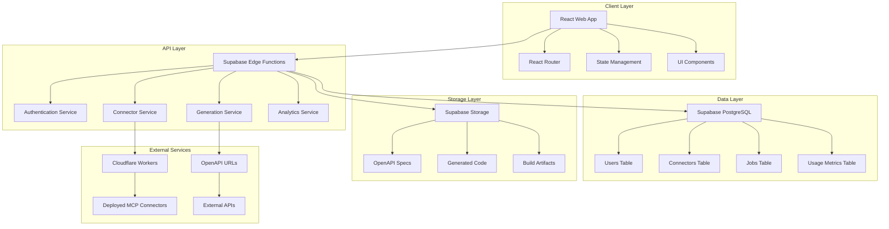
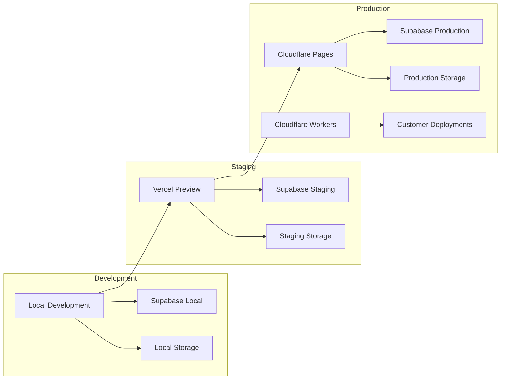
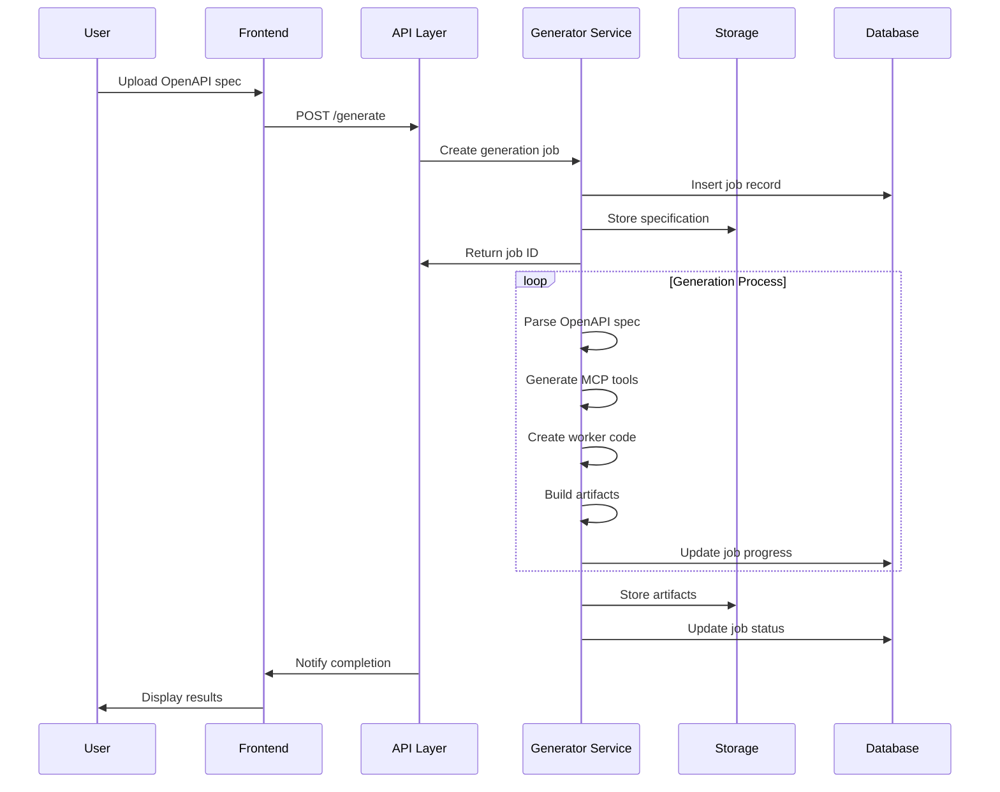
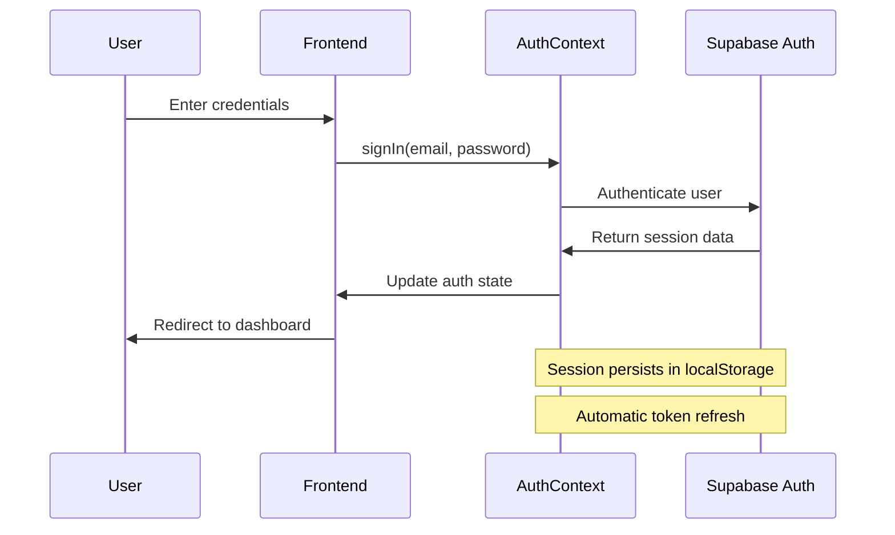
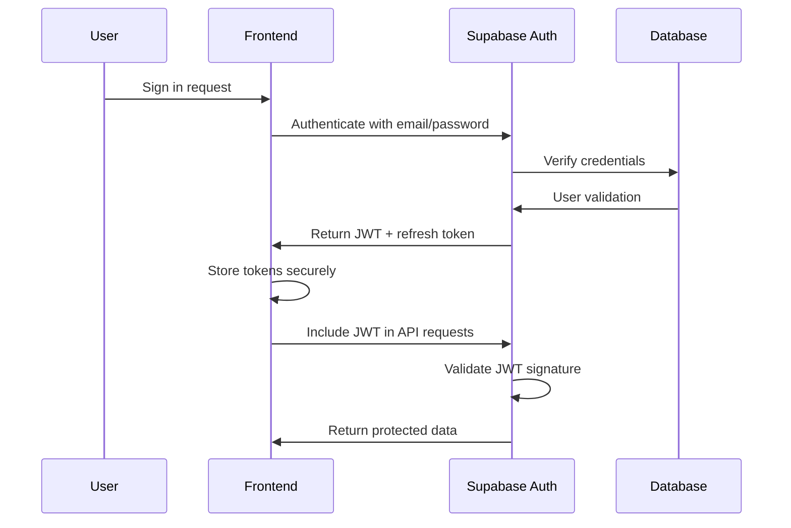
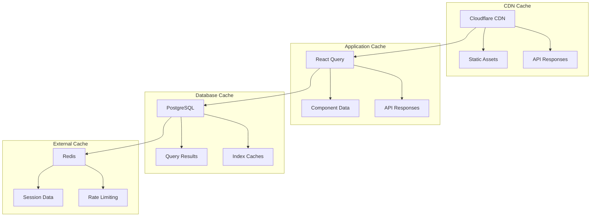
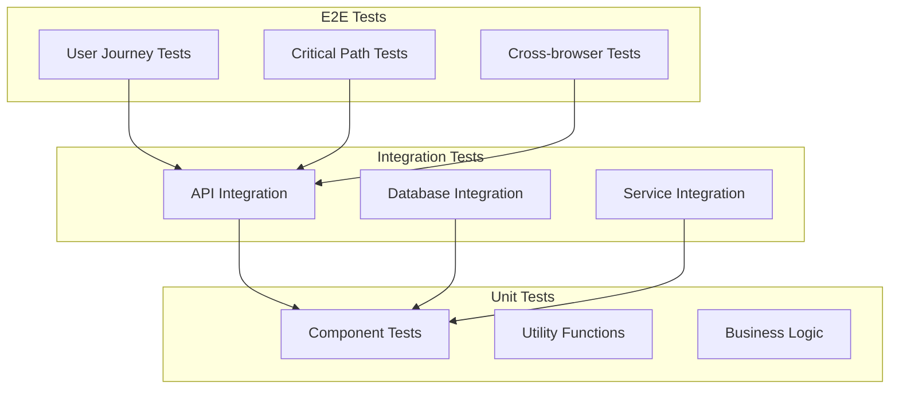

# MCPOverflow Technical Design Document

**Scope**: MCPOverflow Platform
**Generated**: November 1, 2025
**Agent**: Design Architect Agent
**Based on**: requirements.md

---

## Overview

MCPOverflow is a comprehensive platform for generating and managing Model Context Protocol (MCP) connectors from OpenAPI specifications. The system enables users to upload OpenAPI specs, automatically generate MCP workers with proper authentication handling, and deploy them as serverless functions. This technical design provides a scalable, maintainable, and production-ready architecture that addresses all functional and non-functional requirements.

## Architecture

### High-Level Architecture



### System Components

The MCPOverflow platform follows a multi-tier architecture with clear separation of concerns:

1. **Frontend Layer**: React-based single-page application with TypeScript
2. **API Layer**: Supabase Edge Functions for serverless business logic
3. **Data Layer**: PostgreSQL database with optimized schemas
4. **Storage Layer**: Object storage for specifications and generated artifacts
5. **Deployment Layer**: Cloudflare Workers for generated MCP connectors

### Deployment Architecture



### Technology Stack

**Frontend Technologies:**

- **React 18** with TypeScript for type safety
- **Vite** for fast development and optimized builds
- **React Router v7** for client-side routing
- **Tailwind CSS** for utility-first styling
- **Lucide React** for consistent iconography
- **React i18next** for internationalization support

**Backend & Infrastructure:**

- **Supabase** for authentication, database, and edge functions
- **PostgreSQL** for relational data storage
- **Supabase Storage** for file and artifact storage
- **Cloudflare Workers** for deployed MCP connectors
- **Cloudflare Pages** for frontend hosting

**Development Tools:**

- **TypeScript** for static type checking
- **ESLint + Prettier** for code quality
- **Husky + lint-staged** for pre-commit hooks
- **Changesets** for version management

## Components and Interfaces

### Authentication & User Management

#### AuthContext

**Purpose**: Centralized authentication state management using Supabase Auth

**Responsibilities**:

- Manage user session state
- Handle authentication flows (sign up, sign in, sign out)
- Provide authentication utilities to components
- Manage password reset functionality

**Interface**:

```typescript
interface AuthContextType {
  user: User | null
  loading: boolean
  signUp: (email: string, password: string) => Promise<void>
  signIn: (email: string, password: string) => Promise<void>
  signOut: () => Promise<void>
  resetPassword: (email: string) => Promise<void>
}
```

**Dependencies**:

- Supabase Auth client
- React Context API

**Implementation Notes**:

- Uses React Query for caching and synchronization
- Implements automatic token refresh
- Handles network errors gracefully

#### ProtectedRoute

**Purpose**: Route protection component for authenticated-only pages

**Responsibilities**:

- Check authentication status before rendering protected content
- Redirect unauthenticated users to login page
- Show loading states during authentication checks

**Interface**:

```typescript
interface ProtectedRouteProps {
  children: React.ReactNode
  redirectTo?: string
}
```

**Dependencies**:

- AuthContext for authentication state
- React Router for navigation

### Connector Management

#### OpenAPIParser Class

**Purpose**: Parse and analyze OpenAPI specifications for MCP generation

**Responsibilities**:

- Parse OpenAPI 3.x specifications (JSON/YAML)
- Extract endpoints, parameters, and schemas
- Detect authentication schemes
- Generate MCP tool definitions
- Validate specification format and structure

**Interface**:

```typescript
class OpenAPIParser {
  constructor(spec: OpenAPISpec, excludePatterns?: string[])
  detectAuthMode(): AuthMode
  parseToTools(): MCPTool[]
  generateManifest(): MCPManifest
  getSpecSummary(): SpecSummary
  buildInputSchema(parameters?: any[], requestBody?: any): any
  buildOutputSchema(responses?: any): any
  flattenSchema(schema: any, maxDepth: number, currentDepth?: number): any
}
```

**Dependencies**:

- Custom OpenAPI validation logic
- JSON schema processing utilities

**Implementation Notes**:

- Handles both JSON and YAML specifications
- Implements smart endpoint filtering
- Supports complex schema flattening for MCP compatibility

#### ConnectorService

**Purpose**: Business logic for connector CRUD operations

**Responsibilities**:

- Create, read, update, delete connectors
- Manage connector versions
- Handle build artifact storage
- Coordinate with generation jobs

**Interface**:

```typescript
interface ConnectorService {
  createConnector(data: CreateConnectorRequest): Promise<Connector>
  getConnector(id: string): Promise<Connector | null>
  updateConnector(id: string, data: UpdateConnectorRequest): Promise<Connector>
  deleteConnector(id: string): Promise<void>
  listConnectors(userId: string, filters?: ConnectorFilters): Promise<Connector[]>
  createVersion(connectorId: string): Promise<Connector>
}
```

**Dependencies**:

- Supabase client for database operations
- Storage service for artifact management

### Generation Engine

#### GeneratorService

**Purpose**: Orchestrate the connector generation process

**Responsibilities**:

- Coordinate background job creation
- Manage generation pipeline stages
- Handle specification processing
- Generate and store build artifacts
- Track job status and logs

**Interface**:

```typescript
interface GeneratorService {
  startGeneration(request: GenerateRequest): Promise<GenerateResponse>
  getJobStatus(jobId: string): Promise<Job>
  retryJob(jobId: string): Promise<void>
  getJobLogs(jobId: string): Promise<LogEntry[]>
  generateWorkerCode(manifest: MCPManifest, authMode: AuthMode): string
  validateSpecification(specContent: string): Promise<ValidationResult>
}
```

**Dependencies**:

- OpenAPIParser for specification processing
- Supabase Edge Functions for background processing
- Storage service for artifact storage

**Implementation Notes**:

- Uses Supabase Edge Functions for serverless generation
- Implements progressive status updates
- Provides detailed error logging and recovery

### User Interface Components

#### Layout Component

**Purpose**: Main application layout with navigation and theme support

**Responsibilities**:

- Provide consistent page structure
- Render navigation header
- Manage responsive layout
- Handle theme switching

**Interface**:

```typescript
interface LayoutProps {
  children: React.ReactNode
}
```

**Dependencies**:

- Header component for navigation
- ThemeProvider for theme management
- Responsive design utilities

#### Dashboard Component

**Purpose**: Main connector management interface

**Responsibilities**:

- Display user's connector collection
- Provide search and filtering capabilities
- Show connector status and metadata
- Enable quick actions (edit, delete, deploy)

**Interface**:

```typescript
interface DashboardProps {
  // Props passed via React Router
}

interface ConnectorFilters {
  search?: string
  status?: ConnectorStatus
  runtime?: ConnectorRuntime
  sortBy?: 'name' | 'created_at' | 'updated_at'
  sortOrder?: 'asc' | 'desc'
}
```

**Dependencies**:

- ConnectorService for data operations
- UI components for display and interaction
- React Query for data caching

#### Generate Component

**Purpose**: OpenAPI specification upload and generation interface

**Responsibilities**:

- Handle file and URL uploads
- Provide specification validation feedback
- Configure generation options
- Display generation progress and results

**Interface**:

```typescript
interface GenerateProps {
  // Props passed via React Router
}

interface GenerationConfig {
  connectorName: string
  targetRuntime: ConnectorRuntime
  authMode: AuthMode
  excludePatterns?: string[]
}
```

**Dependencies**:

- File upload utilities
- GeneratorService for generation operations
- Real-time status updates

## Data Models

### Enhanced Database Schema

#### User Entity

```typescript
interface User {
  id: string // Primary key (UUID)
  email: string // Unique email address
  email_verified: boolean // Email verification status
  created_at: string // Account creation timestamp
  updated_at: string // Last update timestamp
  last_sign_in_at?: string // Last login timestamp
  display_name?: string // User display name
  avatar_url?: string // Profile picture URL
  preferences: UserPreferences // User settings and preferences
}

interface UserPreferences {
  theme: 'light' | 'dark' | 'system'
  language: string
  notifications: NotificationSettings
  default_auth_mode?: AuthMode
  default_runtime?: ConnectorRuntime
}

interface NotificationSettings {
  email_notifications: boolean
  job_completion: boolean
  deployment_status: boolean
  usage_alerts: boolean
}
```

**Relationships**: One-to-many with Connectors

**Validation Rules**:

- Email must be valid and unique
- Password must meet security requirements (handled by Supabase Auth)
- Display name max 100 characters
- Language must be supported locale

**Indexes**:

- Primary key on `id`
- Unique index on `email`
- Index on `created_at` for user analytics

#### Connector Entity

```typescript
interface Connector {
  id: string // Primary key (UUID)
  name: string // Connector display name
  slug: string // URL-friendly identifier
  description?: string // Optional description
  owner_id: string // Foreign key to User
  version: number // Semantic version number
  status: ConnectorStatus // draft | active | error
  runtime: ConnectorRuntime // worker-ts | worker-go | download-only
  auth_mode: AuthMode // api_key | oauth_client | oauth_code | jwt | none

  // Specification Details
  spec_url: string | null // Original spec URL
  spec_content: any | null // Parsed OpenAPI spec (JSONB)
  spec_summary: SpecSummary // Extracted metadata

  // Generated Content
  manifest_content: any | null // Generated MCP manifest (JSONB)
  tool_count: number // Number of generated tools

  // Build & Deployment
  build_artifact_key: string | null // Build storage reference
  deployed_worker_name: string | null // Deployment identifier
  deployment_config: DeploymentConfig // Deployment settings

  // Metadata
  tags: string[] // Search and filter tags
  is_public: boolean // Public visibility flag
  download_count: number // Usage analytics
  created_at: string // Creation timestamp
  updated_at: string // Last update timestamp
}

interface SpecSummary {
  title: string
  version: string
  description?: string
  endpoints: number
  auth_mode: AuthMode
  base_url?: string
  content_type: 'json' | 'yaml'
}

interface DeploymentConfig {
  environment_variables: Record<string, string>
  cors_origins: string[]
  rate_limiting?: RateLimitConfig
  webhook_url?: string
}

interface RateLimitConfig {
  requests_per_minute: number
  burst_size: number
}
```

**Relationships**:

- Many-to-one with User
- One-to-many with Jobs
- One-to-many with UsageMetrics

**Validation Rules**:

- Name required, max 100 characters
- Slug must be unique per user, URL-safe
- Version must be positive integer
- Tags max 10 items, max 50 characters each

**Indexes**:

- Primary key on `id`
- Foreign key index on `owner_id`
- Unique index on (`owner_id`, `slug`)
- Index on `status` for filtering
- Index on `created_at` for sorting
- GIN index on `tags` for search

#### Job Entity

```typescript
interface Job {
  id: string // Primary key (UUID)
  connector_id: string // Foreign key to Connector
  type: JobType // 'generate' | 'deploy' | 'test'
  status: JobStatus // pending | running | completed | failed
  priority: JobPriority // low | normal | high | critical

  // Timing
  created_at: string // Job creation timestamp
  started_at: string | null // Job start timestamp
  finished_at: string | null // Job completion timestamp
  estimated_duration?: number // Estimated time in seconds

  // Progress & Results
  progress: JobProgress // Current progress information
  result?: JobResult // Successful completion data
  error_message: string | null // Error details if failed
  retry_count: number // Number of retry attempts

  // Configuration
  config: JobConfig // Job-specific configuration
  dependencies: string[] // Dependent job IDs
}

interface JobProgress {
  stage: string // Current stage name
  percentage: number // Progress percentage (0-100)
  message: string // Current status message
  details: Record<string, any> // Additional progress data
}

interface JobResult {
  artifact_urls: string[] // Generated artifact URLs
  metadata: Record<string, any> // Result metadata
  metrics: JobMetrics // Performance metrics
}

interface JobMetrics {
  duration_ms: number
  endpoints_processed: number
  tools_generated: number
  errors_encountered: number
}

interface JobConfig {
  spec_content?: string // OpenAPI specification
  generation_options: GenerationOptions
  deployment_target?: string
  test_config?: TestConfig
}

interface GenerationOptions {
  auth_mode: AuthMode
  runtime: ConnectorRuntime
  exclude_patterns: string[]
  include_patterns: string[]
  custom_templates?: Record<string, string>
}
```

**Relationships**:

- Many-to-one with Connector
- One-to-many with LogEntries

**Validation Rules**:

- Type must be valid job type
- Status must follow proper state transitions
- Progress percentage between 0-100

**Indexes**:

- Primary key on `id`
- Foreign key index on `connector_id`
- Index on `status` for querying active jobs
- Index on `created_at` for cleanup
- Index on `type` for job type filtering

#### UsageMetrics Entity

```typescript
interface UsageMetrics {
  id: string // Primary key (UUID)
  connector_id: string // Foreign key to Connector
  date: string // Metrics date (YYYY-MM-DD)
  hour?: number // Hour of day (0-23) for hourly metrics

  // Request Metrics
  req_total: number // Total requests
  req_success: number // Successful requests
  req_error: number // Failed requests
  req_rate_limited: number // Rate-limited requests

  // Performance Metrics
  p50_ms: number // 50th percentile latency
  p95_ms: number // 95th percentile latency
  p99_ms: number // 99th percentile latency
  avg_ms: number // Average latency
  max_ms: number // Maximum latency

  // Data Metrics
  bytes_sent: number // Total bytes sent
  bytes_received: number // Total bytes received

  // Error Analysis
  error_4xx: number // 4xx client errors
  error_5xx: number // 5xx server errors
  timeout_count: number // Request timeouts

  // Timestamps
  created_at: string // Creation timestamp
  updated_at: string // Last update timestamp
}

interface DailyUsageAggregation {
  connector_id: string
  date: string
  total_requests: number
  unique_users: number
  top_endpoints: EndpointUsage[]
  error_rate: number
  avg_response_time: number
}

interface EndpointUsage {
  endpoint: string
  request_count: number
  avg_response_time: number
  error_rate: number
}
```

**Relationships**:

- Many-to-one with Connector

**Validation Rules**:

- Date must be valid date format
- Hour between 0-23 if provided
- All numeric values must be non-negative

**Indexes**:

- Primary key on `id`
- Foreign key index on `connector_id`
- Unique index on (`connector_id`, `date`, `hour`)
- Index on `date` for time-based queries
- Composite index for analytics queries

### Data Flow Diagrams

#### Connector Generation Flow



#### Authentication Flow



## API Design

### Authentication Endpoints

#### POST /auth/register

Register a new user account.

**Request**:

```typescript
interface RegisterRequest {
  email: string
  password: string
  displayName?: string
}
```

**Response**:

```typescript
interface RegisterResponse {
  user: User
  session: Session
  message: string
}
```

**Error Responses**:

- `400` - Invalid email or password
- `409` - Email already registered
- `500` - Server error

#### POST /auth/login

Authenticate user and create session.

**Request**:

```typescript
interface LoginRequest {
  email: string
  password: string
}
```

**Response**:

```typescript
interface LoginResponse {
  user: User
  session: Session
  message: string
}
```

#### POST /auth/logout

Terminate user session.

**Response**:

```typescript
interface LogoutResponse {
  message: string
}
```

#### POST /auth/reset-password

Initiate password reset process.

**Request**:

```typescript
interface ResetPasswordRequest {
  email: string
}
```

**Response**:

```typescript
interface ResetPasswordResponse {
  message: string
}
```

### Connector Management Endpoints

#### GET /connectors

List connectors for authenticated user.

**Query Parameters**:

```typescript
interface ListConnectorsQuery {
  page?: number // Default: 1
  limit?: number // Default: 20, Max: 100
  search?: string // Search term
  status?: ConnectorStatus
  runtime?: ConnectorRuntime
  sort?: 'name' | 'created_at' | 'updated_at'
  order?: 'asc' | 'desc'
}
```

**Response**:

```typescript
interface ListConnectorsResponse {
  connectors: Connector[]
  pagination: {
    page: number
    limit: number
    total: number
    totalPages: number
  }
}
```

#### POST /connectors

Create a new connector.

**Request**:

```typescript
interface CreateConnectorRequest {
  name: string
  description?: string
  specUrl?: string
  specContent?: string
  authMode: AuthMode
  runtime: ConnectorRuntime
  tags?: string[]
  isPublic?: boolean
}
```

**Response**:

```typescript
interface CreateConnectorResponse {
  connector: Connector
  message: string
}
```

#### GET /connectors/{id}

Get connector details.

**Response**:

```typescript
interface GetConnectorResponse {
  connector: Connector
  manifest?: MCPManifest
  usageMetrics?: UsageMetrics[]
  recentJobs?: Job[]
}
```

#### PUT /connectors/{id}

Update connector metadata.

**Request**:

```typescript
interface UpdateConnectorRequest {
  name?: string
  description?: string
  tags?: string[]
  isPublic?: boolean
}
```

#### DELETE /connectors/{id}

Delete connector and associated data.

**Response**:

```typescript
interface DeleteConnectorResponse {
  message: string
}
```

### Generation Endpoints

#### POST /generate

Start connector generation process.

**Request**:

```typescript
interface GenerateRequest {
  connectorName: string
  specContent?: string
  specUrl?: string
  targetRuntime: ConnectorRuntime
  authMode: AuthMode
  filter?: {
    exclude?: string[]
    include?: string[]
  }
  options?: GenerationOptions
}
```

**Response**:

```typescript
interface GenerateResponse {
  jobId: string
  connectorId: string
  estimatedDuration: number
  message: string
}
```

#### GET /jobs/{id}

Get job status and progress.

**Response**:

```typescript
interface GetJobResponse {
  job: Job
  logs?: LogEntry[]
  artifactUrls?: string[]
}
```

#### GET /jobs/{id}/logs

Get detailed job logs.

**Query Parameters**:

```typescript
interface GetJobLogsQuery {
  level?: 'info' | 'warn' | 'error'
  since?: string // ISO timestamp
  limit?: number // Default: 100
}
```

**Response**:

```typescript
interface GetJobLogsResponse {
  logs: LogEntry[]
  total: number
}
```

#### POST /jobs/{id}/retry

Retry a failed job.

**Response**:

```typescript
interface RetryJobResponse {
  job: Job
  message: string
}
```

### Analytics Endpoints

#### GET /analytics/dashboard

Get dashboard analytics for user.

**Response**:

```typescript
interface DashboardAnalyticsResponse {
  summary: {
    totalConnectors: number
    activeConnectors: number
    totalRequests: number
    avgResponseTime: number
  }
  recentActivity: ActivityItem[]
  topConnectors: ConnectorStats[]
  usageTrend: UsageTrendPoint[]
}

interface ActivityItem {
  id: string
  type: 'connector_created' | 'connector_updated' | 'job_completed'
  connectorId: string
  connectorName: string
  timestamp: string
  details: Record<string, any>
}

interface ConnectorStats {
  connectorId: string
  name: string
  requests: number
  avgResponseTime: number
  errorRate: number
}
```

#### GET /metrics/connectors/{id}

Get detailed metrics for a connector.

**Query Parameters**:

```typescript
interface GetConnectorMetricsQuery {
  startDate: string // ISO date
  endDate: string // ISO date
  granularity?: 'hour' | 'day'
}
```

**Response**:

```typescript
interface GetConnectorMetricsResponse {
  connector: Connector
  metrics: MetricsData[]
  endpoints: EndpointMetrics[]
  errors: ErrorAnalysis
}

interface MetricsData {
  timestamp: string
  requests: number
  errors: number
  avgResponseTime: number
  p95ResponseTime: number
}

interface EndpointMetrics {
  endpoint: string
  requests: number
  avgResponseTime: number
  errorRate: number
}
```

## Error Handling

### Error Response Format

```typescript
interface ErrorResponse {
  error: {
    code: string // Machine-readable error code
    message: string // Human-readable message
    details?: any // Additional error context
    timestamp: string // ISO timestamp
    requestId: string // Request correlation ID
  }
}
```

### Error Categories

#### Authentication Errors

- `AUTH_001` - Invalid credentials
- `AUTH_002` - Session expired
- `AUTH_003` - Insufficient permissions
- `AUTH_004` - Email not verified
- `AUTH_005` - Account locked

#### Validation Errors

- `VALID_001` - Required field missing
- `VALID_002` - Invalid data format
- `VALID_003` - Value out of range
- `VALID_004` - Duplicate resource
- `VALID_005` - Invalid file format

#### Business Logic Errors

- `BIZ_001` - Connector limit exceeded
- `BIZ_002` - Generation already in progress
- `BIZ_003` - Invalid connector state
- `BIZ_004` - Resource not found
- `BIZ_005` - Operation not permitted

#### System Errors

- `SYS_001` - Database connection failed
- `SYS_002` - Storage service unavailable
- `SYS_003` - External API error
- `SYS_004` - Generation service timeout
- `SYS_005` - Deployment failed

### Logging Strategy

**Structured Logging Format**:

```typescript
interface LogEntry {
  timestamp: string // ISO timestamp
  level: 'debug' | 'info' | 'warn' | 'error'
  service: string // Service name
  requestId: string // Request correlation ID
  userId?: string // User ID (if available)
  action: string // Action being performed
  message: string // Log message
  metadata: Record<string, any> // Additional context
  error?: {
    // Error details (if applicable)
    name: string
    message: string
    stack?: string
  }
}
```

**Log Levels**:

- **DEBUG**: Detailed debugging information
- **INFO**: General information about system operation
- **WARN**: Warning conditions that don't prevent operation
- **ERROR**: Error conditions that require attention

**Logging Destinations**:

- Application logs to Supabase logs
- Error logs to external monitoring service
- Audit logs for security events
- Performance logs for optimization

## Security Design

### Authentication Flow



**Security Features**:

- JWT-based stateless authentication
- Secure HTTP-only cookies for refresh tokens
- Automatic token refresh before expiry
- Rate limiting on authentication endpoints
- Account lockout after failed attempts
- Email verification for new accounts
- Password strength requirements

### Authorization Model

**Role-Based Access Control (RBAC)**:

```typescript
interface UserRole {
  name: 'admin' | 'user' | 'viewer'
  permissions: Permission[]
}

interface Permission {
  resource: 'connectors' | 'jobs' | 'analytics' | 'users'
  actions: ('create' | 'read' | 'update' | 'delete')[]
}

const rolePermissions = {
  admin: [
    { resource: 'connectors', actions: ['create', 'read', 'update', 'delete'] },
    { resource: 'jobs', actions: ['create', 'read', 'update', 'delete'] },
    { resource: 'analytics', actions: ['read'] },
    { resource: 'users', actions: ['read', 'update', 'delete'] },
  ],
  user: [
    { resource: 'connectors', actions: ['create', 'read', 'update', 'delete'] },
    { resource: 'jobs', actions: ['create', 'read', 'update', 'delete'] },
    { resource: 'analytics', actions: ['read'] },
  ],
  viewer: [
    { resource: 'connectors', actions: ['read'] },
    { resource: 'jobs', actions: ['read'] },
    { resource: 'analytics', actions: ['read'] },
  ],
}
```

**Resource-Based Access Control**:

- Users can only access their own connectors
- Public connectors are readable by all authenticated users
- Admin users can access all resources
- Resource ownership verified on each request

### Data Protection

**Encryption at Rest**:

- Database encryption using PostgreSQL TDE
- Storage encryption using Supabase's built-in encryption
- API keys and secrets encrypted with AES-256
- Backup encryption and secure storage

**Encryption in Transit**:

- TLS 1.3 for all HTTP communications
- Certificate pinning for external API calls
- Secure headers (HSTS, CSP, X-Frame-Options)
- CORS configuration for cross-origin requests

**Data Privacy**:

- PII anonymization in analytics
- Data retention policies for user data
- Right to data deletion (GDPR compliance)
- Data export capabilities for users

### API Security

**Rate Limiting**:

```typescript
interface RateLimitConfig {
  windowMs: number // Time window in milliseconds
  maxRequests: number // Maximum requests per window
  skipSuccessfulRequests: boolean
  skipFailedRequests: boolean
}

const rateLimits = {
  authentication: { windowMs: 900000, maxRequests: 5 }, // 15 minutes
  generation: { windowMs: 3600000, maxRequests: 10 }, // 1 hour
  general: { windowMs: 60000, maxRequests: 100 }, // 1 minute
}
```

**Input Validation**:

- Schema validation for all API inputs
- SQL injection prevention
- XSS protection in user-generated content
- File upload validation and scanning
- OpenAPI specification validation

**Secure Headers**:

```typescript
const securityHeaders = {
  'Strict-Transport-Security': 'max-age=31536000; includeSubDomains',
  'Content-Security-Policy': "default-src 'self'; script-src 'self' 'unsafe-inline'",
  'X-Frame-Options': 'DENY',
  'X-Content-Type-Options': 'nosniff',
  'Referrer-Policy': 'strict-origin-when-cross-origin',
  'Permissions-Policy': 'camera=(), microphone=(), geolocation=()',
}
```

## Performance Design

### Caching Strategy

**Multi-Level Caching Architecture**:



**Cache Configuration**:

```typescript
interface CacheConfig {
  staticAssets: {
    ttl: 31536000 // 1 year
    versioning: true
    compression: true
  }
  apiResponses: {
    userConnectors: { ttl: 300000; staleWhileRevalidate: 600000 } // 5 minutes
    connectorDetails: { ttl: 600000; staleWhileRevalidate: 1200000 } // 10 minutes
    analytics: { ttl: 1800000; staleWhileRevalidate: 3600000 } // 30 minutes
  }
  database: {
    queryCache: true
    sharedBuffers: '256MB'
    effectiveCacheSize: '1GB'
  }
}
```

### Database Optimization

**Indexing Strategy**:

```sql
-- User table indexes
CREATE INDEX idx_users_email ON users(email);
CREATE INDEX idx_users_created_at ON users(created_at);

-- Connector table indexes
CREATE INDEX idx_connectors_owner_id ON connectors(owner_id);
CREATE INDEX idx_connectors_status ON connectors(status);
CREATE INDEX idx_connectors_created_at ON connectors(created_at);
CREATE UNIQUE INDEX idx_connectors_owner_slug ON connectors(owner_id, slug);
CREATE INDEX idx_connectors_tags ON connectors USING GIN(tags);

-- Job table indexes
CREATE INDEX idx_jobs_connector_id ON jobs(connector_id);
CREATE INDEX idx_jobs_status ON jobs(status);
CREATE INDEX idx_jobs_created_at ON jobs(created_at);
CREATE INDEX idx_jobs_type_status ON jobs(type, status);

-- Usage metrics indexes
CREATE INDEX idx_usage_connector_date ON usage_metrics(connector_id, date);
CREATE INDEX idx_usage_date ON usage_metrics(date);
CREATE INDEX idx_usage_connector_date_hour ON usage_metrics(connector_id, date, hour);
```

**Query Optimization**:

- Connection pooling with PgBouncer
- Read replicas for analytics queries
- Query result caching for frequently accessed data
- Pagination with cursor-based navigation for large datasets
- Materialized views for complex analytics queries

### Frontend Optimization

**Code Splitting Strategy**:

```typescript
// Route-based code splitting
const Dashboard = lazy(() => import('./pages/Dashboard'))
const Generate = lazy(() => import('./pages/Generate'))
const ConnectorDetail = lazy(() => import('./pages/ConnectorDetail'))

// Component-based splitting for heavy components
const CodeEditor = lazy(() => import('./components/CodeEditor'))
const VisualizationChart = lazy(() => import('./components/VisualizationChart'))
```

**Bundle Optimization**:

- Tree shaking for unused code elimination
- Dynamic imports for on-demand loading
- Asset optimization and compression
- Service worker for offline caching
- Preload critical resources
- Minify and compress JavaScript/CSS

**Performance Monitoring**:

```typescript
interface PerformanceMetrics {
  webVitals: {
    lcp: number // Largest Contentful Paint
    fid: number // First Input Delay
    cls: number // Cumulative Layout Shift
    fcp: number // First Contentful Paint
    ttfb: number // Time to First Byte
  }
  apiPerformance: {
    endpoint: string
    duration: number
    status: number
  }
  userExperience: {
    pageLoadTime: number
    interactionTime: number
    errorRate: number
  }
}
```

## Testing Strategy

### Test Pyramid



### Unit Testing

**Framework Setup**:

- **Vitest** for fast unit testing
- **React Testing Library** for component testing
- **MSW** for API mocking
- **Jest DOM** for DOM assertions

**Coverage Goals**:

- Statements: >90%
- Branches: >85%
- Functions: >90%
- Lines: >90%

**Test Categories**:

```typescript
// Component tests
describe('ConnectorCard', () => {
  it('displays connector information correctly')
  it('handles status changes')
  it('calls edit handler when edit button clicked')
})

// Utility tests
describe('OpenAPIParser', () => {
  it('parses valid OpenAPI specifications')
  it('detects authentication modes correctly')
  it('handles malformed specifications gracefully')
})

// Service tests
describe('ConnectorService', () => {
  it('creates connectors with valid data')
  it('validates connector names')
  it('handles duplicate names appropriately')
})
```

### Integration Testing

**API Integration Tests**:

```typescript
describe('Connector API', () => {
  it('creates connector via POST /connectors')
  it('retrieves connector via GET /connectors/:id')
  it('updates connector via PUT /connectors/:id')
  it('deletes connector via DELETE /connectors/:id')
  it('handles authentication errors')
})

describe('Generation API', () => {
  it('starts generation job via POST /generate')
  it('tracks job progress via GET /jobs/:id')
  it('retries failed jobs via POST /jobs/:id/retry')
  it('handles large specifications')
})
```

**Database Integration Tests**:

```typescript
describe('Database Operations', () => {
  it('stores and retrieves connectors')
  it('handles concurrent job updates')
  it('maintains data consistency')
  it('enforces foreign key constraints')
})
```

### End-to-End Testing

**Framework**: Playwright for cross-browser E2E testing

**Critical User Journeys**:

```typescript
describe('Connector Generation Flow', () => {
  it('complete journey from upload to deployment')
  it('handles various authentication modes')
  it('processes large specifications')
  it('recovers from generation errors')
})

describe('User Management Flow', () => {
  it('new user registration and onboarding')
  it('user login and session management')
  it('password reset flow')
  it('account deletion process')
})
```

**Performance Testing**:

- Load testing with k6 for API endpoints
- Stress testing for concurrent generation jobs
- Memory leak detection in long-running processes
- Database performance under load

## Monitoring and Observability

### Metrics Collection

**Key Performance Indicators (KPIs)**:

```typescript
interface SystemMetrics {
  application: {
    requestRate: number // Requests per second
    errorRate: number // Error percentage
    responseTime: number // Average response time
    activeUsers: number // Concurrent active users
  }
  business: {
    connectorsGenerated: number // Daily generation count
    generationSuccessRate: number // Success percentage
    userRetentionRate: number // User retention metrics
    averageConnectorsPerUser: number
  }
  infrastructure: {
    cpuUsage: number // CPU utilization
    memoryUsage: number // Memory utilization
    databaseConnections: number // Active DB connections
    storageUsage: number // Storage consumption
  }
}
```

**Custom Metrics**:

```typescript
interface CustomMetrics {
  connectorGeneration: {
    duration: Histogram
    specSize: Histogram
    toolCount: Histogram
    successRate: Counter
    errorsByType: Counter
  }
  userEngagement: {
    pageViews: Counter
    featureUsage: Counter
    sessionDuration: Histogram
    bounceRate: Gauge
  }
  systemHealth: {
    databaseLatency: Histogram
    storageLatency: Histogram
    externalApiLatency: Histogram
    queueDepth: Gauge
  }
}
```

### Logging

**Structured Logging Implementation**:

```typescript
class Logger {
  constructor(
    private service: string,
    private version: string
  ) {}

  info(message: string, metadata?: Record<string, any>) {
    this.log('info', message, metadata)
  }

  error(message: string, error?: Error, metadata?: Record<string, any>) {
    this.log('error', message, { ...metadata, error: this.serializeError(error) })
  }

  private log(level: LogLevel, message: string, metadata?: Record<string, any>) {
    const logEntry: LogEntry = {
      timestamp: new Date().toISOString(),
      level,
      service: this.service,
      version: this.version,
      requestId: this.getRequestId(),
      userId: this.getCurrentUserId(),
      action: this.getCurrentAction(),
      message,
      metadata: metadata || {},
    }

    // Send to logging service
    this.sendToLogService(logEntry)
  }
}
```

**Log Aggregation**:

- Centralized logging with external service (e.g., Datadog, LogRocket)
- Log correlation with request IDs
- Real-time log streaming and alerting
- Log retention and archival policies
- Sensitive data redaction in logs

### Alerting

**Alert Rules**:

```typescript
interface AlertRule {
  name: string
  condition: string
  threshold: number
  duration: string
  severity: 'critical' | 'warning' | 'info'
  channels: NotificationChannel[]
  cooldown: string
}

const alertRules: AlertRule[] = [
  {
    name: 'High Error Rate',
    condition: 'error_rate',
    threshold: 5,
    duration: '5m',
    severity: 'critical',
    channels: ['slack', 'email', 'pagerduty'],
    cooldown: '15m',
  },
  {
    name: 'Slow Response Time',
    condition: 'response_time_p95',
    threshold: 2000,
    duration: '10m',
    severity: 'warning',
    channels: ['slack'],
    cooldown: '30m',
  },
  {
    name: 'Generation Queue Backlog',
    condition: 'queue_depth',
    threshold: 50,
    duration: '2m',
    severity: 'warning',
    channels: ['slack'],
    cooldown: '15m',
  },
]
```

**Monitoring Dashboard**:

- Real-time system health overview
- Application performance metrics
- Business KPI tracking
- Error rate and alert status
- Resource utilization graphs

## Deployment Strategy

### CI/CD Pipeline

**GitHub Actions Workflow**:

```yaml
name: MCPOverflow CI/CD

on:
  push:
    branches: [main, develop]
  pull_request:
    branches: [main]

jobs:
  test:
    runs-on: ubuntu-latest
    steps:
      - uses: actions/checkout@v4
      - uses: actions/setup-node@v4
        with:
          node-version: '18'
          cache: 'npm'

      - name: Install dependencies
        run: npm ci

      - name: Run linting
        run: npm run lint

      - name: Run type checking
        run: npm run typecheck

      - name: Run unit tests
        run: npm run test:unit

      - name: Run integration tests
        run: npm run test:integration

      - name: Upload coverage
        uses: codecov/codecov-action@v3

  build:
    needs: test
    runs-on: ubuntu-latest
    steps:
      - uses: actions/checkout@v4

      - name: Build application
        run: npm run build

      - name: Build Docker image
        run: docker build -t mcpoverflow .

      - name: Push to registry
        if: github.ref == 'refs/heads/main'
        run: |
          echo ${{ secrets.DOCKER_PASSWORD }} | docker login -u ${{ secrets.DOCKER_USERNAME }} --password-stdin
          docker push mcpoverflow:latest

  deploy-staging:
    needs: build
    runs-on: ubuntu-latest
    if: github.ref == 'refs/heads/develop'
    steps:
      - name: Deploy to staging
        run: |
          # Deploy to Vercel preview
          npx vercel --token ${{ secrets.VERCEL_TOKEN }} --confirm

  deploy-production:
    needs: build
    runs-on: ubuntu-latest
    if: github.ref == 'refs/heads/main'
    steps:
      - name: Deploy to production
        run: |
          # Deploy to Cloudflare Pages
          npx wrangler pages publish --project-name=mcpoverflow

          # Deploy Supabase migrations
          npx supabase db push
```

### Environment Strategy

**Environment Configuration**:

```typescript
interface Environment {
  name: 'development' | 'staging' | 'production'
  database: {
    url: string
    poolSize: number
    ssl: boolean
  }
  storage: {
    url: string
    region: string
    encryption: boolean
  }
  features: {
    enableAnalytics: boolean
    enablePublicConnectors: boolean
    maxSpecSize: number
    generationTimeout: number
  }
  monitoring: {
    logLevel: 'debug' | 'info' | 'warn' | 'error'
    enableTracing: boolean
    enableMetrics: boolean
  }
}

const environments: Record<string, Environment> = {
  development: {
    name: 'development',
    database: { url: 'localhost:5432', poolSize: 5, ssl: false },
    storage: { url: 'local', region: 'local', encryption: false },
    features: {
      enableAnalytics: false,
      enablePublicConnectors: true,
      maxSpecSize: 10485760, // 10MB
      generationTimeout: 300000, // 5 minutes
    },
    monitoring: {
      logLevel: 'debug',
      enableTracing: false,
      enableMetrics: false,
    },
  },
  production: {
    name: 'production',
    database: { url: 'prod-db.supabase.co', poolSize: 20, ssl: true },
    storage: { url: 's3.amazonaws.com', region: 'us-east-1', encryption: true },
    features: {
      enableAnalytics: true,
      enablePublicConnectors: false,
      maxSpecSize: 5242880, // 5MB
      generationTimeout: 180000, // 3 minutes
    },
    monitoring: {
      logLevel: 'info',
      enableTracing: true,
      enableMetrics: true,
    },
  },
}
```

### Rollback Procedures

**Database Rollback**:

```bash
# Supabase migration rollback
supabase db reset --version <previous_migration_hash>

# Data backup restoration
supabase db restore --file backup_<timestamp>.sql
```

**Application Rollback**:

```bash
# Cloudflare Pages rollback
wrangler pages deployment list --project-name=mcpoverflow
wrangler pages deployment rollback <deployment_id> --project-name=mcpoverflow

# Environment variable rollback
supabase secrets unset NEW_FEATURE_FLAG
```

**Emergency Procedures**:

1. **Health Check**: Verify system health metrics
2. **Isolation**: Route traffic away from affected services
3. **Rollback**: Revert to last known good state
4. **Validation**: Confirm system functionality
5. **Communication**: Notify stakeholders of status

## Migration and Rollout Plan

### Phase 1: Foundation (Weeks 1-4)

**Objectives**:

- Establish core authentication system
- Implement basic connector CRUD operations
- Set up development infrastructure

**Implementation Steps**:

1. **Authentication System** (Week 1)
   - Set up Supabase Auth configuration
   - Implement user registration/login flows
   - Create protected route system
   - Add email verification and password reset

2. **Database Schema** (Week 2)
   - Create core database tables
   - Implement migration scripts
   - Set up database indexes and constraints
   - Add Row Level Security policies

3. **Connector Management** (Week 3)
   - Build connector CRUD API
   - Implement connector dashboard
   - Add basic search and filtering
   - Create connector detail pages

4. **File Handling** (Week 4)
   - Implement OpenAPI file upload
   - Add specification validation
   - Create storage integration
   - Build file processing pipeline

**Success Criteria**:

- Users can register and authenticate
- Basic connector management functionality works
- File upload and validation is operational
- All core API endpoints are functional

### Phase 2: Generation Engine (Weeks 5-8)

**Objectives**:

- Implement OpenAPI parsing and MCP generation
- Build background job processing system
- Create deployment pipeline

**Implementation Steps**:

1. **OpenAPI Parser** (Week 5)
   - Enhance OpenAPI specification parsing
   - Implement authentication detection
   - Add schema validation and flattening
   - Create MCP tool generation logic

2. **Generation Engine** (Week 6)
   - Build background job system
   - Implement generation workflow
   - Add progress tracking and logging
   - Create error handling and recovery

3. **Code Generation** (Week 7)
   - Implement TypeScript worker generation
   - Add authentication integration
   - Create manifest file generation
   - Build artifact packaging system

4. **Job Management** (Week 8)
   - Create job status tracking
   - Implement retry logic
   - Add job queue management
   - Build monitoring and alerting

**Success Criteria**:

- OpenAPI specifications are parsed correctly
- MCP connectors are generated successfully
- Background jobs complete reliably
- Error handling is robust and informative

### Phase 3: Enhanced Features (Weeks 9-12)

**Objectives**:

- Add analytics and monitoring
- Implement advanced authentication
- Create user management features

**Implementation Steps**:

1. **Analytics System** (Week 9)
   - Implement usage metrics collection
   - Create analytics dashboard
   - Add performance monitoring
   - Build reporting features

2. **Advanced Authentication** (Week 10)
   - Add OAuth 2.0 flows
   - Implement JWT handling
   - Create API key management
   - Add authentication configuration UI

3. **User Management** (Week 11)
   - Build user profile management
   - Add preferences and settings
   - Implement team features
   - Create user analytics

4. **Performance Optimization** (Week 12)
   - Implement caching strategies
   - Add database optimization
   - Create performance monitoring
   - Build load testing framework

**Success Criteria**:

- Analytics provide actionable insights
- All authentication modes work correctly
- User management is comprehensive
- System performance meets requirements

### Phase 4: Production Readiness (Weeks 13-16)

**Objectives**:

- Complete testing and quality assurance
- Prepare production deployment
- Document and launch

**Implementation Steps**:

1. **Testing** (Week 13)
   - Complete unit and integration tests
   - Implement end-to-end testing
   - Perform security testing
   - Conduct performance testing

2. **Documentation** (Week 14)
   - Write API documentation
   - Create user guides
   - Document deployment procedures
   - Build troubleshooting guides

3. **Production Deployment** (Week 15)
   - Set up production infrastructure
   - Configure monitoring and alerting
   - Perform deployment testing
   - Implement backup procedures

4. **Launch Preparation** (Week 16)
   - Conduct final system testing
   - Prepare launch communications
   - Set up user onboarding
   - Plan post-launch support

**Success Criteria**:

- All tests pass with high coverage
- Documentation is complete and accurate
- Production deployment is successful
- Launch procedures are tested and ready

## Appendices

### Design Decisions

**Authentication Strategy**:

- **Decision**: Use Supabase Auth instead of custom authentication
- **Rationale**: Faster development, built-in security features, scalable infrastructure
- **Alternatives Considered**: Auth0, Firebase Auth, custom JWT implementation
- **Trade-offs**: Vendor dependency vs. development speed and security

**Database Choice**:

- **Decision**: PostgreSQL via Supabase
- **Rationale**: Strong consistency, ACID compliance, powerful querying, managed service
- **Alternatives Considered**: MongoDB, MySQL, DynamoDB
- **Trade-offs**: SQL vs. NoSQL complexity vs. reliability and features

**Frontend Framework**:

- **Decision**: React with TypeScript
- **Rationale**: Strong ecosystem, type safety, team familiarity, large community
- **Alternatives Considered**: Vue.js, Angular, Svelte
- **Trade-offs**: Bundle size vs. ecosystem and tooling support

**Deployment Platform**:

- **Decision**: Cloudflare Workers + Pages
- **Rationale**: Edge computing, global distribution, generous free tier, serverless
- **Alternatives Considered**: AWS Lambda, Vercel, Netlify
- **Trade-offs**: Platform lock-in vs. performance and ease of use

### Conventions and Standards

**Code Conventions**:

- **TypeScript**: Strict mode enabled, interfaces over types where appropriate
- **React**: Functional components with hooks, no classes
- **CSS**: Tailwind utility classes, component-specific styles only when necessary
- **Naming**: camelCase for variables, PascalCase for components, kebab-case for files

**Git Workflow**:

- **Branching**: GitFlow with main, develop, feature branches
- **Commits**: Conventional commits (feat:, fix:, docs:, etc.)
- **Pull Requests**: Required for all changes, minimum one reviewer
- **Code Review**: Focus on functionality, performance, and maintainability

**API Design**:

- **REST**: RESTful principles with HTTP status codes
- **Versioning**: URL versioning (/v1/, /v2/)
- **Documentation**: OpenAPI 3.0 specification
- **Error Handling**: Consistent error response format

**Database Design**:

- **Schema**: Logical table organization with proper normalization
- **Indexes**: Performance-optimized indexing strategy
- **Migrations**: Version-controlled database migrations
- **Security**: Row-level security for data isolation

### Dependencies

**Production Dependencies**:

```json
{
  "core": {
    "react": "^18.3.1",
    "react-dom": "^18.3.1",
    "typescript": "^5.5.3"
  },
  "routing": {
    "react-router-dom": "^7.9.3"
  },
  "styling": {
    "tailwindcss": "^3.4.1",
    "lucide-react": "^0.344.0"
  },
  "backend": {
    "@supabase/supabase-js": "^2.57.4"
  },
  "i18n": {
    "react-i18next": "^16.0.0",
    "i18next": "^25.5.3"
  }
}
```

**Development Dependencies**:

```json
{
  "build": {
    "vite": "^5.4.2",
    "@vitejs/plugin-react": "^4.3.1"
  },
  "testing": {
    "vitest": "^1.0.0",
    "@testing-library/react": "^14.0.0",
    "msw": "^2.0.0"
  },
  "quality": {
    "eslint": "^8.57.0",
    "prettier": "^3.2.5",
    "husky": "^8.0.3"
  }
}
```

**External Services**:

- **Authentication**: Supabase Auth
- **Database**: Supabase PostgreSQL
- **Storage**: Supabase Storage
- **Hosting**: Cloudflare Pages
- **Monitoring**: Custom monitoring solution
- **Analytics**: Built-in analytics system

### Security Checklist

**Authentication Security**:

- [ ] Password strength requirements enforced
- [ ] Account lockout after failed attempts
- [ ] Secure session management
- [ ] Email verification required
- [ ] Password reset flow implemented

**API Security**:

- [ ] Rate limiting implemented
- [ ] Input validation on all endpoints
- [ ] SQL injection prevention
- [ ] XSS protection in place
- [ ] CORS properly configured

**Data Security**:

- [ ] Data encryption at rest
- [ ] Data encryption in transit
- [ ] Sensitive data redaction
- [ ] Access control implemented
- [ ] Audit logging enabled

**Infrastructure Security**:

- [ ] HTTPS enforced everywhere
- [ ] Security headers configured
- [ ] Dependency vulnerability scanning
- [ ] Regular security audits
- [ ] Backup encryption implemented

### Performance Checklist

**Frontend Performance**:

- [ ] Bundle size optimization
- [ ] Code splitting implemented
- [ ] Image optimization
- [ ] Caching strategy
- [ ] Performance monitoring

**Backend Performance**:

- [ ] Database indexing optimized
- [ ] Query optimization
- [ ] Connection pooling
- [ ] Caching implemented
- [ ] API response time monitoring

**Infrastructure Performance**:

- [ ] CDN configuration
- [ ] Load balancing
- [ ] Auto-scaling configured
- [ ] Monitoring and alerting
- [ ] Performance testing completed

---

_This technical design document provides a comprehensive foundation for MCPOverflow development. It should be reviewed and updated regularly as the project evolves and requirements change._
