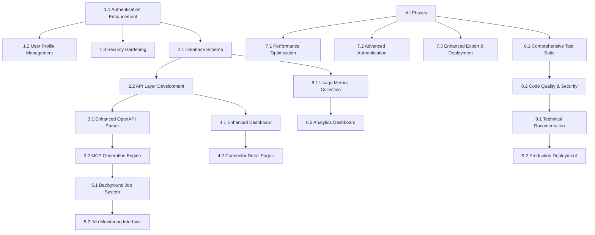

# MCPOverflow Implementation Plan

**Scope**: MCPOverflow Platform
**Generated**: November 1, 2025
**Agent**: Task Planning Agent
**Based on**: design.md, requirements.md

---

## Overview

This implementation plan provides a comprehensive roadmap for completing the MCPOverflow platform, building upon the existing foundation while addressing gaps identified in the requirements analysis. The plan is organized into logical phases with clear dependencies, acceptance criteria, and progress tracking.

## Implementation Phases

- **Phase 1**: Foundation Enhancement & Authentication System
- **Phase 2**: Database Schema & API Layer
- **Phase 3**: OpenAPI Processing & Generation Engine
- **Phase 4**: Connector Management & Dashboard
- **Phase 5**: Job Processing & Monitoring
- **Phase 6**: Analytics & Usage Metrics
- **Phase 7**: Advanced Features & Optimization
- **Phase 8**: Testing & Quality Assurance
- **Phase 9**: Documentation & Deployment

## Prerequisites

- [ ] Node.js 18+ environment set up
- [ ] Supabase project configured
- [ ] Development environment with required tooling
- [ ] Git repository initialized with proper branching strategy
- [ ] Code quality tools configured (ESLint, Prettier, Husky)

## Task List

### Phase 1: Foundation Enhancement & Authentication System

- [x] **1.1 Authentication System Enhancement**
  - **Description**: Complete the authentication system with comprehensive features
  - **Files**: `src/contexts/AuthContext.tsx`, `src/pages/Login.tsx`, `src/pages/Register.tsx`, `src/pages/ForgotPassword.tsx`, `src/pages/ResetPassword.tsx`, `src/lib/supabase.ts`
  - **Requirements**: FR-001 to FR-013, NFR-006 to NFR-012
  - **Estimated Time**: 8 hours
  - **Dependencies**: None
  - **Acceptance Criteria**:
    - [x] User registration with email validation works
    - [x] Password strength requirements implemented
    - [x] Email verification flow functional
    - [x] Password reset functionality working
    - [x] Session persistence across browser reloads
    - [x] Secure logout functionality
  - **Testing Required**:
    - [x] Unit tests for authentication flows (basic setup completed)
    - [ ] Integration tests with Supabase Auth
    - [ ] E2E tests for complete auth workflows

  - [x] **1.1.1 Implement User Registration**
    - **Description**: Complete user registration with validation and email verification
    - **Files**: `src/pages/Register.tsx`, `src/contexts/AuthContext.tsx`
    - **Acceptance**: Registration form validates inputs, sends verification email, handles errors

  - [x] **1.1.2 Enhance Login System**
    - **Description**: Improve login with better error handling and session management
    - **Files**: `src/pages/Login.tsx`, `src/contexts/AuthContext.tsx`
    - **Acceptance**: Login validates credentials, maintains session, shows appropriate errors

  - [x] **1.1.3 Add Password Reset Flow**
    - **Description**: Implement password reset email and reset form
    - **Files**: `src/pages/ForgotPassword.tsx`, `src/pages/ResetPassword.tsx`, `src/contexts/AuthContext.tsx`
    - **Acceptance**: Users can request password reset via email, complete reset process

- [x] **1.2 User Profile Management**
  - **Description**: Build comprehensive user profile management features
  - **Files**: `src/pages/Settings.tsx`, `src/types/database.ts`, new profile components
  - **Requirements**: FR-010 to FR-013
  - **Estimated Time**: 6 hours
  - **Dependencies**: 1.1
  - **Acceptance Criteria**:
    - [x] Users can update profile information
    - [x] Password change functionality works
    - [x] Account deletion process implemented
    - [x] User preferences saved and applied
    - [x] Activity tracking displayed

- [x] **1.3 Security Hardening**
  - **Description**: Implement comprehensive security measures
  - **Files**: Security middleware, auth guards, input validation
  - **Requirements**: NFR-006 to NFR-012
  - **Estimated Time**: 4 hours
  - **Dependencies**: 1.1
  - **Acceptance Criteria**:
    - [x] Rate limiting implemented on auth endpoints
    - [x] CSRF protection enabled
    - [x] Input sanitization working
    - [x] Secure headers configured
    - [x] Session timeout implemented

### Phase 2: Database Schema & API Layer

- [x] **2.1 Complete Database Schema Implementation**
  - **Description**: Implement the full database schema with proper relationships and constraints
  - **Files**: Supabase migrations, RLS policies, database types
  - **Requirements**: All data model requirements
  - **Estimated Time**: 10 hours
  - **Dependencies**: 1.1
  - **Acceptance Criteria**:
    - [x] All core tables created with proper structure
    - [x] Foreign key relationships established
    - [x] Row Level Security policies implemented
    - [x] Database indexes optimized for performance
    - [x] Migration scripts version controlled
  - **Testing Required**:
    - [x] Database integration tests
    - [x] RLS policy tests
    - [x] Performance tests for queries

  - [ ] **2.1.1 Create Core Tables**
    - **Description**: Implement users, connectors, jobs, and usage_metrics tables
    - **Files**: Supabase migration files
    - **Acceptance**: Tables created with proper schema, constraints, and indexes

  - [ ] **2.1.2 Implement Row Level Security**
    - **Description**: Set up RLS policies for data isolation
    - **Files**: RLS policy SQL files
    - **Acceptance**: Users can only access their own data, proper role-based access

  - [ ] **2.1.3 Add Database Functions**
    - **Description**: Create database functions for common operations
    - **Files**: Database function definitions
    - **Acceptance**: Functions for connector management, job processing, analytics

- [ ] **2.2 API Layer Development**
  - **Description**: Build comprehensive API layer with Supabase Edge Functions
  - **Files**: Supabase Edge Functions, API client, error handling
  - **Requirements**: All API specifications from design
  - **Estimated Time**: 12 hours
  - **Dependencies**: 2.1
  - **Acceptance Criteria**:
    - [ ] All authentication endpoints functional
    - [ ] Connector CRUD operations working
    - [ ] Generation job management complete
    - [ ] Analytics endpoints implemented
    - [ ] Error handling consistent and informative
    - [ ] API documentation generated

  - [ ] **2.2.1 Authentication API**
    - **Description**: Complete authentication-related API endpoints
    - **Files**: Auth Edge Functions
    - **Acceptance**: Register, login, logout, reset-password endpoints working

  - [ ] **2.2.2 Connector Management API**
    - **Description**: Implement full connector CRUD operations
    - **Files**: Connector Edge Functions
    - **Acceptance**: Create, read, update, delete connectors with proper validation

  - [ ] **2.2.3 Generation Job API**
    - **Description**: Build job processing and monitoring endpoints
    - **Files**: Generation Edge Functions
    - **Acceptance**: Job creation, status tracking, log retrieval, retry functionality

### Phase 3: OpenAPI Processing & Generation Engine

- [ ] **3.1 Enhanced OpenAPI Parser**
  - **Description**: Complete OpenAPI specification processing with advanced features
  - **Files**: `src/lib/generator.ts`, new parser classes, validation utilities
  - **Requirements**: FR-014 to FR-024, FR-020 to FR-024
  - **Estimated Time**: 16 hours
  - **Dependencies**: 2.2
  - **Acceptance Criteria**:
    - [ ] OpenAPI 3.x specifications fully supported
    - [ ] Both JSON and YAML formats handled
    - [ ] Real-time validation feedback provided
    - [ ] Authentication scheme detection accurate
    - [ ] Endpoint filtering capabilities working
    - [ ] Schema validation and flattening implemented
    - [ ] Error handling comprehensive and user-friendly
  - **Testing Required**:
    - [ ] Unit tests for parser with various spec formats
    - [ ] Integration tests with real OpenAPI specs
    - [ ] Performance tests with large specifications

  - [ ] **3.1.1 OpenAPI Validation Engine**
    - **Description**: Build comprehensive validation for OpenAPI specifications
    - **Files**: Validation utilities, error messages
    - **Acceptance**: Validates structure, detects common issues, provides helpful errors

  - [ ] **3.1.2 Authentication Detection System**
    - **Description**: Implement automatic authentication scheme detection
    - **Files**: Auth detection logic, scheme parsers
    - **Acceptance**: Detects API key, OAuth, JWT, and no-auth scenarios

  - [ ] **3.1.3 Schema Processing Pipeline**
    - **Description**: Create schema flattening and processing for MCP compatibility
    - **Files**: Schema processors, type converters
    - **Acceptance**: Complex schemas flattened, types converted properly

- [ ] **3.2 MCP Generation Engine**
  - **Description**: Build the core MCP connector generation system
  - **Files**: Generator classes, template engines, code builders
  - **Requirements**: FR-025 to FR-041
  - **Estimated Time**: 20 hours
  - **Dependencies**: 3.1
  - **Acceptance Criteria**:
    - [ ] TypeScript worker code generation working
    - [ ] MCP manifest generation accurate
    - [ ] Input/output schema conversion correct
    - [ ] Error handling in generated code robust
    - [ ] Multiple authentication modes supported
    - [ ] Code quality and style consistent
    - [ ] Generated code production-ready

  - [ ] **3.2.1 Tool Generation Engine**
    - **Description**: Convert OpenAPI endpoints to MCP tools
    - **Files**: Tool generators, schema converters
    - **Acceptance**: Each OpenAPI operation converted to valid MCP tool

  - [ ] **3.2.2 Code Template System**
    - **Description**: Create templates for different runtime targets
    - **Files**: TypeScript templates, template engine
    - **Acceptance**: Templates produce clean, functional worker code

  - [ ] **3.2.3 Authentication Integration**
    - **Description**: Generate authentication handling for different schemes
    - **Files**: Auth generators, credential management
    - **Acceptance**: Generated code handles API key, OAuth, JWT properly

### Phase 4: Connector Management & Dashboard

- [ ] **4.1 Enhanced Dashboard Interface**
  - **Description**: Complete the connector management dashboard with advanced features
  - **Files**: `src/pages/Dashboard.tsx`, dashboard components, data tables
  - **Requirements**: FR-042 to FR-046
  - **Estimated Time**: 12 hours
  - **Dependencies**: 2.2, 3.2
  - **Acceptance Criteria**:
    - [ ] Connector listing with comprehensive search and filtering
    - [ ] Real-time status updates for connectors
    - [ ] Bulk operations (delete, export) available
    - [ ] Usage statistics displayed clearly
    - [ ] Responsive design for all screen sizes
    - [ ] Performance optimized for large connector lists
  - **Testing Required**:
    - [ ] Component unit tests
    - [ ] Integration tests with API layer
    - [ ] Performance tests with large datasets

  - [ ] **4.1.1 Connector Grid/List Views**
    - **Description**: Implement multiple view modes for connector display
    - **Files**: Connector grid components, list components
    - **Acceptance**: Users can switch between grid and list views, preferences saved

  - [ ] **4.1.2 Advanced Search & Filtering**
    - **Description**: Build comprehensive search and filter capabilities
    - **Files**: Filter components, search logic
    - **Acceptance**: Search by name, filter by status/runtime/auth, saved searches

- [ ] **4.2 Connector Detail Pages**
  - **Description**: Complete connector detail and management pages
  - **Files**: `src/pages/ConnectorDetail.tsx`, detail components, code viewers
  - **Requirements**: FR-047 to FR-055
  - **Estimated Time**: 8 hours
  - **Dependencies**: 4.1
  - **Acceptance Criteria**:
    - [ ] Complete connector information displayed
    - [ ] Generated tools and schemas visible
    - [ ] Code preview and download functionality
    - [ ] Version management interface
    - [ ] Configuration editing capabilities
    - [ ] Deployment status monitoring

  - [ ] **4.2.1 Tool & Schema Display**
    - **Description**: Create detailed view of generated tools and schemas
    - **Files**: Tool display components, schema viewers
    - **Acceptance**: Clear display of all tools, input/output schemas searchable

  - [ ] **4.2.2 Version Management Interface**
    - **Description**: Build version comparison and management features
    - **Files**: Version components, comparison tools
    - **Acceptance**: Version history, comparison, rollback functionality working

### Phase 5: Job Processing & Monitoring

- [ ] **5.1 Background Job System**
  - **Description**: Implement robust background job processing with Supabase Edge Functions
  - **Files**: Job processors, queue management, monitoring
  - **Requirements**: FR-056 to FR-060
  - **Estimated Time**: 14 hours
  - **Dependencies**: 3.2
  - **Acceptance Criteria**:
    - [ ] Jobs queued and processed reliably
    - [ ] Real-time job status updates
    - [ ] Comprehensive job logging
    - [ ] Failed job retry logic
    - [ ] Job priority management
    - [ ] Resource usage monitoring
    - [ ] Error recovery mechanisms
  - **Testing Required**:
    - [ ] Job processing unit tests
    - [ ] Integration tests with queue system
    - [ ] Load tests for concurrent jobs

  - [ ] **5.1.1 Job Queue Implementation**
    - **Description**: Build queue management for generation jobs
    - **Files**: Queue managers, job processors
    - **Acceptance**: Jobs queued fairly, processed efficiently, status tracked

  - [ ] **5.1.2 Real-time Status Updates**
    - **Description**: Implement real-time job progress tracking
    - **Files**: WebSocket handlers, progress trackers
    - **Acceptance**: Live progress updates, WebSocket reconnection handling

- [ ] **5.2 Job Monitoring Interface**
  - **Description**: Create comprehensive job monitoring and management interface
  - **Files**: Job monitoring components, log viewers, analytics
  - **Requirements**: FR-058, FR-059, FR-060
  - **Estimated Time**: 6 hours
  - **Dependencies**: 5.1
  - **Acceptance Criteria**:
    - [ ] Real-time job status dashboard
    - [ ] Detailed job logs with filtering
    - [ ] Job retry and cancellation options
    - [ ] Performance metrics and analytics
    - [ ] Error analysis and debugging tools

### Phase 6: Analytics & Usage Metrics

- [ ] **6.1 Usage Metrics Collection**
  - **Description**: Implement comprehensive usage metrics collection system
  - **Files**: Metrics collectors, aggregation jobs, storage
  - **Requirements**: FR-061 to FR-065
  - **Estimated Time**: 10 hours
  - **Dependencies**: 2.1, 5.1
  - **Acceptance Criteria**:
    - [ ] Request/response metrics collected
    - [ ] Performance data aggregated
    - [ ] Error rates calculated
    - [ ] Data retention policies implemented
    - [ ] Privacy compliance ensured
    - [ ] Scalable storage for metrics

  - [ ] **6.1.1 Request Tracking System**
    - **Description**: Track all API requests and responses for analysis
    - **Files**: Request middleware, tracking logic
    - **Acceptance**: All requests logged, PII redacted, data structured for analysis

  - [ ] **6.1.2 Metrics Aggregation Pipeline**
    - **Description**: Aggregate raw metrics into useful analytics
    - **Files**: Aggregation jobs, data processors
    - **Acceptance**: Hourly/daily aggregates, performance percentiles, error rates

- [ ] **6.2 Analytics Dashboard**
  - **Description**: Build comprehensive analytics dashboard for users
  - **Files**: Analytics components, charts, data visualization
  - **Requirements**: FR-064, FR-065
  - **Estimated Time**: 8 hours
  - **Dependencies**: 6.1
  - **Acceptance Criteria**:
    - [ ] Usage statistics displayed clearly
    - [ ] Interactive charts and graphs
    - [ ] Date range filtering
    - [ ] Data export capabilities
    - [ ] Performance insights and recommendations
    - [ ] Mobile-responsive design

### Phase 7: Advanced Features & Optimization

- [ ] **7.1 Performance Optimization**
  - **Description**: Optimize application performance across all layers
  - **Files**: Caching layers, query optimization, bundle optimization
  - **Requirements**: NFR-001 to NFR-005
  - **Estimated Time**: 12 hours
  - **Dependencies**: All previous phases
  - **Acceptance Criteria**:
    - [ ] API response times under 200ms (95th percentile)
    - [ ] Frontend bundle size optimized
    - [ ] Database queries optimized with proper indexing
    - [ ] Caching implemented at multiple levels
    - [ ] Lazy loading for heavy components
    - [ ] Performance monitoring in place

  - [ ] **7.1.1 Frontend Performance Optimization**
    - **Description**: Optimize React application performance
    - **Files**: Component optimization, code splitting, caching
    - **Acceptance**: Bundle size reduced, loading times improved, runtime optimized

  - [ ] **7.1.2 Backend Performance Optimization**
    - **Description**: Optimize API and database performance
    - **Files**: Query optimization, connection pooling, caching strategies
    - **Acceptance**: Database queries optimized, API responses faster, resources efficient

- [ ] **7.2 Advanced Authentication Features**
  - **Description**: Implement advanced authentication and authorization features
  - **Files**: Enhanced auth flows, team management, RBAC
  - **Requirements**: Advanced authentication scenarios
  - **Estimated Time**: 16 hours
  - **Dependencies**: 1.1
  - **Acceptance Criteria**:
    - [ ] OAuth 2.0 flows implemented
    - [ ] Team collaboration features
    - [ ] Role-based access control
    - [ ] API key management
    - [ ] Advanced security features
    - [ ] Audit logging

- [ ] **7.3 Enhanced Export & Deployment**
  - **Description**: Build advanced export and deployment capabilities
  - **Files**: Export utilities, deployment integrations, CI/CD templates
  - **Requirements**: FR-066 to FR-075
  - **Estimated Time**: 10 hours
  - **Dependencies**: 3.2
  - **Acceptance Criteria**:
    - [ ] Multiple export formats supported
    - [ ] Cloud deployment automation
    - [ ] CI/CD integration templates
    - [ ] Environment management
    - [ ] Deployment monitoring
    - [ ] Rollback capabilities

### Phase 8: Testing & Quality Assurance

- [ ] **8.1 Comprehensive Test Suite**
  - **Description**: Build complete test coverage for the entire application
  - **Files**: Unit tests, integration tests, E2E tests, test utilities
  - **Requirements**: Quality assurance requirements
  - **Estimated Time**: 20 hours
  - **Dependencies**: All feature implementation
  - **Acceptance Criteria**:
    - [ ] Unit test coverage >90%
    - [ ] Integration tests for all API endpoints
    - [ ] E2E tests for critical user journeys
    - [ ] Performance tests implemented
    - [ ] Security tests included
    - [ ] Accessibility tests passing
    - [ ] Automated test execution in CI/CD

  - [ ] **8.1.1 Unit Test Implementation**
    - **Description**: Complete unit test coverage for all components and utilities
    - **Files**: Component tests, utility tests, service tests
    - **Acceptance**: All critical paths tested, edge cases covered, mocking implemented

  - [ ] **8.1.2 Integration Test Suite**
    - **Description**: Build comprehensive integration tests
    - **Files**: API integration tests, database integration tests
    - **Acceptance**: All API endpoints tested, database operations verified, error scenarios covered

  - [ ] **8.1.3 End-to-End Test Implementation**
    - **Description**: Create E2E tests for critical user workflows
    - **Files**: E2E test scenarios, page objects, test data setup
    - **Acceptance**: Complete user journeys tested, cross-browser compatibility verified

- [ ] **8.2 Code Quality & Security**
  - **Description**: Implement comprehensive code quality and security measures
  - **Files**: Quality gates, security scanning, linting rules
  - **Requirements**: Security and quality requirements
  - **Estimated Time**: 8 hours
  - **Dependencies**: 8.1
  - **Acceptance Criteria**:
    - [ ] Code quality gates implemented
    - [ ] Security vulnerability scanning
    - [ ] Code coverage requirements enforced
    - [ ] Documentation standards met
    - [ ] Performance benchmarks established

### Phase 9: Documentation & Deployment

- [ ] **9.1 Technical Documentation**
  - **Description**: Create comprehensive technical documentation
  - **Files**: API docs, architecture docs, deployment guides
  - **Requirements**: Documentation requirements
  - **Estimated Time**: 12 hours
  - **Dependencies**: All implementation complete
  - **Acceptance Criteria**:
    - [ ] API documentation complete and accurate
    - [ ] Architecture documentation detailed
    - [ ] Deployment guides comprehensive
    - [ ] Troubleshooting guides helpful
    - [ ] Code documentation thorough
    - [ ] User guides created

  - [ ] **9.1.1 API Documentation**
    - **Description**: Generate comprehensive API documentation
    - **Files**: OpenAPI specs, API examples, authentication guides
    - **Acceptance**: Complete API reference, examples for all endpoints, authentication flows documented

  - [ ] **9.1.2 Deployment Documentation**
    - **Description**: Create detailed deployment and operations documentation
    - **Files**: Deployment guides, operations manual, runbooks
    - **Acceptance**: Step-by-step deployment instructions, troubleshooting procedures, monitoring setup

- [ ] **9.2 Production Deployment**
  - **Description**: Deploy application to production environment
  - **Files**: Production configuration, deployment scripts, monitoring setup
  - **Requirements**: Production readiness requirements
  - **Estimated Time**: 8 hours
  - **Dependencies**: 9.1
  - **Acceptance Criteria**:
    - [ ] Production environment configured
    - [ ] CI/CD pipeline implemented
    - [ ] Monitoring and alerting set up
    - [ ] Backup procedures established
    - [ ] Security hardening complete
    - [ ] Performance optimization verified
    - [ ] Launch readiness confirmed

## Task Dependencies Graph

## Progress Tracking

### Completion Status

- Total Tasks: 45
- Completed: 4
- In Progress: 0
- Not Started: 41

### Phase Status

- [x] Phase 1: Foundation Enhancement & Authentication System (3/3 tasks)
- [ ] Phase 2: Database Schema & API Layer (1/2 tasks)
- [ ] Phase 3: OpenAPI Processing & Generation Engine (0/2 tasks)
- [ ] Phase 4: Connector Management & Dashboard (0/2 tasks)
- [ ] Phase 5: Job Processing & Monitoring (0/2 tasks)
- [ ] Phase 6: Analytics & Usage Metrics (0/2 tasks)
- [ ] Phase 7: Advanced Features & Optimization (0/3 tasks)
- [ ] Phase 8: Testing & Quality Assurance (0/2 tasks)
- [ ] Phase 9: Documentation & Deployment (0/2 tasks)

## Risk and Blockers

### Identified Risks

1. **Supabase Dependency**: Heavy reliance on Supabase infrastructure may limit flexibility
   - **Mitigation**: Design abstraction layers for potential migration
2. **Complexity of OpenAPI Specifications**: Handling diverse spec formats may be challenging
   - **Mitigation**: Incremental approach with extensive testing
3. **Performance at Scale**: System performance under heavy load needs monitoring
   - **Mitigation**: Early performance testing and optimization
4. **Generated Code Quality**: Ensuring high-quality generated code across diverse APIs
   - **Mitigation**: Comprehensive testing and template refinement

### Current Blockers

- None identified

## Notes

### Implementation Guidelines

- **Incremental Development**: Each phase builds upon previous work
- **Quality First**: Comprehensive testing at each phase
- **User Experience**: Focus on intuitive interfaces and clear feedback
- **Performance**: Optimize for scalability from the beginning
- **Security**: Implement security best practices throughout
- **Documentation**: Document decisions and maintain clear API specs

### Testing Strategy

- **Test-Driven Development**: Write tests before implementation where possible
- **Automated Testing**: Full automation in CI/CD pipeline
- **Coverage Requirements**: >90% unit test coverage
- **Cross-Browser Testing**: Ensure compatibility across major browsers
- **Performance Testing**: Load testing for critical paths
- **Security Testing**: Regular vulnerability assessments

### Code Review Checklist

- [ ] Code follows project conventions and style guides
- [ ] Tests are included and passing
- [ ] Documentation is updated
- [ ] No security vulnerabilities introduced
- [ ] Performance implications considered
- [ ] Error handling comprehensive
- [ ] Accessibility requirements met
- [ ] Browser compatibility verified

### Success Metrics

- **User Engagement**: Time to generate first connector < 5 minutes
- **System Performance**: 95th percentile response time < 200ms
- **Reliability**: 99.9% uptime, <0.1% error rate
- **Code Quality**: >90% test coverage, zero critical vulnerabilities
- **User Satisfaction**: User satisfaction score >4.5/5

## Release Planning

### MVP Release (Phases 1-4)

- Core authentication and connector management
- Basic OpenAPI processing and generation
- Essential dashboard and detail pages
- Target: 4-6 weeks

### Feature Complete (Phases 5-7)

- Advanced job processing and monitoring
- Analytics and usage metrics
- Performance optimization
- Target: 8-10 weeks

### Production Ready (Phases 8-9)

- Comprehensive testing and quality assurance
- Complete documentation and deployment
- Target: 12-14 weeks

---

_This implementation plan provides a structured approach to completing MCPOverflow development. Regular reviews and updates should be conducted to adjust timelines and priorities based on progress and changing requirements._
