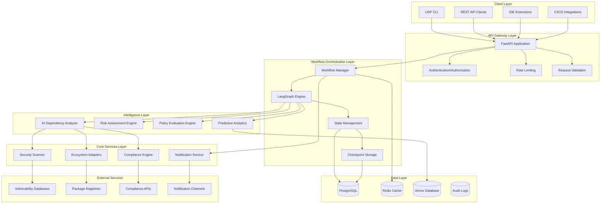
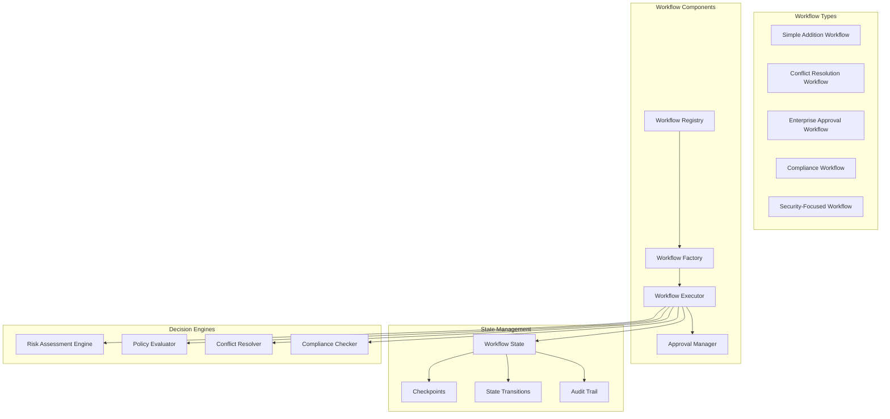

# Design Document

## Overview

The LangGraph Workflow Enhancement builds upon the existing Universal Dependency Platform (UDP) to create an intelligent, AI-powered dependency management system. This design leverages the current FastAPI architecture, SQLAlchemy models, and ecosystem adapters while introducing advanced LangGraph workflows that provide autonomous decision-making, multi-stakeholder approval processes, and comprehensive enterprise compliance automation.

The enhancement transforms UDP from a traditional dependency analysis tool into an intelligent platform that can automatically handle complex enterprise scenarios with minimal human intervention while maintaining security, compliance, and audit requirements.

## Architecture

### High-Level Architecture



### Workflow Architecture



## Components and Interfaces

### 1. Enhanced Workflow Manager

The Workflow Manager orchestrates all LangGraph workflows and provides the main interface for workflow execution.

```python
class EnhancedWorkflowManager:
    """
    Enhanced workflow manager with AI-powered decision making.
    
    Manages workflow lifecycle, state persistence, and intelligent routing
    based on risk assessment and organizational policies.
    """
    
    def __init__(self, organization_id: str):
        self.organization_id = organization_id
        self.workflow_registry = WorkflowRegistry()
        self.ai_analyzer = AIWorkflowAnalyzer()
        self.approval_manager = ApprovalManager()
        self.state_manager = WorkflowStateManager()
    
    async def analyze_and_route_request(
        self, 
        request: DependencyRequest
    ) -> WorkflowRoutingDecision:
        """Analyze request and determine optimal workflow path."""
        
    async def execute_workflow(
        self, 
        workflow_type: str, 
        initial_state: Dict[str, Any]
    ) -> WorkflowExecution:
        """Execute workflow with intelligent monitoring and intervention."""
        
    async def handle_human_intervention(
        self, 
        workflow_id: str, 
        intervention_data: Dict[str, Any]
    ) -> InterventionResult:
        """Handle human approvals and interventions."""
```

### 2. AI-Powered Workflow Analyzer

The AI Analyzer provides intelligent decision-making capabilities for workflow routing and risk assessment.

```python
class AIWorkflowAnalyzer:
    """
    AI-powered analyzer for intelligent workflow decisions.
    
    Uses machine learning models and heuristics to analyze dependency
    requests and determine optimal workflow paths.
    """
    
    def __init__(self):
        self.risk_model = RiskAssessmentModel()
        self.policy_analyzer = PolicyAnalyzer()
        self.conflict_predictor = ConflictPredictor()
    
    async def analyze_dependency_request(
        self, 
        request: DependencyRequest
    ) -> AnalysisResult:
        """Comprehensive analysis of dependency request."""
        
    async def predict_workflow_complexity(
        self, 
        dependencies: List[Package]
    ) -> ComplexityPrediction:
        """Predict workflow complexity and resource requirements."""
        
    async def recommend_resolution_strategy(
        self, 
        conflicts: List[DependencyConflict]
    ) -> ResolutionStrategy:
        """Recommend optimal conflict resolution strategy."""
```

### 3. Multi-Stakeholder Approval System

The Approval Manager handles complex approval workflows with multiple stakeholders and escalation paths.

```python
class ApprovalManager:
    """
    Multi-stakeholder approval system with intelligent routing.
    
    Manages approval workflows, escalations, and SLA tracking
    for enterprise dependency management.
    """
    
    def __init__(self, organization_id: str):
        self.organization_id = organization_id
        self.approval_policies = ApprovalPolicyEngine()
        self.notification_service = NotificationService()
        self.escalation_manager = EscalationManager()
    
    async def determine_required_approvers(
        self, 
        workflow_context: WorkflowContext
    ) -> List[ApprovalRequirement]:
        """Determine required approvers based on risk and policies."""
        
    async def request_approvals(
        self, 
        workflow_id: str, 
        approval_requirements: List[ApprovalRequirement]
    ) -> ApprovalRequest:
        """Initiate approval requests with context and deadlines."""
        
    async def process_approval_response(
        self, 
        approval_id: str, 
        response: ApprovalResponse
    ) -> ApprovalResult:
        """Process approval response and update workflow state."""
```

### 4. Enterprise Compliance Engine

The Compliance Engine ensures adherence to regulatory frameworks and organizational policies.

```python
class EnterpriseComplianceEngine:
    """
    Enterprise compliance engine for regulatory adherence.
    
    Validates dependencies against SOX, HIPAA, PCI-DSS, and other
    regulatory frameworks with automated reporting.
    """
    
    def __init__(self, organization_id: str):
        self.organization_id = organization_id
        self.compliance_frameworks = ComplianceFrameworkRegistry()
        self.audit_logger = ComplianceAuditLogger()
        self.report_generator = ComplianceReportGenerator()
    
    async def validate_compliance(
        self, 
        packages: List[Package], 
        frameworks: List[str]
    ) -> ComplianceValidationResult:
        """Validate packages against compliance frameworks."""
        
    async def generate_compliance_report(
        self, 
        workflow_id: str, 
        report_type: str
    ) -> ComplianceReport:
        """Generate comprehensive compliance reports."""
        
    async def create_audit_trail(
        self, 
        workflow_execution: WorkflowExecution
    ) -> AuditTrail:
        """Create immutable audit trail for compliance."""
```

### 5. Cross-Ecosystem Dependency Resolver

The Dependency Resolver handles complex resolution across multiple package ecosystems.

```python
class CrossEcosystemResolver:
    """
    Cross-ecosystem dependency resolver with SAT solving.
    
    Resolves dependencies across npm, PyPI, Maven, Cargo, and other
    ecosystems with intelligent conflict resolution.
    """
    
    def __init__(self):
        self.ecosystem_adapters = EcosystemAdapterRegistry()
        self.sat_solver = SATSolver()
        self.conflict_analyzer = ConflictAnalyzer()
    
    async def resolve_multi_ecosystem_dependencies(
        self, 
        manifests: List[ManifestFile]
    ) -> MultiEcosystemResolution:
        """Resolve dependencies across multiple ecosystems."""
        
    async def detect_cross_ecosystem_conflicts(
        self, 
        resolved_dependencies: Dict[str, List[Package]]
    ) -> List[CrossEcosystemConflict]:
        """Detect conflicts between different ecosystems."""
        
    async def generate_unified_resolution(
        self, 
        conflicts: List[CrossEcosystemConflict]
    ) -> UnifiedResolution:
        """Generate unified resolution strategy."""
```

## Data Models

### Enhanced Workflow State

```python
class EnhancedWorkflowState(TypedDict):
    """Enhanced workflow state with AI-powered decision tracking."""
    
    # Core workflow information
    workflow_id: str
    workflow_type: str
    organization_id: str
    initiator_id: str
    created_at: datetime
    
    # Request context
    manifest_files: List[str]
    ecosystems: List[EcosystemType]
    project_context: Dict[str, Any]
    
    # Analysis results
    dependency_analysis: DependencyAnalysisResult
    security_analysis: SecurityAnalysisResult
    compliance_analysis: ComplianceAnalysisResult
    risk_assessment: RiskAssessmentResult
    
    # AI decision tracking
    ai_recommendations: List[AIRecommendation]
    confidence_scores: Dict[str, float]
    decision_rationale: Dict[str, str]
    
    # Approval workflow
    approval_requirements: List[ApprovalRequirement]
    approval_status: Dict[str, ApprovalStatus]
    escalation_history: List[EscalationEvent]
    
    # Execution tracking
    current_step: str
    completed_steps: List[str]
    failed_steps: List[str]
    performance_metrics: Dict[str, float]
    
    # Audit and compliance
    audit_trail: List[AuditEvent]
    compliance_validations: List[ComplianceValidation]
    regulatory_approvals: List[RegulatoryApproval]
```

### AI Recommendation Model

```python
class AIRecommendation(BaseModel):
    """AI-generated recommendation with confidence scoring."""
    
    recommendation_id: UUID = Field(default_factory=uuid4)
    recommendation_type: str = Field(..., description="Type of recommendation")
    title: str = Field(..., description="Recommendation title")
    description: str = Field(..., description="Detailed description")
    confidence_score: float = Field(..., ge=0.0, le=1.0, description="Confidence score")
    risk_level: SecurityLevel = Field(..., description="Associated risk level")
    action_required: bool = Field(..., description="Whether action is required")
    automated_action: Optional[str] = Field(None, description="Automated action taken")
    human_review_required: bool = Field(..., description="Whether human review is needed")
    rationale: str = Field(..., description="AI reasoning for recommendation")
    supporting_data: Dict[str, Any] = Field(default_factory=dict)
    created_at: datetime = Field(default_factory=datetime.utcnow)
```

### Multi-Stakeholder Approval Model

```python
class ApprovalRequirement(BaseModel):
    """Multi-stakeholder approval requirement."""
    
    requirement_id: UUID = Field(default_factory=uuid4)
    workflow_id: str = Field(..., description="Associated workflow ID")
    approver_role: str = Field(..., description="Required approver role")
    approver_email: Optional[str] = Field(None, description="Specific approver email")
    approval_type: str = Field(..., description="Type of approval required")
    priority: int = Field(..., description="Approval priority")
    deadline: datetime = Field(..., description="Approval deadline")
    context: Dict[str, Any] = Field(..., description="Approval context")
    dependencies: List[UUID] = Field(default_factory=list, description="Dependent approvals")
    escalation_policy: Dict[str, Any] = Field(..., description="Escalation policy")
    
class ApprovalResponse(BaseModel):
    """Approval response from stakeholder."""
    
    response_id: UUID = Field(default_factory=uuid4)
    requirement_id: UUID = Field(..., description="Approval requirement ID")
    approver_id: str = Field(..., description="Approver identifier")
    status: str = Field(..., description="Approval status")
    comments: Optional[str] = Field(None, description="Approver comments")
    conditions: List[str] = Field(default_factory=list, description="Approval conditions")
    responded_at: datetime = Field(default_factory=datetime.utcnow)
    ip_address: Optional[str] = Field(None, description="Approver IP address")
    user_agent: Optional[str] = Field(None, description="Approver user agent")
```

## Error Handling

### Comprehensive Error Management

```python
class WorkflowError(Exception):
    """Base workflow error with context tracking."""
    
    def __init__(
        self, 
        message: str, 
        error_code: str, 
        workflow_id: Optional[str] = None,
        context: Optional[Dict[str, Any]] = None
    ):
        self.message = message
        self.error_code = error_code
        self.workflow_id = workflow_id
        self.context = context or {}
        super().__init__(message)

class WorkflowTimeoutError(WorkflowError):
    """Workflow execution timeout error."""
    pass

class ApprovalTimeoutError(WorkflowError):
    """Approval timeout error with escalation."""
    pass

class ComplianceViolationError(WorkflowError):
    """Compliance violation blocking workflow."""
    pass

class SecurityRiskError(WorkflowError):
    """High security risk blocking workflow."""
    pass
```

### Error Recovery Strategies

```python
class ErrorRecoveryManager:
    """Manages error recovery and workflow resilience."""
    
    async def handle_workflow_error(
        self, 
        error: WorkflowError, 
        workflow_state: EnhancedWorkflowState
    ) -> RecoveryAction:
        """Determine and execute error recovery action."""
        
    async def retry_with_backoff(
        self, 
        operation: Callable, 
        max_retries: int = 3
    ) -> Any:
        """Retry operation with exponential backoff."""
        
    async def escalate_to_human(
        self, 
        error: WorkflowError, 
        workflow_state: EnhancedWorkflowState
    ) -> EscalationResult:
        """Escalate error to human intervention."""
```

## Testing Strategy

### Comprehensive Testing Framework

#### 1. Unit Testing
- **Workflow Components**: Test individual workflow nodes and decision logic
- **AI Models**: Test recommendation accuracy and confidence scoring
- **Approval Logic**: Test multi-stakeholder approval routing
- **Compliance Engine**: Test regulatory framework validation

#### 2. Integration Testing
- **End-to-End Workflows**: Test complete workflow execution paths
- **Cross-Ecosystem Resolution**: Test multi-ecosystem dependency resolution
- **External Service Integration**: Test vulnerability databases and registries
- **Notification Systems**: Test approval notifications and escalations

#### 3. Performance Testing
- **Workflow Scalability**: Test with large dependency graphs
- **Concurrent Executions**: Test multiple simultaneous workflows
- **Database Performance**: Test state persistence and retrieval
- **AI Model Performance**: Test recommendation generation speed

#### 4. Security Testing
- **Authentication/Authorization**: Test role-based access controls
- **Data Encryption**: Test sensitive data protection
- **Audit Trail Integrity**: Test immutable audit logging
- **Compliance Validation**: Test regulatory framework adherence

#### 5. Chaos Engineering
- **Failure Simulation**: Test workflow resilience to component failures
- **Network Partitions**: Test distributed system behavior
- **Database Failures**: Test state recovery mechanisms
- **External Service Outages**: Test fallback strategies

### Test Implementation Strategy

```python
class WorkflowTestFramework:
    """Comprehensive testing framework for workflows."""
    
    def __init__(self):
        self.test_data_generator = TestDataGenerator()
        self.mock_services = MockServiceRegistry()
        self.assertion_engine = WorkflowAssertionEngine()
    
    async def test_workflow_execution(
        self, 
        workflow_type: str, 
        test_scenario: TestScenario
    ) -> TestResult:
        """Test complete workflow execution."""
        
    async def test_approval_workflow(
        self, 
        approval_scenario: ApprovalTestScenario
    ) -> ApprovalTestResult:
        """Test multi-stakeholder approval workflows."""
        
    async def test_compliance_validation(
        self, 
        compliance_scenario: ComplianceTestScenario
    ) -> ComplianceTestResult:
        """Test compliance framework validation."""
```

This design provides a comprehensive foundation for implementing the LangGraph Workflow Enhancement, building upon the existing UDP architecture while introducing advanced AI-powered capabilities, multi-stakeholder approval processes, and enterprise-grade compliance automation.