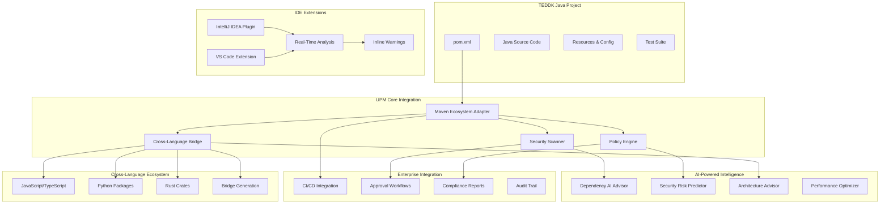
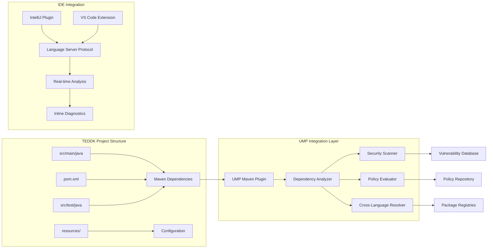

# Design Document: TEDDK Java Maven PoC with UPM Integration

## Overview

This design outlines the implementation of Universal Package Manager (UPM) integration for the TEDDK Java Maven project, including enhanced security scanning, cross-language capabilities, and comprehensive IDE extensions for IntelliJ IDEA and VS Code. The PoC demonstrates how UPM transforms traditional Java development into an intelligent, secure, and polyglot development experience.

## Architecture

### High-Level Architecture



### Component Architecture



## Components and Interfaces

### 1. Enhanced Maven Ecosystem Adapter

```java
public class EnhancedMavenAdapter extends MavenEcosystemAdapter {
    private final SecurityAnalyzer securityAnalyzer;
    private final PolicyEvaluator policyEvaluator;
    private final CrossLanguageBridge crossLanguageBridge;
    private final AIAdvisor aiAdvisor;
    
    public class MavenAnalysisResult {
        private List<MavenDependency> dependencies;
        private List<SecurityVulnerability> vulnerabilities;
        private List<PolicyViolation> policyViolations;
        private List<CrossLanguageRecommendation> crossLanguageOptions;
        private AIRecommendations aiRecommendations;
        private ComplianceReport complianceReport;
    }
    
    public MavenAnalysisResult analyzeTEDDKProject(Path pomPath) {
        // Comprehensive analysis of TEDDK Maven project
        // Including security, compliance, and cross-language opportunities
    }
    
    public List<DependencyUpdate> getSecurityUpdates() {
        // AI-powered security update recommendations
    }
    
    public CrossLanguageIntegration suggestCrossLanguagePackages(String functionality) {
        // Suggest JavaScript/Python packages for specific functionality
    }
}
```

### 2. IntelliJ IDEA Plugin Architecture

```kotlin
// Plugin Main Class
class UMPIntelliJPlugin : DumbAware {
    companion object {
        const val PLUGIN_ID = "com.universalpackagemanager.intellij"
    }
}

// Real-time Dependency Analysis
class DependencyAnalysisService(private val project: Project) {
    private val umpClient = UMPClient()
    
    fun analyzePomFile(pomFile: PsiFile): DependencyAnalysisResult {
        // Real-time analysis of pom.xml changes
        return umpClient.analyzeMavenDependencies(pomFile.text)
    }
    
    fun getSecurityWarnings(dependency: MavenDependency): List<SecurityWarning> {
        // Get security warnings for specific dependency
    }
    
    fun suggestAlternatives(dependency: MavenDependency): List<PackageAlternative> {
        // AI-powered alternative suggestions
    }
}

// Inline Annotations and Warnings
class SecurityAnnotator : Annotator {
    override fun annotate(element: PsiElement, holder: AnnotationHolder) {
        if (element is XmlTag && element.name == "dependency") {
            val analysisResult = DependencyAnalysisService.getInstance(element.project)
                .analyzeDependency(element)
            
            if (analysisResult.hasSecurityIssues()) {
                holder.newAnnotation(HighlightSeverity.WARNING, "Security vulnerability detected")
                    .range(element)
                    .withFix(SecurityUpdateQuickFix(analysisResult.suggestedUpdate))
                    .create()
            }
        }
    }
}

// Tool Window for UMP Management
class UMPToolWindow(private val project: Project) {
    fun createContent(): Content {
        return ContentFactory.SERVICE.getInstance().createContent(
            UMPToolWindowPanel(project), "UMP", false
        )
    }
}

// Quick Fixes and Actions
class SecurityUpdateQuickFix(private val suggestedUpdate: DependencyUpdate) : LocalQuickFix {
    override fun applyFix(project: Project, descriptor: ProblemDescriptor) {
        // Apply security update to pom.xml
        updatePomDependency(project, suggestedUpdate)
    }
}
```

### 3. VS Code Extension Architecture

```typescript
// Extension Main Entry Point
export function activate(context: vscode.ExtensionContext) {
    const umpProvider = new UMPProvider();
    const diagnosticCollection = vscode.languages.createDiagnosticCollection('ump');
    
    // Register commands
    context.subscriptions.push(
        vscode.commands.registerCommand('ump.analyzeDependencies', () => {
            umpProvider.analyzeDependencies();
        }),
        vscode.commands.registerCommand('ump.addPackage', () => {
            umpProvider.showPackageSelector();
        }),
        vscode.commands.registerCommand('ump.updateSecurity', () => {
            umpProvider.updateSecurityIssues();
        })
    );
    
    // Register providers
    context.subscriptions.push(
        vscode.languages.registerHoverProvider(['xml', 'java'], new UMPHoverProvider()),
        vscode.languages.registerCodeActionsProvider(['xml'], new UMPCodeActionProvider()),
        vscode.languages.registerCompletionItemProvider(['xml'], new UMPCompletionProvider())
    );
    
    // Watch for file changes
    const watcher = vscode.workspace.createFileSystemWatcher('**/pom.xml');
    watcher.onDidChange(uri => umpProvider.analyzePomFile(uri));
    context.subscriptions.push(watcher);
}

// UMP Provider Class
class UMPProvider {
    private umpClient: UMPClient;
    private diagnosticCollection: vscode.DiagnosticCollection;
    
    async analyzeDependencies(): Promise<void> {
        const workspaceFolders = vscode.workspace.workspaceFolders;
        if (!workspaceFolders) return;
        
        for (const folder of workspaceFolders) {
            const pomFiles = await vscode.workspace.findFiles(
                new vscode.RelativePattern(folder, '**/pom.xml')
            );
            
            for (const pomFile of pomFiles) {
                await this.analyzePomFile(pomFile);
            }
        }
    }
    
    async analyzePomFile(uri: vscode.Uri): Promise<void> {
        const document = await vscode.workspace.openTextDocument(uri);
        const analysisResult = await this.umpClient.analyzeMavenProject(document.getText());
        
        const diagnostics = this.createDiagnostics(analysisResult);
        this.diagnosticCollection.set(uri, diagnostics);
        
        // Update status bar
        this.updateStatusBar(analysisResult);
    }
    
    private createDiagnostics(result: AnalysisResult): vscode.Diagnostic[] {
        const diagnostics: vscode.Diagnostic[] = [];
        
        for (const vulnerability of result.vulnerabilities) {
            const diagnostic = new vscode.Diagnostic(
                new vscode.Range(vulnerability.line, 0, vulnerability.line, 100),
                `Security vulnerability: ${vulnerability.description}`,
                vscode.DiagnosticSeverity.Warning
            );
            diagnostic.source = 'UMP Security Scanner';
            diagnostic.code = vulnerability.cveId;
            diagnostics.push(diagnostic);
        }
        
        return diagnostics;
    }
}

// Hover Provider for Dependency Information
class UMPHoverProvider implements vscode.HoverProvider {
    async provideHover(
        document: vscode.TextDocument,
        position: vscode.Position,
        token: vscode.CancellationToken
    ): Promise<vscode.Hover | undefined> {
        const dependency = this.extractDependencyAtPosition(document, position);
        if (!dependency) return;
        
        const info = await this.umpClient.getDependencyInfo(dependency);
        const markdown = new vscode.MarkdownString();
        
        markdown.appendMarkdown(`**${dependency.name}** v${dependency.version}\n\n`);
        markdown.appendMarkdown(`Security Score: ${info.securityScore}/10\n`);
        markdown.appendMarkdown(`License: ${info.license}\n`);
        markdown.appendMarkdown(`Last Updated: ${info.lastUpdated}\n\n`);
        
        if (info.vulnerabilities.length > 0) {
            markdown.appendMarkdown(`⚠️ **${info.vulnerabilities.length} vulnerabilities found**\n`);
        }
        
        return new vscode.Hover(markdown);
    }
}

// Code Actions for Quick Fixes
class UMPCodeActionProvider implements vscode.CodeActionProvider {
    provideCodeActions(
        document: vscode.TextDocument,
        range: vscode.Range | vscode.Selection,
        context: vscode.CodeActionContext,
        token: vscode.CancellationToken
    ): vscode.CodeAction[] {
        const actions: vscode.CodeAction[] = [];
        
        for (const diagnostic of context.diagnostics) {
            if (diagnostic.source === 'UMP Security Scanner') {
                const updateAction = new vscode.CodeAction(
                    'Update to secure version',
                    vscode.CodeActionKind.QuickFix
                );
                updateAction.edit = this.createSecurityUpdateEdit(document, diagnostic);
                actions.push(updateAction);
            }
        }
        
        return actions;
    }
}
```

### 4. Cross-Language Bridge System

```java
public class CrossLanguageBridge {
    private final JavaScriptBridge jsBridge;
    private final PythonBridge pythonBridge;
    private final RustBridge rustBridge;
    
    public class CrossLanguageIntegration {
        private String targetLanguage;
        private String packageName;
        private String bridgeType; // "REST", "JNI", "WebAssembly", "gRPC"
        private String generatedCode;
        private List<String> buildInstructions;
    }
    
    public CrossLanguageIntegration integrateJavaScriptPackage(
        String jsPackage, 
        String functionality
    ) {
        // Generate bridge code for JavaScript package integration
        // Options: REST API, WebAssembly, Node.js subprocess
        return jsBridge.generateIntegration(jsPackage, functionality);
    }
    
    public CrossLanguageIntegration integratePythonPackage(
        String pythonPackage,
        String functionality
    ) {
        // Generate bridge code for Python package integration
        // Options: Jython, REST API, subprocess, JNI
        return pythonBridge.generateIntegration(pythonPackage, functionality);
    }
    
    public List<PackageRecommendation> recommendCrossLanguagePackages(
        String functionality,
        PerformanceRequirements requirements
    ) {
        // AI-powered recommendations for cross-language packages
        // Based on functionality, performance, and compatibility
    }
}
```

### 5. AI-Powered Advisory System

```java
public class TEDDKAIAdvisor {
    private final MachineLearningModel dependencyModel;
    private final SecurityRiskPredictor securityPredictor;
    private final ArchitectureAnalyzer architectureAnalyzer;
    
    public class AIRecommendations {
        private List<DependencyRecommendation> dependencyRecommendations;
        private List<SecurityRecommendation> securityRecommendations;
        private List<ArchitectureRecommendation> architectureRecommendations;
        private List<PerformanceRecommendation> performanceRecommendations;
        private double confidenceScore;
    }
    
    public AIRecommendations analyzeProject(TEDDKProject project) {
        // Comprehensive AI analysis of TEDDK project
        // Including dependency optimization, security improvements,
        // architecture suggestions, and performance enhancements
    }
    
    public List<DependencyAlternative> suggestAlternatives(
        MavenDependency currentDependency,
        ProjectContext context
    ) {
        // AI-powered alternative suggestions based on:
        // - Security score
        // - Performance characteristics
        // - Maintenance status
        // - Community adoption
        // - License compatibility
    }
    
    public SecurityRiskAssessment predictSecurityRisk(
        List<MavenDependency> dependencies,
        ProjectUsagePatterns usage
    ) {
        // Predict security risks based on actual usage patterns
        // and vulnerability trends
    }
}
```

## Data Models

### Enhanced Maven Dependency Model

```java
public class EnhancedMavenDependency extends MavenDependency {
    private SecurityScore securityScore;
    private List<Vulnerability> vulnerabilities;
    private LicenseInfo licenseInfo;
    private MaintenanceStatus maintenanceStatus;
    private List<CrossLanguageAlternative> crossLanguageAlternatives;
    private AIRecommendationScore aiScore;
    private UsageAnalytics usageAnalytics;
    
    public class SecurityScore {
        private double overallScore; // 0-10
        private int vulnerabilityCount;
        private LocalDate lastSecurityUpdate;
        private ThreatLevel threatLevel;
        private List<SecurityMetric> metrics;
    }
    
    public class CrossLanguageAlternative {
        private EcosystemType ecosystem;
        private String packageName;
        private String version;
        private CompatibilityScore compatibility;
        private BridgeType requiredBridge;
        private PerformanceImpact performanceImpact;
    }
}
```

### IDE Integration Models

```typescript
interface DependencyAnalysisResult {
    dependencies: EnhancedDependency[];
    vulnerabilities: SecurityVulnerability[];
    policyViolations: PolicyViolation[];
    crossLanguageOpportunities: CrossLanguageOpportunity[];
    aiRecommendations: AIRecommendation[];
    complianceStatus: ComplianceStatus;
    performanceMetrics: PerformanceMetrics;
}

interface SecurityVulnerability {
    cveId: string;
    severity: 'critical' | 'high' | 'medium' | 'low';
    description: string;
    affectedVersions: string[];
    fixedVersions: string[];
    exploitAvailable: boolean;
    patchAvailable: boolean;
    line: number;
    column: number;
}

interface CrossLanguageOpportunity {
    functionality: string;
    currentJavaPackage?: string;
    recommendedPackages: {
        ecosystem: string;
        packageName: string;
        version: string;
        bridgeType: string;
        performanceGain: number;
        securityScore: number;
    }[];
}
```

## Error Handling

### Comprehensive Error Management

```java
public class TEDDKUMPException extends Exception {
    private final ErrorCode errorCode;
    private final String projectPath;
    private final Map<String, Object> context;
    
    public enum ErrorCode {
        MAVEN_PARSE_ERROR,
        SECURITY_SCAN_FAILED,
        POLICY_VIOLATION,
        CROSS_LANGUAGE_BRIDGE_ERROR,
        AI_SERVICE_UNAVAILABLE,
        IDE_INTEGRATION_ERROR
    }
}

public class ErrorRecoveryManager {
    public RecoveryAction handleMavenParseError(Path pomPath, Exception cause) {
        // Attempt to recover from pom.xml parsing errors
        // Provide suggestions for fixing common issues
    }
    
    public RecoveryAction handleSecurityScanFailure(List<MavenDependency> dependencies) {
        // Fallback to cached security data
        // Provide partial analysis results
    }
    
    public RecoveryAction handleCrossLanguageBridgeError(String targetLanguage, String packageName) {
        // Suggest alternative bridge mechanisms
        // Provide manual integration instructions
    }
}
```

## Testing Strategy

### Comprehensive Testing Framework

#### 1. Unit Testing
- **Maven Adapter Testing**: Test dependency parsing and analysis
- **Security Scanner Testing**: Test vulnerability detection accuracy
- **AI Advisor Testing**: Test recommendation quality and performance
- **Cross-Language Bridge Testing**: Test bridge generation and functionality

#### 2. Integration Testing
- **IDE Plugin Testing**: Test IntelliJ and VS Code extension functionality
- **End-to-End Workflow Testing**: Test complete TEDDK project analysis
- **Cross-Language Integration Testing**: Test polyglot project scenarios
- **Enterprise Workflow Testing**: Test CI/CD and approval integrations

#### 3. Performance Testing
- **Large Project Analysis**: Test with enterprise-scale Maven projects
- **Real-Time IDE Performance**: Test responsiveness in IDE environments
- **AI Model Performance**: Test recommendation generation speed
- **Cross-Language Bridge Performance**: Test bridge execution overhead

#### 4. Security Testing
- **Vulnerability Detection Accuracy**: Test against known vulnerable dependencies
- **Policy Enforcement Testing**: Test compliance rule enforcement
- **Bridge Security Testing**: Test cross-language bridge security
- **IDE Extension Security**: Test extension permission and data handling

This design provides a comprehensive foundation for implementing the TEDDK Java Maven PoC with full UPM integration, demonstrating the Universal Package Manager vision in a real-world enterprise Java project.