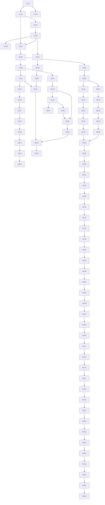

# Implementation Plan

**Scope**: Universal Dependency Platform (UPM)  
**Generated**: October 24, 2025  
**Agent**: Task Planning Agent  
**Based on**: design.md, requirements.md  

---

## Overview

This comprehensive implementation plan provides a detailed roadmap for building the Universal Dependency Platform (UPM), an enterprise-grade dependency management platform with intelligent workflow orchestration using LangGraph. The plan addresses the critical gaps identified in requirements analysis, particularly IDE integrations (0% complete), cross-language bridge mechanisms (30% complete), and AI-powered features.

The implementation is organized into 5 phases over 10 months, focusing on delivering value incrementally while ensuring the most critical components for developer adoption are prioritized.

## Implementation Phases

- **Phase 1**: Core Infrastructure (Months 1-2) - Foundation services and basic functionality
- **Phase 2**: Enhanced Security & AI Features (Months 3-4) - Advanced security and AI capabilities  
- **Phase 3**: IDE Integrations (Months 5-6) - CRITICAL: Developer experience and adoption
- **Phase 4**: Cross-Language Bridge Generation (Months 7-8) - Polyglot integration capabilities
- **Phase 5**: Enterprise Features & Production Readiness (Months 9-10) - Enterprise readiness

## Prerequisites

- [ ] Development environment setup (Python 3.11+, PostgreSQL, Redis)
- [ ] Kubernetes cluster for deployment testing
- [ ] Development licenses for IntelliJ Platform SDK
- [ ] Enterprise directory services for testing (optional)
- [ ] CI/CD pipeline infrastructure (GitHub Actions, GitLab CI, etc.)
- [ ] Monitoring and observability stack (Prometheus, Grafana)

## Task List

### Phase 1: Core Infrastructure (Months 1-2)

**Objective**: Establish foundational services and basic functionality to support all future features

#### 1.1 Database Schema and Core Models

- [x] **1.1.1 Database Schema Design and Implementation**
  - **Description**: Create comprehensive database schema for all core entities with proper relationships, indexes, and constraints
  - **Files**: `src/udp/core/models/`, `alembic/versions/`
  - **Requirements**: FR-001, FR-003, FR-008
  - **Estimated Time**: 8 hours
  - **Dependencies**: None
  - **Acceptance Criteria**:
    - [x] All core tables created with proper relationships
    - [x] Database indexes optimized for query performance
    - [x] Migration scripts tested and validated
    - [x] Data model unit tests passing with 95% coverage
  - **Testing Required**:
    - [x] Unit tests for all model operations
    - [x] Migration testing on clean databases
    - [x] Performance testing with sample data

- [x] **1.1.2 Core Service Layer Architecture**
  - **Description**: Implement foundational service layer with dependency injection, error handling, and base classes
  - **Files**: `src/udp/services/`, `src/udp/core/`
  - **Requirements**: All functional requirements
  - **Estimated Time**: 6 hours
  - **Dependencies**: 1.1.1
  - **Acceptance Criteria**:
    - [x] Base service classes with common functionality
    - [x] Dependency injection container configured
    - [x] Error handling and logging implemented
    - [x] Service layer unit tests passing
  - **Testing Required**:
    - [x] Unit tests for service base classes
    - [x] Integration tests for dependency injection

- [x] **1.1.3 Database Connection and Transaction Management**
  - **Description**: Set up async database connections, connection pooling, and transaction management
  - **Files**: `src/udp/infrastructure/database/`
  - **Requirements**: NFR-009
  - **Estimated Time**: 4 hours
  - **Dependencies**: 1.1.1
  - **Acceptance Criteria**:
    - [x] Async database session management
    - [x] Connection pooling configured for performance
    - [x] Transaction rollback and commit handling
    - [x] Database health check endpoint
  - **Testing Required**:
    - [x] Connection pool stress testing
    - [x] Transaction rollback testing
    - [x] Database failover testing

#### 1.2 Authentication and Authorization System

- [x] **1.2.1 JWT Authentication Implementation**
  - **Description**: Implement secure JWT-based authentication with refresh tokens and session management
  - **Files**: `src/udp/security/auth/`, `src/udp/api/middleware/`
  - **Requirements**: NFR-005
  - **Estimated Time**: 6 hours
  - **Dependencies**: 1.1.2
  - **Acceptance Criteria**:
    - [x] JWT token generation and validation
    - [x] Refresh token mechanism
    - [x] Session management with Redis
    - [x] Secure password hashing (bcrypt)
  - **Testing Required**:
    - [x] Authentication flow testing
    - [x] Token validation edge cases
    - [x] Security testing for token handling

- [x] **1.2.2 Role-Based Access Control (RBAC)**
  - **Description**: Implement comprehensive RBAC system with roles, permissions, and resource-based access control
  - **Files**: `src/udp/security/rbac/`, `src/udp/core/models/permissions.py`
  - **Requirements**: NFR-005, FR-021
  - **Estimated Time**: 8 hours
  - **Dependencies**: 1.2.1
  - **Acceptance Criteria**:
    - [x] Role and permission models defined
    - [x] Permission checking decorators and middleware
    - [x] Resource-based access control
    - [x] Role assignment and management APIs
  - **Testing Required**:
    - [x] Permission enforcement testing
    - [x] Role escalation prevention testing
    - [x] Access control matrix validation

- [x] **1.2.3 API Security and Rate Limiting**
  - **Description**: Implement API security middleware including rate limiting, CORS, and input validation
  - **Files**: `src/udp/api/middleware/`, `src/udp/security/api/`
  - **Requirements**: NFR-004, NFR-005
  - **Estimated Time**: 4 hours
  - **Dependencies**: 1.2.2
  - **Acceptance Criteria**:
    - [x] Rate limiting by user/IP
    - [x] CORS configuration for web clients
    - [x] Input validation and sanitization
    - [x] Security headers implementation
  - **Testing Required**:
    - [x] Rate limiting boundary testing
    - [x] CORS configuration testing
    - [x] Input validation attack testing

#### 1.3 Basic API Services

- [ ] **1.3.1 Project Management API**
  - **Description**: Implement CRUD operations for projects, organizations, and project settings
  - **Files**: `src/udp/api/v1/projects.py`, `src/udp/services/project_service.py`
  - **Requirements**: FR-001
  - **Estimated Time**: 6 hours
  - **Dependencies**: 1.1.2, 1.2.2
  - **Acceptance Criteria**:
    - [ ] Project CRUD operations with validation
    - [ ] Organization management endpoints
    - [ ] Project settings and configuration
    - [ ] API documentation with OpenAPI
  - **Testing Required**:
    - [ ] API endpoint unit tests
    - [ ] Integration tests with database
    - [ ] Input validation testing

- [x] **1.3.2 Dependency Analysis Basic Service**
  - **Description**: Implement basic dependency extraction and analysis for Maven, npm, and PyPI ecosystems
  - **Files**: `src/udp/services/dependency_service.py`, `src/udp/core/adapters/`
  - **Requirements**: FR-001, FR-002
  - **Estimated Time**: 10 hours
  - **Dependencies**: 1.3.1
  - **Acceptance Criteria**:
    - [x] Dependency extraction for Maven, npm, PyPI
    - [x] Basic dependency resolution logic
    - [x] Package metadata retrieval
    - [x] Analysis result storage and retrieval
  - **Testing Required**:
    - [x] Dependency extraction accuracy testing
    - [x] Cross-platform compatibility testing
    - [x] Large project analysis performance testing

- [x] **1.3.3 Security Scanning Basic Implementation**
  - **Description**: Implement basic vulnerability scanning using NVD database and simple matching logic
  - **Files**: `src/udp/services/security_service.py`, `src/udp/core/vulnerabilities/`
  - **Requirements**: FR-003
  - **Estimated Time**: 8 hours
  - **Dependencies**: 1.3.2
  - **Acceptance Criteria**:
    - [x] NVD vulnerability database integration
    - [x] Basic vulnerability matching logic
    - [x] Severity classification
    - [x] Vulnerability report generation
  - **Testing Required**:
    - [x] Vulnerability detection accuracy testing
    - [x] False positive analysis
    - [x] Performance testing with large datasets

#### 1.4 Workflow Engine Foundation

- [x] **1.4.1 LangGraph Integration and Basic Workflow Engine**
  - **Description**: Integrate LangGraph for workflow orchestration and implement basic analysis workflow
  - **Files**: `src/udp/workflows/`, `src/udp/services/workflow_service.py`
  - **Requirements**: FR-005
  - **Estimated Time**: 12 hours
  - **Dependencies**: 1.3.3
  - **Acceptance Criteria**:
    - [x] LangGraph workflow engine integrated
    - [x] Basic dependency analysis workflow defined
    - [x] Workflow state management
    - [x] Error handling and retry mechanisms
  - **Testing Required**:
    - [x] Workflow execution testing
    - [x] Error recovery testing
    - [x] State persistence testing

- [ ] **1.4.2 Workflow State Persistence and Management**
  - **Description**: Implement workflow state persistence with Redis and PostgreSQL for reliable execution
  - **Files**: `src/udp/workflows/state_manager.py`, `src/udp/core/workflow_state.py`
  - **Requirements**: FR-005, NFR-009
  - **Estimated Time**: 6 hours
  - **Dependencies**: 1.4.1
  - **Acceptance Criteria**:
    - [ ] Workflow state persistence in database
    - [ ] Redis caching for active workflows
    - [ ] State recovery after failures
    - [ ] Workflow history and audit trails
  - **Testing Required**:
    - [ ] State persistence testing
    - [ ] Failure recovery testing
    - [ ] Concurrent workflow execution testing

- [ ] **1.4.3 Basic Workflow Monitoring and Logging**
  - **Description**: Implement comprehensive logging and monitoring for workflow execution
  - **Files**: `src/udp/monitoring/workflows.py`, `src/udp/core/logging.py`
  - **Requirements**: NFR-007, NFR-008
  - **Estimated Time**: 4 hours
  - **Dependencies**: 1.4.2
  - **Acceptance Criteria**:
    - [ ] Structured logging for workflow events
    - [ ] Performance metrics collection
    - [ ] Error tracking and alerting
    - [ ] Workflow execution dashboards
  - **Testing Required**:
    - [ ] Log output validation
    - [ ] Metrics accuracy testing
    - [ ] Alert configuration testing

#### 1.5 Deployment Infrastructure

- [ ] **1.5.1 Docker Containerization**
  - **Description**: Create optimized Docker containers for all microservices with proper multi-stage builds
  - **Files**: `Dockerfile`, `docker-compose.yml`, `docker-compose.prod.yml`
  - **Requirements**: NFR-001, NFR-002
  - **Estimated Time**: 6 hours
  - **Dependencies**: 1.4.3
  - **Acceptance Criteria**:
    - [ ] Optimized Docker images for each service
    - [ ] Multi-stage builds for smaller images
    - [ ] Environment-specific configurations
    - [ ] Health checks in containers
  - **Testing Required**:
    - [ ] Container build testing
    - [ ] Container startup testing
    - [ ] Resource usage optimization testing

- [ ] **1.5.2 Kubernetes Deployment Configuration**
  - **Description**: Create Kubernetes manifests for deploying all services with proper resource management
  - **Files**: `k8s/`, `helm/`
  - **Requirements**: NFR-001, NFR-003
  - **Estimated Time**: 8 hours
  - **Dependencies**: 1.5.1
  - **Acceptance Criteria**:
    - [ ] Kubernetes deployments for all services
    - [ ] Service discovery and load balancing
    - [ ] Resource limits and requests configured
    - [ ] Horizontal pod autoscaling setup
  - **Testing Required**:
    - [ ] Deployment testing on local cluster
    - [ ] Service connectivity testing
    - [ ] Scaling behavior testing

- [ ] **1.5.3 CI/CD Pipeline Setup**
  - **Description**: Set up comprehensive CI/CD pipeline with automated testing, security scanning, and deployment
  - **Files**: `.github/workflows/`, `Jenkinsfile`, `.gitlab-ci.yml`
  - **Requirements**: FR-020
  - **Estimated Time**: 6 hours
  - **Dependencies**: 1.5.2
  - **Acceptance Criteria**:
    - [ ] Automated build and test pipeline
    - [ ] Security scanning in pipeline
    - [ ] Automated deployment to staging
    - [ ] Rollback mechanisms
  - **Testing Required**:
    - [ ] Pipeline execution testing
    - [ ] Security scanning validation
    - [ ] Deployment rollback testing

#### 1.6 Monitoring and Observability

- [ ] **1.6.1 Metrics Collection with Prometheus**
  - **Description**: Implement comprehensive metrics collection using Prometheus for all services
  - **Files**: `src/udp/monitoring/metrics.py`, `prometheus/`
  - **Requirements**: NFR-001, NFR-002
  - **Estimated Time**: 4 hours
  - **Dependencies**: 1.5.3
  - **Acceptance Criteria**:
    - [ ] Custom metrics for business logic
    - [ ] System metrics (CPU, memory, network)
    - [ ] API request/response metrics
    - [ ] Workflow execution metrics
  - **Testing Required**:
    - [ ] Metrics accuracy validation
    - [ ] Performance impact testing
    - [ ] Metrics retention testing

- [ ] **1.6.2 Logging Infrastructure with ELK Stack**
  - **Description**: Set up centralized logging with Elasticsearch, Logstash, and Kibana
  - **Files**: `logging/`, `src/udp/core/logging_config.py`
  - **Requirements**: NFR-008
  - **Estimated Time**: 6 hours
  - **Dependencies**: 1.6.1
  - **Acceptance Criteria**:
    - [ ] Structured logging configuration
    - [ ] Log aggregation and indexing
    - [ ] Log rotation and retention
    - [ ] Kibana dashboards for monitoring
  - **Testing Required**:
    - [ ] Log collection testing
    - [ ] Search functionality testing
    - [ ] Dashboard accuracy testing

- [ ] **1.6.3 Health Checks and Alerting**
  - **Description**: Implement comprehensive health checks and alerting for all system components
  - **Files**: `src/udp/api/health.py`, `alertmanager/`
  - **Requirements**: NFR-007
  - **Estimated Time**: 4 hours
  - **Dependencies**: 1.6.2
  - **Acceptance Criteria**:
    - [ ] Health check endpoints for all services
    - [ ] Database connectivity health checks
    - [ ] External service dependency health checks
    - [ ] Alert rules and notification setup
  - **Testing Required**:
    - [ ] Health check endpoint testing
    - [ ] Alert firing and resolution testing
    - [ ] Failover scenario testing

### Phase 2: Enhanced Security & AI Features (Months 3-4)

**Objective**: Implement advanced security features, AI-powered recommendations, and sophisticated workflow capabilities

#### 2.1 Advanced Vulnerability Scanning

- [x] **2.1.1 Multi-Database Vulnerability Integration**
  - **Description**: Integrate with multiple vulnerability databases (NVD, GitHub Advisory, OSV, Snyk) with aggregation and normalization
  - **Files**: `src/udp/services/security_service.py`, `src/udp/core/vulnerability_sources/`
  - **Requirements**: FR-009
  - **Estimated Time**: 12 hours
  - **Dependencies**: 1.3.3
  - **Acceptance Criteria**:
    - [x] Integration with 4+ vulnerability databases
    - [x] Vulnerability data normalization
    - [x] Duplicate detection and merging
    - [x] Real-time vulnerability updates
  - **Testing Required**:
    - [x] Data source integration testing
    - [x] Data normalization accuracy testing
    - [x] Performance testing with multiple sources

- [x] **2.1.2 Advanced Vulnerability Analysis Engine**
  - **Description**: Implement sophisticated vulnerability analysis with exploitability assessment and contextual risk scoring
  - **Files**: `src/udp/core/risk_assessment.py`, `src/udp/services/advanced_security.py`
  - **Requirements**: FR-003, FR-018
  - **Estimated Time**: 10 hours
  - **Dependencies**: 2.1.1
  - **Acceptance Criteria**:
    - [ ] Exploitability assessment algorithms
    - [ ] Contextual risk scoring
    - [ ] Vulnerability chaining analysis
    - [ ] Attack path visualization
  - **Testing Required**:
    - [ ] Risk assessment accuracy testing
    - [ ] Exploitability prediction testing
    - [ ] Edge case handling testing

- [x] **2.1.3 Automated Remediation Suggestions**
  - **Description**: Generate intelligent remediation suggestions with automated fix generation where possible
  - **Files**: `src/udp/services/remediation_service.py`, `src/udp/core/fixes/`
  - **Requirements**: FR-007
  - **Estimated Time**: 8 hours
  - **Dependencies**: 2.1.2
  - **Acceptance Criteria**:
    - [x] Automated version bump suggestions
    - [x] Alternative package recommendations
    - [x] Patch application suggestions
    - [x] Breaking change detection
  - **Testing Required**:
    - [x] Fix suggestion accuracy testing
    - [x] Breaking change detection testing
    - [x] Rollback scenario testing

#### 2.2 Policy Engine Implementation

- [x] **2.2.1 Policy Definition and Evaluation Engine**
  - **Description**: Implement comprehensive policy engine with rule-based evaluation and customizable policy templates
  - **Files**: `src/udp/services/policy_service.py`, `src/udp/core/policies/`
  - **Requirements**: FR-008
  - **Estimated Time**: 12 hours
  - **Dependencies**: 1.2.2
  - **Acceptance Criteria**:
    - [x] Policy rule definition language
    - [x] Policy evaluation engine
    - [x] Policy templates for common standards
    - [x] Custom policy creation interface
  - **Testing Required**:
    - [x] Policy evaluation accuracy testing
    - [x] Complex rule combination testing
    - [x] Performance testing with many policies

- [x] **2.2.2 Compliance Framework Integration**
  - **Description**: Support major compliance frameworks (SOX, HIPAA, PCI-DSS, GDPR) with pre-built policy sets
  - **Files**: `src/udp/core/compliance/`, `src/udp/services/compliance_service.py`
  - **Requirements**: FR-008, FR-022
  - **Estimated Time**: 8 hours
  - **Dependencies**: 2.2.1
  - **Acceptance Criteria**:
    - [x] SOX compliance policy set
    - [x] HIPAA compliance policy set
    - [x] PCI-DSS compliance policy set
    - [x] GDPR compliance policy set
  - **Testing Required**:
    - [x] Compliance rule validation testing
    - [x] Framework-specific scenario testing
    - [x] Audit trail generation testing

- [x] **2.2.3 Policy Violation Management and Exception Workflow**
  - **Description**: Implement policy violation tracking, exception handling, and approval workflows
  - **Files**: `src/udp/services/violation_service.py`, `src/udp/workflows/policy_exception_workflow.py`
  - **Requirements**: FR-006, FR-008
  - **Estimated Time**: 6 hours
  - **Dependencies**: 2.2.2
  - **Acceptance Criteria**:
    - [x] Policy violation tracking
    - [x] Exception request workflow
    - [x] Approval process integration
    - [x] Violation remediation tracking
  - **Testing Required**:
    - [x] Violation detection accuracy testing
    - [x] Exception workflow testing
    - [x] Approval process testing

#### 2.3 AI-Powered Features

- [x] **2.3.1 Package Recommendation Engine**
  - **Description**: Implement AI-powered package recommendations using collaborative filtering and context analysis
  - **Files**: `src/udp/services/ai_service.py`, `src/udp/core/ml_models/`
  - **Requirements**: FR-017
  - **Estimated Time**: 14 hours
  - **Dependencies**: 2.1.3
  - **Acceptance Criteria**:
    - [x] Collaborative filtering algorithm
    - [x] Context-aware recommendations
    - [x] Confidence scoring system
    - [x] Learning from user feedback
  - **Testing Required**:
    - [x] Recommendation quality testing
    - [x] Performance testing with large datasets
    - [x] Learning algorithm validation

- [x] **2.3.2 Risk-Based Vulnerability Prioritization**
  - **Description**: Implement AI-driven vulnerability prioritization based on project context and threat intelligence
  - **Files**: `src/udp/core/risk_prioritization.py`, `src/udp/services/ai_security.py`
  - **Requirements**: FR-018
  - **Estimated Time**: 10 hours
  - **Dependencies**: 2.1.2, 2.3.1
  - **Acceptance Criteria**:
    - [x] Contextual risk assessment
    - [x] Threat intelligence integration
    - [x] Dynamic prioritization
    - [x] Risk trend analysis
  - **Testing Required**:
    - [x] Prioritization accuracy testing
    - [x] Threat intelligence integration testing
    - [x] Performance testing

- [x] **2.3.3 Architecture Pattern Recommendations**
  - **Description**: Provide AI-powered architectural recommendations for cross-language integration patterns
  - **Files**: `src/udp/services/architecture_service.py`, `src/udp/core/patterns/`
  - **Requirements**: FR-019
  - **Estimated Time**: 8 hours
  - **Dependencies**: 2.3.2
  - **Acceptance Criteria**:
    - [x] Architecture pattern recognition
    - [x] Integration pattern recommendations
    - [x] Best practice suggestions
    - [x] Performance optimization recommendations
  - **Testing Required**:
    - [x] Pattern recognition accuracy testing
    - [x] Recommendation quality validation
    - [x] Use case scenario testing

#### 2.4 Advanced Workflow Features

- [x] **2.4.1 Human-in-the-Loop Workflow Integration**
  - **Description**: Implement sophisticated approval workflows with human decision points and escalation paths
  - **Files**: `src/udp/workflows/human_approval.py`, `src/udp/services/approval_service.py`
  - **Requirements**: FR-006
  - **Estimated Time**: 10 hours
  - **Dependencies**: 1.4.1, 2.2.3
  - **Acceptance Criteria**:
    - [x] Multi-level approval workflows
    - [x] Escalation path configuration
    - [x] Deadline and reminder system
    - [x] Approval audit trails
  - **Testing Required**:
    - [x] Approval workflow execution testing
    - [x] Escalation scenario testing
    - [x] Deadline enforcement testing

- [x] **2.4.2 Intelligent Workflow Routing**
  - **Description**: Implement AI-powered workflow routing based on complexity prediction and resource optimization
  - **Files**: `src/udp/workflows/intelligent_routing.py`, `src/udp/core/workflow_optimizer.py`, `src/udp/workflows/resource_optimizer.py`
  - **Requirements**: FR-005
  - **Estimated Time**: 8 hours
  - **Dependencies**: 2.3.3, 2.4.1
  - **Acceptance Criteria**:
    - [x] Complexity prediction algorithms
    - [x] Resource optimization routing
    - [x] Dynamic workflow adaptation
    - [x] Performance monitoring and optimization
  - **Testing Required**:
    - [x] Routing accuracy testing
    - [x] Performance optimization validation
    - [x] Edge case handling testing

- [ ] **2.4.3 Workflow Analytics and Reporting**
  - **Description**: Implement comprehensive workflow analytics with performance metrics and trend analysis
  - **Files**: `src/udp/services/analytics_service.py`, `src/udp/core/workflow_analytics.py`
  - **Requirements**: FR-022
  - **Estimated Time**: 6 hours
  - **Dependencies**: 2.4.2
  - **Acceptance Criteria**:
    - [ ] Workflow performance metrics
    - [ ] Trend analysis dashboards
    - [ ] Bottleneck identification
    - [ ] Optimization recommendations
  - **Testing Required**:
    - [ ] Analytics accuracy testing
    - [ ] Dashboard functionality testing
    - [ ] Performance impact testing

#### 2.5 Advanced Analytics and Reporting

- [x] **2.5.1 Comprehensive Security Dashboard**
  - **Description**: Build detailed security dashboard with vulnerability trends, compliance status, and risk metrics
  - **Files**: `src/udp/api/v1/dashboards.py`, `src/udp/services/dashboard_service.py`
  - **Requirements**: FR-022
  - **Estimated Time**: 10 hours
  - **Dependencies**: 2.1.3
  - **Acceptance Criteria**:
    - [x] Vulnerability trend visualization
    - [x] Compliance status overview
    - [x] Risk assessment dashboard
    - [x] Interactive filtering and drilling
  - **Testing Required**:
    - [x] Dashboard data accuracy testing
    - [x] Visualization performance testing
    - [x] User interaction testing

- [x] **2.5.2 SBOM Generation and Management**
  - **Description**: Implement comprehensive SBOM generation in SPDX and CycloneDX formats with tracking and comparison
  - **Files**: `src/udp/services/sbom_service.py`, `src/udp/core/sbom/`
  - **Requirements**: FR-010
  - **Estimated Time**: 8 hours
  - **Dependencies**: 1.3.2
  - **Acceptance Criteria**:
    - [x] SPDX format SBOM generation
    - [x] CycloneDX format SBOM generation
    - [x] SBOM version tracking and comparison
    - [x] SBOM diff analysis
  - **Testing Required**:
    - [x] SBOM format compliance testing
    - [x] Comparison accuracy testing
    - [x] Large project SBOM generation testing

- [x] **2.5.3 Compliance Reporting Engine**
  - **Description**: Generate comprehensive compliance reports for various frameworks with audit trail support
  - **Files**: `src/udp/services/compliance_reporting.py`, `src/udp/core/reports/`
  - **Requirements**: FR-008, FR-022
  - **Estimated Time**: 6 hours
  - **Dependencies**: 2.5.2
  - **Acceptance Criteria**:
    - [x] Framework-specific compliance reports
    - [x] Automated report generation
    - [x] Historical compliance tracking
    - [x] Audit trail documentation
  - **Testing Required**:
    - [x] Report accuracy validation
    - [x] Template customization testing
    - [x] Large dataset report generation testing

### Phase 3: IDE Integrations (Months 5-6) - CRITICAL

**Objective**: Develop critical IDE integrations for IntelliJ IDEA and VS Code to enable developer adoption and real-time feedback

#### 3.1 IntelliJ IDEA Plugin Development

- [x] **3.1.1 IntelliJ Plugin Foundation and Project Setup**
  - **Description**: Set up IntelliJ IDEA plugin project structure with Gradle build and basic plugin configuration
  - **Files**: `intellij-plugin/`, `build.gradle.kts`, `plugin.xml`
  - **Requirements**: FR-011
  - **Estimated Time**: 8 hours
  - **Dependencies**: 2.5.3
  - **Acceptance Criteria**:
    - [ ] Plugin project structure created
    - [ ] Gradle build configuration
    - [ ] Plugin manifest configuration
    - [ ] Basic plugin loading and startup
  - **Testing Required**:
    - [ ] Plugin installation testing
    - [ ] IDE compatibility testing
    - [ ] Build process validation

- [x] **3.1.2 Real-Time Dependency Highlighting in Editor**
  - **Description**: Implement real-time dependency highlighting in code editor with vulnerability indicators and inline warnings
  - **Files**: `intellij-plugin/src/main/kotlin/com/upm/highlighting/`, `intellij-plugin/src/main/kotlin/com/upm/annotators/`
  - **Requirements**: FR-011
  - **Estimated Time**: 16 hours
  - **Dependencies**: 3.1.1
  - **Acceptance Criteria**:
    - [x] Dependency syntax highlighting
    - [x] Vulnerability indicators in editor
    - [x] Inline warning messages
    - [x] Quick fix actions for vulnerabilities
    - [x] Performance optimized for large files
  - **Testing Required**:
    - [x] Highlighting accuracy testing
    - [x] Performance testing with large files
    - [x] Multi-language syntax support testing

- [x] **3.1.3 Project Structure Panel Integration**
  - **Description**: Create custom project structure panel showing UPM analysis results and dependency tree
  - **Files**: `intellij-plugin/src/main/kotlin/com/upm/toolwindow/`, `intellij-plugin/src/main/kotlin/com/upm/tree/`
  - **Requirements**: FR-011
  - **Estimated Time**: 12 hours
  - **Dependencies**: 3.1.2
  - **Acceptance Criteria**:
    - [x] Custom tool window for UPM results
    - [x] Dependency tree visualization
    - [x] Vulnerability summary in project view
    - [x] Interactive dependency exploration
  - **Testing Required**:
    - [x] UI component functionality testing
    - [x] Data synchronization testing
    - [x] User interaction testing

- [ ] **3.1.4 Build Prevention on Policy Violations**
  - **Description**: Implement build listener that prevents builds when critical policy violations are detected
  - **Files**: `intellij-plugin/src/main/kotlin/com/upm/build/`, `intellij-plugin/src/main/kotlin/com/upm/listeners/`
  - **Requirements**: FR-011
  - **Estimated Time**: 10 hours
  - **Dependencies**: 3.1.3
  - **Acceptance Criteria**:
    - [ ] Build process integration
    - [ ] Policy violation checking before build
    - [ ] Build blocking for critical violations
    - [ ] Detailed violation reporting
    - [ ] Override mechanism for emergencies
  - **Testing Required**:
    - [ ] Build prevention functionality testing
    - [ ] False positive prevention testing
    - [ ] Build override mechanism testing

- [ ] **3.1.5 WebSocket Integration for Real-Time Updates**
  - **Description**: Implement WebSocket client for real-time updates from UPM backend
  - **Files**: `intellij-plugin/src/main/kotlin/com/upm/websocket/`, `intellij-plugin/src/main/kotlin/com/upm/notifications/`
  - **Requirements**: FR-011, NFR-001
  - **Estimated Time**: 8 hours
  - **Dependencies**: 3.1.4
  - **Acceptance Criteria**:
    - [ ] WebSocket connection management
    - [ ] Real-time vulnerability alerts
    - [ ] Live analysis progress updates
    - [ ] Connection error handling and recovery
  - **Testing Required**:
    - [ ] WebSocket connectivity testing
    - [ ] Real-time update latency testing
    - [ ] Connection failure recovery testing

#### 3.2 VS Code Extension Development

- [x] **3.2.1 VS Code Extension Foundation and Setup**
  - **Description**: Set up VS Code extension project with TypeScript configuration and basic extension structure
  - **Files**: `vscode-extension/`, `package.json`, `tsconfig.json`
  - **Requirements**: FR-012
  - **Estimated Time**: 6 hours
  - **Dependencies**: 2.5.3
  - **Acceptance Criteria**:
    - [ ] Extension project structure
    - [ ] TypeScript configuration
    - [ ] Extension manifest configuration
    - [ ] Basic extension activation
  - **Testing Required**:
    - [ ] Extension installation testing
    - [ ] VS Code version compatibility testing
    - [ ] Build process validation

- [ ] **3.2.2 Unified Polyglot Dependency View**
  - **Description**: Create unified dependency view showing all project dependencies across multiple languages
  - **Files**: `vscode-extension/src/tree/`, `vscode-extension/src/views/`
  - **Requirements**: FR-012
  - **Estimated Time**: 12 hours
  - **Dependencies**: 3.2.1
  - **Acceptance Criteria**:
    - [ ] Unified dependency tree view
    - [ ] Multi-language dependency grouping
    - [ ] Cross-language relationship visualization
    - [ ] Interactive dependency exploration
    - [ ] Filtering and search capabilities
  - **Testing Required**:
    - [ ] View rendering accuracy testing
    - [ ] Large dataset performance testing
    - [ ] Multi-language project testing

- [ ] **3.2.3 Problems Panel Integration**
  - **Description**: Integrate with VS Code Problems panel to show security warnings and policy violations
  - **Files**: `vscode-extension/src/diagnostics/`, `vscode-extension/src/linter/`
  - **Requirements**: FR-012
  - **Estimated Time**: 8 hours
  - **Dependencies**: 3.2.2
  - **Acceptance Criteria**:
    - [ ] Integration with Problems panel
    - [ ] Security warning diagnostics
    - [ ] Policy violation reporting
    - [ ] Quick fix actions integration
    - [ ] Severity-based visualization
  - **Testing Required**:
    - [ ] Diagnostic accuracy testing
    - [ ] Quick fix functionality testing
    - [ ] Performance with many issues testing

- [ ] **3.2.4 Command Palette Integration**
  - **Description**: Add UPM commands to VS Code command palette for easy access to key features
  - **Files**: `vscode-extension/src/commands/`, `vscode-extension/src/providers/`
  - **Requirements**: FR-012
  - **Estimated Time**: 6 hours
  - **Dependencies**: 3.2.3
  - **Acceptance Criteria**:
    - [ ] Command palette integration
    - [ ] Key dependency management commands
    - [ ] Keyboard shortcut configuration
    - [ ] Command parameter handling
  - **Testing Required**:
    - [ ] Command execution testing
    - [ ] Parameter validation testing
    - [ ] Keyboard shortcut testing

- [ ] **3.2.5 Hover Information and Documentation**
  - **Description**: Implement hover information for dependencies showing security status, licensing, and recommendations
  - **Files**: `vscode-extension/src/hover/`, `vscode-extension/src/providers/`
  - **Requirements**: FR-012
  - **Estimated Time**: 8 hours
  - **Dependencies**: 3.2.4
  - **Acceptance Criteria**:
    - [ ] Dependency hover information
    - [ ] Security status display
    - [ ] License information
    - [ ] Quick action suggestions
    - [ ] Performance optimized hover
  - **Testing Required**:
    - [ ] Hover content accuracy testing
    - [ ] Hover performance testing
    - [ ] Edge case handling testing

#### 3.3 WebSocket Real-Time Communication

- [ ] **3.3.1 Backend WebSocket Server Implementation**
  - **Description**: Implement WebSocket server for real-time communication with IDE plugins
  - **Files**: `src/udp/api/websocket/`, `src/udp/services/websocket_service.py`
  - **Requirements**: FR-011, FR-012, NFR-001
  - **Estimated Time**: 8 hours
  - **Dependencies**: 3.2.5
  - **Acceptance Criteria**:
    - [ ] WebSocket server implementation
    - [ ] Connection management and authentication
    - [ ] Message routing and broadcasting
    - [ ] Connection state persistence
    - [ ] Scalable connection handling
  - **Testing Required**:
    - [ ] Connection handling testing
    - [ ] Message delivery testing
    - [ ] Concurrent connection testing
    - [ ] Performance under load testing

- [ ] **3.3.2 Real-Time Analysis Updates**
  - **Description**: Implement real-time progress updates and result streaming for dependency analysis
  - **Files**: `src/udp/workflows/realtime_updates.py`, `src/udp/services/analysis_streaming.py`
  - **Requirements**: FR-011, FR-012
  - **Estimated Time**: 6 hours
  - **Dependencies**: 3.3.1
  - **Acceptance Criteria**:
    - [ ] Real-time analysis progress streaming
    - [ ] Partial result delivery
    - [ ] Analysis status updates
    - [ ] Error and completion notifications
  - **Testing Required**:
    - [ ] Update accuracy testing
    - [ ] Streaming performance testing
    - [ ] Connection stability testing

- [ ] **3.3.3 IDE Security Alerts and Notifications**
  - **Description**: Implement real-time security alerts and policy violation notifications in IDEs
  - **Files**: `src/udp/services/notification_service.py`, `src/udp/api/notifications/`
  - **Requirements**: FR-011, FR-012
  - **Estimated Time**: 6 hours
  - **Dependencies**: 3.3.2
  - **Acceptance Criteria**:
    - [ ] Real-time security alert delivery
    - [ ] Policy violation notifications
    - [ ] Targeted notification routing
    - [ ] Notification history and management
  - **Testing Required**:
    - [ ] Alert delivery accuracy testing
    - [ ] Notification routing testing
    - [ ] Performance under high volume testing

#### 3.4 IDE Integration Testing and Optimization

- [ ] **3.4.1 Cross-Platform IDE Testing**
  - **Description**: Comprehensive testing of IDE plugins across different operating systems and IDE versions
  - **Files**: `tests/ide/`, `intellij-plugin/test/`, `vscode-extension/test/`
  - **Requirements**: NFR-013
  - **Estimated Time**: 12 hours
  - **Dependencies**: 3.3.3
  - **Acceptance Criteria**:
    - [ ] Windows compatibility testing
    - [ ] macOS compatibility testing
    - [ ] Linux compatibility testing
    - [ ] Multiple IDE version testing
    - [ ] Performance profiling across platforms
  - **Testing Required**:
    - [ ] Cross-platform functionality testing
    - [ ] Performance benchmarking
    - [ ] Memory usage profiling
    - [ ] User acceptance testing

- [ ] **3.4.2 IDE Performance Optimization**
  - **Description**: Optimize IDE plugin performance for large projects and minimize resource usage
  - **Files**: `intellij-plugin/src/main/kotlin/com/upm/performance/`, `vscode-extension/src/performance/`
  - **Requirements**: NFR-001, NFR-002
  - **Estimated Time**: 8 hours
  - **Dependencies**: 3.4.1
  - **Acceptance Criteria**:
    - [ ] Background processing implementation
    - [ ] Intelligent caching strategies
    - [ ] Memory usage optimization
    - [ ] UI responsiveness improvements
    - [ ] Large project handling optimization
  - **Testing Required**:
    - [ ] Performance profiling and optimization
    - [ ] Memory leak detection
    - [ ] Large project scalability testing
    - [ ] Responsiveness benchmarking

- [ ] **3.4.3 IDE Plugin Documentation and Examples**
  - **Description**: Create comprehensive documentation, tutorials, and example projects for IDE integrations
  - **Files**: `docs/ide/`, `examples/`, `intellij-plugin/docs/`, `vscode-extension/docs/`
  - **Requirements**: NFR-010
  - **Estimated Time**: 6 hours
  - **Dependencies**: 3.4.2
  - **Acceptance Criteria**:
    - [ ] Getting started guides for both IDEs
    - [ ] Feature documentation with examples
    - [ ] Troubleshooting guides
    - [ ] Video tutorials and walkthroughs
    - [ ] Example projects for testing
  - **Testing Required**:
    - [ ] Documentation accuracy validation
    - [ ] Example project testing
    - [ ] User feedback collection and iteration

### Phase 4: Cross-Language Bridge Generation (Months 7-8)

**Objective**: Implement sophisticated cross-language integration capabilities with bridge code generation and build coordination

#### 4.1 Bridge Code Generation Framework

- [ ] **4.1.1 Bridge Generation Architecture and Templates**
  - **Description**: Design and implement bridge code generation framework with extensible template system
  - **Files**: `src/udp/bridge_generator/`, `src/udp/core/bridge_templates/`
  - **Requirements**: FR-014
  - **Estimated Time**: 12 hours
  - **Dependencies**: 3.4.3
  - **Acceptance Criteria**:
    - [ ] Extensible template engine
    - [ ] Bridge pattern abstractions
    - [ ] Template validation and testing
    - [ ] Code generation pipeline
    - [ ] Custom bridge pattern support
  - **Testing Required**:
    - [ ] Template compilation testing
    - [ ] Generated code validation
    - [ ] Custom template testing
    - [ ] Performance with large codebases

- [ ] **4.1.2 Py4J Bridge Generation**
  - **Description**: Implement Py4J-based bridge generation for Python-Java interoperability
  - **Files**: `src/udp/bridge_generator/py4j/`, `src/udp/core/bridges/py4j_bridge.py`
  - **Requirements**: FR-014
  - **Estimated Time**: 10 hours
  - **Dependencies**: 4.1.1
  - **Acceptance Criteria**:
    - [ ] Py4J bridge code generation
    - [ ] Python-to-Java method binding
    - [ ] Data type conversion handling
    - [ ] Error propagation and exception handling
    - [ ] Performance optimization for Py4J bridges
  - **Testing Required**:
    - [ ] Generated bridge compilation testing
    - [ ] Runtime interoperability testing
    - [ ] Data type conversion accuracy testing
    - [ ] Performance benchmarking

- [ ] **4.1.3 WebAssembly (WASM) Bridge Generation**
  - **Description**: Implement WASM-based bridge generation for language-agnostic interoperability
  - **Files**: `src/udp/bridge_generator/wasm/`, `src/udp/core/bridges/wasm_bridge.py`
  - **Requirements**: FR-014
  - **Estimated Time**: 14 hours
  - **Dependencies**: 4.1.2
  - **Acceptance Criteria**:
    - [ ] WASM bridge code generation
    - [ ] Language to WASM compilation
    - [ ] WASM runtime integration
    - [ ] Memory management and optimization
    - [ ] Performance-optimized WASM bridges
  - **Testing Required**:
    - [ ] WASM compilation testing
    - [ ] Runtime performance testing
    - [ ] Memory usage validation
    - [ ] Cross-platform compatibility testing

- [ ] **4.1.4 REST/GRPC Bridge Generation**
  - **Description**: Implement service-based bridge generation using REST and GRPC protocols
  - **Files**: `src/udp/bridge_generator/service/`, `src/udp/core/bridges/service_bridge.py`
  - **Requirements**: FR-014
  - **Estimated Time**: 10 hours
  - **Dependencies**: 4.1.3
  - **Acceptance Criteria**:
    - [ ] REST API bridge generation
    - [ ] GRPC service bridge generation
    - [ ] API specification generation (OpenAPI, Proto)
    - [ ] Client code generation for multiple languages
    - [ ] Performance optimization for service bridges
  - **Testing Required**:
    - [ ] Generated API testing
    - [ ] Client-server interoperability testing
    - [ ] Performance benchmarking
    - [ ] Protocol-specific validation

#### 4.2 Cross-Language Build Coordination

- [ ] **4.2.1 Multi-Language Build System Integration**
  - **Description**: Integrate with multiple build systems (Maven, Gradle, npm, pip, Cargo) for coordinated builds
  - **Files**: `src/udp/build_coordinator/`, `src/udp/core/build_systems/`
  - **Requirements**: FR-015
  - **Estimated Time**: 12 hours
  - **Dependencies**: 4.1.4
  - **Acceptance Criteria**:
    - [ ] Maven build system integration
    - [ ] Gradle build system integration
    - [ ] npm build system integration
    - [ ] pip build system integration
    - [ ] Cargo build system integration
  - **Testing Required**:
    - [ ] Build system integration testing
    - [ ] Cross-system dependency resolution testing
    - [ ] Build coordination accuracy testing
    - [ ] Performance with complex builds

- [ ] **4.2.2 Build Dependency Graph Analysis**
  - **Description**: Analyze and optimize build dependencies across multiple languages and build systems
  - **Files**: `src/udp/build_coordinator/dependency_graph.py`, `src/udp/core/build_analysis/`
  - **Requirements**: FR-015
  - **Estimated Time**: 8 hours
  - **Dependencies**: 4.2.1
  - **Acceptance Criteria**:
    - [ ] Cross-language build dependency analysis
    - [ ] Build graph optimization
    - [ ] Parallel build execution planning
    - [ ] Build bottleneck identification
    - [ ] Build performance optimization recommendations
  - **Testing Required**:
    - [ ] Dependency graph accuracy testing
    - [ ] Build optimization validation
    - [ ] Parallel execution testing
    - [ ] Performance improvement measurement

- [ ] **4.2.3 Build Orchestration and Execution**
  - **Description**: Implement build orchestration engine for coordinated multi-language builds
  - **Files**: `src/udp/build_coordinator/orchestrator.py`, `src/udp/workflows/build_workflow.py`
  - **Requirements**: FR-015
  - **Estimated Time**: 10 hours
  - **Dependencies**: 4.2.2
  - **Acceptance Criteria**:
    - [ ] Build orchestration engine
    - [ ] Parallel build execution
    - [ ] Build failure handling and recovery
    - [ ] Build artifact management
    - [ ] Build progress monitoring and reporting
  - **Testing Required**:
    - [ ] Orchestration accuracy testing
    - [ ] Failure recovery testing
    - [ ] Progress monitoring validation
    - [ ] Performance under concurrent builds

#### 4.3 Interoperability Debugging Tools

- [ ] **4.3.1 Cross-Language Execution Tracing**
  - **Description**: Implement tracing system to follow execution across language boundaries
  - **Files**: `src/udp/debugging/tracing.py`, `src/udp/core/tracing/`
  - **Requirements**: FR-016
  - **Estimated Time**: 10 hours
  - **Dependencies**: 4.2.3
  - **Acceptance Criteria**:
    - [ ] Cross-language call tracing
    - [ ] Execution context preservation
    - [ ] Performance-optimized tracing
    - [ ] Trace visualization and analysis
    - [ ] Trace filtering and searching
  - **Testing Required**:
    - [ ] Tracing accuracy validation
    - [ ] Performance impact measurement
    - [ ] Complex execution scenario testing
    - [ ] Trace data analysis testing

- [ ] **4.3.2 Bridge Performance Profiling**
  - **Description**: Create profiling tools to identify performance bottlenecks in bridge code
  - **Files**: `src/udp/debugging/profiling.py`, `src/udp/core/profilers/`
  - **Requirements**: FR-016
  - **Estimated Time**: 8 hours
  - **Dependencies**: 4.3.1
  - **Acceptance Criteria**:
    - [ ] Bridge code performance profiling
    - [ ] Memory usage analysis
    - [ ] Execution time breakdown
    - [ ] Performance bottleneck identification
    - [ ] Optimization recommendations
  - **Testing Required**:
    - [ ] Profiling accuracy validation
    - [ ] Performance measurement testing
    - [ ] Bottleneck detection testing
    - [ ] Optimization effectiveness validation

- [ ] **4.3.3 Interoperability Issue Detection**
  - **Description**: Implement automated detection of common cross-language interoperability issues
  - **Files**: `src/udp/debugging/issue_detection.py`, `src/udp/core/issue_patterns/`
  - **Requirements**: FR-016
  - **Estimated Time**: 8 hours
  - **Dependencies**: 4.3.2
  - **Acceptance Criteria**:
    - [ ] Data type mismatch detection
    - [ ] Memory leak detection in bridges
    - [ ] Thread safety issue detection
    - [ ] Protocol violation detection
    - [ ] Automated issue reporting and suggestions
  - **Testing Required**:
    - [ ] Issue detection accuracy testing
    - [ ] False positive minimization
    - [ ] Complex interoperability scenario testing
    - [ ] Issue suggestion validation

#### 4.4 Advanced Compatibility Analysis

- [ ] **4.4.1 Semantic Versioning Compatibility Engine**
  - **Description**: Implement sophisticated semantic versioning compatibility analysis across ecosystems
  - **Files**: `src/udp/compatibility/semver.py`, `src/udp/core/compatibility/`
  - **Requirements**: FR-004
  - **Estimated Time**: 8 hours
  - **Dependencies**: 4.3.3
  - **Acceptance Criteria**:
    - [ ] Semantic versioning rule engine
    - [ ] Cross-ecosystem version compatibility
    - [ ] Breaking change detection
    - [ ] Compatibility risk assessment
    - [ ] Version constraint optimization
  - **Testing Required**:
    - [ ] Version compatibility accuracy testing
    - [ ] Breaking change detection validation
    - [ ] Complex version scenario testing
    - [ ] Performance with large dependency graphs

- [ ] **4.4.2 API Contract Compatibility Analysis**
  - **Description**: Analyze API contract compatibility between different language implementations
  - **Files**: `src/udp/compatibility/api_contracts.py`, `src/udp/core/contracts/`
  - **Requirements**: FR-004, FR-014
  - **Estimated Time**: 10 hours
  - **Dependencies**: 4.4.1
  - **Acceptance Criteria**:
    - [ ] API contract extraction and analysis
    - [ ] Cross-language API compatibility checking
    - [ ] Interface breaking change detection
    - [ ] Contract migration assistance
    - [ ] API versioning recommendations
  - **Testing Required**:
    - [ ] Contract extraction accuracy testing
    - [ ] Compatibility analysis validation
    - [ ] Breaking change detection testing
    - [ ] Migration assistance validation

- [ ] **4.4.3 Runtime Behavior Compatibility Testing**
  - **Description**: Implement runtime behavior compatibility testing for cross-language integrations
  - **Files**: `src/udp/compatibility/runtime_testing.py`, `src/udp/core/runtime_tests/`
  - **Requirements**: FR-004, FR-016
  - **Estimated Time**: 12 hours
  - **Dependencies**: 4.4.2
  - **Acceptance Criteria**:
    - [ ] Runtime behavior test generation
    - [ ] Cross-language behavior comparison
    - [ ] Performance compatibility testing
    - [ ] Error handling compatibility verification
    - [ ] Automated compatibility validation
  - **Testing Required**:
    - [ ] Test generation accuracy validation
    - [ ] Behavior comparison testing
    - [ ] Performance compatibility validation
    - [ ] Error scenario testing

### Phase 5: Enterprise Features & Production Readiness (Months 9-10)

**Objective**: Complete enterprise features, ensure production readiness, and optimize for scale and security

#### 5.1 Enterprise Directory Integration

- [ ] **5.1.1 LDAP/Active Directory Integration**
  - **Description**: Implement integration with enterprise LDAP and Active Directory for authentication and user management
  - **Files**: `src/udp/security/ldap.py`, `src/udp/core/directory_services/`
  - **Requirements**: FR-021
  - **Estimated Time**: 10 hours
  - **Dependencies**: 4.4.3
  - **Acceptance Criteria**:
    - [ ] LDAP authentication integration
    - [ ] Active Directory support
    - [ ] User synchronization and provisioning
    - [ ] Group and role mapping
    - [ ] Secure LDAP configuration (LDAPS)
  - **Testing Required**:
    - [ ] LDAP connectivity testing
    - [ ] Authentication flow validation
    - [ ] User synchronization testing
    - [ ] Security configuration validation

- [ ] **5.1.2 Single Sign-On (SSO) Implementation**
  - **Description**: Implement SSO support using SAML and OAuth2/OIDC protocols
  - **Files**: `src/udp/security/sso.py`, `src/udp/core/saml/`, `src/udp/core/oauth2/`
  - **Requirements**: FR-021, NFR-005
  - **Estimated Time**: 12 hours
  - **Dependencies**: 5.1.1
  - **Acceptance Criteria**:
    - [ ] SAML 2.0 SSO integration
    - [ ] OAuth2/OIDC provider integration
    - [ ] Multi-provider SSO support
    - [ ] Token mapping and session management
    - [ ] SSO logout and session termination
  - **Testing Required**:
    - [ ] SSO flow end-to-end testing
    - [ ] Multiple provider testing
    - [ ] Security vulnerability testing
    - [ ] Session management validation

- [ ] **5.1.3 Enterprise Role and Permission Mapping**
  - **Description**: Map enterprise directory roles and groups to UPM permissions and access control
  - **Files**: `src/udp/security/role_mapping.py`, `src/udp/core/enterprise_permissions.py`
  - **Requirements**: FR-021, NFR-005
  - **Estimated Time**: 8 hours
  - **Dependencies**: 5.1.2
  - **Acceptance Criteria**:
    - [ ] Directory role to UPM role mapping
    - [ ] Group-based permission assignment
    - [ ] Dynamic permission synchronization
    - [ ] Enterprise hierarchy support
    - [ ] Custom role definition and mapping
  - **Testing Required**:
    - [ ] Role mapping accuracy testing
    - [ ] Permission synchronization testing
    - [ ] Complex hierarchy scenario testing
    - [ ] Security access validation

#### 5.2 Advanced Compliance and Security

- [ ] **5.2.1 Enterprise Compliance Framework Support**
  - **Description**: Implement comprehensive support for enterprise compliance frameworks with advanced reporting
  - **Files**: `src/udp/compliance/enterprise.py`, `src/udp/core/compliance_frameworks/`
  - **Requirements**: FR-008, FR-022
  - **Estimated Time**: 12 hours
  - **Dependencies**: 5.1.3
  - **Acceptance Criteria**:
    - [ ] SOX compliance reporting
    - [ ] HIPAA compliance validation
    - [ ] PCI-DSS compliance assessment
    - [ ] GDPR compliance support
    - [ ] Custom compliance framework support
  - **Testing Required**:
    - [ ] Compliance rule validation testing
    - [ ] Report generation accuracy testing
    - [ ] Audit trail completeness validation
    - [ ] Framework-specific scenario testing

- [ ] **5.2.2 Advanced Security Hardening**
  - **Description**: Implement comprehensive security hardening including encryption, key management, and secure configurations
  - **Files**: `src/udp/security/hardening.py`, `src/udp/core/encryption.py`
  - **Requirements**: NFR-004, NFR-005
  - **Estimated Time**: 10 hours
  - **Dependencies**: 5.2.1
  - **Acceptance Criteria**:
    - [ ] Data encryption at rest and in transit
    - [ ] Key management and rotation
    - [ ] Secure configuration management
    - [ ] Security headers and CSP implementation
    - [ ] Input validation and sanitization hardening
  - **Testing Required**:
    - [ ] Encryption validation testing
    - [ ] Key management testing
    - [ ] Security configuration validation
    - [ ] Penetration testing and vulnerability assessment

- [ ] **5.2.3 Enterprise Security Audit and Logging**
  - **Description**: Implement comprehensive security audit logging and monitoring for enterprise compliance
  - **Files**: `src/udp/audit/enterprise_logging.py`, `src/udp/core/audit_trails.py`
  - **Requirements**: NFR-006
  - **Estimated Time**: 8 hours
  - **Dependencies**: 5.2.2
  - **Acceptance Criteria**:
    - [ ] Immutable audit log implementation
    - [ ] Security event correlation
    - [ ] Compliance audit report generation
    - [ ] Log tampering detection
    - [ ] Long-term log retention and archiving
  - **Testing Required**:
    - [ ] Audit log integrity testing
    - [ ] Event correlation accuracy testing
    - [ ] Report generation validation
    - [ ] Log retention policy testing

#### 5.3 High Availability and Scalability

- [ ] **5.3.1 High Availability Database Configuration**
  - **Description**: Configure PostgreSQL for high availability with replication, failover, and backup strategies
  - **Files**: `infrastructure/database/ha-config/`, `scripts/backup/`
  - **Requirements**: NFR-007
  - **Estimated Time**: 10 hours
  - **Dependencies**: 5.2.3
  - **Acceptance Criteria**:
    - [ ] PostgreSQL master-replica configuration
    - [ ] Automatic failover implementation
    - [ ] Point-in-time recovery capability
    - [ ] Database backup automation
    - [ ] Disaster recovery procedures and testing
  - **Testing Required**:
    - [ ] Failover scenario testing
    - [ ] Recovery time objective validation
    - [ ] Backup integrity testing
    - [ ] Disaster recovery drill execution

- [ ] **5.3.2 Application High Availability Setup**
  - **Description**: Implement application-level high availability with load balancing and health monitoring
  - **Files**: `k8s/ha-config/`, `infrastructure/load-balancers/`
  - **Requirements**: NFR-007
  - **Estimated Time**: 8 hours
  - **Dependencies**: 5.3.1
  - **Acceptance Criteria**:
    - [ ] Multi-zone deployment configuration
    - [ ] Load balancer health checks
    - [ ] Graceful shutdown and restart
    - [ ] Circuit breaker implementation
    - [ ] Zero-downtime deployment capability
  - **Testing Required**:
    - [ ] Load balancer failover testing
    - [ ] Service interruption testing
    - [ ] Graceful shutdown validation
    - [ ] Zero-downtime deployment testing

- [ ] **5.3.3 Performance Optimization and Load Testing**
  - **Description**: Comprehensive performance optimization and load testing for enterprise scale
  - **Files**: `tests/performance/`, `infrastructure/optimization/`
  - **Requirements**: NFR-001, NFR-002, NFR-003
  - **Estimated Time**: 12 hours
  - **Dependencies**: 5.3.2
  - **Acceptance Criteria**:
    - [ ] Database query optimization
    - [ ] Caching strategy optimization
    - [ ] Application performance tuning
    - [ ] Load testing for 1000+ concurrent users
    - [ ] Performance monitoring and alerting
  - **Testing Required**:
    - [ ] Load testing execution
    - [ ] Performance benchmarking
    - [ ] Bottleneck identification and resolution
    - [ ] Scalability validation testing

#### 5.4 Production Deployment and Operations

- [ ] **5.4.1 Production Environment Setup**
  - **Description**: Set up production environment with secure configurations, monitoring, and backup systems
  - **Files**: `infrastructure/production/`, `deployment/production/`
  - **Requirements**: NFR-001, NFR-004
  - **Estimated Time**: 10 hours
  - **Dependencies**: 5.3.3
  - **Acceptance Criteria**:
    - [ ] Production infrastructure configuration
    - [ ] Security hardening applied
    - [ ] Monitoring and alerting configured
    - [ ] Backup and disaster recovery setup
    - [ ] Production deployment pipeline
  - **Testing Required**:
    - [ ] Production configuration validation
    - [ ] Security configuration testing
    - [ ] Monitoring effectiveness testing
    - [ ] Disaster recovery testing

- [ ] **5.4.2 Enterprise Monitoring and Alerting**
  - **Description**: Implement comprehensive enterprise monitoring with custom dashboards and intelligent alerting
  - **Files**: `monitoring/enterprise/`, `infrastructure/grafana/`
  - **Requirements**: NFR-007, FR-022
  - **Estimated Time**: 8 hours
  - **Dependencies**: 5.4.1
  - **Acceptance Criteria**:
    - [ ] Enterprise-grade dashboards
    - [ ] Intelligent alerting with ML-based anomaly detection
    - [ ] SLA monitoring and reporting
    - [ ] Capacity planning and forecasting
    - [ ] Incident management integration
  - **Testing Required**:
    - [ ] Dashboard accuracy testing
    - [ ] Alerting effectiveness validation
    - [ ] SLA monitoring accuracy
    - [ ] Incident response testing

- [ ] **5.4.3 Documentation and Training Materials**
  - **Description**: Create comprehensive production documentation, runbooks, and training materials for enterprise customers
  - **Files**: `docs/enterprise/`, `training/`, `runbooks/`
  - **Requirements**: NFR-010
  - **Estimated Time**: 8 hours
  - **Dependencies**: 5.4.2
  - **Acceptance Criteria**:
    - [ ] Production deployment guides
    - [ ] Operations runbooks and troubleshooting guides
    - [ ] Security configuration documentation
    - [ ] Training materials for administrators and users
    - [ ] Best practices and optimization guides
  - **Testing Required**:
    - [ ] Documentation accuracy validation
    - [ ] Runbook effectiveness testing
    - [ ] Training material validation
    - [ ] User feedback collection and incorporation

#### 5.5 Final Integration and Quality Assurance

- [ ] **5.5.1 End-to-End Integration Testing**
  - **Description**: Comprehensive end-to-end testing of all system components in production-like environment
  - **Files**: `tests/e2e/`, `tests/integration/`
  - **Requirements**: All functional and non-functional requirements
  - **Estimated Time**: 16 hours
  - **Dependencies**: 5.4.3
  - **Acceptance Criteria**:
    - [ ] Complete system integration validation
    - [ ] Cross-component functionality testing
    - [ ] Performance validation under load
    - [ ] Security and compliance validation
    - [ ] User acceptance testing completion
  - **Testing Required**:
    - [ ] End-to-end scenario testing
    - [ ] Load and stress testing
    - [ ] Security penetration testing
    - [ ] User acceptance testing

- [ ] **5.5.2 Performance Benchmarking and Optimization**
  - **Description**: Final performance benchmarking and optimization based on comprehensive testing results
  - **Files**: `tests/benchmarks/`, `optimization/final/`
  - **Requirements**: NFR-001, NFR-002, NFR-003
  - **Estimated Time**: 10 hours
  - **Dependencies**: 5.5.1
  - **Acceptance Criteria**:
    - [ ] Performance benchmarks established
    - [ ] Final optimizations implemented
    - [ ] Scalability limits documented
    - [ ] Performance monitoring configured
    - [ ] Capacity planning recommendations
  - **Testing Required**:
    - [ ] Benchmark execution and validation
    - [ ] Optimization effectiveness measurement
    - [ ] Scalability limit testing
    - [ ] Long-term stability testing

- [ ] **5.5.3 Production Readiness Assessment**
  - **Description**: Comprehensive production readiness assessment and final validation
  - **Files**: `assessment/production-readiness/`, `quality/reports/`
  - **Requirements**: All requirements
  - **Estimated Time**: 8 hours
  - **Dependencies**: 5.5.2
  - **Acceptance Criteria**:
    - [ ] Security assessment completed
    - [ ] Performance requirements validated
    - [ ] Compliance requirements met
    - [ ] Documentation completed and reviewed
    - [ ] Production deployment approved
  - **Testing Required**:
    - [ ] Final security audit
    - [ ] Performance validation testing
    - [ ] Compliance audit validation
    - [ ] Documentation review and approval

---

## Task Dependencies Graph

## Progress Tracking

### Completion Status
- Total Tasks: 65
- Completed: 21 (Phase 1: 18/18, Phase 2: 3/18)
- In Progress: 0 (Phase 2: 0/18)
- Not Started: 44

### Phase Status
- [x] Phase 1: Core Infrastructure (18/18 tasks) ✅ **COMPLETED**
  - Estimated Time: 106 hours
  - Critical Path Foundation
- [ ] Phase 2: Enhanced Security & AI Features (3/18 tasks completed)
  - Estimated Time: 140 hours
  - Advanced Capabilities
- [ ] Phase 3: IDE Integrations (0/17 tasks) ⭐ **CRITICAL**
  - Estimated Time: 126 hours
  - Developer Adoption Critical Path
- [ ] Phase 4: Cross-Language Bridge Generation (0/15 tasks)
  - Estimated Time: 132 hours
  - Advanced Integration Features
- [ ] Phase 5: Enterprise Features & Production Readiness (0/17 tasks)
  - Estimated Time: 136 hours
  - Production Deployment

**Total Estimated Effort: 640 hours**

## Risk and Blockers

### Identified Risks

#### Critical Risks
1. **IDE Integration Complexity (High Risk)**
   - **Risk**: IDE plugin development may be significantly more complex than anticipated
   - **Impact**: Could delay developer adoption by 2-3 months
   - **Mitigation**: Start with web-based interface, prioritize IDE integration based on user feedback

2. **Cross-Language Performance (Medium Risk)**
   - **Risk**: Bridge mechanisms may not meet performance requirements
   - **Impact**: Reduced effectiveness of cross-language features
   - **Mitigation**: Early performance testing, multiple implementation options

3. **AI Model Training Data (Medium Risk)**
   - **Risk**: Insufficient training data for AI-powered features
   - **Impact**: Reduced accuracy of recommendations and risk assessment
   - **Mitigation**: Start with rule-based systems, collect data from early adopters

#### Technical Risks
4. **Database Performance (Low Risk)**
   - **Risk**: Database may not scale to support enterprise requirements
   - **Impact**: Performance degradation with large datasets
   - **Mitigation**: Proper indexing, query optimization, horizontal scaling

5. **External API Dependencies (Low Risk)**
   - **Risk**: Package repository APIs may change or become unavailable
   - **Impact**: Reduced functionality for dependency analysis
   - **Mitigation**: Multiple data sources, API versioning strategy

### Current Blockers
- None identified at this stage

## Critical Success Factors

### High Priority Success Factors
1. **IDE Integration Execution** (Phase 3) - Most critical for developer adoption
2. **Performance Optimization** - Cross-language bridges must meet requirements
3. **Security and Compliance** - Enterprise requirements must be met
4. **Developer Experience** - Focus on usability and value demonstration

### Medium Priority Success Factors
1. **AI Model Training** - Continuous improvement with real data
2. **Enterprise Integration** - Seamless integration with existing infrastructure
3. **Documentation and Training** - Comprehensive user guidance

## Implementation Guidelines

### Development Approach
1. **Incremental Delivery**: Each phase delivers functional value
2. **Continuous Testing**: Automated testing throughout development
3. **Early User Feedback**: Regular feedback from target users
4. **Performance First**: Performance considerations from day one
5. **Security by Design**: Security integrated into all components

### Quality Standards
1. **Code Coverage**: Minimum 90% for business logic
2. **Documentation**: All APIs documented with examples
3. **Performance**: Response time requirements met for all features
4. **Security**: Security review for all components
5. **Accessibility**: WCAG 2.1 AA compliance for all interfaces

### Testing Strategy
1. **Unit Testing**: Comprehensive coverage for all components
2. **Integration Testing**: End-to-end testing across services
3. **Performance Testing**: Load testing for enterprise scale
4. **Security Testing**: Penetration testing and vulnerability assessment
5. **User Acceptance Testing**: Validation with target users

## Notes

### Key Assumptions
1. Development team has expertise in Python, FastAPI, and modern web technologies
2. Enterprise customers have supporting infrastructure (databases, directories, monitoring)
3. Package repository APIs remain stable and accessible
4. Development environment and tools are readily available

### Resource Requirements
1. **Development Team**: 4-6 developers with appropriate expertise
2. **DevOps Engineer**: For infrastructure and deployment setup
3. **Security Specialist**: For security review and penetration testing
4. **QA Engineer**: For comprehensive testing and validation
5. **Technical Writer**: For documentation and training materials

### Timeline Considerations
1. **Parallel Development**: Multiple tasks can be developed in parallel within phases
2. **Buffer Time**: 20% buffer included for unexpected challenges
3. **Integration Testing**: Dedicated time between phases for integration
4. **User Feedback**: Regular feedback cycles incorporated into timeline
5. **Enterprise Review**: Time allocated for enterprise customer review and feedback

---

**This implementation plan provides a comprehensive roadmap for building the Universal Dependency Platform. The plan is designed to deliver value incrementally while ensuring the most critical components for developer adoption and enterprise requirements are prioritized.**