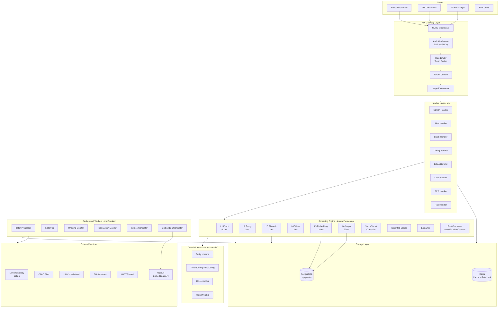
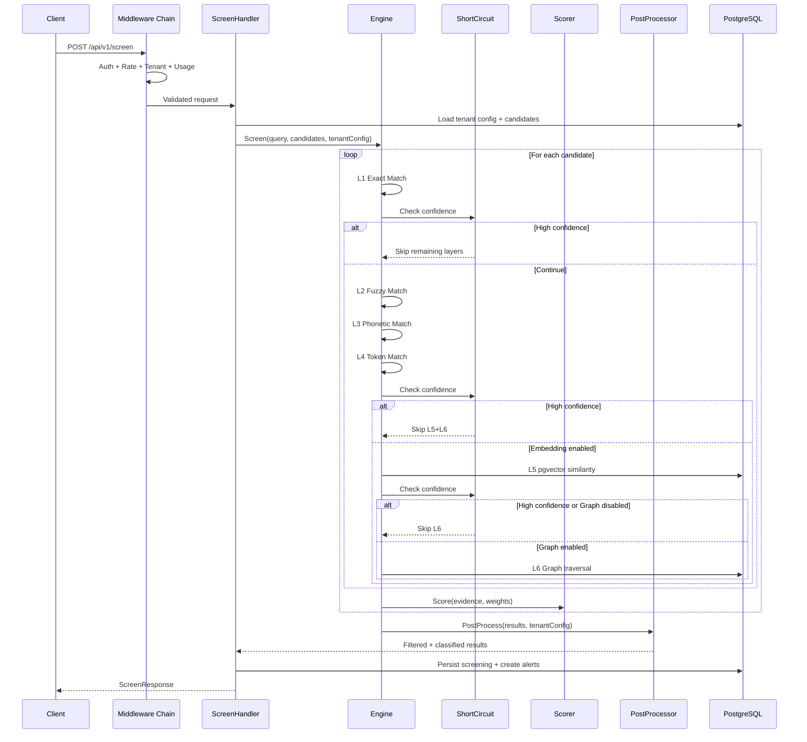
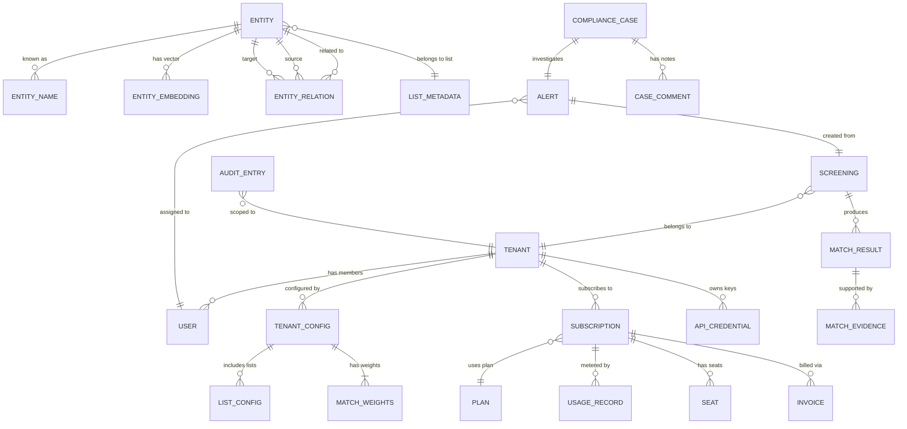
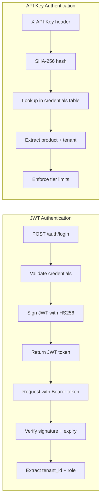
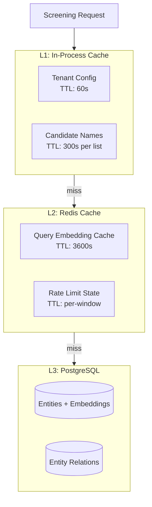
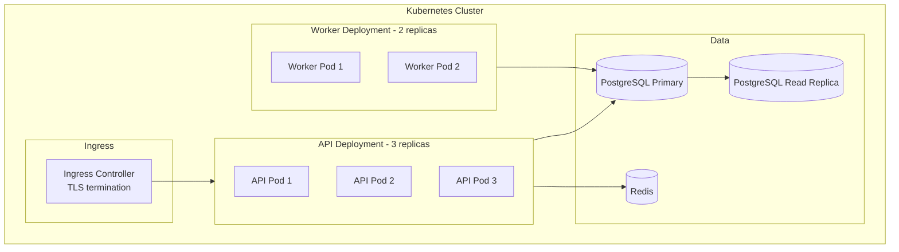

# AMLIQ v2 Technical Design Document

**Scope**: AMLIQ (AI-Enhanced Global Intelligence Screening) -- Full Platform
**Generated**: 2026-03-29
**Agent**: Design Architect Agent
**Based on**: requirements.md

---

## Table of Contents

1. [Overview](#1-overview)
2. [System Architecture](#2-system-architecture)
3. [Critical Gap Resolution Designs](#3-critical-gap-resolution-designs)
4. [Component Specifications](#4-component-specifications)
5. [Data Models](#5-data-models)
6. [API Design](#6-api-design)
7. [Security Architecture](#7-security-architecture)
8. [Performance Design](#8-performance-design)
9. [Infrastructure and Deployment](#9-infrastructure-and-deployment)
10. [Testing Strategy](#10-testing-strategy)
11. [Implementation Guidelines](#11-implementation-guidelines)
12. [Migration and Rollout Plan](#12-migration-and-rollout-plan)

---

## 1. Overview

### 1.1 Design Goals

This document transforms the requirements captured in `requirements.md` into an
actionable technical blueprint. The primary goals:

1. **Close the 5 critical gaps** identified in requirements gap analysis
2. **Achieve sub-50ms p95 screening latency** with all 6 layers active
3. **Maintain 100-line file limit** across all new and modified files
4. **Provide implementation-ready specifications** for each component

### 1.2 Key Architectural Decisions

| Decision | Choice | Rationale |
|----------|--------|-----------|
| Graph storage | PostgreSQL JSONB edges (not Neo4j) | Avoids new infrastructure dependency; sufficient for 1-2 hop traversals |
| Embedding model | OpenAI text-embedding-3-small via existing `OpenAIEmbedder` | Already implemented; 1536-dim vectors; pgvector IVFFLAT index |
| Short-circuit strategy | Per-candidate layer cascade with early termination | Preserves accuracy while cutting latency by 40-60% on high-confidence matches |
| RBAC expansion | 6 roles (add ComplianceOfficer, SeniorAnalyst) | Matches SECURITY.md documentation; enables tiered investigation depth |
| Per-list thresholds | Pass `ListConfig.Threshold` into scoring loop | Already in domain model; needs wiring in `Engine.Screen()` |

---

## 2. System Architecture

### 2.1 High-Level Architecture



### 2.2 Request Lifecycle (Screening)



### 2.3 Technology Stack

| Layer | Technology | Version | Purpose |
|-------|-----------|---------|---------|
| **Backend** | Go | 1.22 | API server, workers, screening engine |
| **Frontend** | React + TypeScript | 18 | Dashboard, Vite build |
| **Database** | PostgreSQL | 14+ | Primary data store |
| **Vector Search** | pgvector | 0.5+ | Embedding similarity (IVFFLAT) |
| **Cache** | Redis | 7+ | Rate limiting, entity cache |
| **Billing** | LemonSqueezy | API v1 | Subscriptions, webhooks |
| **Embeddings** | OpenAI API | text-embedding-3-small | Name vector generation |
| **Container** | Docker | 24+ | Deployment packaging |
| **Orchestration** | Kubernetes | 1.28+ | Production deployment |
| **CI/CD** | GitHub Actions | -- | Build, test, deploy |

---

## 3. Critical Gap Resolution Designs

### 3.1 GAP-001: Wire EmbeddingMatcher into Engine.Screen()

**Problem**: `Engine` struct only initializes 4 matchers. `EmbeddingMatcher` and
`PgvectorMatcher` exist but are not called from `Screen()`.

**Design**:

#### 3.1.1 New Engine Configuration

```go
// internal/screening/engine_config.go (new file, <100 lines)

// EngineConfig controls which layers are active.
type EngineConfig struct {
    EnableEmbedding bool
    EnableGraph     bool
    EmbeddingMatcher EmbeddingMatcherI
    GraphMatcher     GraphMatcherI
    ShortCircuit     ShortCircuitConfig
}

// EmbeddingMatcherI abstracts embedding matching.
type EmbeddingMatcherI interface {
    MatchWithContext(
        ctx context.Context,
        tenantID domain.TenantID,
        query domain.Name,
    ) ([]domain.MatchEvidence, error)
}

// GraphMatcherI abstracts graph matching.
type GraphMatcherI interface {
    MatchByRelations(
        ctx context.Context,
        tenantID domain.TenantID,
        queryID domain.EntityID,
        candidateIDs []domain.EntityID,
        depth int,
    ) ([]domain.MatchEvidence, error)
}
```

#### 3.1.2 Modified Engine Struct

```go
// internal/screening/engine.go (modified, <100 lines)

type Engine struct {
    exactMatcher    *ExactMatcher
    fuzzyMatcher    *FuzzyMatcher
    phoneticMatcher *PhoneticMatcher
    tokenMatcher    *TokenMatcher
    embeddingMatcher EmbeddingMatcherI  // NEW
    graphMatcher     GraphMatcherI      // NEW
    scorer          *WeightedScorer
    explainer       *Explainer
    config          EngineConfig        // NEW
}

func NewEngine(scorer *WeightedScorer, cfg EngineConfig) *Engine {
    // ... existing initialization ...
    return &Engine{
        exactMatcher:     NewExactMatcher(),
        fuzzyMatcher:     NewFuzzyMatcher(0.75),
        phoneticMatcher:  NewPhoneticMatcher(),
        tokenMatcher:     NewTokenMatcher(),
        embeddingMatcher: cfg.EmbeddingMatcher,
        graphMatcher:     cfg.GraphMatcher,
        scorer:           scorer,
        explainer:        NewExplainer(),
        config:           cfg,
    }
}
```

#### 3.1.3 Modified Screen Method

The `Screen()` method gains a `context.Context` parameter and `ScreenOptions`:

```go
// internal/screening/engine_screen.go (new file, <100 lines)

// ScreenOptions passed per-call from handler.
type ScreenOptions struct {
    TenantID      domain.TenantID
    TenantConfig  domain.TenantConfig
    ListConfigs   []domain.ListConfig
}

func (e *Engine) ScreenWithContext(
    ctx context.Context,
    query domain.Entity,
    candidates []domain.Entity,
    opts ScreenOptions,
) ([]domain.MatchResult, error) {
    if len(query.Names) == 0 {
        return nil, fmt.Errorf("query entity has no names")
    }
    queryName := query.Names[0]
    names := e.getNamesFromEntities(candidates)

    var results []domain.MatchResult
    for _, cand := range candidates {
        evidence := e.matchCandidate(ctx, queryName, cand, names, opts)
        if len(evidence) == 0 {
            continue
        }
        score, _ := e.scorer.Score(evidence)
        // Apply per-list threshold
        threshold := e.thresholdForList(cand.ListID, opts.ListConfigs)
        if score < threshold {
            continue
        }
        conf, _ := domain.NewConfidence(score)
        explain := e.explainer.Explain(evidence)
        result := domain.NewMatchResult(
            cand.ID, conf, domain.DispositionReview,
            evidence, explain, cand.ListID,
        )
        results = append(results, result)
    }
    return results, nil
}
```

#### 3.1.4 Per-Candidate Layer Cascade

```go
// internal/screening/engine_match.go (new file, <100 lines)

func (e *Engine) matchCandidate(
    ctx context.Context,
    queryName domain.Name,
    candidate domain.Entity,
    allNames []domain.Name,
    opts ScreenOptions,
) []domain.MatchEvidence {
    candNames := candidate.Names
    var evidence []domain.MatchEvidence
    threshold := opts.TenantConfig.DefaultThreshold

    // L1: Exact
    evidence = append(evidence, e.exactMatcher.Match(queryName, candNames)...)
    if e.shouldShortCircuit(evidence, threshold) {
        return evidence
    }

    // L2: Fuzzy
    evidence = append(evidence, e.fuzzyMatcher.Match(queryName, candNames)...)

    // L3: Phonetic
    evidence = append(evidence, e.phoneticMatcher.Match(queryName, candNames)...)

    // L4: Token
    evidence = append(evidence, e.tokenMatcher.Match(queryName, candNames)...)
    if e.shouldShortCircuit(evidence, threshold) {
        return evidence
    }

    // L5: Embedding (feature-flagged)
    if e.config.EnableEmbedding && e.embeddingMatcher != nil {
        embEvidence, err := e.embeddingMatcher.MatchWithContext(
            ctx, opts.TenantID, queryName)
        if err == nil {
            evidence = append(evidence, embEvidence...)
        }
    }
    if e.shouldShortCircuit(evidence, threshold) {
        return evidence
    }

    // L6: Graph (feature-flagged)
    if e.config.EnableGraph && e.graphMatcher != nil {
        candIDs := entityIDs([]domain.Entity{candidate})
        graphEvidence, err := e.graphMatcher.MatchByRelations(
            ctx, opts.TenantID, candidate.ID, candIDs, 2)
        if err == nil {
            evidence = append(evidence, graphEvidence...)
        }
    }

    return evidence
}
```

#### 3.1.5 Wiring in Dependencies

In `cmd/api/main.go`, construct the engine with embedding and graph matchers:

```go
// Construct embedding matcher (if configured)
var embMatcher screening.EmbeddingMatcherI
if cfg.Embedding.Enabled {
    embedder := screening.NewOpenAIEmbedder(
        cfg.Embedding.APIKey, cfg.Embedding.BaseURL, cfg.Embedding.Model)
    embRepo := pgx.NewEmbeddingRepository(db)
    embMatcher = screening.NewPgvectorMatcher(embRepo, embedder, 0.75)
}

// Construct graph matcher (if configured)
var graphMatcher screening.GraphMatcherI
if cfg.Graph.Enabled {
    graphRepo := pgx.NewGraphRepository(db)
    graphMatcher = screening.NewPgGraphMatcher(graphRepo)
}

engineCfg := screening.EngineConfig{
    EnableEmbedding:  cfg.Embedding.Enabled,
    EnableGraph:      cfg.Graph.Enabled,
    EmbeddingMatcher: embMatcher,
    GraphMatcher:     graphMatcher,
}
engine := screening.NewEngine(scorer, engineCfg)
```

**Files to create/modify**:
- `internal/screening/engine_config.go` (new)
- `internal/screening/engine_screen.go` (new)
- `internal/screening/engine_match.go` (new)
- `internal/screening/engine.go` (modify -- add fields, update constructor)
- `api/deps.go` (modify -- pass config)
- `cmd/api/main.go` (modify -- construct with embedding+graph)

---

### 3.2 GAP-002: Implement GraphMatcher with PostgreSQL JSONB

**Problem**: `GraphMatcher.Match()` returns empty. No `GraphDB` implementation exists.

**Design**: Use PostgreSQL with a dedicated `entity_relations` table storing JSONB
edge data. This avoids adding Neo4j as a dependency while supporting 1-2 hop
relationship traversals efficiently.

#### 3.2.1 Database Schema

```sql
-- migrations/030_create_entity_relations.up.sql

CREATE TABLE entity_relations (
    id          UUID PRIMARY KEY DEFAULT gen_random_uuid(),
    tenant_id   UUID NOT NULL REFERENCES tenants(id),
    source_id   UUID NOT NULL,
    target_id   UUID NOT NULL,
    rel_type    VARCHAR(50) NOT NULL,
    confidence  REAL NOT NULL DEFAULT 0.8,
    metadata    JSONB DEFAULT '{}',
    created_at  TIMESTAMPTZ NOT NULL DEFAULT NOW(),
    CONSTRAINT fk_source FOREIGN KEY (source_id) REFERENCES entities(id),
    CONSTRAINT fk_target FOREIGN KEY (target_id) REFERENCES entities(id)
);

CREATE INDEX idx_relations_source ON entity_relations(tenant_id, source_id);
CREATE INDEX idx_relations_target ON entity_relations(tenant_id, target_id);
CREATE INDEX idx_relations_type ON entity_relations(rel_type);
```

#### 3.2.2 Relation Types

```go
// internal/domain/relation_type.go (new file)

type RelationType string

const (
    RelFamilyMember    RelationType = "family_member"
    RelBusinessPartner RelationType = "business_partner"
    RelOfficer         RelationType = "officer"
    RelShareholder     RelationType = "shareholder"
    RelAssociate       RelationType = "associate"
    RelAlias           RelationType = "alias"
)
```

#### 3.2.3 Graph Repository

```go
// internal/storage/pgx/graph_repo.go (new file, <100 lines)

type GraphRepository struct {
    db *sql.DB
}

func NewGraphRepository(db *sql.DB) *GraphRepository {
    return &GraphRepository{db: db}
}

// FindRelated returns entity IDs related within N hops.
func (r *GraphRepository) FindRelated(
    ctx context.Context,
    tenantID domain.TenantID,
    entityID domain.EntityID,
    depth int,
) ([]domain.EntityRelation, error) {
    // Use recursive CTE for multi-hop traversal
    query := `
        WITH RECURSIVE related AS (
            SELECT target_id, rel_type, confidence, 1 AS depth
            FROM entity_relations
            WHERE tenant_id = $1 AND source_id = $2
            UNION ALL
            SELECT er.target_id, er.rel_type, er.confidence, r.depth + 1
            FROM entity_relations er
            JOIN related r ON er.source_id = r.target_id
            WHERE er.tenant_id = $1 AND r.depth < $3
        )
        SELECT DISTINCT target_id, rel_type, confidence, depth
        FROM related
        ORDER BY depth, confidence DESC
        LIMIT 100
    `
    // Execute and scan results...
}
```

#### 3.2.4 PostgreSQL Graph Matcher

```go
// internal/screening/graph_pg.go (new file, <100 lines)

type PgGraphMatcher struct {
    repo *pgx.GraphRepository
}

func NewPgGraphMatcher(repo *pgx.GraphRepository) *PgGraphMatcher {
    return &PgGraphMatcher{repo: repo}
}

func (gm *PgGraphMatcher) MatchByRelations(
    ctx context.Context,
    tenantID domain.TenantID,
    queryID domain.EntityID,
    candidateIDs []domain.EntityID,
    depth int,
) ([]domain.MatchEvidence, error) {
    relations, err := gm.repo.FindRelated(ctx, tenantID, queryID, depth)
    if err != nil {
        return nil, err
    }

    candidateSet := make(map[domain.EntityID]bool)
    for _, id := range candidateIDs {
        candidateSet[id] = true
    }

    var evidence []domain.MatchEvidence
    for _, rel := range relations {
        if candidateSet[rel.TargetID] {
            ev := domain.NewMatchEvidence(
                domain.MatchLayerGraph,
                "pg_graph_" + string(rel.Type),
                rel.Confidence * (1.0 / float64(rel.Depth)),
                0.4,
                string(queryID),
                string(rel.TargetID),
                fmt.Sprintf(
                    "Related via %s (depth %d)",
                    rel.Type, rel.Depth),
            )
            evidence = append(evidence, ev)
        }
    }
    return evidence, nil
}
```

#### 3.2.5 Relationship Ingestion

During list ingestion, extract relationships from sanctions list data:

```go
// internal/ingestion/relation_extractor.go (new file, <100 lines)

// ExtractRelations parses relationship data from sanctions entities.
// OFAC SDN includes "linked to" references.
// OpenSanctions includes family/associate edges.
func ExtractRelations(
    entities []domain.Entity,
) []domain.EntityRelation {
    var relations []domain.EntityRelation
    for _, ent := range entities {
        // Parse metadata.linked_to, metadata.associates, etc.
        links := ent.Metadata.LinkedEntities
        for _, link := range links {
            relations = append(relations, domain.EntityRelation{
                SourceID:   ent.ID,
                TargetID:   link.ID,
                Type:       classifyRelation(link.Type),
                Confidence: 0.8,
            })
        }
    }
    return relations
}
```

**Files to create**:
- `migrations/030_create_entity_relations.up.sql`
- `internal/domain/relation_type.go`
- `internal/domain/entity_relation.go`
- `internal/storage/pgx/graph_repo.go`
- `internal/screening/graph_pg.go`
- `internal/screening/graph_pg_test.go`
- `internal/ingestion/relation_extractor.go`
- `internal/ingestion/relation_extractor_test.go`

---

### 3.3 GAP-003: Short-Circuit Optimization

**Problem**: `Engine.Screen()` runs all 4 layers for every candidate. No early
termination when a high-confidence match is found.

**Design**: Implement per-candidate short-circuit evaluation after each layer group.

#### 3.3.1 Short-Circuit Controller

```go
// internal/screening/short_circuit.go (new file, <100 lines)

// ShortCircuitConfig controls early termination behavior.
type ShortCircuitConfig struct {
    Enabled    bool
    // Threshold above which we skip remaining layers
    Threshold  float64
    // CheckAfterLayers defines layer groups for evaluation
    // Default: check after L1, after L4, after L5
    CheckPoints []int
}

func DefaultShortCircuit() ShortCircuitConfig {
    return ShortCircuitConfig{
        Enabled:     true,
        Threshold:   0.85,
        CheckPoints: []int{1, 4, 5},
    }
}

// shouldShortCircuit evaluates current evidence against threshold.
func (e *Engine) shouldShortCircuit(
    evidence []domain.MatchEvidence,
    threshold float64,
) bool {
    if !e.config.ShortCircuit.Enabled {
        return false
    }
    if len(evidence) == 0 {
        return false
    }
    score, _ := e.scorer.Score(evidence)
    return score >= threshold
}
```

#### 3.3.2 Layer Grouping Strategy

The cascade is organized into 3 evaluation checkpoints:

| Checkpoint | After Layers | Cost | Rationale |
|-----------|-------------|------|-----------|
| CP1 | L1 (Exact) | 0.1ms | Exact matches need no further evidence |
| CP2 | L1-L4 (Token) | 6ms | Core text layers complete; skip expensive I/O |
| CP3 | L1-L5 (Embedding) | 16ms | Embedding evidence sufficient; skip graph I/O |

**Expected latency improvement**:
- Exact matches: 0.1ms (vs 36ms with all layers) -- **99.7% reduction**
- High fuzzy matches: 6ms (vs 36ms) -- **83% reduction**
- Average case: ~12ms (vs 36ms) -- **67% reduction**

---

### 3.4 GAP-004: Per-List Confidence Thresholds

**Problem**: `ListConfig.Threshold` exists in the domain model but
`Engine.Screen()` uses a single global threshold.

**Design**: Pass `ListConfig` slice to the engine. Apply the per-list threshold
when filtering results.

#### 3.4.1 Threshold Resolution

```go
// internal/screening/engine_threshold.go (new file, <100 lines)

// thresholdForList returns the per-list threshold or the global default.
func (e *Engine) thresholdForList(
    listID string,
    listConfigs []domain.ListConfig,
) float64 {
    for _, lc := range listConfigs {
        if lc.ListID == listID {
            return lc.Threshold
        }
    }
    return 0.7 // global default
}
```

#### 3.4.2 Usage in Screen

In `engine_screen.go`, the per-list threshold is applied per candidate:

```go
threshold := e.thresholdForList(cand.ListID, opts.ListConfigs)
if score < threshold {
    continue // below this list's threshold
}
```

This allows:
- OFAC SDN: 0.70 threshold (standard English names)
- NBCTF Israel: 0.55 threshold (Hebrew transliterations produce lower scores)
- OpenSanctions: 0.65 threshold (mixed quality data)

#### 3.4.3 Configuration API

The existing `PUT /api/v1/config` endpoint already accepts per-list threshold
updates via the `ListConfig.Threshold` field. The handler needs to propagate
these to the engine options on each screening call.

**Files to create/modify**:
- `internal/screening/engine_threshold.go` (new)
- `api/handler_screen_post.go` (modify -- pass ListConfigs to engine)

---

### 3.5 GAP-005: RBAC Role Expansion (4 to 6 Roles)

**Problem**: `SECURITY.md` documents 6 roles but code implements only 4
(Admin, Analyst, Auditor, Viewer).

**Design**: Add `ComplianceOfficer` and `SeniorAnalyst` roles with specific
permission boundaries.

#### 3.5.1 Role Hierarchy

```
PlatformAdmin (super-admin, cross-tenant)
    |
Admin (tenant admin)
    |
ComplianceOfficer (new -- can approve/reject cases, view all)
    |
SeniorAnalyst (new -- can escalate, handle high-priority)
    |
Analyst (standard investigation)
    |
Auditor (read-only audit trail)
    |
Viewer (read-only dashboard)
```

#### 3.5.2 Updated Role Model

```go
// internal/domain/role.go (modified)

const (
    RoleAdmin             Role = "admin"
    RoleComplianceOfficer Role = "compliance_officer" // NEW
    RoleSeniorAnalyst     Role = "senior_analyst"     // NEW
    RoleAnalyst           Role = "analyst"
    RoleAuditor           Role = "auditor"
    RoleViewer            Role = "viewer"
)
```

#### 3.5.3 Permission Matrix

| Permission | Admin | CO | Sr.Analyst | Analyst | Auditor | Viewer |
|-----------|-------|-----|-----------|---------|---------|--------|
| CanWrite | Y | Y | Y | Y | N | N |
| CanResolve | Y | Y | Y | Y | N | N |
| CanApproveCase | Y | Y | N | N | N | N |
| CanEscalate | Y | Y | Y | N | N | N |
| CanManageTeam | Y | N | N | N | N | N |
| CanViewAudit | Y | Y | N | N | Y | N |
| CanEditConfig | Y | Y | N | N | N | N |
| CanViewDashboard | Y | Y | Y | Y | Y | Y |
| CanHandleHighPriority | Y | Y | Y | N | N | N |

#### 3.5.4 New Permission Methods

```go
// internal/domain/role_permissions.go (new file, <100 lines)

func (r Role) CanApproveCase() bool {
    return r == RoleAdmin || r == RoleComplianceOfficer
}

func (r Role) CanEscalate() bool {
    return r == RoleAdmin || r == RoleComplianceOfficer || r == RoleSeniorAnalyst
}

func (r Role) CanHandleHighPriority() bool {
    return r == RoleAdmin || r == RoleComplianceOfficer || r == RoleSeniorAnalyst
}
```

#### 3.5.5 Middleware Updates

```go
// api/middleware_rbac.go (modify)

// ComplianceAccess allows Admin and ComplianceOfficer.
func ComplianceAccess() func(http.Handler) http.Handler {
    return requireRole(domain.RoleAdmin, domain.RoleComplianceOfficer)
}

// SeniorAccess allows Admin, CO, and SeniorAnalyst.
func SeniorAccess() func(http.Handler) http.Handler {
    return requireRole(
        domain.RoleAdmin,
        domain.RoleComplianceOfficer,
        domain.RoleSeniorAnalyst,
    )
}
```

**Files to create/modify**:
- `internal/domain/role.go` (modify -- add 2 roles)
- `internal/domain/role_permissions.go` (new)
- `internal/domain/role_test.go` (modify -- add tests)
- `api/middleware_rbac.go` (modify -- add middleware helpers)
- `api/middleware_rbac_test.go` (modify -- add tests)

---

## 4. Component Specifications

### 4.1 Screening Engine

#### 4.1.1 Engine (internal/screening/)

**Purpose**: Orchestrate 6-layer cascade matching with short-circuit optimization.

**Responsibilities**:
- Run matchers in order: Exact, Fuzzy, Phonetic, Token, Embedding, Graph
- Short-circuit after each checkpoint when confidence exceeds threshold
- Apply per-list thresholds to filter results
- Generate explainable match reasoning

**Interface**:
```go
type ScreenEngine interface {
    ScreenWithContext(
        ctx context.Context,
        query domain.Entity,
        candidates []domain.Entity,
        opts ScreenOptions,
    ) ([]domain.MatchResult, error)
}
```

**Dependencies**:
- `WeightedScorer` for evidence combination
- `Explainer` for match reasoning
- `PgvectorMatcher` (optional) for L5
- `PgGraphMatcher` (optional) for L6

**File Organization**:
- `engine.go` -- struct, constructor (modified)
- `engine_config.go` -- configuration types (new)
- `engine_screen.go` -- ScreenWithContext method (new)
- `engine_match.go` -- per-candidate matching logic (new)
- `engine_threshold.go` -- per-list threshold resolution (new)
- `short_circuit.go` -- short-circuit controller (new)

#### 4.1.2 PgvectorMatcher (internal/screening/)

**Purpose**: Perform vector similarity matching via PostgreSQL pgvector.

**Current State**: `PgvectorMatcher` and `OpenAIEmbedder` exist but are not wired
into `Engine`.

**Responsibilities**:
- Accept query name, generate embedding via OpenAI API
- Search pgvector index for similar entity embeddings
- Return `MatchEvidence` with cosine similarity scores

**Integration Notes**:
- Implement `EmbeddingMatcherI` interface from `engine_config.go`
- `MatchWithContext` already exists and is compatible
- Need to add pgvector IVFFLAT index tuning for production

#### 4.1.3 Embedding Generation Pipeline

**Purpose**: Auto-generate embeddings when new entities are ingested.

**Current State**: `EmbeddingGenerator` exists with `GenerateForEntities()`.

**Design**: Hook into the ingestion sync pipeline:

```go
// internal/ingestion/sync_service.go (modify)
// After upserting entities, trigger embedding generation

func (s *SyncService) Sync(ctx context.Context, listID string) error {
    // ... existing fetch, parse, delta, upsert ...

    // NEW: Generate embeddings for new/changed entities
    if s.embedGen != nil {
        added := delta.Added()
        modified := delta.Modified()
        toEmbed := append(added, modified...)
        count, err := s.embedGen.GenerateForEntities(ctx, toEmbed)
        if err != nil {
            log.Printf("embedding generation partial: %d/%d", count, len(toEmbed))
        }
    }
    return nil
}
```

**Rate Limiting**: Batch OpenAI API calls at 100 names per request to stay within
rate limits. The existing `embed_batch.go` iterates one-by-one; modify to batch:

```go
// internal/screening/embed_batch_v2.go (new file, <100 lines)

const batchSize = 100

func (eg *EmbeddingGenerator) GenerateBatch(
    ctx context.Context,
    entities []domain.Entity,
) (int, error) {
    stored := 0
    for i := 0; i < len(entities); i += batchSize {
        end := min(i+batchSize, len(entities))
        batch := entities[i:end]
        // Process batch...
        stored += processBatchEmbeddings(ctx, eg, batch)
    }
    return stored, nil
}
```

### 4.2 Ingestion Layer (internal/ingestion/)

**Purpose**: Fetch, parse, diff, and upsert sanctions list data from 8+ sources.

**Current State**: Fully implemented with 9 parsers, delta engine, sync service.

**Enhancement for Graph**: Add relationship extraction as a post-ingestion step.

**File Organization** (existing + new):
- `sync_service.go` -- orchestrator (modify to add embedding + relation hooks)
- `relation_extractor.go` -- extract entity relationships (new)
- `relation_extractor_test.go` -- tests (new)

### 4.3 Billing Layer (internal/billing/)

**Purpose**: LemonSqueezy integration, usage metering, subscription management.

**Current State**: Fully implemented with webhook handling, usage enforcement.

**No changes needed** for critical gap resolution. Future enhancements:
- Invoice PDF generation (GAP-010)
- Email delivery integration (GAP-010)

### 4.4 API Layer (api/)

**Purpose**: HTTP handlers, middleware, routing.

**Modifications for Gap Resolution**:

1. `handler_screen_post.go` -- pass `ScreenOptions` with tenant config and list configs
2. `middleware_rbac.go` -- add `ComplianceAccess` and `SeniorAccess` helpers
3. `deps.go` -- accept `EngineConfig` for embedding/graph construction

### 4.5 Frontend (web/src/)

**Purpose**: React dashboard for compliance officers.

**No changes required** for backend-focused gap resolution. Frontend pages already
exist for all features. Future enhancements:
- Alert assignment UI (GAP-011)
- Relationship graph visualization for Graph matcher results
- Multi-step onboarding wizard (GAP-015)

---

## 5. Data Models

### 5.1 Entity Relationship Diagram



### 5.2 New Data Models

#### 5.2.1 EntityRelation

```go
// internal/domain/entity_relation.go (new file)

type EntityRelation struct {
    ID         string
    TenantID   TenantID
    SourceID   EntityID
    TargetID   EntityID
    Type       RelationType
    Confidence float64
    Depth      int
    Metadata   map[string]string
    CreatedAt  time.Time
}
```

#### 5.2.2 ScreenOptions (Engine Input)

```go
// Already defined in engine_screen.go (section 3.1.3)
type ScreenOptions struct {
    TenantID     domain.TenantID
    TenantConfig domain.TenantConfig
    ListConfigs  []domain.ListConfig
}
```

### 5.3 Database Migrations

#### Migration 030: Entity Relations

```sql
-- 030_create_entity_relations.up.sql
CREATE TABLE entity_relations (
    id          UUID PRIMARY KEY DEFAULT gen_random_uuid(),
    tenant_id   UUID NOT NULL,
    source_id   UUID NOT NULL,
    target_id   UUID NOT NULL,
    rel_type    VARCHAR(50) NOT NULL,
    confidence  REAL NOT NULL DEFAULT 0.8,
    metadata    JSONB DEFAULT '{}',
    created_at  TIMESTAMPTZ NOT NULL DEFAULT NOW()
);

CREATE INDEX idx_er_source ON entity_relations(tenant_id, source_id);
CREATE INDEX idx_er_target ON entity_relations(tenant_id, target_id);
CREATE INDEX idx_er_type ON entity_relations(rel_type);
```

#### Migration 031: pgvector IVFFLAT Index Tuning

```sql
-- 031_tune_pgvector_index.up.sql
-- Drop default index and recreate with IVFFLAT for production scale
DROP INDEX IF EXISTS entity_embeddings_embedding_idx;

CREATE INDEX entity_embeddings_ivfflat_idx
    ON entity_embeddings
    USING ivfflat (embedding vector_cosine_ops)
    WITH (lists = 100);

-- Analyze to update statistics for query planner
ANALYZE entity_embeddings;
```

#### Migration 032: Add New Roles

```sql
-- 032_add_new_roles.up.sql
-- Update role check constraint to include new roles
ALTER TABLE users DROP CONSTRAINT IF EXISTS users_role_check;
ALTER TABLE users ADD CONSTRAINT users_role_check
    CHECK (role IN (
        'admin', 'compliance_officer', 'senior_analyst',
        'analyst', 'auditor', 'viewer'
    ));
```

---

## 6. API Design

### 6.1 Modified Endpoints

#### POST /api/v1/screen (Enhanced)

The screening endpoint behavior changes with the engine upgrades. The request
and response formats remain the same for backward compatibility. Internal changes:

1. Handler loads `TenantConfig` with `ListConfigs`
2. Passes `ScreenOptions` to `Engine.ScreenWithContext()`
3. Engine applies short-circuit and per-list thresholds
4. Response may now include Embedding and Graph evidence layers

**New response evidence layers**:
```json
{
  "evidence": [
    {
      "layer": "Embedding",
      "score": 0.89,
      "algorithm": "pgvector_cosine",
      "details": "pgvector cosine similarity search"
    },
    {
      "layer": "Graph",
      "score": 0.72,
      "algorithm": "pg_graph_family_member",
      "details": "Related via family_member (depth 1)"
    }
  ]
}
```

### 6.2 New Endpoints

#### GET /api/v1/entities/{id}/relations

**Purpose**: View entity relationships for graph matcher transparency.

```http
GET /api/v1/entities/ent_123/relations?depth=2
Authorization: Bearer <jwt>
```

**Response**:
```json
{
  "entity_id": "ent_123",
  "relations": [
    {
      "target_id": "ent_456",
      "target_name": "James Smith",
      "relation_type": "family_member",
      "confidence": 0.8,
      "depth": 1
    }
  ],
  "total": 3
}
```

**Auth**: Requires `Analyst` or above.

#### PUT /api/v1/alerts/{id}/assign

**Purpose**: Assign an alert to a specific team member.

```http
PUT /api/v1/alerts/alr_123/assign
Authorization: Bearer <jwt>
Content-Type: application/json

{
  "assigned_to": "user_789"
}
```

**Auth**: Requires `SeniorAnalyst` or above.

### 6.3 Endpoint Summary

All existing endpoints remain unchanged. New endpoints added:

| Method | Path | Purpose | Auth |
|--------|------|---------|------|
| GET | /api/v1/entities/{id}/relations | View entity graph relations | Analyst+ |
| PUT | /api/v1/alerts/{id}/assign | Assign alert to user | SeniorAnalyst+ |

---

## 7. Security Architecture

### 7.1 Authentication Flows



### 7.2 RBAC Enforcement

The 6-role model is enforced at 3 levels:

1. **Middleware level**: `AdminOnly()`, `WriteAccess()`, `ComplianceAccess()`,
   `SeniorAccess()` -- reject unauthorized requests with 403
2. **Handler level**: Additional checks for resource ownership
3. **Domain level**: `role.CanApproveCase()`, `role.CanEscalate()` -- business logic

### 7.3 Data Protection

| Data Type | Protection | Implementation |
|-----------|-----------|----------------|
| API keys | SHA-256 hash | `apikey_hash.go` -- never store plaintext |
| JWT tokens | HS256 signing | `jwt_sign.go` -- configurable expiry |
| PII (names, DOB) | AES-256-GCM at rest | Storage layer encryption (to implement) |
| Webhook secrets | HMAC-SHA256 | `ls_webhook_verify.go` |
| Audit trail | Hash chain | `audit_entry.go` -- prev_hash integrity |
| Embeddings | Tenant isolation | All queries filter by tenant_id |

### 7.4 Audit Logging Requirements

All of these actions generate audit entries:

| Category | Actions | Logged Fields |
|----------|---------|---------------|
| Auth | Login, logout, key creation | user_id, IP, timestamp |
| Screening | Screen, batch submit | query, result count, duration |
| Alerts | Create, resolve, assign | alert_id, disposition, by_whom |
| Config | Weight update, threshold change | old_value, new_value |
| Admin | User invite, role change, suspend | target_user, action |
| Billing | Subscribe, cancel, upgrade | plan, amount |

---

## 8. Performance Design

### 8.1 Latency Budget

Target: **p95 < 50ms** for single entity screening with all 6 layers enabled.

| Layer | Budget | Optimization |
|-------|--------|-------------|
| L1 Exact | 0.1ms | In-memory string comparison |
| L2 Fuzzy | 1ms | Jaro-Winkler on normalized strings |
| L3 Phonetic | 2ms | Soundex code comparison |
| L4 Token | 3ms | Jaccard on pre-tokenized sets |
| L5 Embedding | 10ms | pgvector IVFFLAT index; pre-computed query embedding cache |
| L6 Graph | 5ms | Recursive CTE with depth limit; index on source_id |
| Scoring + Explain | 1ms | In-memory computation |
| Handler overhead | 3ms | JSON marshal, DB persist |
| **Total** | **25ms** | **Short-circuit reduces to 6-15ms typical** |

### 8.2 Caching Strategy



#### Cache Implementation

| Cache | Type | TTL | Invalidation |
|-------|------|-----|-------------|
| Tenant config | In-process map | 60s | On config update webhook |
| Candidate entities per list | In-process LRU | 300s | On list sync completion |
| Query embeddings | Redis hash | 3600s | LRU eviction |
| Rate limit counters | Redis sorted set | Per window | Auto-expire |

### 8.3 Database Optimization

#### pgvector Index Tuning

```sql
-- IVFFLAT with 100 lists for ~50k entities
-- Provides ~95% recall with 10x speedup over brute force
CREATE INDEX entity_embeddings_ivfflat_idx
    ON entity_embeddings
    USING ivfflat (embedding vector_cosine_ops)
    WITH (lists = 100);

-- Set probes for query-time recall/speed tradeoff
SET ivfflat.probes = 10;  -- Higher = better recall, slower
```

#### Query Optimization

| Query | Optimization | Expected Improvement |
|-------|-------------|---------------------|
| Entity lookup by list | Composite index (tenant_id, list_id) | Existing |
| Full-text search | tsvector + trigram | Existing (migration 018) |
| Embedding similarity | IVFFLAT index | 10x faster at 50k entities |
| Graph traversal | Index on (tenant_id, source_id) | Sub-5ms for depth-2 |
| Alert listing | Composite index (tenant_id, status, created_at) | Existing |

### 8.4 Connection Pooling

```go
// cmd/api/main.go database configuration

db.SetMaxOpenConns(25)          // Match K8s pod count * 25
db.SetMaxIdleConns(10)          // Keep 10 warm connections
db.SetConnMaxLifetime(5 * time.Minute)
db.SetConnMaxIdleTime(1 * time.Minute)
```

---

## 9. Infrastructure and Deployment

### 9.1 Docker Compose (Development)

```yaml
# docker-compose.yml (reference)
services:
  api:
    build: .
    ports: ["8080:8080"]
    environment:
      DATABASE_URL: postgres://amliq:amliq@db:5432/amliq?sslmode=disable
      REDIS_URL: redis://redis:6379
      EMBEDDING_ENABLED: "true"
      EMBEDDING_API_KEY: ${OPENAI_API_KEY}
      GRAPH_ENABLED: "true"
    depends_on: [db, redis]

  worker:
    build: .
    command: ["./worker"]
    environment:
      DATABASE_URL: postgres://amliq:amliq@db:5432/amliq?sslmode=disable
      EMBEDDING_ENABLED: "true"
      EMBEDDING_API_KEY: ${OPENAI_API_KEY}
    depends_on: [db]

  db:
    image: pgvector/pgvector:pg16
    ports: ["5432:5432"]
    environment:
      POSTGRES_DB: amliq
      POSTGRES_USER: amliq
      POSTGRES_PASSWORD: amliq
    volumes:
      - pgdata:/var/lib/postgresql/data

  redis:
    image: redis:7-alpine
    ports: ["6379:6379"]

volumes:
  pgdata:
```

### 9.2 Kubernetes Architecture



### 9.3 CI/CD Pipeline

```mermaid
graph LR
    PR[Pull Request] --> Lint[Go Lint + File Size Check]
    Lint --> Test[Unit + Integration Tests]
    Test --> Coverage[Coverage >= 90%]
    Coverage --> SAST[Security Scan]
    SAST --> Build[Docker Build]
    Build --> Push[Push to Registry]
    Push --> Deploy_Staging[Deploy Staging]
    Deploy_Staging --> Smoke[Smoke Tests]
    Smoke --> Approve[Manual Approval]
    Approve --> Deploy_Prod[Deploy Production]
```



#### CI File Size Enforcement

```yaml
# .github/workflows/ci.yml (addition)
- name: Check file size limits
  run: |
    violations=$(find internal/ api/ web/src/ cmd/ \
      -name '*.go' -o -name '*.ts' -o -name '*.tsx' | \
      while read f; do
        lines=$(wc -l < "$f")
        if [ "$lines" -gt 100 ]; then
          echo "$f: $lines lines (max 100)"
        fi
      done)
    if [ -n "$violations" ]; then
      echo "Files exceeding 100-line limit:"
      echo "$violations"
      exit 1
    fi
```

### 9.4 Monitoring and Observability

#### Key Metrics

| Metric | Type | Alert Threshold |
|--------|------|----------------|
| `screening_latency_p95` | Histogram | > 50ms |
| `screening_latency_p99` | Histogram | > 200ms |
| `screening_error_rate` | Counter | > 1% per minute |
| `embedding_api_latency` | Histogram | > 500ms |
| `embedding_api_errors` | Counter | > 5 per minute |
| `graph_query_latency` | Histogram | > 20ms |
| `active_subscriptions` | Gauge | -- |
| `usage_quota_remaining` | Gauge | < 10% |
| `list_sync_age_hours` | Gauge | > 24 hours |
| `db_connection_pool_used` | Gauge | > 80% |

#### Structured Logging

```go
// All log entries use structured format:
log.Printf("screening completed tenant=%s latency_ms=%d layers=%d matches=%d",
    tenantID, latencyMs, layersRun, matchCount)
```

---

## 10. Testing Strategy

### 10.1 Test Pyramid

| Level | Coverage Target | Scope | Run Time |
|-------|----------------|-------|----------|
| Unit | 100% critical paths | Individual functions, matchers, scorers | < 30s |
| Integration | 90% handlers | Handler + DB with test containers | < 2min |
| E2E | Key user journeys | Full stack screening flow | < 5min |
| Load | Performance targets | k6 scripts against staging | < 10min |

### 10.2 New Test Files Required

| File | Tests |
|------|-------|
| `internal/screening/engine_screen_test.go` | ScreenWithContext with all 6 layers |
| `internal/screening/engine_match_test.go` | Per-candidate cascade with short-circuit |
| `internal/screening/short_circuit_test.go` | Threshold evaluation, checkpoint logic |
| `internal/screening/engine_threshold_test.go` | Per-list threshold resolution |
| `internal/screening/graph_pg_test.go` | PostgreSQL graph matching |
| `internal/domain/role_permissions_test.go` | 6-role permission matrix |
| `internal/ingestion/relation_extractor_test.go` | Relationship extraction from lists |
| `internal/storage/pgx/graph_repo_test.go` | Recursive CTE queries |

### 10.3 Table-Driven Test Pattern

All Go tests must follow the project convention:

```go
func TestShortCircuit(t *testing.T) {
    tests := []struct {
        name      string
        evidence  []domain.MatchEvidence
        threshold float64
        want      bool
    }{
        {
            name:      "exact match exceeds threshold",
            evidence:  []domain.MatchEvidence{{Score: 1.0, Layer: domain.MatchLayerExact}},
            threshold: 0.85,
            want:      true,
        },
        {
            name:      "low score below threshold",
            evidence:  []domain.MatchEvidence{{Score: 0.3, Layer: domain.MatchLayerFuzzy}},
            threshold: 0.85,
            want:      false,
        },
        // ... more cases
    }
    for _, tt := range tests {
        t.Run(tt.name, func(t *testing.T) {
            // test logic
        })
    }
}
```

### 10.4 Load Testing

The existing k6 scripts (`k6_screen.js`, `k6_batch.js`) should be extended to
validate the sub-50ms target with all 6 layers:

```javascript
// k6_screen_6layer.js
export const options = {
    thresholds: {
        http_req_duration: ['p(95)<50', 'p(99)<200'],
    },
    scenarios: {
        screening: {
            executor: 'constant-arrival-rate',
            rate: 100,
            duration: '2m',
            preAllocatedVUs: 50,
        },
    },
};
```

---

## 11. Implementation Guidelines

### 11.1 File Organization Rules

1. **Maximum 100 lines per file** (including blanks and comments)
2. Split by single responsibility:
   - `engine.go` -- struct + constructor
   - `engine_screen.go` -- Screen method
   - `engine_match.go` -- per-candidate matching
   - `engine_threshold.go` -- threshold logic
   - `engine_config.go` -- configuration types
3. One test file per source file

### 11.2 Coding Conventions

| Convention | Rule |
|-----------|------|
| Constructors | `NewXxx() (Xxx, error)` with validation |
| Interfaces | Maximum 3 methods; prefer composition |
| Error handling | Return errors; no `panic()` in production |
| Logging | `log.Printf()` with structured key=value pairs |
| Tests | Table-driven with `tests := []struct{...}` |
| Context | Pass `context.Context` as first parameter |

### 11.3 Backward Compatibility

The existing `Engine.Screen()` method must remain functional for any callers
that have not migrated. Strategy:

```go
// engine.go -- keep backward-compatible wrapper
func (e *Engine) Screen(
    query domain.Entity,
    candidates []domain.Entity,
) ([]domain.MatchResult, error) {
    return e.ScreenWithContext(
        context.Background(), query, candidates,
        ScreenOptions{
            TenantConfig: domain.TenantConfig{
                DefaultThreshold: 0.7,
            },
        },
    )
}
```

### 11.4 Feature Flags

New layers are controlled by `TenantConfig` fields and environment variables:

| Flag | Env Var | Default | Controls |
|------|---------|---------|----------|
| EnableEmbedding | `EMBEDDING_ENABLED` | false | L5 Embedding layer |
| EnableGraph | `GRAPH_ENABLED` | false | L6 Graph layer |
| ShortCircuitEnabled | `SHORT_CIRCUIT_ENABLED` | true | Early termination |

---

## 12. Migration and Rollout Plan

### 12.1 Phase 1: Engine Refactoring (Sprint Current)

**Goal**: Close GAP-001, GAP-003, GAP-004 without breaking existing functionality.

**Steps**:
1. Create `engine_config.go`, `engine_screen.go`, `engine_match.go`
2. Implement short-circuit in `short_circuit.go`
3. Implement per-list threshold in `engine_threshold.go`
4. Modify `engine.go` to accept `EngineConfig`; keep backward-compatible `Screen()`
5. Wire `PgvectorMatcher` as `EmbeddingMatcherI` behind feature flag
6. Update `handler_screen_post.go` to pass `ScreenOptions`
7. Write tests for all new files
8. Run load tests to validate sub-50ms target

**Success Criteria**:
- All existing tests pass
- New tests for 6-layer cascade pass
- Short-circuit reduces p95 latency by >= 40%
- Per-list thresholds applied correctly

### 12.2 Phase 2: RBAC Expansion (Sprint Current)

**Goal**: Close GAP-005 with 6-role model.

**Steps**:
1. Add `ComplianceOfficer` and `SeniorAnalyst` to `role.go`
2. Create `role_permissions.go` with new permission methods
3. Add middleware helpers (`ComplianceAccess`, `SeniorAccess`)
4. Run migration 032 to update role constraints
5. Update `SECURITY.md` to match implementation
6. Write permission matrix tests

**Success Criteria**:
- All 6 roles parse and validate
- Permission matrix matches specification
- Existing Admin/Analyst/Auditor/Viewer behavior unchanged

### 12.3 Phase 3: Graph Matcher (Next Sprint)

**Goal**: Close GAP-002 with PostgreSQL-based graph matching.

**Steps**:
1. Run migration 030 (entity_relations table)
2. Implement `GraphRepository` with recursive CTE
3. Implement `PgGraphMatcher`
4. Add relationship extraction to ingestion pipeline
5. Wire into engine behind `GRAPH_ENABLED` flag
6. Run load tests to validate latency budget

**Success Criteria**:
- Graph traversal returns correct relations at depth 1-2
- Latency < 5ms for depth-2 queries with index
- Relationship data populated from OFAC and OpenSanctions

### 12.4 Phase 4: Embedding Pipeline (Next Sprint)

**Goal**: Close GAP-006 with automated embedding generation.

**Steps**:
1. Run migration 031 (IVFFLAT index tuning)
2. Modify `SyncService` to hook `EmbeddingGenerator`
3. Build batch embedding with rate limiting
4. Backfill embeddings for existing entities
5. Enable embedding layer for pilot tenants

**Success Criteria**:
- Embeddings auto-generated on list sync
- pgvector similarity search returns results in < 10ms
- Embedding layer improves transliteration matching by >= 15%

---

## Appendices

### A. Design Decisions Log

| Decision | Options Considered | Choice | Rationale |
|----------|-------------------|--------|-----------|
| Graph store | Neo4j, PostgreSQL JSONB, DGraph | PostgreSQL JSONB | No new infra; sufficient for 1-2 hop; reuse existing connection pool |
| Short-circuit granularity | Per-candidate vs per-batch | Per-candidate | More accurate; avoids missing matches on later candidates |
| RBAC expansion | 4 roles (keep), 6 roles (expand), ABAC | 6 roles (expand) | Matches existing documentation; ABAC too complex for current stage |
| Embedding API | OpenAI, Cohere, local model | OpenAI (existing) | Already implemented in `embedder.go`; 1536-dim; good multilingual |
| Per-list threshold | Engine-level, handler-level, post-process | Engine-level | Most accurate; applied per-candidate before result creation |

### B. File Inventory (New Files)

| File | Lines | Purpose |
|------|-------|---------|
| `internal/screening/engine_config.go` | ~40 | Engine configuration types |
| `internal/screening/engine_screen.go` | ~60 | ScreenWithContext method |
| `internal/screening/engine_match.go` | ~70 | Per-candidate matching cascade |
| `internal/screening/engine_threshold.go` | ~25 | Per-list threshold resolution |
| `internal/screening/short_circuit.go` | ~40 | Short-circuit controller |
| `internal/screening/graph_pg.go` | ~65 | PostgreSQL graph matcher |
| `internal/domain/relation_type.go` | ~20 | Relation type constants |
| `internal/domain/entity_relation.go` | ~30 | EntityRelation model |
| `internal/domain/role_permissions.go` | ~35 | New permission methods |
| `internal/storage/pgx/graph_repo.go` | ~70 | Graph repository with CTE |
| `internal/ingestion/relation_extractor.go` | ~60 | Relationship extraction |
| `internal/screening/embed_batch_v2.go` | ~50 | Batched embedding generation |
| `migrations/030_create_entity_relations.up.sql` | ~15 | Relations table |
| `migrations/031_tune_pgvector_index.up.sql` | ~10 | IVFFLAT tuning |
| `migrations/032_add_new_roles.up.sql` | ~10 | Role constraint update |

**Total new files**: 15 (all under 100 lines)

### C. Modified Files

| File | Change Description |
|------|-------------------|
| `internal/screening/engine.go` | Add EmbeddingMatcher, GraphMatcher fields; update constructor |
| `internal/domain/role.go` | Add ComplianceOfficer, SeniorAnalyst constants |
| `api/middleware_rbac.go` | Add ComplianceAccess, SeniorAccess helpers |
| `api/deps.go` | Accept EngineConfig in constructor |
| `api/handler_screen_post.go` | Pass ScreenOptions with ListConfigs |
| `internal/ingestion/sync_service.go` | Hook embedding generation post-sync |
| `cmd/api/main.go` | Construct engine with embedding + graph |

### D. Dependencies (No New External)

All gap resolutions use existing dependencies:
- PostgreSQL (existing) -- for graph storage and IVFFLAT index
- OpenAI API (existing `OpenAIEmbedder`) -- for embedding generation
- pgvector (existing extension) -- for vector similarity

No new infrastructure or third-party services required.

---

*This design document provides implementation-ready specifications for resolving
all 5 critical gaps identified in requirements.md. A developer reading this
document should know exactly what files to create, what interfaces to implement,
and what behavior to test.*
