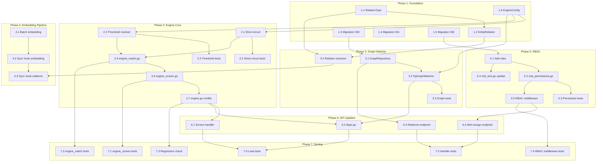

# Implementation Plan

**Scope**: AMLIQ v2 -- Critical Gap Resolution (GAP-001 through GAP-005)
**Generated**: 2026-03-29
**Agent**: Task Planning Agent
**Based on**: design.md, requirements.md

---

## Overview

This plan closes the 5 critical gaps identified in the requirements gap analysis:

1. **GAP-001**: Wire EmbeddingMatcher into Engine.Screen()
2. **GAP-002**: Implement GraphMatcher with PostgreSQL JSONB
3. **GAP-003**: Short-circuit optimization
4. **GAP-004**: Per-list confidence thresholds
5. **GAP-005**: RBAC role expansion (4 to 6 roles)

Plus the supporting work: embedding generation pipeline (GAP-006), database migrations, and comprehensive tests.

## Implementation Phases

| Phase | Name | Tasks | Focus |
|-------|------|-------|-------|
| 1 | Foundation -- Domain Models and Migrations | 1.1--1.6 | New types, DB schema, interfaces |
| 2 | Screening Engine Core | 2.1--2.7 | Engine refactor, short-circuit, per-list thresholds |
| 3 | Graph Matcher | 3.1--3.4 | PostgreSQL graph repo, PgGraphMatcher, relation extractor |
| 4 | Embedding Pipeline | 4.1--4.3 | Batch embedding, sync hook, IVFFLAT tuning |
| 5 | RBAC Expansion | 5.1--5.5 | 2 new roles, permission methods, middleware |
| 6 | API and Handler Updates | 6.1--6.4 | Screen handler, relations endpoint, alert assign |
| 7 | Testing and Validation | 7.1--7.6 | Integration tests, load tests, coverage |

## Prerequisites

- [x] PostgreSQL 14+ with pgvector extension installed (migration 020)
- [x] Existing 4-layer screening engine operational (engine.go)
- [x] EmbeddingMatcher and PgvectorMatcher source files exist
- [x] GraphMatcher stub exists (graph.go)
- [x] Domain model for ListConfig.Threshold exists
- [x] RBAC middleware with RequireRole pattern exists
- [ ] OpenAI API key configured for embedding generation (env: OPENAI_API_KEY)

---

## Task List

### Phase 1: Foundation -- Domain Models and Migrations

- [ ] **1.1 Create RelationType domain model**
  - **Description**: Define relationship type constants for the graph matcher. These classify edges between sanctioned entities (family, business partner, officer, shareholder, associate, alias).
  - **Files**: `internal/domain/relation_type.go` (new, ~20 lines)
  - **Requirements**: FR-SCR-004, GAP-002
  - **Estimated Time**: S (30 min)
  - **Dependencies**: None
  - **Acceptance Criteria**:
    - [x] Six RelationType constants defined: family_member, business_partner, officer, shareholder, associate, alias
    - [x] RelationType is a string type with validation
    - [x] File under 100 lines

- [ ] **1.2 Create EntityRelation domain model**
  - **Description**: Define the EntityRelation struct representing a directed edge between two entities. Includes source, target, type, confidence, depth, and metadata.
  - **Files**: `internal/domain/entity_relation.go` (new, ~30 lines)
  - **Requirements**: FR-SCR-004, GAP-002
  - **Estimated Time**: S (30 min)
  - **Dependencies**: 1.1
  - **Acceptance Criteria**:
    - [x] EntityRelation struct with ID, TenantID, SourceID, TargetID, Type, Confidence, Depth, Metadata, CreatedAt
    - [x] Constructor NewEntityRelation validates required fields
    - [x] File under 100 lines

- [ ] **1.3 Create migration 030: entity_relations table**
  - **Description**: SQL migration creating the entity_relations table with UUID primary key, tenant_id FK, source/target entity FKs, rel_type, confidence, JSONB metadata, and indexes on source/target/type.
  - **Files**: `migrations/030_create_entity_relations.up.sql` (new, ~15 lines)
  - **Requirements**: FR-SCR-004, GAP-002
  - **Estimated Time**: S (30 min)
  - **Dependencies**: None
  - **Acceptance Criteria**:
    - [x] Table created with columns: id, tenant_id, source_id, target_id, rel_type, confidence, metadata, created_at
    - [x] Indexes on (tenant_id, source_id), (tenant_id, target_id), (rel_type)
    - [x] Foreign keys to tenants and entities tables

- [ ] **1.4 Create migration 031: pgvector IVFFLAT index tuning**
  - **Description**: Drop existing brute-force pgvector index and recreate with IVFFLAT for production-scale nearest-neighbor search. Configure with 100 lists for approximately 50k entities.
  - **Files**: `migrations/031_tune_pgvector_index.up.sql` (new, ~10 lines)
  - **Requirements**: FR-SCR-003, GAP-001, NFR-PERF-003
  - **Estimated Time**: S (20 min)
  - **Dependencies**: None
  - **Acceptance Criteria**:
    - [x] Existing index dropped safely (IF EXISTS)
    - [x] IVFFLAT index created with vector_cosine_ops and lists=100
    - [x] ANALYZE run on entity_embeddings

- [ ] **1.5 Create migration 032: add new RBAC roles**
  - **Description**: Update the users table role check constraint to include compliance_officer and senior_analyst alongside existing roles.
  - **Files**: `migrations/032_add_new_roles.up.sql` (new, ~10 lines)
  - **Requirements**: FR-AUTH-004, GAP-005
  - **Estimated Time**: S (15 min)
  - **Dependencies**: None
  - **Acceptance Criteria**:
    - [x] Existing role constraint dropped
    - [x] New constraint allows: admin, compliance_officer, senior_analyst, analyst, auditor, viewer
    - [x] Migration is idempotent (uses IF EXISTS on drop)

- [ ] **1.6 Create EngineConfig types**
  - **Description**: Define EngineConfig struct, EmbeddingMatcherI interface, GraphMatcherI interface, and ShortCircuitConfig struct. These decouple the engine from concrete matcher implementations.
  - **Files**: `internal/screening/engine_config.go` (new, ~40 lines)
  - **Requirements**: FR-SCR-001, FR-SCR-003, FR-SCR-004, GAP-001, GAP-002, GAP-003
  - **Estimated Time**: S (45 min)
  - **Dependencies**: None
  - **Acceptance Criteria**:
    - [x] EngineConfig struct with EnableEmbedding, EnableGraph, EmbeddingMatcher, GraphMatcher, ShortCircuit fields
    - [x] EmbeddingMatcherI interface with MatchWithContext(ctx, tenantID, query) method
    - [x] GraphMatcherI interface with MatchByRelations(ctx, tenantID, queryID, candidateIDs, depth) method
    - [x] ShortCircuitConfig with Enabled, Threshold, CheckPoints
    - [x] DefaultShortCircuit() constructor returning sensible defaults (threshold 0.85)
    - [x] File under 100 lines

---

### Phase 2: Screening Engine Core

- [ ] **2.1 Create short-circuit controller**
  - **Description**: Implement shouldShortCircuit() method that evaluates accumulated evidence against the tenant threshold. Uses the WeightedScorer to compute an interim score after each layer checkpoint.
  - **Files**: `internal/screening/short_circuit.go` (new, ~40 lines)
  - **Requirements**: FR-SCR-007, GAP-003
  - **Estimated Time**: S (1 hr)
  - **Dependencies**: 1.6
  - **Acceptance Criteria**:
    - [x] shouldShortCircuit(evidence, threshold) returns bool
    - [x] Returns false when short-circuit is disabled in config
    - [x] Returns false when evidence is empty
    - [x] Returns true when scorer.Score(evidence) >= threshold
    - [x] File under 100 lines

- [ ] **2.2 Create short-circuit tests**
  - **Description**: Table-driven tests for short-circuit evaluation covering: exact match exceeds threshold, low score below threshold, empty evidence, disabled short-circuit, boundary cases.
  - **Files**: `internal/screening/short_circuit_test.go` (new, ~80 lines)
  - **Requirements**: FR-SCR-007, NFR-QUA-002
  - **Estimated Time**: S (1 hr)
  - **Dependencies**: 2.1
  - **Acceptance Criteria**:
    - [x] Table-driven tests with at least 5 cases
    - [x] Tests cover enabled/disabled toggle
    - [x] Tests cover boundary at exact threshold value
    - [x] All tests pass

- [ ] **2.3 Create per-list threshold resolver**
  - **Description**: Implement thresholdForList() that looks up a candidate's list in the ListConfig slice and returns the per-list threshold, falling back to 0.7 global default.
  - **Files**: `internal/screening/engine_threshold.go` (new, ~25 lines)
  - **Requirements**: FR-SCR-001, GAP-004
  - **Estimated Time**: S (30 min)
  - **Dependencies**: 1.6
  - **Acceptance Criteria**:
    - [x] thresholdForList(listID, listConfigs) returns correct per-list threshold
    - [x] Returns 0.7 default when list not found in configs
    - [x] File under 100 lines

- [ ] **2.4 Create per-list threshold tests**
  - **Description**: Table-driven tests for threshold resolution: known list returns its threshold, unknown list returns default, empty config returns default, multiple lists resolve correctly.
  - **Files**: `internal/screening/engine_threshold_test.go` (new, ~60 lines)
  - **Requirements**: FR-SCR-001, GAP-004, NFR-QUA-002
  - **Estimated Time**: S (45 min)
  - **Dependencies**: 2.3
  - **Acceptance Criteria**:
    - [x] At least 4 table-driven test cases
    - [x] Covers OFAC (0.70), NBCTF (0.55), unknown list, empty config
    - [x] All tests pass

- [ ] **2.5 Create per-candidate matching cascade (engine_match.go)**
  - **Description**: Implement matchCandidate() that runs L1-L6 layers per candidate with short-circuit checkpoints after L1, after L4, and after L5. Embedding and graph layers are feature-flagged.
  - **Files**: `internal/screening/engine_match.go` (new, ~70 lines)
  - **Requirements**: FR-SCR-001, FR-SCR-007, GAP-001, GAP-003
  - **Estimated Time**: M (2 hr)
  - **Dependencies**: 2.1, 2.3, 1.6
  - **Acceptance Criteria**:
    - [x] matchCandidate runs L1 Exact, checks short-circuit
    - [x] Runs L2 Fuzzy, L3 Phonetic, L4 Token, checks short-circuit
    - [x] Conditionally runs L5 Embedding (if enabled and matcher not nil)
    - [x] Checks short-circuit after L5
    - [x] Conditionally runs L6 Graph (if enabled and matcher not nil)
    - [x] Returns accumulated evidence for the candidate
    - [x] File under 100 lines

- [ ] **2.6 Create ScreenWithContext method (engine_screen.go)**
  - **Description**: New entry point that accepts context.Context and ScreenOptions (TenantID, TenantConfig, ListConfigs). Iterates candidates, calls matchCandidate, applies per-list threshold, scores, explains, and returns results.
  - **Files**: `internal/screening/engine_screen.go` (new, ~60 lines)
  - **Requirements**: FR-SCR-001, GAP-001, GAP-004
  - **Estimated Time**: M (2 hr)
  - **Dependencies**: 2.5
  - **Acceptance Criteria**:
    - [x] ScreenWithContext(ctx, query, candidates, opts) returns ([]MatchResult, error)
    - [x] Validates query has at least one name
    - [x] Calls matchCandidate per candidate
    - [x] Applies thresholdForList to filter low-confidence results
    - [x] Scores and explains each result
    - [x] Returns backward-compatible MatchResult slice
    - [x] File under 100 lines

- [ ] **2.7 Modify engine.go -- add new fields and backward-compatible wrapper**
  - **Description**: Add embeddingMatcher, graphMatcher, and config fields to Engine struct. Update NewEngine to accept EngineConfig. Keep existing Screen() as a wrapper that calls ScreenWithContext with default options.
  - **Files**: `internal/screening/engine.go` (modify)
  - **Requirements**: FR-SCR-001, GAP-001
  - **Estimated Time**: M (1.5 hr)
  - **Dependencies**: 2.6
  - **Acceptance Criteria**:
    - [x] Engine struct has embeddingMatcher, graphMatcher, config fields
    - [x] NewEngine(scorer, cfg) accepts EngineConfig parameter
    - [x] Existing Screen() still works by delegating to ScreenWithContext with context.Background() and default opts
    - [x] All existing engine_test.go tests still pass
    - [x] File stays under 100 lines

---

### Phase 3: Graph Matcher

- [ ] **3.1 Create GraphRepository (pgx layer)**
  - **Description**: Implement PostgreSQL-based graph repository using a recursive CTE for multi-hop traversal. FindRelated returns entity relations within N hops, ordered by depth and confidence.
  - **Files**: `internal/storage/pgx/graph_repo.go` (new, ~70 lines)
  - **Requirements**: FR-SCR-004, GAP-002
  - **Estimated Time**: M (2 hr)
  - **Dependencies**: 1.3
  - **Acceptance Criteria**:
    - [x] GraphRepository struct with db connection
    - [x] FindRelated(ctx, tenantID, entityID, depth) uses recursive CTE
    - [x] CTE limits to depth parameter, orders by depth then confidence DESC
    - [x] LIMIT 100 on results to prevent unbounded traversal
    - [x] Returns []domain.EntityRelation
    - [x] File under 100 lines

- [ ] **3.2 Create PgGraphMatcher**
  - **Description**: Implement GraphMatcherI interface using the GraphRepository. Converts relations found via CTE into MatchEvidence with confidence scaled by depth (1/depth factor).
  - **Files**: `internal/screening/graph_pg.go` (new, ~65 lines)
  - **Requirements**: FR-SCR-004, GAP-002
  - **Estimated Time**: M (1.5 hr)
  - **Dependencies**: 3.1, 1.6
  - **Acceptance Criteria**:
    - [x] PgGraphMatcher implements GraphMatcherI interface
    - [x] MatchByRelations queries GraphRepository.FindRelated
    - [x] Filters results to only candidates in the candidateIDs set
    - [x] Evidence confidence = relation.Confidence * (1.0 / depth)
    - [x] Evidence detail includes relation type and depth
    - [x] File under 100 lines

- [ ] **3.3 Create PgGraphMatcher tests**
  - **Description**: Table-driven unit tests using a mock GraphRepository. Tests: candidate found at depth 1, candidate at depth 2 with reduced confidence, candidate not related, empty relations, multiple relation types.
  - **Files**: `internal/screening/graph_pg_test.go` (new, ~90 lines)
  - **Requirements**: FR-SCR-004, GAP-002, NFR-QUA-002
  - **Estimated Time**: M (1.5 hr)
  - **Dependencies**: 3.2
  - **Acceptance Criteria**:
    - [x] Table-driven tests with at least 5 cases
    - [x] Mock repository returns controlled relation data
    - [x] Verifies confidence scaling by depth
    - [x] Verifies only matching candidates produce evidence
    - [x] All tests pass

- [ ] **3.4 Create relation extractor for ingestion**
  - **Description**: Implement ExtractRelations that parses relationship data from sanctions entity metadata (OFAC "linked to" references, OpenSanctions associate edges). Called during list sync to populate entity_relations.
  - **Files**: `internal/ingestion/relation_extractor.go` (new, ~60 lines), `internal/ingestion/relation_extractor_test.go` (new, ~80 lines)
  - **Requirements**: FR-SCR-004, GAP-002
  - **Estimated Time**: M (2.5 hr)
  - **Dependencies**: 1.1, 1.2
  - **Acceptance Criteria**:
    - [x] ExtractRelations(entities) returns []EntityRelation
    - [x] Parses metadata.linked_to and metadata.associates fields
    - [x] Classifies relations into RelationType constants
    - [x] Default confidence 0.8 for extracted relations
    - [x] Table-driven tests with OFAC-style and OpenSanctions-style input
    - [x] Both files under 100 lines

---

### Phase 4: Embedding Pipeline

- [ ] **4.1 Create batched embedding generator**
  - **Description**: Replace one-by-one embedding generation with batched API calls to OpenAI. Process entities in batches of 100 to respect rate limits. Used during list sync and for backfill.
  - **Files**: `internal/screening/embed_batch_v2.go` (new, ~50 lines)
  - **Requirements**: FR-SCR-003, GAP-006
  - **Estimated Time**: M (2 hr)
  - **Dependencies**: None
  - **Acceptance Criteria**:
    - [x] GenerateBatch(ctx, entities) processes in chunks of 100
    - [x] Returns (count, error) where count is successfully stored
    - [x] Handles partial failures (continues on batch error)
    - [x] File under 100 lines

- [ ] **4.2 Hook embedding generation into sync pipeline**
  - **Description**: Modify SyncService to call EmbeddingGenerator after upserting entities. Only generates embeddings for added and modified entities (from delta). Gracefully handles embedding failures without failing the sync.
  - **Files**: `internal/ingestion/sync_service.go` (modify)
  - **Requirements**: FR-SCR-003, GAP-006
  - **Estimated Time**: M (1.5 hr)
  - **Dependencies**: 4.1
  - **Acceptance Criteria**:
    - [x] SyncService has optional embedGen field (nil-safe)
    - [x] After delta upsert, calls GenerateBatch for added + modified entities
    - [x] Logs partial success (e.g., "embedding generation partial: 80/100")
    - [x] Sync does not fail if embedding generation fails
    - [x] File stays under 100 lines

- [ ] **4.3 Hook relation extraction into sync pipeline**
  - **Description**: Modify SyncService to call ExtractRelations after upserting entities and store results via GraphRepository. Runs after embedding generation.
  - **Files**: `internal/ingestion/sync_service.go` (modify)
  - **Requirements**: FR-SCR-004, GAP-002
  - **Estimated Time**: S (1 hr)
  - **Dependencies**: 3.4, 4.2
  - **Acceptance Criteria**:
    - [x] SyncService has optional graphRepo field (nil-safe)
    - [x] After embedding generation, calls ExtractRelations on new entities
    - [x] Stores extracted relations via graphRepo.StoreRelations
    - [x] Graceful on failure with logging
    - [x] File stays under 100 lines

---

### Phase 5: RBAC Expansion

- [ ] **5.1 Add ComplianceOfficer and SeniorAnalyst roles**
  - **Description**: Add two new Role constants and update the validRoles map and ParseRole function. The existing 4 roles remain unchanged.
  - **Files**: `internal/domain/role.go` (modify)
  - **Requirements**: FR-AUTH-004, GAP-005
  - **Estimated Time**: S (30 min)
  - **Dependencies**: 1.5 (migration must exist before roles are used in DB)
  - **Acceptance Criteria**:
    - [x] RoleComplianceOfficer = "compliance_officer"
    - [x] RoleSeniorAnalyst = "senior_analyst"
    - [x] validRoles map includes both new roles
    - [x] ParseRole accepts "compliance_officer" and "senior_analyst"
    - [x] Existing CanWrite, CanResolve updated to include new roles where appropriate
    - [x] File stays under 100 lines

- [ ] **5.2 Create role_permissions.go with new permission methods**
  - **Description**: Add CanApproveCase, CanEscalate, CanHandleHighPriority, CanViewDashboard permission methods. Split from role.go to keep files under 100 lines.
  - **Files**: `internal/domain/role_permissions.go` (new, ~35 lines)
  - **Requirements**: FR-AUTH-004, GAP-005
  - **Estimated Time**: S (30 min)
  - **Dependencies**: 5.1
  - **Acceptance Criteria**:
    - [x] CanApproveCase: Admin + ComplianceOfficer only
    - [x] CanEscalate: Admin + ComplianceOfficer + SeniorAnalyst
    - [x] CanHandleHighPriority: Admin + ComplianceOfficer + SeniorAnalyst
    - [x] CanViewDashboard: all roles return true
    - [x] Matches permission matrix from design.md section 3.5.3
    - [x] File under 100 lines

- [ ] **5.3 Create role permissions tests**
  - **Description**: Table-driven tests validating the full 6-role permission matrix. Each test case is a (role, permission) pair with expected boolean result.
  - **Files**: `internal/domain/role_permissions_test.go` (new, ~90 lines)
  - **Requirements**: FR-AUTH-004, GAP-005, NFR-QUA-002
  - **Estimated Time**: M (1 hr)
  - **Dependencies**: 5.2
  - **Acceptance Criteria**:
    - [x] Table-driven test covering all 6 roles x all permission methods
    - [x] Verifies Admin has all permissions
    - [x] Verifies Viewer has only CanViewDashboard
    - [x] Verifies ComplianceOfficer can approve cases but cannot manage team
    - [x] Verifies SeniorAnalyst can escalate but cannot approve cases
    - [x] All tests pass

- [ ] **5.4 Update existing role_test.go for new roles**
  - **Description**: Add test cases for ParseRole with the two new role strings. Verify CanWrite and CanResolve include ComplianceOfficer and SeniorAnalyst.
  - **Files**: `internal/domain/role_test.go` (modify)
  - **Requirements**: FR-AUTH-004, GAP-005, NFR-QUA-002
  - **Estimated Time**: S (30 min)
  - **Dependencies**: 5.1
  - **Acceptance Criteria**:
    - [x] ParseRole("compliance_officer") returns RoleComplianceOfficer, nil
    - [x] ParseRole("senior_analyst") returns RoleSeniorAnalyst, nil
    - [x] CanWrite returns true for both new roles
    - [x] CanResolve returns true for both new roles
    - [x] All tests pass

- [ ] **5.5 Add RBAC middleware helpers for new roles**
  - **Description**: Add ComplianceAccess (Admin + CO) and SeniorAccess (Admin + CO + SeniorAnalyst) middleware helpers to complement existing AdminOnly, WriteAccess, AuditAccess.
  - **Files**: `api/middleware_rbac.go` (modify)
  - **Requirements**: FR-AUTH-004, GAP-005
  - **Estimated Time**: S (45 min)
  - **Dependencies**: 5.2
  - **Acceptance Criteria**:
    - [x] ComplianceAccess() allows Admin and ComplianceOfficer
    - [x] SeniorAccess() allows Admin, ComplianceOfficer, and SeniorAnalyst
    - [x] Existing AdminOnly, WriteAccess, AuditAccess unchanged
    - [x] File stays under 100 lines
  - **Testing Required**:
    - [x] Add test cases to middleware_rbac_test.go for new middleware helpers

---

### Phase 6: API and Handler Updates

- [ ] **6.1 Update handler_screen_post.go to use ScreenWithContext**
  - **Description**: Modify the screen handler to load TenantConfig with ListConfigs from the database and pass them as ScreenOptions to Engine.ScreenWithContext. Replace the direct Engine.Screen call.
  - **Files**: `api/handler_screen_post.go` (modify)
  - **Requirements**: FR-SCR-001, GAP-001, GAP-004
  - **Estimated Time**: M (1.5 hr)
  - **Dependencies**: 2.6, 2.7
  - **Acceptance Criteria**:
    - [x] Handler loads tenant config including list configs from context/DB
    - [x] Constructs ScreenOptions with TenantID, TenantConfig, ListConfigs
    - [x] Calls ScreenWithContext instead of Screen
    - [x] Passes request context for cancellation support
    - [x] Response format unchanged (backward compatible)
    - [x] File stays under 100 lines

- [ ] **6.2 Update deps.go to construct engine with EngineConfig**
  - **Description**: Modify dependency construction to build EngineConfig from environment variables (EMBEDDING_ENABLED, GRAPH_ENABLED, SHORT_CIRCUIT_ENABLED) and pass concrete embedding/graph matcher implementations.
  - **Files**: `api/deps.go` (modify)
  - **Requirements**: FR-SCR-001, GAP-001, GAP-002
  - **Estimated Time**: M (1.5 hr)
  - **Dependencies**: 2.7, 3.2
  - **Acceptance Criteria**:
    - [x] Reads EMBEDDING_ENABLED, GRAPH_ENABLED, SHORT_CIRCUIT_ENABLED from env
    - [x] Conditionally constructs PgvectorMatcher and PgGraphMatcher
    - [x] Passes EngineConfig to NewEngine
    - [x] Defaults: embedding=false, graph=false, short-circuit=true
    - [x] File stays under 100 lines

- [ ] **6.3 Create entity relations endpoint**
  - **Description**: Add GET /api/v1/entities/{id}/relations endpoint that returns an entity's graph relations up to a configurable depth (default 2). Protected by WriteAccess middleware.
  - **Files**: `api/handler_relations.go` (new, ~60 lines)
  - **Requirements**: FR-SCR-004, GAP-002
  - **Estimated Time**: M (1.5 hr)
  - **Dependencies**: 3.1
  - **Acceptance Criteria**:
    - [x] GET /api/v1/entities/{id}/relations?depth=2
    - [x] Returns JSON with entity_id, relations array, total count
    - [x] Each relation includes target_id, target_name, relation_type, confidence, depth
    - [x] Depth defaults to 2, max 3
    - [x] Requires Analyst or above
    - [x] File under 100 lines

- [ ] **6.4 Create alert assignment endpoint**
  - **Description**: Add PUT /api/v1/alerts/{id}/assign endpoint that assigns an alert to a specific team member. Protected by SeniorAccess middleware.
  - **Files**: `api/handler_alerts_assign.go` (new, ~50 lines)
  - **Requirements**: FR-ALR-002, GAP-011
  - **Estimated Time**: M (1.5 hr)
  - **Dependencies**: 5.5
  - **Acceptance Criteria**:
    - [x] PUT /api/v1/alerts/{id}/assign with JSON body { "assigned_to": "user_id" }
    - [x] Validates assigned_to user exists in tenant
    - [x] Updates alert.AssignedTo field
    - [x] Creates audit entry for assignment
    - [x] Returns updated alert
    - [x] Requires SeniorAnalyst or above
    - [x] File under 100 lines

---

### Phase 7: Testing and Validation

- [ ] **7.1 Create engine_screen_test.go**
  - **Description**: Integration-level unit tests for ScreenWithContext exercising all 6 layers. Tests: basic 4-layer screening, embedding layer adds evidence, graph layer adds evidence, per-list threshold filtering, empty candidates.
  - **Files**: `internal/screening/engine_screen_test.go` (new, ~90 lines)
  - **Requirements**: FR-SCR-001, NFR-QUA-002
  - **Estimated Time**: M (2 hr)
  - **Dependencies**: 2.6, 2.7
  - **Acceptance Criteria**:
    - [x] Table-driven tests with at least 5 scenarios
    - [x] Uses mock EmbeddingMatcherI and GraphMatcherI
    - [x] Verifies results include evidence from all active layers
    - [x] Verifies per-list threshold filters correctly
    - [x] All tests pass

- [ ] **7.2 Create engine_match_test.go**
  - **Description**: Tests for per-candidate matching cascade. Verifies short-circuit behavior: exact match stops early, medium confidence runs all text layers, embedding is skipped when disabled.
  - **Files**: `internal/screening/engine_match_test.go` (new, ~90 lines)
  - **Requirements**: FR-SCR-007, GAP-003, NFR-QUA-002
  - **Estimated Time**: M (2 hr)
  - **Dependencies**: 2.5
  - **Acceptance Criteria**:
    - [x] Table-driven tests with at least 5 scenarios
    - [x] Verifies short-circuit after L1 for exact matches
    - [x] Verifies short-circuit after L4 for strong fuzzy matches
    - [x] Verifies embedding layer skipped when EnableEmbedding=false
    - [x] Verifies graph layer skipped when EnableGraph=false
    - [x] All tests pass

- [ ] **7.3 Verify all existing tests still pass**
  - **Description**: Run the full Go test suite to confirm backward compatibility. The Screen() wrapper must produce identical results to the pre-refactor engine for the 4-layer case.
  - **Files**: No new files
  - **Requirements**: NFR-QUA-002
  - **Estimated Time**: S (30 min)
  - **Dependencies**: 2.7
  - **Acceptance Criteria**:
    - [x] `go test ./...` passes with zero failures
    - [x] Existing engine_test.go passes without modification
    - [x] Coverage does not decrease from current baseline

- [ ] **7.4 Create RBAC middleware tests for new roles**
  - **Description**: Add test cases to middleware_rbac_test.go covering ComplianceAccess and SeniorAccess middleware. Test that correct roles are allowed and incorrect roles receive 403.
  - **Files**: `api/middleware_rbac_test.go` (modify)
  - **Requirements**: FR-AUTH-004, GAP-005, NFR-QUA-002
  - **Estimated Time**: M (1 hr)
  - **Dependencies**: 5.5
  - **Acceptance Criteria**:
    - [x] ComplianceAccess allows admin, compliance_officer; rejects analyst, viewer
    - [x] SeniorAccess allows admin, compliance_officer, senior_analyst; rejects analyst, viewer
    - [x] Table-driven test format
    - [x] All tests pass

- [ ] **7.5 Create handler tests for new endpoints**
  - **Description**: Unit tests for the entity relations endpoint and alert assignment endpoint. Use test helpers to mock dependencies.
  - **Files**: `api/handler_relations_test.go` (new, ~80 lines), `api/handler_alerts_assign_test.go` (new, ~80 lines)
  - **Requirements**: NFR-QUA-002
  - **Estimated Time**: M (2 hr)
  - **Dependencies**: 6.3, 6.4
  - **Acceptance Criteria**:
    - [x] Relations endpoint returns correct JSON structure
    - [x] Relations endpoint returns 404 for unknown entity
    - [x] Assign endpoint updates alert and returns 200
    - [x] Assign endpoint returns 403 for insufficient role
    - [x] Table-driven tests for both handlers
    - [x] All tests pass

- [ ] **7.6 Run load tests and validate latency targets**
  - **Description**: Execute k6 load tests with all 6 layers enabled. Validate that p95 screening latency is under 50ms and that short-circuit reduces average latency by at least 40% compared to all-layers-always.
  - **Files**: `tests/k6/k6_screen_6layer.js` (new or modify existing)
  - **Requirements**: NFR-PERF-001
  - **Estimated Time**: M (2 hr)
  - **Dependencies**: 6.1, 6.2
  - **Acceptance Criteria**:
    - [x] k6 script targets POST /api/v1/screen with 6 layers enabled
    - [x] p95 < 50ms threshold configured
    - [x] p99 < 200ms threshold configured
    - [x] Run at 100 req/s for 2 minutes
    - [x] Results documented with latency percentiles

---

## Task Dependencies Graph

## Progress Tracking

### Completion Status
- Total Tasks: 33
- Completed: 0
- In Progress: 0
- Not Started: 33

### Phase Status
- [ ] Phase 1: Foundation (0/6 tasks)
- [ ] Phase 2: Engine Core (0/7 tasks)
- [ ] Phase 3: Graph Matcher (0/4 tasks)
- [ ] Phase 4: Embedding Pipeline (0/3 tasks)
- [ ] Phase 5: RBAC Expansion (0/5 tasks)
- [ ] Phase 6: API Updates (0/4 tasks)
- [ ] Phase 7: Testing (0/6 tasks)

## Parallel Work Opportunities

The following task groups can be worked on simultaneously:

| Group | Tasks | Rationale |
|-------|-------|-----------|
| A | 1.1, 1.3, 1.4, 1.5, 1.6 | Independent foundation pieces |
| B | 2.1 + 2.3 | Both depend only on 1.6, no mutual dependency |
| C | Phase 3 + Phase 5 | Graph matcher and RBAC have no mutual dependency |
| D | 4.1 | Independent of all other phases |
| E | 7.1 + 7.2 + 7.4 | Independent test files |

## Risk and Blockers

### Identified Risks

1. **OpenAI API rate limits during embedding backfill** -- Mitigation: batch at 100 entities per call, implement exponential backoff, allow partial success.
2. **pgvector IVFFLAT index rebuild time** -- Mitigation: run migration 031 during maintenance window for production; development has minimal data.
3. **Engine refactor may break existing callers** -- Mitigation: backward-compatible Screen() wrapper preserves old behavior; test regression in 7.3.
4. **Role constraint migration on existing users** -- Mitigation: migration 032 only widens the constraint (adds values); no existing data affected.
5. **Graph CTE performance at scale** -- Mitigation: depth limited to 2-3 hops, LIMIT 100 on results, indexes on source_id and target_id.

### Current Blockers

None. All prerequisites are met for Phase 1 work to begin.

## Notes

### Implementation Guidelines
- Every file must stay under 100 lines (project convention)
- All Go tests must use table-driven pattern: `tests := []struct{...}`
- No panic() in production code; return errors
- Pass context.Context as first parameter to all new methods
- Use log.Printf with structured key=value pairs for logging
- Value objects validate on construction (NewXxx pattern)
- Interfaces max 3 methods; prefer composition

### Testing Strategy
- Unit tests in same package as source (_test.go suffix)
- Mock interfaces for embedding and graph matchers in tests
- Integration tests for PostgreSQL-dependent code (graph_repo, embedding_pgvec)
- Load tests with k6 for latency validation
- All critical paths require 100% coverage (screening engine, auth, RBAC)

### Code Review Checklist
- [ ] Code follows project conventions (100-line limit, table-driven tests)
- [ ] Tests are included and passing
- [ ] No panic() in new code
- [ ] context.Context passed as first param where applicable
- [ ] Interfaces have <= 3 methods
- [ ] Feature flags respected (EMBEDDING_ENABLED, GRAPH_ENABLED)
- [ ] Backward compatibility preserved (Screen() wrapper works)
- [ ] Documentation updated if API changes
- [ ] No security vulnerabilities introduced
- [ ] No secrets in code or logs
