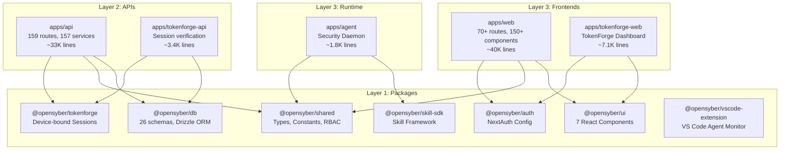
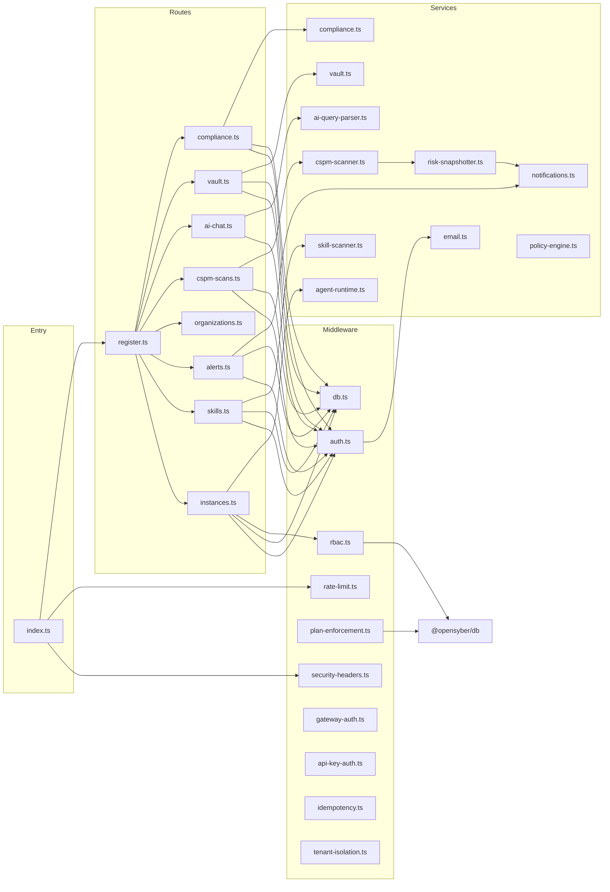
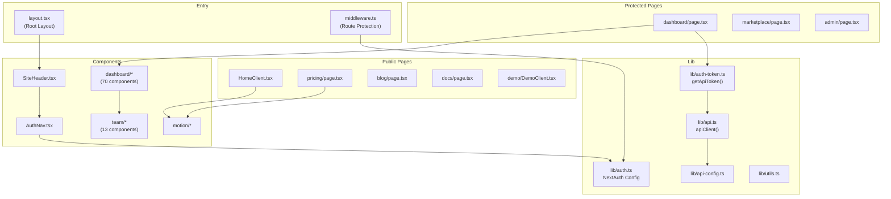

# OpenSyber Code Map

> Generated: 2026-03-29 | ~77,000 lines TypeScript | 8 packages, 7 apps

---

## Annotated File Tree

```
opensyber/                          # Monorepo root (pnpm + Turborepo)
├── apps/
│   ├── api/                        # CF Worker (Hono) — Main API
│   │   └── src/
│   │       ├── index.ts            # Entry: Hono app, middleware stack, cron handlers
│   │       ├── types.ts            # Env & Variables interfaces (CF bindings)
│   │       ├── auth/               # Auth primitives
│   │       │   ├── types.ts        # TokenPayload, AuthUser, OAuth2Config
│   │       │   ├── jwt.ts          # HMAC-SHA256 JWT create/verify/refresh
│   │       │   ├── oauth.ts        # Google + GitHub OAuth2 providers
│   │       │   └── middleware.ts   # requireAuth, requireRole, optionalAuth
│   │       ├── db/                 # Local DB layer
│   │       │   ├── schema.ts       # Drizzle tables (users, tokens, subscriptions, sessions)
│   │       │   ├── types.ts        # Row types (UserRow, TokenRow, etc.)
│   │       │   ├── client.ts       # createDB factory
│   │       │   └── queries.ts      # getUserById, createUser, getSubscription, etc.
│   │       ├── lib/                # Core utilities
│   │       │   ├── db.ts           # Drizzle + D1 factory
│   │       │   ├── sso-token.ts    # SSO JWT generation
│   │       │   ├── html-escape.ts  # XSS prevention
│   │       │   └── timing-safe.ts  # Timing-safe string comparison
│   │       ├── middleware/         # 13 middleware modules (~2,432 lines)
│   │       │   ├── auth.ts         # JWT verification + JIT user provisioning
│   │       │   ├── db.ts           # Drizzle DB injection into context
│   │       │   ├── rbac.ts         # requirePermission() + resolveOrgContext()
│   │       │   ├── security-headers.ts  # CSP, HSTS, X-Frame-Options
│   │       │   ├── rate-limit.ts   # Tier-based rate limiting (public/auth/agent/ai)
│   │       │   ├── admin.ts        # Admin role enforcement
│   │       │   ├── api-key-auth.ts # API key validation
│   │       │   ├── gateway-auth.ts # Gateway token verification
│   │       │   ├── idempotency.ts  # Request deduplication
│   │       │   ├── ingest-rate-limit.ts # Ingest-specific rate limits
│   │       │   ├── plan-enforcement.ts  # Subscription plan feature gates
│   │       │   ├── tenant-isolation.ts  # Multi-tenant KV scoping
│   │       │   └── webhook-resilience.ts # Webhook retry/resilience
│   │       ├── payment/            # LemonSqueezy integration
│   │       │   ├── types.ts        # Plan, PlanConfig, CheckoutSession, WebhookEvent
│   │       │   ├── plans.ts        # Free/Pro/Enterprise definitions
│   │       │   ├── provider.ts     # LemonSqueezy provider
│   │       │   └── webhook.ts      # Webhook handlers
│   │       ├── routes/             # 159 route modules
│   │       │   ├── register.ts     # Route aggregator (imports all route modules)
│   │       │   ├── health.ts       # GET /health
│   │       │   ├── instances.ts    # Instance CRUD
│   │       │   ├── instance-actions.ts  # Instance start/stop/restart
│   │       │   ├── instance-skills.ts   # Skill deployment
│   │       │   ├── skills.ts       # Skill registry
│   │       │   ├── agent.ts        # AI agent management
│   │       │   ├── alerts.ts       # Alert configuration
│   │       │   ├── organizations.ts # Org management
│   │       │   ├── org-invitations.ts # Invite flow
│   │       │   ├── sso-saml.ts     # SAML 2.0 SSO
│   │       │   ├── sso-oidc.ts     # OIDC SSO
│   │       │   ├── cloud-accounts.ts # Cloud provider integration
│   │       │   ├── cspm-scans.ts   # CSPM scan triggers
│   │       │   ├── vault.ts        # Secret management
│   │       │   ├── compliance.ts   # Compliance evaluation
│   │       │   ├── ai-chat.ts      # AI-powered chat
│   │       │   ├── ai-query.ts     # Natural language queries
│   │       │   ├── threats.ts      # Threat intelligence
│   │       │   ├── webhooks*.ts    # Webhook management
│   │       │   ├── admin-*.ts      # Admin endpoints (8 files)
│   │       │   ├── validation/     # Zod schema validators
│   │       │   └── ... (120+ more route files)
│   │       ├── services/           # 157 service modules (~18,000 lines)
│   │       │   ├── cspm-scanner.ts # Multi-cloud CSPM orchestration
│   │       │   ├── aws-scanner/    # AWS security checks
│   │       │   ├── gcp-scanner/    # GCP security checks
│   │       │   ├── azure-scanner/  # Azure security checks
│   │       │   ├── k8s-scanner/    # Kubernetes scanning
│   │       │   ├── risk-snapshotter.ts  # Daily risk scoring
│   │       │   ├── notifications.ts     # Multi-channel (Slack/Teams/PD/etc.)
│   │       │   ├── email.ts        # Resend email service
│   │       │   ├── agent-runtime.ts     # Agent instance lifecycle
│   │       │   ├── agent-registry.ts    # Agent inventory
│   │       │   ├── skill-scanner.ts     # Skill vulnerability scanning
│   │       │   ├── supply-chain-security.ts # Supply chain risk
│   │       │   ├── compliance.ts   # Compliance evaluation engine
│   │       │   ├── policy-engine.ts # Policy evaluation
│   │       │   ├── vault.ts        # Secret management service
│   │       │   ├── ai-query-parser.ts   # NL query parsing
│   │       │   ├── mcp-guardian.ts # MCP security oversight
│   │       │   ├── achievements.ts # Gamification/achievements
│   │       │   ├── health-cron.ts  # Instance health polling
│   │       │   ├── cron-handlers.ts # Scheduled job coordinator
│   │       │   ├── trial.ts        # Trial period management
│   │       │   └── ... (100+ more service files)
│   │       ├── utils/              # Shared utilities
│   │       │   ├── ensure-user.ts  # JIT user provisioning
│   │       │   ├── pagination.ts   # Cursor pagination
│   │       │   ├── encryption.ts   # AES encrypt/decrypt
│   │       │   ├── instance-access.ts # Access verification
│   │       │   ├── data-residency.ts  # Region enforcement
│   │       │   └── integration-sync.ts # Integration sync
│   │       ├── cron/               # Scheduled tasks
│   │       │   ├── scheduled-scan.ts # CSPM hourly scan
│   │       │   └── risk-snapshot.ts  # Risk snapshot scheduler
│   │       ├── durable-objects/
│   │       │   └── agent-instance.ts # CF DO for agent state
│   │       └── test/               # Test infrastructure
│   │           ├── setup.ts        # Test config
│   │           ├── helpers.ts      # Test utilities
│   │           └── mock-db.ts      # Mock database
│   │
│   ├── web/                        # Next.js 16 — OpenSyber Frontend (~40K lines)
│   │   └── src/
│   │       ├── middleware.ts       # NextAuth route protection
│   │       ├── app/
│   │       │   ├── layout.tsx      # Root layout (fonts, metadata, SessionProvider)
│   │       │   ├── page.tsx        # Homepage → HomeClient
│   │       │   ├── HomeClient.tsx  # 8-section homepage orchestration
│   │       │   ├── HeroSection.tsx # Landing hero
│   │       │   ├── HomeSections.tsx # TrustBar, Problem, Solution sections
│   │       │   ├── HomeFeatures.tsx # Pillars, Demo, HowItWorks sections
│   │       │   ├── SocialProofSection.tsx # Social proof
│   │       │   ├── EcosystemSection.tsx   # Ecosystem diagram
│   │       │   ├── HomeFooter.tsx  # Footer
│   │       │   ├── pricing/       # Pricing page + plans config
│   │       │   ├── blog/          # Blog pages (12+ articles)
│   │       │   ├── docs/          # Documentation (14+ sub-pages)
│   │       │   ├── demo/          # Interactive demo
│   │       │   ├── threats/       # Threat feed visualization
│   │       │   ├── security/      # Security page
│   │       │   ├── enterprise/    # Enterprise page
│   │       │   ├── compliance/    # Compliance page
│   │       │   ├── privacy/       # Privacy policy
│   │       │   ├── terms/         # Terms of service
│   │       │   ├── marketplace/   # Skill marketplace
│   │       │   │   ├── page.tsx   # Marketplace listing
│   │       │   │   ├── [slug]/page.tsx # Skill detail
│   │       │   │   └── bundles/   # Skill bundles
│   │       │   ├── dashboard/     # Protected dashboard
│   │       │   │   ├── page.tsx   # Main dashboard (metrics + shortcuts)
│   │       │   │   ├── AiChatWidget.tsx # AI chat overlay
│   │       │   │   ├── getting-started/ # Onboarding wizard
│   │       │   │   ├── security/  # Security sub-pages
│   │       │   │   ├── settings/  # Settings + API keys
│   │       │   │   ├── attack-paths/ # Attack graph visualization
│   │       │   │   ├── skills/    # Skill config wizard
│   │       │   │   ├── integrations/ # Integration setup
│   │       │   │   ├── marketplace/ # Dashboard marketplace view
│   │       │   │   ├── bundles/   # Bundle management
│   │       │   │   ├── logs/      # Audit logs
│   │       │   │   └── profile/   # User profile
│   │       │   ├── admin/         # Admin panel (9 pages)
│   │       │   │   ├── page.tsx   # Admin dashboard
│   │       │   │   ├── users/     # User management + [id] detail
│   │       │   │   ├── organizations/ # Org management
│   │       │   │   ├── instances/ # Instance oversight
│   │       │   │   ├── skills/    # Skill moderation
│   │       │   │   ├── events/    # Event logs
│   │       │   │   ├── metrics/   # Platform metrics
│   │       │   │   └── billing/   # Billing management
│   │       │   ├── sign-in/       # Auth pages
│   │       │   └── sign-up/
│   │       ├── components/        # 150+ React components
│   │       │   ├── SiteHeader.tsx  # Main navigation
│   │       │   ├── AuthNav.tsx    # Auth-aware navigation
│   │       │   ├── MobileNav.tsx  # Mobile drawer
│   │       │   ├── ShareButtons.tsx # Social sharing
│   │       │   ├── dashboard/     # 70 dashboard components
│   │       │   │   ├── DeployInstanceButton.tsx # Instance deploy
│   │       │   │   ├── RestartButton.tsx # Instance restart
│   │       │   │   ├── BadgeEmbed.tsx   # Embeddable badge
│   │       │   │   ├── Breadcrumbs.tsx  # Navigation breadcrumbs
│   │       │   │   ├── BundleCard.tsx   # Bundle display
│   │       │   │   ├── security/  # Export buttons, audit, reports
│   │       │   │   └── team/      # 13 team management components
│   │       │   ├── motion/        # Animation library
│   │       │   │   ├── CountUp.tsx     # Number animation
│   │       │   │   ├── FadeIn.tsx      # Fade animation
│   │       │   │   ├── StaggerChildren.tsx # Stagger animation
│   │       │   │   └── PricingGrid.tsx # Animated pricing
│   │       │   ├── score/         # Risk scoring display
│   │       │   ├── threats/       # Threat visualization
│   │       │   ├── marketplace/   # Marketplace components
│   │       │   └── admin/         # Admin components
│   │       ├── lib/               # Core utilities
│   │       │   ├── auth.ts        # NextAuth config (Google/GitHub/LinkedIn/MS)
│   │       │   ├── auth-token.ts  # getApiToken() from session
│   │       │   ├── api.ts         # Generic typed HTTP client
│   │       │   ├── api-config.ts  # API_BASE_URL
│   │       │   ├── utils.ts       # formatDate, cn()
│   │       │   ├── org-context.ts # Organization context provider
│   │       │   └── lemonsqueezy.ts # Payment integration
│   │       └── __tests__/         # React component tests
│   │
│   ├── agent/                     # Node.js Agent Daemon (~1,773 lines)
│   │   └── src/
│   │       ├── agent.ts           # Main event loop
│   │       ├── skills/            # Skill execution runtime
│   │       ├── transport/         # Gateway communication
│   │       └── monitors/          # Health/security/filesystem/network monitors
│   │
│   ├── tokenforge-api/            # CF Worker — TokenForge API (~3,416 lines)
│   │   └── src/
│   │       └── routes/
│   │           ├── verify.ts      # Session verification
│   │           ├── trust-score.ts # Device trust scoring
│   │           ├── tenant-keys.ts # Tenant key management
│   │           ├── tenant-keys-create.ts # Key creation
│   │           └── webhooks.ts    # Integration webhooks
│   │
│   ├── tokenforge-web/            # Next.js — TokenForge Dashboard (~7,110 lines)
│   │   └── src/
│   │       ├── app/
│   │       │   ├── layout.tsx     # Root layout
│   │       │   ├── LandingClient.tsx # Landing page orchestration
│   │       │   ├── dashboard/     # Client control panel
│   │       │   │   ├── page.tsx   # Dashboard
│   │       │   │   ├── proxy/     # Proxy configuration
│   │       │   │   └── DashboardEmptyState.tsx
│   │       │   ├── docs/          # API documentation
│   │       │   ├── sign-in/       # Auth
│   │       │   └── sign-up/
│   │       ├── components/
│   │       │   └── landing/       # Landing page sections
│   │       │       ├── HeroSection.tsx
│   │       │       ├── PricingSection.tsx
│   │       │       ├── TrustScoreSection.tsx
│   │       │       ├── AttackComparison.tsx
│   │       │       ├── EcosystemSection.tsx
│   │       │       └── FooterSection.tsx
│   │       └── lib/
│   │           └── auth.ts        # NextAuth config
│   │
│   ├── tokenforge-proxy/          # Reverse proxy for session protection
│   └── redirects/                 # URL redirect service
│
├── packages/
│   ├── db/                        # Drizzle ORM + D1 (~2,051 lines)
│   │   ├── src/
│   │   │   ├── schema/
│   │   │   │   ├── index.ts       # Re-exports all schemas
│   │   │   │   ├── bundles.ts     # Skill bundles schema
│   │   │   │   ├── costs.ts       # Cost tracking schema
│   │   │   │   ├── github.ts      # GitHub integration schema
│   │   │   │   ├── marketplace-v2.ts # Marketplace v2 schema
│   │   │   │   ├── mcp.ts         # MCP schema
│   │   │   │   ├── memory.ts      # Memory schema
│   │   │   │   └── nhi.ts         # Non-human identity schema
│   │   │   └── queries/           # Service layer queries
│   │   ├── migrations/            # 36 versioned SQL migrations
│   │   └── drizzle.config.ts
│   │
│   ├── shared/                    # Shared Types & Constants (~3,757 lines)
│   │   └── src/
│   │       ├── types/
│   │       │   └── user.ts        # Shared user interfaces
│   │       ├── constants/
│   │       │   └── plans.ts       # Plan definitions & limits
│   │       └── data/
│   │           ├── integrations-catalog.ts # Integration catalog
│   │           └── integrations/  # Per-integration data
│   │
│   ├── tokenforge/                # TokenForge SDK (~2,500 lines)
│   │   ├── client/                # Browser SDK (Web Crypto API)
│   │   ├── server/                # Framework-agnostic middleware
│   │   ├── adapters/              # Express, Next.js, Fastify, Hono
│   │   ├── storage/               # D1, Postgres, Redis backends
│   │   └── react/                 # React bindings
│   │
│   ├── ui/                        # Shared React Components
│   │   └── src/components/        # Button, Card, Badge, Table, MetricCard, etc.
│   │
│   ├── auth/                      # NextAuth Shared Config
│   │   └── src/                   # OAuth + JWT setup
│   │
│   ├── skill-sdk/                 # Skill Definition Framework
│   │   └── src/                   # Plugin architecture types
│   │
│   └── vscode-extension/          # VS Code Extension (~1,769 lines)
│       └── src/
│           └── reports/
│               ├── html-generator.ts  # Report HTML generation
│               ├── html-helpers.ts    # HTML utility functions
│               ├── html-styles.ts     # Report CSS styles
│               └── html-template.ts   # HTML template
│
└── docs/
    └── sprints/                   # Sprint planning documents
```

---

## Module Map: Exports & Consumers

### Layer 1: Packages (no app dependencies)

#### @opensyber/db
| Export | Type | Consumers |
|--------|------|-----------|
| `users`, `tokens`, `subscriptions`, `sessions` | Drizzle Tables | api/middleware, api/routes, api/services |
| `orgMembers`, `organizations` | Drizzle Tables | api/middleware/rbac, api/routes/organizations |
| `instances`, `agentStatus` | Drizzle Tables | api/services/agent-runtime, api/routes/instances |
| `skills`, `skillRuns` | Drizzle Tables | api/routes/skills, api/services/skill-scanner |
| `cloudAccounts`, `cspmFindings` | Drizzle Tables | api/services/cspm-scanner, api/routes/cspm-* |
| `integrationConnections` | Drizzle Tables | api/middleware/tenant-isolation, api/routes/integrations |
| `apiKeys` | Drizzle Tables | api/middleware/api-key-auth |
| `notificationChannels`, `alerts` | Drizzle Tables | api/services/notifications, api/routes/alerts |
| `auditLog` | Drizzle Table | api/services/audit-retention |
| `bundles` | Drizzle Tables | api/routes/bundles |
| `costs` | Drizzle Tables | api/services/cost-tracker |
| `nhi` | Drizzle Tables | api/services/nhi-manager |
| `mcp` | Drizzle Tables | api/services/mcp-guardian |

#### @opensyber/shared
| Export | Type | Consumers |
|--------|------|-----------|
| `hasPermission()` | Function | api/middleware/rbac |
| `PLAN_LIMITS`, `PLAN_INSTANCE_LIMITS` | Constants | api/middleware/plan-enforcement, api/routes/instances |
| `generateId()` | Function | api/routes/* (ID generation) |
| User types, Role enums | Types | api/*, web/* |
| Compliance frameworks (GDPR, HIPAA, NIST, PCI, SOC2) | Constants | api/services/compliance |
| Integration catalog | Data | web/dashboard/integrations |

#### @opensyber/tokenforge
| Export | Type | Consumers |
|--------|------|-----------|
| `TokenForgeClient` | Class | Browser SDK consumers |
| `createTokenForgeMiddleware()` | Function | api/index.ts (global middleware) |
| `HonoAdapter`, `ExpressAdapter`, etc. | Classes | tokenforge-api, api |
| React hooks | Functions | tokenforge-web |

#### @opensyber/ui
| Export | Type | Consumers |
|--------|------|-----------|
| `Button`, `Card`, `Badge`, `Table`, `MetricCard` | Components | web/*, tokenforge-web/* |

### Layer 2: Apps (depend on packages)

#### apps/api — Key Internal Exports
| Export | From | Consumers |
|--------|------|-----------|
| `authMiddleware` | middleware/auth.ts | routes/* (all protected routes) |
| `dbMiddleware` | middleware/db.ts | routes/* (all DB-accessing routes) |
| `requirePermission()` | middleware/rbac.ts | routes/* (write operations) |
| `rateLimitMiddleware()` | middleware/rate-limit.ts | index.ts, routes/* |
| `planEnforcementMiddleware` | middleware/plan-enforcement.ts | routes/* (gated features) |
| `registerRoutes()` | routes/register.ts | index.ts |
| `AgentInstance` | durable-objects/agent-instance.ts | index.ts (CF DO export) |
| `notificationService` | services/notifications.ts | routes/alerts.ts, services/* |
| `emailService` | services/email.ts | middleware/auth.ts, routes/* |
| `runCspmScan()` | services/cspm-scanner.ts | routes/cspm-scans.ts, cron/* |

#### apps/web — Key Internal Exports
| Export | From | Consumers |
|--------|------|-----------|
| `{ handlers, signIn, signOut, auth }` | lib/auth.ts | middleware.ts, API routes |
| `getApiToken()` | lib/auth-token.ts | All protected pages |
| `apiClient<T>()` | lib/api.ts | 100+ pages/components |
| `API_BASE_URL` | lib/api-config.ts | lib/api.ts |
| `SiteHeader` | components/SiteHeader.tsx | layout.tsx |
| `AuthNav`, `AuthCTA` | components/AuthNav.tsx | SiteHeader.tsx |
| `CountUp`, `FadeIn`, `StaggerChildren` | components/motion/ | Landing pages, pricing |

---

## Mermaid Dependency Graph

### Monorepo Layer Architecture



### API Internal Dependency Graph



### Web Frontend Dependency Graph



---

## Entry Points

### HTTP Entry Points

| App | Entry File | Exports | Runtime |
|-----|-----------|---------|---------|
| api | `apps/api/src/index.ts` | `default { fetch, scheduled }`, `AgentInstance` | CF Worker |
| web | `apps/web/src/middleware.ts` → `src/app/layout.tsx` | Next.js App Router | CF Pages |
| tokenforge-api | `apps/tokenforge-api/src/index.ts` | `default { fetch }` | CF Worker |
| tokenforge-web | `apps/tokenforge-web/src/app/layout.tsx` | Next.js App Router | CF Pages |

### Cron Entry Points (apps/api)

| Trigger | Handler | Purpose |
|---------|---------|---------|
| `0 * * * *` | `scheduled-scan.ts` | Hourly CSPM scans |
| `scheduled` | `recordScoreSnapshots()` | Daily risk snapshots |
| `scheduled` | `processTrialEmails()` | Trial expiration emails |
| `scheduled` | `pollInstanceHealth()` | Instance health checks |
| `scheduled` | `enforceAuditRetention()` | Audit log cleanup |
| `scheduled` | `runScheduledJobs()` | Generic job runner |
| `scheduled` | `processDlqRetries()` | Dead letter queue retries |

### Durable Object Entry Points

| Class | Routes | Purpose |
|-------|--------|---------|
| `AgentInstance` | `POST /start`, `GET /status`, `POST /restart`, `POST /stop`, `DELETE /` | Agent state management |

---

## Shared Utilities Index

### Cross-Package Utilities
| Utility | Package | Used By |
|---------|---------|---------|
| `generateId()` | @opensyber/shared | api (ID generation everywhere) |
| `hasPermission()` | @opensyber/shared | api/middleware/rbac |
| `PLAN_LIMITS` | @opensyber/shared | api/middleware/plan-enforcement |
| `cn()` | web/lib/utils | web/* (Tailwind class merging) |
| `formatDate()` | web/lib/utils | web/* (date display) |
| `apiClient<T>()` | web/lib/api | web/* (100+ consumers) |
| `getApiToken()` | web/lib/auth-token | web/* (all protected pages) |
| `escapeHtml()` | api/lib/html-escape | api/middleware/auth |
| `timingSafeCompare()` | api/lib/timing-safe | api/middleware/gateway-auth |
| `parseCursor()`, `buildNextCursor()` | api/utils/pagination | api/routes/* (paginated endpoints) |
| `encrypt()`, `decrypt()` | api/utils/encryption | api/routes/vault, api/services/* |
| `ensureUser()` | api/utils/ensure-user | api/middleware/auth (JIT provisioning) |

---

## Layer Diagram

```
┌──────────────────────────────────────────────────────────────────┐
│                     PRESENTATION LAYER                          │
│  apps/web (Next.js 16)          apps/tokenforge-web (Next.js)   │
│  ├── 70+ page routes            ├── Landing + Dashboard         │
│  ├── 150+ React components      ├── Proxy config UI             │
│  ├── NextAuth (4 OAuth)         └── Clerk auth                  │
│  └── Tailwind + Motion                                          │
├──────────────────────────────────────────────────────────────────┤
│                      API GATEWAY LAYER                          │
│  apps/api (Hono on CF Worker)   apps/tokenforge-api (Hono)      │
│  ├── 13 middleware modules      ├── Session verification        │
│  ├── Auth: JWT + API Key + GW   ├── Trust scoring               │
│  ├── RBAC + Plan enforcement    └── Tenant key management       │
│  └── Rate limiting (4 tiers)                                    │
├──────────────────────────────────────────────────────────────────┤
│                     BUSINESS LOGIC LAYER                        │
│  apps/api/services (157 modules)                                │
│  ├── Security: CSPM, Supply Chain, Skill Scanner, MCP Guardian  │
│  ├── Cloud: AWS/GCP/Azure/K8s scanners                          │
│  ├── Compliance: SOC2, GDPR, HIPAA, NIST, PCI, EU AI Act       │
│  ├── Agent: Runtime, Registry, Suspension, Health               │
│  ├── AI: Query Parser, Triage, Insights, Chat                   │
│  ├── Notifications: Email, Slack, Teams, PagerDuty, Discord     │
│  └── Billing: Trial, Plan enforcement, LemonSqueezy webhooks    │
├──────────────────────────────────────────────────────────────────┤
│                       DATA ACCESS LAYER                         │
│  packages/db (Drizzle ORM)                                      │
│  ├── 26 table schemas           │  36 SQL migrations            │
│  ├── Users, Orgs, Instances     │  Costs, Bundles, NHI          │
│  ├── Skills, Alerts, Policies   │  MCP, Memory, GitHub          │
│  └── Compliance, Audit, Cloud   │  Marketplace v2               │
├──────────────────────────────────────────────────────────────────┤
│                     RUNTIME / AGENT LAYER                       │
│  apps/agent (Node.js Daemon)                                    │
│  ├── Event loop + skill execution                               │
│  ├── Health/Security/FS/Network monitors                        │
│  └── Gateway transport (X-Gateway-Token)                        │
├──────────────────────────────────────────────────────────────────┤
│                     INFRASTRUCTURE LAYER                        │
│  Cloudflare Workers    │  Cloudflare D1 (SQLite)                │
│  Cloudflare KV         │  Cloudflare R2 (Object Storage)        │
│  Durable Objects       │  Hetzner Cloud (Agent VMs)             │
│  TokenForge (ECDSA)    │  Resend (Email)                        │
│  LemonSqueezy          │  Sentry (Error Tracking)               │
└──────────────────────────────────────────────────────────────────┘
```

---

## Circular Dependency Check

No circular dependencies detected in the monorepo layering:
- **Layer 1 (packages)**: `db`, `shared`, `ui`, `tokenforge`, `auth`, `skill-sdk` — no cross-dependencies between packages
- **Layer 2 (APIs)**: `api` and `tokenforge-api` depend on Layer 1, not on each other
- **Layer 3 (Frontends)**: `web` and `tokenforge-web` depend on Layer 1, not on Layer 2 directly (communicate via HTTP)
- **Runtime**: `agent` depends on `shared` and `skill-sdk` only

Within `apps/api`, the dependency flow is strictly:
```
index.ts → middleware/* → routes/* → services/* → @opensyber/db
```
No service imports from routes. No middleware imports from services (except email for welcome flow).

---

## Code Statistics

| Area | Files | Lines (approx) | Purpose |
|------|-------|-----------------|---------|
| apps/api | 316+ | ~33,000 | Main API (routes, services, middleware) |
| apps/web | 535+ | ~40,000 | Frontend (pages, components, lib) |
| apps/agent | 15+ | ~1,773 | Agent daemon |
| apps/tokenforge-api | 20+ | ~3,416 | TokenForge API |
| apps/tokenforge-web | 30+ | ~7,110 | TokenForge frontend |
| packages/db | 40+ | ~2,051 | Database schemas + migrations |
| packages/shared | 15+ | ~3,757 | Shared types + constants |
| packages/tokenforge | 25+ | ~2,500 | TokenForge SDK |
| packages/vscode-extension | 10+ | ~1,769 | VS Code extension |
| **Total** | **~1,000+** | **~77,000** | |

---

## API Route Summary (80+ endpoint groups)

| Category | Route Prefix | Routes | Auth |
|----------|-------------|--------|------|
| Health | `/health` | 1 | Public |
| Instances | `/api/instances/*` | 5+ | JWT + RBAC |
| Skills | `/api/skills/*` | 4+ | JWT |
| Agents | `/api/agent/*` | 6+ | JWT + RBAC |
| Security | `/api/security/*` | 8+ | JWT |
| Alerts | `/api/alerts/*` | 4+ | JWT |
| Compliance | `/api/compliance/*` | 4+ | JWT |
| Cloud | `/api/cloud-accounts/*` | 5+ | JWT + RBAC |
| CSPM | `/api/cspm/*` | 4+ | JWT |
| Vault | `/api/vault/*` | 4+ | JWT + RBAC |
| Organizations | `/api/organizations/*` | 6+ | JWT |
| SSO | `/api/sso/*` | 4+ | JWT + Admin |
| AI | `/api/ai/*` | 5+ | JWT |
| Threats | `/api/threats/*` | 2+ | Public |
| Integrations | `/api/integrations/*` | 6+ | JWT |
| Data Export | `/api/data-export/*` | 3+ | JWT + RBAC |
| Webhooks | `/webhooks/*` | 3+ | Webhook Secret |
| Admin | `/api/admin/*` | 8+ | JWT + Admin |
| Marketplace | `/api/marketplace/*` | 4+ | Mixed |
| Badges | `/api/badges/*` | 2+ | Public |
| Enterprise | `/api/enterprise/*` | 2+ | Public |

## Web Route Summary (70+ pages)

| Category | Path | Pages | Auth |
|----------|------|-------|------|
| Homepage | `/` | 1 | Public |
| Pricing | `/pricing` | 1 | Public |
| Blog | `/blog/*` | 12+ | Public |
| Docs | `/docs/*` | 14+ | Public |
| Demo | `/demo` | 1 | Public |
| Threats | `/threats` | 1 | Public |
| Auth | `/sign-in`, `/sign-up` | 2 | Public |
| Dashboard | `/dashboard/*` | 15+ | Protected |
| Marketplace | `/marketplace/*` | 3+ | Protected |
| Admin | `/admin/*` | 9 | Admin |
| Legal | `/privacy`, `/terms`, `/security`, `/compliance` | 4 | Public |
