# OpenSyber Flow Documentation

**Project**: OpenSyber
**Generated**: 2026-03-29
**Agent**: Luna Documentation Agent
**Source**: Traced from actual route handlers, middleware, services, and frontend components

---

## Table of Contents

1. [Flow Catalogue](#1-flow-catalogue)
2. [Mermaid Sequence Diagrams](#2-mermaid-sequence-diagrams)
3. [State Diagrams](#3-state-diagrams)
4. [Skills Registry](#4-skills-registry)
5. [Interaction Matrix](#5-interaction-matrix)
6. [Error Flow Diagrams](#6-error-flow-diagrams)
7. [Permission Map](#7-permission-map)

---

## 1. Flow Catalogue

### 1.1 Authentication & User Provisioning

#### Flow: Auth.js JWT Authentication
- **Entry Point**: Any authenticated API request with `Authorization: Bearer <token>`
- **File**: `apps/api/src/middleware/auth.ts`
- **Steps**:
  1. Extract Bearer token from Authorization header
  2. Decode JWT (base64url header + payload)
  3. Verify HMAC-SHA256 signature against `AUTH_SECRET`
  4. Check token expiration (`exp` claim)
  5. JIT user provisioning via `ensureUser(db, jwtUserId, email, name)`
  6. If new user and email available, fire non-blocking welcome email via Resend
  7. Set `userId` on Hono context
- **Exit Conditions**: 401 (missing token, invalid signature, expired) or proceed to next middleware
- **API Calls**: `POST https://api.resend.com/emails` (welcome email, non-blocking)

#### Flow: Gateway Token Authentication (Agent-to-API)
- **Entry Point**: Agent endpoints with `X-Gateway-Token` + `X-Instance-Id` headers
- **File**: `apps/api/src/middleware/gateway-auth.ts`
- **Steps**:
  1. Read `X-Gateway-Token` and `X-Instance-Id` headers
  2. Lookup stored token from KV: `CREDENTIAL_VAULT.get("gateway:{instanceId}")`
  3. Timing-safe comparison of provided token vs stored token
  4. Proceed to route handler or return 401
- **Exit Conditions**: 401 (missing headers, token mismatch) or proceed

#### Flow: SSO SAML Login
- **Entry Point**: `GET /api/sso/:orgSlug/saml/login`
- **File**: `apps/api/src/routes/sso-saml.ts`
- **Steps**:
  1. Resolve org by slug
  2. Load active SSO config for org (provider=saml)
  3. Build SAML AuthnRequest XML
  4. Base64-encode and redirect to IdP SSO URL
  5. IdP authenticates user, posts SAMLResponse to ACS
  6. `POST /api/sso/:orgSlug/saml/acs` receives assertion
  7. Verify XML signature against IdP certificate
  8. Extract email/name attributes
  9. Provision or find user (JIT if autoProvision enabled)
  10. Ensure org membership (auto-join with defaultRole)
  11. Generate session token via `generateSsoToken()`
  12. Redirect to `https://opensyber.cloud/dashboard?sso=success&org={slug}&token={token}`
- **Exit Conditions**: 404 (org/config not found), 401 (signature invalid), 403 (user not provisioned), redirect to dashboard
- **API Calls**: None external (IdP redirect is browser-driven)

#### Flow: SSO OIDC Login
- **Entry Point**: `GET /api/sso/:orgSlug/oidc/login`
- **File**: `apps/api/src/routes/sso-oidc.ts`
- **Steps**:
  1. Resolve org by slug
  2. Load active SSO config (provider=oidc)
  3. Discover OIDC endpoints from `{issuer}/.well-known/openid-configuration`
  4. Generate state, PKCE code_verifier, code_challenge
  5. Store state+verifier in KV with 5min TTL
  6. Build auth URL and redirect to IdP
  7. `GET /api/sso/:orgSlug/oidc/callback` receives code+state
  8. Validate state from KV (consume to prevent replay)
  9. Exchange authorization code for tokens (with PKCE verifier)
  10. Fetch userinfo from IdP
  11. Provision or find user
  12. Ensure org membership
  13. Generate session token, redirect to dashboard
- **Exit Conditions**: 400 (missing code/state, invalid state), 404 (config not found), 401 (no email), 403 (not provisioned)
- **API Calls**: OIDC discovery, token exchange, userinfo fetch

---

### 1.2 Organization & Team Management

#### Flow: Create Organization
- **Entry Point**: `POST /api/organizations`
- **File**: `apps/api/src/routes/organizations.ts`
- **Steps**:
  1. Authenticate user
  2. Validate input (name, optional slug) via Zod
  3. Generate slug from name if not provided
  4. Check slug uniqueness
  5. Create org record + owner membership in batch
  6. Return `{ id, name, slug }`
- **Exit Conditions**: 201 (created), 400 (invalid input), 409 (slug taken)
- **API Calls**: `POST /api/organizations`

#### Flow: Invite Team Member
- **Entry Point**: `POST /api/organizations/:orgId/invitations`
- **File**: `apps/api/src/routes/org-invitations.ts`
- **Permission**: `member.invite`
- **Steps**:
  1. Authenticate + verify RBAC permission
  2. Validate input (email, role) via Zod
  3. Check for existing pending invitation (prevent duplicates)
  4. Generate invitation token
  5. Set 7-day expiration
  6. Insert invitation record
  7. Send invitation email via `sendInvitationEmail()`
  8. Return `{ email, role, token }`
- **Exit Conditions**: 201 (sent), 400 (invalid), 409 (already pending)
- **API Calls**: `POST /api/organizations/:orgId/invitations`, Resend email API

#### Flow: Accept Invitation
- **Entry Point**: `POST /api/organizations/invitations/:token/accept`
- **File**: `apps/api/src/routes/org-invitations.ts`
- **Steps**:
  1. Authenticate user
  2. Lookup pending invitation by token
  3. Check expiration (mark expired if past date)
  4. Verify accepting user's email matches invitation email
  5. Create org membership record (batch with invitation status update)
  6. Set invitation status to "accepted"
  7. Return `{ orgId, role }`
- **Exit Conditions**: 200 (accepted), 404 (invalid token), 410 (expired), 403 (email mismatch)

#### Flow: Change Member Role
- **Entry Point**: `PATCH /api/organizations/:orgId/members/:memberId`
- **File**: `apps/api/src/routes/org-members.ts`
- **Permission**: `member.changeRole`
- **Steps**:
  1. Validate current user's role
  2. Prevent role escalation (cannot assign higher than own role)
  3. Prevent changing owner role
  4. Update member role
- **Exit Conditions**: 200 (updated), 403 (escalation/owner), 404 (not found)

#### Flow: Remove Member
- **Entry Point**: `DELETE /api/organizations/:orgId/members/:memberId`
- **Permission**: `member.remove`
- **Steps**:
  1. Verify target member exists
  2. Prevent removing org owner
  3. Set member status to "removed"
- **Exit Conditions**: 200 (removed), 403 (cannot remove owner), 404 (not found)

#### Flow: Transfer Ownership
- **Entry Point**: `POST /api/organizations/:orgId/members/:memberId/transfer`
- **Permission**: `org.delete` (owner only)
- **Steps**:
  1. Verify target is active member
  2. Batch: promote target to owner, demote current owner to admin, update org ownerId
- **Exit Conditions**: 200 (transferred), 404 (target not found)

#### Flow: Cancel Invitation
- **Entry Point**: `DELETE /api/organizations/:orgId/invitations/:invitationId`
- **Permission**: `member.invite`
- **Steps**:
  1. Set invitation status to "cancelled"
- **Exit Conditions**: 200 (cancelled)

---

### 1.3 Instance (Agent) Lifecycle

#### Flow: Create Instance (Deploy Agent)
- **Entry Point**: `POST /api/instances`
- **File**: `apps/api/src/routes/instances.ts`
- **Permission**: `instance.create`
- **Steps**:
  1. Authenticate + RBAC check
  2. Validate input (name, region) via Zod
  3. Lookup user plan and instance limit
  4. Enforce plan instance limit
  5. Enforce data residency (if org has region restrictions)
  6. Insert instance record (status: "provisioning")
  7. Generate gateway token
  8. Call `agentRuntime.createInstance()` with DO namespace
  9. Store gateway token in `CREDENTIAL_VAULT` KV
  10. Encrypt and persist gateway token in DB
  11. Update instance status to "running"
  12. Send deploy email (first time only, via emailFlags)
  13. Return instance with containerId and hostname
- **Error Path**: If container creation fails, set status to "error", return 500
- **Exit Conditions**: 201 (created), 400 (invalid), 403 (limit/residency), 404 (user not found), 500 (provisioning failed)
- **API Calls**: `POST /api/instances`, Durable Object for agent runtime

#### Flow: Restart Instance
- **Entry Point**: `POST /api/instances/:id/restart`
- **File**: `apps/api/src/routes/instance-actions.ts`
- **Permission**: `instance.restart`
- **Steps**:
  1. Verify instance access (ownership/org)
  2. Check instance has containerId
  3. Call `agentRuntime.restartInstance()`
- **Exit Conditions**: 200 (restart initiated), 400 (not provisioned), 404 (not found)

#### Flow: Delete Instance
- **Entry Point**: `DELETE /api/instances/:id`
- **File**: `apps/api/src/routes/instance-actions.ts`
- **Permission**: `instance.delete`
- **Steps**:
  1. Verify instance access
  2. Set status to "destroying"
  3. Call `agentRuntime.deleteInstance()` if containerId exists
  4. Delete gateway token from KV
  5. Return success
- **Error Path**: If container delete fails, set status to "error"
- **Exit Conditions**: 200 (initiated), 404 (not found), 500 (delete failed)

#### Flow: Agent Health Heartbeat
- **Entry Point**: `POST /webhooks/agent/health`
- **File**: `apps/api/src/routes/webhooks-agent-health.ts`
- **Auth**: Gateway token (X-Gateway-Token + X-Instance-Id)
- **Steps**:
  1. Gateway auth middleware validates token
  2. Verify instanceId in body matches header
  3. Update instance status (running/error based on engineRunning flag)
  4. Update agentVersion, engineVersion, lastHealthCheck
  5. Cache health data in KV (5min TTL)
  6. Query active skill installations
  7. Return desired skills list (for reconciliation)
- **Exit Conditions**: 200 (received), 403 (ID mismatch)

#### Flow: Agent Provisioned Webhook
- **Entry Point**: `POST /webhooks/agent/provisioned`
- **File**: `apps/api/src/routes/webhooks-agent-provisioned.ts`
- **Auth**: Gateway token
- **Steps**:
  1. Validate gateway token
  2. Verify instanceId matches
  3. Set instance status to "running"
- **Exit Conditions**: 200 (status updated)

---

### 1.4 Skill Marketplace

#### Flow: Browse Marketplace
- **Entry Point**: `GET /api/marketplace`
- **File**: `apps/api/src/routes/marketplace-browse.ts`
- **Permission**: `marketplace.browse`
- **Steps**:
  1. Query skills with status "approved"
  2. Filter by optional query, category, tier
  3. Order by install count (desc)
  4. Return paginated results (max 50)
- **Exit Conditions**: 200 (results)

#### Flow: View Skill Detail
- **Entry Point**: `GET /api/marketplace/:id` or `GET /api/skills/:slug`
- **Files**: `marketplace-browse.ts`, `skills.ts`
- **Steps**: Look up skill by ID or slug, return full metadata
- **Exit Conditions**: 200 (skill), 404 (not found)

#### Flow: Install Skill on Instance
- **Entry Point**: `POST /api/instances/:id/skills` or `POST /api/marketplace/:id/install`
- **Files**: `instance-skills.ts`, `marketplace-install.ts`
- **Permission**: `skill.install` or `marketplace.install`
- **Steps**:
  1. Verify instance access
  2. Verify skill exists
  3. Check plan skill limit (`checkSkillLimit()`)
  4. Check unverified skill allowance (`checkUnverifiedSkillAllowed()`)
  5. Create skill installation record
  6. Increment skill install count
- **Exit Conditions**: 201 (installed), 403 (plan limit/restriction), 404 (not found)

#### Flow: Uninstall Skill
- **Entry Point**: `DELETE /api/instances/:id/skills/:skillId`
- **Permission**: `skill.uninstall`
- **Steps**:
  1. Verify instance access
  2. Verify installation exists
  3. Delete installation record
- **Exit Conditions**: 200 (uninstalled), 404 (not found/not installed)

#### Flow: Publish Skill
- **Entry Point**: `POST /api/marketplace/publish`
- **File**: `apps/api/src/routes/marketplace-publish.ts`
- **Permission**: `marketplace.publish`
- **Steps**:
  1. Validate required fields (name, slug, category, version)
  2. Create skill record (status: "pending")
  3. Create skill version record (status: "draft")
  4. Create marketplace submission record (status: "pending")
- **Exit Conditions**: 201 (submitted), 400 (missing fields)

#### Flow: Submit Skill (Legacy)
- **Entry Point**: `POST /api/skills/submit`
- **File**: `apps/api/src/routes/skills.ts`
- **Steps**:
  1. Validate input via Zod
  2. Check slug uniqueness
  3. Insert skill (status: "pending")
- **Exit Conditions**: 201 (created), 400 (invalid), 409 (slug exists)

---

### 1.5 Skill Bundles

#### Flow: Browse Bundles
- **Entry Point**: `GET /api/bundles`
- **File**: `apps/api/src/routes/bundles.ts`
- **Permission**: `marketplace.browse`
- **Steps**:
  1. Query active bundles ordered by sortOrder
  2. Join bundle skills with skill metadata
  3. Check user's active subscriptions
  4. Return bundles with skills and subscription status

#### Flow: Activate Bundle
- **Entry Point**: `POST /api/bundles/:id/activate`
- **Permission**: `marketplace.browse`
- **Steps**:
  1. Verify bundle exists and is active
  2. Check for existing active subscription (return it if found)
  3. Free bundles: create subscription immediately
  4. Paid bundles: create subscription (checkout placeholder)
- **Exit Conditions**: 200 (already active), 200 (activated), 404 (not found)

---

### 1.6 Billing & Subscription

#### Flow: Subscription Created (Webhook)
- **Entry Point**: `POST /webhooks/lemonsqueezy` (event: `subscription_created`)
- **File**: `apps/api/src/routes/webhooks-lemonsqueezy.ts`
- **Steps**:
  1. Verify HMAC-SHA256 signature using `LEMONSQUEEZY_WEBHOOK_SECRET`
  2. Parse event and extract user_id from custom_data
  3. Map variant_id to plan (personal/pro/team) via environment variables
  4. Update user record: customerId, subscriptionId, plan
  5. If user has referrer, increment referrer's referralCredits
- **Exit Conditions**: 200 (processed), 401 (invalid signature)

#### Flow: Subscription Updated (Webhook)
- **Entry Point**: `POST /webhooks/lemonsqueezy` (event: `subscription_updated`)
- **Steps**:
  1. Find user by LemonSqueezy customerId
  2. Map new variant to plan
  3. Update user plan and subscriptionId

#### Flow: Subscription Cancelled/Expired (Webhook)
- **Entry Point**: `POST /webhooks/lemonsqueezy` (events: `subscription_cancelled`, `subscription_expired`)
- **Steps**:
  1. Find user by customerId
  2. Check grace period (if active, defer suspension)
  3. Downgrade to free plan, clear subscription data
  4. If user has more instances than free limit, suspend excess (oldest kept)

#### Flow: Payment Failed (Webhook)
- **Entry Point**: `POST /webhooks/lemonsqueezy` (event: `subscription_payment_failed`)
- **Steps**:
  1. Find user by customerId
  2. Set 3-day grace period (`paymentGraceUntil`)
  3. Send payment failed email via Resend

---

### 1.7 Alert & Notification System

#### Flow: Create Alert Rule
- **Entry Point**: `POST /api/security/instances/:instanceId/alert-rules`
- **File**: `apps/api/src/routes/alerts.ts`
- **Permission**: `alert.create`
- **Steps**:
  1. Verify instance access
  2. Validate input (name, eventType, threshold, windowMinutes, cooldownMinutes)
  3. Create alert rule record (isActive: true)
- **Exit Conditions**: 201 (created), 400 (invalid), 404 (instance not found)

#### Flow: Acknowledge/Resolve Alert
- **Entry Point**: `PATCH /api/security/instances/:instanceId/alerts/:id`
- **Permission**: `alert.update`
- **Steps**:
  1. Verify instance access
  2. Verify alert exists
  3. Update status to "acknowledged" or "resolved"
  4. Set acknowledgedAt or resolvedAt timestamp

#### Flow: Create Notification Channel
- **Entry Point**: `POST /api/security/user/notification-channels`
- **File**: `apps/api/src/routes/notification-channels.ts`
- **Steps**:
  1. Validate input (channelType: slack/email/pagerduty/discord/teams/opsgenie, name, config)
  2. Create channel record (isActive: true)
- **Supported Channel Types**: Slack, Email, PagerDuty, Discord, Teams, OpsGenie

---

### 1.8 Security Dashboard

#### Flow: View Security Dashboard
- **Entry Point**: `GET /api/security/instances/:instanceId/dashboard`
- **File**: `apps/api/src/routes/security-dashboard.ts`
- **Steps**:
  1. Verify instance access
  2. Query recent security events (last 50)
  3. Count skill installations (verified/unverified/blocked)
  4. Count active policies, alert rules, open alerts, open incidents
  5. Query vulnerability summary (critical/high/medium/low)
  6. Count file baselines
  7. Calculate composite security score
  8. Return dashboard data
- **Return Data**: score, recentEvents, installedSkills, openAlerts, openIncidents, vulnerabilitySummary, lastScan

---

### 1.9 Credential Vault

#### Flow: Store Secret
- **Entry Point**: `POST /api/instances/:id/secrets`
- **Permission**: `vault.write`
- **Steps**:
  1. Verify instance access
  2. Validate key/value via Zod
  3. Encrypt value using ENCRYPTION_KEY
  4. Store in DB
- **Exit Conditions**: 201 (stored), 404 (instance not found)

#### Flow: Agent Retrieve Secrets
- **Entry Point**: `GET /api/agent/instances/:id/secrets`
- **Auth**: Gateway token
- **Steps**:
  1. Validate gateway token
  2. Verify requesting instance matches target instance
  3. Decrypt and return all secrets

---

### 1.10 NHI (Non-Human Identity) Manager

#### Flow: Register Agent Identity
- **Entry Point**: `POST /api/nhi/agents`
- **File**: `apps/api/src/routes/nhi.ts`
- **Steps**:
  1. Validate input (name, type, metadata) via Zod
  2. Create NHI agent with risk score calculation
  3. Store in memory (in-memory for now, D1 in production)
- **Exit Conditions**: 201 (registered)

#### Flow: Suspend Agent Identity
- **Entry Point**: `POST /api/nhi/agents/:id/suspend`
- **Steps**:
  1. Find agent, verify ownership
  2. Set status to "suspended"
  3. Revoke token (set tokenHash to null)

#### Flow: Detect Orphaned Agents
- **Entry Point**: `GET /api/nhi/agents/orphaned`
- **Steps**: Filter agents where `isOrphaned()` returns true

---

### 1.11 MCP Guardian

#### Flow: Scan MCP Configuration
- **Entry Point**: `POST /api/mcp/guardian/scan`
- **File**: `apps/api/src/routes/mcp-guardian.ts`
- **Steps**:
  1. Validate MCP config JSON via Zod
  2. Run `scanMCPConfig()` — analyzes for security findings
  3. Auto-quarantine if critical findings detected
  4. Store server record with findings
  5. Return findings with severity breakdown
- **Exit Conditions**: 200 (findings returned)

#### Flow: Quarantine MCP Server
- **Entry Point**: `POST /api/mcp/guardian/servers/:id/quarantine`
- **Steps**:
  1. Verify ownership
  2. Set status to "quarantined"
  3. Record quarantine reason

---

### 1.12 Cost Bomb Protection

#### Flow: Ingest Cost Event
- **Entry Point**: `POST /api/costs/ingest`
- **File**: `apps/api/src/routes/costs.ts`
- **Steps**:
  1. Validate input (agentId, sessionId, provider, model, tokens)
  2. Calculate cost in USD
  3. Store event
- **Exit Conditions**: 201 (ingested)

#### Flow: Create Budget Rule
- **Entry Point**: `POST /api/costs/budgets`
- **Steps**:
  1. Validate input (scope: daily/monthly, limitUsd, optional agentId)
  2. Store budget rule

#### Flow: Check Spend Summary
- **Entry Point**: `GET /api/costs/summary`
- **Steps**:
  1. Aggregate today's and monthly spend
  2. Check all budget rules against current spend
  3. Return summary with budget alerts

---

### 1.13 Agent Activity Monitoring

#### Flow: Sync Agent Activity (VS Code Extension)
- **Entry Point**: `POST /api/agents/activity/sync`
- **File**: `apps/api/src/routes/agent-monitor.ts`
- **Plan Gated**: Requires `cloudSync` feature
- **Steps**:
  1. Validate event batch via Zod
  2. Check plan's retention window (reject events outside window)
  3. Enforce agent limit per plan
  4. Insert events (on conflict do nothing)
  5. Evaluate against org policies (if org context)
  6. Trigger async asset discovery
  7. Return synced count + violation count
- **Exit Conditions**: 201 (synced), 400 (invalid/outside retention), 403 (agent limit)

---

### 1.14 SSO Configuration

#### Flow: Configure SSO
- **Entry Point**: `PUT /api/organizations/:orgId/sso`
- **File**: `apps/api/src/routes/sso-config.ts`
- **Permission**: `org.update`
- **Steps**:
  1. Validate config (provider: saml/oidc, relevant fields)
  2. Encrypt OIDC client secret if provided
  3. Upsert SSO config record
- **Exit Conditions**: 200 (updated), 201 (created)

#### Flow: Test SSO Connection
- **Entry Point**: `POST /api/organizations/:orgId/sso/test`
- **Steps**:
  1. For OIDC: fetch `.well-known/openid-configuration`
  2. For SAML: verify configuration is present
  3. Return success/failure

---

### 1.15 Data Export (GDPR)

#### Flow: Export Data
- **Entry Point**: `GET /api/export/{agents|findings|compliance|assets}`
- **File**: `apps/api/src/routes/data-export.ts`
- **Permission**: `audit.export`
- **Steps**:
  1. Parse format (JSON/CSV), limit, date range
  2. Query scoped data (user or org)
  3. Format and return with content-type header

---

### 1.16 Onboarding

#### Flow: Check Onboarding Progress
- **Entry Point**: `GET /api/user/onboarding`
- **File**: `apps/api/src/routes/user.ts`
- **Steps**:
  1. Check if user has deployed an instance
  2. Check if user has installed a skill
  3. Check if user has created an alert rule
  4. Check if user has stored a secret
  5. Check manual steps (reviewSecurity, inviteTeamMember)
  6. Return progress object
- **Onboarding Steps**: deployAgent, installSkill, setupAlertRule, storeSecret, reviewSecurity, inviteTeamMember

#### Flow: Complete/Dismiss Onboarding
- **Entry Point**: `PATCH /api/user/onboarding`
- **Steps**:
  1. If dismiss: set onboardingCompletedAt
  2. If step: update onboardingProgress JSON

---

## 2. Mermaid Sequence Diagrams

### 2.1 User Signup to First Agent Deploy

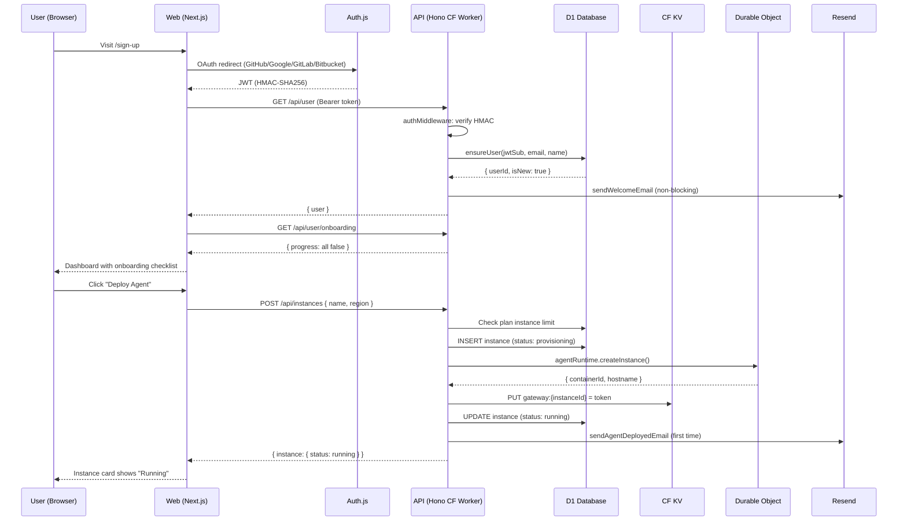
```mermaid
sequenceDiagram
    participant U as User (Browser)
    participant W as Web (Next.js)
    participant A as Auth.js
    participant API as API (Hono CF Worker)
    participant DB as D1 Database
    participant KV as CF KV
    participant DO as Durable Object
    participant R as Resend

    U->>W: Visit /sign-up
    W->>A: OAuth redirect (GitHub/Google/GitLab/Bitbucket)
    A-->>W: JWT (HMAC-SHA256)
    W->>API: GET /api/user (Bearer token)
    API->>API: authMiddleware: verify HMAC
    API->>DB: ensureUser(jwtSub, email, name)
    DB-->>API: { userId, isNew: true }
    API->>R: sendWelcomeEmail (non-blocking)
    API-->>W: { user }
    W->>API: GET /api/user/onboarding
    API-->>W: { progress: all false }
    W-->>U: Dashboard with onboarding checklist

    U->>W: Click "Deploy Agent"
    W->>API: POST /api/instances { name, region }
    API->>DB: Check plan instance limit
    API->>DB: INSERT instance (status: provisioning)
    API->>DO: agentRuntime.createInstance()
    DO-->>API: { containerId, hostname }
    API->>KV: PUT gateway:{instanceId} = token
    API->>DB: UPDATE instance (status: running)
    API->>R: sendAgentDeployedEmail (first time)
    API-->>W: { instance: { status: running } }
    W-->>U: Instance card shows "Running"
```

### 2.2 Skill Marketplace: Browse, Install, Configure

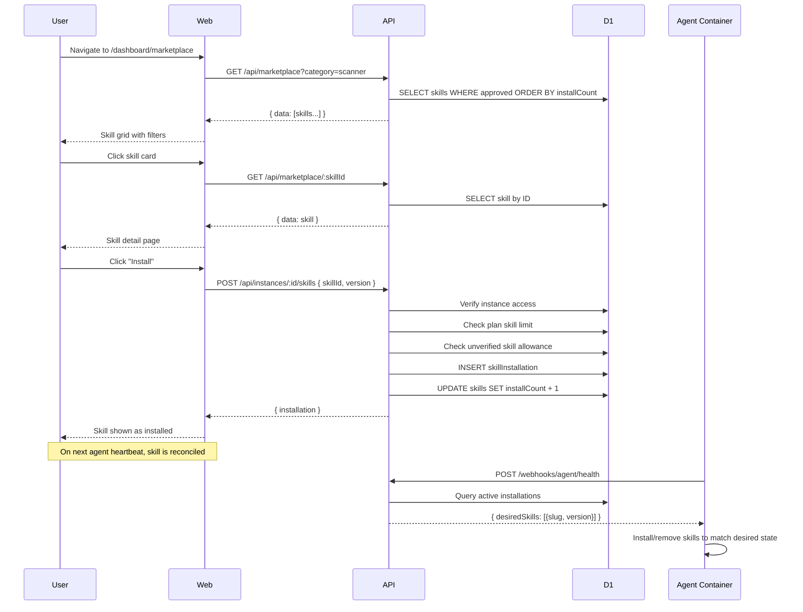
```mermaid
sequenceDiagram
    participant U as User
    participant W as Web
    participant API as API
    participant DB as D1

    U->>W: Navigate to /dashboard/marketplace
    W->>API: GET /api/marketplace?category=scanner
    API->>DB: SELECT skills WHERE approved ORDER BY installCount
    API-->>W: { data: [skills...] }
    W-->>U: Skill grid with filters

    U->>W: Click skill card
    W->>API: GET /api/marketplace/:skillId
    API->>DB: SELECT skill by ID
    API-->>W: { data: skill }
    W-->>U: Skill detail page

    U->>W: Click "Install"
    W->>API: POST /api/instances/:id/skills { skillId, version }
    API->>DB: Verify instance access
    API->>DB: Check plan skill limit
    API->>DB: Check unverified skill allowance
    API->>DB: INSERT skillInstallation
    API->>DB: UPDATE skills SET installCount + 1
    API-->>W: { installation }
    W-->>U: Skill shown as installed

    Note over U,W: On next agent heartbeat, skill is reconciled

    participant AG as Agent Container
    AG->>API: POST /webhooks/agent/health
    API->>DB: Query active installations
    API-->>AG: { desiredSkills: [{slug, version}] }
    AG->>AG: Install/remove skills to match desired state
```

### 2.3 Alert Creation, Trigger, and Notification

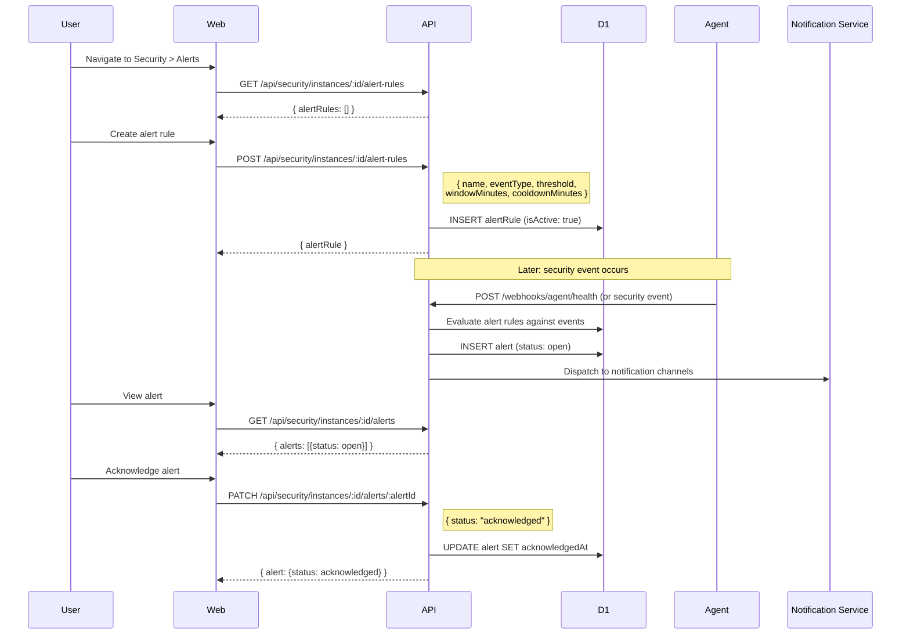
```mermaid
sequenceDiagram
    participant U as User
    participant W as Web
    participant API as API
    participant DB as D1
    participant AG as Agent
    participant NS as Notification Service

    U->>W: Navigate to Security > Alerts
    W->>API: GET /api/security/instances/:id/alert-rules
    API-->>W: { alertRules: [] }

    U->>W: Create alert rule
    W->>API: POST /api/security/instances/:id/alert-rules
    Note right of API: { name, eventType, threshold,<br/>windowMinutes, cooldownMinutes }
    API->>DB: INSERT alertRule (isActive: true)
    API-->>W: { alertRule }

    Note over AG,API: Later: security event occurs
    AG->>API: POST /webhooks/agent/health (or security event)
    API->>DB: Evaluate alert rules against events
    API->>DB: INSERT alert (status: open)
    API->>NS: Dispatch to notification channels

    U->>W: View alert
    W->>API: GET /api/security/instances/:id/alerts
    API-->>W: { alerts: [{status: open}] }

    U->>W: Acknowledge alert
    W->>API: PATCH /api/security/instances/:id/alerts/:alertId
    Note right of API: { status: "acknowledged" }
    API->>DB: UPDATE alert SET acknowledgedAt
    API-->>W: { alert: {status: acknowledged} }
```

### 2.4 Team Invite, Accept, RBAC Enforcement

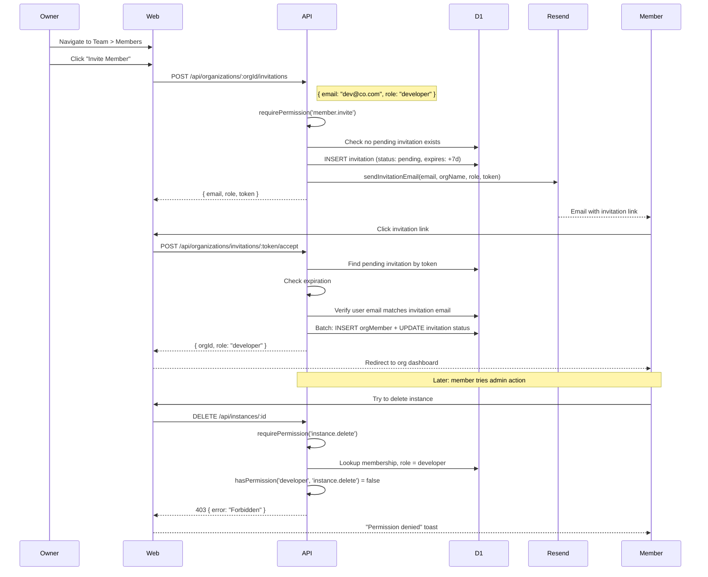
```mermaid
sequenceDiagram
    participant O as Owner
    participant W as Web
    participant API as API
    participant DB as D1
    participant R as Resend
    participant M as Member

    O->>W: Navigate to Team > Members
    O->>W: Click "Invite Member"
    W->>API: POST /api/organizations/:orgId/invitations
    Note right of API: { email: "dev@co.com", role: "developer" }
    API->>API: requirePermission('member.invite')
    API->>DB: Check no pending invitation exists
    API->>DB: INSERT invitation (status: pending, expires: +7d)
    API->>R: sendInvitationEmail(email, orgName, role, token)
    API-->>W: { email, role, token }

    R-->>M: Email with invitation link

    M->>W: Click invitation link
    W->>API: POST /api/organizations/invitations/:token/accept
    API->>DB: Find pending invitation by token
    API->>API: Check expiration
    API->>DB: Verify user email matches invitation email
    API->>DB: Batch: INSERT orgMember + UPDATE invitation status
    API-->>W: { orgId, role: "developer" }
    W-->>M: Redirect to org dashboard

    Note over M,API: Later: member tries admin action
    M->>W: Try to delete instance
    W->>API: DELETE /api/instances/:id
    API->>API: requirePermission('instance.delete')
    API->>DB: Lookup membership, role = developer
    API->>API: hasPermission('developer', 'instance.delete') = false
    API-->>W: 403 { error: "Forbidden" }
    W-->>M: "Permission denied" toast
```

### 2.5 Billing Upgrade via LemonSqueezy

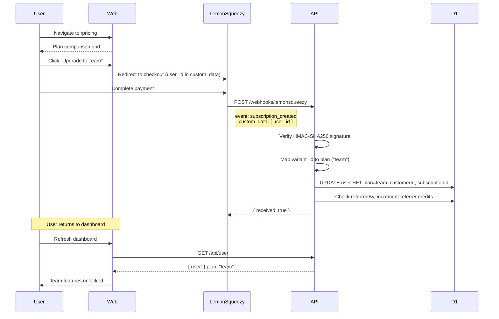
```mermaid
sequenceDiagram
    participant U as User
    participant W as Web
    participant LS as LemonSqueezy
    participant API as API
    participant DB as D1

    U->>W: Navigate to /pricing
    W-->>U: Plan comparison grid

    U->>W: Click "Upgrade to Team"
    W->>LS: Redirect to checkout (user_id in custom_data)
    U->>LS: Complete payment
    LS->>API: POST /webhooks/lemonsqueezy
    Note right of LS: event: subscription_created<br/>custom_data: { user_id }

    API->>API: Verify HMAC-SHA256 signature
    API->>API: Map variant_id to plan ("team")
    API->>DB: UPDATE user SET plan=team, customerId, subscriptionId
    API->>DB: Check referredBy, increment referrer credits
    API-->>LS: { received: true }

    Note over U,W: User returns to dashboard
    U->>W: Refresh dashboard
    W->>API: GET /api/user
    API-->>W: { user: { plan: "team" } }
    W-->>U: Team features unlocked
```

### 2.6 Agent Deploy, Heartbeat, and Monitoring

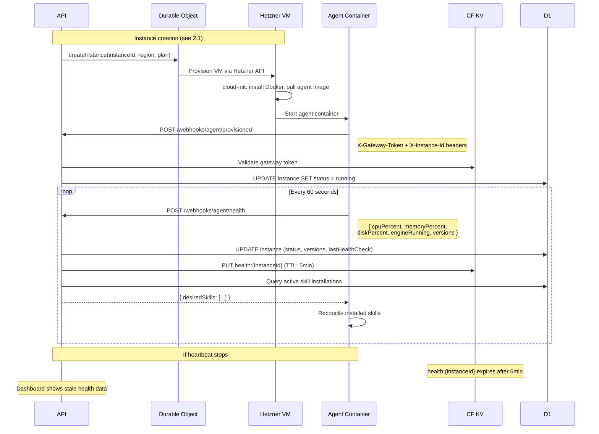
```mermaid
sequenceDiagram
    participant API as API
    participant DO as Durable Object
    participant VM as Hetzner VM
    participant AG as Agent Container
    participant KV as CF KV
    participant DB as D1

    Note over API,VM: Instance creation (see 2.1)
    API->>DO: createInstance(instanceId, region, plan)
    DO->>VM: Provision VM via Hetzner API
    VM->>VM: cloud-init: install Docker, pull agent image
    VM->>AG: Start agent container

    AG->>API: POST /webhooks/agent/provisioned
    Note right of AG: X-Gateway-Token + X-Instance-Id headers
    API->>KV: Validate gateway token
    API->>DB: UPDATE instance SET status = running

    loop Every 60 seconds
        AG->>API: POST /webhooks/agent/health
        Note right of AG: { cpuPercent, memoryPercent,<br/>diskPercent, engineRunning, versions }
        API->>DB: UPDATE instance (status, versions, lastHealthCheck)
        API->>KV: PUT health:{instanceId} (TTL: 5min)
        API->>DB: Query active skill installations
        API-->>AG: { desiredSkills: [...] }
        AG->>AG: Reconcile installed skills
    end

    Note over AG,API: If heartbeat stops
    Note over KV: health:{instanceId} expires after 5min
    Note over API: Dashboard shows stale health data
```

### 2.7 SSO SAML Authentication Flow

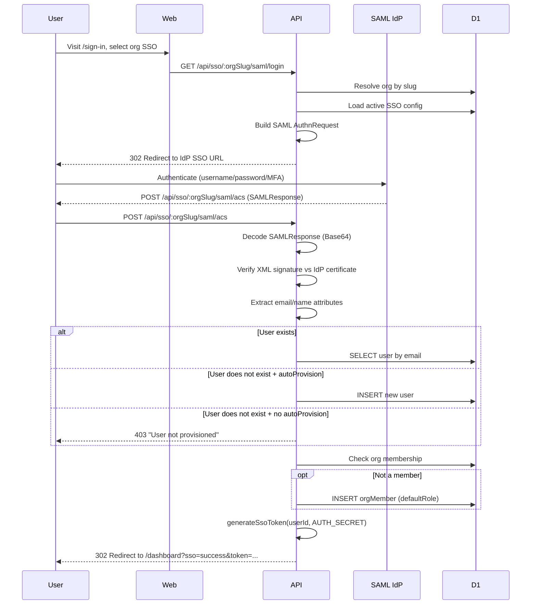
```mermaid
sequenceDiagram
    participant U as User
    participant W as Web
    participant API as API
    participant IdP as SAML IdP
    participant DB as D1

    U->>W: Visit /sign-in, select org SSO
    W->>API: GET /api/sso/:orgSlug/saml/login
    API->>DB: Resolve org by slug
    API->>DB: Load active SSO config
    API->>API: Build SAML AuthnRequest
    API-->>U: 302 Redirect to IdP SSO URL

    U->>IdP: Authenticate (username/password/MFA)
    IdP-->>U: POST /api/sso/:orgSlug/saml/acs (SAMLResponse)

    U->>API: POST /api/sso/:orgSlug/saml/acs
    API->>API: Decode SAMLResponse (Base64)
    API->>API: Verify XML signature vs IdP certificate
    API->>API: Extract email/name attributes

    alt User exists
        API->>DB: SELECT user by email
    else User does not exist + autoProvision
        API->>DB: INSERT new user
    else User does not exist + no autoProvision
        API-->>U: 403 "User not provisioned"
    end

    API->>DB: Check org membership
    opt Not a member
        API->>DB: INSERT orgMember (defaultRole)
    end

    API->>API: generateSsoToken(userId, AUTH_SECRET)
    API-->>U: 302 Redirect to /dashboard?sso=success&token=...
```

### 2.8 SSO OIDC Authentication Flow (with PKCE)

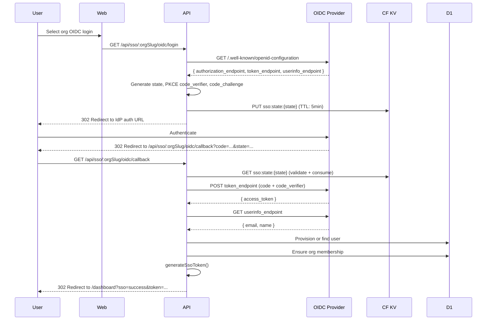
```mermaid
sequenceDiagram
    participant U as User
    participant W as Web
    participant API as API
    participant IdP as OIDC Provider
    participant KV as CF KV
    participant DB as D1

    U->>W: Select org OIDC login
    W->>API: GET /api/sso/:orgSlug/oidc/login
    API->>IdP: GET /.well-known/openid-configuration
    IdP-->>API: { authorization_endpoint, token_endpoint, userinfo_endpoint }
    API->>API: Generate state, PKCE code_verifier, code_challenge
    API->>KV: PUT sso:state:{state} (TTL: 5min)
    API-->>U: 302 Redirect to IdP auth URL

    U->>IdP: Authenticate
    IdP-->>U: 302 Redirect to /api/sso/:orgSlug/oidc/callback?code=...&state=...

    U->>API: GET /api/sso/:orgSlug/oidc/callback
    API->>KV: GET sso:state:{state} (validate + consume)
    API->>IdP: POST token_endpoint (code + code_verifier)
    IdP-->>API: { access_token }
    API->>IdP: GET userinfo_endpoint
    IdP-->>API: { email, name }

    API->>DB: Provision or find user
    API->>DB: Ensure org membership
    API->>API: generateSsoToken()
    API-->>U: 302 Redirect to /dashboard?sso=success&token=...
```

---

## 3. State Diagrams

### 3.1 Instance (Agent) Lifecycle

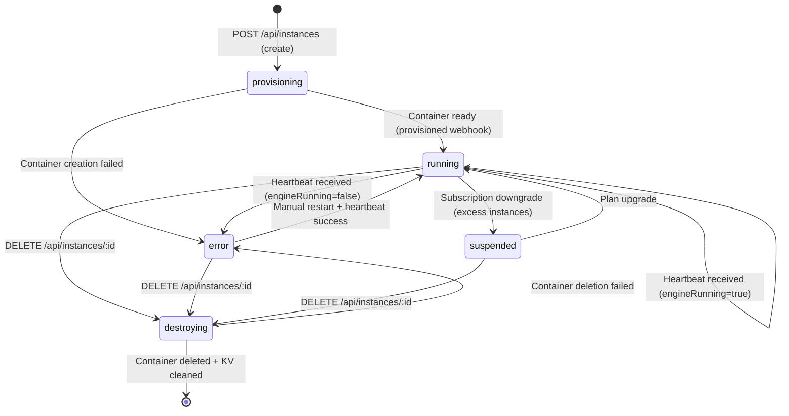
```mermaid
stateDiagram-v2
    [*] --> provisioning: POST /api/instances (create)
    provisioning --> running: Container ready (provisioned webhook)
    provisioning --> error: Container creation failed

    running --> running: Heartbeat received (engineRunning=true)
    running --> error: Heartbeat received (engineRunning=false)
    running --> destroying: DELETE /api/instances/:id
    running --> suspended: Subscription downgrade (excess instances)

    error --> running: Manual restart + heartbeat success
    error --> destroying: DELETE /api/instances/:id

    suspended --> running: Plan upgrade
    suspended --> destroying: DELETE /api/instances/:id

    destroying --> [*]: Container deleted + KV cleaned
    destroying --> error: Container deletion failed
```

### 3.2 Skill Lifecycle

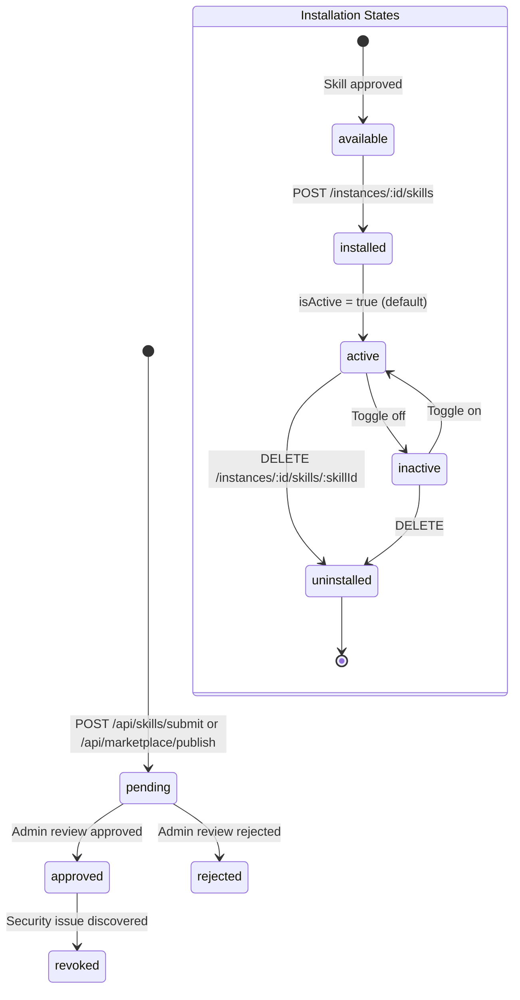
```mermaid
stateDiagram-v2
    [*] --> pending: POST /api/skills/submit or /api/marketplace/publish
    pending --> approved: Admin review approved
    pending --> rejected: Admin review rejected
    approved --> revoked: Security issue discovered

    state "Installation States" as install {
        [*] --> available: Skill approved
        available --> installed: POST /instances/:id/skills
        installed --> active: isActive = true (default)
        active --> inactive: Toggle off
        inactive --> active: Toggle on
        active --> uninstalled: DELETE /instances/:id/skills/:skillId
        inactive --> uninstalled: DELETE
        uninstalled --> [*]
    }
```

### 3.3 Invitation Lifecycle

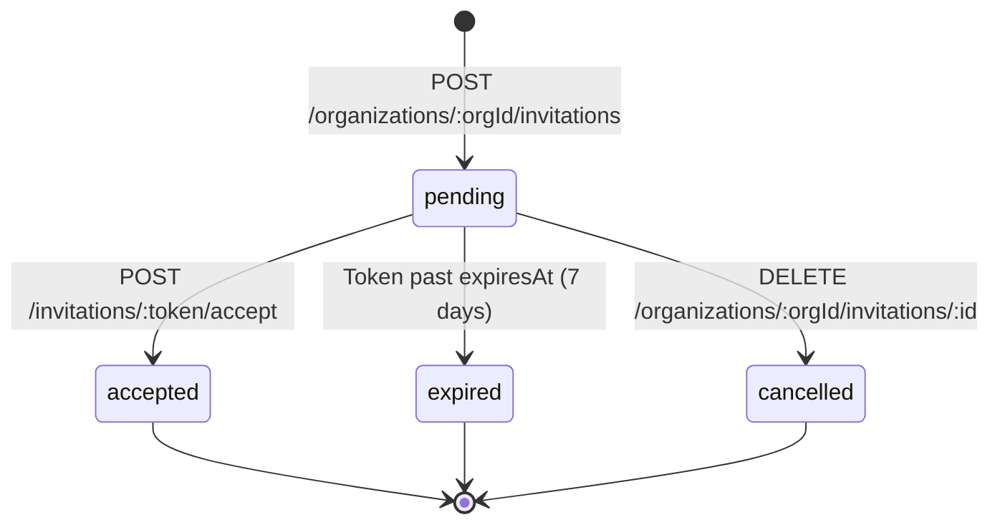
```mermaid
stateDiagram-v2
    [*] --> pending: POST /organizations/:orgId/invitations
    pending --> accepted: POST /invitations/:token/accept
    pending --> expired: Token past expiresAt (7 days)
    pending --> cancelled: DELETE /organizations/:orgId/invitations/:id
    accepted --> [*]
    expired --> [*]
    cancelled --> [*]
```

### 3.4 Subscription Lifecycle

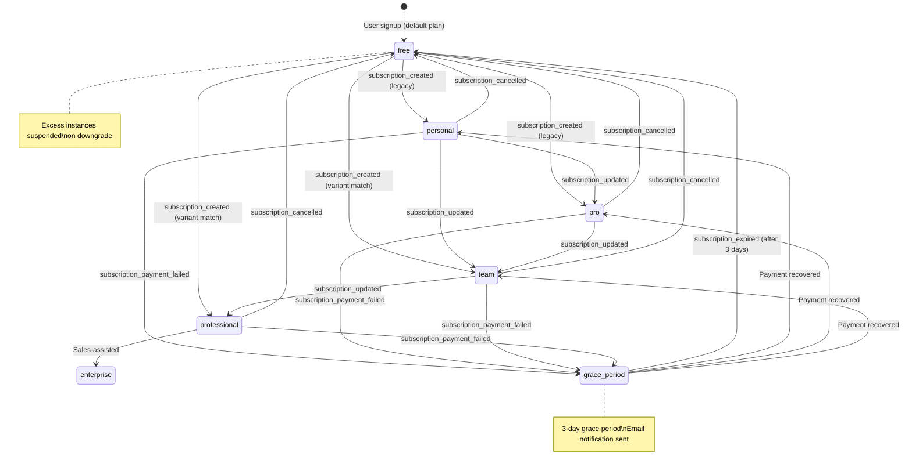
```mermaid
stateDiagram-v2
    [*] --> free: User signup (default plan)
    free --> personal: subscription_created (legacy)
    free --> pro: subscription_created (legacy)
    free --> team: subscription_created (variant match)
    free --> professional: subscription_created (variant match)

    personal --> pro: subscription_updated
    personal --> team: subscription_updated
    pro --> team: subscription_updated
    team --> professional: subscription_updated
    professional --> enterprise: Sales-assisted

    personal --> grace_period: subscription_payment_failed
    pro --> grace_period: subscription_payment_failed
    team --> grace_period: subscription_payment_failed
    professional --> grace_period: subscription_payment_failed

    grace_period --> free: subscription_expired (after 3 days)
    grace_period --> personal: Payment recovered
    grace_period --> pro: Payment recovered
    grace_period --> team: Payment recovered

    team --> free: subscription_cancelled
    pro --> free: subscription_cancelled
    personal --> free: subscription_cancelled
    professional --> free: subscription_cancelled

    note right of grace_period: 3-day grace period\nEmail notification sent
    note right of free: Excess instances suspended\non downgrade
```

### 3.5 Alert Lifecycle

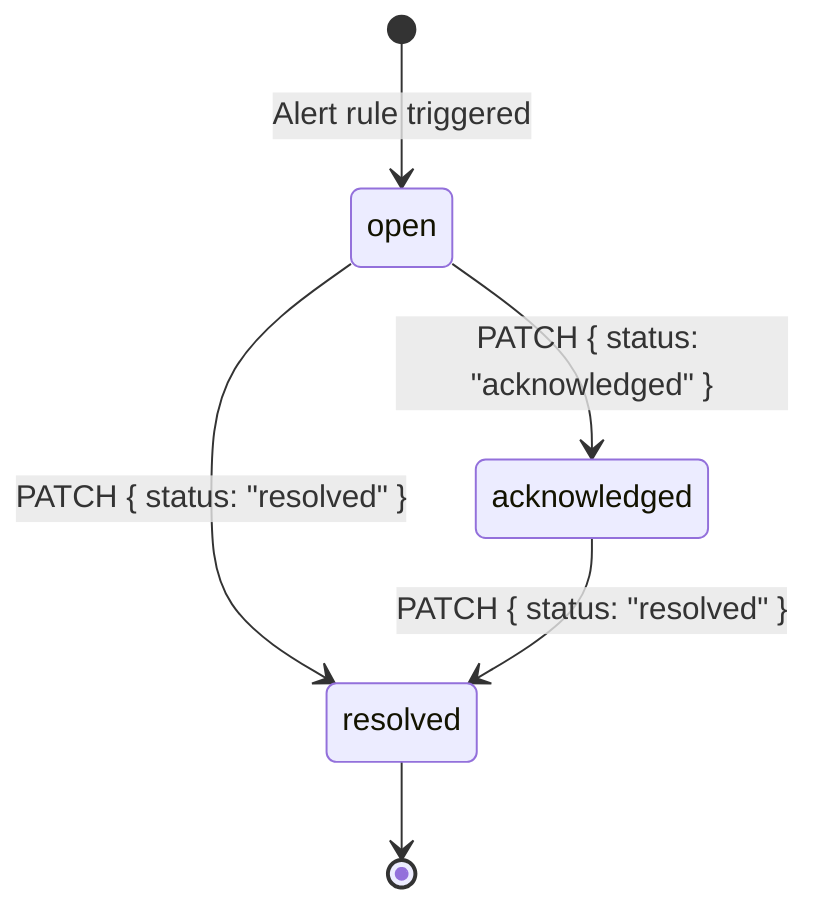
```mermaid
stateDiagram-v2
    [*] --> open: Alert rule triggered
    open --> acknowledged: PATCH { status: "acknowledged" }
    open --> resolved: PATCH { status: "resolved" }
    acknowledged --> resolved: PATCH { status: "resolved" }
    resolved --> [*]
```

### 3.6 Organization Member Status

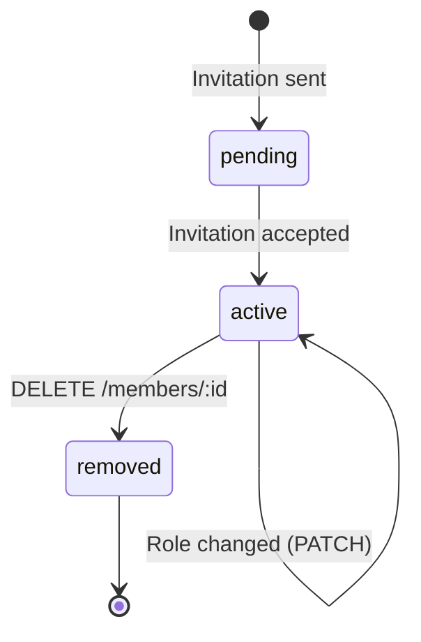
```mermaid
stateDiagram-v2
    [*] --> pending: Invitation sent
    pending --> active: Invitation accepted
    active --> removed: DELETE /members/:id
    active --> active: Role changed (PATCH)
    removed --> [*]
```

### 3.7 MCP Server Status

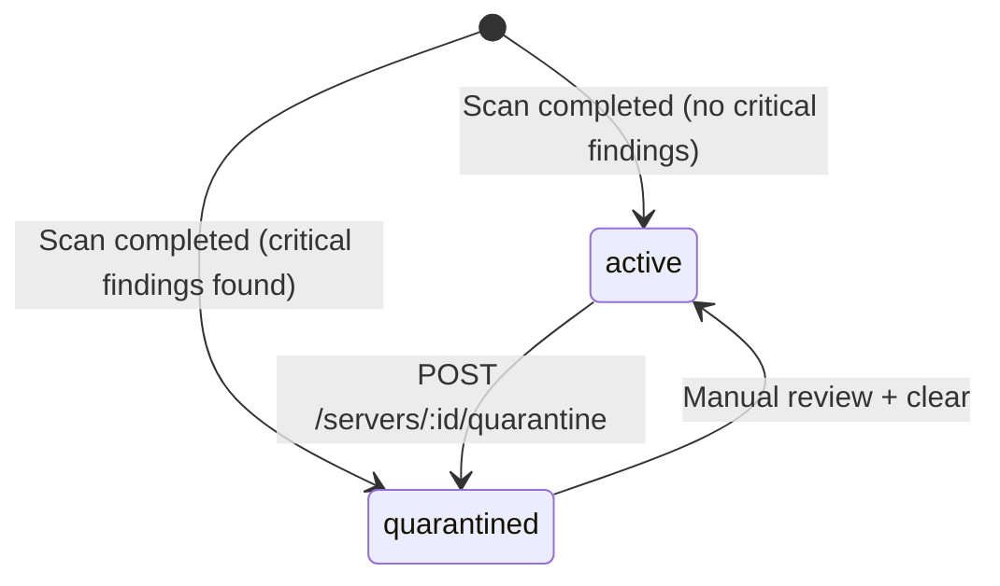
```mermaid
stateDiagram-v2
    [*] --> active: Scan completed (no critical findings)
    [*] --> quarantined: Scan completed (critical findings found)
    active --> quarantined: POST /servers/:id/quarantine
    quarantined --> active: Manual review + clear
```

### 3.8 NHI Agent Status

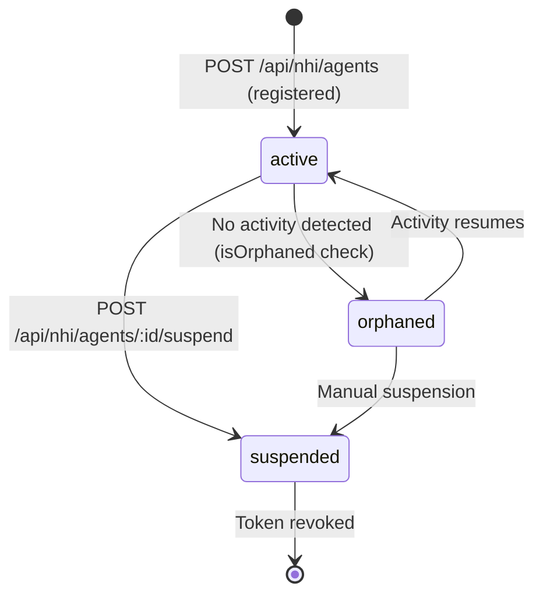
```mermaid
stateDiagram-v2
    [*] --> active: POST /api/nhi/agents (registered)
    active --> suspended: POST /api/nhi/agents/:id/suspend
    active --> orphaned: No activity detected (isOrphaned check)
    suspended --> [*]: Token revoked
    orphaned --> active: Activity resumes
    orphaned --> suspended: Manual suspension
```

---

## 4. Skills Registry

Skills are security scanning modules that run inside agent containers. Each skill has a category, verification status, and plan tier.

### Skill Categories (from schema)

| Category | Description | Example Skills |
|----------|-------------|----------------|
| `scanner` | Vulnerability and security scanning | OWASP Scanner, Dependency Checker |
| `monitor` | Real-time monitoring and detection | File Integrity Monitor, Network Monitor |
| `compliance` | Compliance framework checking | SOC2 Checker, GDPR Scanner |
| `response` | Automated incident response | Auto-Remediate, Kill Process |
| `intelligence` | Threat intelligence feeds | IOC Feed, Threat Map |
| `audit` | Audit and logging | Audit Logger, Activity Tracker |

### Skill Data Model

| Field | Type | Description |
|-------|------|-------------|
| `id` | string | Unique identifier |
| `slug` | string | URL-friendly unique name |
| `name` | string | Display name |
| `description` | string | Full description |
| `category` | SkillCategory | One of the categories above |
| `githubUrl` | string? | Source repository |
| `currentVersion` | string | Latest version (semver) |
| `authorId` | string | Creator's userId |
| `publisherId` | string | Publisher's userId |
| `verificationStatus` | pending/approved/rejected/revoked | Review status |
| `tier` | free/pro/enterprise | Plan tier requirement |
| `installCount` | number | Total installations |
| `ratingAvg` | number | Average rating (0-5) |
| `ratingCount` | number | Number of ratings |
| `isFeatured` | boolean | Featured in marketplace |

### Skill Lifecycle

1. **Submit**: Author submits via `POST /api/marketplace/publish` or `POST /api/skills/submit`
2. **Review**: Admin reviews via marketplace admin routes (approve/reject)
3. **Install**: User installs on instance via `POST /api/instances/:id/skills`
4. **Reconcile**: Agent heartbeat returns desired skills, agent reconciles
5. **Execute**: Agent runs skill on schedule or event trigger
6. **Report**: Skill results flow back as security events

### Skill Bundles

Bundles group related skills for easy activation:

| Field | Type | Description |
|-------|------|-------------|
| `id` | string | Bundle ID |
| `name` | string | Bundle display name |
| `description` | string | What the bundle provides |
| `priceCents` | number | Monthly price (0 = free) |
| `isActive` | boolean | Available for subscription |
| `sortOrder` | number | Display ordering |
| `skills[]` | array | Skills included in bundle |

---

## 5. Interaction Matrix

### Dashboard Overview (`/dashboard`)

| UI Action | Effect | API Call | Method | Permission |
|-----------|--------|----------|--------|------------|
| Page load | Show instances | `GET /api/instances` | GET | resolveOrgContext |
| Page load | Show onboarding | `GET /api/user/onboarding` | GET | auth |
| Page load | Show user profile | `GET /api/user` | GET | auth |
| Click instance | Navigate to detail | Client-side routing | - | - |
| Click "Deploy" | Create instance | `POST /api/instances` | POST | instance.create |

### Agent Activity (`/dashboard/agents`)

| UI Action | Effect | API Call | Method | Permission |
|-----------|--------|----------|--------|------------|
| Page load | Show activity feed | `GET /api/agents/activity` | GET | auth |
| Page load | Show summary | `GET /api/agents/activity/summary` | GET | auth |
| Filter by agent | Filter events | `GET /api/agents/activity?agent=X` | GET | auth |
| Clear activity | Delete all events | `DELETE /api/agents/activity` | DELETE | auth |

### Marketplace (`/dashboard/marketplace`)

| UI Action | Effect | API Call | Method | Permission |
|-----------|--------|----------|--------|------------|
| Page load | List skills | `GET /api/marketplace` | GET | marketplace.browse |
| Search | Filter skills | `GET /api/marketplace?q=X` | GET | marketplace.browse |
| Category filter | Filter by category | `GET /api/marketplace?category=X` | GET | marketplace.browse |
| View featured | Featured skills | `GET /api/marketplace/featured` | GET | marketplace.browse |
| Click skill | Skill detail | `GET /api/marketplace/:id` | GET | marketplace.browse |
| Install | Install on instance | `POST /api/marketplace/:id/install` | POST | marketplace.install |
| Uninstall | Remove from instance | `DELETE /api/marketplace/:id/install` | DELETE | marketplace.install |

### Bundles (`/dashboard/bundles`)

| UI Action | Effect | API Call | Method | Permission |
|-----------|--------|----------|--------|------------|
| Page load | List bundles | `GET /api/bundles` | GET | marketplace.browse |
| Activate | Subscribe to bundle | `POST /api/bundles/:id/activate` | POST | marketplace.browse |
| View my bundles | Active subscriptions | `GET /api/user/bundles` | GET | marketplace.browse |

### Security Dashboard (`/dashboard/security`)

| UI Action | Effect | API Call | Method | Permission |
|-----------|--------|----------|--------|------------|
| Page load | Security score + summary | `GET /api/security/instances/:id/dashboard` | GET | resolveOrgContext |
| View events | Security event list | `GET /api/security/instances/:id/events` | GET | resolveOrgContext |
| View audit log | Audit trail | `GET /api/security/instances/:id/audit` | GET | resolveOrgContext |
| Score history | Trend chart | `GET /api/security/instances/:id/score-history` | GET | resolveOrgContext |

### Alert Management (`/dashboard/security/alerts`)

| UI Action | Effect | API Call | Method | Permission |
|-----------|--------|----------|--------|------------|
| Page load | List alert rules | `GET /api/security/instances/:id/alert-rules` | GET | alert.view |
| Create rule | New alert rule | `POST /api/security/instances/:id/alert-rules` | POST | alert.create |
| Edit rule | Update rule | `PATCH /api/security/instances/:id/alert-rules/:ruleId` | PATCH | alert.update |
| Delete rule | Remove rule | `DELETE /api/security/instances/:id/alert-rules/:ruleId` | DELETE | alert.delete |
| View alerts | Triggered alerts | `GET /api/security/instances/:id/alerts` | GET | alert.view |
| Acknowledge | Mark acknowledged | `PATCH /api/security/instances/:id/alerts/:alertId` | PATCH | alert.update |
| Resolve | Mark resolved | `PATCH /api/security/instances/:id/alerts/:alertId` | PATCH | alert.update |

### Team Management (`/dashboard/team`)

| UI Action | Effect | API Call | Method | Permission |
|-----------|--------|----------|--------|------------|
| Page load | List members | `GET /api/organizations/:orgId` | GET | resolveOrgContext |
| Invite member | Send invitation | `POST /api/organizations/:orgId/invitations` | POST | member.invite |
| View invitations | Pending list | `GET /api/organizations/:orgId/invitations` | GET | member.view |
| Cancel invitation | Cancel invite | `DELETE /api/organizations/:orgId/invitations/:id` | DELETE | member.invite |
| Change role | Update member role | `PATCH /api/organizations/:orgId/members/:id` | PATCH | member.changeRole |
| Remove member | Remove from org | `DELETE /api/organizations/:orgId/members/:id` | DELETE | member.remove |
| Transfer ownership | Transfer owner role | `POST /api/organizations/:orgId/members/:id/transfer` | POST | org.delete |

### SSO Configuration (`/dashboard/team/sso`)

| UI Action | Effect | API Call | Method | Permission |
|-----------|--------|----------|--------|------------|
| Page load | Get SSO config | `GET /api/organizations/:orgId/sso` | GET | org.update |
| Save config | Create/update SSO | `PUT /api/organizations/:orgId/sso` | PUT | org.update |
| Test connection | Verify IdP reachable | `POST /api/organizations/:orgId/sso/test` | POST | org.update |
| Delete config | Remove SSO | `DELETE /api/organizations/:orgId/sso` | DELETE | org.update |

### Credential Vault (`/dashboard/settings` or instance detail)

| UI Action | Effect | API Call | Method | Permission |
|-----------|--------|----------|--------|------------|
| List secrets | Show key names | `GET /api/instances/:id/secrets` | GET | resolveOrgContext |
| Store secret | Encrypt and save | `POST /api/instances/:id/secrets` | POST | vault.write |
| Delete secret | Remove secret | `DELETE /api/instances/:id/secrets/:key` | DELETE | vault.delete |

### Notification Channels

| UI Action | Effect | API Call | Method | Permission |
|-----------|--------|----------|--------|------------|
| List channels | Show configured channels | `GET /api/security/user/notification-channels` | GET | auth |
| Add channel | Create channel | `POST /api/security/user/notification-channels` | POST | auth |
| Delete channel | Remove channel | `DELETE /api/security/user/notification-channels/:id` | DELETE | auth |

### NHI Manager

| UI Action | Effect | API Call | Method | Permission |
|-----------|--------|----------|--------|------------|
| List agents | Show NHI agents | `GET /api/nhi/agents` | GET | auth |
| View orphaned | Orphaned agents | `GET /api/nhi/agents/orphaned` | GET | auth |
| View summary | Dashboard stats | `GET /api/nhi/agents/summary` | GET | auth |
| Register agent | New identity | `POST /api/nhi/agents` | POST | auth |
| Update agent | Edit metadata | `PATCH /api/nhi/agents/:id` | PATCH | auth |
| Suspend agent | Revoke token | `POST /api/nhi/agents/:id/suspend` | POST | auth |

### MCP Guardian

| UI Action | Effect | API Call | Method | Permission |
|-----------|--------|----------|--------|------------|
| Scan config | Security analysis | `POST /api/mcp/guardian/scan` | POST | auth |
| List servers | Registered MCPs | `GET /api/mcp/guardian/servers` | GET | auth |
| Quarantine | Block MCP server | `POST /api/mcp/guardian/servers/:id/quarantine` | POST | auth |

### Cost Bomb Protection

| UI Action | Effect | API Call | Method | Permission |
|-----------|--------|----------|--------|------------|
| View summary | Spend overview | `GET /api/costs/summary` | GET | auth |
| View events | Cost event log | `GET /api/costs/events` | GET | auth |
| Create budget | Set spend limit | `POST /api/costs/budgets` | POST | auth |
| List budgets | View budget rules | `GET /api/costs/budgets` | GET | auth |
| Delete budget | Remove limit | `DELETE /api/costs/budgets/:id` | DELETE | auth |

### Data Export

| UI Action | Effect | API Call | Method | Permission |
|-----------|--------|----------|--------|------------|
| Export agents | Download agent data | `GET /api/export/agents?format=csv` | GET | audit.export |
| Export findings | Download findings | `GET /api/export/findings?format=json` | GET | audit.export |
| Export compliance | Download reports | `GET /api/export/compliance` | GET | audit.export |
| Export assets | Download inventory | `GET /api/export/assets` | GET | audit.export |

---

## 6. Error Flow Diagrams

### 6.1 Instance Provisioning Failure

```mermaid
flowchart TD
    A[POST /api/instances] --> B{Plan limit check}
    B -->|Exceeded| C[403: Limit reached]
    B -->|OK| D{Data residency check}
    D -->|Restricted| E[403: Region restricted]
    D -->|OK| F[INSERT instance status=provisioning]
    F --> G{agentRuntime.createInstance()}
    G -->|Success| H[Store gateway token in KV]
    H --> I[UPDATE instance status=running]
    I --> J[201: Instance created]
    G -->|Failure| K[UPDATE instance status=error]
    K --> L[500: Provisioning failed]
```

### 6.2 Skill Installation Failure

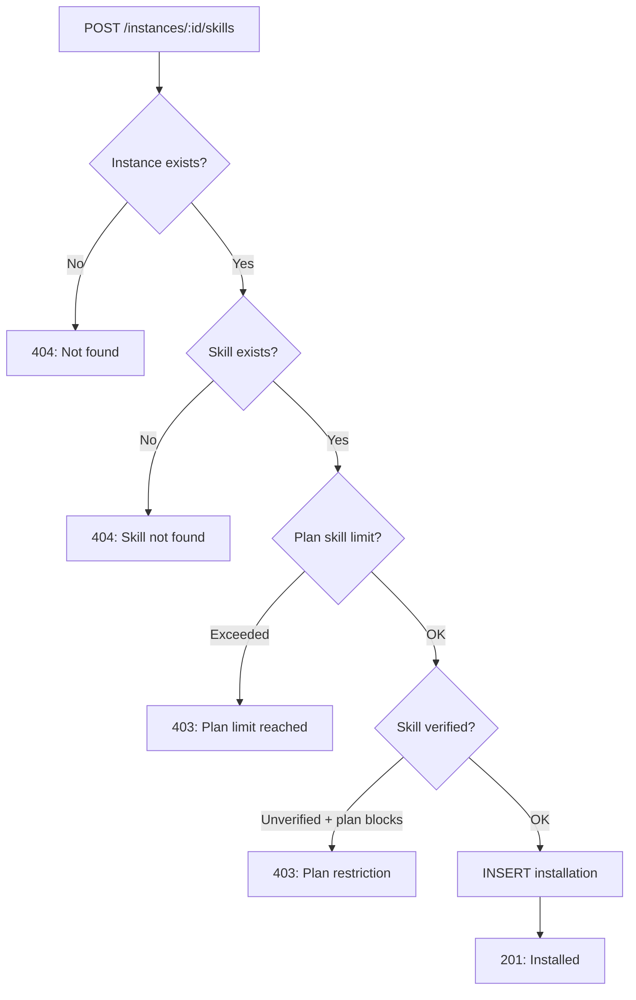
```mermaid
flowchart TD
    A[POST /instances/:id/skills] --> B{Instance exists?}
    B -->|No| C[404: Not found]
    B -->|Yes| D{Skill exists?}
    D -->|No| E[404: Skill not found]
    D -->|Yes| F{Plan skill limit?}
    F -->|Exceeded| G[403: Plan limit reached]
    F -->|OK| H{Skill verified?}
    H -->|Unverified + plan blocks| I[403: Plan restriction]
    H -->|OK| J[INSERT installation]
    J --> K[201: Installed]
```

### 6.3 Authentication Failure Paths

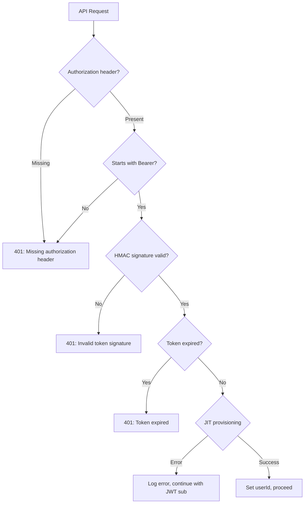
```mermaid
flowchart TD
    A[API Request] --> B{Authorization header?}
    B -->|Missing| C[401: Missing authorization header]
    B -->|Present| D{Starts with Bearer?}
    D -->|No| C
    D -->|Yes| E{HMAC signature valid?}
    E -->|No| F[401: Invalid token signature]
    E -->|Yes| G{Token expired?}
    G -->|Yes| H[401: Token expired]
    G -->|No| I{JIT provisioning}
    I -->|Error| J[Log error, continue with JWT sub]
    I -->|Success| K[Set userId, proceed]
```

### 6.4 RBAC Enforcement Failure

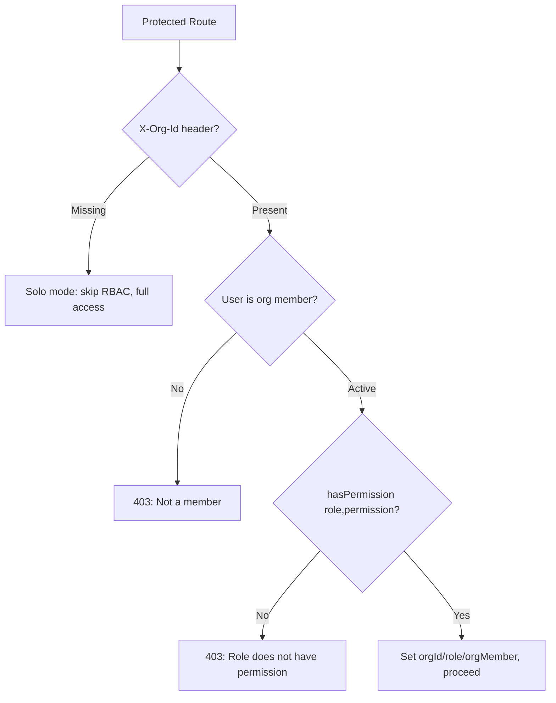
```mermaid
flowchart TD
    A[Protected Route] --> B{X-Org-Id header?}
    B -->|Missing| C[Solo mode: skip RBAC, full access]
    B -->|Present| D{User is org member?}
    D -->|No| E[403: Not a member]
    D -->|Active| F{hasPermission role,permission?}
    F -->|No| G[403: Role does not have permission]
    F -->|Yes| H[Set orgId/role/orgMember, proceed]
```

### 6.5 Subscription Downgrade Impact

```mermaid
flowchart TD
    A[subscription_cancelled webhook] --> B{Grace period active?}
    B -->|Yes| C[Defer suspension]
    B -->|No| D[Downgrade to free plan]
    D --> E[Clear subscription data]
    E --> F{Instances > free limit?}
    F -->|No| G[Done]
    F -->|Yes| H[Sort instances by creation date]
    H --> I[Suspend excess instances oldest kept]
    I --> J[Log suspended count]
```

### 6.6 Payment Failure Handling

```mermaid
flowchart TD
    A[subscription_payment_failed webhook] --> B[Find user by customerId]
    B --> C{User found?}
    C -->|No| D[Log and return]
    C -->|Yes| E[Set 3-day grace period]
    E --> F[Send payment failed email]
    F --> G{Email sent?}
    G -->|Yes| H[Done]
    G -->|No| I[Log email error, continue]
```

---

## 7. Permission Map

### 7.1 Roles Overview

| Role | Hierarchy Level | Description |
|------|----------------|-------------|
| `owner` | 5 (highest) | Full access, can delete org and transfer ownership |
| `admin` | 4 | Full operational access, cannot delete org |
| `security` | 3 | Security-focused: policies, incidents, alerts, compliance |
| `developer` | 2 | Instance and skill management, vault read/write |
| `viewer` | 1 (lowest) | Read-only access to all resources |

### 7.2 Complete Permission Matrix

| Permission | Owner | Admin | Security | Developer | Viewer |
|------------|:-----:|:-----:|:--------:|:---------:|:------:|
| **Instance Management** | | | | | |
| instance.create | x | x | - | x | - |
| instance.view | x | x | x | x | x |
| instance.update | x | x | - | x | - |
| instance.restart | x | x | - | x | - |
| instance.delete | x | x | - | - | - |
| **Skill Management** | | | | | |
| skill.install | x | x | - | x | - |
| skill.uninstall | x | x | - | x | - |
| skill.view | x | x | x | x | x |
| **Security Policy** | | | | | |
| policy.create | x | x | x | - | - |
| policy.update | x | x | x | - | - |
| policy.delete | x | x | x | - | - |
| policy.view | x | x | x | x | x |
| **Incident Management** | | | | | |
| incident.create | x | x | x | - | - |
| incident.update | x | x | x | - | - |
| incident.assign | x | x | x | - | - |
| incident.view | x | x | x | x | x |
| **Alert Management** | | | | | |
| alert.create | x | x | x | - | - |
| alert.update | x | x | x | - | - |
| alert.delete | x | x | x | - | - |
| alert.view | x | x | x | x | x |
| **Credential Vault** | | | | | |
| vault.read | x | x | x | x | - |
| vault.write | x | x | - | x | - |
| vault.delete | x | x | - | - | - |
| **Member Management** | | | | | |
| member.invite | x | x | - | - | - |
| member.remove | x | x | - | - | - |
| member.changeRole | x | x | - | - | - |
| member.view | x | x | x | x | x |
| **Billing** | | | | | |
| billing.view | x | x | x | x | x |
| billing.manage | x | - | - | - | - |
| **Audit** | | | | | |
| audit.view | x | x | x | x | x |
| audit.export | x | x | x | - | - |
| **Compliance** | | | | | |
| compliance.view | x | x | x | x | x |
| compliance.generate | x | x | x | - | - |
| **Organization** | | | | | |
| org.update | x | x | - | - | - |
| org.delete | x | - | - | - | - |
| **Cloud Security (CSPM)** | | | | | |
| cloud.read | x | x | x | x | x |
| cloud.write | x | x | x | - | - |
| cloud.admin | x | x | - | - | - |
| **Agent Policies** | | | | | |
| agent.policy.read | x | x | x | x | x |
| agent.policy.write | x | x | x | - | - |
| **Marketplace** | | | | | |
| marketplace.browse | x | x | x | x | x |
| marketplace.install | x | x | - | x | - |
| marketplace.publish | x | x | - | - | - |
| marketplace.admin | x | x | - | - | - |
| **SCIM** | | | | | |
| scim.read | x | x | - | - | - |
| scim.write | x | x | - | - | - |
| **SLA** | | | | | |
| sla.view | x | x | x | x | x |
| sla.export | x | x | x | - | - |
| **Data Room** | | | | | |
| dataroom.view | x | - | - | - | - |
| **SaaS Posture** | | | | | |
| saas.read | x | x | x | x | x |
| saas.write | x | x | x | - | - |

### 7.3 Solo Mode vs Org Mode

The RBAC system supports backward-compatible "solo mode":

- **Solo mode** (no `X-Org-Id` header): All permissions are granted. The user operates as a single-user account.
- **Org mode** (`X-Org-Id` header present): Membership is verified, role is checked against the permission map above.

This allows existing single-user accounts to work without org setup while enterprise users get full RBAC enforcement.

### 7.4 Role Assignment Rules

- `owner` role is assigned automatically when creating an org
- `owner` role cannot be assigned via invitation
- `owner` role cannot be changed directly (must use ownership transfer)
- Role escalation is prevented: a user cannot assign a role higher than their own
- Assignable roles via invitation: `admin`, `security`, `developer`, `viewer`

---

## Appendix A: Plan Feature Gating

| Feature | Free | Personal | Pro | Team | Professional | Enterprise | Mission Defender |
|---------|:----:|:--------:|:---:|:----:|:------------:|:----------:|:----------------:|
| Instance limit | 1 | 1 | 1 | 3 | 10 | Unlimited | Unlimited |
| Verified skill limit | 3 | 10 | Unlimited | Unlimited | Unlimited | Unlimited | Unlimited |
| Unverified skills | No | No | Yes | Yes | Yes | Yes | Yes |
| Audit log retention | 3d | 7d | 90d | 90d | 365d | 5y | 5y |
| Security dashboard | basic | basic | full | full | full+audit | full+audit | full+audit |
| Cloud sync | No | No | Yes | Yes | Yes | Yes | Yes |
| Team dashboard | No | No | No | Yes | Yes | Yes | Yes |
| Policy engine | No | No | Yes | Yes | Yes | Yes | Yes |
| PDF reports | No | No | No | No | Yes | Yes | Yes |
| CSPM accounts | 0 | 0 | 3 | 5 | 20 | Unlimited | Unlimited |
| Agent limit | 1 | 3 | 10 | 3 | 10 | Unlimited | Unlimited |
| Agent history | 7d | 30d | 90d | 90d | 365d | 5y | 5y |
| Support | Community | Community | Email | Email | Priority | Priority | Priority |
| Price (monthly) | $0 | $49 | $149 | $299 | $799 | $2,499 | $9,999 |

## Appendix B: Dashboard Navigation Structure

### Sidebar Groups

1. **Agent**: Activity, Skills, Marketplace, Bundles, Audit Logs, MCP Monitoring, Getting Started, Achievements
2. **Security**: Dashboard, Vulnerabilities
   - *Detection*: Alerts, Incidents, Kill Chain
   - *Investigation*: Threat Map, Threat Feed, Attack Paths
   - *Infrastructure*: Network, File Integrity, Supply Chain
3. **Governance**:
   - *Policy*: Agent Policies, Policies, Rule Engine
   - *Compliance*: OASF, SOC2 Readiness, Compliance, CSPM Findings
   - *Operations*: Cloud Security, Asset Inventory, SLO Dashboard, Uptime, SLA Monitor
4. **Team** (plan-gated): Members, Team Settings, SSO, Residency, Team Agents, Alert Channels, Violations
5. **Bottom Rail**: Integrations, Settings, Profile

## Appendix C: Webhook Endpoints

| Endpoint | Auth Method | Source | Purpose |
|----------|-------------|--------|---------|
| `POST /webhooks/lemonsqueezy` | HMAC-SHA256 signature | LemonSqueezy | Subscription lifecycle |
| `POST /webhooks/agent/health` | Gateway token | Agent container | Heartbeat + skill reconciliation |
| `POST /webhooks/agent/provisioned` | Gateway token | Cloud-init script | Instance status transition |
| `POST /webhooks/integrations` | Varies | Third-party integrations | Integration event processing |

## Appendix D: External Service Dependencies

| Service | Purpose | Auth Method |
|---------|---------|-------------|
| Resend | Transactional emails (welcome, deploy, invite, payment) | API key |
| LemonSqueezy | Subscription billing | Webhook HMAC + API key |
| Hetzner Cloud | VM provisioning for agent containers | API token |
| Cloudflare D1 | Primary database (SQLite) | Worker binding |
| Cloudflare KV | Cache, gateway tokens, OIDC state | Worker binding |
| Cloudflare R2 | Skill packages, logs, backups | Worker binding |
| Cloudflare DO | Agent runtime orchestration | Worker binding |

---

*Generated by Luna Documentation Agent from source code analysis of 170+ route handlers, 5 middleware layers, 37+ DB schemas, and 50+ frontend pages.*
