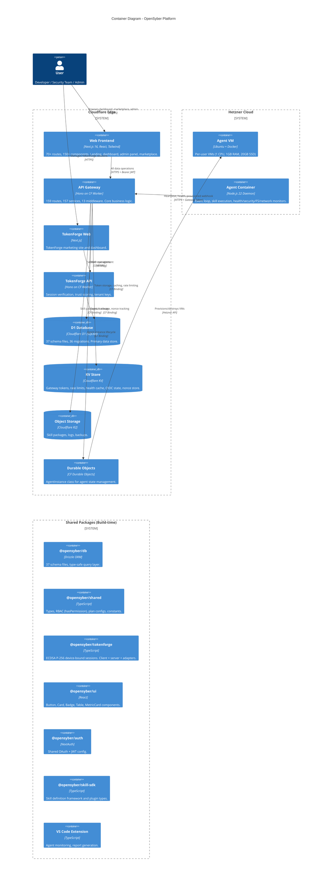
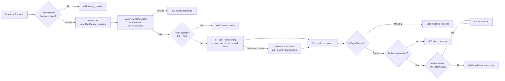
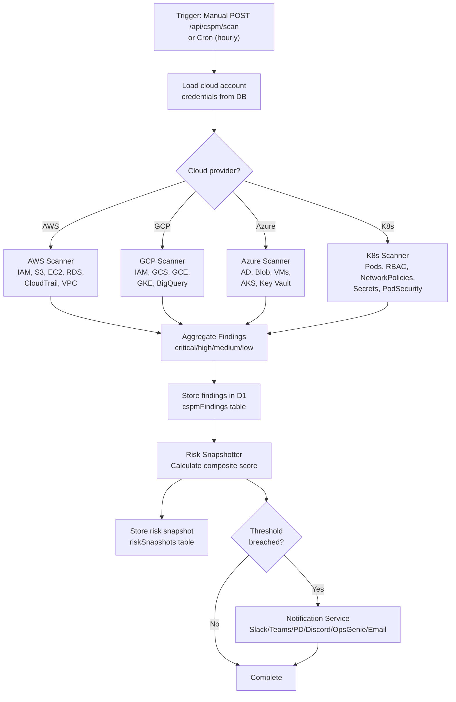
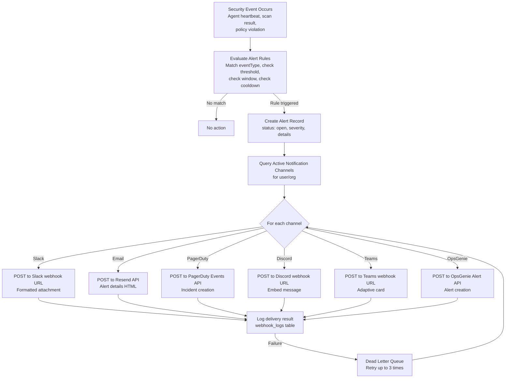
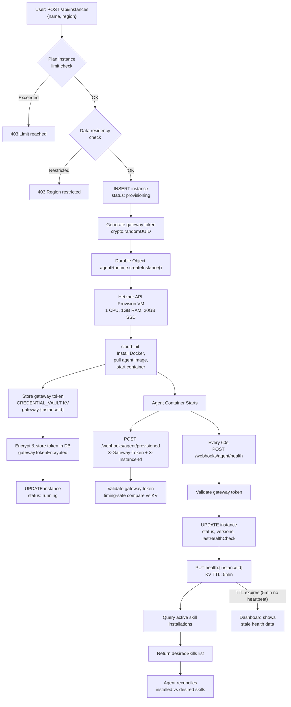
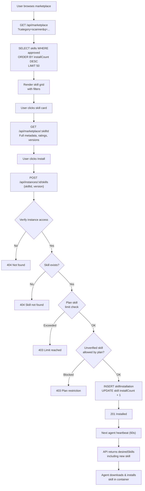

# OpenSyber High-Level Design (HLD)

**Project**: OpenSyber -- Managed AI Agent Hosting Platform
**Generated**: 2026-03-29
**Version**: 1.0
**Based on**: codemap.md, flowdocs.md, source code analysis

---

## Table of Contents

1. [System Context Diagram](#1-system-context-diagram)
2. [Container Diagram](#2-container-diagram)
3. [Component Diagram (API)](#3-component-diagram-api)
4. [Data Flow Diagrams](#4-data-flow-diagrams)
5. [Tech Stack Summary with Rationale](#5-tech-stack-summary-with-rationale)
6. [Integration Map](#6-integration-map)
7. [Entity-Relationship Diagram](#7-entity-relationship-diagram)
8. [Deployment Architecture](#8-deployment-architecture)
9. [Security Architecture](#9-security-architecture)
10. [Non-Functional Requirements Analysis](#10-non-functional-requirements-analysis)

---

## 1. System Context Diagram

Shows OpenSyber in relation to all external actors and services.

```mermaid
C4Context
    title System Context Diagram - OpenSyber Platform

    Person(dev, "Developer", "Deploys and monitors AI agents with security skills")
    Person(secteam, "Security Team", "Manages policies, reviews alerts, runs compliance audits")
    Person(admin, "Enterprise Admin", "Configures SSO, RBAC, manages organization")
    Person(skillauthor, "Skill Author", "Publishes security skills to marketplace")

    System(opensyber, "OpenSyber Platform", "Managed AI agent hosting with real-time security monitoring, audited skill marketplace, and compliance")

    System_Ext(authjs, "Auth.js (OAuth)", "Google, GitHub, GitLab, Bitbucket OAuth2 providers")
    System_Ext(lemonsqueezy, "LemonSqueezy", "Subscription billing, checkout, webhooks")
    System_Ext(resend, "Resend", "Transactional email delivery")
    System_Ext(hetzner, "Hetzner Cloud", "VM provisioning for agent containers")
    System_Ext(sentry, "Sentry", "Error tracking and performance monitoring")

    System_Ext(aws, "AWS", "Cloud Security Posture Management scanning")
    System_Ext(gcp, "GCP", "Cloud Security Posture Management scanning")
    System_Ext(azure, "Azure", "Cloud Security Posture Management scanning")
    System_Ext(k8s, "Kubernetes", "Container orchestration scanning")

    System_Ext(slack, "Slack", "Alert notifications")
    System_Ext(teams, "Microsoft Teams", "Alert notifications")
    System_Ext(pagerduty, "PagerDuty", "Incident escalation")
    System_Ext(discord, "Discord", "Alert notifications")
    System_Ext(opsgenie, "OpsGenie", "Alert notifications")

    System_Ext(saml_idp, "SAML 2.0 IdP", "Enterprise SSO (Okta, Azure AD, etc.)")
    System_Ext(oidc_idp, "OIDC Provider", "Enterprise SSO (Auth0, Keycloak, etc.)")

    Rel(dev, opensyber, "Deploys agents, installs skills, views dashboards", "HTTPS")
    Rel(secteam, opensyber, "Reviews alerts, manages policies, runs scans", "HTTPS")
    Rel(admin, opensyber, "Configures SSO, manages org members, views audit logs", "HTTPS")
    Rel(skillauthor, opensyber, "Publishes and maintains security skills", "HTTPS")

    Rel(opensyber, authjs, "OAuth2 authentication", "HTTPS")
    Rel(opensyber, lemonsqueezy, "Subscription management", "HTTPS + Webhooks")
    Rel(opensyber, resend, "Sends emails (welcome, invite, alert, payment)", "HTTPS")
    Rel(opensyber, hetzner, "Provisions/destroys VMs", "HTTPS API")
    Rel(opensyber, sentry, "Reports errors and performance", "HTTPS")

    Rel(opensyber, aws, "Scans IAM, S3, EC2, RDS, CloudTrail", "AWS SDK")
    Rel(opensyber, gcp, "Scans IAM, GCS, GCE, GKE", "GCP SDK")
    Rel(opensyber, azure, "Scans AD, Blob, VMs, AKS", "Azure SDK")
    Rel(opensyber, k8s, "Scans pods, RBAC, network policies", "K8s API")

    Rel(opensyber, slack, "Delivers alert notifications", "Webhook")
    Rel(opensyber, teams, "Delivers alert notifications", "Webhook")
    Rel(opensyber, pagerduty, "Escalates incidents", "REST API")
    Rel(opensyber, discord, "Delivers alert notifications", "Webhook")
    Rel(opensyber, opsgenie, "Delivers alert notifications", "REST API")

    Rel(opensyber, saml_idp, "SAML 2.0 SSO (AuthnRequest/Response)", "HTTPS + XML")
    Rel(opensyber, oidc_idp, "OIDC SSO (Authorization Code + PKCE)", "HTTPS")
```



---

## 2. Container Diagram

All deployable units within the OpenSyber platform, their technologies, and communication patterns.



---

## 3. Component Diagram (API)

Internal structure of `apps/api`, the core backend service.

```mermaid
graph TB
    subgraph "Entry Point"
        INDEX["index.ts<br/>Hono App + Cron Scheduler"]
    end

    subgraph "Global Middleware Stack (Applied in Order)"
        MW_LOG["logger() — Request logging"]
        MW_JSON["prettyJSON() — Response formatting"]
        MW_SEC["securityHeaders — CSP, HSTS, X-Frame-Options,<br/>X-Content-Type-Options, Referrer-Policy"]
        MW_BODY["bodyLimit — 256 KB max request body"]
        MW_CORS["cors() — Origin allowlist + credential headers"]
        MW_TF["tokenForgeMiddleware — ECDSA device binding,<br/>trust scoring, step-up auth for sensitive ops"]
        MW_RATE["rateLimitMiddleware — 4 tiers:<br/>public(60/min), auth(300/min), agent(600/min), ai(20/min)"]
    end

    subgraph "Route-Level Middleware"
        MW_AUTH["authMiddleware — HMAC-SHA256 JWT verification,<br/>JIT user provisioning, welcome email"]
        MW_DB["dbMiddleware — Drizzle D1 injection"]
        MW_RBAC["requirePermission() — Org context + role check<br/>resolveOrgContext() — Org context only"]
        MW_PLAN["planEnforcement — Feature gating by plan tier"]
        MW_GW["gatewayAuth — X-Gateway-Token validation<br/>via KV timing-safe comparison"]
        MW_APIKEY["apiKeyAuth — X-API-Key header validation"]
        MW_ADMIN["adminMiddleware — isAdmin flag check"]
        MW_IDEM["idempotency — Request dedup via KV"]
        MW_TENANT["tenantIsolation — Multi-tenant KV scoping"]
        MW_WH["webhookResilience — Retry/DLQ for webhooks"]
    end

    subgraph "Route Categories"
        R_INST["Instance Management<br/>CRUD, start/stop/restart, skills deploy"]
        R_SKILL["Skill & Marketplace<br/>Browse, install, publish, bundles"]
        R_SEC["Security<br/>Events, dashboard, score, policies,<br/>incidents, kill chain, attack paths"]
        R_ALERT["Alerts & Notifications<br/>Rules, triggers, channels (6 types)"]
        R_COMP["Compliance & Governance<br/>SOC2, GDPR, HIPAA, NIST, PCI, OASF"]
        R_CLOUD["Cloud Security (CSPM)<br/>Accounts, scans, findings<br/>AWS/GCP/Azure/K8s"]
        R_AI["AI Features<br/>Chat, NL queries, triage, insights"]
        R_ORG["Organizations & SSO<br/>CRUD, members, invitations,<br/>SAML 2.0, OIDC + PKCE"]
        R_AGENT["Agent Endpoints<br/>Activity sync, monitor, heartbeat,<br/>NHI manager, MCP guardian"]
        R_ADMIN["Admin Panel<br/>Users, orgs, instances, skills,<br/>events, metrics, billing"]
        R_BILLING["Billing & Webhooks<br/>LemonSqueezy lifecycle,<br/>payment failure, grace period"]
        R_VAULT["Credential Vault<br/>Store/retrieve/delete secrets,<br/>AES encryption"]
        R_EXPORT["Data Export (GDPR)<br/>Agents, findings, compliance,<br/>assets — JSON/CSV"]
        R_COSTS["Cost Bomb Protection<br/>Ingest, budgets, summaries"]
    end

    subgraph "Service Layer (157 modules)"
        S_CSPM["CSPM Scanner<br/>AWS/GCP/Azure/K8s scanning<br/>orchestration"]
        S_RISK["Risk Snapshotter<br/>Daily risk scoring aggregation"]
        S_NOTIF["Notification Service<br/>Slack, Teams, PagerDuty,<br/>Discord, OpsGenie, Email"]
        S_EMAIL["Email Service<br/>Resend API integration"]
        S_AGENT["Agent Runtime<br/>Durable Object lifecycle,<br/>Hetzner VM provisioning"]
        S_SKILL["Skill Scanner<br/>Vulnerability scanning of skills"]
        S_COMP["Compliance Engine<br/>Framework evaluation,<br/>attestation generation"]
        S_POLICY["Policy Engine<br/>Rule evaluation, enforcement"]
        S_VAULT["Vault Service<br/>AES encrypt/decrypt"]
        S_AI["AI Query Parser<br/>Natural language to API queries"]
        S_MCP["MCP Guardian<br/>MCP config scanning,<br/>auto-quarantine"]
        S_NHI["NHI Manager<br/>Non-human identity lifecycle,<br/>orphan detection"]
        S_COST["Cost Tracker<br/>Token usage, budget alerts"]
        S_TRIAL["Trial Service<br/>7-day trial, expiration emails"]
        S_HEALTH["Health Cron<br/>Instance health polling"]
        S_DLQ["DLQ Processor<br/>Dead letter queue retries"]
    end

    subgraph "Data Access"
        DA["@opensyber/db<br/>Drizzle ORM + D1<br/>37 schema files"]
    end

    INDEX --> MW_LOG --> MW_JSON --> MW_SEC --> MW_BODY --> MW_CORS --> MW_TF --> MW_RATE

    MW_RATE --> R_INST & R_SKILL & R_SEC & R_ALERT & R_COMP & R_CLOUD & R_AI & R_ORG & R_AGENT & R_ADMIN & R_BILLING & R_VAULT & R_EXPORT & R_COSTS

    R_INST --> MW_AUTH & MW_DB & MW_RBAC & S_AGENT
    R_SKILL --> MW_AUTH & MW_DB & MW_PLAN & S_SKILL
    R_SEC --> MW_AUTH & MW_DB & MW_RBAC
    R_ALERT --> MW_AUTH & MW_DB & MW_RBAC & S_NOTIF
    R_COMP --> MW_AUTH & MW_DB & S_COMP
    R_CLOUD --> MW_AUTH & MW_DB & MW_RBAC & S_CSPM
    R_AI --> MW_AUTH & S_AI
    R_ORG --> MW_AUTH & MW_DB
    R_AGENT --> MW_GW & MW_DB
    R_ADMIN --> MW_AUTH & MW_ADMIN & MW_DB
    R_BILLING --> MW_WH
    R_VAULT --> MW_AUTH & MW_DB & MW_RBAC & S_VAULT
    R_EXPORT --> MW_AUTH & MW_DB & MW_RBAC
    R_COSTS --> MW_AUTH & MW_DB & S_COST

    S_CSPM --> S_RISK
    S_RISK --> S_NOTIF
    S_NOTIF --> S_EMAIL
    S_AGENT --> DA
    S_CSPM --> DA
    S_COMP --> DA
    S_VAULT --> DA
```



---

## 4. Data Flow Diagrams

### 4.1 Request Authentication Flow



### 4.2 CSPM Scan Orchestration



### 4.3 Alert to Notification Delivery Pipeline



### 4.4 Agent Deploy to Health Monitoring Loop



### 4.5 Skill Marketplace Install Flow



---

## 5. Tech Stack Summary with Rationale

| Technology | Layer | Purpose | Rationale |
|---|---|---|---|
| **Cloudflare Workers** | Compute | API runtime, cron jobs | Zero cold start, global edge deployment (~300 PoPs), auto-scaling, no server management. 10ms startup vs Lambda's 100-500ms. Native integration with D1/KV/R2/DO. |
| **Hono** | Framework | HTTP routing, middleware | Built specifically for CF Workers. 14KB gzip. 2.5x faster than Express on Workers. TypeScript-first with middleware composition. |
| **Next.js 16** | Frontend | Web application | React Server Components reduce client bundle size. App Router for nested layouts. Static page pre-rendering for landing/blog. Cloudflare Pages deployment. |
| **Cloudflare D1** | Database | Primary data store | Serverless SQLite with zero-latency from Workers. No connection pooling needed. Built-in replication. Drizzle ORM provides type-safe queries. |
| **Drizzle ORM** | ORM | Type-safe DB access | Lightweight (no runtime overhead), generates perfect SQL. Schema-first with migration tooling. D1-native support. |
| **Cloudflare KV** | Cache | Tokens, rate limits, health | Eventually consistent, globally replicated. Sub-millisecond reads at edge. Perfect for gateway tokens (write-once, read-many) and rate limit counters. |
| **Cloudflare R2** | Storage | Skill packages, logs | S3-compatible API with zero egress fees. Ideal for skill .tar.gz packages and audit log archives. |
| **Cloudflare Durable Objects** | State | Agent instance lifecycle | Strong consistency for agent state machines. Automatic hibernation. WebSocket support for future real-time features. |
| **TokenForge SDK** | Security | Device-bound sessions | ECDSA P-256 non-extractable keys via Web Crypto API. Zero-trust session model. Prevents session hijacking even if JWT is stolen. |
| **Auth.js (NextAuth)** | Auth | OAuth + JWT | 4 OAuth providers (Google, GitHub, GitLab, Bitbucket). HMAC-SHA256 JWT. Shared across web apps via @opensyber/auth package. Replaced Clerk in March 2026. |
| **LemonSqueezy** | Billing | Subscriptions | Merchant of record (handles tax, compliance). Webhook-driven subscription lifecycle. 7 plan tiers from Free to Mission Defender ($9,999/mo). |
| **Resend** | Email | Transactional email | Developer-friendly API. Used for welcome, invite, deploy, payment failure, and alert emails. Non-blocking fire-and-forget pattern. |
| **Hetzner Cloud** | Compute | Agent VMs | Cost-effective EU cloud (1 CPU, 1GB RAM, 20GB SSD per agent). API-driven provisioning. GDPR-compliant EU data centers. ~60% cheaper than AWS for equivalent specs. |
| **Docker (node:22-slim)** | Container | Agent runtime | Slim base image (~150MB). Security tools (osquery, seccomp) pre-installed. Isolates skill execution from host. |
| **Tailwind CSS** | Styling | UI framework | Utility-first, tree-shakeable. Consistent design tokens. Apple HIG-aligned spacing and typography. |
| **Vitest** | Testing | Unit + integration | V8-native speed. Compatible with Jest API. Workspace-aware for monorepo. |
| **Playwright** | Testing | E2E browser tests | Cross-browser support. Network interception for API mocking. Visual regression screenshots. |
| **pnpm + Turborepo** | Build | Monorepo management | pnpm: strict node_modules, content-addressable storage. Turborepo: incremental builds, task caching, dependency-aware pipeline. |
| **Sentry** | Observability | Error tracking | Source map support for Workers. Performance tracing. Alert rules for error spikes. |
| **Zod** | Validation | Request validation | Runtime type validation with TypeScript inference. Used on every API request body via `validation/` route modules. |

---

## 6. Integration Map

### External Service Integrations

| Service | Purpose | Auth Method | Data Exchanged | Webhook Endpoint |
|---|---|---|---|---|
| **Auth.js (Google)** | User authentication | OAuth2 Authorization Code | User profile (email, name, avatar) | -- |
| **Auth.js (GitHub)** | User authentication | OAuth2 Authorization Code | User profile | -- |
| **Auth.js (GitLab)** | User authentication | OAuth2 Authorization Code | User profile | -- |
| **Auth.js (Bitbucket)** | User authentication | OAuth2 Authorization Code | User profile | -- |
| **LemonSqueezy** | Subscription billing | HMAC-SHA256 webhook signature + API key | Subscription events (created, updated, cancelled, expired, payment_failed), custom_data: {user_id} | `POST /webhooks/lemonsqueezy` |
| **Resend** | Transactional email | Bearer API key | Welcome, invite, deploy confirmation, payment failure, alert notification emails | -- |
| **Hetzner Cloud** | VM provisioning | Bearer API token | Server create/delete/restart, server types, locations, SSH keys | -- |
| **Sentry** | Error tracking | DSN (Data Source Name) | Error events, performance traces, breadcrumbs | -- |
| **Slack** | Alert delivery | Incoming webhook URL | Alert details (severity, title, instance, timestamp) as rich attachment | -- |
| **Microsoft Teams** | Alert delivery | Incoming webhook URL | Alert as Adaptive Card | -- |
| **PagerDuty** | Incident escalation | Integration key (Events API v2) | Incident payload (summary, severity, source, component) | -- |
| **Discord** | Alert delivery | Webhook URL | Alert as Discord embed | -- |
| **OpsGenie** | Alert delivery | API key | Alert payload (message, priority, tags) | -- |
| **AWS** | CSPM scanning | Access Key ID + Secret (stored encrypted in vault) | IAM policies, S3 bucket configs, EC2 security groups, RDS encryption, CloudTrail status | -- |
| **GCP** | CSPM scanning | Service account key JSON (stored encrypted) | IAM bindings, GCS bucket policies, GCE firewall rules, GKE configs | -- |
| **Azure** | CSPM scanning | Client ID + Secret + Tenant ID (stored encrypted) | AD roles, Blob access, VM configs, AKS policies, Key Vault settings | -- |
| **Kubernetes** | Container scanning | Kubeconfig / service account token | Pod specs, RBAC roles, NetworkPolicies, Secrets metadata, PodSecurityPolicies | -- |
| **SAML IdP** | Enterprise SSO | X.509 certificate for signature validation | SAML AuthnRequest (outbound), SAMLResponse (inbound) with email/name attributes | `POST /api/sso/:orgSlug/saml/acs` |
| **OIDC Provider** | Enterprise SSO | Client ID + Client Secret (encrypted) + PKCE | Authorization code, access token, userinfo (email, name) | `GET /api/sso/:orgSlug/oidc/callback` |

### Webhook Endpoints Summary

| Endpoint | Source | Auth | Events Handled |
|---|---|---|---|
| `POST /webhooks/lemonsqueezy` | LemonSqueezy | HMAC-SHA256 | subscription_created, subscription_updated, subscription_cancelled, subscription_expired, subscription_payment_failed |
| `POST /webhooks/agent/health` | Agent container | X-Gateway-Token + X-Instance-Id | Heartbeat with CPU/memory/disk metrics, engine status, version info |
| `POST /webhooks/agent/provisioned` | Cloud-init script | X-Gateway-Token + X-Instance-Id | Instance ready notification, status transition to "running" |
| `POST /webhooks/integrations` | Third-party | Varies by integration | Integration-specific event processing |

---

## 7. Entity-Relationship Diagram

Core database entities and their relationships from `packages/db/src/schema/`.

```mermaid
erDiagram
    users {
        text id PK
        text email UK
        text name
        text plan "free|personal|pro|team|professional|enterprise|mission_defender"
        text lemonSqueezyCustomerId
        text lemonSqueezySubscriptionId
        text onboardingProgress "JSON"
        text trialStartedAt
        text paymentGraceUntil
        text referralCode UK
        integer isAdmin
        integer isSuspended
    }

    organizations {
        text id PK
        text name
        text slug UK
        text ownerId FK
        text plan
        integer maxInstances
    }

    orgMembers {
        text id PK
        text orgId FK
        text userId FK
        text role "owner|admin|security|developer|viewer"
        text invitedBy FK
        text status "pending|active|removed"
    }

    orgInvitations {
        text id PK
        text orgId FK
        text email
        text role
        text invitedBy FK
        text token UK
        text expiresAt
        text status "pending|accepted|expired|cancelled"
    }

    instances {
        text id PK
        text userId FK
        text orgId FK
        text name
        text containerId
        text hostname
        text region "eu-central|us-east|us-west|ap-southeast"
        text status "provisioning|running|stopped|error|suspended|destroying"
        text gatewayTokenEncrypted
        text lastHealthCheck
    }

    skills {
        text id PK
        text slug UK
        text name
        text category
        text currentVersion
        text authorId FK
        text verificationStatus "pending|approved|rejected|revoked"
        text tier "free|pro|enterprise"
        integer installCount
    }

    skillInstallations {
        text id PK
        text instanceId FK
        text skillId FK
        integer isActive
    }

    securityEvents {
        text id PK
        text instanceId FK
        text eventType
        text severity "info|warning|critical"
        text details "JSON"
    }

    auditLog {
        text id PK
        text instanceId FK
        text action
        text skillId
        text actorId FK
        text details "JSON"
    }

    securityPolicies {
        text id PK
        text instanceId FK
        text orgId FK
        text policyType
        text rules "JSON"
    }

    alertRules {
        text id PK
        text instanceId FK
        text name
        text eventType
        integer threshold
        integer windowMinutes
        integer isActive
    }

    alerts {
        text id PK
        text instanceId FK
        text alertRuleId FK
        text severity "info|warning|critical"
        text status "open|acknowledged|resolved"
    }

    notificationChannels {
        text id PK
        text userId FK
        text channelType "email|slack|pagerduty|discord|teams|opsgenie"
        text name
        text config "JSON"
    }

    credentials {
        text id PK
        text userId FK
        text instanceId
        text key
        text encryptedValue
    }

    cloudAccounts {
        text id PK
        text userId FK
        text provider "aws|gcp|azure|k8s"
        text encryptedCredentials
    }

    cspmFindings {
        text id PK
        text accountId FK
        text ruleId
        text severity
        text status
    }

    ssoConfigs {
        text id PK
        text orgId FK
        text provider "saml|oidc"
        text isActive
    }

    bundles {
        text id PK
        text name
        integer priceCents
        integer isActive
    }

    bundleSkills {
        text bundleId FK
        text skillId FK
    }

    nhiAgents {
        text id PK
        text userId FK
        text name
        text status "active|suspended|orphaned"
    }

    mcpServers {
        text id PK
        text userId FK
        text status "active|quarantined"
    }

    costEvents {
        text id PK
        text userId FK
        text agentId
        text provider
        real costUsd
    }

    users ||--o{ organizations : "owns"
    users ||--o{ orgMembers : "member of"
    users ||--o{ instances : "owns"
    users ||--o{ notificationChannels : "configures"
    users ||--o{ credentials : "stores"
    users ||--o{ cloudAccounts : "connects"
    users ||--o{ nhiAgents : "registers"
    users ||--o{ mcpServers : "manages"
    users ||--o{ costEvents : "incurs"

    organizations ||--o{ orgMembers : "has"
    organizations ||--o{ orgInvitations : "sends"
    organizations ||--o{ ssoConfigs : "configures"

    instances ||--o{ skillInstallations : "has"
    instances ||--o{ securityEvents : "generates"
    instances ||--o{ auditLog : "records"
    instances ||--o{ securityPolicies : "enforces"
    instances ||--o{ alertRules : "monitors"
    instances ||--o{ alerts : "triggers"

    skills ||--o{ skillInstallations : "installed on"
    skills ||--o{ bundleSkills : "bundled in"
    bundles ||--o{ bundleSkills : "contains"

    alertRules ||--o{ alerts : "triggers"
    cloudAccounts ||--o{ cspmFindings : "produces"
```



---

## 8. Deployment Architecture

### Infrastructure Topology

```
                            ┌──────────────────────────────────────────┐
                            │          CLOUDFLARE EDGE NETWORK         │
                            │              (300+ PoPs)                 │
                            │                                          │
                            │  ┌─────────────────────────────────────┐ │
                            │  │     Cloudflare Pages (CDN)          │ │
      ┌──────┐              │  │  ┌──────────┐  ┌────────────────┐  │ │
      │      │  HTTPS       │  │  │ apps/web │  │tokenforge-web  │  │ │
      │ User ├─────────────►│  │  │ Next.js  │  │ Next.js        │  │ │
      │      │              │  │  └────┬─────┘  └───────┬────────┘  │ │
      └──────┘              │  └───────┼────────────────┼───────────┘ │
                            │          │ fetch()        │             │
                            │  ┌───────▼────────────────▼───────────┐ │
                            │  │     Cloudflare Workers              │ │
                            │  │  ┌──────────┐  ┌────────────────┐  │ │
                            │  │  │ apps/api │  │tokenforge-api  │  │ │
                            │  │  │  Hono    │  │   Hono         │  │ │
                            │  │  └──┬──┬────┘  └───────┬────────┘  │ │
                            │  └─────┼──┼───────────────┼───────────┘ │
                            │        │  │               │             │
                            │  ┌─────▼──┼───────────────▼───────────┐ │
                            │  │     CF Data Services                │ │
                            │  │  ┌────┐ ┌────┐ ┌────┐ ┌─────────┐ │ │
                            │  │  │ D1 │ │ KV │ │ R2 │ │  DO     │ │ │
                            │  │  │SQL │ │K/V │ │Obj │ │Durable  │ │ │
                            │  │  └────┘ └────┘ └────┘ │Objects  │ │ │
                            │  │                        └────┬────┘ │ │
                            │  └─────────────────────────────┼──────┘ │
                            └────────────────────────────────┼────────┘
                                                             │
                                                      Hetzner API
                                                             │
                            ┌────────────────────────────────▼────────┐
                            │          HETZNER CLOUD                   │
                            │                                          │
                            │  ┌──────────────────┐  ┌─────────────┐  │
                            │  │ Agent VM (eu)     │  │ Agent VM    │  │
                            │  │ Ubuntu + Docker   │  │ (us-east)   │  │
                            │  │ ┌──────────────┐  │  │ ...         │  │
                            │  │ │Agent Node.js │  │  └─────────────┘  │
                            │  │ │  - Skills    │  │                   │
                            │  │ │  - Monitors  │  │  ┌─────────────┐  │
                            │  │ │  - Transport │  │  │ Agent VM    │  │
                            │  │ └──────────────┘  │  │ (ap-se)     │  │
                            │  └──────────────────┘  │ ...         │  │
                            │                         └─────────────┘  │
                            └──────────────────────────────────────────┘
```

### Deployment Pipeline

| Component | Build | Deploy Target | Trigger |
|---|---|---|---|
| `apps/api` | `pnpm build` (esbuild via wrangler) | Cloudflare Workers | `pnpm deploy` or Wrangler CLI |
| `apps/web` | `pnpm build` (Next.js) | Cloudflare Pages | Git push to main |
| `apps/tokenforge-api` | `pnpm build` (esbuild via wrangler) | Cloudflare Workers | `pnpm deploy` |
| `apps/tokenforge-web` | `pnpm build` (Next.js) | Cloudflare Pages | Git push to main |
| `packages/db` | `pnpm db:generate` + `pnpm db:migrate` | Cloudflare D1 | Manual migration |
| Agent container | Docker build (node:22-slim) | Hetzner VM (via cloud-init) | Instance creation API |

### Environment Configuration

| Binding | Type | Used By | Purpose |
|---|---|---|---|
| `DB` | D1 | api, tokenforge-api | Primary database |
| `CACHE` | KV | api | Rate limits, health cache |
| `CREDENTIAL_VAULT` | KV | api | Gateway tokens, encrypted secrets |
| `TF_NONCES` | KV | api | TokenForge nonce tracking |
| `SKILL_STORAGE` | R2 | api | Skill package archives |
| `AUTH_SECRET` | Secret | api, web | HMAC-SHA256 JWT signing key |
| `RESEND_API_KEY` | Secret | api | Email delivery |
| `LEMONSQUEEZY_WEBHOOK_SECRET` | Secret | api | Webhook signature verification |
| `HETZNER_API_TOKEN` | Secret | api | VM provisioning |
| `ENCRYPTION_KEY` | Secret | api | AES credential encryption |
| `SENTRY_DSN` | Secret | api, web | Error tracking |

### Multi-Region Support

| Region ID | Hetzner DC | Use Case |
|---|---|---|
| `eu-central` | Nuremberg/Falkenstein | EU data residency, GDPR compliance |
| `us-east` | Ashburn (via partner) | US East deployment |
| `us-west` | Hillsboro (via partner) | US West deployment |
| `ap-southeast` | Singapore (via partner) | Asia-Pacific deployment |

Data residency is enforced at instance creation time via `data-residency.ts` utility when org has region restrictions.

---

## 9. Security Architecture

### 9.1 Authentication Strategies

OpenSyber supports four distinct authentication methods, each for a different actor type:

| Strategy | Actor | Mechanism | Validation |
|---|---|---|---|
| **JWT (HMAC-SHA256)** | Human user (browser) | `Authorization: Bearer <token>` | Signature verification via AUTH_SECRET, expiration check, JIT user provisioning |
| **API Key** | External integrations | `X-API-Key: <key>` | Lookup in `apiKeys` table, verify active + not expired |
| **Gateway Token** | Agent container | `X-Gateway-Token` + `X-Instance-Id` | KV lookup `gateway:{instanceId}`, timing-safe comparison |
| **TokenForge (ECDSA)** | Device binding | `X-TF-Signature` + `X-TF-Nonce` + `X-TF-Timestamp` + `X-TF-Device-ID` | ECDSA P-256 signature verification, nonce replay protection, trust score check |

### 9.2 Authorization Model (RBAC)

**5 roles** with hierarchical permissions (50+ permissions across 15 categories):

```
owner (5) > admin (4) > security (3) > developer (2) > viewer (1)
```

**Solo mode vs Org mode**:
- No `X-Org-Id` header = solo mode, all permissions granted (backward compatible for single-user accounts)
- `X-Org-Id` present = org mode, membership verified, role-based permission check via `hasPermission(role, permission)`

**Role escalation prevention**: Users cannot assign roles higher than their own. Owner role can only be transferred, not assigned.

### 9.3 Data Protection

| Control | Implementation |
|---|---|
| **Encryption at rest** | D1 (Cloudflare-managed encryption). Vault secrets: AES encryption via `ENCRYPTION_KEY`. SSO client secrets: encrypted before storage. Gateway tokens: encrypted in DB, raw in KV. |
| **Encryption in transit** | HTTPS everywhere. HSTS max-age=31536000 with includeSubDomains. |
| **Tenant isolation** | `tenantIsolation` middleware scopes KV operations by user/org. All DB queries filtered by userId or orgId. |
| **Data residency** | Region enforcement at instance creation. EU agents run in Hetzner EU data centers. |
| **Secret management** | CREDENTIAL_VAULT KV for gateway tokens. Vault service with AES for user secrets. Cloud account credentials encrypted. |

### 9.4 Security Headers

Applied globally via `securityHeaders` middleware:

| Header | Value | Purpose |
|---|---|---|
| `X-Content-Type-Options` | `nosniff` | Prevent MIME sniffing |
| `X-Frame-Options` | `DENY` | Prevent clickjacking |
| `Strict-Transport-Security` | `max-age=31536000; includeSubDomains` | Force HTTPS |
| `Content-Security-Policy` | `default-src 'self'` | Prevent XSS, injection |
| `Referrer-Policy` | `strict-origin-when-cross-origin` | Control referrer leakage |
| `X-DNS-Prefetch-Control` | `off` | Prevent DNS prefetch |
| `Permissions-Policy` | `camera=(), microphone=(), geolocation=()` | Disable dangerous APIs |

### 9.5 Rate Limiting

Four tiers implemented via KV-backed sliding window:

| Tier | Rate | Applied To | Identifier |
|---|---|---|---|
| `public` | 60 req/min | `/health`, `/webhooks/*`, `/api/threats/*`, public endpoints | Client IP |
| `authenticated` | 300 req/min | `/api/*` (default for logged-in users) | User ID |
| `agent` | 600 req/min | `/api/agent/*` | Instance ID |
| `ai` | 20 req/min | AI chat and query endpoints | User ID |

Response headers: `X-RateLimit-Limit`, `X-RateLimit-Remaining`, `X-RateLimit-Reset`, `Retry-After` (on 429).

### 9.6 Input Validation

- All API request bodies validated via Zod schemas in `routes/validation/` directory
- Dedicated validation modules for: alerts, costs, invitations, MCP guardian, NHI, notification channels, skills
- XSS prevention via `escapeHtml()` utility for user-provided content in emails
- Body size limit: 256 KB enforced globally
- CORS: strict origin allowlist (opensyber.cloud, tokenforge.opensyber.cloud, localhost:3000 in dev)

### 9.7 Webhook Security

- **LemonSqueezy**: HMAC-SHA256 signature verification using `LEMONSQUEEZY_WEBHOOK_SECRET`
- **Agent webhooks**: Gateway token authentication (timing-safe comparison)
- **Webhook resilience**: `webhookResilience` middleware with retry logic and dead letter queue
- **DLQ processor**: Cron-based retry for failed webhook deliveries

### 9.8 TokenForge Device Binding

Applied to all `/api/*` routes (except skip paths for public/agent/webhook endpoints):

- **Trust thresholds**: allow >= 50, step-up auth < 30
- **Session max age**: 86,400 seconds (24 hours)
- **Nonce expiry**: 60 seconds (replay protection)
- **Sensitive operations** requiring elevated trust: `DELETE /api/instances/*`, `POST /api/instances/*/secrets`
- **Device fingerprinting**: IP address (cf-connecting-ip), country code (cf-ipcountry), user agent

---

## 10. Non-Functional Requirements Analysis

### 10.1 Scalability

| Aspect | Current Design | Limits | Scale Strategy |
|---|---|---|---|
| **API compute** | Cloudflare Workers (auto-scale) | 50ms CPU per request (paid plan), 128MB memory | Stateless design, no scaling bottleneck. Workers scale to millions of requests. |
| **Database** | Cloudflare D1 (SQLite) | 100K writes/day (free), 10M writes/day (paid), 10GB storage | Read replicas for query-heavy paths. Eventual migration to Turso for higher write throughput if needed. |
| **KV store** | Cloudflare KV | 100K writes/day (free), 1M writes/day (paid) | Rate limit counters are the highest write volume. KV is eventually consistent (acceptable for rate limiting). |
| **Agent VMs** | 1 VM per instance | Plan-based limits (1 free, up to unlimited enterprise) | Horizontal scaling via more Hetzner VMs. Durable Objects manage state per instance. |
| **Concurrent agents** | Target: 1,000 concurrent | Limited by Hetzner API rate limits and DO throughput | Batch provisioning, health check aggregation via cron (not per-request). |

### 10.2 Performance

| Aspect | Implementation | Target |
|---|---|---|
| **API latency** | Edge compute (CF Workers), D1 co-located with Worker | p50 < 50ms, p99 < 200ms for CRUD operations |
| **KV reads** | Sub-millisecond at edge | < 1ms for gateway token validation, rate limit checks |
| **Health checks** | KV cache with 5min TTL | Dashboard reads from KV cache, not DB |
| **Frontend** | Next.js RSC, static pre-rendering for public pages | FCP < 1.5s, LCP < 2.5s |
| **Cron efficiency** | `ctx.waitUntil()` for parallel cron tasks | 6 cron jobs run concurrently without blocking |
| **Body parsing** | 256KB limit globally | Prevents slow/large request DoS |

### 10.3 Reliability

| Aspect | Implementation |
|---|---|
| **Webhook resilience** | `webhookResilience` middleware with retry logic. DLQ for failed deliveries. `processDlqRetries()` cron for automatic retry. |
| **Idempotency** | `idempotency` middleware for critical write operations (dedup via KV). |
| **Agent health** | 60-second heartbeat interval. 5-minute KV TTL expiry for stale detection. `pollInstanceHealth()` cron as backup. |
| **Graceful degradation** | JIT provisioning errors logged but don't block auth. Welcome email failures don't block user creation. TokenForge skip paths allow public endpoints to function without device binding. |
| **Payment resilience** | 3-day grace period on payment failure. Subscription downgrade suspends excess instances (oldest kept) rather than deleting. |
| **Error handling** | Global error handler returns 500 with safe message in production. Development mode includes error details. |
| **Data integrity** | Batch operations for membership + invitation updates (atomic). Foreign key constraints on all schema relationships. |

### 10.4 Observability

| Layer | Tool | What is Tracked |
|---|---|---|
| **Error tracking** | Sentry | Unhandled exceptions, stack traces, breadcrumbs. Source maps for Workers. |
| **Audit logging** | `auditLog` table | Shell exec, file read/write, HTTP requests, credential access, skill install/uninstall, config changes. Retention: 3 days (free) to 5 years (enterprise). |
| **Security events** | `securityEvents` table | Skill blocked/installed/removed, anomaly detected, credential access, unauthorized network, file access violation, brute force attempt. |
| **Request logging** | Hono `logger()` middleware | Method, path, status code, response time for every request. |
| **Health metrics** | KV cache `health:{instanceId}` | CPU %, memory %, disk %, engine running, agent version, last check time. |
| **Risk scoring** | `riskSnapshots` table | Daily composite risk score per instance. Historical trend data. |
| **Webhook logs** | `webhookLogs` table | Delivery status, response code, retry count for notification webhooks. |
| **RBAC logging** | Console structured JSON (dev mode) | `rbac.solo_bypass` events with userId, permission, path, method, timestamp. |
| **Rate limit headers** | Response headers | `X-RateLimit-Limit`, `X-RateLimit-Remaining`, `X-RateLimit-Reset` on every response. |

### 10.5 Compliance

| Framework | Coverage | Implementation |
|---|---|---|
| **SOC 2** | Readiness assessment | Compliance evaluation engine, audit log retention, access controls |
| **GDPR** | Data export + residency | `GET /api/export/{agents,findings,compliance,assets}` (JSON/CSV). EU data center option. |
| **HIPAA** | Framework evaluation | Compliance engine checks against HIPAA controls |
| **NIST** | Framework evaluation | Compliance engine checks against NIST 800-53 controls |
| **PCI DSS** | Framework evaluation | Compliance engine checks against PCI requirements |
| **EU AI Act** | Blog content + roadmap | Documentation and compliance evaluation planned |
| **OASF** | Open Agent Security Framework | Custom compliance schema in `oasf-compliance.ts` |

### 10.6 Availability

| Component | Availability Model |
|---|---|
| **CF Workers** | 99.99% SLA from Cloudflare. Global anycast routing. No single point of failure. |
| **CF D1** | Replicated SQLite. Regional failover. Limited by single-writer model. |
| **CF KV** | Eventually consistent, globally replicated. Highly available for reads. |
| **Hetzner VMs** | 99.9% SLA per VM. No built-in failover (agent instances are isolated, not HA). |
| **Agent containers** | Single-instance per deployment. Heartbeat monitoring with stale detection. Manual restart via API. |

---

*Generated from source code analysis of ~77,000 lines across 8 packages and 7 apps, 37 DB schema files, 36 migrations, 159 API routes, 157 services, and 13 middleware modules.*
