# OpenSyber Route Map

> Generated: 2026-03-29 | Platform version: 0.3.0

---

## Table of Contents

1. [OpenSyber Web — Frontend Routes](#1-opensyber-web--frontend-routes)
2. [TokenForge Web — Frontend Routes](#2-tokenforge-web--frontend-routes)
3. [OpenSyber API — Hono Routes](#3-opensyber-api--hono-routes)
4. [TokenForge API — Hono Routes](#4-tokenforge-api--hono-routes)
5. [Dynamic Routes](#5-dynamic-routes)
6. [Navigation Trees (Mermaid)](#6-navigation-trees-mermaid)
7. [Auth Guard Matrix](#7-auth-guard-matrix)
8. [Middleware Execution Order](#8-middleware-execution-order)
9. [Redirect and Rewrite Map](#9-redirect-and-rewrite-map)
10. [API Route Index by Resource](#10-api-route-index-by-resource)

---

## 1. OpenSyber Web -- Frontend Routes

**App**: `apps/web` | **Framework**: Next.js 16 App Router | **Domain**: `opensyber.cloud`

### Public Pages

| Route | Component File | Access | Layout | Description |
|-------|---------------|--------|--------|-------------|
| `/` | `app/page.tsx` | public | root | Landing page |
| `/blog` | `app/blog/page.tsx` | public | blog | Blog index |
| `/blog/ai-agent-kill-chain` | `app/blog/ai-agent-kill-chain/page.tsx` | public | blog | Blog post |
| `/blog/ai-agents-attacking-ai-agents` | `app/blog/ai-agents-attacking-ai-agents/page.tsx` | public | blog | Blog post |
| `/blog/ai-code-reviewer-hacked` | `app/blog/ai-code-reviewer-hacked/page.tsx` | public | blog | Blog post |
| `/blog/eu-ai-act-compliance-for-agent-platforms` | `app/blog/eu-ai-act-compliance-for-agent-platforms/page.tsx` | public | blog | Blog post |
| `/blog/gartner-guardian-agents` | `app/blog/gartner-guardian-agents/page.tsx` | public | blog | Blog post |
| `/blog/github-actions-misconfiguration` | `app/blog/github-actions-misconfiguration/page.tsx` | public | blog | Blog post |
| `/blog/github-mutable-tags-broken` | `app/blog/github-mutable-tags-broken/page.tsx` | public | blog | Blog post |
| `/blog/introducing-opensyber` | `app/blog/introducing-opensyber/page.tsx` | public | blog | Blog post |
| `/blog/mcp-security-best-practices` | `app/blog/mcp-security-best-practices/page.tsx` | public | blog | Blog post |
| `/blog/secure-ai-coding-agents` | `app/blog/secure-ai-coding-agents/page.tsx` | public | blog | Blog post |
| `/blog/slopsquatting-npm-attacks` | `app/blog/slopsquatting-npm-attacks/page.tsx` | public | blog | Blog post |
| `/blog/supply-chain-attack-in-auditor` | `app/blog/supply-chain-attack-in-auditor/page.tsx` | public | blog | Blog post |
| `/blog/supply-chain-attacks-targeting-ai-agents` | `app/blog/supply-chain-attacks-targeting-ai-agents/page.tsx` | public | blog | Blog post |
| `/blog/trivy-attack-inevitable` | `app/blog/trivy-attack-inevitable/page.tsx` | public | blog | Blog post |
| `/blog/why-self-hosted-ai-agents-are-a-security-risk` | `app/blog/why-self-hosted-ai-agents-are-a-security-risk/page.tsx` | public | blog | Blog post |
| `/compliance` | `app/compliance/page.tsx` | public | root | Compliance landing |
| `/demo` | `app/demo/page.tsx` | public | root | Interactive demo |
| `/docs` | `app/docs/page.tsx` | public | docs | Documentation home |
| `/docs/agent` | `app/docs/agent/page.tsx` | public | docs | Agent architecture docs |
| `/docs/api` | `app/docs/api/page.tsx` | public | docs | API reference |
| `/docs/faq` | `app/docs/faq/page.tsx` | public | docs | FAQ |
| `/docs/getting-started` | `app/docs/getting-started/page.tsx` | public | docs | Getting started guide |
| `/docs/oasf` | `app/docs/oasf/page.tsx` | public | docs | OASF framework docs |
| `/docs/security` | `app/docs/security/page.tsx` | public | docs | Security features docs |
| `/docs/skills` | `app/docs/skills/page.tsx` | public | docs | Skills development docs |
| `/docs/skills/audit-methodology` | `app/docs/skills/audit-methodology/page.tsx` | public | docs | Skill audit methodology |
| `/enterprise` | `app/enterprise/page.tsx` | public | root | Enterprise landing |
| `/marketplace/:slug` | `app/marketplace/[slug]/page.tsx` | public | root | Skill marketplace detail |
| `/openagent` | `app/openagent/page.tsx` | public | root | OpenAgent CLI page |
| `/openagent/install` | `app/openagent/install/page.tsx` | public | root | Agent install guide |
| `/partners` | `app/partners/page.tsx` | public | root | Partners page |
| `/score/:id` | `app/score/[id]/page.tsx` | public | root | Public security score |
| `/security` | `app/security/page.tsx` | public | root | Security landing |
| `/sign-in/[...sign-in]` | `app/sign-in/[[...sign-in]]/page.tsx` | public | root | Auth.js sign-in |
| `/sign-up/[...sign-up]` | `app/sign-up/[[...sign-up]]/page.tsx` | public | root | Auth.js sign-up |
| `/skills` | `app/skills/page.tsx` | public | root | Skills catalog |
| `/terms` | `app/terms/page.tsx` | public | root | Terms of service |
| `/threats` | `app/threats/page.tsx` | public | threats | Public threat map |
| `/tokenforge` | `app/tokenforge/page.tsx` | public | root | TokenForge cross-promo |
| `/trust/:id` | `app/trust/[id]/page.tsx` | public | root | Public trust badge |
| `/achievements/:instanceId/:slug` | `app/achievements/[instanceId]/[slug]/page.tsx` | public | root | Public achievement badge |
| `/invitations/:token/accept` | `app/invitations/[token]/accept/page.tsx` | public | root | Org invite acceptance |

### Dashboard Pages (Authenticated)

| Route | Component File | Access | Sidebar Group | Description |
|-------|---------------|--------|---------------|-------------|
| `/dashboard` | `app/dashboard/page.tsx` | auth | Home | Overview dashboard |
| `/dashboard/achievements` | `app/dashboard/achievements/page.tsx` | auth | Agent | Gamification achievements |
| `/dashboard/agents` | `app/dashboard/agents/page.tsx` | auth | Agent | Agent activity monitor |
| `/dashboard/agents/alert-channels` | `app/dashboard/agents/alert-channels/page.tsx` | auth | Team | Alert channel config |
| `/dashboard/agents/policies` | `app/dashboard/agents/policies/page.tsx` | auth | Governance | Agent policy management |
| `/dashboard/agents/team` | `app/dashboard/agents/team/page.tsx` | auth | Team | Team agent overview |
| `/dashboard/agents/team/:userId` | `app/dashboard/agents/team/[userId]/page.tsx` | auth | Team | Team member agent detail |
| `/dashboard/agents/violations` | `app/dashboard/agents/violations/page.tsx` | auth | Team | Policy violations list |
| `/dashboard/assets` | `app/dashboard/assets/page.tsx` | auth | Governance | Asset inventory |
| `/dashboard/attack-paths` | `app/dashboard/attack-paths/page.tsx` | auth | Security | Attack path analysis |
| `/dashboard/bundles` | `app/dashboard/bundles/page.tsx` | auth | Agent | Skill bundles |
| `/dashboard/bundles/:bundleId` | `app/dashboard/bundles/[bundleId]/page.tsx` | auth | Agent | Bundle detail |
| `/dashboard/cloud` | `app/dashboard/cloud/page.tsx` | auth | Governance | Cloud security overview |
| `/dashboard/cloud/findings` | `app/dashboard/cloud/findings/page.tsx` | auth | Governance | CSPM findings |
| `/dashboard/cloud/setup` | `app/dashboard/cloud/setup/page.tsx` | auth | Governance | Cloud account setup |
| `/dashboard/getting-started` | `app/dashboard/getting-started/page.tsx` | auth | Agent | Onboarding wizard |
| `/dashboard/integrations` | `app/dashboard/integrations/page.tsx` | auth | Bottom Rail | Integration list |
| `/dashboard/integrations/:slug` | `app/dashboard/integrations/[slug]/page.tsx` | auth | Bottom Rail | Integration detail |
| `/dashboard/integrations/health` | `app/dashboard/integrations/health/page.tsx` | auth | Bottom Rail | Integration health |
| `/dashboard/kill-chain` | `app/dashboard/kill-chain/page.tsx` | auth | Security | Kill chain view |
| `/dashboard/logs` | `app/dashboard/logs/page.tsx` | auth | Agent | Audit logs |
| `/dashboard/marketplace` | `app/dashboard/marketplace/page.tsx` | auth | Agent | Marketplace browse |
| `/dashboard/mcp-monitoring` | `app/dashboard/mcp-monitoring/page.tsx` | auth | Agent | MCP tool monitoring |
| `/dashboard/oasf` | `app/dashboard/oasf/page.tsx` | auth | Governance | OASF compliance |
| `/dashboard/policies/builder` | `app/dashboard/policies/builder/page.tsx` | auth | Governance | Policy builder UI |
| `/dashboard/profile` | `app/dashboard/profile/page.tsx` | auth | Bottom Rail | User profile |
| `/dashboard/rule-engine` | `app/dashboard/rule-engine/page.tsx` | auth | Governance | Rule engine config |
| `/dashboard/security` | `app/dashboard/security/page.tsx` | auth | Security | Security dashboard |
| `/dashboard/security/alert-rules` | `app/dashboard/security/alert-rules/page.tsx` | auth | Security | Alert rule management |
| `/dashboard/security/alerts` | `app/dashboard/security/alerts/page.tsx` | auth | Security | Active alerts |
| `/dashboard/security/compliance` | `app/dashboard/security/compliance/page.tsx` | auth | Governance | Compliance overview |
| `/dashboard/security/compliance/soc2` | `app/dashboard/security/compliance/soc2/page.tsx` | auth | Governance | SOC2 compliance detail |
| `/dashboard/security/files` | `app/dashboard/security/files/page.tsx` | auth | Security | File integrity monitor |
| `/dashboard/security/incidents` | `app/dashboard/security/incidents/page.tsx` | auth | Security | Incident list |
| `/dashboard/security/incidents/:id` | `app/dashboard/security/incidents/[id]/page.tsx` | auth | Security | Incident detail |
| `/dashboard/security/network` | `app/dashboard/security/network/page.tsx` | auth | Security | Network activity |
| `/dashboard/security/policies` | `app/dashboard/security/policies/page.tsx` | auth | Governance | Security policies |
| `/dashboard/security/supply-chain` | `app/dashboard/security/supply-chain/page.tsx` | auth | Security | Supply chain view |
| `/dashboard/security/threats` | `app/dashboard/security/threats/page.tsx` | auth | Security | Threat map |
| `/dashboard/security/uptime` | `app/dashboard/security/uptime/page.tsx` | auth | Governance | Uptime monitoring |
| `/dashboard/security/vulnerabilities` | `app/dashboard/security/vulnerabilities/page.tsx` | auth | Security | Vulnerability scanner |
| `/dashboard/settings` | `app/dashboard/settings/page.tsx` | auth | Bottom Rail | General settings |
| `/dashboard/settings/api-keys` | `app/dashboard/settings/api-keys/page.tsx` | auth | Bottom Rail | API key management |
| `/dashboard/settings/notifications` | `app/dashboard/settings/notifications/page.tsx` | auth | Bottom Rail | Notification prefs |
| `/dashboard/settings/roles` | `app/dashboard/settings/roles/page.tsx` | auth | Bottom Rail | Custom role builder |
| `/dashboard/skills` | `app/dashboard/skills/page.tsx` | auth | Agent | Installed skills |
| `/dashboard/skills/:skillId/configure` | `app/dashboard/skills/[skillId]/configure/page.tsx` | auth | Agent | Skill configuration |
| `/dashboard/skills/submit` | `app/dashboard/skills/submit/page.tsx` | auth | Agent | Submit skill |
| `/dashboard/sla` | `app/dashboard/sla/page.tsx` | auth | Governance | SLA monitor |
| `/dashboard/slo-dashboard` | `app/dashboard/slo-dashboard/page.tsx` | auth | Governance | SLO dashboard |
| `/dashboard/soc2` | `app/dashboard/soc2/page.tsx` | auth | Governance | SOC2 readiness |
| `/dashboard/team` | `app/dashboard/team/page.tsx` | auth, team-plan | Team | Team members |
| `/dashboard/team/residency` | `app/dashboard/team/residency/page.tsx` | auth, team-plan | Team | Data residency config |
| `/dashboard/team/settings` | `app/dashboard/team/settings/page.tsx` | auth, team-plan | Team | Team settings |
| `/dashboard/team/sso` | `app/dashboard/team/sso/page.tsx` | auth, team-plan | Team | SSO configuration |
| `/dashboard/threat-feed` | `app/dashboard/threat-feed/page.tsx` | auth | Security | Threat intel feed |

### Admin Pages (Authenticated + Admin)

| Route | Component File | Access | Description |
|-------|---------------|--------|-------------|
| `/admin` | `app/admin/page.tsx` | admin | Admin dashboard |
| `/admin/billing` | `app/admin/billing/page.tsx` | admin | Billing overview |
| `/admin/events` | `app/admin/events/page.tsx` | admin | Platform events |
| `/admin/instances` | `app/admin/instances/page.tsx` | admin | Instance management |
| `/admin/metrics` | `app/admin/metrics/page.tsx` | admin | Platform metrics |
| `/admin/organizations` | `app/admin/organizations/page.tsx` | admin | Org management |
| `/admin/skills` | `app/admin/skills/page.tsx` | admin | Skill review queue |
| `/admin/users` | `app/admin/users/page.tsx` | admin | User management |

### Layouts

| Path | Layout File | Purpose |
|------|------------|---------|
| `/` | `app/layout.tsx` | Root: SessionProvider, fonts, JSON-LD, TokenForge SDK |
| `/blog/*` | `app/blog/layout.tsx` | Blog: SiteHeader + centered content |
| `/docs/*` | `app/docs/layout.tsx` | Docs: SiteHeader + sidebar nav (7 items) |
| `/threats/*` | `app/threats/layout.tsx` | Threats: SiteHeader + full-width |
| `/dashboard/*` | `app/dashboard/layout.tsx` | Dashboard: sidebar, auth guard, plan fetch |
| `/admin/*` | `app/admin/layout.tsx` | Admin: admin sidebar, isAdmin check |

### Loading States

| Route | File |
|-------|------|
| `/admin/*` | `app/admin/loading.tsx` |
| `/dashboard/*` | `app/dashboard/loading.tsx` |
| `/dashboard/security/*` | `app/dashboard/security/loading.tsx` |
| `/dashboard/security/uptime/*` | `app/dashboard/security/uptime/loading.tsx` |
| `/dashboard/settings/*` | `app/dashboard/settings/loading.tsx` |
| `/dashboard/team/*` | `app/dashboard/team/loading.tsx` |
| `/dashboard/team/sso/*` | `app/dashboard/team/sso/loading.tsx` |
| `/marketplace/*` | `app/marketplace/loading.tsx` |

### Error Boundaries

| Route | File |
|-------|------|
| `/` (global) | `app/error.tsx` |
| `/dashboard/*` | `app/dashboard/error.tsx` |
| `/dashboard/security/*` | `app/dashboard/security/error.tsx` |
| `/dashboard/settings/*` | `app/dashboard/settings/error.tsx` |
| `/dashboard/team/*` | `app/dashboard/team/error.tsx` |
| `/marketplace/*` | `app/marketplace/error.tsx` |

### Not Found

| Route | File |
|-------|------|
| `*` (global) | `app/not-found.tsx` |

---

## 2. TokenForge Web -- Frontend Routes

**App**: `apps/tokenforge-web` | **Framework**: Next.js App Router | **Domain**: `tokenforge.opensyber.cloud`

### Public Pages

| Route | Component File | Access | Description |
|-------|---------------|--------|-------------|
| `/` | `app/page.tsx` | public | Landing page |
| `/auth-callback` | `app/auth-callback/page.tsx` | public | OAuth callback handler |
| `/blog` | `app/blog/page.tsx` | public | Blog index |
| `/blog/microsoft-365-session-security` | `app/blog/microsoft-365-session-security/page.tsx` | public | Blog post |
| `/blog/session-hijacking-after-mfa` | `app/blog/session-hijacking-after-mfa/page.tsx` | public | Blog post |
| `/docs` | `app/docs/page.tsx` | public | Documentation home |
| `/docs/integrations` | `app/docs/integrations/page.tsx` | public | Integration docs |
| `/docs/integrations/native` | `app/docs/integrations/native/page.tsx` | public | Native integration guide |
| `/docs/siem` | `app/docs/siem/page.tsx` | public | SIEM integration docs |
| `/pricing` | `app/pricing/page.tsx` | public | Pricing page |
| `/sign-in/[...sign-in]` | `app/sign-in/[[...sign-in]]/page.tsx` | public | Sign-in |
| `/sign-up/[...sign-up]` | `app/sign-up/[[...sign-up]]/page.tsx` | public | Sign-up |
| `/trust/:id` | `app/trust/[id]/page.tsx` | public | Public trust badge page |

### Dashboard Pages (Authenticated)

| Route | Component File | Access | Description |
|-------|---------------|--------|-------------|
| `/dashboard` | `app/dashboard/page.tsx` | auth | Overview dashboard |
| `/dashboard/alerts` | `app/dashboard/alerts/page.tsx` | auth | Alert rules |
| `/dashboard/compliance` | `app/dashboard/compliance/page.tsx` | auth | Compliance report |
| `/dashboard/docs` | `app/dashboard/docs/page.tsx` | auth | Quick start guide |
| `/dashboard/events` | `app/dashboard/events/page.tsx` | auth | Security events |
| `/dashboard/onboarding` | `app/dashboard/onboarding/page.tsx` | auth | Onboarding flow |
| `/dashboard/proxy` | `app/dashboard/proxy/page.tsx` | auth | Zero-code proxy config |
| `/dashboard/sessions` | `app/dashboard/sessions/page.tsx` | auth | Session management |
| `/dashboard/settings` | `app/dashboard/settings/page.tsx` | auth | Tenant settings |

### Layouts

| Path | Layout File | Purpose |
|------|------------|---------|
| `/` | `app/layout.tsx` | Root layout |
| `/dashboard/*` | `app/dashboard/layout.tsx` | Dashboard: sidebar nav (8 items), ApiKeyCheck |

---

## 3. OpenSyber API -- Hono Routes

**App**: `apps/api` | **Framework**: Hono on Cloudflare Workers | **Domain**: `api.opensyber.cloud`

### Infrastructure

| Method | Path | Middleware | Description |
|--------|------|-----------|-------------|
| GET | `/` | none | API info (name, version, docs) |
| GET | `/health` | rateLimitMiddleware(public) | Health check (D1, KV, R2) |
| GET | `/openapi.json` | none | OpenAPI spec |

### User

| Method | Path | Middleware | Description |
|--------|------|-----------|-------------|
| GET | `/api/user` | db, auth | Get current user profile |
| GET | `/api/user/onboarding` | db, auth | Get onboarding progress |
| PATCH | `/api/user/onboarding` | db, auth | Mark onboarding step |
| GET | `/api/user/referral` | db, auth | Get referral info |
| GET | `/api/user/bundles` | db, auth, rbac | List user bundle subs |

### Instances

| Method | Path | Middleware | Description |
|--------|------|-----------|-------------|
| GET | `/api/instances` | db, auth, rbac | List instances |
| GET | `/api/instances/:id` | db, auth, rbac | Get instance detail |
| GET | `/api/instances/:id/health` | db, auth, rbac | Get instance health |
| POST | `/api/instances` | db, auth, rbac, perm(instance.create) | Create instance |
| PATCH | `/api/instances/:id` | db, auth, rbac, perm(instance.update) | Update instance name |
| POST | `/api/instances/:id/restart` | db, auth, rbac | Restart instance |
| DELETE | `/api/instances/:id` | db, auth, rbac | Delete instance |

### Instance Skills

| Method | Path | Middleware | Description |
|--------|------|-----------|-------------|
| GET | `/api/instances/:id/skills` | db, auth, rbac | List installed skills |
| POST | `/api/instances/:id/skills` | db, auth, rbac | Install skill |
| DELETE | `/api/instances/:id/skills/:skillId` | db, auth, rbac | Uninstall skill |

### Skills

| Method | Path | Middleware | Description |
|--------|------|-----------|-------------|
| GET | `/api/skills` | db | List verified skills (public) |
| GET | `/api/skills/:slug` | db | Get skill by slug (public) |
| POST | `/api/skills` | db, auth | Submit new skill |

### Security Dashboard

| Method | Path | Middleware | Description |
|--------|------|-----------|-------------|
| GET | `/api/security/instances/:instanceId/dashboard` | db, auth, rbac | Security overview |
| GET | `/api/security/instances/:instanceId/events` | db, auth, rbac | Security events |
| GET | `/api/security/instances/:instanceId/audit` | db, auth, rbac | Audit log |
| GET | `/api/security/instances/:instanceId/score-history` | db, auth, rbac | Score timeline |
| GET | `/api/security/instances/:instanceId/achievements` | db, auth, rbac | Instance achievements |

### Security -- Network

| Method | Path | Middleware | Description |
|--------|------|-----------|-------------|
| GET | `/api/security/instances/:instanceId/network-activity` | db, auth, rbac | Network connections |
| GET | `/api/security/instances/:instanceId/file-baselines` | db, auth, rbac | File integrity baselines |
| GET | `/api/security/instances/:instanceId/file-events` | db, auth, rbac | File change events |
| GET | `/api/security/instances/:instanceId/access-log` | db, auth, rbac | Access log entries |
| GET | `/api/security/instances/:instanceId/threat-map` | db, auth, rbac | Geo threat map data |

### Security -- Vulnerabilities

| Method | Path | Middleware | Description |
|--------|------|-----------|-------------|
| GET | `/api/security/instances/:instanceId/vulnerabilities` | db, auth, rbac | Vulnerability list |

### Security -- Policies

| Method | Path | Middleware | Description |
|--------|------|-----------|-------------|
| GET | `/api/security/instances/:instanceId/policies` | db, auth, rbac | List policies |
| POST | `/api/security/instances/:instanceId/policies` | db, auth, rbac, perm(policy.create) | Create policy |
| PATCH | `/api/security/instances/:instanceId/policies/:id` | db, auth, rbac, perm(policy.update) | Update policy |
| DELETE | `/api/security/instances/:instanceId/policies/:id` | db, auth, rbac, perm(policy.delete) | Delete policy |

### Security -- Alerts

| Method | Path | Middleware | Description |
|--------|------|-----------|-------------|
| GET | `/api/security/instances/:instanceId/alert-rules` | db, auth, rbac | List alert rules |
| POST | `/api/security/instances/:instanceId/alert-rules` | db, auth, rbac, perm(alert.create) | Create alert rule |
| PATCH | `/api/security/instances/:instanceId/alert-rules/:id` | db, auth, rbac, perm(alert.update) | Update alert rule |
| DELETE | `/api/security/instances/:instanceId/alert-rules/:id` | db, auth, rbac, perm(alert.delete) | Delete alert rule |
| GET | `/api/security/instances/:instanceId/alerts` | db, auth, rbac | List fired alerts |
| PATCH | `/api/security/instances/:instanceId/alerts/:id` | db, auth, rbac, perm(alert.update) | Acknowledge alert |

### Security -- Incidents

| Method | Path | Middleware | Description |
|--------|------|-----------|-------------|
| GET | `/api/security/instances/:instanceId/incidents` | db, auth, rbac | List incidents |
| POST | `/api/security/instances/:instanceId/incidents` | db, auth, rbac, perm(incident.create) | Create incident |
| PATCH | `/api/security/instances/:instanceId/incidents/:incidentId` | db, auth, rbac, perm(incident.update) | Update incident |
| GET | `/api/security/instances/:instanceId/incidents/:incidentId` | db, auth, rbac | Get incident + events |
| POST | `/api/security/instances/:instanceId/incidents/:incidentId/events` | db, auth, rbac, perm(incident.update) | Add incident event |
| POST | `/api/security/instances/:instanceId/incidents/:incidentId/escalate` | db, auth, rbac, perm(incident.update) | Escalate incident |

### Security -- Compliance

| Method | Path | Middleware | Description |
|--------|------|-----------|-------------|
| GET | `/api/security/instances/:instanceId/compliance-reports` | db, auth, rbac | List reports |
| POST | `/api/security/instances/:instanceId/compliance-reports` | db, auth, rbac, perm(compliance.generate) | Generate report |
| GET | `/api/security/instances/:instanceId/compliance-reports/:reportId` | db, auth, rbac | Get report detail |
| GET | `/api/security/instances/:instanceId/compliance-export` | db, auth, rbac | Export compliance data |

### Security -- Notification Channels

| Method | Path | Middleware | Description |
|--------|------|-----------|-------------|
| GET | `/api/security/notification-channels` | db, auth, rbac | List channels |

### Security -- Uptime

| Method | Path | Middleware | Description |
|--------|------|-----------|-------------|
| GET | `/api/security/uptime` | db, auth, rbac | Uptime data |

### Organizations

| Method | Path | Middleware | Description |
|--------|------|-----------|-------------|
| GET | `/api/organizations` | db, auth | List user orgs |
| POST | `/api/organizations` | db, auth | Create org |
| GET | `/api/organizations/:id/invitations` | db, auth, rbac | List invitations |
| POST | `/api/organizations/:id/invitations` | db, auth, rbac | Send invitation |
| GET | `/api/organizations/:id/members` | db, auth, rbac | List members |
| PATCH | `/api/organizations/:id/members/:memberId` | db, auth, rbac | Update member role |
| DELETE | `/api/organizations/:id/members/:memberId` | db, auth, rbac | Remove member |
| GET | `/api/organizations/:id/sso` | db, auth, rbac | Get SSO config |
| PUT | `/api/organizations/:id/sso` | db, auth, rbac | Update SSO config |
| GET | `/api/organizations/:id/sla` | db, auth, rbac | Get SLA config |
| PUT | `/api/organizations/:id/sla` | db, auth, rbac | Update SLA config |
| GET | `/api/organizations/:id/data-residency` | db, auth, rbac | Get residency config |
| PUT | `/api/organizations/:id/data-residency` | db, auth, rbac | Set residency rules |
| GET | `/api/organizations/:id/roles` | db, auth, rbac | List custom roles |
| POST | `/api/organizations/:id/roles` | db, auth, rbac | Create custom role |
| PATCH | `/api/organizations/:id/roles/:roleId` | db, auth, rbac | Update custom role |
| DELETE | `/api/organizations/:id/roles/:roleId` | db, auth, rbac | Delete custom role |

### SSO (Public -- IdP-initiated)

| Method | Path | Middleware | Description |
|--------|------|-----------|-------------|
| GET | `/api/sso/:orgSlug/saml/metadata` | db | SAML metadata XML |
| GET | `/api/sso/:orgSlug/saml/login` | db | SAML login redirect |
| POST | `/api/sso/:orgSlug/saml/acs` | db | SAML assertion consumer |
| GET | `/api/sso/:orgSlug/oidc/login` | db | OIDC login redirect |
| GET | `/api/sso/:orgSlug/oidc/callback` | db | OIDC callback |

### Cloud Security (CSPM)

| Method | Path | Middleware | Description |
|--------|------|-----------|-------------|
| GET | `/api/cloud/accounts` | db, auth, rbac | List cloud accounts |
| POST | `/api/cloud/accounts` | db, auth, rbac | Add cloud account |
| PATCH | `/api/cloud/accounts/:id` | db, auth, rbac | Update cloud account |
| DELETE | `/api/cloud/accounts/:id` | db, auth, rbac | Remove cloud account |
| POST | `/api/cloud/accounts/validate` | db, auth, rbac | Validate credentials |
| GET | `/api/cloud/setup` | db, auth, rbac | Setup wizard data |
| GET | `/api/cloud/scans` | db, auth, rbac | List CSPM scans |
| GET | `/api/cloud/findings` | db, auth, rbac | List findings |
| GET | `/api/cloud/risk` | db, auth, rbac | Aggregate risk |
| GET | `/api/cloud/risk/:accountId` | db, auth, rbac | Per-account risk |
| GET | `/api/cloud/drift/:accountId` | db, auth, rbac | Config drift |
| GET | `/api/cloud/configs` | db, auth, rbac | Multi-cloud configs |
| POST | `/api/cloud/configs` | db, auth, rbac, perm(cloud.write) | Add multi-cloud config |
| DELETE | `/api/cloud/configs/:id` | db, auth, rbac, perm(cloud.write) | Delete config |
| GET | `/api/cloud/regions/:provider` | db, auth, rbac | Available regions |
| GET | `/api/cloud/aggregate` | db, auth, rbac | Cross-cloud aggregate |

### SaaS Security

| Method | Path | Middleware | Description |
|--------|------|-----------|-------------|
| GET | `/api/saas/accounts` | db, auth, rbac | List SaaS accounts |
| POST | `/api/saas/accounts` | db, auth, rbac | Add SaaS account |
| DELETE | `/api/saas/accounts/:id` | db, auth, rbac | Remove SaaS account |
| GET | `/api/saas/oauth-apps` | db, auth, rbac | List OAuth apps |
| GET | `/api/saas/oauth-apps/agents` | db, auth, rbac | Agent OAuth tokens |
| GET | `/api/saas/oauth-risk` | db, auth, rbac | OAuth risk assessment |
| POST | `/api/saas/oauth-apps` | db, auth, rbac | Register OAuth app |

### Agent Monitoring

| Method | Path | Middleware | Description |
|--------|------|-----------|-------------|
| POST | `/api/agents/activity/sync` | db, auth, rbac, planGate(cloudSync) | Sync agent activity |
| GET | `/api/agents/activity` | db, auth, rbac | List agent activity |
| GET | `/api/agents/activity/summary` | db, auth, rbac | Activity summary stats |
| DELETE | `/api/agents/activity` | db, auth, rbac | Clear activity data |
| GET | `/api/agents/team/activity` | db, auth, rbac | Team activity feed |
| GET | `/api/agents/team/summary` | db, auth, rbac | Team summary metrics |
| GET | `/api/agents/team/members` | db, auth, rbac | Team member list |
| GET | `/api/agents/team/risk-score` | db, auth, rbac | Team risk score |
| GET | `/api/agents/team/:userId` | db, auth, rbac | Team member detail |
| GET | `/api/agents/risk-trend` | db, auth, rbac | Risk trend over time |
| GET | `/api/agents/team/risk-trend` | db, auth, rbac | Team risk trend |
| GET | `/api/agents/team/:userId/risk-trend` | db, auth, rbac | Member risk trend |
| GET | `/api/agents/sessions` | db, auth, rbac | Agent sessions |
| GET | `/api/agents/policies` | db, auth, rbac | Agent-level policies |
| POST | `/api/agents/reports/generate` | db, auth, rbac, planGate(pdfReports) | Generate PDF report |
| GET | `/api/agents/reports` | db, auth, rbac | List reports |
| GET | `/api/agents/reports/:id/download` | db, auth, rbac | Download report |
| POST | `/api/agents/:id/suspend` | db, auth, rbac | Suspend agent |
| GET | `/api/agents/secret-access` | db, auth, rbac | Secret access log |
| GET | `/api/activity/:instanceId/findings` | db, auth, rbac | Activity findings |

### Alert Channels

| Method | Path | Middleware | Description |
|--------|------|-----------|-------------|
| GET | `/api/alert-channels` | db, auth, rbac, perm(policy.read) | List channels |
| GET | `/api/alert-channels/:id` | db, auth, rbac, perm(policy.read) | Get channel |
| POST | `/api/alert-channels` | db, auth, rbac, perm(policy.write), planGate | Create channel |
| PUT | `/api/alert-channels/:id` | db, auth, rbac, perm(policy.write), planGate | Update channel |
| DELETE | `/api/alert-channels/:id` | db, auth, rbac, perm(policy.write), planGate | Delete channel |
| POST | `/api/alert-channels/:id/test` | db, auth, rbac, perm(policy.write), planGate | Test channel |

### Assets

| Method | Path | Middleware | Description |
|--------|------|-----------|-------------|
| GET | `/api/assets` | db, auth, rbac, perm(asset.read) | List assets |
| GET | `/api/assets/:id` | db, auth, rbac, perm(asset.read) | Get asset detail |
| POST | `/api/assets` | db, auth, rbac, perm(asset.write) | Create asset |
| PUT | `/api/assets/:id` | db, auth, rbac, perm(asset.write) | Update asset |
| DELETE | `/api/assets/:id` | db, auth, rbac, perm(asset.write) | Delete asset |
| GET | `/api/asset-relations/:assetId` | db, auth, rbac, perm(asset.read) | List relations |
| POST | `/api/asset-relations` | db, auth, rbac, perm(asset.write) | Create relation |
| DELETE | `/api/asset-relations/:id` | db, auth, rbac, perm(asset.write) | Delete relation |

### Attack Paths

| Method | Path | Middleware | Description |
|--------|------|-----------|-------------|
| POST | `/api/attack-paths/query` | db, auth, rbac, perm(asset.read) | Query attack paths |
| GET | `/api/attack-paths/blast-radius/:sessionId` | db, auth, rbac, perm(asset.read) | Blast radius |
| GET | `/api/attack-paths/crown-jewels` | db, auth, rbac, perm(asset.read) | Crown jewels list |

### OASF Compliance

| Method | Path | Middleware | Description |
|--------|------|-----------|-------------|
| GET | `/api/oasf/*` | db, auth, rbac | OASF compliance routes |

### Vault

| Method | Path | Middleware | Description |
|--------|------|-----------|-------------|
| GET | `/api/instances/:id/secrets` | db, auth, rbac | List secrets (names only) |
| POST | `/api/instances/:id/secrets` | db, auth, rbac, perm(vault.write) | Store secret |
| DELETE | `/api/instances/:id/secrets/:key` | db, auth, rbac, perm(vault.delete) | Delete secret |
| GET | `/api/vault/rotation-policies` | db, auth, rbac | List rotation policies |
| GET | `/api/vault/aging` | db, auth, rbac | Secret aging report |
| GET | `/api/vault/rotation-policies/evaluate` | db, auth, rbac | Evaluate policies |
| POST | `/api/vault/rotation-policies` | db, auth, rbac, perm(vault.write) | Create rotation policy |
| DELETE | `/api/vault/rotation-policies/:id` | db, auth, rbac, perm(vault.delete) | Delete rotation policy |
| GET | `/api/vault/jit-requests` | db, auth, rbac | List JIT requests |
| POST | `/api/vault/jit-requests` | db, auth, rbac | Create JIT request |
| PATCH | `/api/vault/jit-requests/:id/approve` | db, auth, rbac, perm(vault.write) | Approve JIT request |
| PATCH | `/api/vault/jit-requests/:id/deny` | db, auth, rbac, perm(vault.write) | Deny JIT request |
| POST | `/api/vault/jit-requests/expire` | db, auth, rbac | Expire stale requests |

### AI / Intelligence

| Method | Path | Middleware | Description |
|--------|------|-----------|-------------|
| POST | `/api/ai/query` | db, auth, rbac | Natural language query |
| POST | `/api/ai/triage` | db, auth, rbac | AI alert triage |
| POST | `/api/ai/triage/batch` | db, auth, rbac | Batch triage |
| GET | `/api/ai/insights` | db, auth, rbac | AI insights list |
| POST | `/api/ai/insights` | db, auth, rbac | Generate insight |
| PATCH | `/api/ai/insights/:id` | db, auth, rbac | Dismiss/acknowledge |
| GET | `/api/ai/recommendations` | db, auth, rbac | AI recommendations |
| POST | `/api/ai/compliance-narrative` | db, auth, rbac | Generate narrative |
| POST | `/api/ai/explain` | db, auth, rbac | AI explain finding |
| POST | `/api/ai/chat` | db, auth, rbac, quota | AI chat assistant |

### Remediation

| Method | Path | Middleware | Description |
|--------|------|-----------|-------------|
| GET | `/api/remediation/playbooks` | db, auth, rbac | List playbooks |
| POST | `/api/remediation/playbooks` | db, auth, rbac, perm(policy.create) | Create playbook |
| DELETE | `/api/remediation/playbooks/:id` | db, auth, rbac, perm(policy.delete) | Delete playbook |
| GET | `/api/remediation/runs` | db, auth, rbac | List runs |
| POST | `/api/remediation/runs` | db, auth, rbac, perm(policy.create) | Execute playbook |
| POST | `/api/remediation/runs/auto-trigger` | db, auth, rbac, perm(policy.create) | Auto-trigger |
| GET | `/api/remediation/runs/:id` | db, auth, rbac | Get run detail |

### Marketplace

| Method | Path | Middleware | Description |
|--------|------|-----------|-------------|
| GET | `/api/marketplace` | db, auth, rbac, perm(marketplace.browse) | Browse skills |
| GET | `/api/marketplace/featured` | db, auth, rbac, perm(marketplace.browse) | Featured skills |
| GET | `/api/marketplace/:id` | db, auth, rbac, perm(marketplace.browse) | Skill detail |
| POST | `/api/marketplace/:id/install` | db, auth, rbac, perm(marketplace.install) | Install skill |
| DELETE | `/api/marketplace/:id/install` | db, auth, rbac, perm(marketplace.install) | Uninstall skill |
| GET | `/api/marketplace/installed` | db, auth, rbac, perm(marketplace.browse) | List installed |
| POST | `/api/marketplace/publish` | db, auth, rbac, perm(marketplace.publish) | Publish skill |
| GET | `/api/marketplace/my-skills` | db, auth, rbac, perm(marketplace.publish) | My published skills |
| PATCH | `/api/marketplace/my-skills/:id` | db, auth, rbac, perm(marketplace.publish) | Update my skill |
| GET | `/api/marketplace/recommendations` | db, auth, rbac | Skill recommendations |
| POST | `/api/marketplace/rate` | db, auth, rbac | Rate a skill |

### Bundles

| Method | Path | Middleware | Description |
|--------|------|-----------|-------------|
| GET | `/api/bundles` | db, auth, rbac, perm(marketplace.browse) | List bundles |
| POST | `/api/bundles/:id/activate` | db, auth, rbac, perm(marketplace.browse) | Activate bundle |

### Integrations

| Method | Path | Middleware | Description |
|--------|------|-----------|-------------|
| GET | `/api/integrations` | db, auth | List connections |
| POST | `/api/integrations` | db, auth | Create connection |
| DELETE | `/api/integrations/:id` | db, auth | Delete connection |
| GET | `/api/integrations/:id/events` | db, auth | Connection events |
| GET | `/api/integrations/health` | db, auth | Health dashboard |
| GET | `/api/integrations/health/:connectionId/events` | db, auth | Connection events |
| GET | `/api/integrations/slo` | db, auth | SLO metrics |

### SOC2

| Method | Path | Middleware | Description |
|--------|------|-----------|-------------|
| GET | `/api/soc2/readiness` | db, auth, rbac | SOC2 readiness score |
| GET | `/api/soc2/evidence` | db, auth, rbac | List evidence |
| POST | `/api/soc2/evidence` | db, auth, rbac, perm(compliance.generate) | Generate evidence |
| GET | `/api/soc2/evidence/auto-collect` | db, auth, rbac | Auto-collect evidence |

### SLA Monitoring

| Method | Path | Middleware | Description |
|--------|------|-----------|-------------|
| GET | `/api/sla` | db, auth, rbac | SLA status |
| GET | `/api/sla/metrics` | db, auth, rbac | SLA metrics |

### Kill Chain

| Method | Path | Middleware | Description |
|--------|------|-----------|-------------|
| GET | `/api/kill-chain/*` | db, auth, rbac | Kill chain analysis |

### MCP Monitoring

| Method | Path | Middleware | Description |
|--------|------|-----------|-------------|
| GET | `/api/mcp/*` | db, auth, rbac | MCP tool monitoring |

### Supply Chain

| Method | Path | Middleware | Description |
|--------|------|-----------|-------------|
| GET | `/api/supply-chain/*` | db, auth, rbac | Supply chain analysis |

### NHI (Non-Human Identity)

| Method | Path | Middleware | Description |
|--------|------|-----------|-------------|
| GET | `/api/nhi/agents` | db, auth, rbac | List NHI agents |
| GET | `/api/nhi/agents/orphaned` | db, auth, rbac | Orphaned agents |
| GET | `/api/nhi/agents/summary` | db, auth, rbac | NHI summary |
| POST | `/api/nhi/agents` | db, auth, rbac | Register NHI agent |
| PATCH | `/api/nhi/agents/:id` | db, auth, rbac | Update NHI agent |
| POST | `/api/nhi/agents/:id/suspend` | db, auth, rbac | Suspend NHI agent |

### Costs

| Method | Path | Middleware | Description |
|--------|------|-----------|-------------|
| GET | `/api/costs/*` | db, auth, rbac | Cost monitoring |

### MCP Guardian

| Method | Path | Middleware | Description |
|--------|------|-----------|-------------|
| GET | `/api/mcp/guardian/*` | db, auth, rbac | MCP guardian policies |

### Agent Registry

| Method | Path | Middleware | Description |
|--------|------|-----------|-------------|
| GET | `/api/registry` | db, auth | List registered agents |
| POST | `/api/registry` | db, auth | Register agent |
| GET | `/api/registry/:id` | db, auth | Agent detail |
| PATCH | `/api/registry/:id/risk` | db, auth | Update risk score |

### Connectors

| Method | Path | Middleware | Description |
|--------|------|-----------|-------------|
| GET | `/api/connectors/*` | db, auth, rbac | Connector management |

### Data Export

| Method | Path | Middleware | Description |
|--------|------|-----------|-------------|
| GET | `/api/export/*` | db, auth, rbac | Data export (GDPR) |

### Webhook Logs

| Method | Path | Middleware | Description |
|--------|------|-----------|-------------|
| GET | `/api/webhooks/logs` | db, auth, rbac | Webhook delivery logs |
| GET | `/api/webhooks/logs/:id` | db, auth, rbac | Log detail |
| POST | `/api/webhooks/logs/:id/retry` | db, auth, rbac | Retry delivery |

### Metrics Dataroom

| Method | Path | Middleware | Description |
|--------|------|-----------|-------------|
| GET | `/api/metrics/dataroom` | db, auth, admin | Investor metrics |

### API Keys

| Method | Path | Middleware | Description |
|--------|------|-----------|-------------|
| GET | `/api/keys/*` | db, auth, rbac | API key management |

### Ingest (API Key Auth)

| Method | Path | Middleware | Description |
|--------|------|-----------|-------------|
| POST | `/api/ingest` | apiKeyAuth | Ingest telemetry event |
| POST | `/api/ingest/batch` | apiKeyAuth | Batch ingest |

### OTel Ingest

| Method | Path | Middleware | Description |
|--------|------|-----------|-------------|
| POST | `/api/otel/*` | apiKeyAuth | OpenTelemetry ingest |

### Compliance AI

| Method | Path | Middleware | Description |
|--------|------|-----------|-------------|
| GET | `/api/compliance/ai/*` | db, auth, rbac | AI compliance tools |
| GET | `/api/compliance/evidence/*` | db, auth, rbac | Evidence management |

### Plan Features

| Method | Path | Middleware | Description |
|--------|------|-----------|-------------|
| GET | `/api/plan/features` | db, auth | Get plan feature flags |

### Enterprise

| Method | Path | Middleware | Description |
|--------|------|-----------|-------------|
| POST | `/api/enterprise/contact` | db | Enterprise contact form |

### Platform Health

| Method | Path | Middleware | Description |
|--------|------|-----------|-------------|
| GET | `/api/platform/health` | db, auth | Platform status |

### DLQ (Dead Letter Queue)

| Method | Path | Middleware | Description |
|--------|------|-----------|-------------|
| GET | `/api/dlq` | db, auth, rbac | List failed events |
| POST | `/api/dlq/:id/retry` | db, auth, rbac | Retry failed event |
| DELETE | `/api/dlq/:id` | db, auth, rbac | Delete failed event |
| GET | `/api/dlq/stats` | db, auth, rbac | DLQ statistics |

### Rule Packs

| Method | Path | Middleware | Description |
|--------|------|-----------|-------------|
| GET | `/api/rule-packs/*` | db, auth, rbac | Rule pack management |

### Public Endpoints (No Auth)

| Method | Path | Middleware | Description |
|--------|------|-----------|-------------|
| GET | `/api/badges/:instanceId` | db, rateLimit(public) | SVG security badge |
| POST | `/api/threats/submit` | db, rateLimit(public) | Threat intelligence |
| GET | `/api/score/:id` | db, rateLimit(public) | Public security score |
| GET | `/api/achievements/:instanceId/:slug` | db, rateLimit(public) | Achievement badge |
| POST | `/api/trust/events` | db, rateLimit(public) | Trust event reporting |

### Agent Gateway (Gateway Token Auth)

| Method | Path | Middleware | Description |
|--------|------|-----------|-------------|
| GET | `/api/agent/instances/:id/updates` | db, gatewayAuth | Check for updates |
| GET | `/api/agent/skills/:slug/:version/package` | db, gatewayAuth | Download skill package |
| POST | `/api/agent/security/instances/:instanceId/events` | db, gatewayAuth | Report security events |
| POST | `/api/agent/security/instances/:instanceId/audit` | db, gatewayAuth | Report audit entries |
| POST | `/api/agent/security/instances/:instanceId/vulnerability-scans` | db, gatewayAuth | Report vuln scans |
| GET | `/api/agent/security/instances/:instanceId/policies` | db, gatewayAuth | Fetch active policies |
| GET | `/api/agent/instances/:id/secrets` | db, gatewayAuth | Fetch secrets |

### SCIM Provisioning

| Method | Path | Middleware | Description |
|--------|------|-----------|-------------|
| GET | `/api/scim/v2/Users` | scimTokenAuth | List users |
| GET | `/api/scim/v2/Users/:id` | scimTokenAuth | Get user |
| POST | `/api/scim/v2/Users` | scimTokenAuth | Create user |
| PUT | `/api/scim/v2/Users/:id` | scimTokenAuth | Update user |
| DELETE | `/api/scim/v2/Users/:id` | scimTokenAuth | Deactivate user |
| GET | `/api/scim/v2/Groups` | scimTokenAuth | List groups |
| POST | `/api/scim/v2/Groups` | scimTokenAuth | Create group |
| PATCH | `/api/scim/v2/Groups/:id` | scimTokenAuth | Update group |
| DELETE | `/api/scim/v2/Groups/:id` | scimTokenAuth | Delete group |

### Webhooks (Signature Auth)

| Method | Path | Middleware | Description |
|--------|------|-----------|-------------|
| POST | `/webhooks/lemonsqueezy` | signatureVerify | LemonSqueezy billing |
| POST | `/webhooks/clerk` | clerkWebhook | User/org lifecycle |
| POST | `/webhooks/agent-health` | gatewayAuth | Agent health report |
| POST | `/webhooks/agent-provisioned` | gatewayAuth | Agent provisioned |
| POST | `/webhooks/integrations` | signatureVerify | Integration events |

### Admin Routes

| Method | Path | Middleware | Description |
|--------|------|-----------|-------------|
| GET | `/api/admin/stats` | db, auth, admin | Platform statistics |
| GET | `/api/admin/users` | db, auth, admin | List all users |
| GET | `/api/admin/organizations` | db, auth, admin | List all orgs |
| PATCH | `/api/admin/organizations/:id` | db, auth, admin | Update org |
| DELETE | `/api/admin/organizations/:id` | db, auth, admin | Delete org |
| GET | `/api/admin/instances` | db, auth, admin | List all instances |
| POST | `/api/admin/instances/:id/stop` | db, auth, admin | Stop instance |
| POST | `/api/admin/instances/:id/restart` | db, auth, admin | Restart instance |
| DELETE | `/api/admin/instances/:id` | db, auth, admin | Delete instance |
| GET | `/api/admin/events` | db, auth, admin | Platform events |
| GET | `/api/admin/skills` | db, auth, admin | Skill review queue |
| GET | `/api/admin/billing` | db, auth, admin | Billing overview |
| GET | `/api/admin/audit` | db, auth, admin | Audit log |
| GET | `/api/admin/audit/export` | db, auth, admin | Export audit log |
| GET | `/api/admin/data-room` | db, auth, admin | Investor data room |
| GET | `/api/admin/data-room/export` | db, auth, admin | Export data room |
| GET | `/api/admin/marketplace/submissions` | db, auth, admin, perm(marketplace.admin) | Skill submissions |
| PATCH | `/api/admin/marketplace/submissions/:id` | db, auth, admin, perm(marketplace.admin) | Review submission |
| POST | `/api/admin/marketplace/submissions/:id/scan` | db, auth, admin, perm(marketplace.admin) | Security scan |
| PATCH | `/api/admin/marketplace/skills/:id/featured` | db, auth, admin, perm(marketplace.admin) | Toggle featured |

---

## 4. TokenForge API -- Hono Routes

**App**: `apps/tokenforge-api` | **Framework**: Hono on Cloudflare Workers | **Domain**: `tokenforge-api.opensyber.cloud`

### Public Routes (No Auth)

| Method | Path | Middleware | Description |
|--------|------|-----------|-------------|
| GET | `/` | none | API info |
| GET | `/health` | none | Health check |
| GET | `/sdk.js` | publicRateLimit | Client SDK script |
| GET | `/badge.js` | publicRateLimit | Trust badge widget |
| GET | `/public/trust/:tenantId` | publicRateLimit | Public trust stats |
| POST | `/public/provision` | provisionLimit (3/hr) | Self-service signup |
| POST | `/webhooks/lemonsqueezy` | signatureVerify | Billing webhook |

### Internal Routes (Server-to-Server)

| Method | Path | Middleware | Description |
|--------|------|-----------|-------------|
| POST | `/internal/provision` | secretAuth | Provision tenant + key |

### Authenticated Routes (API Key via `tenantAuth`)

All `/v1/*` routes require: `apiRateLimit` -> `tenantAuth` -> `usageLimit`

| Method | Path | Middleware | Description |
|--------|------|-----------|-------------|
| GET | `/v1/sessions` | tenantAuth | List device sessions |
| POST | `/v1/verify` | tenantAuth | Verify signed request |
| POST | `/v1/bind` | tenantAuth | Bind device to session |
| GET | `/v1/events` | tenantAuth | List security events |
| GET | `/v1/usage` | tenantAuth | Usage stats |
| GET | `/v1/tenant` | tenantAuth | Tenant info + usage |
| GET | `/v1/tenant/api-keys` | tenantAuth | List API keys |
| POST | `/v1/tenant/api-keys` | tenantAuth | Create API key |
| DELETE | `/v1/tenant/api-keys/:id` | tenantAuth | Revoke API key |
| POST | `/v1/edge/verify` | tenantAuth | Edge verification |
| POST | `/v1/proxy/config` | tenantAuth | Set proxy config |
| GET | `/v1/alerts` | tenantAuth | List alert rules |
| POST | `/v1/alerts` | tenantAuth | Create alert rule |
| GET | `/v1/compliance/report` | tenantAuth | Compliance report |
| GET | `/v1/analytics/overview` | tenantAuth | Analytics overview |

---

## 5. Dynamic Routes

### OpenSyber Web

| Route Pattern | Parameter | Type | Example | Validation |
|--------------|-----------|------|---------|------------|
| `/achievements/:instanceId/:slug` | instanceId | string | `inst_abc123` | none |
| | slug | string | `first-deploy` | none |
| `/dashboard/agents/team/:userId` | userId | string | `user_xyz` | auth + rbac |
| `/dashboard/bundles/:bundleId` | bundleId | string | `bundle_001` | auth |
| `/dashboard/integrations/:slug` | slug | string | `slack` | auth |
| `/dashboard/security/incidents/:id` | id | string | `inc_456` | auth + rbac |
| `/dashboard/skills/:skillId/configure` | skillId | string | `file-scanner` | auth |
| `/invitations/:token/accept` | token | string | JWT token | token verify |
| `/marketplace/:slug` | slug | string | `osquery-monitor` | none |
| `/score/:id` | id | string | `inst_abc123` | none |
| `/sign-in/[...sign-in]` | sign-in | catch-all | `sso/callback` | Auth.js |
| `/sign-up/[...sign-up]` | sign-up | catch-all | `verify-email` | Auth.js |
| `/trust/:id` | id | string | `inst_abc123` | none |

### TokenForge Web

| Route Pattern | Parameter | Type | Example | Validation |
|--------------|-----------|------|---------|------------|
| `/sign-in/[...sign-in]` | sign-in | catch-all | `callback` | Auth.js |
| `/sign-up/[...sign-up]` | sign-up | catch-all | `verify` | Auth.js |
| `/trust/:id` | id | string | `tenant_abc` | none |

---

## 6. Navigation Trees (Mermaid)

### OpenSyber Dashboard Sidebar

```mermaid
graph TD
    ROOT["/ Landing"]
    DASH["Dashboard"]

    ROOT --> SIGNIN["/sign-in"]
    ROOT --> SIGNUP["/sign-up"]
    ROOT --> DOCS["/docs"]
    ROOT --> BLOG["/blog"]
    ROOT --> DASH

    subgraph "Dashboard Sidebar"
        DASH --> HOME[" Overview"]

        subgraph "Agent Group"
            AG1["/agents - Activity"]
            AG2["/skills - Skills"]
            AG3["/marketplace - Marketplace"]
            AG4["/bundles - Bundles"]
            AG5["/logs - Audit Logs"]
            AG6["/mcp-monitoring - MCP"]
            AG7["/getting-started"]
            AG8["/achievements"]
        end

        subgraph "Security Group"
            SEC0["/security - Dashboard"]
            SEC1["/security/vulnerabilities"]
            SEC2["/security/alerts"]
            SEC3["/security/incidents"]
            SEC4["/kill-chain"]
            SEC5["/security/threats"]
            SEC6["/threat-feed"]
            SEC7["/attack-paths"]
            SEC8["/security/network"]
            SEC9["/security/files"]
            SECA["/security/supply-chain"]
        end

        subgraph "Governance Group"
            GOV1["/agents/policies"]
            GOV2["/security/policies"]
            GOV3["/rule-engine"]
            GOV4["/oasf"]
            GOV5["/soc2"]
            GOV6["/security/compliance"]
            GOV7["/cloud/findings"]
            GOV8["/cloud - Cloud Security"]
            GOV9["/assets"]
            GOVA["/slo-dashboard"]
            GOVB["/security/uptime"]
            GOVC["/sla"]
        end

        subgraph "Team Group (Plan-Gated)"
            TEAM1["/team - Members"]
            TEAM2["/team/settings"]
            TEAM3["/team/sso"]
            TEAM4["/team/residency"]
            TEAM5["/agents/team"]
            TEAM6["/agents/alert-channels"]
            TEAM7["/agents/violations"]
        end

        subgraph "Bottom Rail"
            BR1["/integrations"]
            BR2["/settings"]
            BR3["/profile"]
        end
    end

    style ROOT fill:#080B0F,stroke:#00E5C3
    style DASH fill:#0D1117,stroke:#00E5C3
```



### OpenSyber Admin Sidebar

```mermaid
graph TD
    ADMIN["/admin"]
    ADMIN --> A1["/admin/users"]
    ADMIN --> A2["/admin/organizations"]
    ADMIN --> A3["/admin/instances"]
    ADMIN --> A4["/admin/skills"]
    ADMIN --> A5["/admin/billing"]
    ADMIN --> A6["/admin/events"]
    ADMIN --> A7["/admin/audit"]
    ADMIN --> A8["/admin/metrics"]
    ADMIN --> BACK["Back to Dashboard"]

    style ADMIN fill:#1a0000,stroke:#ef4444
```



### TokenForge Dashboard Sidebar

```mermaid
graph TD
    TF_DASH["/dashboard"]
    TF_DASH --> TF1["/dashboard/sessions"]
    TF_DASH --> TF2["/dashboard/events"]
    TF_DASH --> TF3["/dashboard/alerts"]
    TF_DASH --> TF4["/dashboard/proxy"]
    TF_DASH --> TF5["/dashboard/compliance"]
    TF_DASH --> TF6["/dashboard/settings"]
    TF_DASH --> TF7["/dashboard/docs"]

    style TF_DASH fill:#0D1117,stroke:#3b82f6
```



---

## 7. Auth Guard Matrix

### OpenSyber Web

| Route Pattern | Auth Required | RBAC Permission | Plan Gate | Middleware |
|--------------|---------------|-----------------|-----------|------------|
| `/` | No | - | - | - |
| `/blog/*` | No | - | - | SiteHeader layout |
| `/docs/*` | No | - | - | Docs layout |
| `/sign-in/*` | No | - | - | - |
| `/sign-up/*` | No | - | - | - |
| `/marketplace/*` | No | - | - | - |
| `/score/:id` | No | - | - | - |
| `/trust/:id` | No | - | - | - |
| `/achievements/:iid/:slug` | No | - | - | - |
| `/invitations/:token/accept` | No | - | - | Token verification |
| `/enterprise` | No | - | - | - |
| `/compliance` | No | - | - | - |
| `/threats` | No | - | - | - |
| `/dashboard` | Yes | - | - | middleware.ts + layout auth |
| `/dashboard/team/*` | Yes | org membership | Team/Enterprise | planGated sidebar group |
| `/dashboard/agents/team/*` | Yes | org membership | Team/Enterprise | planGated sidebar group |
| `/dashboard/agents/alert-channels` | Yes | org membership | Team/Enterprise | planGated sidebar group |
| `/dashboard/agents/violations` | Yes | org membership | Team/Enterprise | planGated sidebar group |
| `/admin/*` | Yes | isAdmin=true | - | middleware.ts + layout admin check |

### TokenForge Web

| Route Pattern | Auth Required | RBAC Permission | Plan Gate | Middleware |
|--------------|---------------|-----------------|-----------|------------|
| `/` | No | - | - | - |
| `/pricing` | No | - | - | - |
| `/blog/*` | No | - | - | - |
| `/docs/*` | No | - | - | - |
| `/sign-in/*` | No | - | - | - |
| `/sign-up/*` | No | - | - | - |
| `/trust/:id` | No | - | - | - |
| `/auth-callback` | No | - | - | OAuth handler |
| `/dashboard/*` | Yes | - | - | middleware.ts redirect |

---

## 8. Middleware Execution Order

### OpenSyber Web -- Public Routes
```
Request -> next.config.ts security headers -> app/layout.tsx (SessionProvider)
```

### OpenSyber Web -- Dashboard Routes
```
Request
  -> next.config.ts security headers
  -> middleware.ts (auth check -> redirect to /sign-in if unauthenticated)
  -> app/layout.tsx (SessionProvider)
  -> app/dashboard/layout.tsx (auth(), getApiToken(), fetch user+org)
  -> SidebarNav (plan-gated groups)
  -> page.tsx
```

### OpenSyber Web -- Admin Routes
```
Request
  -> next.config.ts security headers
  -> middleware.ts (auth check -> redirect to /sign-in)
  -> app/layout.tsx (SessionProvider)
  -> app/admin/layout.tsx (auth(), getApiToken(), isAdmin check -> redirect to /dashboard)
  -> page.tsx
```

### OpenSyber API -- Public Routes
```
Request
  -> logger -> prettyJSON -> securityHeaders -> bodyLimit -> cors
  -> rateLimitMiddleware('public')
  -> route handler
```

### OpenSyber API -- Authenticated Routes (`/api/*`)
```
Request
  -> logger -> prettyJSON -> securityHeaders -> bodyLimit -> cors
  -> tokenForgeMiddleware (device-binding verification, skips some paths)
  -> rateLimitMiddleware('authenticated')
  -> dbMiddleware
  -> authMiddleware (JWT verification -> sets userId)
  -> resolveOrgContext (sets orgId, role, planConfig)
  -> [requirePermission()] (optional RBAC check)
  -> [requirePlanFeature()] (optional plan gate)
  -> route handler
```

### OpenSyber API -- Gateway Routes (`/api/agent/*`)
```
Request
  -> logger -> prettyJSON -> securityHeaders -> bodyLimit -> cors
  -> rateLimitMiddleware('agent')
  -> dbMiddleware
  -> gatewayAuthMiddleware (X-Gateway-Token + X-Instance-Id via KV lookup)
  -> route handler
```

### OpenSyber API -- Admin Routes (`/api/admin/*`)
```
Request
  -> ... (same as authenticated)
  -> authMiddleware
  -> adminMiddleware (isAdmin check)
  -> route handler
```

### OpenSyber API -- SCIM Routes (`/api/scim/v2/*`)
```
Request
  -> scimTokenAuth (Bearer token -> KV lookup -> sets orgId)
  -> route handler
```

### TokenForge API -- Public Routes
```
Request
  -> requestLog -> prettyJSON -> bodyLimit -> cors -> securityHeaders -> db init
  -> publicRateLimit
  -> route handler
```

### TokenForge API -- Authenticated Routes (`/v1/*`)
```
Request
  -> requestLog -> prettyJSON -> bodyLimit -> cors -> securityHeaders -> db init
  -> apiRateLimit
  -> tenantAuth (API key -> hash -> DB lookup -> sets tenantId, tenantPlan)
  -> usageLimit (checks monthly quota)
  -> route handler
```

---

## 9. Redirect and Rewrite Map

### middleware.ts Redirects

| Source | Condition | Destination |
|--------|-----------|-------------|
| `/dashboard(.*)` | Not authenticated | `/sign-in` |
| `/admin(.*)` | Not authenticated | `/sign-in` |

### Layout Redirects

| Source | Condition | Destination | File |
|--------|-----------|-------------|------|
| `/dashboard/*` | No session | `/sign-in` | `dashboard/layout.tsx` |
| `/admin/*` | No session or no token | `/dashboard` | `admin/layout.tsx` |
| `/admin/*` | Not admin | `/dashboard` | `admin/layout.tsx` |

### TokenForge Web

| Source | Condition | Destination |
|--------|-----------|-------------|
| `/dashboard(.*)` | Not authenticated | `/sign-in` |

### next.config.ts

Neither app defines explicit `redirects()` or `rewrites()`. Only security headers are configured.

---

## 10. API Route Index by Resource

### OpenSyber API -- Grouped by Domain

| Resource | Base Path | Route Count | Auth Type |
|----------|-----------|-------------|-----------|
| Health | `/health` | 1 | public |
| OpenAPI | `/openapi.json` | 1 | public |
| Badges | `/api/badges` | 1 | public |
| Threats | `/api/threats` | 1 | public |
| Score | `/api/score` | 1 | public |
| Achievements (public) | `/api/achievements` | 1 | public |
| Trust Events | `/api/trust` | 1 | public |
| Enterprise Contact | `/api/enterprise` | 1 | public |
| User | `/api/user` | 4 | auth |
| Instances | `/api/instances` | 5 | auth + rbac |
| Instance Skills | `/api/instances/:id/skills` | 3 | auth + rbac |
| Secrets (Vault) | `/api/instances/:id/secrets` | 3 | auth + rbac |
| Skills | `/api/skills` | 3 | mixed |
| Security Dashboard | `/api/security/instances/:id/dashboard` | 4 | auth + rbac |
| Security Network | `/api/security/instances/:id/network-*` | 5 | auth + rbac |
| Security Policies | `/api/security/instances/:id/policies` | 4 | auth + rbac |
| Security Alerts | `/api/security/instances/:id/alert*` | 6 | auth + rbac |
| Security Incidents | `/api/security/instances/:id/incidents` | 6 | auth + rbac |
| Security Compliance | `/api/security/instances/:id/compliance*` | 4 | auth + rbac |
| Security Uptime | `/api/security/uptime` | 1 | auth + rbac |
| Organizations | `/api/organizations` | 17 | auth + rbac |
| SSO | `/api/sso` | 5 | mixed |
| Cloud (CSPM) | `/api/cloud` | 16 | auth + rbac |
| SaaS | `/api/saas` | 7 | auth + rbac |
| Agent Monitoring | `/api/agents` | 18 | auth + rbac |
| Alert Channels | `/api/alert-channels` | 6 | auth + rbac |
| Assets | `/api/assets` | 5 | auth + rbac |
| Asset Relations | `/api/asset-relations` | 3 | auth + rbac |
| Attack Paths | `/api/attack-paths` | 3 | auth + rbac |
| OASF | `/api/oasf` | ~3 | auth + rbac |
| Vault (rotation/JIT) | `/api/vault` | 8 | auth + rbac |
| AI Intelligence | `/api/ai` | 10 | auth + rbac |
| Remediation | `/api/remediation` | 7 | auth + rbac |
| Marketplace | `/api/marketplace` | 11 | auth + rbac |
| Bundles | `/api/bundles` | 2 | auth + rbac |
| Integrations | `/api/integrations` | 7 | auth |
| SOC2 | `/api/soc2` | 4 | auth + rbac |
| SLA | `/api/sla` | 2 | auth + rbac |
| Kill Chain | `/api/kill-chain` | ~2 | auth + rbac |
| MCP | `/api/mcp` | ~2 | auth + rbac |
| Supply Chain | `/api/supply-chain` | ~2 | auth + rbac |
| NHI | `/api/nhi/agents` | 6 | auth + rbac |
| Costs | `/api/costs` | ~2 | auth + rbac |
| Agent Registry | `/api/registry` | 4 | auth |
| Connectors | `/api/connectors` | ~3 | auth + rbac |
| Data Export | `/api/export` | ~2 | auth + rbac |
| Webhook Logs | `/api/webhooks/logs` | 3 | auth + rbac |
| Metrics | `/api/metrics/dataroom` | 1 | admin |
| API Keys | `/api/keys` | ~3 | auth + rbac |
| Ingest | `/api/ingest` | 2 | apiKey |
| OTel | `/api/otel` | ~1 | apiKey |
| Compliance AI | `/api/compliance/ai` | ~2 | auth + rbac |
| Plan Features | `/api/plan/features` | 1 | auth |
| Platform Health | `/api/platform/health` | 1 | auth |
| DLQ | `/api/dlq` | 4 | auth + rbac |
| Rule Packs | `/api/rule-packs` | ~2 | auth + rbac |
| SCIM | `/api/scim/v2` | 9 | scimToken |
| Agent Gateway | `/api/agent` | 7 | gatewayToken |
| Webhooks | `/webhooks` | 5 | signature |
| Admin | `/api/admin` | 20 | admin |

### TokenForge API -- Grouped by Domain

| Resource | Base Path | Route Count | Auth Type |
|----------|-----------|-------------|-----------|
| Health | `/health` | 1 | public |
| SDK | `/sdk.js` | 1 | public |
| Badge | `/badge.js` | 1 | public |
| Trust Page | `/public/trust` | 1 | public |
| Signup | `/public/provision` | 1 | public (rate limited) |
| Internal Provision | `/internal/provision` | 1 | secret |
| Webhooks | `/webhooks` | 1 | signature |
| Sessions | `/v1/sessions` | 1 | tenantAuth |
| Verify | `/v1/verify` | 1 | tenantAuth |
| Bind | `/v1/bind` | 1 | tenantAuth |
| Events | `/v1/events` | 1 | tenantAuth |
| Usage | `/v1/usage` | 1 | tenantAuth |
| Tenant | `/v1/tenant` | 4 | tenantAuth |
| Edge Verify | `/v1/edge/verify` | 1 | tenantAuth |
| Proxy | `/v1/proxy` | 1 | tenantAuth |
| Alerts | `/v1/alerts` | 2 | tenantAuth |
| Compliance | `/v1/compliance` | 1 | tenantAuth |
| Analytics | `/v1/analytics` | 1 | tenantAuth |

---

*Total frontend routes: ~100 (OpenSyber Web) + ~22 (TokenForge Web) = ~122*
*Total API endpoints: ~200+ (OpenSyber API) + ~20 (TokenForge API) = ~220+*
