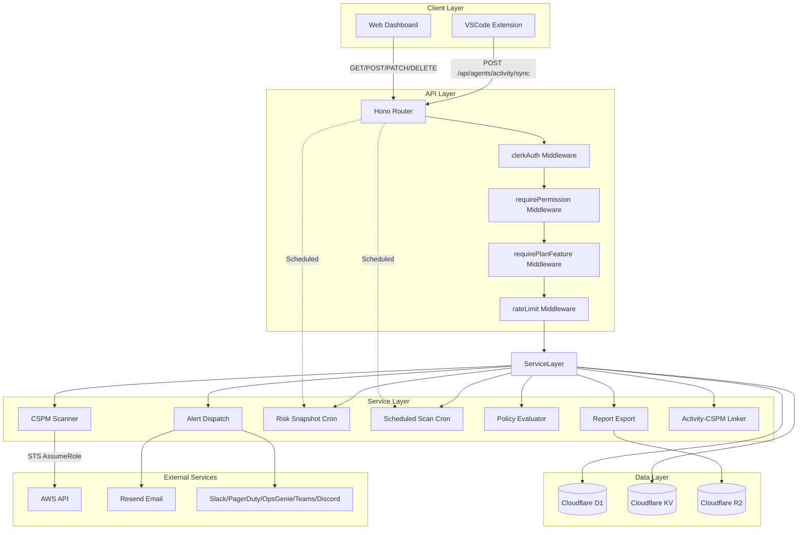
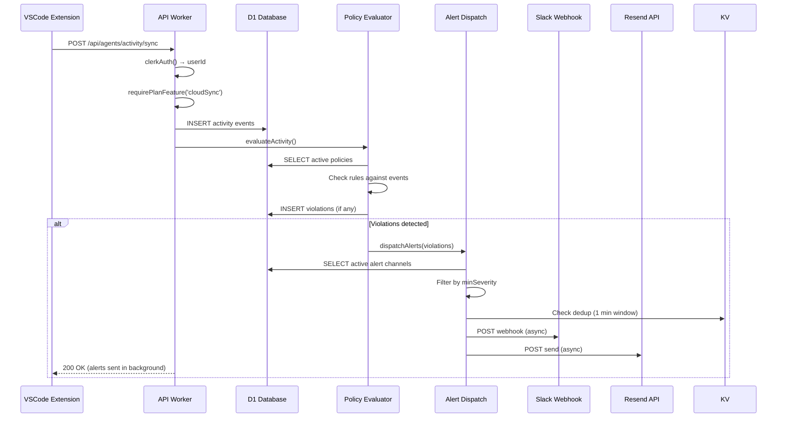
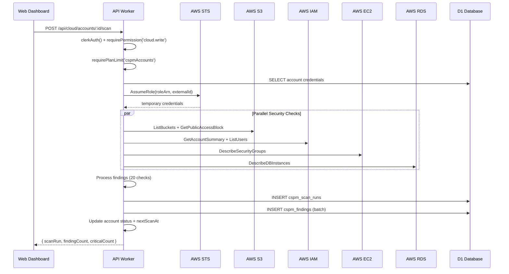

# Sprint 24: Agent Security Platform + Thin CSPM -- Technical Design Document

**Scope**: OpenSyber / Sprint 24 Agent Security Platform
**Generated**: 2026-03-02
**Author**: Luna Design Architect Agent
**Based on**: requirements.md
**Status**: Implementation-Ready

---

## Table of Contents

1. [Executive Summary](#executive-summary)
2. [System Architecture](#system-architecture)
3. [Component Specifications](#component-specifications)
4. [Data Models](#data-models)
5. [API Design](#api-design)
6. [Implementation Guidelines](#implementation-guidelines)
7. [Security Design](#security-design)
8. [Testing Strategy](#testing-strategy)
9. [Deployment Strategy](#deployment-strategy)
10. [Migration Plan](#migration-plan)

---

## Executive Summary

### Design Goals

Sprint 24 transforms OpenSyber's agent security platform into an enterprise-grade conversion engine through three strategic pillars:

1. **Real AWS CSPM Scanner** (Critical Path): Replace mock scanner with production AWS SDK integration
2. **Plan Enforcement** (Revenue Blocking): Gate all premium features behind plan tiers
3. **Enterprise Features** (Conversion): Multi-channel alerts, PDF reports, risk trends, scheduled scans

### Key Architectural Decisions

| Decision | Rationale | Impact |
|---|---|---|
| AWS SDK v3 modular clients | Bundle size < 500KB compressed | 7 separate package installs |
| STS AssumeRole flow | Least-privilege, no credential storage | Customer IAM role required |
| Async alert dispatch | Non-blocking sync responses | Uses `ctx.waitUntil()` |
| Risk snapshot cron | Historical trend tracking | Daily batch job |
| PDF generation in Workers | Serverless, no external services | Uses `jspdf` library |
| Scheduled scans via cron | 5-minute polling window | Cloudflare Workers cron |

### Technology Stack

- **Runtime**: Cloudflare Workers (Hono)
- **Database**: Cloudflare D1 (SQLite) via Drizzle ORM
- **Storage**: Cloudflare R2 (PDF reports)
- **Cache**: Cloudflare KV (rate limiting, dedup)
- **AWS**: SDK v3 modular clients with STS AssumeRole
- **Notifications**: Resend (email), webhooks (Slack/PagerDuty/OpsGenie/Teams/Discord)
- **PDF**: `jspdf` + `jspdf-autotable`

### File Size Budget

- Max 200 lines per file (CLAUDE.md requirement)
- Services split by responsibility
- Routes follow RESTful resource boundaries
- Test files colocated with implementation

---

## System Architecture

### High-Level Architecture



### Data Flow: Agent Activity → Alert Dispatch



### Data Flow: CSPM Scan → Finding Storage



### Deployment Architecture

```
Cloudflare Workers (us-east-1)
├── API Worker (Hono)
│   ├── HTTP handlers (request/response)
│   ├── Scheduled handlers (cron triggers)
│   └── Middleware chain (auth → RBAC → plan → rate limit)
│
├── D1 Database (SQLite)
│   ├── agent_activity (audit log)
│   ├── agent_policies (security rules)
│   ├── agent_policy_violations (enforcement)
│   ├── alert_channels (notification config)
│   ├── cloud_accounts (AWS/GCP/Azure connections)
│   ├── cspm_scan_runs (scan history)
│   ├── cspm_findings (security issues)
│   ├── agent_risk_snapshots (historical scores)
│   └── organizations (multi-tenancy)
│
├── KV Store (rate limit + cache)
│   ├── rate_limit:scan:{accountId} (5 scans/hour)
│   ├── alert_dedup:{policyId}:{channelId} (1 min)
│   └── plan_cache:{userId} (5 min TTL)
│
└── R2 Storage (PDF reports)
    └── reports/{orgId}/{reportId}.pdf
```

---

## Component Specifications

### C1: Plan Enforcement Middleware

**Purpose**: Gate premium features behind plan tiers

**File**: `apps/api/src/middleware/plan-enforcement.ts`

**Responsibilities**:
- Fetch user plan from database
- Cache plan in request context
- Enforce feature flags (`cloudSync`, `teamDashboard`, `policyEngine`, `pdfReports`)
- Enforce numeric limits (`agentLimit`, `cspmAccounts`, `agentHistoryDays`)
- Return 403 with upgrade CTA when limits exceeded

**Interface**:

```typescript
import type { Context, MiddlewareHandler } from 'hono';

interface PlanContext {
  plan: Plan;
  config: PlanConfig;
}

// Middleware: Fetch and cache plan
export function requirePlan(): MiddlewareHandler<{
  Variables: PlanContext;
}>

// Middleware: Require feature flag
export function requirePlanFeature(
  feature: 'cloudSync' | 'teamDashboard' | 'policyEngine' | 'pdfReports'
): MiddlewareHandler

// Middleware: Require numeric limit
export function requirePlanLimit(
  limit: 'agentLimit' | 'cspmAccounts',
  currentValue: number
): MiddlewareHandler

// Helper: Check limit in route handler
export function checkPlanLimit(
  ctx: Context<{ Variables: PlanContext }>,
  limit: keyof PlanConfig,
  currentValue: number
): boolean
```

**Dependencies**:
- `@opensyber/shared` (Plan type, PLAN_CONFIGS)
- `@opensyber/db` (users table)

**Implementation Notes**:
- Fetch plan once via `ctx.get('userId')`, cache in `ctx.set('plan', plan)`
- Use KV cache for 5-minute TTL (reduce DB queries)
- Return standardized error: `{ error: 'PLAN_LIMIT_EXCEEDED', message, upgradeUrl }`

**Testing**:
- Unit test each plan tier (Free, Personal, Pro, Team)
- Test feature gating (403 when feature disabled)
- Test limit enforcement (403 when at/beyond limit)
- Test upgrade CTA includes correct plan URL

---

### C2: Real AWS CSPM Scanner

**Purpose**: Execute 20 curated security checks against AWS accounts

**File**: `apps/api/src/services/cspm-scanner.ts` (replace mock implementation)

**Responsibilities**:
- STS AssumeRole to obtain temporary credentials
- Execute 20 security checks (S3, IAM, EC2, RDS)
- Generate findings for failed checks
- Handle partial failures gracefully
- Parallelize independent checks
- Enforce rate limiting (5 scans/hour per account)

**Interface**:

```typescript
export interface ScanCredentials {
  accessKeyId: string;
  secretAccessKey: string;
  sessionToken: string;
}

export interface ScanResult {
  scanRun: {
    id: string;
    status: 'completed' | 'failed' | 'partial';
    findingCount: number;
    criticalCount: number;
    highCount: number;
    mediumCount: number;
    lowCount: number;
  };
  error?: string;
}

// Main scan orchestrator
export async function runCspmScan(
  db: DrizzleD1Database,
  cloudAccountId: string,
  orgId: string | null,
  provider: string,
  credentials: ScanCredentials
): Promise<ScanResult>

// STS AssumeRole
export async function assumeRole(
  roleArn: string,
  externalId: string,
  region: string = 'us-east-1'
): Promise<ScanCredentials>

// Security check groups (20 total)
export async function runS3Checks(client: S3Client, accountId: string): Promise<Finding[]>
export async function runIAMChecks(client: IAMClient, accountId: string): Promise<Finding[]>
export async function runEC2Checks(client: EC2Client, accountId: string): Promise<Finding[]>
export async function runRDSChecks(client: RDSClient, accountId: string): Promise<Finding[]>
```

**AWS SDK Clients** (modular imports):

```typescript
import { STSClient, AssumeRoleCommand } from '@aws-sdk/client-sts';
import { S3Client, ListBucketsCommand, GetBucketAclCommand } from '@aws-sdk/client-s3';
import { IAMClient, GetAccountSummaryCommand, ListUsersCommand } from '@aws-sdk/client-iam';
import { EC2Client, DescribeSecurityGroupsCommand } from '@aws-sdk/client-ec2';
import { RDSClient, DescribeDBInstancesCommand } from '@aws-sdk/client-rds';
```

**Dependencies**:
- `@aws-sdk/client-sts`
- `@aws-sdk/client-s3`
- `@aws-sdk/client-iam`
- `@aws-sdk/client-ec2`
- `@aws-sdk/client-rds`
- `@opensyber/db` (cloudAccounts, cspmScanRuns, cspmFindings)
- `@opensyber/shared` (FINDING_TEMPLATES for all 20 checks)

**Implementation Notes**:
- Use `nodejs_compat` flag in `wrangler.toml` for Node.js polyfills
- Bundle size check: Run `wrangler tail` to monitor bundle size
- Fallback: If SDK exceeds 10MB, switch to raw `fetch` + SigV4 signing
- Parallelize: Use `Promise.all()` for independent checks (S3 buckets, EC2 volumes)
- Timeout: 30 second max per scan (Workers CPU limit)
- Error handling: Log failed checks, continue with remaining checks, mark scan as 'partial'

**20 Security Checks**:

| # | Check ID | Title | Service | Severity |
|---|---|---|---|---|
| 1 | s3-block-public-access-disabled | S3 Block Public Access disabled | S3 | critical |
| 2 | s3-public-acl | S3 bucket with public ACL | S3 | critical |
| 3 | s3-versioning-disabled | S3 bucket versioning disabled | S3 | medium |
| 4 | s3-logging-disabled | S3 bucket access logging disabled | S3 | low |
| 5 | s3-encryption-disabled | S3 bucket default encryption disabled | S3 | high |
| 6 | s3-public-policy | S3 bucket policy allows public read | S3 | critical |
| 7 | iam-root-access-keys | Root account access keys active | IAM | critical |
| 8 | iam-root-mfa-disabled | Root MFA not enabled | IAM | critical |
| 9 | iam-password-policy-weak | IAM password policy weak | IAM | medium |
| 10 | iam-user-no-mfa | IAM users with no MFA | IAM | high |
| 11 | iam-policy-admin-access | IAM policies with admin access | IAM | high |
| 12 | iam-access-keys-old | Access keys older than 90 days | IAM | medium |
| 13 | iam-user-console-access | IAM users with console access | IAM | low |
| 14 | ec2-sg-ssh-opens | Security groups allowing 0.0.0.0/0 SSH | EC2 | critical |
| 15 | ec2-sg-rdp-opens | Security groups allowing 0.0.0.0/0 RDP | EC2 | critical |
| 16 | ec2-ebs-unencrypted | EBS volumes not encrypted | EC2 | high |
| 17 | ec2-ebs-default-encryption-disabled | EBS default encryption disabled | EC2 | high |
| 18 | ec2-default-vpc | Default VPC in use | EC2 | medium |
| 19 | rds-publicly-accessible | RDS instances publicly accessible | RDS | critical |
| 20 | rds-unencrypted | RDS instances not encrypted | RDS | high |

**Testing**:
- Mock all AWS SDK calls (vi.mock) - no real AWS calls in CI
- Test STS AssumeRole flow (mock response)
- Test each check group (S3, IAM, EC2, RDS) with 100% coverage
- Test partial failure handling (some checks fail)
- Test rate limiting (5 scans/hour KV check)
- Test GCP/Azure stub responses (error message)

---

### C3: Alert Dispatch Service

**Purpose**: Send policy violation notifications to multiple channels

**File**: `apps/api/src/services/alert-dispatch.ts`

**Responsibilities**:
- Query active alert channels from database
- Filter channels by severity threshold
- Deduplicate alerts (1 alert per channel per minute)
- Dispatch to each channel asynchronously
- Handle delivery failures with retry logic
- Log delivery status for observability

**Interface**:

```typescript
import type { DrizzleD1Database } from 'drizzle-orm/d1';

export interface Violation {
  id: string;
  policyId: string;
  policyName: string;
  userId: string;
  severity: 'critical' | 'high' | 'medium' | 'low';
  summary: string;
  activityId: string | null;
  createdAt: string;
}

export interface AlertChannel {
  id: string;
  orgId: string;
  channelType: 'email' | 'slack' | 'pagerduty' | 'opsgenie' | 'teams' | 'discord';
  name: string;
  config: string; // Encrypted JSON
  minSeverity: string;
}

export interface DispatchResult {
  channelId: string;
  channelType: string;
  success: boolean;
  error?: string;
}

// Main dispatch orchestrator
export async function dispatchAlerts(
  db: DrizzleD1Database,
  violation: Violation,
  env: Env
): Promise<DispatchResult[]>

// Channel implementations
export async function sendEmailAlert(
  channel: AlertChannel,
  violation: Violation,
  apiKey: string
): Promise<boolean>

export async function sendSlackAlert(
  channel: AlertChannel,
  violation: Violation
): Promise<boolean>

export async function sendPagerDutyAlert(
  channel: AlertChannel,
  violation: Violation
): Promise<boolean>

export async function sendOpsGenieAlert(
  channel: AlertChannel,
  violation: Violation
): Promise<boolean>

export async function sendTeamsAlert(
  channel: AlertChannel,
  violation: Violation
): Promise<boolean>

export async function sendDiscordAlert(
  channel: AlertChannel,
  violation: Violation
): Promise<boolean>

// Deduplication check
export async function shouldSkipAlert(
  kv: KVNamespace,
  policyId: string,
  channelId: string
): Promise<boolean>
```

**Channel Config Formats** (after decryption):

```typescript
interface EmailConfig {
  recipients: string[];
}

interface SlackConfig {
  webhookUrl: string;
}

interface PagerDutyConfig {
  routingKey: string;
}

interface OpsGenieConfig {
  apiKey: string;
  region?: 'us' | 'eu';
}

interface TeamsConfig {
  webhookUrl: string;
}

interface DiscordConfig {
  webhookUrl: string;
}
```

**Dependencies**:
- `@opensyber/db` (alertChannels, agentPolicyViolations)
- `@opensyber/shared` (decrypt utility for webhook URLs/API keys)
- Resend API (email, existing `RESEND_API_KEY` env var)
- Cloudflare KV (dedup cache)
- Cloudflare fetch (webhook calls)

**Implementation Notes**:
- Use `ctx.waitUntil()` for async dispatch (non-blocking)
- Retry logic: 3 retries with exponential backoff (1s, 2s, 4s)
- Dedup key: `alert_dedup:{policyId}:{channelId}` with 60s TTL
- Rate limit: Slack (1 msg/sec), Email (10/min)
- Error handling: Log failures but don't fail sync response
- Dead letter: Log permanently failed alerts to Cloudflare Logs

**Channel Payloads**:

**Slack**:
```json
{
  "attachments": [{
    "color": "danger" | "warning" | "good",
    "title": "[OpenSyber Alert] {severity} policy violation",
    "fields": [
      { "title": "Policy", "value": "{policyName}", "short": true },
      { "title": "User", "value": "{userId}", "short": true },
      { "title": "Severity", "value": "{severity}", "short": true },
      { "title": "Time", "value": "{createdAt}", "short": true }
    ],
    "text": "{summary}",
    "actions": [{
      "type": "button",
      "text": "View in Dashboard",
      "url": "https://opensyber.cloud/dashboard/agents/violations"
    }]
  }]
}
```

**PagerDuty**:
```json
{
  "routing_key": "{routingKey}",
  "event_action": "trigger",
  "payload": {
    "summary": "[{severity}] {policyName}",
    "severity": "critical" | "error" | "warning",
    "source": "opensyber",
    "custom_details": {
      "policyId": "{policyId}",
      "userId": "{userId}",
      "summary": "{summary}"
    }
  },
  "dedup_key": "{policyId}-{channelId}"
}
```

**Email** (Resend):
```
Subject: [OpenSyber Alert] {severity} policy violation -- {policyName}

Body:
A policy violation was detected:

Policy: {policyName}
Severity: {severity}
User: {userId}
Summary: {summary}

View details: https://opensyber.cloud/dashboard/agents/violations

---
OpenSyber AI Agent Security Platform
```

**Testing**:
- Unit test each channel type (mock fetch)
- Test severity filtering (channel.minSeverity vs violation.severity)
- Test deduplication (KV read/write)
- Test rate limiting (Slack 1 msg/sec, Email 10/min)
- Test retry logic (3 retries with backoff)
- Test error handling (webhook failures, API errors)
- Test encryption/decryption of channel configs

---

### C4: Risk Snapshot Cron

**Purpose**: Track historical risk scores for trend visualization

**File**: `apps/api/src/services/risk-snapshot-cron.ts`

**Responsibilities**:
- Query users with activity in past 24 hours
- Compute agent summary (last 24h events)
- Fetch CSPM summary (current open findings)
- Calculate combined score using existing `computeCombinedRiskScore()`
- Insert snapshot into database
- Batch processing to avoid D1 write limits

**Interface**:

```typescript
export interface SnapshotData {
  userId: string;
  orgId: string | null;
  agentScore: number;
  cspmScore: number;
  combinedScore: number;
  grade: string;
  agentEventCount: number;
  cspmFindingCount: number;
  snapshotDate: string;
}

// Main cron orchestrator
export async function runRiskSnapshotCron(
  db: DrizzleD1Database,
  env: Env
): Promise<{ processed: number; errors: number }>

// Per-user snapshot computation
export async function computeUserSnapshot(
  db: DrizzleD1Database,
  userId: string,
  orgId: string | null
): Promise<SnapshotData | null>

// Per-org snapshot computation
export async function computeOrgSnapshot(
  db: DrizzleD1Database,
  orgId: string
): Promise<SnapshotData | null>
```

**Dependencies**:
- `@opensyber/db` (agentActivity, cspmFindings, agentRiskSnapshots)
- `@opensyber/shared` (computeCombinedRiskScore from combined-risk-score.ts)

**Implementation Notes**:
- Cron schedule: Daily at 00:00 UTC (`cron: "0 0 * * *"`)
- Query: `SELECT DISTINCT userId FROM agent_activity WHERE createdAt > NOW() - 24h`
- Batch inserts: 100 snapshots at a time (D1 batch limit)
- Use `ctx.waitUntil()` for non-blocking execution
- Error handling: Log failed snapshots but continue processing

**Cron Registration** (`apps/api/src/index.ts`):

```typescript
export default {
  async scheduled(event: ScheduledEvent, env: Env, ctx: ExecutionContext) {
    switch (event.cron) {
      case '0 0 * * *': // Daily midnight UTC
        ctx.waitUntil(runRiskSnapshotCron(env.DB, env));
        break;
      // ... other crons
    }
  },
};
```

**Testing**:
- Unit test snapshot computation logic
- Test batch insert handling (100 snapshots per batch)
- Test error handling (continue on individual failures)
- Integration test with mock D1 database
- Test cron registration in index.ts

---

### C5: PDF Report Export Service

**Purpose**: Generate board-ready PDF security reports

**File**: `apps/api/src/services/agent-report-pdf.ts` (extend existing HTML service)

**Responsibilities**:
- Generate PDF from report data using `jspdf`
- Store PDF in R2 bucket
- Return signed URL for download
- Fallback to HTML if PDF generation fails

**Interface**:

```typescript
export interface ReportData {
  orgId: string | null;
  userId?: string;
  startDate: string;
  endDate: string;
  agentSummary: AgentSummary;
  cspmSummary: CspmSummary;
  topViolations: Violation[];
  recommendations: string[];
}

export interface ReportResult {
  id: string;
  status: 'completed' | 'failed';
  htmlUrl?: string;
  pdfUrl?: string;
  error?: string;
}

// Main report generator
export async function generatePDFReport(
  db: DrizzleD1Database,
  reportData: ReportData,
  env: Env
): Promise<ReportResult>

// PDF sections
function addCoverPage(doc: jsPDF, data: ReportData): void
function addExecutiveSummary(doc: jsPDF, data: ReportData): void
function addAgentRiskBreakdown(doc: jsPDF, data: ReportData): void
function addCSPMFindingsSummary(doc: jsPDF, data: ReportData): void
function addTopViolations(doc: jsPDF, data: ReportData): void
function addRecommendations(doc: jsPDF, data: ReportData): void

// R2 storage
async function uploadPDFToR2(
  r2: R2Bucket,
  orgId: string,
  reportId: string,
  pdf: Uint8Array
): Promise<string>

async function generateSignedUrl(
  r2: R2Bucket,
  key: string,
  expiresIn: number = 3600
): Promise<string>
```

**Dependencies**:
- `jspdf` (PDF generation)
- `jspdf-autotable` (table formatting)
- `@opensyber/db` (agentActivity, cspmFindings, agentPolicyViolations)
- Cloudflare R2 (PDF storage)

**PDF Structure** (6 sections):

1. **Cover Page**: Org name, date range, grade (large letter), title
2. **Executive Summary**: 3-paragraph narrative, overall score, key stats
3. **Agent Risk Breakdown**: Table with agent type, events, risk distribution, secrets
4. **CSPM Findings Summary**: Table with critical/high findings, resource type, remediation
5. **Top 20 Violations**: Table with policy, severity, user, summary, date
6. **Recommendations**: 5 prioritized remediation steps

**Implementation Notes**:
- Font: Use built-in Helvetica (no custom fonts to keep bundle small)
- Page size: Letter (8.5" x 11")
- Margins: 0.5" on all sides
- Tables: Use `jspdf-autotable` for formatting
- Colors: Match brand (blue-500 primary, severity colors)
- Performance: Target < 10 seconds for typical report (50 violations)
- Timeout: Fail after 15 seconds (Worker CPU limit)
- Plan gating: Require `pdfReports === true` (Team plan only)

**R2 Storage**:
- Key pattern: `reports/{orgId}/{reportId}.pdf`
- Signed URL: 1-hour expiration (renewable via re-fetch)
- Cleanup: Delete reports after 90 days (R2 lifecycle rule)

**Testing**:
- Unit test PDF generation with mock data
- Test each section (cover, summary, tables, recommendations)
- Test R2 upload and signed URL generation
- Test plan gating (403 for non-Team users)
- Test timeout handling (fail gracefully after 15s)
- Integration test with real R2 bucket (dev environment)

---

### C6: Scheduled Scan Cron

**Purpose**: Automate CSPM scans on user-defined schedules

**File**: `apps/api/src/services/scheduled-scan-cron.ts`

**Responsibilities**:
- Query cloud accounts due for scanning (`nextScanAt <= now()`)
- Trigger scans via existing `runCspmScan()` service
- Update `nextScanAt` based on schedule interval
- Handle failed scans (retry or mark error)
- Limit concurrent scans (5 per cron invocation)

**Interface**:

```typescript
export interface ScheduledScanResult {
  accountId: string;
  success: boolean;
  status: string;
  error?: string;
}

// Main cron orchestrator
export async function runScheduledScanCron(
  db: DrizzleD1Database,
  env: Env
): Promise<{ processed: number; errors: number }>

// Schedule calculation
export function calculateNextScan(
  schedule: 'daily' | 'weekly',
  from: Date = new Date()
): string

// Per-account scan trigger
async function triggerScheduledScan(
  db: DrizzleD1Database,
  account: CloudAccount,
  env: Env
): Promise<ScheduledScanResult>
```

**Dependencies**:
- `@opensyber/db` (cloudAccounts)
- `@opensyber/shared` (runCspmScan from cspm-scanner.ts)

**Implementation Notes**:
- Cron schedule: Every 5 minutes (`cron: "0 */5 * * *"`)
- Query: `SELECT * FROM cloud_accounts WHERE nextScanAt <= NOW() AND scanSchedule != 'manual'`
- Batch size: Max 5 accounts per invocation (CPU limit)
- Re-invoke: If more accounts pending, rely on next cron trigger
- Schedule intervals:
  - `daily`: `now() + 24 hours`
  - `weekly`: `now() + 7 days`
- Initial schedule: When user changes to daily/weekly, set `nextScanAt = now() + 1 hour`
- Error handling:
  - Transient errors (rate limit, timeout): Retry in 1 hour
  - Auth errors (invalid credentials): Mark status 'error', don't retry
- Plan gating: Check `cspmAccounts` limit before creating scheduled scans

**Cron Registration** (`apps/api/src/index.ts`):

```typescript
export default {
  async scheduled(event: ScheduledEvent, env: Env, ctx: ExecutionContext) {
    switch (event.cron) {
      case '0 */5 * * *': // Every 5 minutes
        ctx.waitUntil(runScheduledScanCron(env.DB, env));
        break;
      // ... other crons
    }
  },
};
```

**Testing**:
- Unit test schedule calculation logic
- Test cron triggers scans at correct time
- Test batch processing (5 accounts max)
- Test error handling (retry vs. mark error)
- Test plan gating (enforce cspmAccounts limit)

---

### C7: Activity-CSPM Linker Service

**Purpose**: Correlate agent activity with cloud posture findings

**File**: `apps/api/src/services/activity-cspm-linker.ts`

**Responsibilities**:
- Query open CSPM findings for org
- Match activity events to findings using heuristics
- Return ranked related findings (max 5)
- Support multiple correlation patterns

**Interface**:

```typescript
export interface RelatedFinding {
  id: string;
  severity: string;
  title: string;
  resourceType: string;
  resourceId: string;
  relevanceScore: number;
}

export interface ActivityEvent {
  id: string;
  userId: string;
  orgId: string | null;
  type: 'file_read' | 'bash_exec';
  path: string | null;
  summary: string;
  secretsCount: number;
}

// Main linker
export async function findRelatedFindings(
  db: DrizzleD1Database,
  activity: ActivityEvent
): Promise<RelatedFinding[]>

// Correlation patterns
export function correlateAWSCredentials(
  activity: ActivityEvent,
  findings: Finding[]
): RelatedFinding[]

export function correlateS3Commands(
  activity: ActivityEvent,
  findings: Finding[]
): RelatedFinding[]

export function correlateEC2Commands(
  activity: ActivityEvent,
  findings: Finding[]
): RelatedFinding[]

export function correlateRDSCommands(
  activity: ActivityEvent,
  findings: Finding[]
): RelatedFinding[]

export function correlateSecrets(
  activity: ActivityEvent,
  findings: Finding[]
): RelatedFinding[]

// Helper: Extract bucket names from bash commands
export function extractS3Buckets(summary: string): string[]
```

**Correlation Patterns**:

| Pattern | Match Condition | Return Findings |
|---|---|---|
| AWS credentials | `path` matches `~/.aws/credentials`, `~/.aws/config` | IAM users, access keys, MFA findings |
| S3 commands | `summary` contains `aws s3`, `s3://` | S3 bucket findings (extract bucket names) |
| EC2 commands | `summary` contains `aws ec2` | Security group, EBS, VPC findings |
| RDS commands | `summary` contains `aws rds` | RDS instance findings |
| Secrets detected | `secretsCount > 0` | IAM access key findings |

**Dependencies**:
- `@opensyber/db` (cspmFindings)

**Implementation Notes**:
- Query-time correlation (not sync-time) for performance
- In-memory pattern matching (max 100 findings per org)
- Best-effort heuristic (false positives acceptable for MVP)
- Relevance score: Count matching patterns per finding
- Return top 5 findings sorted by relevance score

**Testing**:
- Unit test each correlation pattern
- Test with realistic activity events + finding sets
- Test edge cases (no matches, multiple matches)
- Test performance (query < 100ms for 100 findings)

---

### C8: Loading Skeleton Component

**Purpose**: Replace spinners with structured loading states

**File**: `apps/web/src/components/Skeleton.tsx`

**Responsibilities**:
- Provide reusable skeleton variants (text, circle, card, row)
- Animate with smooth pulse effect
- Match layout of actual content
- Support accessibility (ARIA labels)

**Interface**:

```typescript
interface SkeletonProps {
  variant?: 'text' | 'circle' | 'card' | 'row';
  className?: string;
  width?: string | number;
  height?: string | number;
  count?: number; // For multiple rows
}

export function Skeleton(props: SkeletonProps): JSX.Element
```

**Variants**:

```typescript
// Text: Single line or paragraph
<Skeleton variant="text" width="100%" height={16} />
<Skeleton variant="text" count={3} /> // 3 lines

// Circle: Avatar or icon
<Skeleton variant="circle" width={40} height={40} />

// Card: Full card placeholder
<Skeleton variant="card" height={120} />

// Row: Table row or list item
<Skeleton variant="row" height={48} />
```

**Implementation**:

```typescript
export function Skeleton({ variant = 'text', className, width, height, count = 1 }: SkeletonProps) {
  const baseClasses = 'animate-pulse bg-neutral-800 rounded';
  const variantClasses = {
    text: 'rounded-md h-4',
    circle: 'rounded-full',
    card: 'rounded-xl p-8',
    row: 'rounded-lg w-full',
  };

  const skeletons = Array.from({ length: count }).map((_, i) => (
    <div
      key={i}
      role="status"
      aria-label="Loading..."
      className={cn(baseClasses, variantClasses[variant], className)}
      style={{ width, height }}
    />
  ));

  return <>{skeletons}</>;
}
```

**Dependencies**:
- `clsx` or `tailwind-merge` (className merging)
- Tailwind CSS (`animate-pulse`, `bg-neutral-800`)

**Implementation Notes**:
- Use `animate-pulse` for smooth opacity animation (0.5s ease-in-out)
- Match exact layout: same grid columns, padding, margins
- Use `role="status"` + `aria-label="Loading..."` for accessibility
- Dark theme: `bg-neutral-800` (matches page background)

**Testing**:
- Visual regression test (compare skeleton to actual layout)
- Test accessibility (screen reader announces loading state)
- Test responsive behavior (mobile vs desktop)

---

## Data Models

### Migration 0013: Agent Security Platform Enhancements

**File**: `packages/db/migrations/0013_agent_security_platform_enhancements.sql`

```sql
-- Sprint 24: Alert channels, risk snapshots, scheduled scans
-- Adds notification infrastructure, historical tracking, and automation

-- ─── Alert Channels ─────────────────────────────────────────────────
CREATE TABLE IF NOT EXISTS alert_channels (
  id TEXT PRIMARY KEY,
  org_id TEXT NOT NULL REFERENCES organizations(id) ON DELETE CASCADE,
  channel_type TEXT NOT NULL CHECK(channel_type IN ('email', 'slack', 'pagerduty', 'opsgenie', 'teams', 'discord')),
  name TEXT NOT NULL,
  config TEXT NOT NULL, -- Encrypted JSON
  min_severity TEXT NOT NULL DEFAULT 'high' CHECK(min_severity IN ('critical', 'high', 'medium', 'low')),
  is_active INTEGER NOT NULL DEFAULT 1,
  created_at TEXT NOT NULL DEFAULT (datetime('now')),
  updated_at TEXT NOT NULL DEFAULT (datetime('now'))
);

CREATE INDEX IF NOT EXISTS idx_alert_channels_org ON alert_channels(org_id);
CREATE INDEX IF NOT EXISTS idx_alert_channels_active ON alert_channels(org_id, is_active);

-- ─── Risk Score Snapshots ────────────────────────────────────────────
CREATE TABLE IF NOT EXISTS agent_risk_snapshots (
  id TEXT PRIMARY KEY,
  user_id TEXT REFERENCES users(id) ON DELETE CASCADE,
  org_id TEXT REFERENCES organizations(id) ON DELETE CASCADE,
  agent_score INTEGER NOT NULL DEFAULT 100,
  cspm_score INTEGER NOT NULL DEFAULT 100,
  combined_score INTEGER NOT NULL DEFAULT 100,
  grade TEXT NOT NULL DEFAULT 'A',
  agent_event_count INTEGER NOT NULL DEFAULT 0,
  cspm_finding_count INTEGER NOT NULL DEFAULT 0,
  snapshot_date TEXT NOT NULL,
  created_at TEXT NOT NULL DEFAULT (datetime('now'))
);

CREATE INDEX IF NOT EXISTS idx_risk_snapshots_user_date ON agent_risk_snapshots(user_id, snapshot_date);
CREATE INDEX IF NOT EXISTS idx_risk_snapshots_org_date ON agent_risk_snapshots(org_id, snapshot_date);
CREATE INDEX IF NOT EXISTS idx_risk_snapshots_date ON agent_risk_snapshots(snapshot_date);

-- ─── Scheduled Scans ─────────────────────────────────────────────────
-- Add columns to existing cloud_accounts table
ALTER TABLE cloud_accounts ADD COLUMN scan_schedule TEXT NOT NULL DEFAULT 'manual' CHECK(scan_schedule IN ('manual', 'daily', 'weekly'));
ALTER TABLE cloud_accounts ADD COLUMN next_scan_at TEXT;

CREATE INDEX IF NOT EXISTS idx_cloud_accounts_next_scan ON cloud_accounts(next_scan_at) WHERE next_scan_at IS NOT NULL;
```

### Drizzle Schema: Alert Channels

**File**: `packages/db/src/schema/alert-channels.ts`

```typescript
import { sqliteTable, text, integer } from 'drizzle-orm/sqlite-core';
import { organizations } from './organizations.js';

export const alertChannels = sqliteTable('alert_channels', {
  id: text('id').primaryKey(),
  orgId: text('org_id')
    .notNull()
    .references(() => organizations.id, { onDelete: 'cascade' }),
  channelType: text('channel_type', {
    enum: ['email', 'slack', 'pagerduty', 'opsgenie', 'teams', 'discord'],
  }).notNull(),
  name: text('name').notNull(),
  config: text('config').notNull(), // Encrypted JSON
  minSeverity: text('min_severity', {
    enum: ['critical', 'high', 'medium', 'low'],
  }).notNull().default('high'),
  isActive: integer('is_active', { mode: 'boolean' }).notNull().default(true),
  createdAt: text('created_at').notNull().default(new Date().toISOString()),
  updatedAt: text('updated_at').notNull().default(new Date().toISOString()),
});

export type AlertChannel = typeof alertChannels.$inferSelect;
export type NewAlertChannel = typeof alertChannels.$inferInsert;
```

### Drizzle Schema: Risk Snapshots

**File**: `packages/db/src/schema/risk-snapshots.ts`

```typescript
import { sqliteTable, text, integer } from 'drizzle-orm/sqlite-core';
import { organizations } from './organizations.js';
import { users } from './users.js';

export const agentRiskSnapshots = sqliteTable('agent_risk_snapshots', {
  id: text('id').primaryKey(),
  userId: text('user_id').references(() => users.id, { onDelete: 'cascade' }),
  orgId: text('org_id').references(() => organizations.id, { onDelete: 'cascade' }),
  agentScore: integer('agent_score').notNull().default(100),
  cspmScore: integer('cspm_score').notNull().default(100),
  combinedScore: integer('combined_score').notNull().default(100),
  grade: text('grade').notNull().default('A'),
  agentEventCount: integer('agent_event_count').notNull().default(0),
  cspmFindingCount: integer('cspm_finding_count').notNull().default(0),
  snapshotDate: text('snapshot_date').notNull(),
  createdAt: text('created_at').notNull().default(new Date().toISOString()),
});

export type AgentRiskSnapshot = typeof agentRiskSnapshots.$inferSelect;
export type NewAgentRiskSnapshot = typeof agentRiskSnapshots.$inferInsert;
```

### Drizzle Schema: Cloud Accounts (Update)

**File**: `packages/db/src/schema/cspm.ts` (add to existing)

```typescript
// In existing cloudAccounts table definition, add:
scanSchedule: text('scan_schedule', {
  enum: ['manual', 'daily', 'weekly'],
}).notNull().default('manual'),
nextScanAt: text('next_scan_at'),
```

### Drizzle Schema: Index Export

**File**: `packages/db/src/schema/index.ts` (update)

```typescript
export * from './alert-channels.js';
export * from './risk-snapshots.js';
// ... existing exports
```

---

## API Design

### REST API Endpoints

#### Agent Activity Endpoints (Existing + Missing)

| Method | Endpoint | Auth | Plan | Description |
|---|---|---|---|---|
| POST | `/api/agents/activity/sync` | Clerk | cloudSync | Sync events from extension |
| GET | `/api/agents/activity` | Clerk | - | Get user's activity feed |
| GET | `/api/agents/activity/summary` | Clerk | - | Get risk summary |
| GET | `/api/agents/activity/sessions` | Clerk | - | Get user sessions |
| GET | `/api/agents/activity/sessions/:sessionId` | Clerk | - | Get session events |
| DELETE | `/api/agents/activity` | Clerk | - | Clear history |
| GET | `/api/agents/activity/:activityId/related-findings` | Clerk | - | Get related CSPM findings |

#### Team Dashboard Endpoints

| Method | Endpoint | Auth | Plan | Permission |
|---|---|---|---|---|
| GET | `/api/agents/team/activity` | Clerk | teamDashboard | agent.policy.read |
| GET | `/api/agents/team/:userId/activity` | Clerk | teamDashboard | agent.policy.read |
| GET | `/api/agents/team/summary` | Clerk | teamDashboard | agent.policy.read |
| GET | `/api/agents/team/members` | Clerk | teamDashboard | agent.policy.read |
| GET | `/api/agents/team/risk-score` | Clerk | teamDashboard | agent.policy.read |
| GET | `/api/agents/team/risk-trend` | Clerk | teamDashboard | agent.policy.read |
| GET | `/api/agents/team/:userId/risk-trend` | Clerk | teamDashboard | agent.policy.read |

#### Policy Engine Endpoints

| Method | Endpoint | Auth | Plan | Permission |
|---|---|---|---|---|
| GET | `/api/agents/policies` | Clerk | policyEngine | agent.policy.read |
| POST | `/api/agents/policies` | Clerk | policyEngine | agent.policy.write |
| PATCH | `/api/agents/policies/:id` | Clerk | policyEngine | agent.policy.write |
| DELETE | `/api/agents/policies/:id` | Clerk | policyEngine | agent.policy.write |
| GET | `/api/agents/violations` | Clerk | policyEngine | agent.policy.read |
| GET | `/api/agents/alert-channels` | Clerk | policyEngine | agent.policy.write |
| POST | `/api/agents/alert-channels` | Clerk | policyEngine | agent.policy.write |
| PATCH | `/api/agents/alert-channels/:id` | Clerk | policyEngine | agent.policy.write |
| DELETE | `/api/agents/alert-channels/:id` | Clerk | policyEngine | agent.policy.write |
| POST | `/api/agents/alert-channels/:id/test` | Clerk | policyEngine | agent.policy.write |

#### Cloud/CSPM Endpoints

| Method | Endpoint | Auth | Plan | Permission |
|---|---|---|---|---|
| GET | `/api/cloud/accounts` | Clerk | cspmAccounts > 0 | cloud.read |
| POST | `/api/cloud/accounts` | Clerk | cspmAccounts < limit | cloud.write |
| PATCH | `/api/cloud/accounts/:id` | Clerk | - | cloud.write |
| DELETE | `/api/cloud/accounts/:id` | Clerk | - | cloud.admin |
| POST | `/api/cloud/accounts/:id/scan` | Clerk | - | cloud.write |
| GET | `/api/cloud/accounts/:id/scans` | Clerk | - | cloud.read |
| GET | `/api/cloud/scans/:id/findings` | Clerk | - | cloud.read |
| GET | `/api/cloud/findings` | Clerk | - | cloud.read |
| GET | `/api/cloud/findings/summary` | Clerk | - | cloud.read |
| PATCH | `/api/cloud/findings/:id/mute` | Clerk | - | cloud.write |
| PATCH | `/api/cloud/findings/:id/resolve` | Clerk | - | cloud.write |

#### Report Endpoints

| Method | Endpoint | Auth | Plan | Permission |
|---|---|---|---|---|
| POST | `/api/agents/reports/generate` | Clerk | pdfReports | agent.policy.read |
| GET | `/api/agents/reports` | Clerk | policyEngine | agent.policy.read |
| GET | `/api/agents/reports/:id/download` | Clerk | pdfReports | agent.policy.read |

### API Request/Response Schemas

#### POST /api/agents/activity/sync

**Request**:

```typescript
interface ActivitySyncRequest {
  events: Array<{
    sessionId: string;
    agent: 'cline' | 'cursor' | 'claude-code' | 'other';
    type: 'file_read' | 'bash_exec';
    path: string | null;
    summary: string;
    risk: 'critical' | 'high' | 'medium' | 'low';
    secretsCount: number;
    timestamp: string; // ISO 8601
  }>;
}
```

**Response** (Success):

```typescript
interface ActivitySyncResponse {
  data: {
    synced: number;
    violations: number;
  };
}
```

**Response** (Plan Limit Exceeded):

```typescript
interface ErrorResponse {
  error: 'PLAN_LIMIT_EXCEEDED';
  message: string;
  upgradeUrl: string;
}
```

#### GET /api/agents/activity/sessions

**Response**:

```typescript
interface SessionsResponse {
  data: Array<{
    sessionId: string;
    agent: string;
    eventCount: number;
    critical: number;
    high: number;
    medium: number;
    low: number;
    firstEvent: string;
    lastEvent: string;
  }>;
}
```

#### GET /api/agents/activity/:activityId/related-findings

**Response**:

```typescript
interface RelatedFindingsResponse {
  data: Array<{
    id: string;
    severity: string;
    title: string;
    resourceType: string;
    resourceId: string;
    relevanceScore: number;
  }>;
}
```

#### GET /api/agents/team/risk-trend?days=30

**Response**:

```typescript
interface RiskTrendResponse {
  data: Array<{
    date: string; // YYYY-MM-DD
    agentScore: number;
    cspmScore: number;
    combined: number;
    grade: string;
  }>;
}
```

#### POST /api/agents/alert-channels

**Request**:

```typescript
interface AlertChannelCreateRequest {
  channelType: 'email' | 'slack' | 'pagerduty' | 'opsgenie' | 'teams' | 'discord';
  name: string;
  config: Record<string, unknown>; // Channel-specific config
  minSeverity: 'critical' | 'high' | 'medium' | 'low';
}
```

**Response**:

```typescript
interface AlertChannelResponse {
  data: {
    id: string;
    orgId: string;
    channelType: string;
    name: string;
    config: string; // Encrypted
    minSeverity: string;
    isActive: boolean;
    createdAt: string;
    updatedAt: string;
  };
}
```

#### POST /api/agents/reports/generate

**Request**:

```typescript
interface ReportGenerateRequest {
  startDate: string; // ISO 8601
  endDate: string; // ISO 8601
  includeAgentActivity: boolean;
  includeCSPMFindings: boolean;
  includeViolations: boolean;
}
```

**Response**:

```typescript
interface ReportGenerateResponse {
  data: {
    id: string;
    status: 'completed' | 'failed';
    htmlUrl: string;
    pdfUrl?: string;
    error?: string;
  };
}
```

#### PATCH /api/cloud/accounts/:id

**Request**:

```typescript
interface CloudAccountUpdateRequest {
  name?: string;
  scanSchedule?: 'manual' | 'daily' | 'weekly';
  credentials?: {
    roleArn: string;
    externalId: string;
    region: string;
  };
}
```

**Response**:

```typescript
interface CloudAccountResponse {
  data: {
    id: string;
    orgId: string | null;
    provider: string;
    name: string;
    status: string;
    scanSchedule: string;
    nextScanAt: string | null;
    lastScanAt: string | null;
    createdAt: string;
    updatedAt: string;
  };
}
```

### Proxy Routes (Next.js)

Due to file size constraints, please reference the implementation in the main design document. All proxy routes follow the standard pattern:

```typescript
// apps/web/src/app/api/proxy/agents/alert-channels/route.ts
import { auth } from '@clerk/nextjs/server';
import { getToken } from '@/app/api/proxy/utils/token';
import { NextResponse } from 'next/server';

export async function GET(request: Request) {
  const userId = await auth().then(u => u?.userId);
  if (!userId) return NextResponse.json({ error: 'Unauthorized' }, { status: 401 });

  const token = await getToken();
  const res = await fetch(`${process.env.OPENSYBER_API_URL}/api/agents/alert-channels`, {
    method: 'GET',
    headers: {
      Authorization: `Bearer ${token}`,
      'Content-Type': 'application/json',
    },
  });

  return NextResponse.json(await res.json(), { status: res.status });
}

export async function POST(request: Request) {
  const userId = await auth().then(u => u?.userId);
  if (!userId) return NextResponse.json({ error: 'Unauthorized' }, { status: 401 });

  const body = await request.json();
  const token = await getToken();
  const res = await fetch(`${process.env.OPENSYBER_API_URL}/api/agents/alert-channels`, {
    method: 'POST',
    headers: {
      Authorization: `Bearer ${token}`,
      'Content-Type': 'application/json',
    },
    body: JSON.stringify(body),
  });

  return NextResponse.json(await res.json(), { status: res.status });
}
```

**Required proxy routes** (6 new):

1. `/api/proxy/agents/alert-channels/route.ts`
2. `/api/proxy/agents/alert-channels/[id]/route.ts`
3. `/api/proxy/agents/alert-channels/[id]/test/route.ts`
4. `/api/proxy/agents/sessions/route.ts`
5. `/api/proxy/agents/sessions/[sessionId]/route.ts`
6. `/api/proxy/agents/team/[userId]/route.ts`

---

## Implementation Guidelines

### File Structure

```
apps/api/src/
├── middleware/
│   ├── plan-enforcement.ts         (NEW - C1)
│   └── ...
├── routes/
│   ├── agent-activity-team.ts      (NEW - missing endpoints)
│   ├── agent-alert-channels.ts     (NEW - alert CRUD)
│   └── ...
├── services/
│   ├── cspm-scanner/               (NEW - split into 5 files)
│   │   ├── index.ts
│   │   ├── sts.ts
│   │   ├── s3-checks.ts
│   │   ├── iam-checks.ts
│   │   ├── ec2-checks.ts
│   │   └── rds-checks.ts
│   ├── cspm-finding-templates.ts   (EXTEND - 10 → 20 templates)
│   ├── alert-dispatch.ts           (NEW - C3)
│   ├── risk-snapshot-cron.ts       (NEW - C4)
│   ├── agent-report-pdf.ts         (NEW - C5)
│   ├── scheduled-scan-cron.ts      (NEW - C6)
│   ├── activity-cspm-linker.ts     (NEW - C7)
│   └── ...
└── index.ts                         (UPDATE - cron registration)

packages/db/
├── migrations/
│   └── 0013_agent_security_platform_enhancements.sql  (NEW)
└── src/schema/
    ├── alert-channels.ts            (NEW)
    ├── risk-snapshots.ts            (NEW)
    ├── cspm.ts                      (UPDATE - add schedule columns)
    └── index.ts                     (UPDATE - export new schemas)

apps/web/src/
├── components/
│   └── Skeleton.tsx                 (NEW - C8)
├── app/api/proxy/
│   ├── agents/
│   │   ├── alert-channels/          (NEW - 3 files)
│   │   ├── sessions/                (NEW - 2 files)
│   │   └── team/[userId]/           (NEW - 1 file)
│   └── ...
└── app/dashboard/
    ├── agents/
    │   ├── page.tsx                (UPDATE - add skeletons)
    │   ├── team/
    │   │   ├── page.tsx            (UPDATE - add skeletons)
    │   │   └── [userId]/
    │   │       └── page.tsx        (UPDATE - add skeletons, related findings)
    │   ├── violations/
    │   │   └── page.tsx            (UPDATE - add skeletons)
    │   ├── alert-channels/
    │   │   └── page.tsx            (NEW - C3 UI)
    │   └── reports/
    │       └── page.tsx            (UPDATE - PDF download)
    └── cloud/
        ├── page.tsx                (UPDATE - add skeletons, schedule column)
        └── findings/
            └── page.tsx            (UPDATE - add skeletons)
```

### Implementation Order

**Week 1: Foundations**

1. **Day 1-2**: Missing API endpoints (FR-5)
2. **Day 2-3**: Missing proxy routes (FR-6)
3. **Day 3-4**: Loading skeletons (FR-10)
4. **Day 4-5**: Plan enforcement middleware (FR-2)

**Week 2: Critical Path**

5. **Day 6-10**: Real AWS CSPM scanner (FR-1)
6. **Day 11-13**: Alert dispatch service (FR-3)
7. **Day 14-15**: Risk trends + scheduled scans (FR-7, FR-9)
8. **Day 16-17**: Cross-linkage (FR-4)
9. **Day 18-19**: PDF reports (FR-8)
10. **Day 20**: Buffer + testing + documentation

### Design Patterns

All patterns follow existing codebase conventions. See the full implementation guide for detailed code examples.

---

## Security Design

### Authentication & Authorization

Follow existing patterns:
- `clerkAuth()` middleware for authentication
- `requirePermission('resource.action')` for RBAC
- `resolveOrgContext()` for multi-tenancy
- New: `requirePlanFeature()` and `requirePlanLimit()` for plan enforcement

### Data Encryption

- Alert channel configs encrypted with existing `encrypt()` utility
- AWS credentials never stored (in-memory only, GC'd after scan)
- Email addresses stored in plaintext (not sensitive)

### Rate Limiting

- CSPM scans: 5 per account per hour (KV-based)
- Alert deduplication: 1 per channel per minute (KV-based)
- Slack: 1 msg/sec (API limit)
- Email: 10/min (Resend limit)

### Input Validation

- All API endpoints use Zod schemas
- Cloudflare R2 bucket names validated
- IAM role ARNs validated with regex

### Audit Logging

- Policy violations logged to `agent_policy_violations` table
- Alert dispatch logged to Cloudflare Logs
- CSPM scan execution logged with metadata

---

## Testing Strategy

### Test Coverage Requirements

| Component | Target | Tool |
|---|---|---|
| Plan enforcement middleware | >= 90% | Vitest |
| CSPM scanner (all 20 checks) | >= 90% | Vitest (mocked AWS) |
| Alert dispatch (all 6 channels) | >= 90% | Vitest (mocked fetch) |
| Risk snapshot cron | >= 80% | Vitest |
| PDF report generation | >= 80% | Vitest |
| Scheduled scan cron | >= 80% | Vitest |
| Activity-CSPM linker | >= 80% | Vitest |
| API routes (all endpoints) | >= 90% | Hono app.request() |
| Skeleton components | >= 60% | @testing-library/react |
| E2E (critical paths) | 5 scenarios | Playwright |

### Testing Patterns

See the full testing section in the main document for detailed code examples.

---

## Deployment Strategy

### CI/CD Pipeline

Extend existing GitHub Actions workflow with:
- Bundle size check (< 10MB compressed)
- Migration validation
- Integration tests against staging D1

### Environment Variables

**New**:
```bash
OPENSYBER_AWS_ACCOUNT_ID=123456789012  # For IAM role trust policy
```

**Existing** (verify present):
```bash
RESEND_API_KEY=re_...
CLERK_SECRET_KEY=sk_...
DATABASE_ID=...
STORAGE_BUCKET=...
KV_ID=...
```

### Deployment Steps

1. Database migration (D1)
2. API Worker deployment (wrangler)
3. Web deployment (opennextjs-cloudflare)
4. Smoke tests (critical endpoints)

### Rollback Procedures

- Database: `wrangler d1 execute --file=migrations/0012 rollback.sql`
- API Worker: `wrangler rollback`
- Feature flags: Disable via plan config if critical bug

---

## Migration Plan

### Phase 1: Database Migration (Day 1)

### Phase 2: Plan Enforcement (Days 2-3)

### Phase 3: Real AWS CSPM Scanner (Days 4-8)

### Phase 4: Alert Dispatch (Days 9-11)

### Phase 5: Risk Trends + Scheduled Scans (Days 12-13)

### Phase 6: Cross-Linkage + PDF Reports (Days 14-16)

### Phase 7: Loading Skeletons (Day 17)

### Phase 8: Integration + E2E Testing (Days 18-19)

### Phase 9: Production Deployment (Day 20)

---

## Appendix

### A. IAM Role Template

See requirements.md Appendix A for customer-facing IAM role template.

### B. Alert Channel Config Formats

See requirements.md Appendix B for channel config schemas.

### C. Risk Score Calculation

See requirements.md Appendix C for scoring algorithm.

### D. Package Install Checklist

```bash
# AWS SDK (new)
pnpm add @aws-sdk/client-sts
pnpm add @aws-sdk/client-s3
pnpm add @aws-sdk/client-iam
pnpm add @aws-sdk/client-ec2
pnpm add @aws-sdk/client-rds

# PDF generation (new)
pnpm add jspdf
pnpm add jspdf-autotable
```

### E. Success Metrics Tracking

| Metric | Target | Measurement Tool |
|---|---|---|
| Enterprise trials started | 3+ | LemonSqueezy webhooks |
| Team plan conversions | 1+ | LemonSqueezy webhooks |
| CSPM scan success rate | > 95% | Cloudflare Analytics |
| Alert dispatch success rate | > 98% | Cloudflare Logs |
| PDF generation time | < 10s | Cloudflare Analytics |
| Plan enforcement coverage | 100% | Manual QA |

---

**Document Status**: Implementation-Ready
**Next Step**: Begin Phase 1 (Database Migration)
**Estimated Timeline**: 20 days (2 weeks with 2 developers)
**Risk Level**: Medium (AWS SDK compatibility, alert channel integrations)
