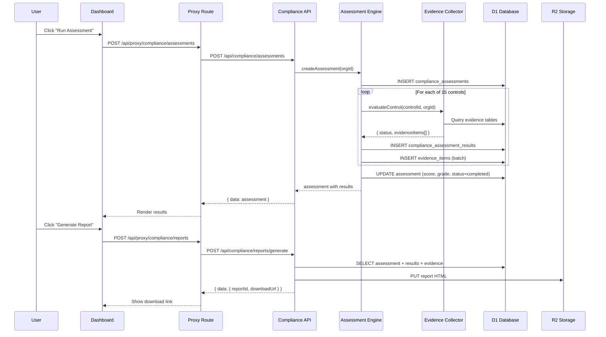
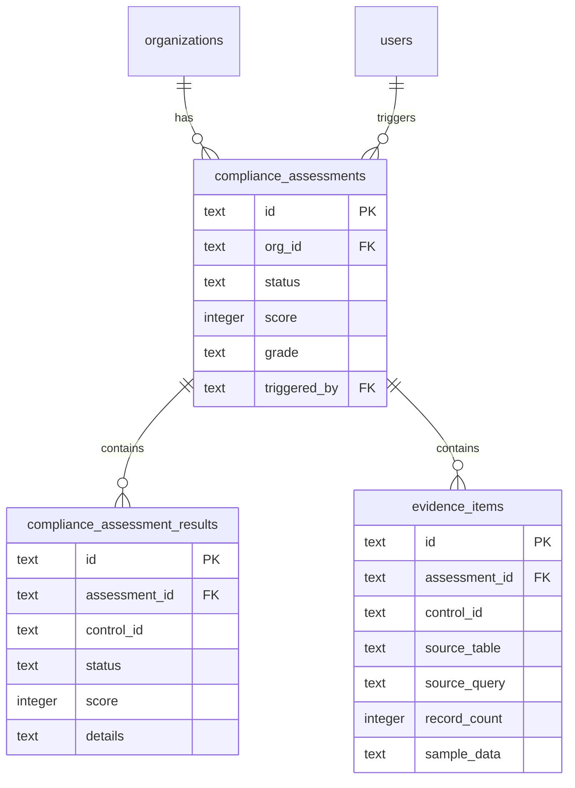

# Sprint 26: AI Agent Compliance (OASF 1.0) -- Technical Design Document

**Scope**: OpenSyber / Sprint 26 AI Agent Compliance
**Generated**: 2026-03-07
**Agent**: Design Architect Agent
**Based on**: requirements.md

---

## Table of Contents

1. [Executive Summary](#executive-summary)
2. [System Architecture](#system-architecture)
3. [Data Models](#data-models)
4. [OASF 1.0 Framework Definition](#oasf-10-framework-definition)
5. [Evidence Collection Engine](#evidence-collection-engine)
6. [API Design](#api-design)
7. [Frontend Design](#frontend-design)
8. [Report Generation](#report-generation)
9. [Security Design](#security-design)
10. [Testing Strategy](#testing-strategy)
11. [Migration Plan](#migration-plan)

---

## Executive Summary

### Design Goals

Sprint 26 adds a compliance layer to the agent security platform through four components:

1. **OASF Control Registry**: Static definitions of 15 controls with evidence logic
2. **Assessment Engine**: On-demand evaluation of all controls against org data
3. **Compliance API**: CRUD for assessments, results, evidence, reports
4. **Compliance UI**: Dashboard widget, detail page, report viewer

### Key Architectural Decisions

| Decision | Rationale | Impact |
|----------|-----------|--------|
| Controls as code constants (not DB rows) | Immutable for v1.0; versioning via code | No seeding migration needed |
| Evidence evaluators as strategy pattern | Each control has its own evaluator function | Easy to add controls in v2.0 |
| Assessment = snapshot of all 15 controls | Auditors need point-in-time evidence | Immutable after creation |
| HTML report (not PDF) | CF Workers cannot run PDF libraries | Print-to-PDF in browser |
| Reuse existing `compliance.view/generate` perms | Already in RBAC system | Zero permission changes |

---

## System Architecture

### High-Level Architecture

```
+------------------+     +-------------------+     +------------------+
|   Dashboard UI   |---->|  Proxy Routes     |---->|  Compliance API  |
|  (Next.js SSR)   |     |  /api/proxy/      |     |  (Hono Workers)  |
+------------------+     +-------------------+     +------------------+
                                                          |
                                    +---------------------+---------------------+
                                    |                     |                     |
                              +-----v------+       +-----v------+       +-----v------+
                              | Assessment |       | Evidence   |       | Report     |
                              | Engine     |       | Collector  |       | Generator  |
                              +-----+------+       +-----+------+       +-----+------+
                                    |                     |                     |
                              +-----v---------------------v-----+              |
                              |        Cloudflare D1            |        +-----v------+
                              |  compliance_assessments         |        | Cloudflare |
                              |  compliance_assessment_results  |        |     R2     |
                              |  evidence_items                 |        +------------+
                              +---+---+---+---+-----------------+
                                  |   |   |   |
                    Existing tables queried for evidence:
                    agent_activity | agent_policies | cspm_findings
                    agent_policy_violations | attack_path_snapshots
                    alert_channels | agent_risk_snapshots | assets
                    cloud_accounts | org_members
```

### Component Interactions



---

## Data Models

### Schema File: `packages/db/src/schema/compliance.ts`

```typescript
import { sqliteTable, text, integer } from 'drizzle-orm/sqlite-core';
import { sql } from 'drizzle-orm';
import { organizations } from './organizations.js';
import { users } from './users.js';

export const complianceAssessments = sqliteTable('compliance_assessments', {
  id: text('id').primaryKey(),
  orgId: text('org_id')
    .notNull()
    .references(() => organizations.id, { onDelete: 'cascade' }),
  status: text('status', {
    enum: ['running', 'completed', 'failed'],
  }).notNull().default('running'),
  controlsPassing: integer('controls_passing').notNull().default(0),
  controlsFailing: integer('controls_failing').notNull().default(0),
  controlsPartial: integer('controls_partial').notNull().default(0),
  controlsNA: integer('controls_na').notNull().default(0),
  score: integer('score').notNull().default(0),
  grade: text('grade').notNull().default('F'),
  triggeredBy: text('triggered_by')
    .notNull()
    .references(() => users.id),
  startedAt: text('started_at').notNull(),
  completedAt: text('completed_at'),
  createdAt: text('created_at')
    .notNull()
    .default(sql`(datetime('now'))`),
});

export const complianceAssessmentResults = sqliteTable(
  'compliance_assessment_results', {
    id: text('id').primaryKey(),
    assessmentId: text('assessment_id')
      .notNull()
      .references(() => complianceAssessments.id, { onDelete: 'cascade' }),
    controlId: text('control_id').notNull(),
    status: text('status', {
      enum: ['passing', 'failing', 'partial', 'not_applicable', 'error'],
    }).notNull(),
    score: integer('score').notNull().default(0),
    details: text('details'),
    evidenceCount: integer('evidence_count').notNull().default(0),
    evaluatedAt: text('evaluated_at').notNull(),
  },
);

export const evidenceItems = sqliteTable('evidence_items', {
  id: text('id').primaryKey(),
  assessmentId: text('assessment_id')
    .notNull()
    .references(() => complianceAssessments.id, { onDelete: 'cascade' }),
  controlId: text('control_id').notNull(),
  sourceTable: text('source_table').notNull(),
  sourceQuery: text('source_query').notNull(),
  recordCount: integer('record_count').notNull().default(0),
  sampleData: text('sample_data'),
  collectedAt: text('collected_at').notNull(),
});
```

### Migration: `packages/db/migrations/0013_ai_agent_compliance.sql`

```sql
-- Sprint 26: AI Agent Compliance (OASF 1.0)
-- Creates tables for compliance assessments, results, and evidence items.

-- Compliance Assessments (one per org per run)
CREATE TABLE IF NOT EXISTS compliance_assessments (
  id TEXT PRIMARY KEY,
  org_id TEXT NOT NULL REFERENCES organizations(id) ON DELETE CASCADE,
  status TEXT NOT NULL DEFAULT 'running'
    CHECK(status IN ('running', 'completed', 'failed')),
  controls_passing INTEGER NOT NULL DEFAULT 0,
  controls_failing INTEGER NOT NULL DEFAULT 0,
  controls_partial INTEGER NOT NULL DEFAULT 0,
  controls_na INTEGER NOT NULL DEFAULT 0,
  score INTEGER NOT NULL DEFAULT 0,
  grade TEXT NOT NULL DEFAULT 'F',
  triggered_by TEXT NOT NULL REFERENCES users(id),
  started_at TEXT NOT NULL,
  completed_at TEXT,
  created_at TEXT NOT NULL DEFAULT (datetime('now'))
);

CREATE INDEX IF NOT EXISTS idx_compliance_assessments_org
  ON compliance_assessments(org_id);
CREATE INDEX IF NOT EXISTS idx_compliance_assessments_status
  ON compliance_assessments(status);

-- Per-control results within an assessment
CREATE TABLE IF NOT EXISTS compliance_assessment_results (
  id TEXT PRIMARY KEY,
  assessment_id TEXT NOT NULL
    REFERENCES compliance_assessments(id) ON DELETE CASCADE,
  control_id TEXT NOT NULL,
  status TEXT NOT NULL
    CHECK(status IN ('passing','failing','partial','not_applicable','error')),
  score INTEGER NOT NULL DEFAULT 0,
  details TEXT,
  evidence_count INTEGER NOT NULL DEFAULT 0,
  evaluated_at TEXT NOT NULL
);

CREATE INDEX IF NOT EXISTS idx_compliance_results_assessment
  ON compliance_assessment_results(assessment_id);
CREATE INDEX IF NOT EXISTS idx_compliance_results_control
  ON compliance_assessment_results(control_id);

-- Evidence items collected per control per assessment
CREATE TABLE IF NOT EXISTS evidence_items (
  id TEXT PRIMARY KEY,
  assessment_id TEXT NOT NULL
    REFERENCES compliance_assessments(id) ON DELETE CASCADE,
  control_id TEXT NOT NULL,
  source_table TEXT NOT NULL,
  source_query TEXT NOT NULL,
  record_count INTEGER NOT NULL DEFAULT 0,
  sample_data TEXT,
  collected_at TEXT NOT NULL
);

CREATE INDEX IF NOT EXISTS idx_evidence_items_assessment
  ON evidence_items(assessment_id);
CREATE INDEX IF NOT EXISTS idx_evidence_items_control
  ON evidence_items(control_id);
```

### Entity Relationships



---

## OASF 1.0 Framework Definition

### Constants File: `packages/shared/src/constants/oasf-controls.ts`

This file defines all 15 controls as a typed constant array. Each control includes its ID, domain, title, description, and framework mappings.

```typescript
export interface OASFControl {
  id: string;
  domain: 'monitoring' | 'access_control' | 'data_protection' | 'governance';
  title: string;
  description: string;
  remediationGuidance: string;
  soc2Mapping: string[];
  iso27001Mapping: string[];
  nistCsfMapping: string[];
}

export const OASF_VERSION = '1.0';

export const OASF_CONTROLS: readonly OASFControl[] = [
  // Domain 1: Monitoring
  {
    id: 'OASF-01',
    domain: 'monitoring',
    title: 'Agent session monitoring and logging',
    description: 'All AI agent sessions must be monitored with activity '
      + 'logging enabled. Every file read, bash execution, and tool '
      + 'invocation must be recorded.',
    remediationGuidance: 'Install the OpenSyber extension in all developer '
      + 'IDEs and enable cloud sync for centralized logging.',
    soc2Mapping: ['CC6.1', 'CC6.6'],
    iso27001Mapping: ['A.8.15', 'A.8.16'],
    nistCsfMapping: ['DE.CM-1', 'DE.CM-3'],
  },
  {
    id: 'OASF-02',
    domain: 'monitoring',
    title: 'Human review of agent activity',
    description: 'Agent activity flagged as policy violations must be '
      + 'reviewed and acknowledged by a human within 24 hours.',
    remediationGuidance: 'Configure alert channels and assign security '
      + 'engineers to review policy violations daily.',
    soc2Mapping: ['CC6.1', 'CC6.8'],
    iso27001Mapping: ['A.5.36', 'A.8.16'],
    nistCsfMapping: ['DE.AE-2', 'RS.AN-1'],
  },
  {
    id: 'OASF-03',
    domain: 'monitoring',
    title: 'Critical event alerting configured',
    description: 'Real-time alert channels must be configured for critical '
      + 'and high severity agent events.',
    remediationGuidance: 'Set up at least one alert channel (email, Slack, '
      + 'PagerDuty) with minSeverity set to critical or high.',
    soc2Mapping: ['CC6.1', 'CC6.6'],
    iso27001Mapping: ['A.5.24', 'A.8.16'],
    nistCsfMapping: ['DE.AE-5', 'RS.CO-2'],
  },
  {
    id: 'OASF-04',
    domain: 'monitoring',
    title: 'Risk score tracking over time',
    description: 'Agent risk scores must be computed and recorded daily '
      + 'to establish trend baselines and detect anomalies.',
    remediationGuidance: 'Ensure risk snapshot cron job is active. Verify '
      + 'snapshots appear in the risk trend dashboard.',
    soc2Mapping: ['CC6.1'],
    iso27001Mapping: ['A.5.7', 'A.8.16'],
    nistCsfMapping: ['DE.CM-1', 'ID.RA-1'],
  },
  // Domain 2: Access Control
  {
    id: 'OASF-05',
    domain: 'access_control',
    title: 'Production secret access controls',
    description: 'Agents must not be able to access production secrets '
      + '(private keys, API tokens, database credentials) without '
      + 'explicit policy-based approval.',
    remediationGuidance: 'Create agent policies with file_pattern rules '
      + 'targeting .pem, .key, .env.production, and similar paths.',
    soc2Mapping: ['CC6.1', 'CC6.3'],
    iso27001Mapping: ['A.5.15', 'A.8.3'],
    nistCsfMapping: ['PR.AC-1', 'PR.AC-4'],
  },
  {
    id: 'OASF-06',
    domain: 'access_control',
    title: 'Production environment isolation',
    description: 'Agent sessions must be isolated from production '
      + 'environments. Agents must not access production file systems, '
      + 'databases, or APIs directly.',
    remediationGuidance: 'Review agent activity logs for production path '
      + 'access. Configure policies to block /prod/, /production/ paths.',
    soc2Mapping: ['CC6.1', 'CC6.7'],
    iso27001Mapping: ['A.8.31', 'A.8.33'],
    nistCsfMapping: ['PR.AC-5', 'PR.DS-5'],
  },
  {
    id: 'OASF-07',
    domain: 'access_control',
    title: 'Least privilege agent permissions',
    description: 'Agent operators must follow the principle of least '
      + 'privilege. No agent should operate with owner-level org permissions.',
    remediationGuidance: 'Assign developers the developer role. Reserve '
      + 'admin/owner for human-only operations.',
    soc2Mapping: ['CC6.1', 'CC6.3'],
    iso27001Mapping: ['A.5.15', 'A.8.2'],
    nistCsfMapping: ['PR.AC-1', 'PR.AC-4'],
  },
  {
    id: 'OASF-08',
    domain: 'access_control',
    title: 'Cloud credential scanning',
    description: 'Cloud accounts connected to the platform must be '
      + 'scanned regularly for misconfigurations that agents could exploit.',
    remediationGuidance: 'Connect at least one cloud account and configure '
      + 'scan schedule to daily or weekly.',
    soc2Mapping: ['CC6.1', 'CC6.6'],
    iso27001Mapping: ['A.5.23', 'A.8.9'],
    nistCsfMapping: ['PR.AC-4', 'DE.CM-8'],
  },
  // Domain 3: Data Protection
  {
    id: 'OASF-09',
    domain: 'data_protection',
    title: 'Secret detection on file operations',
    description: 'Secret detection must be active on all agent file '
      + 'operations to identify exposed credentials, API keys, and tokens.',
    remediationGuidance: 'The OpenSyber extension automatically detects '
      + 'secrets. Ensure secretsCount tracking is enabled in the extension.',
    soc2Mapping: ['CC6.1', 'CC6.7'],
    iso27001Mapping: ['A.5.33', 'A.8.11'],
    nistCsfMapping: ['PR.DS-1', 'PR.DS-5'],
  },
  {
    id: 'OASF-10',
    domain: 'data_protection',
    title: 'Sensitive file access auditing',
    description: 'All access to sensitive files (high/critical risk) '
      + 'must be logged with full audit trail.',
    remediationGuidance: 'Verify agent activity logs include file_read '
      + 'events with risk classification. Review critical events weekly.',
    soc2Mapping: ['CC6.1', 'CC6.6'],
    iso27001Mapping: ['A.5.33', 'A.8.15'],
    nistCsfMapping: ['PR.DS-1', 'DE.CM-3'],
  },
  {
    id: 'OASF-11',
    domain: 'data_protection',
    title: 'Cloud misconfiguration monitoring',
    description: 'Active cloud security posture management (CSPM) must '
      + 'be running to detect misconfigurations agents could exploit.',
    remediationGuidance: 'Connect cloud accounts and run CSPM scans. '
      + 'Review and remediate critical/high findings.',
    soc2Mapping: ['CC6.1', 'CC6.6', 'CC6.7'],
    iso27001Mapping: ['A.5.23', 'A.8.9'],
    nistCsfMapping: ['DE.CM-8', 'PR.DS-5'],
  },
  {
    id: 'OASF-12',
    domain: 'data_protection',
    title: 'Agent blast radius assessment',
    description: 'The blast radius of each agent session must be assessed '
      + 'to understand the potential impact of a compromised agent.',
    remediationGuidance: 'Run attack path analysis from Sprint 25. Review '
      + 'blast radius scores and reduce crown jewel reachability.',
    soc2Mapping: ['CC6.1', 'CC6.6'],
    iso27001Mapping: ['A.5.7', 'A.8.9'],
    nistCsfMapping: ['ID.RA-1', 'ID.RA-3'],
  },
  // Domain 4: Governance
  {
    id: 'OASF-13',
    domain: 'governance',
    title: 'Security policy enforcement',
    description: 'A minimum of 3 active agent security policies must be '
      + 'defined and enforced to govern agent behavior.',
    remediationGuidance: 'Create policies for: (1) secret file access, '
      + '(2) dangerous commands, (3) risk threshold alerts.',
    soc2Mapping: ['CC6.1', 'CC6.2'],
    iso27001Mapping: ['A.5.1', 'A.5.2'],
    nistCsfMapping: ['ID.GV-1', 'PR.IP-1'],
  },
  {
    id: 'OASF-14',
    domain: 'governance',
    title: 'Regular compliance assessments',
    description: 'Compliance assessments must be run at least monthly '
      + 'to ensure continuous adherence to OASF controls.',
    remediationGuidance: 'Schedule monthly compliance assessments. Review '
      + 'results with the security team.',
    soc2Mapping: ['CC6.1', 'CC6.8'],
    iso27001Mapping: ['A.5.35', 'A.5.36'],
    nistCsfMapping: ['ID.GV-4', 'DE.DP-1'],
  },
  {
    id: 'OASF-15',
    domain: 'governance',
    title: 'Evidence retention for audit',
    description: 'All compliance evidence must be retained and linked '
      + 'to controls for external audit purposes.',
    remediationGuidance: 'Generate compliance reports after each assessment. '
      + 'Store reports for at least 12 months.',
    soc2Mapping: ['CC6.1', 'CC6.8'],
    iso27001Mapping: ['A.5.5', 'A.5.36'],
    nistCsfMapping: ['ID.GV-4', 'PR.IP-1'],
  },
] as const;

export const OASF_DOMAINS = {
  monitoring: { label: 'Monitoring', icon: 'eye' },
  access_control: { label: 'Access Control', icon: 'lock' },
  data_protection: { label: 'Data Protection', icon: 'shield' },
  governance: { label: 'Governance', icon: 'clipboard-check' },
} as const;
```

### Framework Mapping Constants: `packages/shared/src/constants/oasf-mappings.ts`

```typescript
export interface FrameworkMapping {
  controlId: string;
  soc2: { criteria: string; description: string }[];
  iso27001: { control: string; description: string }[];
  nistCsf: { subcategory: string; description: string }[];
}

export const SOC2_DESCRIPTIONS: Record<string, string> = {
  'CC6.1': 'Logical and physical access controls over information assets',
  'CC6.2': 'Prior to registration, users are authenticated',
  'CC6.3': 'Access to data and functions is restricted to authorized users',
  'CC6.6': 'System operation anomalies are detected and evaluated',
  'CC6.7': 'Transmission of data is restricted to authorized channels',
  'CC6.8': 'Controls are tested by qualified personnel',
};

export const ISO27001_DESCRIPTIONS: Record<string, string> = {
  'A.5.1': 'Policies for information security',
  'A.5.2': 'Information security roles and responsibilities',
  'A.5.5': 'Contact with authorities',
  'A.5.7': 'Threat intelligence',
  'A.5.15': 'Access control',
  'A.5.23': 'Information security for cloud services',
  'A.5.24': 'Information security incident management planning',
  'A.5.33': 'Protection of records',
  'A.5.35': 'Independent review of information security',
  'A.5.36': 'Compliance with policies, rules and standards',
  'A.8.2': 'Privileged access rights',
  'A.8.3': 'Information access restriction',
  'A.8.9': 'Configuration management',
  'A.8.11': 'Data masking',
  'A.8.15': 'Logging',
  'A.8.16': 'Monitoring activities',
  'A.8.31': 'Separation of development, test and production',
  'A.8.33': 'Test information',
};

export const NIST_CSF_DESCRIPTIONS: Record<string, string> = {
  'DE.AE-2': 'Detected events are analyzed to understand methods',
  'DE.AE-5': 'Incident alert thresholds are established',
  'DE.CM-1': 'Networks are monitored for cybersecurity events',
  'DE.CM-3': 'Personnel activity is monitored',
  'DE.CM-8': 'Vulnerability scans are performed',
  'DE.DP-1': 'Roles and responsibilities for detection are defined',
  'ID.GV-1': 'Organizational cybersecurity policy is established',
  'ID.GV-4': 'Governance and risk management processes address risks',
  'ID.RA-1': 'Asset vulnerabilities are identified and documented',
  'ID.RA-3': 'Threats are identified and documented',
  'PR.AC-1': 'Identities and credentials are issued and managed',
  'PR.AC-4': 'Access permissions and authorizations are managed',
  'PR.AC-5': 'Network integrity is protected',
  'PR.DS-1': 'Data-at-rest is protected',
  'PR.DS-5': 'Protections against data leaks are implemented',
  'PR.IP-1': 'Configuration baselines are created and maintained',
  'RS.AN-1': 'Notifications from detection systems are investigated',
  'RS.CO-2': 'Incidents are reported consistent with criteria',
};
```

---

## Evidence Collection Engine

### Architecture

Each of the 15 controls has a dedicated evaluator function that:

1. Queries existing data tables for evidence
2. Returns a status (`passing`, `failing`, `partial`, `not_applicable`)
3. Returns evidence items with source table, query description, record count, and sample data

### File Structure

```
apps/api/src/services/compliance/
  index.ts                    -- Assessment orchestrator
  types.ts                    -- Shared types
  evaluators/
    monitoring.ts             -- OASF-01 to OASF-04 evaluators
    access-control.ts         -- OASF-05 to OASF-08 evaluators
    data-protection.ts        -- OASF-09 to OASF-12 evaluators
    governance.ts             -- OASF-13 to OASF-15 evaluators
    index.ts                  -- Evaluator registry
  report-generator.ts         -- HTML report builder
  score-calculator.ts         -- Compliance scoring logic
```

### Types: `apps/api/src/services/compliance/types.ts`

```typescript
export type ControlStatus =
  | 'passing' | 'failing' | 'partial' | 'not_applicable' | 'error';

export interface EvaluationResult {
  controlId: string;
  status: ControlStatus;
  score: number; // 0-100
  details: string;
  evidenceItems: EvidenceItemInput[];
}

export interface EvidenceItemInput {
  sourceTable: string;
  sourceQuery: string;
  recordCount: number;
  sampleData: unknown[] | null;
}

export type ControlEvaluator = (
  db: any,
  orgId: string,
) => Promise<EvaluationResult>;
```

### Evaluator Registry: `apps/api/src/services/compliance/evaluators/index.ts`

```typescript
import type { ControlEvaluator } from '../types.js';
import {
  evaluateOASF01, evaluateOASF02, evaluateOASF03, evaluateOASF04,
} from './monitoring.js';
import {
  evaluateOASF05, evaluateOASF06, evaluateOASF07, evaluateOASF08,
} from './access-control.js';
import {
  evaluateOASF09, evaluateOASF10, evaluateOASF11, evaluateOASF12,
} from './data-protection.js';
import {
  evaluateOASF13, evaluateOASF14, evaluateOASF15,
} from './governance.js';

export const CONTROL_EVALUATORS: Record<string, ControlEvaluator> = {
  'OASF-01': evaluateOASF01,
  'OASF-02': evaluateOASF02,
  'OASF-03': evaluateOASF03,
  'OASF-04': evaluateOASF04,
  'OASF-05': evaluateOASF05,
  'OASF-06': evaluateOASF06,
  'OASF-07': evaluateOASF07,
  'OASF-08': evaluateOASF08,
  'OASF-09': evaluateOASF09,
  'OASF-10': evaluateOASF10,
  'OASF-11': evaluateOASF11,
  'OASF-12': evaluateOASF12,
  'OASF-13': evaluateOASF13,
  'OASF-14': evaluateOASF14,
  'OASF-15': evaluateOASF15,
};
```

### Sample Evaluator: `apps/api/src/services/compliance/evaluators/monitoring.ts`

```typescript
import { eq, and, gte, count } from 'drizzle-orm';
import {
  agentActivity, agentPolicyViolations, alertChannels,
  agentRiskSnapshots,
} from '@opensyber/db';
import type { EvaluationResult } from '../types.js';

const DAY_MS = 86_400_000;

/** OASF-01: All AI agent sessions are monitored and logged */
export async function evaluateOASF01(
  db: any, orgId: string,
): Promise<EvaluationResult> {
  const since = new Date(Date.now() - DAY_MS).toISOString();
  const activities = await db.select({ cnt: count() })
    .from(agentActivity)
    .where(and(
      eq(agentActivity.orgId, orgId),
      gte(agentActivity.createdAt, since),
    ));

  const activityCount = activities[0]?.cnt ?? 0;
  const passing = activityCount > 0;

  return {
    controlId: 'OASF-01',
    status: passing ? 'passing' : 'failing',
    score: passing ? 100 : 0,
    details: passing
      ? `${activityCount} agent activities logged in last 24 hours`
      : 'No agent activity recorded in last 24 hours',
    evidenceItems: [{
      sourceTable: 'agent_activity',
      sourceQuery: 'agent_activity WHERE org_id = ? AND created_at >= ?',
      recordCount: activityCount,
      sampleData: null,
    }],
  };
}

/** OASF-02: Agent activity reviewed by human within 24h */
export async function evaluateOASF02(
  db: any, orgId: string,
): Promise<EvaluationResult> {
  const since = new Date(Date.now() - DAY_MS).toISOString();

  // Count total violations in last 24h
  const totalViolations = await db.select({ cnt: count() })
    .from(agentPolicyViolations)
    .where(and(
      eq(agentPolicyViolations.orgId, orgId),
      gte(agentPolicyViolations.createdAt, since),
    ));

  // Count acknowledged violations
  const ackedViolations = await db.select({ cnt: count() })
    .from(agentPolicyViolations)
    .where(and(
      eq(agentPolicyViolations.orgId, orgId),
      gte(agentPolicyViolations.createdAt, since),
      eq(agentPolicyViolations.acknowledged, true),
    ));

  const total = totalViolations[0]?.cnt ?? 0;
  const acked = ackedViolations[0]?.cnt ?? 0;

  if (total === 0) {
    return {
      controlId: 'OASF-02',
      status: 'passing',
      score: 100,
      details: 'No policy violations in last 24 hours',
      evidenceItems: [{
        sourceTable: 'agent_policy_violations',
        sourceQuery: 'COUNT violations WHERE org_id = ? AND created_at >= ?',
        recordCount: 0,
        sampleData: null,
      }],
    };
  }

  const ratio = acked / total;
  const status = ratio >= 1 ? 'passing' : ratio >= 0.5 ? 'partial' : 'failing';
  const score = Math.round(ratio * 100);

  return {
    controlId: 'OASF-02',
    status,
    score,
    details: `${acked}/${total} violations acknowledged within 24h`,
    evidenceItems: [{
      sourceTable: 'agent_policy_violations',
      sourceQuery: 'violations WHERE org_id = ? AND acknowledged = true',
      recordCount: acked,
      sampleData: null,
    }],
  };
}

/** OASF-03: Real-time alerts configured for critical events */
export async function evaluateOASF03(
  db: any, orgId: string,
): Promise<EvaluationResult> {
  const channels = await db.select().from(alertChannels)
    .where(and(
      eq(alertChannels.orgId, orgId),
      eq(alertChannels.isActive, true),
    ));

  const criticalChannels = channels.filter(
    (ch: any) => ch.minSeverity === 'critical' || ch.minSeverity === 'high',
  );

  const passing = criticalChannels.length > 0;

  return {
    controlId: 'OASF-03',
    status: passing ? 'passing' : 'failing',
    score: passing ? 100 : 0,
    details: passing
      ? `${criticalChannels.length} alert channel(s) configured for critical/high events`
      : 'No alert channels configured for critical events',
    evidenceItems: [{
      sourceTable: 'alert_channels',
      sourceQuery: 'alert_channels WHERE org_id = ? AND is_active = 1',
      recordCount: criticalChannels.length,
      sampleData: criticalChannels.slice(0, 3).map((ch: any) => ({
        id: ch.id, type: ch.channelType, minSeverity: ch.minSeverity,
      })),
    }],
  };
}

/** OASF-04: Risk scores tracked over time */
export async function evaluateOASF04(
  db: any, orgId: string,
): Promise<EvaluationResult> {
  const thirtyDaysAgo = new Date(Date.now() - 30 * DAY_MS).toISOString();
  const snapshots = await db.select({ cnt: count() })
    .from(agentRiskSnapshots)
    .where(and(
      eq(agentRiskSnapshots.orgId, orgId),
      gte(agentRiskSnapshots.snapshotDate, thirtyDaysAgo),
    ));

  const snapshotCount = snapshots[0]?.cnt ?? 0;
  // Need at least 7 snapshots in 30 days for passing
  const status = snapshotCount >= 25 ? 'passing'
    : snapshotCount >= 7 ? 'partial' : 'failing';
  const score = Math.min(100, Math.round((snapshotCount / 25) * 100));

  return {
    controlId: 'OASF-04',
    status,
    score,
    details: `${snapshotCount} risk snapshots in last 30 days (target: 25+)`,
    evidenceItems: [{
      sourceTable: 'agent_risk_snapshots',
      sourceQuery: 'risk_snapshots WHERE org_id = ? AND date >= 30d ago',
      recordCount: snapshotCount,
      sampleData: null,
    }],
  };
}
```

### Score Calculator: `apps/api/src/services/compliance/score-calculator.ts`

```typescript
import type { EvaluationResult } from './types.js';

export interface ComplianceScore {
  score: number;
  grade: string;
  passing: number;
  failing: number;
  partial: number;
  notApplicable: number;
}

export function calculateComplianceScore(
  results: EvaluationResult[],
): ComplianceScore {
  let passing = 0;
  let failing = 0;
  let partial = 0;
  let notApplicable = 0;

  for (const r of results) {
    switch (r.status) {
      case 'passing': passing++; break;
      case 'failing': case 'error': failing++; break;
      case 'partial': partial++; break;
      case 'not_applicable': notApplicable++; break;
    }
  }

  const applicable = results.length - notApplicable;
  const score = applicable === 0 ? 0
    : Math.round(((passing + partial * 0.5) / applicable) * 100);

  return { score, grade: gradeFromScore(score), passing, failing, partial, notApplicable };
}

export function gradeFromScore(score: number): string {
  if (score === 100) return 'A+';
  if (score >= 93) return 'A';
  if (score >= 80) return 'B';
  if (score >= 65) return 'C';
  if (score >= 50) return 'D';
  return 'F';
}
```

### Assessment Orchestrator: `apps/api/src/services/compliance/index.ts`

```typescript
import { eq } from 'drizzle-orm';
import {
  complianceAssessments, complianceAssessmentResults, evidenceItems,
} from '@opensyber/db';
import { OASF_CONTROLS } from '@opensyber/shared';
import { CONTROL_EVALUATORS } from './evaluators/index.js';
import { calculateComplianceScore } from './score-calculator.js';

export async function runComplianceAssessment(
  db: any, orgId: string, userId: string,
): Promise<{ assessmentId: string; score: number; grade: string }> {
  const assessmentId = crypto.randomUUID();
  const now = new Date().toISOString();

  // Create assessment record
  await db.insert(complianceAssessments).values({
    id: assessmentId, orgId, status: 'running',
    triggeredBy: userId, startedAt: now,
  });

  const results = [];

  // Evaluate each control
  for (const control of OASF_CONTROLS) {
    const evaluator = CONTROL_EVALUATORS[control.id];
    let result;

    try {
      result = evaluator
        ? await evaluator(db, orgId)
        : { controlId: control.id, status: 'not_applicable' as const,
            score: 0, details: 'Evaluator not configured', evidenceItems: [] };
    } catch (err) {
      result = {
        controlId: control.id, status: 'error' as const, score: 0,
        details: `Evaluation failed: ${err instanceof Error ? err.message : 'Unknown'}`,
        evidenceItems: [],
      };
    }

    results.push(result);

    // Store result
    const resultId = crypto.randomUUID();
    await db.insert(complianceAssessmentResults).values({
      id: resultId, assessmentId, controlId: control.id,
      status: result.status, score: result.score,
      details: result.details,
      evidenceCount: result.evidenceItems.length,
      evaluatedAt: now,
    });

    // Store evidence items
    for (const evidence of result.evidenceItems) {
      await db.insert(evidenceItems).values({
        id: crypto.randomUUID(), assessmentId,
        controlId: control.id,
        sourceTable: evidence.sourceTable,
        sourceQuery: evidence.sourceQuery,
        recordCount: evidence.recordCount,
        sampleData: evidence.sampleData
          ? JSON.stringify(evidence.sampleData) : null,
        collectedAt: now,
      });
    }
  }

  // Calculate final score
  const score = calculateComplianceScore(results);

  // Update assessment
  await db.update(complianceAssessments).set({
    status: 'completed',
    controlsPassing: score.passing,
    controlsFailing: score.failing,
    controlsPartial: score.partial,
    controlsNA: score.notApplicable,
    score: score.score,
    grade: score.grade,
    completedAt: new Date().toISOString(),
  }).where(eq(complianceAssessments.id, assessmentId));

  return { assessmentId, score: score.score, grade: score.grade };
}
```

---

## API Design

### Route Structure

```
POST   /api/compliance/assessments              -- Run new assessment
GET    /api/compliance/assessments              -- List assessments
GET    /api/compliance/assessments/:id          -- Get assessment details
GET    /api/compliance/assessments/:id/results  -- Get per-control results
GET    /api/compliance/assessments/:id/evidence -- Get evidence items
GET    /api/compliance/controls                 -- Get OASF control definitions
GET    /api/compliance/mappings                 -- Get framework mappings
GET    /api/compliance/score                    -- Get latest compliance score
POST   /api/compliance/reports/generate         -- Generate compliance report
GET    /api/compliance/reports                  -- List reports
GET    /api/compliance/reports/:id/download     -- Download report
```

### Route Files

#### `apps/api/src/routes/compliance-assessments.ts`

```typescript
// Handles: POST/GET /assessments, GET /assessments/:id
// Middleware: dbMiddleware, authMiddleware, resolveOrgContext, loadPlanConfig
// Permissions: compliance.view (read), compliance.generate (write)
// Plan gate: requirePlanFeature('complianceAssessments')

import { Hono } from 'hono';
import { eq, and, desc } from 'drizzle-orm';
import { complianceAssessments } from '@opensyber/db';
import type { Env, Variables } from '../types.js';
import { authMiddleware } from '../middleware/auth.js';
import { dbMiddleware } from '../middleware/db.js';
import { resolveOrgContext } from '../middleware/rbac.js';
import { loadPlanConfig, requirePlanFeature } from '../middleware/plan-enforcement.js';
import { hasPermission } from '@opensyber/shared';
import type { Role } from '@opensyber/shared';
import { runComplianceAssessment } from '../services/compliance/index.js';

export const complianceAssessmentRoutes = new Hono<{
  Bindings: Env; Variables: Variables;
}>();

complianceAssessmentRoutes.use('*',
  dbMiddleware, authMiddleware, resolveOrgContext, loadPlanConfig);

// POST /assessments -- trigger a new assessment
complianceAssessmentRoutes.post('/assessments',
  requirePlanFeature('complianceAssessments'),
  async (c) => {
    const role = c.get('role') as Role | null;
    if (role && !hasPermission(role, 'compliance.generate')) {
      return c.json({ error: 'Forbidden', message: 'compliance.generate required' }, 403);
    }
    const orgId = c.get('orgId');
    if (!orgId) return c.json({ error: 'Bad request', message: 'Org context required' }, 400);

    const result = await runComplianceAssessment(c.get('db'), orgId, c.get('userId'));
    return c.json({ data: result }, 201);
  },
);

// GET /assessments -- list assessments for org
complianceAssessmentRoutes.get('/assessments', async (c) => {
  const orgId = c.get('orgId');
  if (!orgId) return c.json({ error: 'Bad request', message: 'Org context required' }, 400);

  const db = c.get('db');
  const limit = Math.min(parseInt(c.req.query('limit') ?? '20', 10), 100);
  const assessments = await db.select().from(complianceAssessments)
    .where(eq(complianceAssessments.orgId, orgId))
    .orderBy(desc(complianceAssessments.createdAt)).limit(limit);

  return c.json({ data: assessments });
});

// GET /assessments/:id -- get assessment with summary
complianceAssessmentRoutes.get('/assessments/:id', async (c) => {
  const orgId = c.get('orgId');
  if (!orgId) return c.json({ error: 'Bad request', message: 'Org context required' }, 400);

  const [assessment] = await c.get('db').select().from(complianceAssessments)
    .where(and(
      eq(complianceAssessments.id, c.req.param('id')),
      eq(complianceAssessments.orgId, orgId),
    ));
  if (!assessment) return c.json({ error: 'Not found', message: 'Assessment not found' }, 404);

  return c.json({ data: assessment });
});
```

#### `apps/api/src/routes/compliance-results.ts`

```typescript
// Handles: GET /assessments/:id/results, GET /assessments/:id/evidence
// Smaller file for per-control results and evidence item queries

import { Hono } from 'hono';
import { eq, and } from 'drizzle-orm';
import {
  complianceAssessments, complianceAssessmentResults, evidenceItems,
} from '@opensyber/db';
import type { Env, Variables } from '../types.js';
import { authMiddleware } from '../middleware/auth.js';
import { dbMiddleware } from '../middleware/db.js';
import { resolveOrgContext } from '../middleware/rbac.js';
import { loadPlanConfig } from '../middleware/plan-enforcement.js';

export const complianceResultRoutes = new Hono<{
  Bindings: Env; Variables: Variables;
}>();

complianceResultRoutes.use('*',
  dbMiddleware, authMiddleware, resolveOrgContext, loadPlanConfig);

// GET /assessments/:id/results
complianceResultRoutes.get('/assessments/:id/results', async (c) => {
  const orgId = c.get('orgId');
  if (!orgId) return c.json({ error: 'Bad request', message: 'Org context required' }, 400);

  const assessmentId = c.req.param('id');
  const [assessment] = await c.get('db').select().from(complianceAssessments)
    .where(and(
      eq(complianceAssessments.id, assessmentId),
      eq(complianceAssessments.orgId, orgId),
    ));
  if (!assessment) return c.json({ error: 'Not found' }, 404);

  const results = await c.get('db').select()
    .from(complianceAssessmentResults)
    .where(eq(complianceAssessmentResults.assessmentId, assessmentId));

  return c.json({ data: results });
});

// GET /assessments/:id/evidence
complianceResultRoutes.get('/assessments/:id/evidence', async (c) => {
  const orgId = c.get('orgId');
  if (!orgId) return c.json({ error: 'Bad request', message: 'Org context required' }, 400);

  const assessmentId = c.req.param('id');
  const controlId = c.req.query('controlId');

  const [assessment] = await c.get('db').select().from(complianceAssessments)
    .where(and(
      eq(complianceAssessments.id, assessmentId),
      eq(complianceAssessments.orgId, orgId),
    ));
  if (!assessment) return c.json({ error: 'Not found' }, 404);

  let query = c.get('db').select().from(evidenceItems)
    .where(eq(evidenceItems.assessmentId, assessmentId));

  if (controlId) {
    query = c.get('db').select().from(evidenceItems)
      .where(and(
        eq(evidenceItems.assessmentId, assessmentId),
        eq(evidenceItems.controlId, controlId),
      ));
  }

  const items = await query;
  return c.json({ data: items });
});
```

#### `apps/api/src/routes/compliance-controls.ts`

```typescript
// Handles: GET /controls, GET /mappings, GET /score
// Static data from constants + latest assessment score

import { Hono } from 'hono';
import { eq, desc } from 'drizzle-orm';
import { complianceAssessments } from '@opensyber/db';
import {
  OASF_CONTROLS, OASF_VERSION, OASF_DOMAINS,
} from '@opensyber/shared';
import {
  SOC2_DESCRIPTIONS, ISO27001_DESCRIPTIONS, NIST_CSF_DESCRIPTIONS,
} from '@opensyber/shared';
import type { Env, Variables } from '../types.js';
import { authMiddleware } from '../middleware/auth.js';
import { dbMiddleware } from '../middleware/db.js';
import { resolveOrgContext } from '../middleware/rbac.js';
import { loadPlanConfig } from '../middleware/plan-enforcement.js';

export const complianceControlRoutes = new Hono<{
  Bindings: Env; Variables: Variables;
}>();

complianceControlRoutes.use('*',
  dbMiddleware, authMiddleware, resolveOrgContext, loadPlanConfig);

// GET /controls -- OASF control definitions
complianceControlRoutes.get('/controls', (c) => {
  return c.json({
    data: OASF_CONTROLS,
    version: OASF_VERSION,
    domains: OASF_DOMAINS,
  });
});

// GET /mappings -- Framework mapping table
complianceControlRoutes.get('/mappings', (c) => {
  const mappings = OASF_CONTROLS.map((ctrl) => ({
    controlId: ctrl.id,
    title: ctrl.title,
    soc2: ctrl.soc2Mapping.map((id) => ({
      criteria: id, description: SOC2_DESCRIPTIONS[id] ?? '',
    })),
    iso27001: ctrl.iso27001Mapping.map((id) => ({
      control: id, description: ISO27001_DESCRIPTIONS[id] ?? '',
    })),
    nistCsf: ctrl.nistCsfMapping.map((id) => ({
      subcategory: id, description: NIST_CSF_DESCRIPTIONS[id] ?? '',
    })),
  }));
  return c.json({ data: mappings, version: OASF_VERSION });
});

// GET /score -- latest compliance score for org
complianceControlRoutes.get('/score', async (c) => {
  const orgId = c.get('orgId');
  if (!orgId) return c.json({ error: 'Bad request', message: 'Org context required' }, 400);

  const [latest] = await c.get('db').select().from(complianceAssessments)
    .where(eq(complianceAssessments.orgId, orgId))
    .orderBy(desc(complianceAssessments.createdAt)).limit(1);

  if (!latest) {
    return c.json({
      data: { score: null, grade: null, lastAssessment: null, message: 'No assessment run yet' },
    });
  }

  return c.json({
    data: {
      score: latest.score,
      grade: latest.grade,
      passing: latest.controlsPassing,
      failing: latest.controlsFailing,
      partial: latest.controlsPartial,
      lastAssessment: latest.completedAt,
    },
  });
});
```

#### `apps/api/src/routes/compliance-reports.ts`

```typescript
// Handles: POST /reports/generate, GET /reports, GET /reports/:id/download
// Same pattern as agent-reports.ts

import { Hono } from 'hono';
import { eq, and, desc } from 'drizzle-orm';
import { complianceAssessments, complianceAssessmentResults, evidenceItems, organizations } from '@opensyber/db';
import type { Env, Variables } from '../types.js';
import { authMiddleware } from '../middleware/auth.js';
import { dbMiddleware } from '../middleware/db.js';
import { requirePermission } from '../middleware/rbac.js';
import { loadPlanConfig, requirePlanFeature } from '../middleware/plan-enforcement.js';
import { generateComplianceReport } from '../services/compliance/report-generator.js';

export const complianceReportRoutes = new Hono<{
  Bindings: Env; Variables: Variables;
}>();

complianceReportRoutes.use('*',
  dbMiddleware, authMiddleware, requirePermission('compliance.generate'));

// POST /reports/generate
complianceReportRoutes.post('/reports/generate',
  loadPlanConfig, requirePlanFeature('complianceReports'),
  async (c) => {
    const orgId = c.get('orgId');
    if (!orgId) return c.json({ error: 'Bad request', message: 'Org context required' }, 400);

    const db = c.get('db');
    const [org] = await db.select().from(organizations).where(eq(organizations.id, orgId));
    const orgName = org?.name ?? 'Unknown Organization';

    const result = await generateComplianceReport(db, c.env, orgId, orgName);
    return c.json({ data: result }, 201);
  },
);

// GET /reports
complianceReportRoutes.get('/reports', async (c) => {
  const orgId = c.get('orgId');
  if (!orgId) return c.json({ error: 'Bad request', message: 'Org context required' }, 400);

  const prefix = `compliance-reports/${orgId}/`;
  const listed = await c.env.STORAGE.list({ prefix, limit: 50 });
  const reports = listed.objects.map((obj) => ({
    id: obj.key.replace(prefix, '').replace('.html', ''),
    key: obj.key, size: obj.size,
    uploaded: obj.uploaded.toISOString(),
    downloadUrl: `/api/compliance/reports/${obj.key.replace(prefix, '').replace('.html', '')}/download`,
  }));
  return c.json({ data: reports });
});

// GET /reports/:id/download
complianceReportRoutes.get('/reports/:id/download', async (c) => {
  const orgId = c.get('orgId');
  if (!orgId) return c.json({ error: 'Bad request', message: 'Org context required' }, 400);

  const key = `compliance-reports/${orgId}/${c.req.param('id')}.html`;
  const object = await c.env.STORAGE.get(key);
  if (!object) return c.json({ error: 'Not found', message: 'Report not found' }, 404);

  const content = await object.arrayBuffer();
  return new Response(content, {
    headers: {
      'Content-Type': 'text/html',
      'Content-Disposition': `inline; filename="compliance-report-${c.req.param('id')}.html"`,
    },
  });
});
```

### Route Registration in `register.ts`

```typescript
// Add to apps/api/src/routes/register.ts:
import { complianceAssessmentRoutes } from './compliance-assessments.js';
import { complianceResultRoutes } from './compliance-results.js';
import { complianceControlRoutes } from './compliance-controls.js';
import { complianceReportRoutes } from './compliance-reports.js';

// In registerRoutes():
app.route('/api/compliance', complianceAssessmentRoutes);
app.route('/api/compliance', complianceResultRoutes);
app.route('/api/compliance', complianceControlRoutes);
app.route('/api/compliance', complianceReportRoutes);
```

### Proxy Routes (Frontend)

```
apps/web/src/app/api/proxy/compliance/
  assessments/route.ts          -- GET (list) + POST (create)
  assessments/[id]/route.ts     -- GET (detail)
  assessments/[id]/results/route.ts  -- GET results
  controls/route.ts             -- GET controls
  mappings/route.ts             -- GET mappings
  score/route.ts                -- GET latest score
  reports/route.ts              -- GET (list) + POST (generate)
  reports/[id]/download/route.ts -- GET download
```

Each follows the existing pattern:

```typescript
// Example: apps/web/src/app/api/proxy/compliance/score/route.ts
import { NextResponse } from 'next/server';
import { auth } from '@clerk/nextjs/server';
import { apiClient } from '@/lib/api';

export async function GET() {
  try {
    const { getToken } = await auth();
    const token = await getToken();
    if (!token) return NextResponse.json({ error: 'Unauthorized' }, { status: 401 });
    const data = await apiClient('/api/compliance/score', { token });
    return NextResponse.json(data);
  } catch (err) {
    return NextResponse.json(
      { message: err instanceof Error ? err.message : 'Failed to fetch score' },
      { status: 500 },
    );
  }
}
```

---

## Frontend Design

### Page Structure

```
apps/web/src/app/dashboard/compliance/
  page.tsx                -- Main compliance dashboard (server component)
  types.ts                -- Shared TypeScript types
  compliance-helpers.ts   -- UI helper functions (colors, labels)
  [id]/
    page.tsx              -- Assessment detail page
  controls/
    page.tsx              -- OASF control reference page
  mappings/
    page.tsx              -- Framework mapping table
```

### Compliance Dashboard: `page.tsx`

Server component that fetches:

1. Latest compliance score via `/api/proxy/compliance/score`
2. Recent assessments via `/api/proxy/compliance/assessments`

Layout:

```
+----------------------------------------------------------+
|  AI Agent Compliance (OASF 1.0)                          |
|  Your organization's compliance with the OpenSyber AI    |
|  Agent Security Framework                                |
+----------------------------------------------------------+

+-------------+  +-------------+  +-------------+  +------+
| Score: 73   |  | Passing: 8  |  | Failing: 4  |  | ...  |
| Grade: C    |  | controls    |  | controls    |  |      |
+-------------+  +-------------+  +-------------+  +------+

+----------------------------------------------------------+
| Control Status                                           |
+----------------------------------------------------------+
| Domain: Monitoring                                       |
|  [x] OASF-01  Agent session monitoring        PASSING    |
|  [!] OASF-02  Human review within 24h         PARTIAL    |
|  [x] OASF-03  Critical event alerting          PASSING    |
|  [ ] OASF-04  Risk score tracking              FAILING    |
|                                                          |
| Domain: Access Control                                   |
|  [x] OASF-05  Production secret controls       PASSING    |
|  ...                                                      |
+----------------------------------------------------------+

+----------------------------------------------------------+
| Recent Assessments                                       |
+----------------------------------------------------------+
| Date          | Score | Grade | Controls | Status        |
| 2026-03-07    |   73  |   C   | 8/4/2/1  | completed     |
| 2026-02-15    |   60  |   D   | 6/6/2/1  | completed     |
+----------------------------------------------------------+

+----------------------------------------------------------+
| Actions                                                  |
| [Run Assessment]  [Generate Report]  [View Mappings]     |
+----------------------------------------------------------+
```

### Component Files

#### `apps/web/src/components/dashboard/ComplianceScoreWidget.tsx`

Client component for the score display card. Shows:

- Circular score gauge (0-100) with color coding
- Grade letter
- Pass/fail/partial counts
- Last assessment date
- "Run Assessment" button

#### `apps/web/src/components/dashboard/ComplianceControlList.tsx`

Client component showing all 15 controls grouped by domain. Each control row shows:

- Status icon (checkmark/warning/X)
- Control ID and title
- Status badge (passing/failing/partial/N/A)
- Click to expand shows details and evidence count

#### `apps/web/src/components/dashboard/ComplianceTrendChart.tsx`

Client component (uses Recharts or similar) showing compliance score over time from past assessments.

### Assessment Detail Page: `[id]/page.tsx`

Shows full results of a single assessment:

- Per-control breakdown with evidence details
- Expandable evidence items showing source table, query, record counts
- Framework mappings for each control
- "Download Report" button

### Color Scheme (Apple HIG compliant)

```typescript
// compliance-helpers.ts
export function statusColor(status: string): string {
  switch (status) {
    case 'passing': return 'text-green-400';
    case 'failing': return 'text-red-400';
    case 'partial': return 'text-amber-400';
    case 'not_applicable': return 'text-neutral-500';
    case 'error': return 'text-red-400';
    default: return 'text-neutral-400';
  }
}

export function statusBg(status: string): string {
  switch (status) {
    case 'passing': return 'bg-green-500/10';
    case 'failing': return 'bg-red-500/10';
    case 'partial': return 'bg-amber-500/10';
    default: return 'bg-neutral-800';
  }
}

export function gradeColor(grade: string): string {
  if (grade.startsWith('A')) return 'text-green-400';
  if (grade === 'B') return 'text-blue-400';
  if (grade === 'C') return 'text-amber-400';
  if (grade === 'D') return 'text-orange-400';
  return 'text-red-400';
}
```

---

## Report Generation

### Report Generator: `apps/api/src/services/compliance/report-generator.ts`

Generates an HTML compliance report and stores it in R2. Same pattern as `agent-report-export.ts`.

```typescript
import { eq, desc } from 'drizzle-orm';
import {
  complianceAssessments, complianceAssessmentResults, evidenceItems,
} from '@opensyber/db';
import { OASF_CONTROLS, OASF_VERSION } from '@opensyber/shared';

export async function generateComplianceReport(
  db: any, env: any, orgId: string, orgName: string,
): Promise<{ reportId: string; downloadUrl: string }> {
  // Get latest completed assessment
  const [assessment] = await db.select().from(complianceAssessments)
    .where(eq(complianceAssessments.orgId, orgId))
    .orderBy(desc(complianceAssessments.createdAt)).limit(1);

  if (!assessment) throw new Error('No assessment found. Run an assessment first.');

  // Get results and evidence
  const results = await db.select().from(complianceAssessmentResults)
    .where(eq(complianceAssessmentResults.assessmentId, assessment.id));
  const evidence = await db.select().from(evidenceItems)
    .where(eq(evidenceItems.assessmentId, assessment.id));

  // Build HTML
  const html = buildReportHtml(assessment, results, evidence, orgName);

  // Store in R2
  const reportId = `${assessment.id}-${Date.now()}`;
  const key = `compliance-reports/${orgId}/${reportId}.html`;
  await env.STORAGE.put(key, html, {
    httpMetadata: { contentType: 'text/html' },
  });

  return {
    reportId,
    downloadUrl: `/api/compliance/reports/${reportId}/download`,
  };
}

function buildReportHtml(
  assessment: any, results: any[], evidence: any[], orgName: string,
): string {
  const date = new Date(assessment.completedAt).toLocaleDateString('en-US', {
    year: 'numeric', month: 'long', day: 'numeric',
  });

  const controlSections = OASF_CONTROLS.map((ctrl) => {
    const result = results.find((r: any) => r.controlId === ctrl.id);
    const items = evidence.filter((e: any) => e.controlId === ctrl.id);
    return buildControlSection(ctrl, result, items);
  }).join('');

  // Full HTML with inline CSS for print-to-PDF support
  return `<!DOCTYPE html>
<html lang="en">
<head>
  <meta charset="utf-8">
  <title>AI Agent Compliance Report - ${orgName}</title>
  <style>
    /* Print-optimized styles */
    body { font-family: -apple-system, system-ui, sans-serif; max-width: 900px; margin: 0 auto; padding: 40px; color: #1a1a1a; }
    .header { text-align: center; border-bottom: 2px solid #0066cc; padding-bottom: 24px; margin-bottom: 32px; }
    .score { font-size: 64px; font-weight: bold; color: ${scoreColorHex(assessment.score)}; }
    .grade { font-size: 24px; color: #666; }
    .control { margin: 24px 0; padding: 16px; border: 1px solid #e0e0e0; border-radius: 8px; page-break-inside: avoid; }
    .passing { border-left: 4px solid #22c55e; }
    .failing { border-left: 4px solid #ef4444; }
    .partial { border-left: 4px solid #f59e0b; }
    .mapping { background: #f8f8f8; padding: 8px 12px; border-radius: 4px; margin-top: 8px; font-size: 13px; }
    .evidence { background: #fafafa; padding: 12px; margin-top: 8px; border-radius: 4px; font-size: 13px; }
    @media print { .no-print { display: none; } }
  </style>
</head>
<body>
  <div class="header">
    <h1>AI Agent Compliance Report</h1>
    <p style="font-size:20px; color:#666;">${orgName}</p>
    <p style="color:#999;">${date} | OASF ${OASF_VERSION}</p>
    <div class="score">${assessment.score}</div>
    <div class="grade">Grade: ${assessment.grade}</div>
    <p>${assessment.controlsPassing} passing | ${assessment.controlsFailing} failing | ${assessment.controlsPartial} partial</p>
  </div>
  <h2>Control Assessment Results</h2>
  ${controlSections}
  <div style="margin-top:48px; padding-top:24px; border-top:1px solid #e0e0e0; text-align:center; color:#999; font-size:12px;">
    Generated by OpenSyber | opensyber.cloud | OASF ${OASF_VERSION}
  </div>
</body>
</html>`;
}
```

Note: `buildControlSection` and `scoreColorHex` are helper functions in the same file that build per-control HTML sections with evidence tables and framework mapping badges.

---

## Security Design

### Authentication and Authorization

| Endpoint | Auth | Permission | Plan Gate |
|----------|------|------------|-----------|
| GET /controls | Clerk JWT | compliance.view | None |
| GET /mappings | Clerk JWT | compliance.view | enterpriseCompliance |
| GET /score | Clerk JWT | compliance.view | complianceAssessments |
| POST /assessments | Clerk JWT | compliance.generate | complianceAssessments |
| GET /assessments | Clerk JWT | compliance.view | complianceAssessments |
| GET /assessments/:id | Clerk JWT | compliance.view | complianceAssessments |
| GET /assessments/:id/results | Clerk JWT | compliance.view | complianceAssessments |
| GET /assessments/:id/evidence | Clerk JWT | compliance.view | complianceAssessments |
| POST /reports/generate | Clerk JWT | compliance.generate | complianceReports |
| GET /reports | Clerk JWT | compliance.generate | complianceReports |
| GET /reports/:id/download | Clerk JWT | compliance.generate | complianceReports |

### Multi-Tenancy

All queries are scoped to `orgId` from the `resolveOrgContext` middleware. Assessment data cannot leak across organizations.

### Immutability

Evidence items and assessment results are INSERT-only. No UPDATE or DELETE endpoints are exposed for evidence. Assessments can only transition from `running` to `completed` or `failed`.

### Plan Feature Flags

Add to `packages/shared/src/constants/plans.ts`:

```typescript
// In plan configs:
team: {
  // existing features...
  complianceAssessments: true,
  complianceReports: true,
  enterpriseCompliance: false,
},
enterprise: {
  // existing features...
  complianceAssessments: true,
  complianceReports: true,
  enterpriseCompliance: true,
},
```

---

## Testing Strategy

### Test Files Required

```
apps/api/src/services/compliance/score-calculator.test.ts
apps/api/src/services/compliance/evaluators/monitoring.test.ts
apps/api/src/services/compliance/evaluators/access-control.test.ts
apps/api/src/services/compliance/evaluators/data-protection.test.ts
apps/api/src/services/compliance/evaluators/governance.test.ts
apps/api/src/routes/compliance-assessments.test.ts
apps/api/src/routes/compliance-results.test.ts
apps/api/src/routes/compliance-controls.test.ts
apps/api/src/routes/compliance-reports.test.ts
packages/shared/src/constants/oasf-controls.test.ts
```

### Score Calculator Tests (100% coverage required)

```typescript
// score-calculator.test.ts
describe('calculateComplianceScore', () => {
  it('returns 100 when all controls pass', () => { ... });
  it('returns 0 when all controls fail', () => { ... });
  it('counts partial as 50%', () => { ... });
  it('excludes not_applicable from calculation', () => { ... });
  it('treats error as failing', () => { ... });
  it('handles empty results', () => { ... });
});

describe('gradeFromScore', () => {
  it('returns A+ for 100', () => { ... });
  it('returns A for 93-99', () => { ... });
  it('returns B for 80-92', () => { ... });
  it('returns C for 65-79', () => { ... });
  it('returns D for 50-64', () => { ... });
  it('returns F for below 50', () => { ... });
});
```

### Evaluator Tests (one per control)

Each evaluator test uses the `createMockDb` pattern:

```typescript
// monitoring.test.ts
vi.mock('../../../lib/db.js', () => ({
  createDb: vi.fn(() => (globalThis as any).__mockDb),
}));

describe('evaluateOASF01', () => {
  it('returns passing when activities exist in last 24h', async () => {
    mockDb._setSelectResults([[{ cnt: 42 }]]);
    const result = await evaluateOASF01(mockDb, 'org_test');
    expect(result.status).toBe('passing');
    expect(result.score).toBe(100);
  });

  it('returns failing when no activities', async () => {
    mockDb._setSelectResults([[{ cnt: 0 }]]);
    const result = await evaluateOASF01(mockDb, 'org_test');
    expect(result.status).toBe('failing');
    expect(result.score).toBe(0);
  });
});
```

### Route Tests

Follow the exact same pattern as `agent-policies.test.ts`:

- Mock auth/RBAC/plan middleware
- Use `createMockDb` with `_setSelectResults`
- Test: 401 without auth, 400 without org, 403 for viewer, happy paths
- Test: pagination, not-found responses

### OASF Controls Test

```typescript
// oasf-controls.test.ts
describe('OASF_CONTROLS', () => {
  it('has exactly 15 controls', () => {
    expect(OASF_CONTROLS).toHaveLength(15);
  });

  it('all controls have unique IDs', () => {
    const ids = OASF_CONTROLS.map(c => c.id);
    expect(new Set(ids).size).toBe(15);
  });

  it('all controls have SOC2 mappings', () => {
    for (const ctrl of OASF_CONTROLS) {
      expect(ctrl.soc2Mapping.length).toBeGreaterThan(0);
    }
  });

  it('all controls have valid domains', () => {
    const domains = new Set(['monitoring', 'access_control', 'data_protection', 'governance']);
    for (const ctrl of OASF_CONTROLS) {
      expect(domains.has(ctrl.domain)).toBe(true);
    }
  });

  it('IDs follow OASF-XX format', () => {
    for (const ctrl of OASF_CONTROLS) {
      expect(ctrl.id).toMatch(/^OASF-\d{2}$/);
    }
  });
});
```

---

## Migration Plan

### Phase 1: Foundation (Days 1-3)

1. Create schema file `packages/db/src/schema/compliance.ts`
2. Create migration `0013_ai_agent_compliance.sql`
3. Add exports to `packages/db/src/schema/index.ts`
4. Create OASF constants `packages/shared/src/constants/oasf-controls.ts`
5. Create mapping constants `packages/shared/src/constants/oasf-mappings.ts`
6. Add plan feature flags to `packages/shared/src/constants/plans.ts`
7. Write constants tests

### Phase 2: Evidence Engine (Days 4-6)

1. Create `apps/api/src/services/compliance/types.ts`
2. Create `apps/api/src/services/compliance/score-calculator.ts` + tests
3. Create monitoring evaluators (OASF-01 to OASF-04) + tests
4. Create access control evaluators (OASF-05 to OASF-08) + tests
5. Create data protection evaluators (OASF-09 to OASF-12) + tests
6. Create governance evaluators (OASF-13 to OASF-15) + tests
7. Create evaluator registry
8. Create assessment orchestrator + tests

### Phase 3: API Routes (Days 7-9)

1. Create `compliance-assessments.ts` route + tests
2. Create `compliance-results.ts` route + tests
3. Create `compliance-controls.ts` route + tests
4. Create `compliance-reports.ts` route + tests
5. Create report generator service + tests
6. Register routes in `register.ts`
7. Add `/api/compliance/*` to TokenForge skipPaths in `index.ts`

### Phase 4: Frontend (Days 10-12)

1. Create proxy routes (8 files)
2. Create compliance dashboard page
3. Create compliance helpers (types, colors, labels)
4. Create ComplianceScoreWidget component
5. Create ComplianceControlList component
6. Create assessment detail page
7. Create controls reference page
8. Create mappings table page
9. Add compliance link to dashboard navigation

### Phase 5: Polish (Days 13-14)

1. End-to-end testing
2. Report HTML styling
3. Empty state handling
4. Loading skeletons
5. Error boundaries
6. Documentation update

---

## Appendices

### Design Decisions

| Decision | Alternatives Considered | Rationale |
|----------|------------------------|-----------|
| Controls as constants | Database seed table | v1.0 controls are immutable; code is simpler and version-controlled |
| Strategy pattern evaluators | Single monolithic evaluator | Each control has different logic; strategy pattern allows independent testing |
| HTML reports (not PDF) | Server-side PDF generation | CF Workers lack PDF libraries; HTML with print-to-PDF is simpler |
| Separate route files per concern | Single compliance route file | 200-line file size limit; separation by concern |
| Assessment = snapshot | Real-time evaluation | Auditors need point-in-time evidence; snapshots are immutable |

### Conventions

- Control IDs: `OASF-XX` (zero-padded two digits)
- Assessment IDs: UUID v4
- Evidence sample data: JSON-serialized, max 3 records
- Report storage: `compliance-reports/{orgId}/{reportId}.html`
- Date format in reports: US locale long date (e.g., "March 7, 2026")

### Dependencies

| Dependency | Purpose | Already Installed |
|-----------|---------|-------------------|
| drizzle-orm | Database queries | Yes |
| hono | API framework | Yes |
| @opensyber/shared | Constants, types | Yes |
| @opensyber/db | Schema definitions | Yes |
| lucide-react | UI icons | Yes |
| recharts (or lightweight chart) | Trend chart | Check; may need install |
