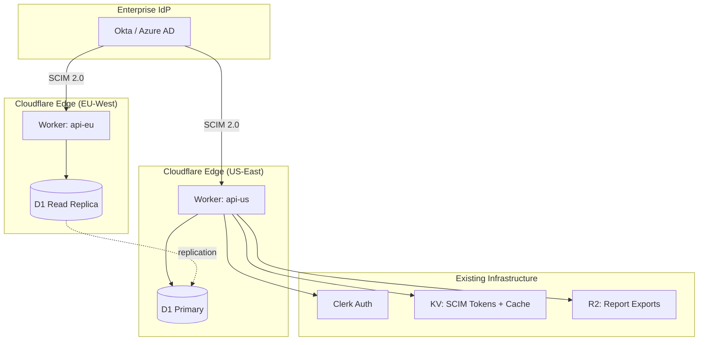
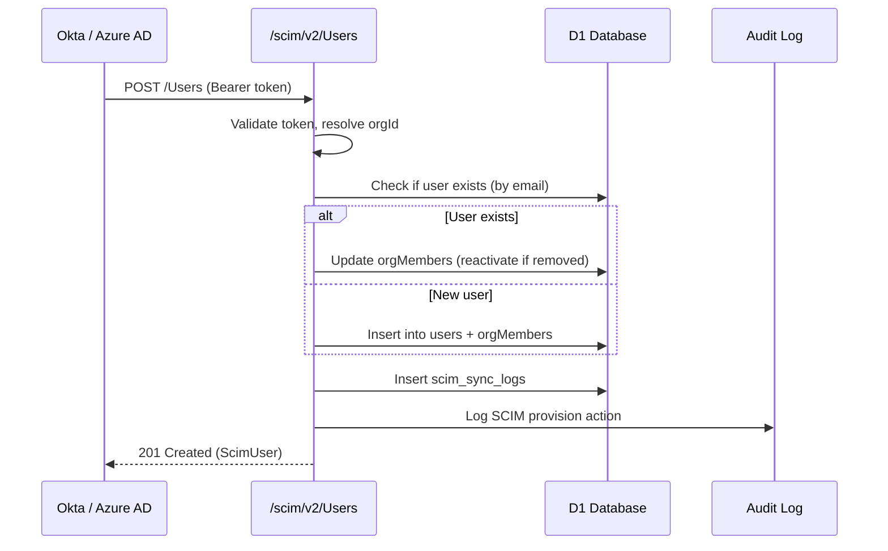

# Sprint 28: Enterprise Exit Prep - Technical Design Document

**Scope**: OpenSyber / Sprint 28 - Enterprise Exit Prep
**Generated**: 2026-03-07
**Agent**: Design Architect Agent
**Based on**: requirements.md

---

## Overview

Sprint 28 closes the remaining enterprise-readiness gaps before Series A fundraising. The six
workstreams are: (1) OpenAPI spec auto-generation, (2) SOC2 Type 1 controls with OASF mapping,
(3) SCIM 2.0 provisioning, (4) multi-region Cloudflare deployment, (5) SLA monitoring dashboard,
and (6) investor data room. All work builds on existing infrastructure -- no new frameworks or
runtime dependencies are introduced.

Key architectural decisions:
- OpenAPI spec is generated at build time via `@hono/zod-openapi`, not at runtime
- SCIM is a separate Hono route group with its own Bearer token auth (not Clerk JWT)
- Multi-region uses Cloudflare Workers' built-in edge routing + D1 read replicas
- SOC2 evidence is computed from existing tables, not duplicated
- Data room metrics are cached snapshots refreshed by cron, not computed on request

## Architecture

### High-Level Architecture



### Technology Stack

- **API**: Cloudflare Workers (Hono) + `@hono/zod-openapi` for spec generation
- **Database**: D1 (SQLite) with Drizzle ORM, D1 read replicas for EU
- **Auth**: Clerk JWT (user routes), Bearer token (SCIM routes)
- **Storage**: R2 for PDF/JSON report exports, KV for SCIM tokens + caching
- **Frontend**: Next.js 16 with proxy routes

## Components and Interfaces

### 1. OpenAPI Spec Generation

#### Build-Time Spec Generator
**Purpose**: Generate OpenAPI 3.0 JSON from Hono route definitions at build time.

**Approach**: Use `@hono/zod-openapi` to annotate existing routes with Zod schemas.
The spec is generated during `pnpm build` and written to `apps/api/static/openapi.json`.
The Worker serves this static file at `/openapi.json`.

**Files**:
- `apps/api/src/openapi/spec-builder.ts` - Collects route metadata and builds OpenAPI doc
- `apps/api/src/openapi/schemas.ts` - Shared Zod schemas for request/response types
- `apps/api/src/openapi/tags.ts` - Endpoint tag definitions
- `apps/api/src/routes/openapi.ts` - Serves `/openapi.json` and `/docs` (Swagger UI)
- `apps/api/scripts/generate-openapi.ts` - Build script entry point

**Interface**:
```typescript
// apps/api/src/openapi/spec-builder.ts
interface RouteMetadata {
  method: 'get' | 'post' | 'put' | 'patch' | 'delete';
  path: string;
  tag: string;
  summary: string;
  description?: string;
  auth: 'clerk' | 'gateway' | 'scim' | 'public';
  requestBody?: ZodSchema;
  responseBody: ZodSchema;
  params?: ZodSchema;
  query?: ZodSchema;
}

function buildOpenApiSpec(routes: RouteMetadata[]): OpenAPIObject;
```

**Implementation Notes**:
- Do NOT refactor all existing routes to `@hono/zod-openapi` style -- that is too invasive.
  Instead, define route metadata separately in `openapi/` directory and reference Zod schemas.
- The `/docs` endpoint serves Swagger UI from a CDN (`unpkg.com/swagger-ui-dist`).
- Add `openapi.json` generation to the `build` script in `apps/api/package.json`.
- Rate-limit `/openapi.json` as `public` (same as `/health`).

#### Swagger UI Route
**Purpose**: Interactive API documentation at `/docs`.

```typescript
// apps/api/src/routes/openapi.ts
openapiRoutes.get('/openapi.json', async (c) => {
  // Serve pre-built spec from R2 or embedded asset
  return c.json(openApiSpec);
});

openapiRoutes.get('/docs', (c) => {
  return c.html(swaggerUiHtml);
});
```

---

### 2. SOC2 Type 1 Controls

#### SOC2 Control Mapping Service
**Purpose**: Map OASF assessment results to SOC2 Trust Service Criteria.

**Files**:
- `apps/api/src/services/soc2/control-map.ts` - Static OASF-to-SOC2 mapping
- `apps/api/src/services/soc2/evidence-collector.ts` - Collects evidence from existing tables
- `apps/api/src/services/soc2/report-generator.ts` - Generates SOC2 readiness report
- `apps/api/src/routes/soc2/readiness.ts` - API endpoints for SOC2 dashboard
- `apps/api/src/routes/soc2/evidence.ts` - Evidence export endpoints
- `apps/api/src/routes/soc2/remediation.ts` - Remediation plan CRUD

**Interface**:
```typescript
// apps/api/src/services/soc2/control-map.ts
interface Soc2Mapping {
  oasfControlId: string;       // e.g., "OASF-01"
  soc2Criterion: string;       // e.g., "CC6.1"
  soc2Category: string;        // e.g., "Logical and Physical Access Controls"
  evidenceSources: string[];   // e.g., ["audit_events", "org_members", "sso_configs"]
  description: string;
}

const OASF_TO_SOC2_MAP: Soc2Mapping[] = [
  // 15 OASF controls mapped to relevant SOC2 TSC
];
```

```typescript
// apps/api/src/services/soc2/evidence-collector.ts
interface EvidenceSnapshot {
  criterion: string;
  status: 'pass' | 'fail' | 'partial';
  evidenceItems: EvidenceItem[];
  collectedAt: string;
}

interface EvidenceItem {
  sourceTable: string;
  description: string;
  recordCount: number;
  sampleData?: string;  // JSON-stringified sample (redacted)
}

function collectSoc2Evidence(
  db: DrizzleD1Database,
  orgId: string,
  criterion: string
): Promise<EvidenceSnapshot>;
```

**SOC2 Trust Service Criteria Coverage**:

| TSC | Category | OASF Controls | Evidence Sources |
|-----|----------|---------------|------------------|
| CC1 | Control Environment | OASF-01, OASF-02 | org_members, rbac roles |
| CC2 | Communication | OASF-03 | alert_rules, notification_channels |
| CC3 | Risk Assessment | OASF-04, OASF-05 | agent_policies, risk_snapshots |
| CC5 | Control Activities | OASF-06 through OASF-10 | policies, vault, network rules |
| CC6 | Access Controls | OASF-11, OASF-12 | sso_configs, access_control_log |
| CC7 | System Operations | OASF-13 | uptime_records, vulnerability_scans |
| CC8 | Change Management | OASF-14 | audit_events, instance deployments |
| CC9 | Risk Mitigation | OASF-15 | cspm_findings, agent_activity |
| A1 | Availability | -- | sla_configs, uptime_records |

---

### 3. SCIM 2.0 Provisioning

#### SCIM Route Group
**Purpose**: RFC 7644 SCIM 2.0 endpoints for enterprise IdP user/group sync.

**Files**:
- `apps/api/src/routes/scim/users.ts` - SCIM /Users CRUD
- `apps/api/src/routes/scim/groups.ts` - SCIM /Groups CRUD
- `apps/api/src/routes/scim/schemas.ts` - SCIM schema discovery
- `apps/api/src/routes/scim/index.ts` - Route registration + barrel export
- `apps/api/src/middleware/scim-auth.ts` - SCIM Bearer token auth middleware
- `apps/api/src/services/scim/user-mapper.ts` - Map SCIM User to orgMember
- `apps/api/src/services/scim/group-mapper.ts` - Map SCIM Group to role
- `apps/api/src/services/scim/filter-parser.ts` - Parse SCIM filter expressions

**Route Registration** (in `register.ts`):
```typescript
// SCIM provisioning (enterprise IdP sync)
app.route('/scim/v2', scimRoutes);
```

**SCIM Auth Middleware**:
```typescript
// apps/api/src/middleware/scim-auth.ts
// Unlike Clerk auth, SCIM uses a per-org Bearer token.
// Token is stored in scim_tokens table, scoped to orgId.
async function scimAuth(c: Context, next: Next): Promise<void> {
  const authHeader = c.req.header('Authorization');
  // Extract Bearer token, look up in scim_tokens, set orgId
  // Reject if token missing, invalid, or expired
}
```

**SCIM User Endpoint Interface**:
```typescript
// GET /scim/v2/Users
// GET /scim/v2/Users/:id
// POST /scim/v2/Users
// PUT /scim/v2/Users/:id
// PATCH /scim/v2/Users/:id
// DELETE /scim/v2/Users/:id

interface ScimUser {
  schemas: ['urn:ietf:params:scim:schemas:core:2.0:User'];
  id: string;
  userName: string;  // email
  name: { givenName: string; familyName: string };
  emails: Array<{ value: string; primary: boolean }>;
  active: boolean;
  groups: Array<{ value: string; display: string }>;
  meta: { resourceType: 'User'; created: string; lastModified: string };
}
```

**SCIM Group Endpoint Interface**:
```typescript
// GET /scim/v2/Groups
// GET /scim/v2/Groups/:id
// POST /scim/v2/Groups
// PUT /scim/v2/Groups/:id
// PATCH /scim/v2/Groups/:id
// DELETE /scim/v2/Groups/:id

interface ScimGroup {
  schemas: ['urn:ietf:params:scim:schemas:core:2.0:Group'];
  id: string;
  displayName: string;  // maps to role name
  members: Array<{ value: string; display: string }>;
  meta: { resourceType: 'Group'; created: string; lastModified: string };
}
```

**User Provisioning Flow**:


**Implementation Notes**:
- SCIM tokens are generated in the org settings page (admin/owner only).
- Token format: `scim_` prefix + 32-byte random hex. Stored hashed (SHA-256) in DB.
- SCIM DELETE does NOT delete the user -- it sets `orgMembers.status = 'removed'`.
- SCIM filter parser only needs to support `eq` operator on `userName` and `externalId`.
- Mount SCIM routes BEFORE the Clerk auth middleware (separate auth path).
- SCIM responses use `application/scim+json` content type.

---

### 4. Multi-Region Deployment

#### Deployment Architecture
**Purpose**: Serve API from EU-West and US-East for data residency compliance.

**Approach**: Cloudflare Workers run at every edge location by default. Multi-region
here means deploying separate Worker instances with region-specific D1 bindings.

**Files**:
- `apps/api/wrangler.toml` - Updated with environment-specific configs
- `apps/api/src/middleware/region.ts` - Adds `X-Region` header, routes writes
- `apps/api/scripts/deploy-multi-region.sh` - Deployment script

**wrangler.toml Configuration**:
```toml
# apps/api/wrangler.toml
name = "opensyber-api"
main = "src/index.ts"

[env.us-east]
name = "opensyber-api-us"
routes = [{ pattern = "api-us.opensyber.cloud/*", zone_name = "opensyber.cloud" }]
d1_databases = [{ binding = "DB", database_name = "opensyber-us", database_id = "..." }]

[env.eu-west]
name = "opensyber-api-eu"
routes = [{ pattern = "api-eu.opensyber.cloud/*", zone_name = "opensyber.cloud" }]
d1_databases = [{ binding = "DB", database_name = "opensyber-eu", database_id = "..." }]
```

**Region Middleware**:
```typescript
// apps/api/src/middleware/region.ts
async function regionMiddleware(c: Context, next: Next): Promise<void> {
  const region = c.env.REGION || 'us-east'; // set per wrangler env
  c.header('X-Region', region);
  await next();
}
```

**Implementation Notes**:
- Primary D1 is in US-East. EU-West D1 is a read replica for EU-resident orgs.
- Write operations from EU orgs are proxied to the US-East primary via Service Bindings.
- The main `api.opensyber.cloud` domain uses Cloudflare geo-routing to direct
  requests to the nearest regional Worker.
- D1 read replicas are a Cloudflare-managed feature -- no custom replication code needed.
- Data residency enforcement: if `dataResidencyConfigs.region = 'eu'`, ensure compute
  (Hetzner) is in `eu-central` and reads come from `opensyber-eu` D1.

---

### 5. SLA Monitoring Dashboard

#### SLA Aggregation Service
**Purpose**: Compute uptime percentages and response time percentiles from raw records.

**Files**:
- `apps/api/src/services/sla/aggregator.ts` - Compute uptime % and percentiles
- `apps/api/src/services/sla/breach-detector.ts` - Detect SLA breaches, trigger alerts
- `apps/api/src/routes/sla/dashboard.ts` - SLA dashboard API endpoints
- `apps/api/src/routes/sla/export.ts` - PDF/JSON export
- `apps/web/src/app/dashboard/sla/page.tsx` - SLA dashboard page
- `apps/web/src/components/dashboard/SlaUptimeChart.tsx` - Uptime chart component
- `apps/web/src/components/dashboard/SlaResponseTime.tsx` - P50/P95/P99 chart

**Interface**:
```typescript
// apps/api/src/services/sla/aggregator.ts
interface SlaMetrics {
  period: 'hourly' | 'daily' | 'monthly';
  uptimePercent: number;
  totalChecks: number;
  successfulChecks: number;
  downtimeMinutes: number;
  responseTimeP50: number;
  responseTimeP95: number;
  responseTimeP99: number;
  mttr: number | null;  // minutes, null if no incidents
}

function computeSlaMetrics(
  db: DrizzleD1Database,
  orgId: string,
  period: 'hourly' | 'daily' | 'monthly',
  from: string,
  to: string
): Promise<SlaMetrics[]>;
```

**API Endpoints**:
```
GET /api/security/sla/metrics?period=daily&from=2026-05-01&to=2026-08-01
GET /api/security/sla/breaches
GET /api/security/sla/export?format=pdf&period=monthly&months=3
GET /api/admin/sla/global  (admin-only: all orgs)
```

**Implementation Notes**:
- Uptime % = (successful checks / total checks) * 100.
- MTTR = average(incident.resolvedAt - incident.createdAt) for resolved incidents in period.
- P50/P95/P99 calculated in-memory from responseTimeMs values (D1 has no native percentile).
- Breach detection runs in the existing `scheduled()` cron handler.
- SLA export uses the existing R2 bucket for PDF storage.

---

### 6. Series A Data Room

#### Data Room Service
**Purpose**: Aggregate investor-facing metrics from existing data.

**Files**:
- `apps/api/src/services/dataroom/mrr-calculator.ts` - MRR from subscription data
- `apps/api/src/services/dataroom/customer-metrics.ts` - Customer counts, churn
- `apps/api/src/services/dataroom/usage-metrics.ts` - Product usage aggregation
- `apps/api/src/routes/admin-dataroom.ts` - Admin-only data room endpoints
- `apps/web/src/app/dashboard/admin/dataroom/page.tsx` - Data room dashboard

**Interface**:
```typescript
// apps/api/src/services/dataroom/mrr-calculator.ts
interface MrrDataPoint {
  month: string;         // "2026-08"
  mrr: number;           // cents
  newMrr: number;
  expansionMrr: number;
  contractionMrr: number;
  churnedMrr: number;
  customerCount: number;
}

// apps/api/src/services/dataroom/customer-metrics.ts
interface CustomerMetrics {
  totalOrgs: number;
  payingOrgs: number;
  enterpriseOrgs: number;
  churnedOrgs: number;
  nrr: number;           // percentage, e.g., 115
  avgLtv: number;        // cents
  avgCac: number;        // cents
}
```

**API Endpoints**:
```
GET /api/admin/data-room/mrr?months=12
GET /api/admin/data-room/customers
GET /api/admin/data-room/usage
GET /api/admin/data-room/security-posture
GET /api/admin/data-room/export  (JSON bundle)
```

**Implementation Notes**:
- MRR is derived from `users.plan` + `organizations.plan` columns and plan pricing constants.
- For accurate MRR tracking, add a `subscription_events` table to record plan changes over time.
- Data room snapshots are cached in KV with 1-hour TTL to avoid expensive re-computation.
- Admin-only: uses existing `adminMiddleware` which checks `ADMIN_USER_IDS` env var.

---

## Data Models

### SOC2 Tables

```typescript
// packages/db/src/schema/soc2.ts
export const soc2ControlMappings = sqliteTable('soc2_control_mappings', {
  id: text('id').primaryKey(),
  oasfControlId: text('oasf_control_id').notNull(),
  soc2Criterion: text('soc2_criterion').notNull(),    // e.g., "CC6.1"
  soc2Category: text('soc2_category').notNull(),
  evidenceSources: text('evidence_sources').notNull(), // JSON array
  description: text('description').notNull(),
});

export const soc2EvidenceSnapshots = sqliteTable('soc2_evidence_snapshots', {
  id: text('id').primaryKey(),
  orgId: text('org_id').notNull()
    .references(() => organizations.id, { onDelete: 'cascade' }),
  criterion: text('criterion').notNull(),
  status: text('status', { enum: ['pass', 'fail', 'partial'] }).notNull(),
  evidenceItems: text('evidence_items').notNull(),    // JSON
  collectedAt: text('collected_at').notNull(),
  createdAt: text('created_at').notNull()
    .default(sql`(datetime('now'))`),
});

export const soc2RemediationPlans = sqliteTable('soc2_remediation_plans', {
  id: text('id').primaryKey(),
  orgId: text('org_id').notNull()
    .references(() => organizations.id, { onDelete: 'cascade' }),
  criterion: text('criterion').notNull(),
  description: text('description').notNull(),
  ownerId: text('owner_id').references(() => users.id),
  status: text('status', { enum: ['open', 'in_progress', 'completed'] })
    .notNull().default('open'),
  dueDate: text('due_date'),
  completedAt: text('completed_at'),
  createdAt: text('created_at').notNull()
    .default(sql`(datetime('now'))`),
});
```

### SCIM Tables

```typescript
// packages/db/src/schema/scim.ts
export const scimTokens = sqliteTable('scim_tokens', {
  id: text('id').primaryKey(),
  orgId: text('org_id').notNull()
    .references(() => organizations.id, { onDelete: 'cascade' }),
  tokenHash: text('token_hash').notNull().unique(), // SHA-256 of token
  label: text('label').notNull(),                    // "Okta SCIM", "Azure AD"
  createdBy: text('created_by').notNull()
    .references(() => users.id),
  lastUsedAt: text('last_used_at'),
  expiresAt: text('expires_at'),
  isActive: integer('is_active', { mode: 'boolean' }).notNull().default(true),
  createdAt: text('created_at').notNull()
    .default(sql`(datetime('now'))`),
});

export const scimSyncLogs = sqliteTable('scim_sync_logs', {
  id: text('id').primaryKey(),
  orgId: text('org_id').notNull()
    .references(() => organizations.id, { onDelete: 'cascade' }),
  operation: text('operation', {
    enum: ['create', 'update', 'deactivate', 'reactivate', 'group_assign', 'group_remove'],
  }).notNull(),
  resourceType: text('resource_type', { enum: ['User', 'Group'] }).notNull(),
  resourceId: text('resource_id').notNull(),
  details: text('details'),                          // JSON
  createdAt: text('created_at').notNull()
    .default(sql`(datetime('now'))`),
});
```

### SLA Report Table

```typescript
// Add to packages/db/src/schema/uptime.ts
export const slaReports = sqliteTable('sla_reports', {
  id: text('id').primaryKey(),
  orgId: text('org_id').notNull()
    .references(() => organizations.id, { onDelete: 'cascade' }),
  period: text('period', { enum: ['monthly', 'quarterly'] }).notNull(),
  startDate: text('start_date').notNull(),
  endDate: text('end_date').notNull(),
  uptimePercent: real('uptime_percent').notNull(),
  mttr: integer('mttr'),                              // minutes
  totalIncidents: integer('total_incidents').notNull(),
  slaMet: integer('sla_met', { mode: 'boolean' }).notNull(),
  reportUrl: text('report_url'),                      // R2 URL for PDF
  createdAt: text('created_at').notNull()
    .default(sql`(datetime('now'))`),
});
```

### Subscription Events Table

```typescript
// Add to packages/db/src/schema/enterprise.ts
export const subscriptionEvents = sqliteTable('subscription_events', {
  id: text('id').primaryKey(),
  orgId: text('org_id').references(() => organizations.id),
  userId: text('user_id').references(() => users.id),
  eventType: text('event_type', {
    enum: ['created', 'upgraded', 'downgraded', 'cancelled', 'renewed'],
  }).notNull(),
  fromPlan: text('from_plan'),
  toPlan: text('to_plan'),
  mrrCents: integer('mrr_cents').notNull(),
  lsSubscriptionId: text('ls_subscription_id'),       // LemonSqueezy ref
  createdAt: text('created_at').notNull()
    .default(sql`(datetime('now'))`),
});
```

### Migration File

```sql
-- packages/db/migrations/0013_enterprise_exit_prep.sql

-- SOC2 Control Mappings
CREATE TABLE soc2_control_mappings (
  id TEXT PRIMARY KEY,
  oasf_control_id TEXT NOT NULL,
  soc2_criterion TEXT NOT NULL,
  soc2_category TEXT NOT NULL,
  evidence_sources TEXT NOT NULL,
  description TEXT NOT NULL
);

-- SOC2 Evidence Snapshots
CREATE TABLE soc2_evidence_snapshots (
  id TEXT PRIMARY KEY,
  org_id TEXT NOT NULL REFERENCES organizations(id) ON DELETE CASCADE,
  criterion TEXT NOT NULL,
  status TEXT NOT NULL CHECK(status IN ('pass','fail','partial')),
  evidence_items TEXT NOT NULL,
  collected_at TEXT NOT NULL,
  created_at TEXT NOT NULL DEFAULT (datetime('now'))
);

-- SOC2 Remediation Plans
CREATE TABLE soc2_remediation_plans (
  id TEXT PRIMARY KEY,
  org_id TEXT NOT NULL REFERENCES organizations(id) ON DELETE CASCADE,
  criterion TEXT NOT NULL,
  description TEXT NOT NULL,
  owner_id TEXT REFERENCES users(id),
  status TEXT NOT NULL DEFAULT 'open' CHECK(status IN ('open','in_progress','completed')),
  due_date TEXT,
  completed_at TEXT,
  created_at TEXT NOT NULL DEFAULT (datetime('now'))
);

-- SCIM Tokens
CREATE TABLE scim_tokens (
  id TEXT PRIMARY KEY,
  org_id TEXT NOT NULL REFERENCES organizations(id) ON DELETE CASCADE,
  token_hash TEXT NOT NULL UNIQUE,
  label TEXT NOT NULL,
  created_by TEXT NOT NULL REFERENCES users(id),
  last_used_at TEXT,
  expires_at TEXT,
  is_active INTEGER NOT NULL DEFAULT 1,
  created_at TEXT NOT NULL DEFAULT (datetime('now'))
);

-- SCIM Sync Logs
CREATE TABLE scim_sync_logs (
  id TEXT PRIMARY KEY,
  org_id TEXT NOT NULL REFERENCES organizations(id) ON DELETE CASCADE,
  operation TEXT NOT NULL CHECK(operation IN ('create','update','deactivate','reactivate','group_assign','group_remove')),
  resource_type TEXT NOT NULL CHECK(resource_type IN ('User','Group')),
  resource_id TEXT NOT NULL,
  details TEXT,
  created_at TEXT NOT NULL DEFAULT (datetime('now'))
);

-- SLA Reports
CREATE TABLE sla_reports (
  id TEXT PRIMARY KEY,
  org_id TEXT NOT NULL REFERENCES organizations(id) ON DELETE CASCADE,
  period TEXT NOT NULL CHECK(period IN ('monthly','quarterly')),
  start_date TEXT NOT NULL,
  end_date TEXT NOT NULL,
  uptime_percent REAL NOT NULL,
  mttr INTEGER,
  total_incidents INTEGER NOT NULL,
  sla_met INTEGER NOT NULL,
  report_url TEXT,
  created_at TEXT NOT NULL DEFAULT (datetime('now'))
);

-- Subscription Events (for MRR tracking)
CREATE TABLE subscription_events (
  id TEXT PRIMARY KEY,
  org_id TEXT REFERENCES organizations(id),
  user_id TEXT REFERENCES users(id),
  event_type TEXT NOT NULL CHECK(event_type IN ('created','upgraded','downgraded','cancelled','renewed')),
  from_plan TEXT,
  to_plan TEXT,
  mrr_cents INTEGER NOT NULL,
  ls_subscription_id TEXT,
  created_at TEXT NOT NULL DEFAULT (datetime('now'))
);

-- Indexes
CREATE INDEX idx_soc2_evidence_org ON soc2_evidence_snapshots(org_id, criterion);
CREATE INDEX idx_scim_tokens_org ON scim_tokens(org_id, is_active);
CREATE INDEX idx_scim_sync_org ON scim_sync_logs(org_id, created_at);
CREATE INDEX idx_sla_reports_org ON sla_reports(org_id, start_date);
CREATE INDEX idx_subscription_events_org ON subscription_events(org_id, created_at);
CREATE INDEX idx_subscription_events_type ON subscription_events(event_type, created_at);
```

---

## API Design

### OpenAPI Routes (Public)

| Method | Path | Description |
|--------|------|-------------|
| GET | `/openapi.json` | OpenAPI 3.0 spec |
| GET | `/docs` | Swagger UI |

### SOC2 Routes (Authenticated, org-scoped)

| Method | Path | Auth | Permission |
|--------|------|------|------------|
| GET | `/api/security/soc2/readiness` | Clerk | compliance.view |
| POST | `/api/security/soc2/evidence/collect` | Clerk | compliance.generate |
| GET | `/api/security/soc2/evidence/:criterion` | Clerk | compliance.view |
| GET | `/api/security/soc2/export` | Clerk | compliance.generate |
| GET | `/api/security/soc2/remediation` | Clerk | compliance.view |
| POST | `/api/security/soc2/remediation` | Clerk | compliance.generate |
| PATCH | `/api/security/soc2/remediation/:id` | Clerk | compliance.generate |

### SCIM Routes (Bearer token, org-scoped)

| Method | Path | Auth |
|--------|------|------|
| GET | `/scim/v2/Users` | SCIM Bearer |
| GET | `/scim/v2/Users/:id` | SCIM Bearer |
| POST | `/scim/v2/Users` | SCIM Bearer |
| PUT | `/scim/v2/Users/:id` | SCIM Bearer |
| PATCH | `/scim/v2/Users/:id` | SCIM Bearer |
| DELETE | `/scim/v2/Users/:id` | SCIM Bearer |
| GET | `/scim/v2/Groups` | SCIM Bearer |
| GET | `/scim/v2/Groups/:id` | SCIM Bearer |
| POST | `/scim/v2/Groups` | SCIM Bearer |
| PUT | `/scim/v2/Groups/:id` | SCIM Bearer |
| PATCH | `/scim/v2/Groups/:id` | SCIM Bearer |
| DELETE | `/scim/v2/Groups/:id` | SCIM Bearer |
| GET | `/scim/v2/Schemas` | SCIM Bearer |
| GET | `/scim/v2/ServiceProviderConfig` | SCIM Bearer |

### SCIM Token Management (Authenticated)

| Method | Path | Auth | Permission |
|--------|------|------|------------|
| GET | `/api/organizations/:orgId/scim-tokens` | Clerk | scim.read |
| POST | `/api/organizations/:orgId/scim-tokens` | Clerk | scim.write |
| DELETE | `/api/organizations/:orgId/scim-tokens/:id` | Clerk | scim.write |

### SLA Routes (Authenticated, org-scoped)

| Method | Path | Auth | Permission |
|--------|------|------|------------|
| GET | `/api/security/sla/metrics` | Clerk | sla.view |
| GET | `/api/security/sla/breaches` | Clerk | sla.view |
| GET | `/api/security/sla/export` | Clerk | sla.export |
| GET | `/api/admin/sla/global` | Admin | admin |

### Data Room Routes (Admin only)

| Method | Path | Auth |
|--------|------|------|
| GET | `/api/admin/data-room/mrr` | Admin |
| GET | `/api/admin/data-room/customers` | Admin |
| GET | `/api/admin/data-room/usage` | Admin |
| GET | `/api/admin/data-room/security-posture` | Admin |
| GET | `/api/admin/data-room/export` | Admin |

---

## New Permissions

Add to `packages/shared/src/constants/permissions.ts`:

```typescript
// SCIM provisioning
'scim.read': 'scim.read',
'scim.write': 'scim.write',

// SLA monitoring
'sla.view': 'sla.view',
'sla.export': 'sla.export',
```

**Role mapping updates**:
- `sla.view` added to `VIEW_PERMISSIONS` (all roles)
- `sla.export` added to `security`, `admin`, `owner`
- `scim.read` and `scim.write` added to `admin` and `owner` only

---

## Error Handling

### SCIM Error Format
SCIM requires a specific error response format per RFC 7644:

```typescript
interface ScimError {
  schemas: ['urn:ietf:params:scim:api:messages:2.0:Error'];
  status: string;   // HTTP status as string
  scimType?: string; // e.g., "uniqueness", "invalidFilter"
  detail: string;
}
```

### Standard API Errors
All non-SCIM endpoints follow existing pattern:
```typescript
{ error: string; message: string }
```

---

## Security Design

### SCIM Token Security
- Tokens are generated as `scim_` + 32 random bytes (hex encoded) = 68 chars
- Only the SHA-256 hash is stored in D1. The plaintext is shown once at creation.
- Tokens are org-scoped: one token authenticates for exactly one organization.
- Tokens can be rotated without downtime (multiple active tokens per org).
- SCIM endpoints are rate-limited: 100 requests/minute per org (KV sliding window).

### SOC2 Evidence Security
- Evidence snapshots contain sampled data, never full records.
- Sample data is redacted: emails truncated, IPs partially masked.
- Evidence export is permission-gated (`compliance.generate`).
- Audit log records every evidence collection and export action.

### Multi-Region Security
- CORS origins are identical across regions.
- Encryption keys are the same across regions (stored in Worker secrets).
- SCIM tokens work across regions (D1 replication ensures consistency).

---

## Testing Strategy

### Unit Tests
| Component | Test File | Coverage Target |
|-----------|-----------|-----------------|
| SCIM user mapper | `scim/user-mapper.test.ts` | 100% |
| SCIM group mapper | `scim/group-mapper.test.ts` | 100% |
| SCIM filter parser | `scim/filter-parser.test.ts` | 100% |
| SOC2 control map | `soc2/control-map.test.ts` | 100% |
| SOC2 evidence collector | `soc2/evidence-collector.test.ts` | 90% |
| SLA aggregator | `sla/aggregator.test.ts` | 100% |
| SLA breach detector | `sla/breach-detector.test.ts` | 100% |
| MRR calculator | `dataroom/mrr-calculator.test.ts` | 100% |

### Integration Tests
| Test | Description |
|------|-------------|
| SCIM User CRUD | Full lifecycle: create, read, update, deactivate |
| SCIM Group assign | Assign user to group, verify role change |
| SCIM auth rejection | Invalid token returns 401 |
| SOC2 evidence collection | Verify evidence pulled from correct tables |
| SLA metrics aggregation | Verify uptime % calculation from records |

### Security Tests
| Test | Description |
|------|-------------|
| SCIM token expiration | Expired token returns 401 |
| SCIM cross-org isolation | Token from org A cannot access org B |
| SOC2 export permission | Viewer cannot export evidence |
| Data room admin-only | Non-admin user returns 403 |
| SCIM rate limiting | 101st request in window returns 429 |

---

## Deployment Strategy

### Multi-Region Deployment Script

```bash
#!/bin/bash
# apps/api/scripts/deploy-multi-region.sh

# Build OpenAPI spec first
pnpm run generate:openapi

# Deploy to both regions
wrangler deploy --env us-east
wrangler deploy --env eu-west

# Apply D1 migrations to both databases
wrangler d1 migrations apply opensyber-us --env us-east
wrangler d1 migrations apply opensyber-eu --env eu-west
```

### CI/CD Updates
- Add `generate:openapi` step before `build` in CI pipeline.
- Add multi-region deploy step (parallel deploy to US + EU).
- Add SCIM integration test against staging (Okta test tenant).

---

## Migration and Rollout Plan

### Phase 1: Foundation (Week 1)
- [ ] Create migration `0013_enterprise_exit_prep.sql`
- [ ] Add new permissions to `permissions.ts`
- [ ] Implement SCIM auth middleware
- [ ] Implement SCIM token management endpoints
- [ ] Implement SOC2 control mapping (static data)

### Phase 2: SCIM + SOC2 (Week 2)
- [ ] Implement SCIM `/Users` endpoints (full CRUD)
- [ ] Implement SCIM `/Groups` endpoints (full CRUD)
- [ ] Implement SCIM filter parser
- [ ] Implement SOC2 evidence collector
- [ ] Implement SOC2 readiness dashboard API
- [ ] Implement SOC2 remediation plan CRUD

### Phase 3: SLA + OpenAPI (Week 3)
- [ ] Implement SLA aggregation service
- [ ] Implement SLA breach detection in cron
- [ ] Implement SLA dashboard API + frontend page
- [ ] Set up `@hono/zod-openapi` + spec builder
- [ ] Generate OpenAPI spec for all route groups
- [ ] Implement `/openapi.json` and `/docs` routes

### Phase 4: Multi-Region + Data Room (Week 4)
- [ ] Configure `wrangler.toml` multi-region environments
- [ ] Implement region middleware
- [ ] Set up D1 read replica for EU
- [ ] Implement data room metric services (MRR, customers, usage)
- [ ] Implement data room admin API + frontend
- [ ] Implement data room export (JSON bundle)

### Phase 5: Testing + Hardening (Week 5)
- [ ] Write all unit tests (target: 90%+ coverage)
- [ ] Write SCIM integration tests with Okta test tenant
- [ ] Write SOC2 evidence accuracy tests
- [ ] SLA dashboard frontend page
- [ ] SOC2 readiness frontend page
- [ ] Multi-region smoke tests (verify EU reads, US writes)
- [ ] Security review: SCIM token handling, evidence redaction
- [ ] Deploy to staging, full regression

---

## Appendices

### Design Decisions

| Decision | Rationale |
|----------|-----------|
| Build-time OpenAPI, not runtime | Zero overhead on API latency; spec only changes on deploy |
| Separate SCIM auth (not Clerk) | Enterprise IdPs send machine-to-machine tokens, not user JWTs |
| SOC2 evidence from existing tables | No data duplication; evidence is always fresh |
| KV-cached data room metrics | Expensive aggregation queries should not run on every request |
| SCIM soft-delete (not hard) | Enterprise IdPs expect to re-provision deactivated users |

### File Organization

```
apps/api/src/
  middleware/
    scim-auth.ts              (new)
    region.ts                 (new)
  openapi/
    spec-builder.ts           (new)
    schemas.ts                (new)
    tags.ts                   (new)
  routes/
    openapi.ts                (new)
    scim/
      index.ts                (new)
      users.ts                (new)
      groups.ts               (new)
      schemas.ts              (new)
    soc2/
      readiness.ts            (new)
      evidence.ts             (new)
      remediation.ts          (new)
    sla/
      dashboard.ts            (new)
      export.ts               (new)
    admin-dataroom.ts         (new)
  services/
    soc2/
      control-map.ts          (new)
      evidence-collector.ts   (new)
      report-generator.ts     (new)
    sla/
      aggregator.ts           (new)
      breach-detector.ts      (new)
    scim/
      user-mapper.ts          (new)
      group-mapper.ts         (new)
      filter-parser.ts        (new)
    dataroom/
      mrr-calculator.ts       (new)
      customer-metrics.ts     (new)
      usage-metrics.ts        (new)

packages/db/src/schema/
  soc2.ts                     (new)
  scim.ts                     (new)
  uptime.ts                   (modified - add slaReports)
  enterprise.ts               (modified - add subscriptionEvents)
  index.ts                    (modified - add exports)

packages/db/migrations/
  0013_enterprise_exit_prep.sql (new)

packages/shared/src/constants/
  permissions.ts              (modified - add scim.*, sla.*)

apps/web/src/app/dashboard/
  sla/page.tsx                (new)
  admin/dataroom/page.tsx     (new)
  admin/soc2/page.tsx         (new)
```

### Conventions

- SCIM responses: `application/scim+json` content type
- SCIM pagination: `startIndex` (1-based), `count`, `totalResults`, `itemsPerPage`
- SOC2 criteria IDs: `CC1.1`, `CC6.1`, `A1.1` format (per AICPA)
- Region codes: `us-east`, `eu-west` (matching Cloudflare location names)
- Data room amounts: always in cents (integer), converted to dollars in frontend
