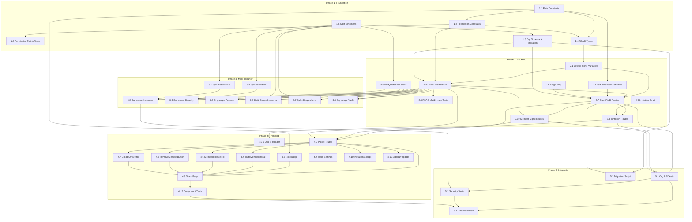

# Implementation Plan

**Scope**: OpenSyber / Sprint 8 -- Enterprise RBAC, Teams & Organizations
**Generated**: 2026-02-28
**Agent**: Task Planning Agent
**Based on**: design.md, requirements.md

---

## Overview

Sprint 8 transforms OpenSyber from a single-user product into a multi-user, organization-based platform with role-based access control. The implementation is structured in 5 phases with strict dependency ordering: foundation types and schema first, backend middleware and API second, multi-tenancy refactoring third, frontend UI fourth, and integration testing last.

All new files must comply with the 200-line file size limit. Six existing oversized files (schema.ts, instances.ts, security.ts, webhooks.ts, incidents.ts, alerts.ts) are split during Phase 3 as a prerequisite for adding RBAC middleware to their routes.

## Implementation Phases

| Phase | Name | Tasks | Est. Days |
|---|---|---|---|
| 1 | Foundation (Schema + Types) | 1.1 -- 1.6 | 1.5 |
| 2 | Backend (Middleware + API) | 2.1 -- 2.10 | 3 |
| 3 | Multi-Tenancy Updates | 3.1 -- 3.8 | 2 |
| 4 | Frontend (UI) | 4.1 -- 4.12 | 2.5 |
| 5 | Integration & Polish | 5.1 -- 5.4 | 1 |

## Prerequisites

- [x] Sprints 1-5 complete (working MVP)
- [x] Sprints 6-7 complete (TokenForge product)
- [x] 7 existing D1 migrations (0001-0007) applied
- [x] Existing test suite passing

---

## Task List

### Phase 1: Foundation (Schema + Types)

These tasks establish the data model, type system, and permission matrix that every subsequent task depends on.

---

- [x] **1.1 Create RBAC role constants in shared package**
  - **Description**: Create `packages/shared/src/constants/roles.ts` with the 5-role definition (owner, admin, security, developer, viewer), role hierarchy map, role labels for UI, `isHigherRole` helper, and `ASSIGNABLE_ROLES` list. Update `packages/shared/src/constants/index.ts` to re-export.
  - **Files**:
    - Create: `packages/shared/src/constants/roles.ts`
    - Modify: `packages/shared/src/constants/index.ts`
  - **Requirements**: FR-8.2.1 (Role constants)
  - **Estimated Complexity**: S (Small -- single file, ~40 lines)
  - **Dependencies**: None
  - **Acceptance Criteria**:
    - [ ] `ROLES` object exported as `const`
    - [ ] `Role` type exported as string literal union
    - [ ] `ROLE_HIERARCHY` exported as `Record<Role, number>` (owner=5 through viewer=1)
    - [ ] `ROLE_LABELS` exported as `Record<Role, string>`
    - [ ] `isHigherRole(a, b)` function exported and correct
    - [ ] `ASSIGNABLE_ROLES` array excludes 'owner'
    - [ ] Re-exported from `packages/shared/src/constants/index.ts`
    - [ ] `pnpm typecheck` passes in packages/shared

---

- [x] **1.2 Create RBAC permission constants and hasPermission function**
  - **Description**: Create `packages/shared/src/constants/permissions.ts` with all 34 permissions as string literal constants, the `ROLE_PERMISSIONS` map (5 roles x 34 permissions using `Set<Permission>`), and the `hasPermission(role, permission)` function. Update barrel export.
  - **Files**:
    - Create: `packages/shared/src/constants/permissions.ts`
    - Modify: `packages/shared/src/constants/index.ts`
  - **Requirements**: FR-8.2.2 (Permission constants)
  - **Estimated Complexity**: M (Medium -- ~150 lines, careful matrix definition)
  - **Dependencies**: 1.1
  - **Acceptance Criteria**:
    - [ ] All 34 permissions defined in `PERMISSIONS` const object
    - [ ] `Permission` type exported as string literal union
    - [ ] `ROLE_PERMISSIONS` maps each role to a `Set<Permission>`
    - [ ] Owner has all 34 permissions
    - [ ] All *.view permissions granted to all 5 roles
    - [ ] `billing.manage` is owner-only
    - [ ] `org.delete` is owner-only
    - [ ] Developer cannot `instance.delete`, cannot manage policies/incidents
    - [ ] Security cannot `instance.create`, cannot manage members
    - [ ] `hasPermission()` returns boolean with O(1) lookup
    - [ ] File is under 200 lines

---

- [x] **1.3 Write permission matrix tests**
  - **Description**: Create comprehensive tests for the role-permission matrix. Test every cell that matters: owner-has-all, viewer-denied-writes, each role's unique permissions, hierarchy checks. Target 100% coverage on roles.ts and permissions.ts.
  - **Files**:
    - Create: `packages/shared/src/constants/permissions.test.ts`
    - Create: `packages/shared/src/constants/roles.test.ts`
  - **Requirements**: FR-8.2.2 (Tests verify every cell), Test Strategy 10.2
  - **Estimated Complexity**: M (Medium -- ~200 lines combined)
  - **Dependencies**: 1.1, 1.2
  - **Acceptance Criteria**:
    - [ ] Test: owner has all 34 permissions
    - [ ] Test: all 5 roles have all *.view permissions (7 view permissions x 5 roles)
    - [ ] Test: viewer denied all write permissions
    - [ ] Test: billing.manage is owner-only
    - [ ] Test: org.delete is owner-only
    - [ ] Test: developer can instance.create but not instance.delete
    - [ ] Test: security can policy.create but not instance.create
    - [ ] Test: `isHigherRole` function correctness
    - [ ] Test: `ASSIGNABLE_ROLES` does not include 'owner'
    - [ ] All tests pass with `pnpm test` in packages/shared

---

- [x] **1.4 Create RBAC types and Organization interfaces**
  - **Description**: Create `packages/shared/src/types/rbac.ts` with `Organization`, `OrgMember`, `OrgInvitation`, `OrgWithMembership`, `OrgMemberStatus`, and `InvitationStatus` types. Re-export `Role` and `Permission` from this file for convenience. Update barrel export.
  - **Files**:
    - Create: `packages/shared/src/types/rbac.ts`
    - Modify: `packages/shared/src/types/index.ts`
  - **Requirements**: FR-8.2.3 (RBAC types)
  - **Estimated Complexity**: S (Small -- ~55 lines, pure type definitions)
  - **Dependencies**: 1.1, 1.2
  - **Acceptance Criteria**:
    - [ ] `Organization` interface matches DB schema (id, name, slug, ownerId, plan, maxInstances, timestamps)
    - [ ] `OrgMember` interface matches DB schema
    - [ ] `OrgInvitation` interface matches DB schema
    - [ ] `OrgWithMembership` extends Organization with memberCount, currentUserRole
    - [ ] Status types match enum values in design
    - [ ] Re-exported from `packages/shared/src/types/index.ts`
    - [ ] `pnpm typecheck` passes

---

- [x] **1.5 Split schema.ts into schema/ directory**
  - **Description**: The current `packages/db/src/schema.ts` is 634 lines. Split it into 5 domain files inside a new `packages/db/src/schema/` directory: `users.ts` (~35 lines), `instances.ts` (~75 lines), `security.ts` (~190 lines), `tokenforge.ts` (~100 lines), and `index.ts` (barrel export). Add `orgId` field to `instances` table definition (plain text, not FK reference to avoid circular imports). Update `packages/db/src/index.ts` to export from `./schema/index.js`. Delete the old `schema.ts` file.
  - **Files**:
    - Create: `packages/db/src/schema/index.ts`
    - Create: `packages/db/src/schema/users.ts`
    - Create: `packages/db/src/schema/instances.ts`
    - Create: `packages/db/src/schema/security.ts`
    - Create: `packages/db/src/schema/tokenforge.ts`
    - Modify: `packages/db/src/index.ts`
    - Delete: `packages/db/src/schema.ts`
  - **Requirements**: FR-8.1.5 (Schema split), Code Size Constraint 6.2
  - **Estimated Complexity**: L (Large -- careful extraction, must preserve all exports)
  - **Dependencies**: None (can be done in parallel with 1.1-1.4)
  - **Acceptance Criteria**:
    - [ ] Each schema file is under 200 lines
    - [ ] Barrel export re-exports all tables from all files
    - [ ] `import { ... } from '@opensyber/db'` continues to work for ALL existing tables
    - [ ] `instances` table has new `orgId: text('org_id')` column (nullable)
    - [ ] `securityPolicies` table has new `orgId` column (nullable)
    - [ ] `incidents` table has new `orgId` column (nullable)
    - [ ] `pnpm typecheck` passes across the entire monorepo
    - [ ] `pnpm test` passes across the entire monorepo (no import breakage)

---

- [x] **1.6 Create organizations Drizzle schema and D1 migration**
  - **Description**: Create `packages/db/src/schema/organizations.ts` (~80 lines) with `organizations`, `orgMembers`, and `orgInvitations` table definitions. Create the SQL migration file `packages/db/migrations/0008_organizations_rbac.sql` with CREATE TABLE statements for all 3 new tables, ALTER TABLE for orgId on instances/security_policies/incidents, and all indexes. Update the schema barrel export.
  - **Files**:
    - Create: `packages/db/src/schema/organizations.ts`
    - Create: `packages/db/migrations/0008_organizations_rbac.sql`
    - Modify: `packages/db/src/schema/index.ts`
  - **Requirements**: FR-8.1.1 (organizations table), FR-8.1.2 (org_members table), FR-8.1.3 (org_invitations table), FR-8.1.4 (orgId on existing tables)
  - **Estimated Complexity**: M (Medium -- ~80 lines schema + ~45 lines SQL)
  - **Dependencies**: 1.5
  - **Acceptance Criteria**:
    - [ ] `organizations` table: id, name, slug (unique), ownerId, plan, maxInstances, timestamps
    - [ ] `orgMembers` table: id, orgId, userId, role (enum 5 values), invitedBy, invitedAt, acceptedAt, status (enum 3 values)
    - [ ] `orgInvitations` table: id, orgId, email, role, invitedBy, token (unique), expiresAt, acceptedAt, status (enum 4 values)
    - [ ] SQL migration creates all 3 tables with proper FKs and indexes
    - [ ] SQL migration adds org_id to instances, security_policies, incidents (nullable)
    - [ ] Index on instances.org_id
    - [ ] Covering index on org_members(org_id, user_id, status)
    - [ ] File is under 200 lines
    - [ ] `packages/db` builds and typechecks

---

### Phase 2: Backend (Middleware + API)

These tasks build the RBAC middleware and all new organization API routes. They depend on Phase 1 being complete.

---

- [x] **2.1 Extend Hono Variables type with org context**
  - **Description**: Update `apps/api/src/types.ts` to add `orgId: string | null`, `role: Role | null`, and `orgMember: OrgMember | null` to the `Variables` interface. Import types from `@opensyber/shared`.
  - **Files**:
    - Modify: `apps/api/src/types.ts`
  - **Requirements**: FR-8.3.2 (Updated Variables interface)
  - **Estimated Complexity**: S (Small -- 5 lines added)
  - **Dependencies**: 1.4
  - **Acceptance Criteria**:
    - [ ] `Variables` interface includes `orgId: string | null`
    - [ ] `Variables` interface includes `role: Role | null`
    - [ ] `Variables` interface includes `orgMember: OrgMember | null`
    - [ ] All existing route handlers compile without changes (null is acceptable default)
    - [ ] `pnpm typecheck` passes for apps/api

---

- [x] **2.2 Create requirePermission RBAC middleware**
  - **Description**: Create `apps/api/src/middleware/rbac.ts` implementing the `requirePermission(permission)` middleware factory and `resolveOrgContext()` helper. The middleware reads `X-Org-Id` header, handles solo mode (null orgId = full access), looks up active membership in `org_members`, checks permission via `hasPermission`, and sets org context on Hono context.
  - **Files**:
    - Create: `apps/api/src/middleware/rbac.ts`
  - **Requirements**: FR-8.3.1 (requirePermission middleware)
  - **Estimated Complexity**: M (Medium -- ~90 lines, core security logic)
  - **Dependencies**: 2.1, 1.2, 1.6
  - **Acceptance Criteria**:
    - [ ] `requirePermission(permission: Permission)` returns Hono middleware
    - [ ] Solo mode: no X-Org-Id header sets orgId/role/orgMember to null, grants all permissions
    - [ ] Org mode: queries org_members for active membership
    - [ ] Non-member returns 403 with "Not a member of this organization"
    - [ ] Insufficient permission returns 403 with "Insufficient permissions: {permission} required"
    - [ ] On success: sets orgId, role, orgMember on Hono context
    - [ ] `resolveOrgContext()` helper exported (uses `member.view` permission)
    - [ ] File is under 200 lines

---

- [x] **2.3 Write RBAC middleware tests**
  - **Description**: Create comprehensive tests for the RBAC middleware. Test solo mode passthrough, valid member with permission, valid member without permission, non-member rejection, pending/removed member rejection, and parameterized tests for each role with specific permissions.
  - **Files**:
    - Create: `apps/api/src/middleware/rbac.test.ts`
  - **Requirements**: FR-8.3.3 (RBAC middleware tests), Test Strategy 10.3
  - **Estimated Complexity**: M (Medium -- ~200 lines)
  - **Dependencies**: 2.2
  - **Acceptance Criteria**:
    - [ ] Test: no X-Org-Id header passes through with null context
    - [ ] Test: valid orgId + active member with permission passes through
    - [ ] Test: valid orgId + active member without permission returns 403
    - [ ] Test: valid orgId + non-member user returns 403
    - [ ] Test: valid orgId + pending member (not yet accepted) returns 403
    - [ ] Test: valid orgId + removed member returns 403
    - [ ] Test: owner passes all permissions
    - [ ] Test: viewer denied write permissions
    - [ ] Coverage >= 90% on rbac.ts

---

- [x] **2.4 Create Zod validation schemas for organization endpoints**
  - **Description**: Create `apps/api/src/validation/organizations.ts` with Zod schemas for createOrg, updateOrg, deleteOrg, createInvitation, and changeRole requests.
  - **Files**:
    - Create: `apps/api/src/validation/organizations.ts`
  - **Requirements**: FR-8.4.1 (Zod validation)
  - **Estimated Complexity**: S (Small -- ~80 lines)
  - **Dependencies**: 1.1
  - **Acceptance Criteria**:
    - [ ] `createOrgSchema`: name (1-100 chars), slug (optional, 3-50 chars, alphanumeric+hyphens)
    - [ ] `updateOrgSchema`: name and slug both optional
    - [ ] `deleteOrgSchema`: confirm must be literal `true`
    - [ ] `createInvitationSchema`: email (valid), role (enum admin/security/developer/viewer)
    - [ ] `changeRoleSchema`: role (enum admin/security/developer/viewer)
    - [ ] Slug regex: `/^[a-z0-9]([a-z0-9-]*[a-z0-9])?$/`

---

- [x] **2.5 Create slug generation utility**
  - **Description**: Create `packages/shared/src/utils/slug.ts` with a function to auto-generate URL-safe slugs from organization names. Update barrel export.
  - **Files**:
    - Create: `packages/shared/src/utils/slug.ts`
    - Create: `packages/shared/src/utils/slug.test.ts`
    - Modify: `packages/shared/src/utils/index.ts`
  - **Requirements**: FR-8.4.1 (Slug auto-generation)
  - **Estimated Complexity**: S (Small -- ~20 lines + ~40 lines tests)
  - **Dependencies**: None
  - **Acceptance Criteria**:
    - [ ] `generateSlug(name)` converts to lowercase, replaces non-alphanumeric with hyphens
    - [ ] Strips leading/trailing hyphens
    - [ ] Tests cover edge cases: special chars, spaces, unicode, empty string
    - [ ] Re-exported from packages/shared barrel

---

- [x] **2.6 Create verifyInstanceAccess utility**
  - **Description**: Create `apps/api/src/utils/verify-instance.ts` with a helper function that checks instance ownership based on org context. If orgId is provided, checks `instances.orgId`. If null, checks `instances.userId` (solo mode).
  - **Files**:
    - Create: `apps/api/src/utils/verify-instance.ts`
  - **Requirements**: Design 4.6 (Instance Ownership Helper)
  - **Estimated Complexity**: S (Small -- ~35 lines)
  - **Dependencies**: 1.5
  - **Acceptance Criteria**:
    - [ ] `verifyInstanceAccess(db, instanceId, userId, orgId)` returns instance or null
    - [ ] Org mode: checks `instances.orgId` matches
    - [ ] Solo mode: checks `instances.userId` matches
    - [ ] Returns null if no matching instance found

---

- [x] **2.7 Create Organization CRUD routes**
  - **Description**: Create `apps/api/src/routes/organizations.ts` with POST (create org), GET (list user's orgs), GET /:orgId (org detail + members), PATCH /:orgId (update), DELETE /:orgId (delete). Create org auto-adds creator as owner. List returns orgs with member count and user's role. Delete requires confirmation and cascades. Update `apps/api/src/index.ts` to mount the route.
  - **Files**:
    - Create: `apps/api/src/routes/organizations.ts`
    - Modify: `apps/api/src/index.ts`
  - **Requirements**: FR-8.4.1 (Organization CRUD)
  - **Estimated Complexity**: L (Large -- ~180 lines, 5 endpoints)
  - **Dependencies**: 2.1, 2.2, 2.4, 2.5, 1.6
  - **Acceptance Criteria**:
    - [ ] POST /api/organizations creates org + owner membership, returns 201
    - [ ] Slug auto-generated from name if not provided
    - [ ] Slug uniqueness validated
    - [ ] GET /api/organizations returns user's orgs with member count and currentUserRole
    - [ ] GET /api/organizations/:orgId returns org detail + member list (requires member.view)
    - [ ] PATCH /api/organizations/:orgId updates name/slug (requires org.update)
    - [ ] DELETE /api/organizations/:orgId requires org.delete + confirm:true
    - [ ] Delete sets org_id=NULL on instances, cascades members/invitations
    - [ ] Route mounted in index.ts
    - [ ] File is under 200 lines

---

- [x] **2.8 Create Invitation routes**
  - **Description**: Create `apps/api/src/routes/organizations-invitations.ts` with POST (send invite), GET (list pending), DELETE (cancel invite), and the public accept route POST /api/invitations/:token/accept. Send invitation email via Resend. Mount route in index.ts.
  - **Files**:
    - Create: `apps/api/src/routes/organizations-invitations.ts`
    - Modify: `apps/api/src/index.ts`
  - **Requirements**: FR-8.4.2 (Invitation endpoints)
  - **Estimated Complexity**: L (Large -- ~150 lines, complex accept logic)
  - **Dependencies**: 2.7, 2.9
  - **Acceptance Criteria**:
    - [ ] POST /api/organizations/:orgId/invitations: requires member.invite, validates email, checks role hierarchy
    - [ ] Cannot invite existing active member (400)
    - [ ] Cannot invite with role higher than inviter's role (400)
    - [ ] Token generated via crypto.randomUUID(), not returned in response
    - [ ] ExpiresAt set to 7 days
    - [ ] Sends invitation email (non-blocking, catches errors)
    - [ ] GET /api/organizations/:orgId/invitations: list pending invitations
    - [ ] DELETE /api/organizations/:orgId/invitations/:id: cancel (sets status to cancelled)
    - [ ] POST /api/invitations/:token/accept: validates token, checks expiry (410), checks existing membership (409)
    - [ ] Accept creates org_member with status=active and invited role
    - [ ] File is under 200 lines

---

- [x] **2.9 Add invitation email template to email service**
  - **Description**: Add `sendInvitationEmail` method to the existing EmailService in `apps/api/src/services/email.ts`. Template includes inviter name, org name, role, accept URL with CTA button, and 7-day expiry note. Error handling logs but does not fail the invitation creation.
  - **Files**:
    - Modify: `apps/api/src/services/email.ts`
    - Modify: `apps/api/src/services/email.test.ts`
  - **Requirements**: FR-8.7.1 (Invitation email template)
  - **Estimated Complexity**: S (Small -- ~30 lines added to existing file)
  - **Dependencies**: None (can be done in parallel with 2.2-2.7)
  - **Acceptance Criteria**:
    - [ ] `sendInvitationEmail` method added to EmailService
    - [ ] Accepts: to, inviterName, orgName, role, acceptUrl, apiKey
    - [ ] Subject: "You've been invited to {orgName} on OpenSyber"
    - [ ] HTML body includes inviter name, role, accept button, expiry note
    - [ ] Errors logged but not thrown
    - [ ] Test added for sendInvitationEmail (mock Resend API)

---

- [x] **2.10 Create Member management routes**
  - **Description**: Create `apps/api/src/routes/organizations-members.ts` with PATCH (change role), DELETE (remove member), and POST /transfer (transfer ownership). Enforce role hierarchy rules: cannot change owner's role, cannot set role higher than your own, cannot remove owner, transfer is atomic. Mount route in index.ts.
  - **Files**:
    - Create: `apps/api/src/routes/organizations-members.ts`
    - Modify: `apps/api/src/index.ts`
  - **Requirements**: FR-8.4.3 (Member management endpoints)
  - **Estimated Complexity**: M (Medium -- ~130 lines)
  - **Dependencies**: 2.7, 2.2
  - **Acceptance Criteria**:
    - [ ] PATCH /:orgId/members/:userId: requires member.change_role, validates role hierarchy
    - [ ] Cannot change owner's role (use transfer)
    - [ ] Cannot set role higher than your own
    - [ ] DELETE /:orgId/members/:userId: requires member.remove, soft-deletes (status=removed)
    - [ ] Cannot remove the owner
    - [ ] POST /:orgId/members/:userId/transfer: owner-only, swaps roles atomically
    - [ ] Transfer: target becomes owner, current owner becomes admin, organizations.ownerId updated
    - [ ] File is under 200 lines

---

### Phase 3: Multi-Tenancy Updates

These tasks refactor existing oversized route files and add RBAC permission checks to all existing endpoints. Each route file must first be split (if oversized) then updated for org-scoping.

---

- [x] **3.1 Split instances.ts into instances-crud.ts and instances-skills.ts**
  - **Description**: Refactor the 459-line `apps/api/src/routes/instances.ts` into two files: `instances-crud.ts` (list, get, create, update, delete, restart -- ~190 lines) and `instances-skills.ts` (skill install/uninstall -- ~80 lines). Replace the original file with a barrel export or update index.ts imports. Ensure existing tests still pass.
  - **Files**:
    - Create: `apps/api/src/routes/instances-crud.ts`
    - Create: `apps/api/src/routes/instances-skills.ts`
    - Modify: `apps/api/src/routes/instances.ts` (convert to barrel export)
    - Modify: `apps/api/src/index.ts`
  - **Requirements**: Code Size Constraint 6.2 (200-line limit)
  - **Estimated Complexity**: M (Medium -- careful split, test preservation)
  - **Dependencies**: 1.5
  - **Acceptance Criteria**:
    - [ ] `instances-crud.ts` under 200 lines
    - [ ] `instances-skills.ts` under 200 lines
    - [ ] All existing instance route tests pass
    - [ ] Routes mounted correctly in index.ts
    - [ ] No behavior changes (pure refactor)

---

- [x] **3.2 Update instance routes for org-scoping and RBAC**
  - **Description**: Add `requirePermission` middleware to all instance endpoints. Update GET /instances to scope by orgId when present. Update POST /instances to use org-level plan limits when in org context. Use `verifyInstanceAccess` for single-instance operations. Set orgId on newly created instances when in org context.
  - **Files**:
    - Modify: `apps/api/src/routes/instances-crud.ts`
    - Modify: `apps/api/src/routes/instances-skills.ts`
    - Modify: `apps/api/src/routes/instances.test.ts` (add org-scoping tests)
  - **Requirements**: FR-8.5.1 (Instance routes multi-tenancy)
  - **Estimated Complexity**: M (Medium -- logic changes in existing endpoints)
  - **Dependencies**: 3.1, 2.2, 2.6
  - **Acceptance Criteria**:
    - [ ] GET /instances: scopes to orgId when present, userId when solo
    - [ ] POST /instances: checks instance.create permission, org-level plan limit
    - [ ] POST /instances/:id/restart: checks instance.restart permission
    - [ ] DELETE /instances/:id: checks instance.delete permission
    - [ ] Skill install/uninstall: checks skill.install/skill.uninstall permissions
    - [ ] New instances created in org context have orgId set
    - [ ] Solo users unaffected (backward compatible)
    - [ ] Tests added for org-scoped operations

---

- [x] **3.3 Split security.ts into domain-specific route files**
  - **Description**: Refactor the 827-line `apps/api/src/routes/security.ts` into 6 files: `security-dashboard.ts` (~120 lines), `security-events.ts` (~60 lines), `security-vulns.ts` (~100 lines), `security-network.ts` (~120 lines), `security-threats.ts` (~80 lines), `security-gateway.ts` (~200 lines). Replace original with barrel export. Ensure all existing tests pass.
  - **Files**:
    - Create: `apps/api/src/routes/security-dashboard.ts`
    - Create: `apps/api/src/routes/security-events.ts`
    - Create: `apps/api/src/routes/security-vulns.ts`
    - Create: `apps/api/src/routes/security-network.ts`
    - Create: `apps/api/src/routes/security-threats.ts`
    - Create: `apps/api/src/routes/security-gateway.ts`
    - Modify: `apps/api/src/routes/security.ts` (convert to barrel export)
    - Modify: `apps/api/src/index.ts`
  - **Requirements**: Code Size Constraint 6.2
  - **Estimated Complexity**: L (Large -- largest file split, 6 output files)
  - **Dependencies**: 1.5
  - **Acceptance Criteria**:
    - [ ] Each output file under 200 lines
    - [ ] All existing security route tests pass
    - [ ] `recordScoreSnapshots` export preserved (used by cron in index.ts)
    - [ ] `gatewaySecurityRoutes` export preserved (used for agent routes)
    - [ ] Routes mounted correctly in index.ts

---

- [x] **3.4 Update security routes for org-scoping**
  - **Description**: Update all security route files to use `verifyInstanceAccess` instead of the old `verifyInstance` pattern. Add `requirePermission('audit.view')` for audit log, `requirePermission('audit.export')` for audit export. All read endpoints use *.view permissions.
  - **Files**:
    - Modify: `apps/api/src/routes/security-dashboard.ts`
    - Modify: `apps/api/src/routes/security-events.ts`
    - Modify: `apps/api/src/routes/security-vulns.ts`
    - Modify: `apps/api/src/routes/security-network.ts`
    - Modify: `apps/api/src/routes/security-threats.ts`
  - **Requirements**: FR-8.5.2 (Security routes multi-tenancy)
  - **Estimated Complexity**: M (Medium -- repeated pattern across multiple files)
  - **Dependencies**: 3.3, 2.2, 2.6
  - **Acceptance Criteria**:
    - [ ] Instance ownership verification uses `verifyInstanceAccess` with orgId
    - [ ] All GET endpoints check appropriate *.view permission
    - [ ] Audit log: requires audit.view
    - [ ] Audit export: requires audit.export
    - [ ] Solo users unaffected
    - [ ] Existing tests still pass

---

- [x] **3.5 Update policy routes for org-scoping and RBAC**
  - **Description**: Add `requirePermission` middleware to all policy endpoints. Update instance ownership checks to use `verifyInstanceAccess`.
  - **Files**:
    - Modify: `apps/api/src/routes/policies.ts`
  - **Requirements**: FR-8.5.3 (Policy routes multi-tenancy)
  - **Estimated Complexity**: S (Small -- 204 lines, just add middleware calls)
  - **Dependencies**: 2.2, 2.6
  - **Acceptance Criteria**:
    - [ ] Create policy: requires policy.create
    - [ ] Update policy: requires policy.update
    - [ ] Delete policy: requires policy.delete
    - [ ] List/get: requires policy.view
    - [ ] Instance ownership check uses verifyInstanceAccess
    - [ ] Solo users unaffected

---

- [x] **3.6 Split incidents.ts and update for org-scoping**
  - **Description**: Split the 345-line `apps/api/src/routes/incidents.ts` into `incidents-crud.ts` (~180 lines) and `incidents-events.ts` (~130 lines). Add `requirePermission` middleware. When assigning an incident in org context, validate the assignee is an active org member.
  - **Files**:
    - Create: `apps/api/src/routes/incidents-crud.ts`
    - Create: `apps/api/src/routes/incidents-events.ts`
    - Modify: `apps/api/src/routes/incidents.ts` (convert to barrel export)
    - Modify: `apps/api/src/index.ts`
  - **Requirements**: FR-8.5.4 (Incident routes multi-tenancy), Code Size Constraint
  - **Estimated Complexity**: M (Medium -- split + RBAC addition)
  - **Dependencies**: 2.2, 2.6, 1.5
  - **Acceptance Criteria**:
    - [ ] Each output file under 200 lines
    - [ ] Create incident: requires incident.create
    - [ ] Update incident: requires incident.update
    - [ ] Assign incident: requires incident.assign, assignee validated as org member
    - [ ] List/get/timeline: requires incident.view
    - [ ] Existing tests pass
    - [ ] Solo users unaffected

---

- [x] **3.7 Split alerts.ts and update for org-scoping**
  - **Description**: Split the 317-line `apps/api/src/routes/alerts.ts` into `alerts-rules.ts` (~130 lines), `alerts-triggered.ts` (~80 lines), and `alerts-channels.ts` (~90 lines). Add `requirePermission` middleware.
  - **Files**:
    - Create: `apps/api/src/routes/alerts-rules.ts`
    - Create: `apps/api/src/routes/alerts-triggered.ts`
    - Create: `apps/api/src/routes/alerts-channels.ts`
    - Modify: `apps/api/src/routes/alerts.ts` (convert to barrel export)
    - Modify: `apps/api/src/index.ts`
  - **Requirements**: FR-8.5.5 (Alert routes multi-tenancy), Code Size Constraint
  - **Estimated Complexity**: M (Medium -- split + RBAC addition)
  - **Dependencies**: 2.2, 2.6, 1.5
  - **Acceptance Criteria**:
    - [ ] Each output file under 200 lines
    - [ ] Create alert rule: requires alert_rule.create
    - [ ] Update alert rule: requires alert_rule.update
    - [ ] Delete alert rule: requires alert_rule.delete
    - [ ] List/get: requires alert_rule.view
    - [ ] Existing tests pass
    - [ ] Solo users unaffected

---

- [x] **3.8 Update vault routes for org-scoping**
  - **Description**: Add `requirePermission` middleware to vault routes. Update instance ownership checks to use `verifyInstanceAccess`.
  - **Files**:
    - Modify: `apps/api/src/routes/vault.ts`
  - **Requirements**: FR-8.5.6 (Vault routes multi-tenancy)
  - **Estimated Complexity**: S (Small -- 115 lines, just add middleware calls)
  - **Dependencies**: 2.2, 2.6
  - **Acceptance Criteria**:
    - [ ] List secrets: requires vault.read
    - [ ] Store secret: requires vault.write
    - [ ] Delete secret: requires vault.delete
    - [ ] Instance ownership check uses verifyInstanceAccess
    - [ ] Solo users unaffected

---

### Phase 4: Frontend (UI)

These tasks build the team management UI in the Next.js web app. They depend on the API routes from Phase 2 being complete.

---

- [x] **4.1 Add X-Org-Id header to web app API client**
  - **Description**: Modify `apps/web/src/lib/api.ts` to read `activeOrgId` from localStorage (browser-side) and add it as the `X-Org-Id` header on all API requests. For server-side calls, read from a cookie.
  - **Files**:
    - Modify: `apps/web/src/lib/api.ts`
  - **Requirements**: Design 6.8 (Org Context in Web App)
  - **Estimated Complexity**: S (Small -- ~10 lines added)
  - **Dependencies**: 2.2 (middleware must exist to accept header)
  - **Acceptance Criteria**:
    - [ ] Browser-side: reads `activeOrgId` from localStorage
    - [ ] Adds `X-Org-Id` header when activeOrgId is set
    - [ ] No header when activeOrgId is null/empty
    - [ ] Solo users unaffected

---

- [x] **4.2 Create web proxy routes for organization endpoints**
  - **Description**: Create 7 new proxy route files under `apps/web/src/app/api/proxy/` to forward organization, invitation, and member management requests to the API worker. Each follows the existing proxy pattern: Clerk auth, getToken, apiClient, forward response.
  - **Files**:
    - Create: `apps/web/src/app/api/proxy/organizations/route.ts` (GET, POST)
    - Create: `apps/web/src/app/api/proxy/organizations/[orgId]/route.ts` (GET, PATCH, DELETE)
    - Create: `apps/web/src/app/api/proxy/organizations/[orgId]/invitations/route.ts` (GET, POST)
    - Create: `apps/web/src/app/api/proxy/organizations/[orgId]/invitations/[id]/route.ts` (DELETE)
    - Create: `apps/web/src/app/api/proxy/organizations/[orgId]/members/[userId]/route.ts` (PATCH, DELETE)
    - Create: `apps/web/src/app/api/proxy/organizations/[orgId]/members/[userId]/transfer/route.ts` (POST)
    - Create: `apps/web/src/app/api/proxy/invitations/[token]/accept/route.ts` (POST)
  - **Requirements**: FR-8.4.4 (Web proxy routes)
  - **Estimated Complexity**: M (Medium -- 7 files, ~30-60 lines each, repetitive pattern)
  - **Dependencies**: 2.7, 2.8, 2.10
  - **Acceptance Criteria**:
    - [ ] Each proxy forwards Clerk JWT
    - [ ] Each proxy handles errors gracefully
    - [ ] All organization CRUD endpoints proxied
    - [ ] All invitation endpoints proxied
    - [ ] All member management endpoints proxied
    - [ ] Invitation accept endpoint proxied

---

- [x] **4.3 Create RoleBadge component**
  - **Description**: Create a reusable `RoleBadge` component that renders a color-coded badge for each role. Uses design system colors: owner=amber, admin=blue, security=purple, developer=green, viewer=neutral.
  - **Files**:
    - Create: `apps/web/src/components/dashboard/team/RoleBadge.tsx`
    - Create: `apps/web/src/components/dashboard/team/RoleBadge.test.tsx`
  - **Requirements**: Design 6.2 (Role badge colors)
  - **Estimated Complexity**: S (Small -- ~30 lines + tests)
  - **Dependencies**: 1.1
  - **Acceptance Criteria**:
    - [ ] Renders role label text inside styled badge
    - [ ] Color mapping: owner=amber-500, admin=blue-500, security=purple-500, developer=green-500, viewer=neutral-500
    - [ ] Uses `bg-{color}/10 text-{color}` pattern
    - [ ] Test covers all 5 roles

---

- [x] **4.4 Create InviteMemberModal component**
  - **Description**: Create a client component modal with email input and role select dropdown. On submit, calls POST to the invitation proxy route. Handles loading, success (close + reload), and error states. Role dropdown only shows roles at or below the current user's hierarchy level and excludes 'owner'.
  - **Files**:
    - Create: `apps/web/src/components/dashboard/team/InviteMemberModal.tsx`
    - Create: `apps/web/src/components/dashboard/team/InviteMemberModal.test.tsx`
  - **Requirements**: FR-8.6.2 (Invite Member Modal)
  - **Estimated Complexity**: M (Medium -- ~130 lines, form logic + API call)
  - **Dependencies**: 4.2, 1.1
  - **Acceptance Criteria**:
    - [ ] Client Component with 'use client'
    - [ ] Modal overlay matches existing pattern (fixed inset-0 z-50)
    - [ ] Email input with client-side validation
    - [ ] Role dropdown excludes 'owner', filtered by current user's hierarchy
    - [ ] Submit calls POST /api/proxy/organizations/:orgId/invitations
    - [ ] Success: close modal, window.location.reload()
    - [ ] Error: inline error message
    - [ ] Loading state: disabled button with spinner
    - [ ] File under 200 lines

---

- [x] **4.5 Create MemberRoleSelect component**
  - **Description**: Create a client component dropdown for changing a member's role. Calls PATCH to the member proxy route on change. Shows only roles <= current user's hierarchy. Disabled for the owner row.
  - **Files**:
    - Create: `apps/web/src/components/dashboard/team/MemberRoleSelect.tsx`
    - Create: `apps/web/src/components/dashboard/team/MemberRoleSelect.test.tsx`
  - **Requirements**: FR-8.6.3 (Member Role Select)
  - **Estimated Complexity**: S (Small -- ~80 lines)
  - **Dependencies**: 4.2, 1.1
  - **Acceptance Criteria**:
    - [ ] Dropdown with role options filtered by current user's hierarchy
    - [ ] Disabled if member is owner
    - [ ] On change: PATCH /api/proxy/organizations/:orgId/members/:userId
    - [ ] Optimistic UI update
    - [ ] Error: revert to previous role, show toast
    - [ ] File under 200 lines

---

- [x] **4.6 Create RemoveMemberButton component**
  - **Description**: Create a client component button that confirms before removing a member. Calls DELETE to the member proxy route. Hidden for the owner row.
  - **Files**:
    - Create: `apps/web/src/components/dashboard/team/RemoveMemberButton.tsx`
    - Create: `apps/web/src/components/dashboard/team/RemoveMemberButton.test.tsx`
  - **Requirements**: FR-8.6.4 (Remove Member Button)
  - **Estimated Complexity**: S (Small -- ~70 lines)
  - **Dependencies**: 4.2
  - **Acceptance Criteria**:
    - [ ] Confirmation dialog: "Remove {memberName}?"
    - [ ] Hidden if member is owner
    - [ ] Confirm: DELETE /api/proxy/organizations/:orgId/members/:userId
    - [ ] Success: window.location.reload()
    - [ ] File under 200 lines

---

- [x] **4.7 Create CreateOrgButton component**
  - **Description**: Create a client component for the empty state CTA on the team page. Provides a form to create a new organization (name input, optional slug). Calls POST to the organizations proxy route.
  - **Files**:
    - Create: `apps/web/src/components/dashboard/team/CreateOrgButton.tsx`
    - Create: `apps/web/src/components/dashboard/team/CreateOrgButton.test.tsx`
  - **Requirements**: Design 6.2 (Empty state with CTA)
  - **Estimated Complexity**: S (Small -- ~60 lines)
  - **Dependencies**: 4.2
  - **Acceptance Criteria**:
    - [ ] Renders "Create your team" CTA button
    - [ ] Clicking opens inline form or modal with name input
    - [ ] Submit calls POST /api/proxy/organizations
    - [ ] Success: stores orgId in localStorage, reloads page
    - [ ] File under 200 lines

---

- [x] **4.8 Create Team overview page**
  - **Description**: Create the `/dashboard/team/page.tsx` Server Component. Fetches org details and member list. Renders member table (name, email, role badge, status, joined date, actions), pending invitations section, and "Invite Member" button. Shows empty state with CreateOrgButton if user has no org.
  - **Files**:
    - Create: `apps/web/src/app/dashboard/team/page.tsx`
    - Create: `apps/web/src/app/dashboard/team/loading.tsx`
    - Create: `apps/web/src/app/dashboard/team/error.tsx`
  - **Requirements**: FR-8.6.1 (Team overview page)
  - **Estimated Complexity**: L (Large -- ~180 lines, server data fetching + table rendering)
  - **Dependencies**: 4.2, 4.3, 4.4, 4.5, 4.6, 4.7
  - **Acceptance Criteria**:
    - [ ] Server Component fetching data with Clerk auth
    - [ ] Member list table with columns: Name, Email, Role (badge), Status, Joined, Actions
    - [ ] Actions column: MemberRoleSelect + RemoveMemberButton (admin+ only)
    - [ ] "Invite Member" button (admin+ only)
    - [ ] Pending invitations section with cancel button
    - [ ] Empty state with CreateOrgButton if no org
    - [ ] Loading skeleton
    - [ ] Error boundary
    - [ ] File under 200 lines

---

- [x] **4.9 Create Team Settings page**
  - **Description**: Create `/dashboard/team/settings/page.tsx` Server Component with form for editing org name and slug, read-only plan/instance-limit display, and a danger zone for deleting the organization (owner-only, requires typing org name to confirm).
  - **Files**:
    - Create: `apps/web/src/app/dashboard/team/settings/page.tsx`
  - **Requirements**: FR-8.6.5 (Team Settings page)
  - **Estimated Complexity**: M (Medium -- ~150 lines)
  - **Dependencies**: 4.2
  - **Acceptance Criteria**:
    - [ ] Org name field (editable, admin+)
    - [ ] Org slug field (editable, admin+)
    - [ ] Plan info (read-only)
    - [ ] Instance limit info (read-only)
    - [ ] Danger zone: red border, delete button (owner-only)
    - [ ] Delete requires typing org name to confirm
    - [ ] File under 200 lines

---

- [x] **4.10 Create Invitation Accept page**
  - **Description**: Create `/invitations/[token]/accept/page.tsx` outside the dashboard layout. Checks auth status via Clerk. If not authenticated, redirects to sign-up with redirect_url back to accept. If authenticated, calls accept API and handles success (redirect to /dashboard/team), expired (410), and already-member (409) states.
  - **Files**:
    - Create: `apps/web/src/app/invitations/[token]/accept/page.tsx`
  - **Requirements**: FR-8.7.2 (Accept flow pages)
  - **Estimated Complexity**: M (Medium -- ~100 lines, auth + error state handling)
  - **Dependencies**: 4.2
  - **Acceptance Criteria**:
    - [ ] Unauthenticated users redirected to /sign-up with redirect_url
    - [ ] Authenticated users: auto-calls POST /api/proxy/invitations/:token/accept
    - [ ] Success: redirect to /dashboard/team
    - [ ] 410: show "Invitation expired" message
    - [ ] 409: show "Already a member" with link to dashboard
    - [ ] 404: show "Invitation not found" message
    - [ ] Loading state while processing

---

- [x] **4.11 Update dashboard sidebar with Team navigation**
  - **Description**: Modify `apps/web/src/app/dashboard/layout.tsx` to add a "Team" navigation section between main items and security items. The section is conditionally rendered only when the user belongs to an organization. Fetch org membership status via GET /api/organizations.
  - **Files**:
    - Modify: `apps/web/src/app/dashboard/layout.tsx`
  - **Requirements**: FR-8.6.6 (Dashboard sidebar update)
  - **Estimated Complexity**: S (Small -- ~20 lines added)
  - **Dependencies**: 4.2
  - **Acceptance Criteria**:
    - [ ] "Team" section appears between main and security nav sections
    - [ ] Contains: Members (/dashboard/team) and Team Settings (/dashboard/team/settings)
    - [ ] Uses Users and Settings2 icons from lucide-react
    - [ ] Only visible when user has at least one org
    - [ ] Hidden for solo users
    - [ ] Consistent styling with existing nav items

---

- [x] **4.12 Write frontend component tests**
  - **Description**: Ensure all new team components have tests. Verify the team page renders correctly with mock data, modal interactions work, role select calls API, remove button shows confirmation.
  - **Files**:
    - Create: `apps/web/src/app/dashboard/team/page.test.tsx` (if not created with 4.8)
    - Verify all component test files exist from 4.3-4.7
  - **Requirements**: Test Strategy 8.3 (Component Tests)
  - **Estimated Complexity**: M (Medium -- integration-level component tests)
  - **Dependencies**: 4.3, 4.4, 4.5, 4.6, 4.7, 4.8
  - **Acceptance Criteria**:
    - [ ] Team page renders member list with mock data
    - [ ] Team page shows empty state when no org
    - [ ] InviteMemberModal: submit calls API, error displays
    - [ ] MemberRoleSelect: change calls API
    - [ ] RemoveMemberButton: shows confirmation dialog
    - [ ] RoleBadge: renders all 5 role colors
    - [ ] All component tests pass

---

### Phase 5: Integration & Polish

These tasks ensure the full system works end-to-end and passes all quality gates.

---

- [x] **5.1 Write organization API integration tests**
  - **Description**: Create comprehensive tests for the organization CRUD, invitation, and member management routes. Test the full lifecycle: create org, invite member, accept invitation, change role, remove member, transfer ownership, delete org.
  - **Files**:
    - Create: `apps/api/src/routes/organizations.test.ts`
    - Create: `apps/api/src/routes/organizations-invitations.test.ts`
    - Create: `apps/api/src/routes/organizations-members.test.ts`
  - **Requirements**: Test Strategy 10.4 (Integration Tests)
  - **Estimated Complexity**: L (Large -- ~200 lines each, 3 files)
  - **Dependencies**: 2.7, 2.8, 2.10
  - **Acceptance Criteria**:
    - [ ] Test: create org + verify creator is owner
    - [ ] Test: list orgs returns user's orgs with memberCount
    - [ ] Test: get org detail returns member list
    - [ ] Test: invite member + accept flow
    - [ ] Test: invite with expired token returns 410
    - [ ] Test: accept already-accepted returns 409
    - [ ] Test: change role with hierarchy enforcement
    - [ ] Test: cannot change owner's role
    - [ ] Test: remove member (soft delete)
    - [ ] Test: cannot remove owner
    - [ ] Test: transfer ownership atomically
    - [ ] Test: delete org cascades members and invitations

---

- [x] **5.2 Write security tests (escalation, IDOR)**
  - **Description**: Write targeted security tests for horizontal escalation (user A accessing org B), vertical escalation (viewer attempting writes), and IDOR prevention (manipulated orgId in header).
  - **Files**:
    - Create: `apps/api/src/routes/rbac-security.test.ts`
  - **Requirements**: Test Strategy 10.5 (Security Tests), NFR 5.2
  - **Estimated Complexity**: M (Medium -- ~150 lines)
  - **Dependencies**: 5.1, 3.2
  - **Acceptance Criteria**:
    - [ ] Test: User A creates org A; User B with X-Org-Id=orgA gets 403
    - [ ] Test: Viewer in orgA attempting POST /instances gets 403
    - [ ] Test: Developer attempting DELETE /instances gets 403
    - [ ] Test: Admin attempting org.delete gets 403
    - [ ] Test: Manipulated X-Org-Id with valid format but no membership gets 403
    - [ ] Test: Solo user (no X-Org-Id) retains full access

---

- [ ] **5.3 Create data migration script for existing users**
  - **Description**: Create a migration script (optional, can be deferred) that creates "Personal Workspace" organizations for existing users, links their instances to the org, and sets them as owner. The script is idempotent -- skips users who already have an org.
  - **Files**:
    - Create: `apps/api/src/scripts/backfill-personal-orgs.ts`
  - **Requirements**: Migration Strategy 8.3 (Data Backfill)
  - **Estimated Complexity**: M (Medium -- ~80 lines, data migration logic)
  - **Dependencies**: 1.6, 2.7
  - **Acceptance Criteria**:
    - [ ] Creates "Personal Workspace" org for each user without an org
    - [ ] Sets user as owner with status=active
    - [ ] Links user's existing instances to the new org
    - [ ] Idempotent: skips users who already have an org
    - [ ] Can be run as a one-time script or Cloudflare cron

---

- [x] **5.4 Final validation: typecheck + test + build**
  - **Description**: Run the full quality gate: `pnpm typecheck`, `pnpm test`, `pnpm build` across the entire monorepo. Fix any remaining type errors, test failures, or build issues. Verify no file exceeds 200 lines.
  - **Files**:
    - No new files -- fix any issues found
  - **Requirements**: Definition of Done (CI passes)
  - **Estimated Complexity**: M (Medium -- debugging/fixing)
  - **Dependencies**: All previous tasks
  - **Acceptance Criteria**:
    - [ ] `pnpm typecheck` passes across all packages and apps
    - [ ] `pnpm test` passes with >= 80% coverage overall
    - [ ] `pnpm build` succeeds for all apps
    - [ ] No source file in `src/`, `app/`, `lib/` exceeds 200 lines
    - [ ] Permission matrix tests at 100% coverage
    - [ ] RBAC middleware tests at >= 90% coverage
    - [ ] No new TypeScript `any` types introduced

---

## Task Dependencies Graph

## Progress Tracking

### Completion Status
- Total Tasks: 40
- Completed: 39
- In Progress: 0
- Not Started: 1 (5.3 data migration — deferred)

### Phase Status
- [x] Phase 1: Foundation (6/6 tasks)
- [x] Phase 2: Backend (10/10 tasks)
- [x] Phase 3: Multi-Tenancy (8/8 tasks)
- [x] Phase 4: Frontend (12/12 tasks)
- [x] Phase 5: Integration & Polish (3/4 tasks — 5.3 deferred)

## Parallel Work Opportunities

Several tasks within each phase can be worked on simultaneously:

**Phase 1 (2 parallel tracks)**:
- Track A: 1.1 -> 1.2 -> 1.3 -> 1.4
- Track B: 1.5 -> 1.6

**Phase 2 (3 parallel tracks)**:
- Track A: 2.1 -> 2.2 -> 2.3
- Track B: 2.4, 2.5 (no deep dependencies)
- Track C: 2.9 (email template, independent)

**Phase 3 (4 parallel tracks)**:
- Track A: 3.1 -> 3.2
- Track B: 3.3 -> 3.4
- Track C: 3.5, 3.8 (small files, independent)
- Track D: 3.6, 3.7 (split + scope)

**Phase 4 (3 parallel tracks)**:
- Track A: 4.1, 4.2 (infrastructure)
- Track B: 4.3, 4.4, 4.5, 4.6, 4.7 (components, after 4.2)
- Track C: 4.9, 4.10, 4.11 (pages, after 4.2)

## Risk and Blockers

### Identified Risks

1. **Schema split may break imports**: Splitting `schema.ts` into a directory changes the module resolution path. Mitigation: barrel export from `schema/index.ts` preserves all import paths. Validate with `pnpm typecheck` immediately after.

2. **Oversized file splits may break tests**: Splitting route files changes import paths for test files. Mitigation: update test imports and re-run suite after each split before adding new logic.

3. **RBAC middleware performance**: Adding a DB query per request could add latency. Mitigation: use covering index on `org_members(org_id, user_id, status)` for fast lookup. Solo users skip the query entirely.

4. **Circular dependency in schema**: `instances.ts` references `users.id` and gains `orgId` referencing `organizations.id`. Mitigation: use plain `text('org_id')` without `.references()` in Drizzle; enforce FK at SQL level only.

5. **Backward compatibility regression**: Existing solo users must not see any behavior change. Mitigation: null orgId = solo mode with full access, tested explicitly.

### Current Blockers
None. All prerequisites (Sprints 1-7) are complete.

## Notes

### Implementation Guidelines
- All new files must be under 200 lines
- All API request bodies validated with Zod
- All database access via Drizzle ORM (no raw SQL)
- All new files must have corresponding test files
- Use `as const` for all literal arrays/objects
- Use `interface` for all object shapes
- Use strict TypeScript (no `any`)
- Follow existing codebase patterns for Hono routes, Clerk auth, and proxy routes

### Testing Strategy
- Unit tests: permissions.test.ts, roles.test.ts, rbac.test.ts, slug.test.ts
- Integration tests: organizations.test.ts, organizations-invitations.test.ts, organizations-members.test.ts
- Security tests: rbac-security.test.ts (escalation, IDOR)
- Component tests: all team UI components
- Run `pnpm test` after every task completion

### Code Review Checklist
- [ ] Code follows project conventions (200-line limit, strict TS, Zod validation)
- [ ] Tests are included and passing (>= 80% coverage)
- [ ] Documentation is updated (sprint doc tasks checked off)
- [ ] No security vulnerabilities introduced (permission checks on all write endpoints)
- [ ] Solo user backward compatibility verified
- [ ] All new files have `< 200` lines
- [ ] No `any` types introduced
- [ ] Imports use `.js` extension for ESM compatibility

### Deployment Order
1. Deploy DB migration (`0008_organizations_rbac.sql`) -- schema only, non-destructive
2. Deploy `packages/shared` (roles, permissions, types) -- no runtime impact
3. Deploy `packages/db` (split schema) -- import paths preserved via barrel
4. Deploy API (`apps/api`) -- RBAC middleware + org routes, backward compatible
5. Deploy Web (`apps/web`) -- team UI, new pages only
