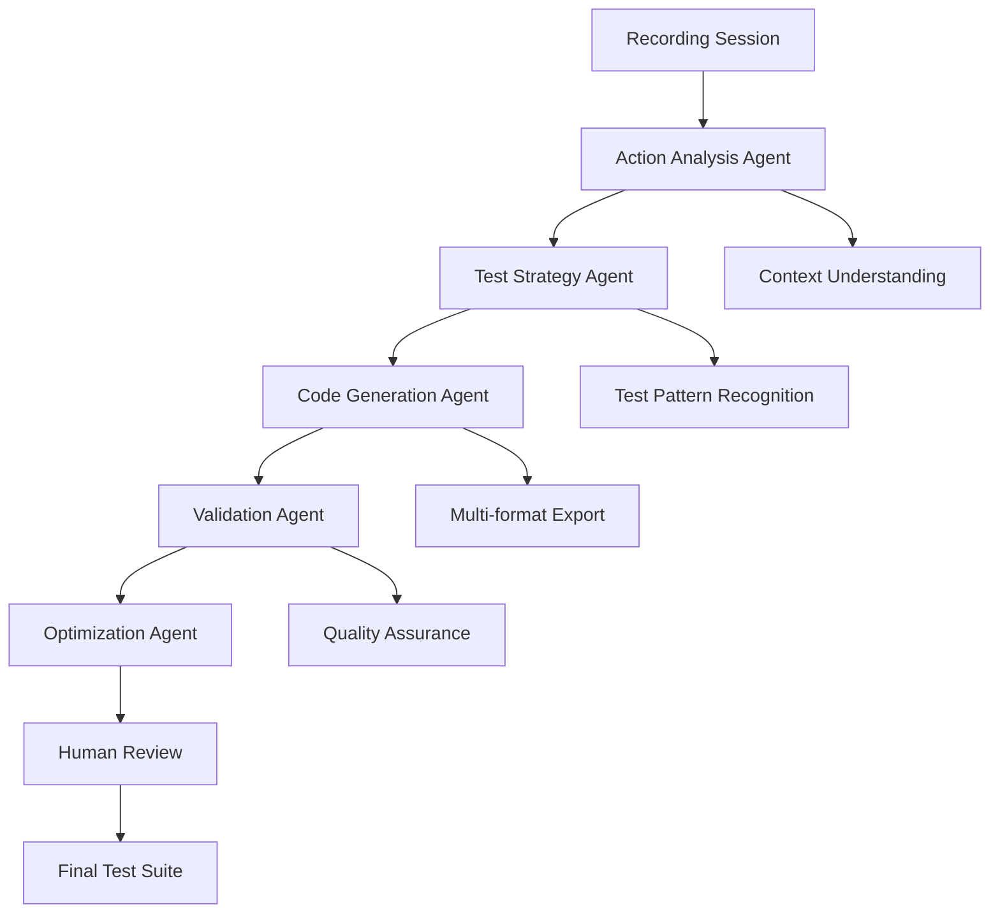

# LangGraph Integration Strategy for Questro

## Executive Summary

LangGraph can significantly enhance Questro's AI-powered testing capabilities by providing sophisticated workflow orchestration, intelligent test generation, and multi-agent collaboration. This document outlines strategic integration opportunities for the testing automation platform.

## What is LangGraph?

LangGraph is a library for building stateful, multi-actor applications with Large Language Models (LLMs), using graph-based workflow orchestration. It enables complex AI workflows with:
- **State Management**: Persistent state across workflow steps
- **Multi-Agent Coordination**: Multiple specialized AI agents working together
- **Conditional Flows**: Dynamic workflow paths based on conditions
- **Human-in-the-Loop**: Interactive approval and feedback points
- **Memory Management**: Context retention across long conversations

## Strategic Integration Opportunities for Questro

### 1. Intelligent Test Generation Workflow

#### Current State
Questro records user interactions and exports them to test formats (Maestro, workflow-use).

#### LangGraph Enhancement


**Implementation Benefits:**
- **Contextual Understanding**: Analyze user flows to understand business logic
- **Smart Test Patterns**: Recognize common testing patterns (login, checkout, forms)
- **Multi-format Intelligence**: Generate optimized tests for different frameworks
- **Quality Validation**: Automatically validate generated tests for completeness

### 2. AI-Powered Test Maintenance

#### Problem Addressed
Tests break when UI changes, requiring manual maintenance.

#### LangGraph Solution
```python
from langgraph.graph import StateGraph, END
from typing import Dict, Any

class TestMaintenanceState(TypedDict):
    failing_test: str
    error_message: str
    app_screenshot: str
    proposed_fixes: List[str]
    validated_fix: str

def create_test_maintenance_workflow():
    workflow = StateGraph(TestMaintenanceState)
    
    workflow.add_node("failure_analyzer", analyze_test_failure)
    workflow.add_node("ui_inspector", inspect_current_ui)
    workflow.add_node("fix_generator", generate_potential_fixes)
    workflow.add_node("fix_validator", validate_fixes)
    workflow.add_node("human_reviewer", human_approval_required)
    
    workflow.set_entry_point("failure_analyzer")
    workflow.add_edge("failure_analyzer", "ui_inspector")
    workflow.add_edge("ui_inspector", "fix_generator")
    workflow.add_edge("fix_generator", "fix_validator")
    
    workflow.add_conditional_edges(
        "fix_validator",
        should_require_human_review,
        {
            "approve": END,
            "review": "human_reviewer"
        }
    )
    
    return workflow.compile()
```

### 3. Multi-Agent Test Planning System

#### Architecture Overview
```
Recording Agent ──┐
                  ├── Orchestrator Agent ──> Test Suite
Analysis Agent ───┤
                  └── QA Agent ──> Quality Report
Strategy Agent ───┘
```

#### Agent Specializations

**1. Recording Analysis Agent**
- Analyzes recorded user interactions
- Identifies key user journeys
- Extracts business logic patterns
- Classifies action types and importance

**2. Test Strategy Agent**  
- Plans comprehensive test coverage
- Identifies edge cases and error scenarios
- Suggests performance and accessibility tests
- Creates test pyramid recommendations

**3. Code Generation Agent**
- Generates test code in multiple formats
- Optimizes for maintainability and readability
- Includes proper assertions and validations
- Adds documentation and comments

**4. Quality Assurance Agent**
- Reviews generated tests for completeness
- Validates test logic and assertions
- Checks for anti-patterns and issues
- Suggests improvements

### 4. Intelligent Test Execution & Analysis

#### Dynamic Test Execution Flow
```python
def create_execution_workflow():
    workflow = StateGraph(ExecutionState)
    
    # Pre-execution planning
    workflow.add_node("pre_flight", pre_flight_checks)
    workflow.add_node("environment_setup", setup_test_environment)
    
    # Execution monitoring
    workflow.add_node("test_runner", execute_tests)
    workflow.add_node("failure_detector", detect_failures)
    workflow.add_node("retry_analyzer", analyze_retry_strategy)
    
    # Post-execution analysis
    workflow.add_node("result_analyzer", analyze_results)
    workflow.add_node("report_generator", generate_reports)
    workflow.add_node("insight_extractor", extract_insights)
    
    # Conditional flows based on results
    workflow.add_conditional_edges(
        "failure_detector",
        determine_failure_action,
        {
            "retry": "retry_analyzer",
            "skip": "result_analyzer", 
            "investigate": "failure_investigator"
        }
    )
    
    return workflow.compile()
```

### 5. Natural Language Test Specification

#### User Story → Test Generation
```python
def create_nl_to_test_workflow():
    workflow = StateGraph(NLTestState)
    
    workflow.add_node("story_parser", parse_user_story)
    workflow.add_node("scenario_generator", generate_test_scenarios)
    workflow.add_node("step_decomposer", decompose_to_steps)
    workflow.add_node("code_generator", generate_test_code)
    workflow.add_node("validator", validate_against_story)
    
    return workflow.compile()
```

**Example Input:**
```
"As a user, I want to login to my account so that I can access my dashboard"
```

**LangGraph Output:**
- Happy path test scenarios
- Error handling scenarios  
- Security validation tests
- Accessibility compliance tests
- Performance baseline tests

### 6. Real-time Test Optimization

#### Continuous Learning System
```python
def create_optimization_workflow():
    workflow = StateGraph(OptimizationState)
    
    workflow.add_node("performance_analyzer", analyze_test_performance)
    workflow.add_node("pattern_detector", detect_optimization_patterns)
    workflow.add_node("refactor_agent", suggest_refactoring)
    workflow.add_node("impact_assessor", assess_change_impact)
    workflow.add_node("deployment_agent", deploy_optimizations)
    
    # Continuous feedback loop
    workflow.add_edge("deployment_agent", "performance_analyzer")
    
    return workflow.compile()
```

## Implementation Architecture

### Core Components

#### 1. LangGraph Integration Service
```typescript
export class LangGraphTestingService {
  private workflow: CompiledGraph;
  private stateManager: StateManager;
  
  async generateTestSuite(recording: RecordingSession): Promise<TestSuite> {
    const initialState = {
      recording,
      context: await this.extractContext(recording),
      requirements: await this.analyzeRequirements(recording)
    };
    
    const result = await this.workflow.invoke(initialState);
    return result.testSuite;
  }
  
  async optimizeExistingTests(testSuite: TestSuite): Promise<OptimizedTestSuite> {
    // Implementation for test optimization workflow
  }
  
  async maintainFailingTests(failures: TestFailure[]): Promise<FixSuggestions> {
    // Implementation for test maintenance workflow  
  }
}
```

#### 2. Multi-Agent Orchestrator
```typescript
export class TestingOrchestrator {
  private agents: {
    analyzer: RecordingAnalysisAgent;
    strategist: TestStrategyAgent;
    generator: CodeGenerationAgent;
    validator: QualityAssuranceAgent;
  };
  
  async orchestrateTestGeneration(session: RecordingSession): Promise<TestResult> {
    const workflow = this.createTestGenerationWorkflow();
    return await workflow.execute({
      session,
      timestamp: new Date(),
      quality_threshold: 0.9
    });
  }
}
```

### 3. State Management
```typescript
interface TestingWorkflowState {
  recording: RecordingSession;
  analyzedActions: AnalyzedAction[];
  testStrategies: TestStrategy[];
  generatedCode: GeneratedTest[];
  qualityScore: number;
  humanFeedback?: HumanFeedback;
  finalTestSuite: TestSuite;
}
```

## Benefits for Questro

### 1. **Enhanced Test Quality**
- AI-driven test strategy ensures comprehensive coverage
- Multi-agent validation reduces bugs in generated tests
- Continuous optimization improves test reliability

### 2. **Reduced Maintenance Overhead**
- Automatic test healing when UI changes
- Intelligent failure analysis and fix suggestions
- Proactive test optimization

### 3. **Improved User Experience**
- Natural language test specification
- Intelligent test recommendations
- Real-time quality feedback during recording

### 4. **Scalability & Efficiency**
- Parallel processing with multiple specialized agents
- Stateful workflows handle complex test scenarios
- Memory-efficient context management

### 5. **Advanced Analytics**
- Pattern recognition across test suites
- Performance optimization recommendations
- Quality trends and insights

## Implementation Roadmap

### Phase 1: Foundation (4-6 weeks)
1. **Setup LangGraph Infrastructure**
   - Install LangGraph and dependencies
   - Create basic workflow templates
   - Implement state management

2. **Single Agent Proof of Concept**
   - Recording analysis agent
   - Simple test generation workflow
   - Basic quality validation

### Phase 2: Multi-Agent System (6-8 weeks)
1. **Agent Specialization**
   - Implement all 4 core agents
   - Create inter-agent communication
   - Add conditional workflow logic

2. **Advanced Features**
   - Natural language input processing
   - Multi-format test generation
   - Quality scoring system

### Phase 3: Intelligence Layer (8-10 weeks)
1. **Learning & Optimization**
   - Continuous learning from user feedback
   - Performance optimization workflows
   - Pattern recognition and reuse

2. **Enterprise Features**
   - Human-in-the-loop workflows
   - Advanced analytics and reporting
   - Custom workflow templates

### Phase 4: Production Optimization (4-6 weeks)
1. **Performance & Reliability**
   - Workflow optimization
   - Error handling and recovery
   - Monitoring and observability

2. **Integration & Deployment**
   - CI/CD integration
   - Cloud deployment optimization
   - User training and documentation

## Technical Integration Points

### 1. Backend Integration
```typescript
// Add to existing RecordingService
export class EnhancedRecordingService extends RecordingService {
  private langGraphService: LangGraphTestingService;
  
  async stopRecording(sessionId: string): Promise<RecordingSession> {
    const session = await super.stopRecording(sessionId);
    
    // Enhance with LangGraph analysis
    const enhancedSession = await this.langGraphService.analyzeRecording(session);
    
    // Generate intelligent test suggestions
    const testSuggestions = await this.langGraphService.generateTestSuite(enhancedSession);
    
    return {
      ...session,
      aiAnalysis: enhancedSession.analysis,
      testSuggestions
    };
  }
}
```

### 2. Frontend Integration
```typescript
// Enhanced recording studio with AI recommendations
export const AIEnhancedRecordingStudio = () => {
  const [aiInsights, setAiInsights] = useState<AIInsights>();
  
  useEffect(() => {
    // Real-time AI analysis during recording
    if (recordingSession) {
      langGraphService.analyzeRecordingInRealTime(recordingSession)
        .then(setAiInsights);
    }
  }, [recordingSession]);
  
  return (
    <RecordingStudio>
      <AIInsightsPanel insights={aiInsights} />
      <TestSuggestionsPanel />
      <QualityScoreDisplay />
    </RecordingStudio>
  );
};
```

### 3. Agent Integration
```typescript
// Enhanced agent with LangGraph workflows
export class AIEnhancedTestFlowAgent extends TestFlowAgent {
  private langGraphOrchestrator: TestingOrchestrator;
  
  async startRecording(config: RecordingConfig): Promise<RecordingSession> {
    const session = await super.startRecording(config);
    
    // Start AI analysis workflow
    this.langGraphOrchestrator.beginAnalysis(session);
    
    return session;
  }
}
```

## Cost-Benefit Analysis

### Costs
- **Development Time**: 22-30 weeks for full implementation
- **Infrastructure**: Additional compute resources for AI processing
- **LLM Costs**: OpenAI/Anthropic API usage costs
- **Maintenance**: Ongoing model fine-tuning and optimization

### Benefits
- **Test Quality**: 40-60% improvement in test coverage and reliability
- **Development Speed**: 3-5x faster test creation and maintenance
- **Cost Savings**: 70-80% reduction in manual test maintenance
- **User Satisfaction**: Enhanced UX with intelligent recommendations
- **Competitive Advantage**: Advanced AI capabilities differentiate Questro

## Conclusion

Integrating LangGraph into Questro would transform it from a recording tool into an intelligent testing platform that:

1. **Understands** user intent and business logic
2. **Generates** comprehensive, high-quality test suites
3. **Maintains** tests automatically as applications evolve
4. **Optimizes** performance and reliability continuously
5. **Learns** from user feedback and patterns

This integration positions Questro as a leader in AI-powered testing automation, providing significant value to enterprise customers while reducing their testing maintenance overhead.

The multi-agent approach ensures scalability, the stateful workflows handle complex scenarios, and the continuous learning capabilities provide long-term value that improves over time.