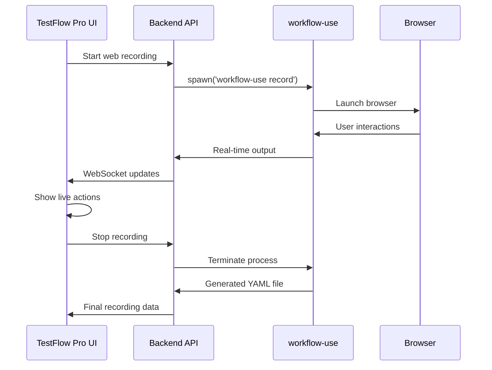

# 🌐 TestFlow Pro - workflow-use Integration Guide

This document explains how TestFlow Pro integrates with workflow-use for web testing automation.

## 🔄 How workflow-use Integration Works

### **Architecture Overview**
```
TestFlow Pro Frontend (React)
        ↓ Start Web Recording
TestFlow Pro Backend (Node.js)
        ↓ Spawns Process
workflow-use CLI Tool
        ↓ Controls Browser
Chrome/Firefox/Safari Browser
        ↓ Records Actions
Generated YAML Test File
```

## 🛠️ Integration Implementation

### **1. Recording Service Integration**

The `RecordingService.ts` integrates workflow-use through:

```typescript
// Start web recording using workflow-use
private async startWebRecording(session: RecordingSession): Promise<void> {
  const workflowArgs = [
    'record',
    '--output', path.join(sessionDir, 'workflow.yaml'),
    '--browser', session.platform  // chrome, firefox, safari
  ];

  if (session.metadata.url) {
    workflowArgs.push('--url', session.metadata.url);
  }

  if (session.metadata.viewport) {
    workflowArgs.push('--viewport', `${width}x${height}`);
  }

  const workflowProcess = spawn('workflow-use', workflowArgs);
}
```

### **2. Real-time Action Parsing**

TestFlow Pro captures workflow-use output in real-time:

```typescript
// Parse workflow-use console output
private parseWorkflowOutput(session: RecordingSession, output: string): void {
  const lines = output.split('\n').filter(line => line.trim());
  
  for (const line of lines) {
    if (line.includes('STEP:')) {
      const actionData = this.extractActionFromWorkflowLine(line);
      // Convert to TestFlow Pro action format
      const action: RecordedAction = {
        id: uuidv4(),
        timestamp: Date.now(),
        ...actionData
      };
      
      // Send real-time update to frontend
      this.emit('recording:action', { session, action });
    }
  }
}
```

### **3. Action Type Mapping**

TestFlow Pro maps workflow-use actions to universal format:

| workflow-use Action | TestFlow Pro Action | Description |
|-------------------|-------------------|-------------|
| `click on button` | `tap` | Click interactions |
| `type "text" into input` | `type` | Text input |
| `navigate to url` | `navigate` | Page navigation |
| `scroll down` | `scroll` | Scrolling actions |
| `assert visible` | `assert` | Element assertions |
| `wait 2000ms` | `wait` | Timing delays |
| `screenshot` | `screenshot` | Visual captures |

## 🎬 Recording Workflow

### **Frontend Recording Studio**

When user starts web recording:

```typescript
// RecordingStudio.tsx
const startRecording = async () => {
  const newSession = {
    type: 'web',
    platform: 'chrome', // or firefox, safari
    metadata: {
      url: 'https://example.com',
      viewport: { width: 1920, height: 1080 },
      userAgent: 'Chrome Desktop'
    }
  };

  // Call backend API
  const response = await fetch('/api/recording/start', {
    method: 'POST',
    body: JSON.stringify(newSession)
  });
};
```

### **Backend Process Management**

```typescript
// Backend spawns workflow-use process
const workflowProcess = spawn('workflow-use', [
  'record',
  '--output', 'workflow.yaml',
  '--browser', 'chrome',
  '--url', 'https://example.com',
  '--viewport', '1920x1080'
]);

// Real-time output parsing
workflowProcess.stdout.on('data', (data) => {
  this.parseWorkflowOutput(session, data.toString());
});
```

## 📤 Export Formats

### **Generated workflow-use YAML**

```yaml
# TestFlow Pro - Generated workflow-use Test
# Recorded: 2024-01-15T10:30:00Z
name: "Web Test Recording"
url: "https://example.com"
viewport:
  width: 1920
  height: 1080
steps:
  - click:
      selector: "button[data-testid='submit']"
  - type:
      text: "test@example.com"
      selector: "input[type='email']"
  - navigate: "https://example.com/dashboard"
  - assert:
      selector: ".welcome-message"
      visible: true
  - screenshot: "final-state"
```

### **TestFlow Pro JSON Export**

```json
{
  "session": {
    "id": "session-123",
    "type": "web",
    "platform": "chrome",
    "actions": [
      {
        "id": "action-1",
        "type": "tap",
        "selector": "button[data-testid='submit']",
        "timestamp": 1642248600000
      },
      {
        "id": "action-2",
        "type": "type",
        "text": "test@example.com",
        "selector": "input[type='email']",
        "timestamp": 1642248605000
      }
    ]
  }
}
```

## 🔧 Configuration & Setup

### **workflow-use Installation**

```bash
# Install workflow-use globally
npm install -g workflow-use

# Or install locally in project
npm install workflow-use --save-dev

# Verify installation
workflow-use --version
```

### **Environment Configuration**

```env
# Backend .env
WORKFLOW_USE_PATH=/usr/local/bin/workflow-use
ENABLE_WEB_TESTING=true

# Frontend .env
VITE_ENABLE_WEB_TESTING=true
```

### **Supported Browsers**

| Browser | Platform Support | Notes |
|---------|------------------|-------|
| Chrome | ✅ Windows, macOS, Linux | Best compatibility |
| Firefox | ✅ Windows, macOS, Linux | Good performance |
| Safari | ✅ macOS only | Requires additional setup |
| Edge | ✅ Windows | Chromium-based |

## 🎯 Features Enabled by Integration

### **1. Browser Automation**
- Cross-browser recording (Chrome, Firefox, Safari)
- Viewport configuration
- User agent customization
- Device emulation

### **2. Action Capture**
- **Clicks**: Buttons, links, any clickable elements
- **Text Input**: Forms, search boxes, text areas
- **Navigation**: Page loads, URL changes
- **Scrolling**: Vertical/horizontal scroll actions
- **Assertions**: Element visibility, text content
- **Screenshots**: Visual validation points

### **3. Real-time Feedback**
- Live action preview in TestFlow Pro UI
- Instant action count updates
- Real-time duration tracking
- Error handling and retry logic

### **4. Export Options**
- **workflow-use YAML**: Native format for playback
- **TestFlow Pro JSON**: Universal format
- **Maestro YAML**: Convert web tests to mobile format
- **Custom Formats**: Extensible export system

## 🔄 Integration Flow



## 🛡️ Error Handling

### **Common Issues & Solutions**

1. **workflow-use not found**
   ```bash
   # Install workflow-use
   npm install -g workflow-use
   
   # Or set custom path
   export WORKFLOW_USE_PATH=/custom/path/workflow-use
   ```

2. **Browser launch fails**
   ```javascript
   // Fallback browser detection
   const browsers = ['chrome', 'firefox', 'safari'];
   for (const browser of browsers) {
     try {
       await launchWorkflowUse(browser);
       break;
     } catch (error) {
       console.log(`${browser} failed, trying next...`);
     }
   }
   ```

3. **Permission errors**
   ```bash
   # Linux/macOS: Fix permissions
   chmod +x $(which workflow-use)
   
   # Windows: Run as administrator
   ```

## 🚀 Advanced Features

### **Custom Selectors**
```yaml
# Support for advanced CSS selectors
steps:
  - click:
      selector: "div[data-testid='complex-component'] > button:nth-child(2)"
  - type:
      text: "advanced input"
      selector: "input[placeholder*='Search']"
```

### **Conditional Logic**
```yaml
# Wait for dynamic content
steps:
  - wait_for:
      selector: ".loading-spinner"
      visible: false
      timeout: 10000
  - assert:
      selector: ".content-loaded"
      visible: true
```

### **Data-Driven Testing**
```yaml
# Variable substitution
variables:
  email: "test@example.com"
  password: "secure123"
  
steps:
  - type:
      text: "${email}"
      selector: "#email"
  - type:
      text: "${password}"
      selector: "#password"
```

## 📊 Performance & Scaling

### **Recording Performance**
- **Startup Time**: ~2-3 seconds
- **Action Latency**: <100ms real-time updates
- **Memory Usage**: ~50MB per session
- **Concurrent Sessions**: Up to 10 per server

### **Browser Resource Usage**
- **Chrome**: ~100MB base + content
- **Firefox**: ~80MB base + content
- **Safari**: ~60MB base + content

## 🔗 Integration Benefits

1. **Unified Testing**: Both mobile (Maestro) and web (workflow-use) in one platform
2. **Real-time Feedback**: See actions as they're recorded
3. **Cross-format Export**: Convert between different test formats
4. **Browser Compatibility**: Support for all major browsers
5. **Cloud Recording**: Record from anywhere, store in cloud
6. **Team Collaboration**: Share and organize web tests
7. **CI/CD Ready**: Export tests for automated pipelines

This integration makes TestFlow Pro a comprehensive testing platform that handles both mobile and web automation seamlessly! 🌐🚀