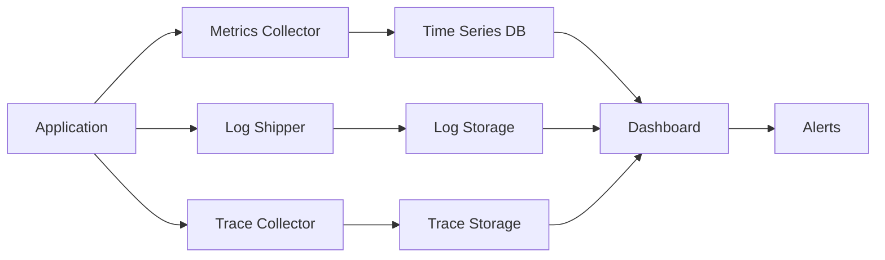

# Monitoring Documentation

Comprehensive monitoring, observability, and performance tracking documentation for the Questro platform.

## Monitoring Overview

Questro implements comprehensive monitoring and observability to ensure system reliability, performance optimization, and proactive issue detection.

## Documentation Index

### 📊 [Monitoring Setup Guide](./monitoring-setup-guide.md)
Complete guide for setting up monitoring infrastructure, metrics collection, and alerting systems.

## Monitoring Architecture

### Observability Stack
```
Monitoring Stack
├── Metrics Collection    # Prometheus, StatsD
├── Log Aggregation      # ELK Stack, Fluentd
├── Distributed Tracing  # Jaeger, Zipkin
├── APM                  # Datadog, New Relic
├── Alerting            # PagerDuty, Slack
└── Dashboards          # Grafana, Datadog
```

### Data Flow


## Monitoring Categories

### 1. Application Performance Monitoring (APM)
- **Response Times**: API and page response times
- **Throughput**: Requests per second and transaction volume
- **Error Rates**: Application error rates and types
- **Resource Usage**: CPU, memory, and disk utilization

### 2. Infrastructure Monitoring
- **Server Metrics**: CPU, memory, disk, network usage
- **Database Performance**: Query performance and connection pools
- **Cache Performance**: Redis hit rates and response times
- **Network Monitoring**: Bandwidth usage and latency

### 3. Business Metrics
- **User Activity**: Active users and session duration
- **Feature Usage**: Feature adoption and usage patterns
- **Conversion Metrics**: Sign-ups, subscriptions, and retention
- **Revenue Metrics**: MRR, churn rate, and LTV

### 4. Security Monitoring
- **Authentication Events**: Login attempts and failures
- **Authorization Violations**: Unauthorized access attempts
- **Security Incidents**: Detected security threats
- **Compliance Metrics**: Audit trail and compliance status

## Key Metrics

### Application Metrics
```typescript
interface ApplicationMetrics {
  // Performance Metrics
  responseTime: {
    p50: number;
    p95: number;
    p99: number;
  };
  throughput: {
    requestsPerSecond: number;
    transactionsPerMinute: number;
  };
  errorRate: {
    total: number;
    byType: Record<string, number>;
  };
  
  // Business Metrics
  activeUsers: {
    current: number;
    daily: number;
    monthly: number;
  };
  featureUsage: Record<string, number>;
  conversionRate: number;
}
```

### Infrastructure Metrics
```typescript
interface InfrastructureMetrics {
  // Server Metrics
  cpu: {
    usage: number;
    load: number[];
  };
  memory: {
    used: number;
    available: number;
    usage: number;
  };
  disk: {
    used: number;
    available: number;
    iops: number;
  };
  network: {
    bytesIn: number;
    bytesOut: number;
    packetsIn: number;
    packetsOut: number;
  };
  
  // Database Metrics
  database: {
    connections: number;
    queryTime: number;
    slowQueries: number;
  };
}
```

## Monitoring Tools

### Metrics Collection
- **Prometheus**: Time-series metrics collection
- **StatsD**: Application metrics aggregation
- **Custom Metrics**: Application-specific metrics
- **System Metrics**: OS and hardware metrics

### Log Management
- **ELK Stack**: Elasticsearch, Logstash, Kibana
- **Fluentd**: Log collection and forwarding
- **Structured Logging**: JSON-formatted logs
- **Log Retention**: Automated log rotation and archival

### Application Performance
- **Datadog**: Full-stack monitoring and APM
- **New Relic**: Application performance monitoring
- **Sentry**: Error tracking and performance monitoring
- **Custom APM**: Application-specific monitoring

### Alerting Systems
- **PagerDuty**: Incident management and alerting
- **Slack**: Team notifications and alerts
- **Email**: Critical alert notifications
- **SMS**: Emergency alert notifications

## Dashboard Configuration

### Executive Dashboard
```typescript
interface ExecutiveDashboard {
  // High-level KPIs
  systemHealth: 'healthy' | 'warning' | 'critical';
  uptime: number;
  activeUsers: number;
  revenue: number;
  
  // Trend Indicators
  userGrowth: number;
  revenueGrowth: number;
  errorRate: number;
  performanceScore: number;
}
```

### Operations Dashboard
```typescript
interface OperationsDashboard {
  // System Status
  services: ServiceStatus[];
  infrastructure: InfrastructureStatus;
  deployments: DeploymentStatus[];
  
  // Performance Metrics
  responseTime: TimeSeriesData;
  throughput: TimeSeriesData;
  errorRate: TimeSeriesData;
  
  // Alerts
  activeAlerts: Alert[];
  recentIncidents: Incident[];
}
```

### Development Dashboard
```typescript
interface DevelopmentDashboard {
  // Code Quality
  testCoverage: number;
  codeQuality: number;
  vulnerabilities: number;
  
  // Development Metrics
  deploymentFrequency: number;
  leadTime: number;
  mttr: number;
  changeFailureRate: number;
}
```

## Alerting Strategy

### Alert Severity Levels
```typescript
enum AlertSeverity {
  CRITICAL = 'critical',    // Immediate action required
  WARNING = 'warning',      // Action required soon
  INFO = 'info',           // Informational only
  DEBUG = 'debug'          // Debug information
}
```

### Alert Rules
```typescript
interface AlertRule {
  name: string;
  condition: string;
  severity: AlertSeverity;
  threshold: number;
  duration: string;
  channels: string[];
  escalation: EscalationPolicy;
}

// Example Alert Rules
const alertRules: AlertRule[] = [
  {
    name: 'High Error Rate',
    condition: 'error_rate > 5%',
    severity: AlertSeverity.CRITICAL,
    threshold: 0.05,
    duration: '5m',
    channels: ['pagerduty', 'slack'],
    escalation: {
      levels: [
        { delay: '0m', channels: ['slack'] },
        { delay: '15m', channels: ['pagerduty'] },
        { delay: '30m', channels: ['phone'] }
      ]
    }
  },
  {
    name: 'High Response Time',
    condition: 'response_time_p95 > 2s',
    severity: AlertSeverity.WARNING,
    threshold: 2000,
    duration: '10m',
    channels: ['slack'],
    escalation: {
      levels: [
        { delay: '0m', channels: ['slack'] },
        { delay: '30m', channels: ['email'] }
      ]
    }
  }
];
```

## Performance Monitoring

### Response Time Monitoring
```typescript
class ResponseTimeMonitor {
  private histogram: Histogram;
  
  constructor() {
    this.histogram = new Histogram({
      name: 'http_request_duration_seconds',
      help: 'Duration of HTTP requests in seconds',
      labelNames: ['method', 'route', 'status_code'],
      buckets: [0.1, 0.3, 0.5, 0.7, 1, 3, 5, 7, 10]
    });
  }
  
  recordResponseTime(method: string, route: string, statusCode: number, duration: number): void {
    this.histogram
      .labels(method, route, statusCode.toString())
      .observe(duration / 1000);
  }
}
```

### Error Rate Monitoring
```typescript
class ErrorRateMonitor {
  private counter: Counter;
  
  constructor() {
    this.counter = new Counter({
      name: 'http_requests_total',
      help: 'Total number of HTTP requests',
      labelNames: ['method', 'route', 'status_code']
    });
  }
  
  recordRequest(method: string, route: string, statusCode: number): void {
    this.counter
      .labels(method, route, statusCode.toString())
      .inc();
  }
}
```

## Health Checks

### Application Health
```typescript
interface HealthCheck {
  name: string;
  status: 'healthy' | 'unhealthy' | 'degraded';
  responseTime: number;
  details?: Record<string, any>;
}

class HealthChecker {
  private checks: Map<string, () => Promise<HealthCheck>> = new Map();
  
  registerCheck(name: string, check: () => Promise<HealthCheck>): void {
    this.checks.set(name, check);
  }
  
  async runChecks(): Promise<HealthCheck[]> {
    const results: HealthCheck[] = [];
    
    for (const [name, check] of this.checks) {
      try {
        const result = await check();
        results.push(result);
      } catch (error) {
        results.push({
          name,
          status: 'unhealthy',
          responseTime: 0,
          details: { error: error.message }
        });
      }
    }
    
    return results;
  }
}
```

### Database Health Check
```typescript
const databaseHealthCheck = async (): Promise<HealthCheck> => {
  const startTime = Date.now();
  
  try {
    await db.query('SELECT 1');
    return {
      name: 'database',
      status: 'healthy',
      responseTime: Date.now() - startTime
    };
  } catch (error) {
    return {
      name: 'database',
      status: 'unhealthy',
      responseTime: Date.now() - startTime,
      details: { error: error.message }
    };
  }
};
```

## Log Management

### Structured Logging
```typescript
interface LogEntry {
  timestamp: string;
  level: 'debug' | 'info' | 'warn' | 'error';
  message: string;
  service: string;
  traceId?: string;
  userId?: string;
  metadata?: Record<string, any>;
}

class Logger {
  log(level: LogEntry['level'], message: string, metadata?: Record<string, any>): void {
    const entry: LogEntry = {
      timestamp: new Date().toISOString(),
      level,
      message,
      service: process.env.SERVICE_NAME || 'unknown',
      traceId: this.getCurrentTraceId(),
      userId: this.getCurrentUserId(),
      metadata
    };
    
    console.log(JSON.stringify(entry));
  }
}
```

### Log Aggregation
```yaml
# Fluentd Configuration
<source>
  @type tail
  path /var/log/questro/*.log
  pos_file /var/log/fluentd/questro.log.pos
  tag questro.*
  format json
</source>

<match questro.**>
  @type elasticsearch
  host elasticsearch.questro.com
  port 9200
  index_name questro-logs
  type_name _doc
</match>
```

## Incident Management

### Incident Response Process
1. **Detection**: Automated alert triggers
2. **Notification**: Alert sent to on-call engineer
3. **Assessment**: Evaluate incident severity and impact
4. **Response**: Execute incident response procedures
5. **Resolution**: Resolve the underlying issue
6. **Post-mortem**: Conduct post-incident review

### Incident Tracking
```typescript
interface Incident {
  id: string;
  title: string;
  severity: 'low' | 'medium' | 'high' | 'critical';
  status: 'open' | 'investigating' | 'resolved' | 'closed';
  assignee: string;
  createdAt: Date;
  resolvedAt?: Date;
  description: string;
  timeline: IncidentEvent[];
}
```

## Performance Optimization

### Monitoring-Driven Optimization
- **Bottleneck Identification**: Use metrics to identify performance bottlenecks
- **Capacity Planning**: Monitor resource usage for capacity planning
- **Performance Regression**: Detect performance regressions through monitoring
- **Optimization Validation**: Validate optimization effectiveness through metrics

### Continuous Improvement
- **SLI/SLO Monitoring**: Track Service Level Indicators and Objectives
- **Performance Budgets**: Set and monitor performance budgets
- **Alerting Tuning**: Continuously tune alerting thresholds
- **Dashboard Optimization**: Optimize dashboards for actionable insights

---

For detailed monitoring setup instructions, refer to the [Monitoring Setup Guide](./monitoring-setup-guide.md).