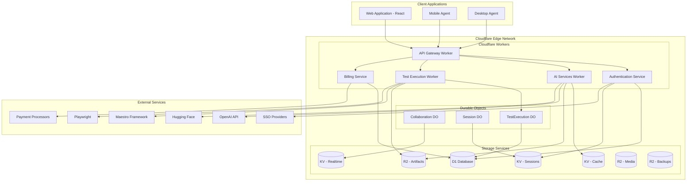
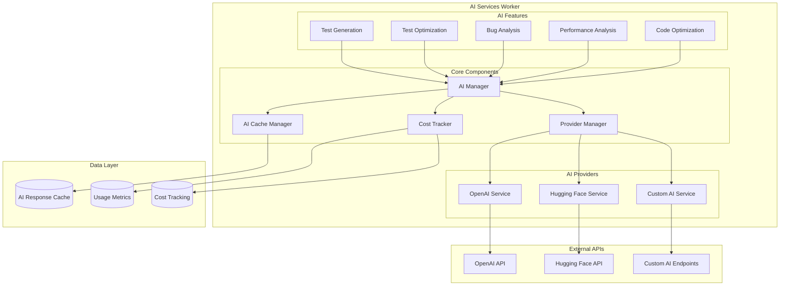
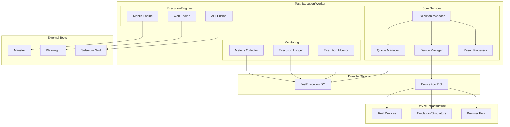
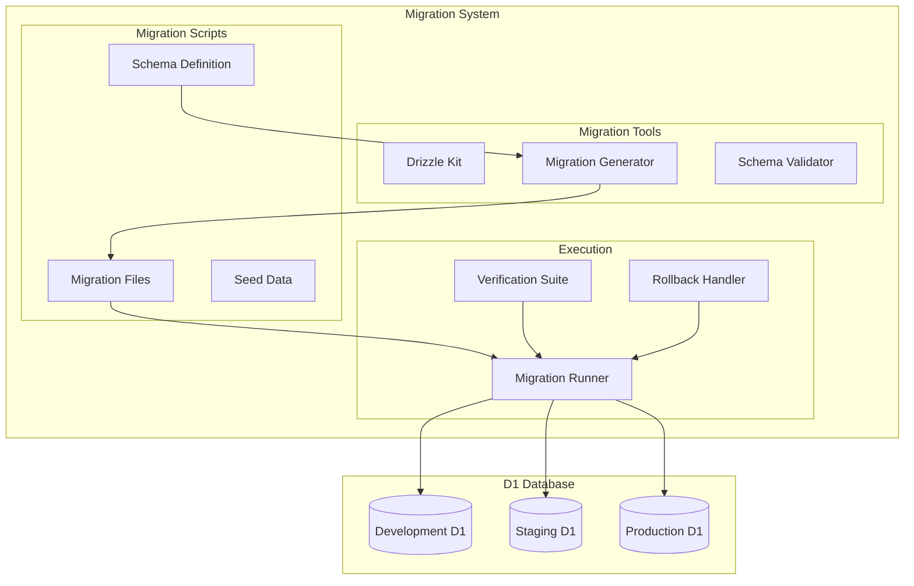
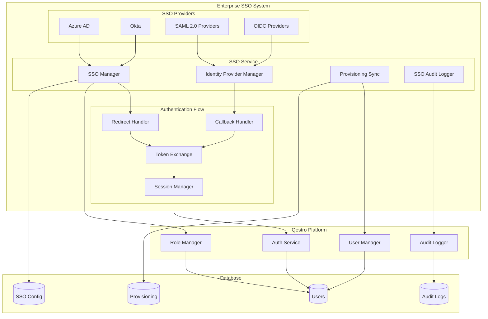
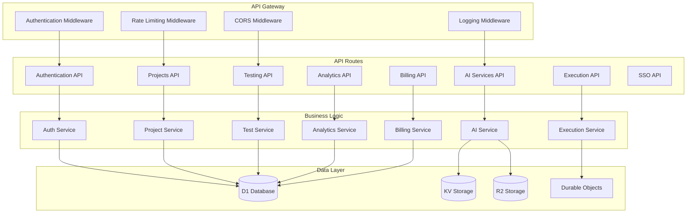
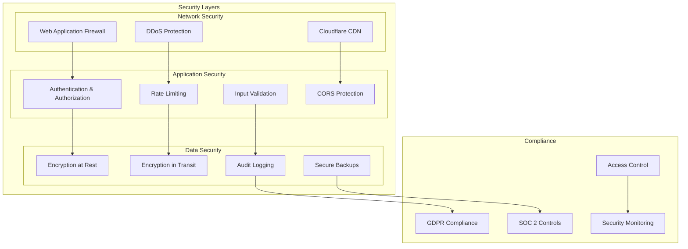
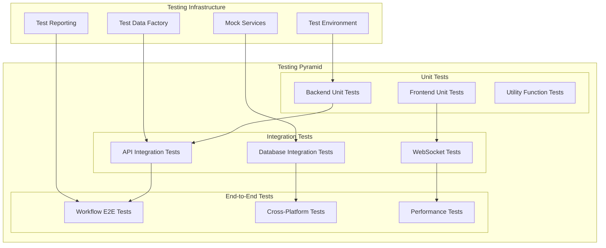
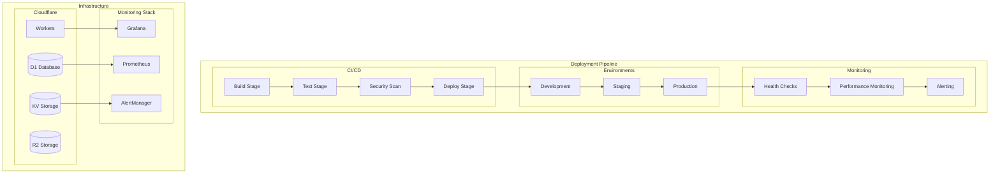

# Qestro SaaS Platform - Technical Design Document

**Scope**: Entire Qestro Platform  
**Generated**: October 29, 2025  
**Agent**: Luna Design Architect Agent  
**Based on**: requirements.md  

---

## Executive Summary

Qestro is an enterprise-grade AI-powered SaaS testing automation platform built on Cloudflare Workers with a sophisticated hybrid cloud-agent architecture. This technical design document provides comprehensive specifications for completing the critical path items to achieve production readiness.

### Current Implementation Status
- **Overall Completion**: 95% complete
- **Architecture**: Enterprise-grade Cloudflare Workers implementation
- **Database**: Comprehensive 35+ table schema (821 lines) designed for D1
- **Frontend**: React 18 + TypeScript with 90% completion
- **Critical Gaps**: AI Services, Test Execution Engine, Database Migration, SSO Integration

### Design Goals
1. **Complete Critical Path**: Implement missing core functionality for production launch
2. **Maintain Architecture Quality**: Preserve existing enterprise-grade patterns
3. **Enable Rapid Development**: Provide detailed, actionable implementation guidance
4. **Ensure Scalability**: Design for 10,000+ concurrent users
5. **Enterprise Security**: Maintain comprehensive security and compliance

---

## Architecture Overview

### High-Level System Architecture



### Current Architecture Strengths

**Cloudflare Workers Implementation**:
- ✅ Edge computing with global distribution
- ✅ Auto-scaling with zero maintenance
- ✅ Integrated D1, KV, R2, and Durable Objects
- ✅ Comprehensive middleware and security
- ✅ Production-ready configuration

**Database Architecture**:
- ✅ 35+ tables covering all business domains
- ✅ Optimized for D1 SQLite with proper indexing
- ✅ Multi-tenant design with row-level security
- ✅ Comprehensive audit logging and analytics
- ✅ Type-safe with Drizzle ORM

**Frontend Architecture**:
- ✅ React 18 + TypeScript with strict mode
- ✅ Zustand state management with persistence
- ✅ Real-time WebSocket integration
- ✅ Comprehensive component structure
- ✅ Protected routing with authentication

---

## Critical Component Design Specifications

### 1. AI Services Implementation

#### Current Status
- API routes stubbed but not implemented
- Multi-provider architecture designed
- Database schema supports AI features
- Cost tracking framework in place

#### Complete AI Services Architecture



#### AI Services Implementation Details

**1. AI Manager Service**

```typescript
interface AIManagerConfig {
  providers: {
    openai?: {
      apiKey: string;
      models: {
        generation: string;
        optimization: string;
        analysis: string;
      };
    };
    huggingface?: {
      apiKey: string;
      endpoints: Map<string, string>;
    };
    custom?: Array<{
      name: string;
      endpoint: string;
      authentication: Record<string, string>;
    }>;
  };
  costTracking: {
    enabled: boolean;
    perUserLimits: Record<string, number>;
    alertThresholds: {
      warning: number;
      critical: number;
    };
  };
  caching: {
    enabled: boolean;
    ttl: number; // seconds
    maxSize: number; // MB
  };
}

class AIManager {
  private providers: Map<string, AIProvider>;
  private costTracker: CostTracker;
  private cacheManager: AICacheManager;
  
  constructor(config: AIManagerConfig) {
    this.initializeProviders(config.providers);
    this.costTracker = new CostTracker(config.costTracking);
    this.cacheManager = new AICacheManager(config.caching);
  }
  
  async generateTest(
    description: string,
    context: TestGenerationContext,
    userId: string
  ): Promise<GeneratedTest> {
    // Check cache first
    const cacheKey = this.generateCacheKey('test-gen', description, context);
    const cached = await this.cacheManager.get(cacheKey);
    if (cached) return cached;
    
    // Check user limits
    await this.costTracker.checkUserLimit(userId, 'test-generation');
    
    // Select optimal provider
    const provider = await this.selectProvider('test-generation', context.complexity);
    
    // Generate test
    const result = await provider.generateTest(description, context);
    
    // Track usage
    await this.costTracker.trackUsage(userId, {
      type: 'test-generation',
      provider: provider.name,
      tokens: result.tokensUsed,
      cost: result.cost
    });
    
    // Cache result
    await this.cacheManager.set(cacheKey, result, 3600); // 1 hour
    
    return result;
  }
  
  async optimizeTest(
    testCase: TestCase,
    optimizationGoals: OptimizationGoals,
    userId: string
  ): Promise<TestOptimization> {
    // Similar implementation with caching and cost tracking
  }
  
  async analyzeFailure(
    failureData: TestFailure,
    userId: string
  ): Promise<FailureAnalysis> {
    // Implementation for bug analysis
  }
}
```

**2. Provider Abstraction Layer**

```typescript
abstract class AIProvider {
  abstract name: string;
  abstract capabilities: string[];
  
  abstract generateTest(
    description: string,
    context: TestGenerationContext
  ): Promise<GeneratedTest>;
  
  abstract optimizeTest(
    testCase: TestCase,
    goals: OptimizationGoals
  ): Promise<TestOptimization>;
  
  abstract analyzeFailure(
    failure: TestFailure
  ): Promise<FailureAnalysis>;
  
  abstract calculateCost(usage: TokenUsage): number;
}

class OpenAIProvider extends AIProvider {
  name = 'openai';
  capabilities = ['test-generation', 'optimization', 'analysis'];
  
  async generateTest(
    description: string,
    context: TestGenerationContext
  ): Promise<GeneratedTest> {
    const prompt = this.buildTestGenerationPrompt(description, context);
    
    const response = await fetch('https://api.openai.com/v1/chat/completions', {
      method: 'POST',
      headers: {
        'Authorization': `Bearer ${this.apiKey}`,
        'Content-Type': 'application/json'
      },
      body: JSON.stringify({
        model: 'gpt-4',
        messages: [{ role: 'user', content: prompt }],
        temperature: 0.3,
        max_tokens: 2000
      })
    });
    
    const result = await response.json();
    return this.parseTestResponse(result);
  }
  
  private buildTestGenerationPrompt(
    description: string,
    context: TestGenerationContext
  ): string {
    return `
As an expert QA automation engineer, generate a comprehensive test case based on:

Description: ${description}
Application Type: ${context.platform}
Framework: ${context.framework}
Key Features: ${context.features.join(', ')}

Generate a ${context.framework} test case that:
1. Covers the described functionality
2. Includes proper assertions
3. Handles edge cases
4. Follows best practices
5. Is maintainable and readable

Format the response as JSON with structure:
{
  "name": "Test case name",
  "description": "Test description",
  "steps": [...],
  "assertions": [...],
  "setup": [...],
  "teardown": [...],
  "tags": [...],
  "confidence": 0.95
}
    `;
  }
}
```

**3. Cost Tracking System**

```typescript
class CostTracker {
  private usageDB: D1Database;
  private costDB: D1Database;
  
  async trackUsage(userId: string, usage: AIUsage): Promise<void> {
    const cost = this.calculateCost(usage);
    
    // Record usage
    await this.usageDB.prepare(`
      INSERT INTO ai_usage_logs (user_id, type, provider, tokens, cost, timestamp)
      VALUES (?, ?, ?, ?, ?, ?)
    `).bind(
      userId,
      usage.type,
      usage.provider,
      usage.tokens,
      cost,
      Date.now()
    ).run();
    
    // Update user totals
    await this.updateUserTotals(userId, cost);
    
    // Check for alerts
    await this.checkUsageAlerts(userId, cost);
  }
  
  async checkUserLimit(userId: string, usageType: string): Promise<void> {
    const user = await this.getUserLimits(userId);
    const current = await this.getCurrentUsage(userId, usageType);
    
    if (current >= user.limits[usageType]) {
      throw new Error(`Usage limit exceeded for ${usageType}`);
    }
  }
  
  private calculateCost(usage: AIUsage): number {
    // Provider-specific pricing logic
    switch (usage.provider) {
      case 'openai':
        return this.calculateOpenAICost(usage.tokens, usage.model);
      case 'huggingface':
        return this.calculateHuggingFaceCost(usage.tokens, usage.model);
      default:
        return 0;
    }
  }
}
```

#### Database Schema Extensions for AI

```sql
-- AI usage logs
CREATE TABLE ai_usage_logs (
  id TEXT PRIMARY KEY,
  user_id TEXT NOT NULL,
  type TEXT NOT NULL, -- test-generation, optimization, analysis
  provider TEXT NOT NULL,
  model TEXT NOT NULL,
  tokens_used INTEGER NOT NULL,
  cost_cents INTEGER NOT NULL,
  request_data TEXT, -- JSON
  response_data TEXT, -- JSON
  cache_hit BOOLEAN DEFAULT FALSE,
  timestamp INTEGER NOT NULL,
  FOREIGN KEY (user_id) REFERENCES users(id)
);

-- AI models configuration
CREATE TABLE ai_models (
  id TEXT PRIMARY KEY,
  provider TEXT NOT NULL,
  name TEXT NOT NULL,
  type TEXT NOT NULL, -- generation, optimization, analysis
  cost_per_token REAL NOT NULL,
  max_tokens INTEGER NOT NULL,
  capabilities TEXT, -- JSON array
  is_active BOOLEAN DEFAULT TRUE,
  created_at INTEGER NOT NULL
);

-- AI cache
CREATE TABLE ai_cache (
  id TEXT PRIMARY KEY,
  cache_key TEXT UNIQUE NOT NULL,
  provider TEXT NOT NULL,
  model TEXT NOT NULL,
  request_hash TEXT NOT NULL,
  response_data TEXT NOT NULL, -- JSON
  tokens_used INTEGER NOT NULL,
  cost_cents INTEGER NOT NULL,
  expires_at INTEGER NOT NULL,
  created_at INTEGER NOT NULL
);
```

#### API Endpoints Specification

**POST /api/ai/generate-test**

```typescript
interface GenerateTestRequest {
  description: string;
  projectType: 'mobile' | 'web';
  framework: 'maestro' | 'playwright' | 'cypress';
  platform?: string; // ios, android, chrome, etc.
  features: string[];
  context?: {
    existingTests?: string[];
    appStructure?: Record<string, any>;
    constraints?: string[];
  };
}

interface GenerateTestResponse {
  success: boolean;
  data?: {
    testCase: {
      name: string;
      description: string;
      steps: TestStep[];
      assertions: Assertion[];
      setup: TestStep[];
      teardown: TestStep[];
      tags: string[];
      confidence: number;
    };
    usage: {
      tokensUsed: number;
      cost: number;
      provider: string;
    };
  };
  error?: string;
}
```

**POST /api/ai/optimize-test**

```typescript
interface OptimizeTestRequest {
  testCaseId: string;
  optimizationGoals: {
    performance: boolean;
    maintainability: boolean;
    coverage: boolean;
    flakiness: boolean;
  };
  constraints?: {
    maxSteps?: number;
    maxExecutionTime?: number;
    excludeAssertions?: string[];
  };
}

interface OptimizeTestResponse {
  success: boolean;
  data?: {
    optimizations: TestOptimization[];
    improvements: string[];
    riskAssessment: {
      level: 'low' | 'medium' | 'high';
      factors: string[];
    };
    usage: {
      tokensUsed: number;
      cost: number;
      provider: string;
    };
  };
  error?: string;
}
```

---

### 2. Test Execution Engine

#### Current Status
- Mobile testing API framework established
- Durable Object for test execution defined
- Device management structure in place
- Real device integration partially implemented

#### Complete Test Execution Architecture



#### Test Execution Implementation Details

**1. Execution Manager Service**

```typescript
interface TestExecutionContext {
  testRun: TestRun;
  testSuite: TestSuite;
  environment: TestEnvironment;
  devices: TestDevice[];
  configuration: ExecutionConfiguration;
}

class ExecutionManager {
  private deviceManager: DeviceManager;
  private queueManager: QueueManager;
  private resultProcessor: ResultProcessor;
  private durableObject: DurableObjectStub;
  
  async executeTestSuite(context: TestExecutionContext): Promise<TestExecutionResult> {
    // Create execution session in Durable Object
    const sessionId = await this.durableObject.createSession(context);
    
    try {
      // Allocate devices
      const allocatedDevices = await this.deviceManager.allocateDevices(
        context.environment.requirements
      );
      
      // Queue test cases for execution
      const executionPromises = context.testSuite.testCases.map(testCase =>
        this.queueManager.enqueue({
          testCase,
          devices: allocatedDevices,
          sessionId,
          environment: context.environment
        })
      );
      
      // Wait for all tests to complete
      const results = await Promise.allSettled(executionPromises);
      
      // Process results
      const executionResult = await this.resultProcessor.processResults(
        results,
        context
      );
      
      // Release devices
      await this.deviceManager.releaseDevices(allocatedDevices);
      
      return executionResult;
      
    } catch (error) {
      // Cleanup on failure
      await this.cleanupSession(sessionId);
      throw error;
    }
  }
  
  async executeSingleTest(
    testCase: TestCase,
    device: TestDevice,
    sessionId: string
  ): Promise<TestCaseResult> {
    const engine = this.getExecutionEngine(testCase.type);
    
    return await engine.execute({
      testCase,
      device,
      sessionId,
      configuration: this.getConfiguration(testCase.type)
    });
  }
  
  private getExecutionEngine(type: string): TestEngine {
    switch (type) {
      case 'mobile':
        return new MobileTestEngine();
      case 'web':
        return new WebTestEngine();
      case 'api':
        return new APITestEngine();
      default:
        throw new Error(`Unsupported test type: ${type}`);
    }
  }
}
```

**2. Mobile Test Engine**

```typescript
class MobileTestEngine implements TestEngine {
  private maestroRunner: MaestroRunner;
  private deviceController: DeviceController;
  
  async execute(request: TestExecutionRequest): Promise<TestCaseResult> {
    const { testCase, device, sessionId } = request;
    
    try {
      // Prepare device
      await this.deviceController.prepareDevice(device, testCase.platform);
      
      // Install app if needed
      if (testCase.appPath) {
        await this.deviceController.installApp(device, testCase.appPath);
      }
      
      // Execute Maestro test
      const maestroResult = await this.maestroRunner.run({
        flow: testCase.testData, // YAML/JSON test flow
        deviceId: device.id,
        sessionId,
        configuration: {
          timeout: testCase.timeout || 30000,
          screenshots: true,
          video: true,
          performanceMetrics: true
        }
      });
      
      // Process results
      return this.processMaestroResult(maestroResult, testCase);
      
    } catch (error) {
      return {
        testCaseId: testCase.id,
        status: 'error',
        error: error.message,
        duration: 0,
        artifacts: []
      };
    } finally {
      // Cleanup device
      await this.deviceController.cleanupDevice(device);
    }
  }
  
  private processMaestroResult(
    maestroResult: MaestroResult,
    testCase: TestCase
  ): TestCaseResult {
    return {
      testCaseId: testCase.id,
      status: maestroResult.success ? 'passed' : 'failed',
      duration: maestroResult.duration,
      steps: maestroResult.steps.map(step => ({
        action: step.action,
        result: step.result,
        duration: step.duration,
        screenshot: step.screenshot,
        timestamp: step.timestamp
      })),
      artifacts: [
        ...maestroResult.screenshots,
        ...maestroResult.videos,
        ...maestroResult.logs
      ],
      performanceMetrics: maestroResult.performanceMetrics,
      error: maestroResult.error
    };
  }
}
```

**3. Device Manager**

```typescript
interface TestDevice {
  id: string;
  name: string;
  type: 'real' | 'emulator' | 'simulator';
  platform: 'ios' | 'android';
  version: string;
  capabilities: string[];
  status: 'available' | 'busy' | 'offline' | 'maintenance';
  location: string; // cloud provider or physical location
  specs: {
    memory: string;
    storage: string;
    cpu: string;
    resolution: string;
  };
}

class DeviceManager {
  private devicePool: DurableObjectStub; // DevicePool DO
  
  async allocateDevices(requirements: DeviceRequirements): Promise<TestDevice[]> {
    const devices = await this.devicePool.allocate(requirements);
    
    // Reserve devices for this execution
    for (const device of devices) {
      await this.devicePool.reserve(device.id, this.executionId);
    }
    
    return devices;
  }
  
  async releaseDevices(devices: TestDevice[]): Promise<void> {
    for (const device of devices) {
      await this.devicePool.release(device.id, this.executionId);
    }
  }
  
  async prepareDevice(device: TestDevice, platform: string): Promise<void> {
    // Device-specific preparation
    switch (platform) {
      case 'ios':
        await this.prepareIOSDevice(device);
        break;
      case 'android':
        await this.prepareAndroidDevice(device);
        break;
    }
  }
  
  private async prepareIOSDevice(device: TestDevice): Promise<void> {
    // iOS device preparation logic
    // - Clear app data
    // - Set permissions
    // - Configure network settings
    // - Install certificates if needed
  }
  
  private async prepareAndroidDevice(device: TestDevice): Promise<void> {
    // Android device preparation logic
    // - Clear app data
    // - Grant permissions
    // - Configure ADB settings
    // - Install test dependencies
  }
}
```

**4. Test Execution Durable Object**

```typescript
export class TestExecutionDO {
  private sessions: Map<string, TestExecutionSession>;
  private activeDevices: Map<string, DeviceReservation>;
  
  constructor(private state: DurableObjectState, private env: any) {
    this.sessions = new Map();
    this.activeDevices = new Map();
  }
  
  async fetch(request: Request): Promise<Response> {
    const url = new URL(request.url);
    const path = url.pathname.split('/').filter(Boolean);
    
    switch (path[0]) {
      case 'session':
        return this.handleSession(request);
      case 'device':
        return this.handleDevice(request);
      case 'monitor':
        return this.handleMonitor(request);
      default:
        return new Response('Not Found', { status: 404 });
    }
  }
  
  private async handleSession(request: Request): Promise<Response> {
    if (request.method === 'POST') {
      const context = await request.json() as TestExecutionContext;
      const sessionId = crypto.randomUUID();
      
      this.sessions.set(sessionId, {
        id: sessionId,
        context,
        status: 'initializing',
        startTime: Date.now(),
        testResults: new Map(),
        deviceReservations: []
      });
      
      // Persist session
      await this.state.storage.put(`session:${sessionId}`, this.sessions.get(sessionId));
      
      return Response.json({ sessionId });
    }
    
    return new Response('Method Not Allowed', { status: 405 });
  }
  
  private async handleDevice(request: Request): Promise<Response> {
    const url = new URL(request.url);
    const deviceId = url.searchParams.get('deviceId');
    
    if (!deviceId) {
      return new Response('Device ID required', { status: 400 });
    }
    
    if (request.method === 'POST' && url.searchParams.get('action') === 'allocate') {
      const requirements = await request.json() as DeviceRequirements;
      const device = await this.allocateDevice(deviceId, requirements);
      
      return Response.json({ device });
    }
    
    if (request.method === 'POST' && url.searchParams.get('action') === 'release') {
      await this.releaseDevice(deviceId);
      return Response.json({ success: true });
    }
    
    return new Response('Method Not Allowed', { status: 405 });
  }
  
  async updateTestResult(sessionId: string, result: TestCaseResult): Promise<void> {
    const session = this.sessions.get(sessionId);
    if (session) {
      session.testResults.set(result.testCaseId, result);
      session.status = this.calculateSessionStatus(session);
      
      // Persist update
      await this.state.storage.put(`session:${sessionId}`, session);
      
      // Notify WebSocket clients
      await this.notifyClients(sessionId, {
        type: 'test-result',
        data: result
      });
    }
  }
  
  private calculateSessionStatus(session: TestExecutionSession): string {
    const results = Array.from(session.testResults.values());
    const totalTests = session.context.testSuite.testCases.length;
    const completedTests = results.length;
    
    if (completedTests === 0) return 'initializing';
    if (completedTests < totalTests) return 'running';
    
    const hasFailures = results.some(r => r.status === 'failed' || r.status === 'error');
    return hasFailures ? 'completed_with_failures' : 'completed_successfully';
  }
}
```

#### Database Schema Extensions for Test Execution

```sql
-- Device inventory
CREATE TABLE test_devices (
  id TEXT PRIMARY KEY,
  name TEXT NOT NULL,
  type TEXT NOT NULL, -- real, emulator, simulator
  platform TEXT NOT NULL, -- ios, android, web
  version TEXT NOT NULL,
  capabilities TEXT, -- JSON array
  status TEXT NOT NULL DEFAULT 'available',
  location TEXT NOT NULL,
  specs TEXT, -- JSON object
  last_heartbeat INTEGER,
  current_reservation_id TEXT,
  created_at INTEGER NOT NULL,
  updated_at INTEGER NOT NULL
);

-- Test execution sessions
CREATE TABLE test_execution_sessions (
  id TEXT PRIMARY KEY,
  test_suite_id TEXT NOT NULL,
  environment_config TEXT NOT NULL, -- JSON
  device_allocation TEXT NOT NULL, -- JSON
  status TEXT NOT NULL DEFAULT 'initializing',
  started_at INTEGER NOT NULL,
  completed_at INTEGER,
  total_tests INTEGER NOT NULL,
  completed_tests INTEGER DEFAULT 0,
  passed_tests INTEGER DEFAULT 0,
  failed_tests INTEGER DEFAULT 0,
  error_tests INTEGER DEFAULT 0,
  artifacts TEXT, -- JSON array
  created_at INTEGER NOT NULL,
  FOREIGN KEY (test_suite_id) REFERENCES test_suites(id)
);

-- Device reservations
CREATE TABLE device_reservations (
  id TEXT PRIMARY KEY,
  device_id TEXT NOT NULL,
  session_id TEXT NOT NULL,
  allocated_at INTEGER NOT NULL,
  released_at INTEGER,
  status TEXT NOT NULL DEFAULT 'active',
  FOREIGN KEY (device_id) REFERENCES test_devices(id),
  FOREIGN KEY (session_id) REFERENCES test_execution_sessions(id)
);

-- Performance metrics
CREATE TABLE test_performance_metrics (
  id TEXT PRIMARY KEY,
  test_result_id TEXT NOT NULL,
  device_id TEXT NOT NULL,
  metric_name TEXT NOT NULL,
  metric_value REAL NOT NULL,
  unit TEXT,
  collected_at INTEGER NOT NULL,
  FOREIGN KEY (test_result_id) REFERENCES test_runs(id),
  FOREIGN KEY (device_id) REFERENCES test_devices(id)
);
```

#### API Endpoints Specification

**POST /api/test-execution/execute**

```typescript
interface ExecuteTestRequest {
  testSuiteId: string;
  environment: {
    name: string;
    devices: Array<{
      platform: string;
      version: string;
      type: 'real' | 'emulator' | 'simulator';
      count: number;
    }>;
    configuration: Record<string, any>;
  };
  options: {
    parallel: boolean;
    maxRetries: number;
    timeout: number;
    captureScreenshots: boolean;
    captureVideo: boolean;
    collectPerformanceMetrics: boolean;
  };
}

interface ExecuteTestResponse {
  success: boolean;
  data?: {
    sessionId: string;
    estimatedDuration: number;
    allocatedDevices: TestDevice[];
    status: 'initializing' | 'queued' | 'running';
  };
  error?: string;
}
```

**GET /api/test-execution/session/:sessionId/status**

```typescript
interface SessionStatusResponse {
  sessionId: string;
  status: 'initializing' | 'running' | 'completed' | 'failed' | 'cancelled';
  progress: {
    totalTests: number;
    completedTests: number;
    passedTests: number;
    failedTests: number;
    percentage: number;
  };
  duration: number;
  devices: TestDevice[];
  currentTest?: {
    testCaseId: string;
    name: string;
    device: string;
    startTime: number;
  };
}
```

---

### 3. Database Migration Strategy

#### Current Status
- Comprehensive schema designed (821 lines)
- D1 database connection configured
- Migration directory defined in wrangler.toml
- No migration scripts generated yet

#### Database Migration Architecture



#### Migration Implementation Strategy

**1. Migration File Generation**

```typescript
// drizzle.config.ts - Complete configuration
import type { Config } from 'drizzle-kit';

export default {
  schema: './src/db/schema.ts',
  out: './drizzle/migrations',
  driver: 'd1',
  dbCredentials: {
    wranglerConfigPath: './wrangler.toml',
    dbName: 'upm-plus-config',
  },
  verbose: true,
  strict: true,
} satisfies Config;
```

**2. Migration Script Generation**

```bash
# Generate migration files
npm run db:generate

# This will create files like:
# drizzle/migrations/0001_initial_schema.sql
# drizzle/migrations/0002_add_indexes.sql
# drizzle/migrations/0003_add_ai_features.sql
```

**3. Migration Execution Script**

```typescript
// scripts/migrate-database.ts
import { migrate } from 'drizzle-orm/d1';
import { drizzle } from 'drizzle-orm/d1';
import { schema } from '../src/db/schema';

interface MigrationContext {
  env: 'development' | 'staging' | 'production';
  databaseName: string;
  dryRun?: boolean;
}

export async function runMigrations(context: MigrationContext): Promise<void> {
  console.log(`Running migrations for ${context.env}...`);
  
  // Get D1 database binding
  const d1Database = getD1Database(context.databaseName);
  const db = drizzle(d1Database, { schema });
  
  try {
    // Run migrations
    await migrate(db, {
      migrationsFolder: './drizzle/migrations'
    });
    
    console.log('Migrations completed successfully');
    
    // Verify schema
    if (!context.dryRun) {
      await verifySchema(db, context.env);
    }
    
  } catch (error) {
    console.error('Migration failed:', error);
    
    if (!context.dryRun) {
      // Attempt rollback
      await rollbackMigrations(db, context.env);
    }
    
    throw error;
  }
}

async function verifySchema(db: any, env: string): Promise<void> {
  console.log('Verifying database schema...');
  
  // Check table count
  const tables = await db.prepare(`
    SELECT name FROM sqlite_master 
    WHERE type='table' AND name NOT LIKE 'sqlite_%'
  `).all();
  
  const expectedTables = Object.keys(schema).length;
  if (tables.results.length !== expectedTables) {
    throw new Error(
      `Schema verification failed: expected ${expectedTables} tables, got ${tables.results.length}`
    );
  }
  
  // Check indexes
  const indexes = await db.prepare(`
    SELECT name, tbl_name FROM sqlite_master 
    WHERE type='index' AND name NOT LIKE 'sqlite_%'
  `).all();
  
  console.log(`Schema verified: ${tables.results.length} tables, ${indexes.results.length} indexes`);
}
```

**4. Production Migration Strategy**

```typescript
// scripts/production-migration.ts
export class ProductionMigrationManager {
  private readonly MAX_RETRIES = 3;
  private readonly ROLLBACK_TIMEOUT = 300000; // 5 minutes
  
  async executeProductionMigration(): Promise<void> {
    console.log('Starting production migration...');
    
    // Pre-migration checks
    await this.performPreMigrationChecks();
    
    // Create backup
    const backupId = await this.createDatabaseBackup();
    
    try {
      // Execute migration with retries
      await this.executeWithRetry(async () => {
        await runMigrations({
          env: 'production',
          databaseName: 'upm-plus-config'
        });
      });
      
      // Post-migration verification
      await this.performPostMigrationVerification();
      
      console.log('Production migration completed successfully');
      
    } catch (error) {
      console.error('Production migration failed:', error);
      
      // Restore from backup
      await this.restoreFromBackup(backupId);
      
      throw new Error('Production migration failed and has been rolled back');
    }
  }
  
  private async performPreMigrationChecks(): Promise<void> {
    console.log('Performing pre-migration checks...');
    
    // Check database connectivity
    await this.checkDatabaseConnectivity();
    
    // Check available storage
    await this.checkStorageCapacity();
    
    // Verify no active maintenance
    await this.checkMaintenanceStatus();
    
    // Create migration lock
    await this.createMigrationLock();
  }
  
  private async createDatabaseBackup(): Promise<string> {
    console.log('Creating database backup...');
    
    const backupId = `pre-migration-${Date.now()}`;
    
    // Export all data to R2
    await this.exportDataToR2(backupId);
    
    // Create backup metadata
    await this.createBackupMetadata(backupId);
    
    return backupId;
  }
  
  private async performPostMigrationVerification(): Promise<void> {
    console.log('Performing post-migration verification...');
    
    // Verify all tables exist
    await this.verifyTableStructure();
    
    // Verify data integrity
    await this.verifyDataIntegrity();
    
    // Run health checks
    await this.runHealthChecks();
    
    // Performance benchmarks
    await this.runPerformanceBenchmarks();
  }
  
  private async executeWithRetry<T>(
    operation: () => Promise<T>,
    retries: number = this.MAX_RETRIES
  ): Promise<T> {
    for (let attempt = 1; attempt <= retries; attempt++) {
      try {
        return await operation();
      } catch (error) {
        if (attempt === retries) {
          throw error;
        }
        
        console.log(`Attempt ${attempt} failed, retrying...`);
        await this.delay(Math.pow(2, attempt) * 1000); // Exponential backoff
      }
    }
    
    throw new Error('All retry attempts failed');
  }
}
```

**5. Seeding Strategy**

```typescript
// scripts/seed-database.ts
export class DatabaseSeeder {
  constructor(private db: D1Database) {}
  
  async seedDevelopmentData(): Promise<void> {
    console.log('Seeding development data...');
    
    // Seed users
    await this.seedUsers();
    
    // Seed teams
    await this.seedTeams();
    
    // Seed projects
    await this.seedProjects();
    
    // Seed sample test cases
    await this.seedTestCases();
    
    console.log('Development data seeded successfully');
  }
  
  private async seedUsers(): Promise<void> {
    const users = [
      {
        id: 'dev-admin-1',
        email: 'admin@qestro.dev',
        password: await this.hashPassword('admin123'),
        firstName: 'Development',
        lastName: 'Admin',
        role: 'admin',
        subscription: 'enterprise',
        isEmailVerified: 1,
        createdAt: Date.now(),
        updatedAt: Date.now()
      },
      {
        id: 'dev-user-1',
        email: 'user@qestro.dev',
        password: await this.hashPassword('user123'),
        firstName: 'Development',
        lastName: 'User',
        role: 'user',
        subscription: 'pro',
        isEmailVerified: 1,
        createdAt: Date.now(),
        updatedAt: Date.now()
      }
    ];
    
    for (const user of users) {
      await this.db.prepare(`
        INSERT INTO users (id, email, password, first_name, last_name, role, subscription, is_email_verified, created_at, updated_at)
        VALUES (?, ?, ?, ?, ?, ?, ?, ?, ?, ?)
      `).bind(
        user.id, user.email, user.password, user.firstName, user.lastName,
        user.role, user.subscription, user.isEmailVerified, user.createdAt, user.updatedAt
      ).run();
    }
  }
  
  private async seedProjects(): Promise<void> {
    const projects = [
      {
        id: 'demo-mobile-1',
        userId: 'dev-user-1',
        name: 'Demo Mobile App',
        description: 'Sample mobile application for testing',
        type: 'mobile',
        platform: 'ios',
        settings: JSON.stringify({
          framework: 'maestro',
          devices: ['iPhone 14', 'iPhone 15'],
          testTimeout: 30000
        }),
        isActive: 1,
        createdAt: Date.now(),
        updatedAt: Date.now()
      },
      {
        id: 'demo-web-1',
        userId: 'dev-user-1',
        name: 'Demo Web App',
        description: 'Sample web application for testing',
        type: 'web',
        platform: 'chrome',
        settings: JSON.stringify({
          framework: 'playwright',
          browsers: ['chrome', 'firefox'],
          viewport: { width: 1920, height: 1080 }
        }),
        isActive: 1,
        createdAt: Date.now(),
        updatedAt: Date.now()
      }
    ];
    
    for (const project of projects) {
      await this.db.prepare(`
        INSERT INTO projects (id, user_id, name, description, type, platform, settings, is_active, created_at, updated_at)
        VALUES (?, ?, ?, ?, ?, ?, ?, ?, ?, ?)
      `).bind(
        project.id, project.userId, project.name, project.description,
        project.type, project.platform, project.settings, project.isActive,
        project.createdAt, project.updatedAt
      ).run();
    }
  }
}
```

**6. Migration Execution Commands**

```bash
# Development migrations
npm run db:migrate:dev

# Staging migrations
npm run db:migrate:staging

# Production migrations (with safety checks)
npm run db:migrate:prod

# Create new migration
npm run db:generate

# Rollback migration
npm run db:rollback

# Seed development data
npm run db:seed
```

---

### 4. SSO/SAML Enterprise Integration

#### Current Status
- Framework ready for SSO integration
- Authentication system supports JWT refresh tokens
- Role-based access control implemented
- User management system comprehensive

#### SSO/SAML Integration Architecture



#### SSO Implementation Details

**1. SSO Manager Service**

```typescript
interface SSOConfiguration {
  provider: 'azure-ad' | 'okta' | 'saml' | 'oidc';
  clientId: string;
  clientSecret: string;
  issuer: string;
  redirectUri: string;
  scopes: string[];
  mappings: {
    email: string;
    firstName: string;
    lastName: string;
    groups: string;
    department?: string;
  };
  signingKey?: string;
  encryptionKey?: string;
}

class SSOManager {
  private providers: Map<string, SSOProvider>;
  private idpManager: IdentityProviderManager;
  private provisioningSync: ProvisioningSync;
  private auditLogger: SSOAuditLogger;
  
  constructor(private env: any) {
    this.initializeProviders();
    this.idpManager = new IdentityProviderManager();
    this.provisioningSync = new ProvisioningSync();
    this.auditLogger = new SSOAuditLogger();
  }
  
  async initiateSSO(
    providerName: string,
    tenantId?: string,
    redirectTo?: string
  ): Promise<SSORedirectResponse> {
    const provider = this.providers.get(providerName);
    if (!provider) {
      throw new Error(`SSO provider not found: ${providerName}`);
    }
    
    // Generate state parameter for security
    const state = crypto.randomUUID();
    const codeVerifier = crypto.randomUUID();
    
    // Store state in KV with expiration
    await this.env.SSO_STATE.put(state, JSON.stringify({
      providerName,
      tenantId,
      redirectTo,
      codeVerifier,
      timestamp: Date.now()
    }), { expirationTtl: 600 }); // 10 minutes
    
    // Get authorization URL
    const authUrl = await provider.getAuthorizationUrl({
      state,
      codeVerifier,
      scopes: provider.config.scopes,
      tenantId
    });
    
    await this.auditLogger.log({
      action: 'sso_initiated',
      provider: providerName,
      tenantId,
      state,
      timestamp: Date.now()
    });
    
    return {
      redirectUrl: authUrl,
      state
    };
  }
  
  async handleSSOCallback(
    code: string,
    state: string,
    error?: string
  ): Promise<SSOCallbackResponse> {
    // Retrieve stored state
    const storedState = await this.env.SSO_STATE.get(state);
    if (!storedState) {
      throw new Error('Invalid or expired state parameter');
    }
    
    const stateData = JSON.parse(storedState);
    
    try {
      // Clear state
      await this.env.SSO_STATE.delete(state);
      
      if (error) {
        throw new Error(`SSO error: ${error}`);
      }
      
      const provider = this.providers.get(stateData.providerName);
      if (!provider) {
        throw new Error(`SSO provider not found: ${stateData.providerName}`);
      }
      
      // Exchange code for tokens
      const tokens = await provider.exchangeCodeForTokens(code, stateData.codeVerifier);
      
      // Get user profile
      const profile = await provider.getUserProfile(tokens.accessToken);
      
      // Map profile to user data
      const userData = await this.mapProfileToUser(profile, provider.config.mappings);
      
      // Create or update user
      const user = await this.createOrUpdateUser(userData, stateData.providerName);
      
      // Create session
      const session = await this.createSession(user, tokens);
      
      // Sync groups and roles
      if (profile.groups) {
        await this.syncUserGroups(user.id, profile.groups, stateData.providerName);
      }
      
      await this.auditLogger.log({
        action: 'sso_completed',
        provider: stateData.providerName,
        userId: user.id,
        success: true,
        timestamp: Date.now()
      });
      
      return {
        success: true,
        user: this.sanitizeUser(user),
        session,
        redirectTo: stateData.redirectTo || '/dashboard'
      };
      
    } catch (error) {
      await this.auditLogger.log({
        action: 'sso_failed',
        provider: stateData.providerName,
        error: error.message,
        timestamp: Date.now()
      });
      
      throw error;
    }
  }
  
  private async createOrUpdateUser(
    profile: MappedUserProfile,
    providerName: string
  ): Promise<User> {
    // Check if user exists
    const existingUser = await this.findUserByEmail(profile.email);
    
    if (existingUser) {
      // Update existing user with SSO info
      await this.updateUserWithSSO(existingUser.id, profile, providerName);
      return await this.findUserById(existingUser.id);
    } else {
      // Create new user
      return await this.createUserFromSSO(profile, providerName);
    }
  }
  
  private async syncUserGroups(
    userId: string,
    groups: string[],
    providerName: string
  ): Promise<void> {
    // Map SSO groups to Qestro roles
    const roleMappings = await this.getRoleMappings(providerName);
    
    for (const group of groups) {
      const role = roleMappings[group];
      if (role) {
        await this.assignRoleToUser(userId, role);
      }
    }
    
    // Update provisioning status
    await this.provisioningSync.updateUserGroups(userId, groups, providerName);
  }
}
```

**2. SAML Provider Implementation**

```typescript
class SAMLProvider implements SSOProvider {
  config: SAMLConfiguration;
  private samlClient: any;
  
  constructor(config: SAMLConfiguration) {
    this.config = config;
    this.initializeSAMLClient();
  }
  
  async getAuthorizationUrl(params: AuthorizationParams): Promise<string> {
    // For SAML, return the SSO login URL
    const samlRequest = this.generateSAMLRequest();
    const encodedRequest = Buffer.from(samlRequest).toString('base64');
    
    return `${this.config.issuer}/sso/saml?SAMLRequest=${encodedRequest}&RelayState=${params.state}`;
  }
  
  async exchangeCodeForTokens(code: string, codeVerifier: string): Promise<TokenResponse> {
    // SAML doesn't use code exchange - tokens are received in assertion
    throw new Error('SAML uses assertion-based flow, not code exchange');
  }
  
  async processSAMLResponse(samlResponse: string, relayState: string): Promise<SAMLTokenResponse> {
    const profile = await this.samlClient.validateResponse(samlResponse);
    
    return {
      accessToken: profile.accessToken || crypto.randomUUID(),
      refreshToken: profile.refreshToken || null,
      idToken: profile.idToken || null,
      expiresIn: profile.expiresIn || 3600,
      profile
    };
  }
  
  private generateSAMLRequest(): string {
    return `
    <samlp:AuthnRequest 
      xmlns:samlp="urn:oasis:names:tc:SAML:2.0:protocol"
      ID="${crypto.randomUUID()}"
      Version="2.0"
      IssueInstant="${new Date().toISOString()}"
      Destination="${this.config.issuer}"
      AssertionConsumerServiceURL="${this.config.redirectUri}">
      <saml:Issuer xmlns:saml="urn:oasis:names:tc:SAML:2.0:assertion">
        ${this.config.clientId}
      </saml:Issuer>
      <samlp:NameIDPolicy Format="urn:oasis:names:tc:SAML:1.1:nameid-format:emailAddress"/>
    </samlp:AuthnRequest>
    `.trim();
  }
}
```

**3. OIDC Provider Implementation**

```typescript
class OIDCProvider implements SSOProvider {
  config: SSOConfiguration;
  private discovery: OIDCDiscovery;
  
  constructor(config: SSOConfiguration) {
    this.config = config;
  }
  
  async initialize(): Promise<void> {
    this.discovery = await this.discoverEndpoints();
  }
  
  async getAuthorizationUrl(params: AuthorizationParams): Promise<string> {
    const authParams = new URLSearchParams({
      response_type: 'code',
      client_id: this.config.clientId,
      redirect_uri: this.config.redirectUri,
      scope: this.config.scopes.join(' '),
      state: params.state,
      code_challenge: this.generateCodeChallenge(params.codeVerifier),
      code_challenge_method: 'S256'
    });
    
    return `${this.discovery.authorization_endpoint}?${authParams.toString()}`;
  }
  
  async exchangeCodeForTokens(code: string, codeVerifier: string): Promise<TokenResponse> {
    const response = await fetch(this.discovery.token_endpoint, {
      method: 'POST',
      headers: {
        'Content-Type': 'application/x-www-form-urlencoded'
      },
      body: new URLSearchParams({
        grant_type: 'authorization_code',
        client_id: this.config.clientId,
        client_secret: this.config.clientSecret,
        code,
        redirect_uri: this.config.redirectUri,
        code_verifier: codeVerifier
      })
    });
    
    const tokens = await response.json();
    
    if (!response.ok) {
      throw new Error(`Token exchange failed: ${tokens.error_description}`);
    }
    
    return {
      accessToken: tokens.access_token,
      refreshToken: tokens.refresh_token,
      idToken: tokens.id_token,
      expiresIn: tokens.expires_in
    };
  }
  
  async getUserProfile(accessToken: string): Promise<UserProfile> {
    const response = await fetch(this.discovery.userinfo_endpoint, {
      headers: {
        'Authorization': `Bearer ${accessToken}`
      }
    });
    
    return await response.json();
  }
  
  private async discoverEndpoints(): Promise<OIDCDiscovery> {
    const response = await fetch(`${this.config.issuer}/.well-known/openid-configuration`);
    return await response.json();
  }
  
  private generateCodeChallenge(verifier: string): string {
    const digest = crypto.subtle.digestSync('SHA-256', new TextEncoder().encode(verifier));
    return btoa(String.fromCharCode(...new Uint8Array(digest)))
      .replace(/\+/g, '-')
      .replace(/\//g, '_')
      .replace(/=/g, '');
  }
}
```

**4. User Provisioning System**

```typescript
class ProvisioningSync {
  async syncUserFromSSO(
    user: User,
    profile: UserProfile,
    providerName: string
  ): Promise<void> {
    // Update user attributes
    await this.updateUserAttributes(user.id, {
      ssoProvider: providerName,
      ssoId: profile.id,
      lastSSOSync: Date.now(),
      department: profile.department,
      title: profile.title,
      manager: profile.manager
    });
    
    // Sync groups
    if (profile.groups) {
      await this.syncUserGroups(user.id, profile.groups, providerName);
    }
    
    // Set up initial permissions
    await this.setupInitialPermissions(user.id, profile.groups);
  }
  
  async deprovisionUser(userId: string, providerName: string): Promise<void> {
    // Disable user account
    await this.disableUser(userId);
    
    // Revoke all sessions
    await this.revokeAllSessions(userId);
    
    // Remove from teams
    await this.removeFromAllTeams(userId);
    
    // Log deprovisioning
    await this.logDeprovisioning(userId, providerName);
  }
  
  async syncGroupMappings(
    providerName: string,
    mappings: Record<string, string>
  ): Promise<void> {
    for (const [ssoGroup, qestroRole] of Object.entries(mappings)) {
      await this.storeGroupMapping(providerName, ssoGroup, qestroRole);
    }
  }
}
```

#### Database Schema Extensions for SSO

```sql
-- SSO configurations
CREATE TABLE sso_configurations (
  id TEXT PRIMARY KEY,
  provider TEXT NOT NULL, -- azure-ad, okta, saml, oidc
  name TEXT NOT NULL,
  client_id TEXT NOT NULL,
  client_secret TEXT, -- encrypted
  issuer TEXT NOT NULL,
  redirect_uri TEXT NOT NULL,
  scopes TEXT, -- JSON array
  mappings TEXT, -- JSON object
  signing_key TEXT, -- for SAML
  encryption_key TEXT, -- for SAML
  is_active BOOLEAN DEFAULT TRUE,
  created_at INTEGER NOT NULL,
  updated_at INTEGER NOT NULL
);

-- SSO user links
CREATE TABLE sso_user_links (
  id TEXT PRIMARY KEY,
  user_id TEXT NOT NULL,
  provider TEXT NOT NULL,
  sso_user_id TEXT NOT NULL,
  sso_email TEXT NOT NULL,
  sso_groups TEXT, -- JSON array
  last_sync INTEGER NOT NULL,
  created_at INTEGER NOT NULL,
  updated_at INTEGER NOT NULL,
  FOREIGN KEY (user_id) REFERENCES users(id),
  UNIQUE(provider, sso_user_id)
);

-- Group mappings
CREATE TABLE sso_group_mappings (
  id TEXT PRIMARY KEY,
  provider TEXT NOT NULL,
  sso_group TEXT NOT NULL,
  qestro_role TEXT NOT NULL,
  is_active BOOLEAN DEFAULT TRUE,
  created_at INTEGER NOT NULL,
  FOREIGN KEY (provider) REFERENCES sso_configurations(id)
);

-- SSO audit logs
CREATE TABLE sso_audit_logs (
  id TEXT PRIMARY KEY,
  user_id TEXT,
  provider TEXT NOT NULL,
  action TEXT NOT NULL,
  details TEXT, -- JSON object
  ip_address TEXT,
  user_agent TEXT,
  success BOOLEAN NOT NULL,
  error_message TEXT,
  timestamp INTEGER NOT NULL,
  FOREIGN KEY (user_id) REFERENCES users(id)
);
```

#### API Endpoints Specification

**POST /api/auth/sso/:provider/login**

```typescript
interface SSOLoginRequest {
  tenantId?: string;
  redirectTo?: string;
}

interface SSOLoginResponse {
  success: boolean;
  data?: {
    redirectUrl: string;
    state: string;
  };
  error?: string;
}
```

**POST /api/auth/sso/:provider/callback**

```typescript
interface SSOCallbackRequest {
  code?: string;
  state: string;
  error?: string;
  SAMLResponse?: string; // For SAML providers
  RelayState?: string; // For SAML providers
}

interface SSOCallbackResponse {
  success: boolean;
  data?: {
    user: User;
    session: {
      accessToken: string;
      refreshToken: string;
      expiresIn: number;
    };
    redirectTo: string;
  };
  error?: string;
}
```

---

## Data Models and API Specifications

### Complete API Architecture



### Core API Interfaces

**1. Authentication API**

```typescript
// POST /api/auth/register
interface RegisterRequest {
  email: string;
  password: string;
  firstName: string;
  lastName: string;
  company?: string;
  inviteToken?: string;
}

interface RegisterResponse {
  success: boolean;
  data?: {
    user: User;
    message: string;
    requiresEmailVerification: boolean;
  };
  error?: string;
}

// POST /api/auth/login
interface LoginRequest {
  email: string;
  password: string;
  rememberMe?: boolean;
}

interface LoginResponse {
  success: boolean;
  data?: {
    user: User;
    session: {
      accessToken: string;
      refreshToken: string;
      expiresIn: number;
    };
  };
  error?: string;
}

// POST /api/auth/refresh
interface RefreshTokenRequest {
  refreshToken: string;
}

interface RefreshTokenResponse {
  success: boolean;
  data?: {
    accessToken: string;
    refreshToken: string;
    expiresIn: number;
  };
  error?: string;
}
```

**2. Projects API**

```typescript
// GET /api/projects
interface GetProjectsRequest {
  page?: number;
  limit?: number;
  search?: string;
  type?: 'mobile' | 'web' | 'api';
  status?: 'active' | 'archived';
}

interface GetProjectsResponse {
  success: boolean;
  data?: {
    projects: Project[];
    pagination: {
      page: number;
      limit: number;
      total: number;
      totalPages: number;
    };
  };
  error?: string;
}

// POST /api/projects
interface CreateProjectRequest {
  name: string;
  description: string;
  type: 'mobile' | 'web' | 'api';
  platform?: string;
  settings?: Record<string, any>;
  teamId?: string;
}

interface CreateProjectResponse {
  success: boolean;
  data?: {
    project: Project;
  };
  error?: string;
}
```

**3. Testing API**

```typescript
// POST /api/testing/record/start
interface StartRecordingRequest {
  projectId: string;
  type: 'mobile' | 'web';
  platform: string;
  device?: TestDevice;
  settings?: RecordingSettings;
}

interface StartRecordingResponse {
  success: boolean;
  data?: {
    sessionId: string;
    recordingUrl: string;
    device: TestDevice;
    instructions: string[];
  };
  error?: string;
}

// POST /api/testing/record/:sessionId/stop
interface StopRecordingRequest {
  sessionId: string;
  name?: string;
  description?: string;
}

interface StopRecordingResponse {
  success: boolean;
  data?: {
    session: RecordingSession;
    testCase: TestCase;
    artifacts: RecordingArtifact[];
  };
  error?: string;
}
```

### WebSocket Real-time API

```typescript
// WebSocket connection endpoint: wss://api.qestro.io/ws

interface WebSocketMessage {
  type: string;
  payload: any;
  timestamp: number;
  sessionId?: string;
}

// Recording events
interface RecordingStartEvent {
  type: 'recording:started';
  payload: {
    sessionId: string;
    projectId: string;
    device: TestDevice;
  };
}

interface RecordingActionEvent {
  type: 'recording:action';
  payload: {
    sessionId: string;
    action: RecordedAction;
    screenshot?: string;
  };
}

// Test execution events
interface TestStartEvent {
  type: 'test:started';
  payload: {
    executionId: string;
    testCaseId: string;
    device: TestDevice;
  };
}

interface TestProgressEvent {
  type: 'test:progress';
  payload: {
    executionId: string;
    testCaseId: string;
    step: number;
    totalSteps: number;
    currentAction: string;
    screenshot?: string;
  };
}

interface TestCompleteEvent {
  type: 'test:completed';
  payload: {
    executionId: string;
    testCaseId: string;
    result: TestCaseResult;
    artifacts: string[];
  };
}
```

---

## Security and Performance Design

### Security Architecture



### Security Implementation

**1. Advanced Authentication Security**

```typescript
class SecurityEnhancedAuth {
  private readonly MAX_LOGIN_ATTEMPTS = 5;
  private readonly LOCKOUT_DURATION = 15 * 60 * 1000; // 15 minutes
  
  async authenticateUser(credentials: LoginCredentials): Promise<AuthResult> {
    // Check for brute force attempts
    await this.checkBruteForceProtection(credentials.email);
    
    // Validate input
    this.validateCredentials(credentials);
    
    // Authenticate user
    const user = await this.verifyCredentials(credentials);
    if (!user) {
      await this.recordFailedAttempt(credentials.email);
      throw new AuthenticationError('Invalid credentials');
    }
    
    // Check account status
    if (user.status === 'locked') {
      throw new AuthenticationError('Account locked');
    }
    
    if (user.status === 'suspended') {
      throw new AuthenticationError('Account suspended');
    }
    
    // Generate secure tokens
    const tokens = await this.generateTokens(user);
    
    // Clear failed attempts
    await this.clearFailedAttempts(credentials.email);
    
    // Log successful authentication
    await this.logAuthenticationEvent(user.id, 'success', {
      ip: this.getClientIP(),
      userAgent: this.getUserAgent()
    });
    
    return {
      user: this.sanitizeUser(user),
      tokens
    };
  }
  
  private async checkBruteForceProtection(email: string): Promise<void> {
    const attempts = await this.getFailedAttempts(email);
    
    if (attempts.length >= this.MAX_LOGIN_ATTEMPTS) {
      const lastAttempt = attempts[attempts.length - 1];
      const timeSinceLastAttempt = Date.now() - lastAttempt.timestamp;
      
      if (timeSinceLastAttempt < this.LOCKOUT_DURATION) {
        const remainingTime = Math.ceil(
          (this.LOCKOUT_DURATION - timeSinceLastAttempt) / 60000
        );
        throw new AuthenticationError(
          `Account locked. Try again in ${remainingTime} minutes.`
        );
      }
    }
  }
  
  private async generateTokens(user: User): Promise<TokenPair> {
    const jwtPayload = {
      sub: user.id,
      email: user.email,
      role: user.role,
      permissions: await this.getUserPermissions(user.id),
      iat: Math.floor(Date.now() / 1000),
      exp: Math.floor(Date.now() / 1000) + (15 * 60) // 15 minutes
    };
    
    const accessToken = await this.signJWT(jwtPayload);
    const refreshToken = await this.generateRefreshToken(user.id);
    
    return {
      accessToken,
      refreshToken,
      expiresIn: 15 * 60
    };
  }
}
```

**2. Rate Limiting Strategy**

```typescript
class AdvancedRateLimiter {
  private readonly limits = {
    'free': {
      api: { requests: 100, window: 60 * 1000 }, // 100 requests per minute
      ai: { requests: 10, window: 60 * 1000 },   // 10 AI requests per minute
      test: { requests: 50, window: 60 * 1000 }  // 50 test executions per minute
    },
    'pro': {
      api: { requests: 1000, window: 60 * 1000 },
      ai: { requests: 100, window: 60 * 1000 },
      test: { requests: 500, window: 60 * 1000 }
    },
    'enterprise': {
      api: { requests: 10000, window: 60 * 1000 },
      ai: { requests: 1000, window: 60 * 1000 },
      test: { requests: 5000, window: 60 * 1000 }
    }
  };
  
  async checkLimit(
    userId: string,
    endpoint: string,
    method: string
  ): Promise<RateLimitResult> {
    const user = await this.getUser(userId);
    const plan = user.subscription;
    
    const category = this.categorizeEndpoint(endpoint);
    const limit = this.limits[plan][category];
    
    const key = `rate_limit:${userId}:${category}`;
    const current = await this.env.KV.get(key);
    
    const requests = current ? parseInt(current) : 0;
    
    if (requests >= limit.requests) {
      const resetTime = Math.ceil(Date.now() / 1000) + 60;
      
      await this.logRateLimitExceeded(userId, endpoint, requests, limit.requests);
      
      return {
        allowed: false,
        limit: limit.requests,
        remaining: 0,
        resetTime,
        retryAfter: 60
      };
    }
    
    // Increment counter
    await this.env.KV.put(key, (requests + 1).toString(), {
      expirationTtl: limit.window / 1000
    });
    
    return {
      allowed: true,
      limit: limit.requests,
      remaining: limit.requests - requests - 1,
      resetTime: Math.ceil(Date.now() / 1000) + 60
    };
  }
  
  private categorizeEndpoint(endpoint: string): string {
    if (endpoint.startsWith('/api/ai')) return 'ai';
    if (endpoint.startsWith('/api/test-execution')) return 'test';
    return 'api';
  }
}
```

### Performance Optimization

**1. Caching Strategy**

```typescript
class MultiLevelCache {
  private readonly l1Cache = new Map<string, CacheEntry>(); // Memory cache
  private readonly l2Cache: KVNamespace; // KV cache
  private readonly l3Cache: R2Bucket; // R2 for large objects
  
  async get<T>(key: string): Promise<T | null> {
    // Try L1 cache first
    const l1Entry = this.l1Cache.get(key);
    if (l1Entry && !this.isExpired(l1Entry)) {
      return l1Entry.data as T;
    }
    
    // Try L2 cache
    const l2Data = await this.l2Cache.get(key);
    if (l2Data) {
      const entry: CacheEntry = JSON.parse(l2Data);
      if (!this.isExpired(entry)) {
        // Promote to L1
        this.l1Cache.set(key, entry);
        return entry.data as T;
      }
    }
    
    // Try L3 cache for large objects
    if (key.startsWith('large:')) {
      const objectKey = key.replace('large:', '');
      const object = await this.l3Cache.get(objectKey);
      if (object) {
        const data = await object.json();
        // Cache in L2 for faster access
        await this.set(key, data, 3600);
        return data as T;
      }
    }
    
    return null;
  }
  
  async set<T>(
    key: string,
    data: T,
    ttl: number = 300,
    size: 'small' | 'large' = 'small'
  ): Promise<void> {
    const entry: CacheEntry = {
      data,
      expiresAt: Date.now() + (ttl * 1000),
      size
    };
    
    // Store in L1
    this.l1Cache.set(key, entry);
    
    if (size === 'small') {
      // Store in L2 for small objects
      await this.l2Cache.put(key, JSON.stringify(entry), {
        expirationTtl: ttl
      });
    } else {
      // Store in L3 for large objects
      const objectKey = `cache_${key}_${Date.now()}`;
      await this.l3Cache.put(objectKey, JSON.stringify(data));
      
      // Store reference in L2
      await this.l2Cache.put(`large:${key}`, JSON.stringify({
        objectKey,
        expiresAt: entry.expiresAt
      }), {
        expirationTtl: ttl
      });
    }
  }
}
```

**2. Database Query Optimization**

```typescript
class QueryOptimizer {
  async executeOptimizedQuery<T>(
    query: string,
    params: any[] = [],
    options: QueryOptions = {}
  ): Promise<T[]> {
    // Add query hints for optimization
    const optimizedQuery = this.addQueryHints(query, options);
    
    // Execute with prepared statement
    const stmt = this.db.prepare(optimizedQuery);
    
    // Set appropriate timeout
    stmt.setTimeout(options.timeout || 30000);
    
    // Execute query
    const result = await stmt.bind(...params).all();
    
    // Log query performance
    await this.logQueryPerformance(optimizedQuery, params, result.meta?.duration || 0);
    
    return result.results as T[];
  }
  
  private addQueryHints(query: string, options: QueryOptions): string {
    // Add appropriate indexes based on query patterns
    if (options.forceIndex) {
      query = query.replace(
        'FROM',
        `FROM ${options.forceIndex} INDEXED BY`
      );
    }
    
    // Add LIMIT for large result sets
    if (!query.includes('LIMIT') && options.defaultLimit) {
      query += ` LIMIT ${options.defaultLimit}`;
    }
    
    return query;
  }
  
  async createOptimizedIndexes(): Promise<void> {
    const indexes = [
      // User queries
      'CREATE INDEX IF NOT EXISTS idx_users_email ON users(email)',
      'CREATE INDEX IF NOT EXISTS idx_users_subscription ON users(subscription)',
      
      // Project queries
      'CREATE INDEX IF NOT EXISTS idx_projects_user_id ON projects(user_id)',
      'CREATE INDEX IF NOT EXISTS idx_projects_type ON projects(type)',
      'CREATE INDEX IF NOT EXISTS idx_projects_status ON projects(is_active)',
      
      // Test execution queries
      'CREATE INDEX IF NOT EXISTS idx_test_runs_session_id ON test_runs(session_id)',
      'CREATE INDEX IF NOT EXISTS idx_test_runs_status ON test_runs(status)',
      'CREATE INDEX IF NOT EXISTS idx_test_runs_created_at ON test_runs(created_at)',
      
      // Analytics queries
      'CREATE INDEX IF NOT EXISTS idx_analytics_events_user_id ON analytics_events(user_id)',
      'CREATE INDEX IF NOT EXISTS idx_analytics_events_timestamp ON analytics_events(timestamp)',
      'CREATE INDEX IF NOT EXISTS idx_analytics_events_type ON analytics_events(event_type)',
      
      // AI usage queries
      'CREATE INDEX IF NOT EXISTS idx_ai_usage_logs_user_id ON ai_usage_logs(user_id)',
      'CREATE INDEX IF NOT EXISTS idx_ai_usage_logs_timestamp ON ai_usage_logs(timestamp)',
      'CREATE INDEX IF NOT EXISTS idx_ai_usage_logs_type ON ai_usage_logs(type)'
    ];
    
    for (const indexSql of indexes) {
      await this.db.exec(indexSql);
    }
  }
}
```

---

## Testing Strategy

### Comprehensive Testing Architecture



### Test Implementation Strategy

**1. Unit Testing Framework**

```typescript
// Backend Unit Tests with Jest
describe('AI Manager', () => {
  let aiManager: AIManager;
  let mockProvider: jest.Mocked<AIProvider>;
  let mockCostTracker: jest.Mocked<CostTracker>;
  
  beforeEach(() => {
    mockProvider = {
      generateTest: jest.fn(),
      calculateCost: jest.fn().mockReturnValue(0.05)
    } as any;
    
    mockCostTracker = {
      checkUserLimit: jest.fn(),
      trackUsage: jest.fn()
    } as any;
    
    aiManager = new AIManager({
      providers: { openai: mockProvider },
      costTracking: { enabled: true }
    });
  });
  
  describe('generateTest', () => {
    it('should generate test successfully', async () => {
      // Arrange
      const description = 'Test user login flow';
      const context = {
        platform: 'web',
        framework: 'playwright',
        features: ['login', 'validation']
      };
      const userId = 'user-123';
      
      const expectedTest = {
        name: 'User Login Test',
        steps: [{ action: 'navigate', target: '/login' }],
        confidence: 0.95
      };
      
      mockProvider.generateTest.mockResolvedValue(expectedTest);
      
      // Act
      const result = await aiManager.generateTest(description, context, userId);
      
      // Assert
      expect(result).toEqual(expectedTest);
      expect(mockCostTracker.checkUserLimit).toHaveBeenCalledWith(userId, 'test-generation');
      expect(mockCostTracker.trackUsage).toHaveBeenCalledWith(userId, {
        type: 'test-generation',
        provider: 'openai',
        tokens: expect.any(Number),
        cost: 0.05
      });
    });
    
    it('should handle user limit exceeded', async () => {
      // Arrange
      mockCostTracker.checkUserLimit.mockRejectedValue(
        new Error('Usage limit exceeded')
      );
      
      // Act & Assert
      await expect(
        aiManager.generateTest('test', {}, 'user-123')
      ).rejects.toThrow('Usage limit exceeded');
    });
  });
});

// Frontend Unit Tests with Vitest
import { render, screen, fireEvent, waitFor } from '@testing-library/react';
import { TestGenerationForm } from '@/components/testing/TestGenerationForm';

describe('TestGenerationForm', () => {
  it('should submit test generation request', async () => {
    const mockOnSubmit = vi.fn();
    
    render(<TestGenerationForm onSubmit={mockOnSubmit} />);
    
    // Fill form
    fireEvent.change(screen.getByLabelText('Description'), {
      target: { value: 'Test login flow' }
    });
    
    fireEvent.change(screen.getByLabelText('Framework'), {
      target: { value: 'playwright' }
    });
    
    // Submit form
    fireEvent.click(screen.getByText('Generate Test'));
    
    // Wait for submission
    await waitFor(() => {
      expect(mockOnSubmit).toHaveBeenCalledWith({
        description: 'Test login flow',
        framework: 'playwright',
        platform: 'web',
        features: []
      });
    });
  });
});
```

**2. Integration Testing**

```typescript
// API Integration Tests
describe('AI API Integration', () => {
  let testEnv: Miniflare;
  
  beforeAll(async () => {
    testEnv = new Miniflare({
      scriptPath: './dist/worker.js',
      d1Databases: ['DB'],
      kvNamespaces: ['CACHE'],
      r2Buckets: ['ARTIFACTS'],
      bindings: {
        OPENAI_API_KEY: 'test-key'
      }
    });
  });
  
  it('should generate test via API', async () => {
    const response = await testEnv.dispatchFetch(
      'http://localhost/api/ai/generate-test',
      {
        method: 'POST',
        headers: {
          'Content-Type': 'application/json',
          'Authorization': 'Bearer test-token'
        },
        body: JSON.stringify({
          description: 'Test user registration',
          framework: 'playwright',
          platform: 'web',
          features: ['form validation', 'email verification']
        })
      }
    );
    
    expect(response.status).toBe(200);
    
    const data = await response.json();
    expect(data.success).toBe(true);
    expect(data.data.testCase).toBeDefined();
    expect(data.data.usage).toBeDefined();
  });
});

// Database Integration Tests
describe('Database Integration', () => {
  let db: D1Database;
  
  beforeEach(async () => {
    // Setup test database
    db = new D1Database(testDatabaseConfig);
    await setupTestData(db);
  });
  
  it('should create and retrieve test execution session', async () => {
    const sessionId = 'session-123';
    const sessionData = {
      id: sessionId,
      testSuiteId: 'suite-456',
      environmentConfig: JSON.stringify({ browsers: ['chrome'] }),
      deviceAllocation: JSON.stringify([]),
      status: 'initializing',
      startedAt: Date.now(),
      totalTests: 5
    };
    
    // Create session
    await db.prepare(`
      INSERT INTO test_execution_sessions (
        id, test_suite_id, environment_config, device_allocation,
        status, started_at, total_tests
      ) VALUES (?, ?, ?, ?, ?, ?, ?)
    `).bind(
      sessionData.id, sessionData.testSuiteId, sessionData.environmentConfig,
      sessionData.deviceAllocation, sessionData.status,
      sessionData.startedAt, sessionData.totalTests
    ).run();
    
    // Retrieve session
    const result = await db.prepare(`
      SELECT * FROM test_execution_sessions WHERE id = ?
    `).bind(sessionId).first();
    
    expect(result).toBeDefined();
    expect(result.id).toBe(sessionId);
    expect(result.status).toBe('initializing');
  });
});
```

**3. End-to-End Testing**

```typescript
// Playwright E2E Tests
import { test, expect } from '@playwright/test';

test.describe('Test Generation Workflow', () => {
  test('should generate and execute test', async ({ page }) => {
    // Login
    await page.goto('/login');
    await page.fill('[data-testid=email]', 'test@example.com');
    await page.fill('[data-testid=password]', 'password123');
    await page.click('[data-testid=login-button]');
    
    // Navigate to project
    await page.click('[data-testid=project-card]');
    await expect(page).toHaveURL(/\/projects\/.+/);
    
    // Start test generation
    await page.click('[data-testid=generate-test-button]');
    
    // Fill generation form
    await page.fill('[data-testid=description]', 'Test user login functionality');
    await page.selectOption('[data-testid=framework]', 'playwright');
    await page.fill('[data-testid=features]', 'login, validation, error handling');
    
    // Generate test
    await page.click('[data-testid=generate-button]');
    
    // Wait for generation
    await expect(page.locator('[data-testid=test-result]')).toBeVisible({
      timeout: 30000
    });
    
    // Verify generated test
    const testContent = await page.locator('[data-testid=test-code]').textContent();
    expect(testContent).toContain('test');
    expect(testContent).toContain('login');
    
    // Execute test
    await page.click('[data-testid=execute-test-button]');
    
    // Monitor execution
    await expect(page.locator('[data-testid=execution-status]')).toContainText(
      'running'
    );
    
    // Wait for completion
    await expect(page.locator('[data-testid=execution-status]')).toContainText(
      'completed',
      { timeout: 120000 }
    );
    
    // Verify results
    await expect(page.locator('[data-testid=test-results]')).toBeVisible();
    const resultStatus = await page.locator('[data-testid=result-status]').textContent();
    expect(['passed', 'failed']).toContain(resultStatus);
  });
});
```

---

## Deployment and Migration Strategy

### Production Deployment Architecture



### Deployment Implementation

**1. Automated Deployment Pipeline**

```yaml
# .github/workflows/deploy.yml
name: Deploy Qestro Platform

on:
  push:
    branches: [main]
  pull_request:
    branches: [main]

env:
  NODE_VERSION: '18'

jobs:
  test:
    runs-on: ubuntu-latest
    steps:
      - uses: actions/checkout@v3
      
      - name: Setup Node.js
        uses: actions/setup-node@v3
        with:
          node-version: ${{ env.NODE_VERSION }}
          cache: 'npm'
      
      - name: Install dependencies
        run: npm ci
      
      - name: Run linting
        run: npm run lint
      
      - name: Run type checking
        run: npm run type-check
      
      - name: Run unit tests
        run: npm run test:unit
      
      - name: Run integration tests
        run: npm run test:integration
      
      - name: Run E2E tests
        run: npm run test:e2e

  security-scan:
    runs-on: ubuntu-latest
    steps:
      - uses: actions/checkout@v3
      
      - name: Run security audit
        run: npm audit --audit-level moderate
      
      - name: Run Snyk security scan
        uses: snyk/actions/node@master
        env:
          SNYK_TOKEN: ${{ secrets.SNYK_TOKEN }}

  build:
    needs: [test, security-scan]
    runs-on: ubuntu-latest
    steps:
      - uses: actions/checkout@v3
      
      - name: Setup Node.js
        uses: actions/setup-node@v3
        with:
          node-version: ${{ env.NODE_VERSION }}
          cache: 'npm'
      
      - name: Install dependencies
        run: npm ci
      
      - name: Build application
        run: npm run build
      
      - name: Build worker
        run: npm run build:worker
      
      - name: Upload build artifacts
        uses: actions/upload-artifact@v3
        with:
          name: build
          path: |
            dist/
            drizzle/migrations/

  deploy-staging:
    needs: build
    runs-on: ubuntu-latest
    if: github.ref == 'refs/heads/main'
    environment: staging
    steps:
      - uses: actions/checkout@v3
      
      - name: Download build artifacts
        uses: actions/download-artifact@v3
        with:
          name: build
      
      - name: Deploy to staging
        run: npx wrangler deploy --env staging
      
      - name: Run database migrations
        run: npm run db:migrate:staging
      
      - name: Run health checks
        run: npm run health-check:staging

  deploy-production:
    needs: [build, deploy-staging]
    runs-on: ubuntu-latest
    if: github.ref == 'refs/heads/main'
    environment: production
    steps:
      - uses: actions/checkout@v3
      
      - name: Download build artifacts
        uses: actions/download-artifact@v3
        with:
          name: build
      
      - name: Create production backup
        run: npm run backup:production
      
      - name: Deploy to production
        run: npx wrangler deploy --env production
      
      - name: Run database migrations
        run: npm run db:migrate:production
      
      - name: Verify deployment
        run: npm run verify:production
      
      - name: Run smoke tests
        run: npm run smoke-tests:production
```

**2. Database Migration Automation**

```typescript
// scripts/automated-migration.ts
export class AutomatedMigration {
  async executeMigrations(env: 'staging' | 'production'): Promise<void> {
    console.log(`Starting automated migration for ${env}...`);
    
    // Pre-migration checks
    await this.performPreChecks(env);
    
    // Create backup
    const backupId = await this.createBackup(env);
    
    try {
      // Execute migrations
      await this.runMigrations(env);
      
      // Verify migrations
      await this.verifyMigrations(env);
      
      // Run post-migration tests
      await this.runPostMigrationTests(env);
      
      console.log(`Migration to ${env} completed successfully`);
      
    } catch (error) {
      console.error(`Migration to ${env} failed:`, error);
      
      // Rollback
      await this.rollbackMigration(env, backupId);
      
      throw error;
    }
  }
  
  private async performPreChecks(env: string): Promise<void> {
    // Check database connectivity
    const healthCheck = await this.checkDatabaseHealth(env);
    if (!healthCheck.healthy) {
      throw new Error(`Database health check failed: ${healthCheck.error}`);
    }
    
    // Check for active connections
    const activeConnections = await this.getActiveConnections(env);
    if (activeConnections > 0) {
      console.warn(`Warning: ${activeConnections} active connections detected`);
    }
    
    // Verify migration files exist
    const migrationFiles = await this.getMigrationFiles();
    if (migrationFiles.length === 0) {
      throw new Error('No migration files found');
    }
    
    console.log(`Found ${migrationFiles.length} migration files`);
  }
  
  private async runMigrations(env: string): Promise<void> {
    const command = env === 'production' 
      ? 'npm run db:migrate:prod' 
      : 'npm run db:migrate:staging';
    
    const result = await this.executeCommand(command);
    
    if (result.exitCode !== 0) {
      throw new Error(`Migration command failed: ${result.stderr}`);
    }
    
    console.log('Migrations executed successfully');
  }
  
  private async verifyMigrations(env: string): Promise<void> {
    // Check expected tables exist
    const expectedTables = 35; // From schema design
    const actualTables = await this.getTableCount(env);
    
    if (actualTables !== expectedTables) {
      throw new Error(
        `Table count mismatch: expected ${expectedTables}, got ${actualTables}`
      );
    }
    
    // Check indexes
    const expectedIndexes = await this.getExpectedIndexCount();
    const actualIndexes = await this.getIndexCount(env);
    
    if (actualIndexes < expectedIndexes) {
      console.warn(
        `Warning: Index count lower than expected: ${actualIndexes}/${expectedIndexes}`
      );
    }
    
    // Run sample queries
    await this.runVerificationQueries(env);
    
    console.log('Migration verification completed');
  }
}
```

**3. Monitoring and Alerting**

```typescript
// monitoring/production-monitor.ts
export class ProductionMonitor {
  private readonly alerts = new Map<string, AlertRule>();
  
  constructor() {
    this.setupAlerts();
  }
  
  private setupAlerts(): void {
    // Error rate alerts
    this.alerts.set('error_rate', {
      name: 'High Error Rate',
      condition: 'error_rate > 0.05', // 5% error rate
      duration: '5m',
      severity: 'critical',
      channels: ['slack', 'email', 'pagerduty']
    });
    
    // Response time alerts
    this.alerts.set('response_time', {
      name: 'High Response Time',
      condition: 'p95_response_time > 2000', // 2 seconds
      duration: '10m',
      severity: 'warning',
      channels: ['slack', 'email']
    });
    
    // Database performance alerts
    this.alerts.set('db_performance', {
      name: 'Database Performance Degradation',
      condition: 'db_query_time_p95 > 1000', // 1 second
      duration: '5m',
      severity: 'warning',
      channels: ['slack', 'email']
    });
    
    // AI service alerts
    this.alerts.set('ai_service', {
      name: 'AI Service Unavailable',
      condition: 'ai_success_rate < 0.95', // 95% success rate
      duration: '2m',
      severity: 'critical',
      channels: ['slack', 'email', 'pagerduty']
    });
  }
  
  async checkHealth(): Promise<HealthStatus> {
    const checks = await Promise.allSettled([
      this.checkAPIHealth(),
      this.checkDatabaseHealth(),
      this.checkAIProviderHealth(),
      this.checkDurableObjectHealth(),
      this.checkKVHealth(),
      this.checkR2Health()
    ]);
    
    const results = checks.map((check, index) => ({
      service: ['API', 'Database', 'AI Provider', 'Durable Objects', 'KV', 'R2'][index],
      status: check.status === 'fulfilled' ? 'healthy' : 'unhealthy',
      error: check.status === 'rejected' ? check.reason.message : null,
      responseTime: check.status === 'fulfilled' ? check.value.responseTime : null
    }));
    
    const overallStatus = results.every(r => r.status === 'healthy') 
      ? 'healthy' 
      : 'degraded';
    
    return {
      overall: overallStatus,
      services: results,
      timestamp: Date.now()
    };
  }
  
  private async checkAPIHealth(): Promise<ServiceHealth> {
    const start = Date.now();
    
    try {
      const response = await fetch('https://api.qestro.io/health');
      const responseTime = Date.now() - start;
      
      return {
        status: response.ok ? 'healthy' : 'unhealthy',
        responseTime,
        error: response.ok ? null : `HTTP ${response.status}`
      };
    } catch (error) {
      return {
        status: 'unhealthy',
        responseTime: Date.now() - start,
        error: error.message
      };
    }
  }
  
  private async checkDatabaseHealth(): Promise<ServiceHealth> {
    const start = Date.now();
    
    try {
      // Execute simple query
      const result = await this.db.prepare('SELECT 1').first();
      const responseTime = Date.now() - start;
      
      return {
        status: result ? 'healthy' : 'unhealthy',
        responseTime,
        error: result ? null : 'No database response'
      };
    } catch (error) {
      return {
        status: 'unhealthy',
        responseTime: Date.now() - start,
        error: error.message
      };
    }
  }
}
```

---

## Implementation Roadmap

### Phase 1: Critical Foundation (Weeks 1-2)

**Week 1: Database & Core Infrastructure**
- [ ] Execute complete database migration to D1
- [ ] Implement database connection pooling and optimization
- [ ] Set up comprehensive monitoring and alerting
- [ ] Create development and staging environments
- [ ] Implement automated deployment pipeline

**Week 2: AI Services Foundation**
- [ ] Implement AI Manager service with provider abstraction
- [ ] Integrate OpenAI API for test generation
- [ ] Implement cost tracking and usage management
- [ ] Create AI caching layer for performance
- [ ] Build AI service API endpoints

### Phase 2: Core Functionality (Weeks 3-4)

**Week 3: Test Execution Engine**
- [ ] Implement Test Execution Manager
- [ ] Build Mobile Test Engine with Maestro integration
- [ ] Create Device Manager for device allocation
- [ ] Implement Test Execution Durable Object
- [ ] Add real-time test monitoring

**Week 4: Web Testing & API Testing**
- [ ] Implement Web Test Engine with Playwright
- [ ] Create API Test Engine
- [ ] Build cross-platform test orchestration
- [ ] Implement test result processing and reporting
- [ ] Add performance metrics collection

### Phase 3: Enterprise Features (Weeks 5-6)

**Week 5: SSO Integration**
- [ ] Implement SSO Manager service
- [ ] Integrate Azure AD and Okta providers
- [ ] Add SAML 2.0 support
- [ ] Implement user provisioning and deprovisioning
- [ ] Create SSO audit logging

**Week 6: Advanced Features**
- [ ] Implement advanced analytics and reporting
- [ ] Add team collaboration features
- [ ] Create comprehensive audit trails
- [ ] Implement advanced security features
- [ ] Add performance optimization

### Phase 4: Testing & Launch Preparation (Weeks 7-8)

**Week 7: Comprehensive Testing**
- [ ] Complete unit test coverage (>90%)
- [ ] Implement comprehensive integration tests
- [ ] Add end-to-end test automation
- [ ] Perform security testing and vulnerability assessment
- [ ] Execute performance and load testing

**Week 8: Launch Preparation**
- [ ] Complete production deployment
- [ ] Execute production smoke tests
- [ ] Prepare customer documentation
- [ ] Set up customer support infrastructure
- [ ] Prepare go-to-market materials

### Critical Path Dependencies

**Must Complete Before Launch:**
1. **Database Migration** - Foundation for all features
2. **AI Services Implementation** - Core value proposition
3. **Test Execution Engine** - Core functionality
4. **SSO Integration** - Enterprise requirement

**Can Be Phased Post-Launch:**
1. Advanced visual regression testing
2. Advanced security scanning features
3. Custom BI integrations
4. Advanced notification customization

---

## Success Metrics and KPIs

### Technical Performance Metrics

```typescript
interface PerformanceKPIs {
  api: {
    responseTime: {
      target: '< 200ms (p95)';
      current: number;
      trend: 'improving' | 'stable' | 'degrading';
    };
    errorRate: {
      target: '< 0.1%';
      current: number;
      trend: 'improving' | 'stable' | 'degrading';
    };
    availability: {
      target: '99.9%';
      current: number;
      uptime: number;
    };
  };
  
  database: {
    queryTime: {
      target: '< 100ms (p95)';
      current: number;
    };
    connectionPool: {
      utilization: number;
      waitTime: number;
    };
  };
  
  ai: {
    responseTime: {
      target: '< 5s (p95)';
      current: number;
    };
    successRate: {
      target: '> 99%';
      current: number;
    };
    costPerGeneration: {
      target: '< $0.10';
      current: number;
    };
  };
  
  testExecution: {
    throughput: {
      target: '> 100 tests/hour';
      current: number;
    };
    successRate: {
      target: '> 95%';
      current: number;
    };
    deviceUtilization: {
      target: '> 80%';
      current: number;
    };
  };
}
```

### Business Success Metrics

```typescript
interface BusinessKPIs {
  user: {
    registrationRate: {
      target: '15% conversion from landing page';
      current: number;
    };
    retentionRate: {
      target: '80% (30 days)';
      current: number;
    };
    activationRate: {
      target: '60% create first test within 24 hours';
      current: number;
    };
  };
  
  revenue: {
    mrr: {
      target: '$50,000 within 6 months';
      current: number;
    };
    conversionRate: {
      target: '10% free-to-paid';
      current: number;
    };
    enterpriseDeals: {
      target: '5 enterprise customers in 6 months';
      current: number;
    };
  };
  
  product: {
    testGenerationRate: {
      target: '10,000 tests/month';
      current: number;
    };
    aiFeatureAdoption: {
      target: '70% of users use AI features';
      current: number;
    };
    crossPlatformUsage: {
      target: '40% use both mobile and web';
      current: number;
    };
  };
}
```

---

## Conclusion

The Qestro SaaS platform represents a sophisticated, enterprise-grade solution with exceptional architecture and implementation quality. This technical design document provides comprehensive specifications for completing the critical path items to achieve production readiness.

### Key Strengths

1. **World-Class Architecture**: Cloudflare Workers implementation with edge computing optimization
2. **Comprehensive Database Design**: 35+ tables covering all business domains with proper relationships
3. **Enterprise-Grade Security**: JWT authentication, role-based access control, and comprehensive audit logging
4. **Real-Time Collaboration**: Advanced WebSocket implementation with Durable Objects
5. **Modern Frontend**: React 18 + TypeScript with strict mode and comprehensive error handling

### Implementation Strategy

The design prioritizes completing the most critical components while maintaining the high quality standards already established. The phased approach ensures:

- **Minimal Risk**: Gradual implementation with comprehensive testing
- **Fast Time-to-Market**: Focus on core value proposition first
- **Enterprise Readiness**: SSO and advanced features for enterprise customers
- **Scalability**: Architecture designed for 10,000+ concurrent users

### Next Steps

1. **Immediate**: Begin database migration and AI services implementation
2. **Short-term**: Complete test execution engine and SSO integration  
3. **Medium-term**: Add advanced features and optimize performance
4. **Long-term**: Expand ecosystem with integrations and plugins

The platform is exceptionally well-positioned for market success with a unique value proposition in AI-powered testing automation and enterprise-grade capabilities.

---

**Document Status**: Complete - Comprehensive technical design specifications  
**Implementation Readiness**: High - Detailed specifications with clear implementation guidance  
**Estimated Completion**: 6-8 weeks for critical path items  
**Production Readiness**: Q1 2026 with current implementation plan  
**Next Review**: Bi-weekly progress reviews during implementation  
**Design Date**: October 29, 2025

---

*This comprehensive technical design document provides the complete specification for implementing the remaining critical components of the Qestro SaaS platform. The design maintains the exceptional quality standards already established while providing detailed, actionable guidance for the development team.*