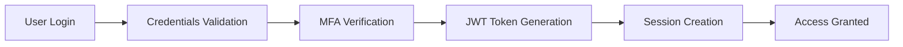

# Security Documentation

Comprehensive security documentation covering implementation, verification, and best practices for the Questro platform.

## Security Overview

Questro implements enterprise-grade security measures to protect user data, ensure system integrity, and maintain compliance with industry standards.

## Documentation Index

### 🔒 [Security Implementation Guide](./security-implementation-guide.md)
Comprehensive guide covering all security implementations including authentication, authorization, encryption, and secure coding practices.

### ✅ [Security Setup Complete](./security-setup-complete.md)
Documentation of completed security configurations and implementations across the platform.

### 📋 [Security Verification Report](./security-verification-report.md)
Security audit results, vulnerability assessments, and verification of security controls.

## Security Framework

### Core Security Principles
1. **Defense in Depth**: Multiple layers of security controls
2. **Principle of Least Privilege**: Minimal access rights
3. **Zero Trust Architecture**: Never trust, always verify
4. **Security by Design**: Security built into every component
5. **Continuous Monitoring**: Real-time security monitoring

### Security Domains

#### 1. Authentication & Authorization
- **Multi-factor Authentication**: Enhanced login security
- **JWT Token Management**: Secure token handling
- **Role-based Access Control**: Granular permissions
- **Session Management**: Secure session handling

#### 2. Data Protection
- **Encryption at Rest**: AES-256 encryption for stored data
- **Encryption in Transit**: TLS 1.3 for data transmission
- **Data Classification**: Sensitive data identification
- **Data Loss Prevention**: Prevent unauthorized data access

#### 3. Application Security
- **Input Validation**: Comprehensive input sanitization
- **Output Encoding**: XSS prevention
- **SQL Injection Prevention**: Parameterized queries
- **CSRF Protection**: Cross-site request forgery prevention

#### 4. Infrastructure Security
- **Network Security**: Firewall and network segmentation
- **Container Security**: Secure container configurations
- **Cloud Security**: Cloud-native security controls
- **Monitoring & Logging**: Security event monitoring

## Security Architecture

### Authentication Flow


### Authorization Model
```typescript
interface SecurityContext {
  user: {
    id: string;
    email: string;
    roles: Role[];
    permissions: Permission[];
  };
  session: {
    id: string;
    expiresAt: Date;
    ipAddress: string;
    userAgent: string;
  };
  request: {
    resource: string;
    action: string;
    context: Record<string, any>;
  };
}
```

## Security Controls

### Access Controls
- **Authentication**: Multi-factor authentication required
- **Authorization**: Role-based access control (RBAC)
- **Session Management**: Secure session handling
- **API Security**: Rate limiting and API key management

### Data Security
- **Encryption**: End-to-end encryption for sensitive data
- **Key Management**: Secure key storage and rotation
- **Data Masking**: PII protection in logs and exports
- **Backup Security**: Encrypted backups with access controls

### Network Security
- **TLS/SSL**: HTTPS enforcement with HSTS
- **Firewall**: Web application firewall (WAF)
- **DDoS Protection**: Distributed denial of service protection
- **IP Whitelisting**: Restricted access by IP address

### Application Security
- **Secure Coding**: OWASP secure coding practices
- **Dependency Scanning**: Automated vulnerability scanning
- **Code Analysis**: Static and dynamic code analysis
- **Security Testing**: Penetration testing and security audits

## Compliance & Standards

### Compliance Frameworks
- **GDPR**: General Data Protection Regulation
- **CCPA**: California Consumer Privacy Act
- **SOC 2**: Service Organization Control 2
- **ISO 27001**: Information Security Management

### Security Standards
- **OWASP Top 10**: Web application security risks
- **NIST Cybersecurity Framework**: Security best practices
- **CIS Controls**: Critical security controls
- **SANS Top 25**: Most dangerous software errors

## Security Monitoring

### Real-time Monitoring
- **Security Events**: Real-time security event monitoring
- **Anomaly Detection**: Behavioral anomaly detection
- **Threat Intelligence**: External threat intelligence feeds
- **Incident Response**: Automated incident response

### Security Metrics
- **Authentication Failures**: Failed login attempts
- **Authorization Violations**: Unauthorized access attempts
- **Data Access Patterns**: Unusual data access patterns
- **Security Incidents**: Security incident tracking

### Alerting
- **Critical Alerts**: Immediate notification for critical events
- **Security Dashboards**: Real-time security dashboards
- **Reporting**: Regular security reports and summaries
- **Escalation**: Automated escalation procedures

## Incident Response

### Incident Response Plan
1. **Detection**: Identify security incidents
2. **Analysis**: Assess incident severity and impact
3. **Containment**: Contain the security incident
4. **Eradication**: Remove the threat from systems
5. **Recovery**: Restore normal operations
6. **Lessons Learned**: Document and improve processes

### Response Team
- **Security Team**: Primary incident response team
- **Development Team**: Technical expertise and fixes
- **Operations Team**: Infrastructure and deployment
- **Management Team**: Decision making and communication

## Security Testing

### Automated Testing
- **Vulnerability Scanning**: Regular vulnerability scans
- **Dependency Checking**: Automated dependency vulnerability checks
- **Code Analysis**: Static application security testing (SAST)
- **Dynamic Testing**: Dynamic application security testing (DAST)

### Manual Testing
- **Penetration Testing**: Regular penetration testing
- **Code Reviews**: Security-focused code reviews
- **Architecture Reviews**: Security architecture reviews
- **Compliance Audits**: Regular compliance assessments

## Security Training

### Developer Training
- **Secure Coding**: OWASP secure coding practices
- **Threat Modeling**: Security threat modeling
- **Security Testing**: Security testing methodologies
- **Incident Response**: Security incident response procedures

### User Training
- **Security Awareness**: General security awareness training
- **Phishing Prevention**: Phishing awareness and prevention
- **Password Security**: Strong password practices
- **Data Handling**: Secure data handling procedures

## Security Tools

### Security Scanning
- **Snyk**: Dependency vulnerability scanning
- **SonarQube**: Code quality and security analysis
- **OWASP ZAP**: Web application security testing
- **Nessus**: Infrastructure vulnerability scanning

### Monitoring & Logging
- **Sentry**: Error tracking and monitoring
- **Datadog**: Infrastructure and application monitoring
- **Splunk**: Security information and event management
- **ELK Stack**: Log analysis and monitoring

### Authentication & Authorization
- **Auth0**: Identity and access management
- **Okta**: Single sign-on and identity management
- **AWS IAM**: Cloud identity and access management
- **HashiCorp Vault**: Secrets management

## Best Practices

### Development Security
- **Secure by Default**: Secure default configurations
- **Input Validation**: Validate all user inputs
- **Output Encoding**: Encode all outputs
- **Error Handling**: Secure error handling
- **Logging**: Security-focused logging

### Operational Security
- **Patch Management**: Regular security updates
- **Access Reviews**: Regular access reviews
- **Backup Testing**: Regular backup testing
- **Incident Drills**: Regular incident response drills

### Data Security
- **Data Classification**: Classify data by sensitivity
- **Data Minimization**: Collect only necessary data
- **Data Retention**: Implement data retention policies
- **Data Disposal**: Secure data disposal procedures

---

For detailed security implementation instructions, start with the [Security Implementation Guide](./security-implementation-guide.md).