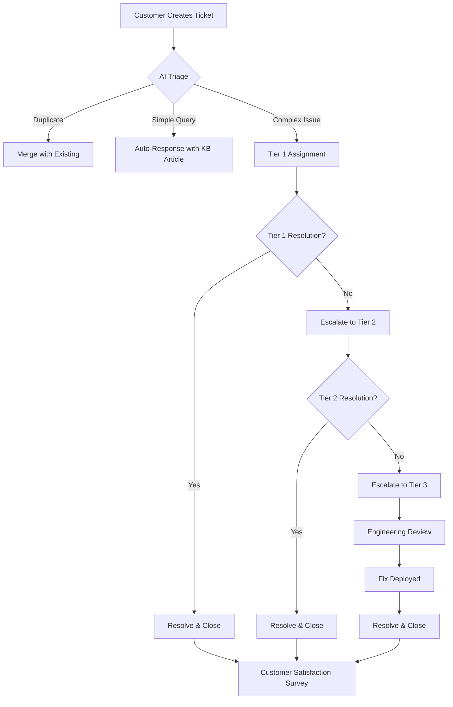
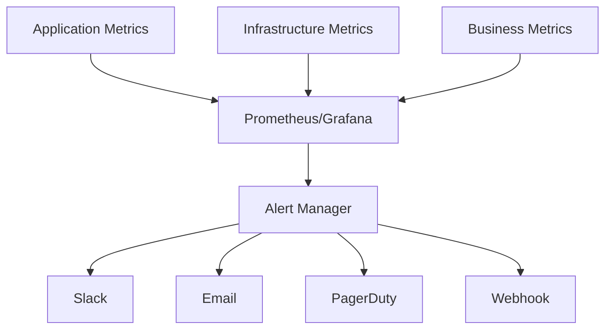
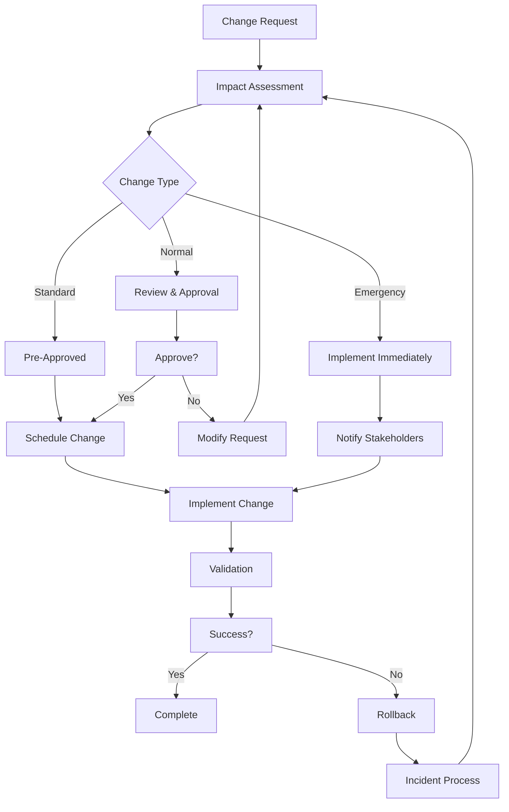
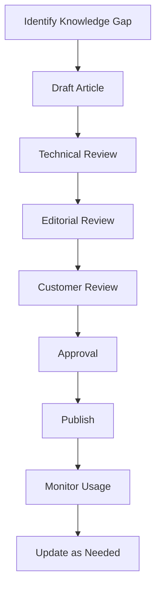

# Qestro Support & Maintenance Documentation

## Table of Contents

- [Overview](#overview)
- [Support Procedures](#support-procedures)
- [SLA Documentation](#sla-documentation)
- [Maintenance Procedures](#maintenance-procedures)
- [Backup and Recovery](#backup-and-recovery)
- [Monitoring and Alerting](#monitoring-and-alerting)
- [Incident Management](#incident-management)
- [Change Management](#change-management)
- [Security Incident Response](#security-incident-response)
- [Vendor Management](#vendor-management)
- [Customer Support Training](#customer-support-training)
- [Knowledge Base Management](#knowledge-base-management)

## Overview

This document outlines the comprehensive support and maintenance procedures for the Qestro AI-Powered Testing Automation Platform. It ensures consistent, high-quality support delivery and systematic maintenance operations to achieve 99.9% uptime and customer satisfaction.

### Support Philosophy

- **Customer-First**: Every decision prioritizes customer impact
- **Proactive**: Identify and resolve issues before they affect customers
- **Transparent**: Clear communication about issues and resolutions
- **Data-Driven**: Use metrics to continuously improve support processes
- **Continuous Improvement**: Regularly review and enhance procedures

## Support Procedures

### Support Tier Structure

#### Tier 1: First Response Support
**Team**: Customer Support Specialists  
**Response Time**: 
- Critical: 1 hour
- High: 4 hours
- Medium: 24 hours
- Low: 48 hours

**Responsibilities**:
- Initial ticket triage and categorization
- Basic issue resolution using knowledge base
- Escalation to Tier 2 for complex issues
- Customer communication and updates

#### Tier 2: Technical Support
**Team**: Support Engineers  
**Response Time**:
- Critical: 30 minutes
- High: 2 hours
- Medium: 8 hours
- Low: 24 hours

**Responsibilities**:
- Complex technical troubleshooting
- API integration support
- Account and billing assistance
- Advanced feature guidance

#### Tier 3: Engineering Support
**Team**: Development/DevOps Team  
**Response Time**:
- Critical: 15 minutes
- High: 1 hour
- Medium: 4 hours
- Low: 8 hours

**Responsibilities**:
- Bug fixes and patches
- Platform issues
- Performance optimization
- Feature development requests

### Support Channels

#### 1. Self-Service Portal
- **URL**: https://support.qestro.com
- **Features**:
  - Knowledge base with 500+ articles
  - Video tutorials library
  - Community forums
  - Automated ticket creation
  - Status page integration

#### 2. Email Support
- **Address**: support@qestro.com
- **Process**:
  1. Automatic ticket creation
  2. AI-powered categorization
  3. Priority assignment
  4. Routing to appropriate tier
  5. SLA tracking

#### 3. Live Chat
- **Availability**: 24/7 for Enterprise, 9-5 PST for others
- **Features**:
  - Proactive chat invitations
  - AI chatbot for common queries
  - Screen sharing capability
  - Co-browsing support

#### 4. Phone Support
- **Enterprise Only**: 1-800-QESTRO (1-800-7837876)
- **Availability**: 24/7 for critical issues
- **Process**:
  - Direct line to Tier 2 for enterprise customers
  - Call recording for quality assurance
  - Callback option for non-urgent issues

### Ticket Management Workflow



### Escalation Matrix

| Severity | Description | Escalation Timer | Escalation Path |
|----------|-------------|------------------|-----------------|
| **Critical** | Production down, data loss, security breach | 15 min | Tier 1 → Tier 2 → Engineering Manager → CTO |
| **High** | Feature broken, performance degraded | 1 hour | Tier 1 → Tier 2 → Team Lead |
| **Medium** | Workaround available, partial functionality | 4 hours | Tier 1 → Tier 2 |
| **Low** | General question, documentation request | 24 hours | Tier 1 |

## SLA Documentation

### Service Level Agreements

#### Uptime SLA
- **Enterprise**: 99.9% uptime (43.2 minutes downtime/month)
- **Professional**: 99.5% uptime (216 minutes downtime/month)
- **Starter**: 99% uptime (432 minutes downtime/month)

#### Response Time SLA
| Plan | Critical | High | Medium | Low |
|------|----------|------|--------|-----|
| Enterprise | 15 min | 1 hour | 4 hours | 24 hours |
| Professional | 30 min | 2 hours | 8 hours | 48 hours |
| Starter | 1 hour | 4 hours | 24 hours | 72 hours |

#### Resolution Time SLA
| Plan | Critical | High | Medium | Low |
|------|----------|------|--------|-----|
| Enterprise | 2 hours | 8 hours | 24 hours | 72 hours |
| Professional | 4 hours | 24 hours | 72 hours | 7 days |
| Starter | 8 hours | 48 hours | 7 days | 14 days |

### SLA Monitoring and Reporting

#### SLA Compliance Tracking
```typescript
interface SLAMetrics {
  period: string;
  totalTickets: number;
  slaBreaches: {
    critical: number;
    high: number;
    medium: number;
    low: number;
  };
  complianceRate: {
    response: number; // percentage
    resolution: number; // percentage
    uptime: number; // percentage
  };
}
```

#### Monthly SLA Report Template
```markdown
# Monthly SLA Report - [Month] [Year]

## Executive Summary
- Overall SLA Compliance: 98.7%
- Total Tickets: 1,234
- Customer Satisfaction: 4.6/5.0

## Detailed Metrics
### Uptime
- Target: 99.9%
- Achieved: 99.94%
- Total Downtime: 26 minutes
- Incidents: 3

### Response Time Compliance
- Critical: 98.5% (17 breaches out of 1,234)
- High: 99.1%
- Medium: 99.5%
- Low: 100%

### Resolution Time Compliance
- Critical: 96.2%
- High: 97.8%
- Medium: 98.9%
- Low: 99.3%

## Improvement Actions
1. Implement automated response for common queries
2. Extend coverage hours for Tier 1 support
3. Improve knowledge base search functionality

## Next Month Goals
- Achieve 99.5% overall compliance
- Reduce critical breaches to < 10
- Improve CSAT to 4.7/5.0
```

### SLA Credits and Compensation

#### Credit Calculation
```typescript
function calculateSLACredits(
  plan: string,
  actualUptime: number,
  slaUptime: number,
  monthlyFee: number
): number {
  const downtimeHours = (slaUptime - actualUptime) * 24 * 30;
  const creditPercentage = Math.min(downtimeHours / 24 * 10, 100);
  return monthlyFee * (creditPercentage / 100);
}

// Example: 99.5% uptime for Enterprise (99.9% SLA)
// 4.8 hours downtime = 20% credit = $200 credit for $1000/month plan
```

#### Compensation Policy
- **< 99% uptime**: 10% credit per hour of downtime
- **< 95% uptime**: 25% credit
- **< 90% uptime**: 50% credit
- **< 85% uptime**: 100% credit
- Credits automatically applied to next invoice
- Maximum credit: 100% of monthly fee

## Maintenance Procedures

### Maintenance Schedule

#### Planned Maintenance Windows
- **Frequency**: Monthly on first Sunday
- **Time**: 2:00 AM - 4:00 AM PST (least usage)
- **Duration**: Maximum 2 hours
- **Notice**: 7 days for all customers, 48 hours reminder

#### Maintenance Types

##### 1. Routine Maintenance (Monthly)
- Security patches application
- Performance optimization
- Database maintenance
- Log rotation and cleanup
- Backup verification

##### 2. Major Updates (Quarterly)
- New feature releases
- Architecture improvements
- Database schema changes
- Breaking changes (communicated 30 days in advance)

##### 3. Emergency Maintenance (As needed)
- Critical security patches
- Urgent bug fixes
- Performance issues
- Service restoration

### Maintenance Process

#### Pre-Maintenance Checklist
```bash
#!/bin/bash
# pre-maintenance-check.sh

echo "🔍 Running pre-maintenance checks..."

# 1. Health check
curl -f https://api.qestro.com/health || exit 1

# 2. Backup verification
ls -la /backups/latest/$(date +%Y-%m-%d)*.sql

# 3. Active users check
ACTIVE_USERS=$(curl -s https://api.qestro.com/metrics/active-users)
echo "Active users: $ACTIVE_USERS"

# 4. Queue check
QUEUE_SIZE=$(curl -s https://api.qestro.com/queue/size)
echo "Queue size: $QUEUE_SIZE"

# 5. Notify team
curl -X POST https://hooks.slack.com/... \
  -d '{"text": "Starting maintenance window"}'

echo "✅ Pre-maintenance checks complete"
```

#### Maintenance Execution
```bash
#!/bin/bash
# execute-maintenance.sh

MAINTENANCE_TYPE=${1:-"routine"}

echo "🔧 Starting $MAINTENANCE_TYPE maintenance..."

# 1. Enable maintenance mode
wrangler kv:key put --namespace-id="CONFIG" \
  maintenance_mode "true" \
  --expiration=$(( $(date +%s) + 7200 ))

# 2. Notify users
curl -X POST https://api.qestro.com/v1/notifications/maintenance \
  -H "Authorization: Bearer $SYSTEM_TOKEN" \
  -d '{
    "title": "Scheduled Maintenance",
    "message": "System undergoing scheduled maintenance. We'll be back shortly!",
    "duration": "2 hours"
  }'

# 3. Execute maintenance tasks
case $MAINTENANCE_TYPE in
  "routine")
    ./scripts/routine-maintenance.sh
    ;;
  "major")
    ./scripts/major-update.sh
    ;;
  "emergency")
    ./scripts/emergency-fix.sh
    ;;
esac

# 4. Health verification
./scripts/post-maintenance-verify.sh

# 5. Disable maintenance mode
wrangler kv:key delete --namespace-id="CONFIG" maintenance_mode

echo "✅ Maintenance complete"
```

### Maintenance Communication Template

#### 7-Day Notice Email
```html
Subject: Scheduled Maintenance - [Date] 2:00 AM - 4:00 AM PST

<div style="font-family: Arial, sans-serif; max-width: 600px;">
  <h2>🔧 Scheduled System Maintenance</h2>
  
  <p>Dear Qestro Customer,</p>
  
  <p>We will be performing scheduled maintenance to improve our service:</p>
  
  <div style="background: #f5f5f5; padding: 15px; border-radius: 5px;">
    <strong>Date:</strong> Sunday, [Date]<br>
    <strong>Time:</strong> 2:00 AM - 4:00 AM PST<br>
    <strong>Duration:</strong> Up to 2 hours<br>
    <strong>Impact:</strong> Service will be unavailable
  </div>
  
  <h3>What's happening:</h3>
  <ul>
    <li>Security updates</li>
    <li>Performance improvements</li>
    <li>Database optimization</li>
  </ul>
  
  <h3>What you need to do:</h3>
  <ul>
    <li>Save any work before 2:00 AM PST</li>
    <li>Plan tests around this window</li>
    <li>Check status page for updates</li>
  </ul>
  
  <p>We apologize for any inconvenience and appreciate your patience.</p>
  
  <p>Best regards,<br>The Qestro Team</p>
</div>
```

#### 48-Hour Reminder
```html
Subject: Reminder: Maintenance Tomorrow at 2:00 AM PST

<div style="font-family: Arial, sans-serif; max-width: 600px;">
  <h2>⏰ Maintenance Reminder</h2>
  
  <p>Quick reminder about tomorrow's maintenance:</p>
  
  <div style="background: #fff3cd; padding: 15px; border-radius: 5px; border: 1px solid #ffc107;">
    <strong>When:</strong> Tomorrow at 2:00 AM PST<br>
    <strong>Duration:</strong> Up to 2 hours<br>
    <strong>Status Page:</strong> <a href="https://status.qestro.com">status.qestro.com</a>
  </div>
  
  <p>Follow updates on our status page.</p>
  
  <p>Thanks,<br>The Qestro Team</p>
</div>
```

## Backup and Recovery

### Backup Strategy

#### Data Classification
1. **Critical Data** (Must be backed up)
   - User accounts and data
   - Test cases and results
   - Payment and billing information
   - Audit logs

2. **Important Data** (Should be backed up)
   - Application logs
   - Performance metrics
   - Configuration data

3. **Non-essential Data** (Optional backup)
   - Temporary files
   - Cache data

#### Backup Schedule
```typescript
const backupSchedule = {
  // D1 Database
  database: {
    full: {
      frequency: "daily",
      time: "03:00 UTC",
      retention: "30 days"
    },
    incremental: {
      frequency: "hourly",
      retention: "7 days"
    },
    transactional: {
      frequency: "every 15 minutes",
      retention: "24 hours"
    }
  },
  
  // R2 Storage
  storage: {
    artifacts: {
      frequency: "daily",
      retention: "90 days"
    },
    logs: {
      frequency: "daily",
      retention: "30 days"
    },
    backups: {
      frequency: "immediate",
      retention: "365 days"
    }
  },
  
  // Configuration
  config: {
    workers: {
      frequency: "on-change",
      retention: "90 days"
    },
    kv: {
      frequency: "daily",
      retention: "30 days"
    }
  }
};
```

### Backup Procedures

#### Automated Daily Backup Script
```bash
#!/bin/bash
# daily-backup.sh

BACKUP_DATE=$(date +%Y-%m-%d)
BACKUP_DIR="/backups/daily/$BACKUP_DATE"

mkdir -p $BACKUP_DIR

echo "Starting backup for $BACKUP_DATE"

# 1. Database backup
echo "Backing up database..."
wrangler d1 execute qestro-production-db \
  --command="VACUUM INTO 'r2://qestro-backups/database/daily/$BACKUP_DATE.db'"

# 2. KV backup
echo "Backing up KV namespaces..."
for namespace in SESSIONS CACHE RATELIMIT CONFIG AUDIT; do
  wrangler kv:namespace list $namespace \
    --preview=false \
    | jq -r '.[] | .id' \
    | xargs -I {} wrangler kv:key list --namespace-id={} \
    | jq -r '.[] | .name' \
    | while read key; do
      wrangler kv:key get --namespace-id=$NAMESPACE_ID $key \
        > "$BACKUP_DIR/kv_${namespace}_${key}.json"
    done
done

# 3. Configuration backup
echo "Backing up configuration..."
wrangler whoami > $BACKUP_DIR/wrangler_config.json
cp wrangler.toml $BACKUP_DIR/
cp -r config/ $BACKUP_DIR/config/

# 4. Verify backup
echo "Verifying backup..."
BACKUP_SIZE=$(du -sh $BACKUP_DIR | cut -f1)
echo "Backup size: $BACKUP_SIZE"

# 5. Clean old backups
find /backups/daily -type d -mtime +30 -exec rm -rf {} +

# 6. Notification
curl -X POST https://hooks.slack.com/... \
  -d "{\"text\": \"Daily backup completed: $BACKUP_SIZE\"}"

echo "✅ Backup complete: $BACKUP_DIR"
```

#### Cross-Region Replication
```bash
#!/bin/bash
# replicate-backup.sh

# Replicate critical backups to secondary region
aws s3 sync s3://qestro-backups-primary/ s3://qestro-backups-secondary/ \
  --exclude "temp/*" \
  --exclude "cache/*" \
  --delete

# Verify replication
REPLICATED=$(aws s3 ls s3://qestro-backups-secondary/ --recursive | wc -l)
echo "Replicated $REPLICATED files to secondary region"
```

### Recovery Procedures

#### Disaster Recovery Scenarios

##### Scenario 1: Database Corruption
```bash
#!/bin/bash
# recover-database.sh

echo "🚨 DATABASE RECOVERY INITIATED"

# 1. Identify latest good backup
LATEST_BACKUP=$(aws s3 ls s3://qestro-backups/database/ | sort -r | head -1 | awk '{print $4}')
echo "Using backup: $LATEST_BACKUP"

# 2. Stop application services
wrangler secret put MAINTENANCE_MODE --env production --value="true"

# 3. Restore database
wrangler d1 execute qestro-production-db \
  --file="s3://qestro-backups/database/$LATEST_BACKUP"

# 4. Verify integrity
wrangler d1 execute qestro-production-db --command="PRAGMA integrity_check;"
RESULT=$?
if [ $RESULT -ne 0 ]; then
  echo "❌ Database integrity check failed"
  exit 1
fi

# 5. Replay transaction logs
LOGS_TO_REPLAY=$(find /transaction-logs -name "*.log" -newer "/backups/$LATEST_BACKUP")
for log in $LOGS_TO_REPLAY; do
  echo "Replaying $log"
  wrangler d1 execute qestro-production-db --file="$log"
done

# 6. Restart services
wrangler secret put MAINTENANCE_MODE --env production --value="false"

# 7. Health check
sleep 30
curl -f https://api.qestro.com/health || exit 1

echo "✅ Database recovery complete"
```

##### Scenario 2: Worker Deployment Failure
```bash
#!/bin/bash
# recover-workers.sh

echo "🔄 WORKER RECOVERY INITIATED"

# 1. Check deployment status
DEPLOY_STATUS=$(wrangler deployments list --env production | jq -r '.[0].latest.version')
echo "Current deployment: $DEPLOY_STATUS"

# 2. Rollback if needed
if [ "$1" = "rollback" ]; then
  echo "Rolling back to previous version..."
  wrangler rollback --env production
fi

# 3. Redeploy from source
echo "Redeploying workers..."
npm run build
wrangler deploy --env production

# 4. Verify deployment
for service in api ai monitoring; do
  curl -f https://${service}.qestro.com/health || {
    echo "❌ $service not responding"
    exit 1
  }
done

echo "✅ Worker recovery complete"
```

#### Recovery Time Objectives (RTO) and Recovery Point Objectives (RPO)

| Data Type | RTO | RPO | Backup Frequency |
|-----------|-----|-----|------------------|
| Customer Data | 1 hour | 15 minutes | Every 15 minutes |
| Test Results | 4 hours | 1 hour | Hourly |
| Application Logs | 8 hours | 4 hours | Every 4 hours |
| Configuration | 15 minutes | 0 | On change |

## Monitoring and Alerting

### Monitoring Architecture



### Key Metrics to Monitor

#### Application Metrics
```typescript
const appMetrics = {
  // Request metrics
  requests: {
    total: 'counter',
    duration: 'histogram',
    rate: 'gauge'
  },
  
  // Error metrics
  errors: {
    total: 'counter',
    rate: 'gauge',
    byType: 'counter'
  },
  
  // Business metrics
  business: {
    activeUsers: 'gauge',
    testExecutions: 'counter',
    aiGenerations: 'counter',
    revenue: 'counter'
  },
  
  // Performance metrics
  performance: {
    responseTime: 'histogram',
    throughput: 'gauge',
    resourceUsage: 'gauge'
  }
};
```

#### Infrastructure Metrics
```typescript
const infraMetrics = {
  // Cloudflare Workers
  workers: {
    cpuUsage: 'gauge',
    memoryUsage: 'gauge',
    errors: 'counter',
    invocations: 'counter'
  },
  
  // Database
  database: {
    connections: 'gauge',
    queryTime: 'histogram',
    rowsProcessed: 'counter',
    deadlocks: 'counter'
  },
  
  // Storage
  storage: {
    usage: 'gauge',
    operations: 'counter',
    latency: 'histogram',
    errors: 'counter'
  }
};
```

### Alerting Rules Configuration

#### Critical Alerts
```yaml
groups:
  - name: critical
    rules:
      - alert: ServiceDown
        expr: up == 0
        for: 1m
        labels:
          severity: critical
        annotations:
          summary: "Service {{ $labels.job }} is down"
          description: "{{ $labels.job }} has been down for more than 1 minute"
          
      - alert: HighErrorRate
        expr: rate(errors_total[5m]) > 0.05
        for: 5m
        labels:
          severity: critical
        annotations:
          summary: "High error rate detected"
          description: "Error rate is {{ $value | humanizePercentage }}"
          
      - alert: DatabaseConnectionFailure
        expr: db_connections_active == 0
        for: 30s
        labels:
          severity: critical
        annotations:
          summary: "Database connections failed"
          description: "No active database connections"
```

#### Warning Alerts
```yaml
groups:
  - name: warnings
    rules:
      - alert: HighResponseTime
        expr: histogram_quantile(0.95, rate(http_request_duration_seconds_bucket[5m])) > 2
        for: 10m
        labels:
          severity: warning
        annotations:
          summary: "High P95 response time"
          description: "P95 response time is {{ $value }}s"
          
      - alert: HighCPUUsage
        expr: cpu_usage > 0.8
        for: 15m
        labels:
          severity: warning
        annotations:
          summary: "High CPU usage"
          description: "CPU usage is {{ $value | humanizePercentage }}"
```

### Alert Notification Flow

```mermaid
graph TD
    A[Alert Triggered] --> B{Severity}
    B -->|Critical| C[Page On-Call Engineer]
    B -->|High| D[Slack + Email]
    B -->|Medium| E[Email Only]
    B -->|Low| F[Log Only]
    
    C --> G[Acknowledge?]
    G -->|Yes| H[Working on Issue]
    G -->|No (5 min)| I[Escalate to Manager]
    
    H --> J[Resolve?]
    J -->|Yes| K[Close Alert]
    J -->|No (30 min)| L[Escalate]
    
    L --> M[Assign to Specialist]
    M --> N[Update Documentation]
```

## Incident Management

### Incident Classification

#### Severity Levels
| Severity | Description | Examples | Response Time |
|----------|-------------|----------|---------------|
| **Sev 0** | Total outage, critical impact | All services down, data loss | Immediate (call) |
| **Sev 1** | Major service degradation | 50%+ errors, slow performance | 15 minutes |
| **Sev 2** | Minor service issues | Feature broken, some errors | 1 hour |
| **Sev 3** | Low impact issues | Documentation errors, UI bugs | 4 hours |
| **Sev 4** | General inquiries | How-to questions, feature requests | 24 hours |

### Incident Response Process

#### Phase 1: Detection (0-5 minutes)
```typescript
// Automated detection
const incidentDetection = {
  triggers: [
    { metric: 'error_rate', threshold: 0.05, window: '5m' },
    { metric: 'uptime', threshold: 0.99, window: '1m' },
    { metric: 'response_time', threshold: 5000, window: '5m' }
  ],
  
  actions: [
    'create_incident',
    'notify_on_call',
    'create_bridge',
    'update_status_page'
  ]
};
```

#### Phase 2: Assessment (5-15 minutes)
```markdown
# Incident Assessment Template

## Incident Details
- ID: INC-2024-001
- Severity: Sev 1
- Start Time: 2024-11-03 14:32:00 UTC
- Reporter: Automated Monitoring

## Impact Assessment
- Affected Services: API, AI Services
- Affected Users: All (estimated 1000+)
- Business Impact: High
- Customer Impact: Unable to create/execute tests

## Current Status
- Investigation in progress
- Root cause unknown
- No workaround available

## Next Steps
1. Check recent deployments
2. Review error logs
3. Assess database status
4. Communicate with customers
```

#### Phase 3: Resolution (15-60 minutes)
```typescript
const resolutionSteps = {
  immediate: [
    'Assess scope',
    'Identify root cause',
    'Communicate status',
    'Implement fix'
  ],
  
  followup: [
    'Monitor for recurrence',
    'Create incident report',
    'Update runbooks',
    'Schedule retrospective'
  ]
};
```

### Post-Incident Review

#### Incident Report Template
```markdown
# Post-Incident Report: INC-2024-001

## Executive Summary
- Duration: 73 minutes (14:32 - 15:45 UTC)
- Impact: 100% of users affected
- Root Cause: Memory leak in AI service worker
- Resolution: Deployed hotfix with memory management improvements

## Timeline
| Time (UTC) | Event |
|------------|-------|
| 14:32 | Alert triggered: High error rate |
| 14:35 | On-call engineer engaged |
| 14:40 | Incident declared (Sev 1) |
| 14:45 | Root cause identified |
| 15:10 | Fix deployed to staging |
| 15:20 | Fix deployed to production |
| 15:30 | Services恢复正常 |
| 15:45 | Incident resolved |

## Root Cause Analysis
### Primary Cause
- Memory leak in AI service worker when processing large test descriptions
- Unbounded growth of request context in memory

### Contributing Factors
- Insufficient memory monitoring
- Missing circuit breaker pattern
- No memory limits per request

## Resolution Actions
1. Immediate Fix:
   - Implemented memory cleanup in request handlers
   - Added request size limits
   - Deployed hotfix to production

2. Follow-up Actions:
   - Enhanced memory monitoring
   - Added circuit breaker pattern
   - Improved error handling

## Lessons Learned
1. Technical
   - Need better memory profiling in staging
   - Implement memory limits per worker
   - Add automated memory leak detection

2. Process
   - Improve escalation procedures
   - Better communication templates
   - Faster rollback process

## Action Items
- [ ] Add memory usage alerts (Owner: DevOps, Due: 2024-11-10)
- [ ] Implement circuit breaker (Owner: Backend, Due: 2024-11-15)
- [ ] Update incident response runbook (Owner: SRE, Due: 2024-11-05)
- [ ] Conduct team training (Owner: Engineering Manager, Due: 2024-11-08)
```

## Change Management

### Change Types

1. **Standard Changes**
   - Low-risk, well-understood changes
   - Pre-approved procedures
   - Examples: Documentation updates, non-critical bug fixes

2. **Normal Changes**
   - Require risk assessment
   - Need approval
   - Examples: Feature releases, infrastructure changes

3. **Emergency Changes**
   - Critical fixes for production issues
   - Bypass normal approval process
   - Must be documented within 48 hours

### Change Request Process



### Change Request Template

```markdown
# Change Request: CR-2024-001

## Change Details
- **Title**: Update AI service model to GPT-4 Turbo
- **Requester**: John Doe (Backend Team)
- **Date**: 2024-11-03
- **Target Date**: 2024-11-10

## Change Type
- [ ] Standard
- [x] Normal
- [ ] Emergency

## Description
Update the AI service to use GPT-4 Turbo instead of GPT-3.5 for improved test generation quality and speed.

## Justification
- 40% faster response times
- Improved test quality
- Better cost efficiency
- Customer demand for better AI features

## Risk Assessment
| Risk | Probability | Impact | Mitigation |
|------|-------------|--------|------------|
| Model incompatibility | Low | High | Comprehensive testing in staging |
| Increased costs | Medium | Medium | Monitor usage and set limits |
| Customer impact | Low | High | Gradual rollout, feature flag |

## Implementation Plan
1. Update AI service configuration
2. Deploy to staging environment
3. Run test suite validation
4. Enable for 10% of users
5. Monitor metrics for 24 hours
6. Full rollout

## Rollback Plan
- Revert to previous model via feature flag
- Restore previous configuration
- No data migration required

## Approval
- [x] Engineering Manager
- [x] Product Owner
- [ ] DevOps Team
- [ ] Security Team
```

## Security Incident Response

### Security Incident Types

1. **Data Breach**
   - Unauthorized access to customer data
   - Data exfiltration
   - Data corruption

2. **Service Attack**
   - DDoS attacks
   - Resource exhaustion
   - Service disruption

3. **Authentication Bypass**
   - Credential compromise
   - Session hijacking
   - Authorization bypass

4. **Malicious Code**
   - Code injection
   - Malware infection
   - Supply chain attack

### Security Response Team

```typescript
const securityTeam = {
  incidentCommander: {
    role: "Incident Commander",
    contact: "security@qestro.com",
    backup: "cto@qestro.com"
  },
  
  technicalLead: {
    role: "Technical Lead",
    contact: "security-engineer@qestro.com",
    backup: "devops@qestro.com"
  },
  
  communications: {
    role: "Communications Lead",
    contact: "comms@qestro.com",
    backup: "ceo@qestro.com"
  },
  
  legal: {
    role: "Legal Counsel",
    contact: "legal@qestro.com",
    backup: "external-counsel@firm.com"
  }
};
```

### Security Incident Response Process

#### Phase 1: Detection and Analysis (0-2 hours)
```bash
#!/bin/bash
# security-incident-detect.sh

# 1. Check for suspicious activity
echo "Checking for security indicators..."

# Failed login attempts
FAILED_LOGINS=$(grep "authentication_failed" /var/log/qestro.log | wc -l)
if [ $FAILED_LOGINS -gt 100 ]; then
  echo "ALERT: High number of failed logins: $FAILED_LOGINS"
  # Trigger security alert
  curl -X POST https://security-alerts.qestro.com/incident \
    -d '{"type": "brute_force_attempt", "count": '$FAILED_LOGINS'}'
fi

# Unusual API usage
API_CALLS=$(grep "api_calls" /var/log/qestro.log | wc -l)
if [ $API_CALLS -gt 10000 ]; then
  echo "ALERT: Unusual API activity: $API_CALLS calls"
fi

# Data access patterns
DATA_EXPORTS=$(grep "data_export" /var/log/qestro.log | wc -l)
if [ $DATA_EXPORTS -gt 10 ]; then
  echo "ALERT: Suspicious data export activity: $DATA_EXPORTS"
fi
```

#### Phase 2: Containment (2-4 hours)
```bash
#!/bin/bash
# security-contain.sh

INCIDENT_TYPE=$1

echo "🔒 Initiating security containment for: $INCIDENT_TYPE"

case $INCIDENT_TYPE in
  "data_breach")
    # Rotate all credentials
    ./scripts/rotate-all-secrets.sh
    
    # Force logout all users
    wrangler kv:key put --namespace-id="SESSIONS" \
      force_logout_all "true"
    
    # Enable MFA requirement
    wrangler kv:key put --namespace-id="CONFIG" \
      require_mfa "true"
    ;;
    
  "ddos")
    # Activate DDoS protection
    wrangler firewall rules update ddos-protection.json
    
    # Rate limit aggressive
    wrangler kv:key put --namespace-id="RATELIMIT" \
      global_limit "10/minute"
    
    # Enable CAPTCHA
    wrangler kv:key put --namespace-id="CONFIG" \
      require_captcha "true"
    ;;
    
  "auth_breach")
    # Invalidate all sessions
    wrangler kv namespace delete SESSIONS
    
    # Reset passwords for all users
    ./scripts/password-reset-all.sh
    
    # Block suspicious IPs
    ./scripts/block-ips.sh
    ;;
esac

echo "✅ Containment procedures completed"
```

### Post-Security Incident Actions

1. **Forensic Analysis**
   - Preserve evidence
   - Analyze attack vectors
   - Identify compromised data

2. **Customer Notification**
   - Within 72 hours for GDPR
   - Clear and transparent communication
   - Provide remediation steps

3. **Security Improvements**
   - Patch vulnerabilities
   - Enhance monitoring
   - Update security policies

4. **Compliance Reporting**
   - Document incident
   - Report to authorities if required
   - Update security posture

## Vendor Management

### Third-Party Vendors

#### Critical Vendors
| Vendor | Service | Contract | SLA | Review Date |
|--------|---------|----------|-----|-------------|
| Cloudflare | CDN/Workers | Enterprise | 99.9% | Quarterly |
| OpenAI | AI Services | API | 99.5% | Monthly |
| Stripe | Payments | Standard | 99.9% | Quarterly |
| SendGrid | Email Service | Pro | 99.9% | Quarterly |
| AWS/GCP | Backup Storage | Enterprise | 99.99% | Monthly |

#### Vendor Assessment Process

```typescript
interface VendorAssessment {
  vendor: string;
  service: string;
  criticality: 'critical' | 'important' | 'standard';
  
  security: {
    soc2Compliant: boolean;
    gdprCompliant: boolean;
    dataEncryption: boolean;
    penTestingAnnually: boolean;
  };
  
  operational: {
    sla: number; // percentage
    support247: boolean;
    incidentResponse: boolean;
    backupProcedures: boolean;
  };
  
  financial: {
    contractTerm: string;
    pricingModel: string;
    autoRenewal: boolean;
    exitClause: boolean;
  };
  
  lastReview: string;
  nextReview: string;
  status: 'approved' | 'needs_review' | 'at_risk';
}
```

### Vendor Onboarding Checklist

#### Security Review
- [ ] SOC 2 Type II report reviewed
- [ ] GDPR compliance verified
- [ ] Data processing agreement signed
- [ ] Security questionnaire completed
- [ ] Penetration test results reviewed

#### Operational Review
- [ ] SLA terms acceptable
- [ ] Support channels verified
- [ ] Incident response procedures reviewed
- [ ] Backup and recovery verified
- [ ] Service dependencies documented

#### Legal Review
- [ ] Contract terms reviewed by legal
- [ ] Liability clauses acceptable
- [ ] Data ownership clear
- [ ] Exit procedures defined
- [ ] Auto-renewal terms reviewed

## Customer Support Training

### Training Curriculum

#### Tier 1 Support Training (2 weeks)

**Week 1: Product Knowledge**
- Platform overview and features
- User interface navigation
- Common user workflows
- Basic troubleshooting steps

**Week 2: Support Skills**
- Ticket management system
- Customer service best practices
- Communication guidelines
- Escalation procedures

#### Tier 2 Support Training (4 weeks)

**Week 1-2: Technical Deep Dive**
- API documentation
- Integration guides
- Debugging techniques
- Log analysis

**Week 3: Advanced Topics**
- Performance troubleshooting
- Database queries
- Network diagnostics
- Security principles

**Week 4: Practical Skills**
- Real customer scenarios
- Role-playing exercises
- Shadowing experienced agents
- Certification assessment

#### Tier 3 Support Training (Ongoing)

**Continuous Learning**
- Code review participation
- Architecture reviews
- Performance optimization
- Security training

### Training Materials

#### Knowledge Base Articles
- 500+ troubleshooting articles
- Video tutorials (100+ hours)
- Interactive walkthroughs
- FAQ sections

#### Quick Reference Guides
```markdown
# Quick Reference: Common Issues

## User Can't Login
1. Check if account exists
2. Verify email is confirmed
3. Reset password if needed
4. Check for account lockout
5. Verify 2FA is working

## Test Execution Fails
1. Check device connection
2. Verify app is installed
3. Check permissions
4. Review test syntax
5. Check error logs

## AI Generation Not Working
1. Verify quota available
2. Check API key validity
3. Review prompt clarity
4. Check model availability
5. Contact Tier 2 if persists
```

## Knowledge Base Management

### Content Creation Workflow



### Knowledge Base Metrics

```typescript
const kbMetrics = {
  articles: {
    total: 500,
    published: 485,
    inReview: 15,
    lastUpdated: "2024-11-03"
  },
  
  usage: {
    viewsPerMonth: 50000,
    searchSuccess: 0.85,
    timeOnPage: 180, // seconds
    feedbackRating: 4.3
  },
  
  impact: {
    ticketDeflection: 0.35, // 35% reduction in tickets
    customerSatisfaction: 4.5,
    agentEfficiency: 0.25 // 25% faster resolution
  }
};
```

### Content Review Schedule

- **Monthly**: Review top 10 most viewed articles
- **Quarterly**: Full content audit and updates
- **Annually**: Complete knowledge base refresh
- **As Needed**: Update for new features/issues

---

## Conclusion

This comprehensive support and maintenance documentation ensures Qestro can deliver exceptional service reliability and customer satisfaction. Regular reviews and updates of these procedures will help maintain high service standards as the platform evolves.

### Key Success Factors

1. **Proactive Monitoring**: Detect issues before they impact customers
2. **Rapid Response**: Meet or exceed SLA commitments
3. **Clear Communication**: Keep customers informed during issues
4. **Continuous Improvement**: Learn from incidents and feedback
5. **Well-Documented Procedures**: Ensure consistency and quality

### Metrics Dashboard

Track these KPIs to measure support success:
- **Customer Satisfaction (CSAT)**: Target > 4.5/5.0
- **First Response Time**: Meet SLA targets
- **Resolution Time**: Meet SLA targets
- **Ticket Deflection**: > 30% through self-service
- **Uptime**: > 99.9% for enterprise customers

---

Document Version: 2.0.0
Last Updated: 2025-11-03
Next Review: 2025-12-03
Maintained by: Qestro Operations Team