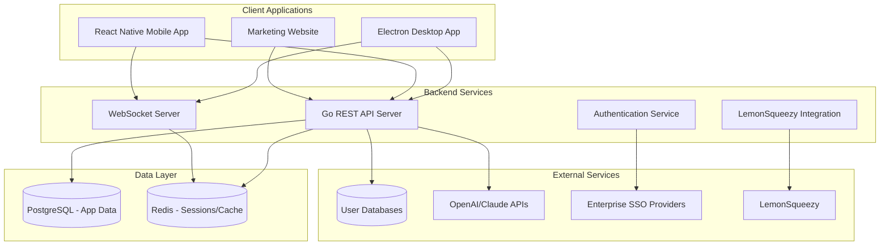
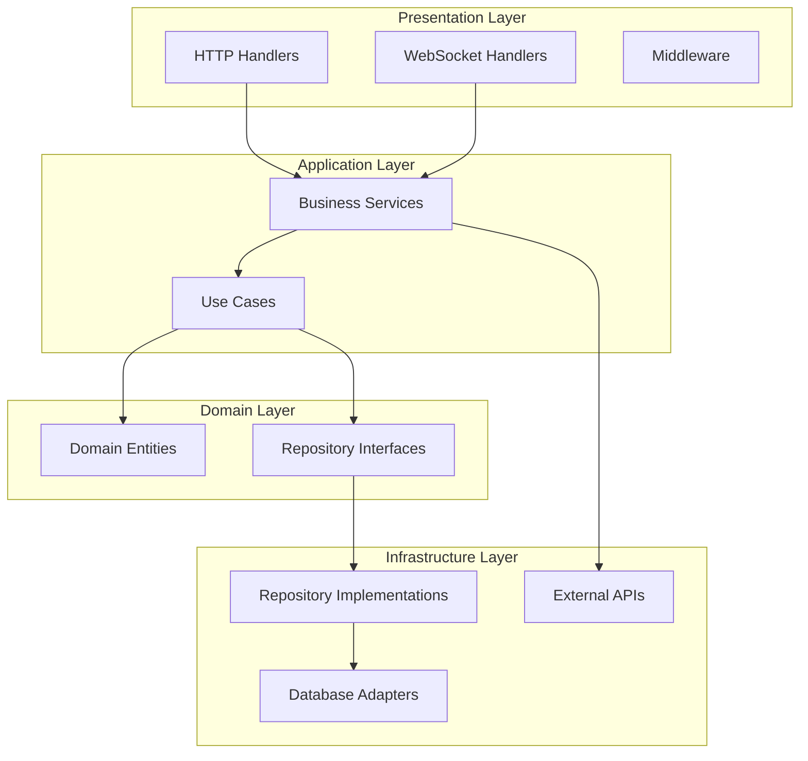
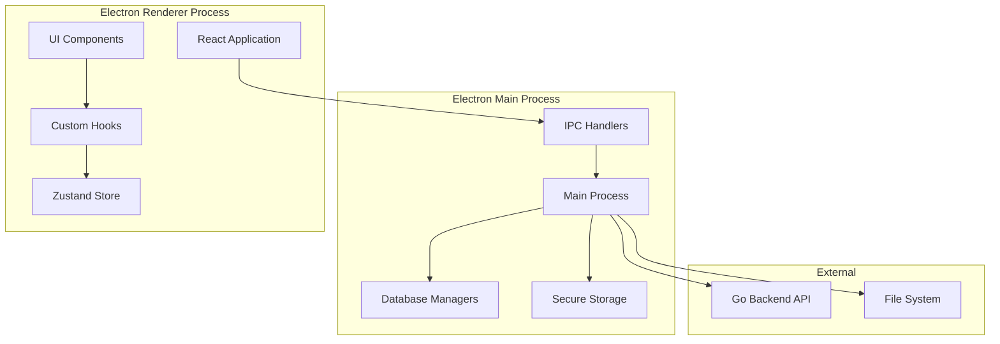
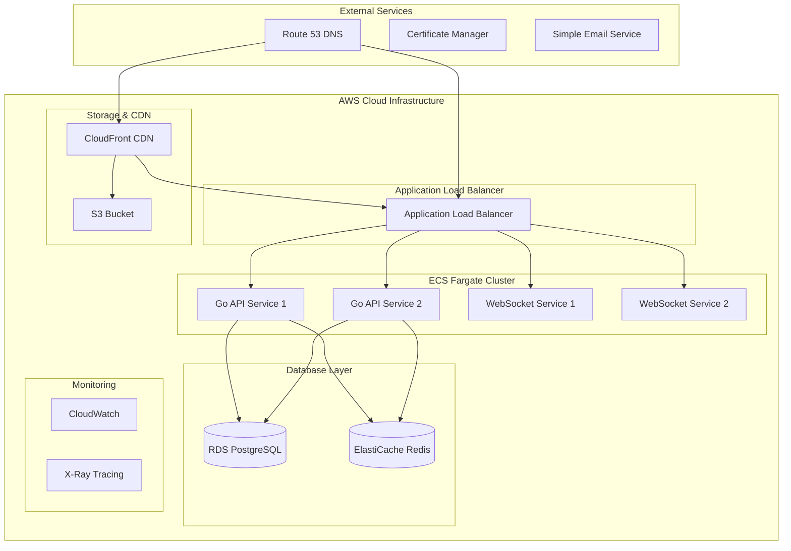

# Design Document

## Overview

QueryFlux will be transformed into a comprehensive, multi-platform database management ecosystem consisting of five main components:

1. **Go Backend API** - High-performance REST API with clean architecture
2. **Electron Desktop App** - Native desktop application with React frontend
3. **Marketing Website** - Next.js website for queryflux.com
4. **Mobile App** - React Native app for monitoring and alerts
5. **Enterprise Features** - LemonSqueezy payments and SSO authentication

The system will follow modern design patterns, implement real-time capabilities, adhere to Apple HIG guidelines, and maintain 100% test coverage through TDD methodology.

## Architecture

### System Architecture Overview



### Technology Stack

| Component | Technology | Justification |
|-----------|------------|---------------|
| **Backend API** | Go (Gin/Fiber) | High performance, excellent concurrency, strong typing |
| **Database Layer** | PostgreSQL + Redis | ACID compliance + high-speed caching |
| **Desktop App** | Electron + React + TypeScript | Cross-platform, reuse existing UI |
| **Mobile App** | React Native + TypeScript | Code sharing, native performance |
| **Marketing Site** | Next.js + TypeScript | SEO optimization, static generation |
| **Real-time** | WebSockets (gorilla/websocket) | Low latency, bidirectional communication |
| **State Management** | Zustand | Lightweight, TypeScript-first |
| **Testing** | Go testing + Jest + Cypress | Comprehensive coverage |
| **Payments** | LemonSqueezy | Developer-friendly, global support |

## Components and Interfaces

### 1. Go Backend API Architecture

#### Clean Architecture Layers



#### Core Interfaces

```go
// Domain Entities
type Connection struct {
    ID          string    `json:"id"`
    Name        string    `json:"name"`
    Type        string    `json:"type"`
    Host        string    `json:"host"`
    Port        int       `json:"port"`
    Database    string    `json:"database"`
    Username    string    `json:"username"`
    Password    string    `json:"password,omitempty"`
    SSL         bool      `json:"ssl"`
    CreatedAt   time.Time `json:"created_at"`
    UpdatedAt   time.Time `json:"updated_at"`
}

type Query struct {
    ID           string    `json:"id"`
    ConnectionID string    `json:"connection_id"`
    SQL          string    `json:"sql"`
    Results      []map[string]interface{} `json:"results"`
    ExecutedAt   time.Time `json:"executed_at"`
    Duration     int64     `json:"duration_ms"`
    Status       string    `json:"status"`
}

// Repository Interfaces
type ConnectionRepository interface {
    Create(ctx context.Context, conn *Connection) error
    GetByID(ctx context.Context, id string) (*Connection, error)
    GetByUserID(ctx context.Context, userID string) ([]*Connection, error)
    Update(ctx context.Context, conn *Connection) error
    Delete(ctx context.Context, id string) error
}

type QueryRepository interface {
    Create(ctx context.Context, query *Query) error
    GetHistory(ctx context.Context, connectionID string, limit int) ([]*Query, error)
    GetByID(ctx context.Context, id string) (*Query, error)
}

// Service Interfaces
type DatabaseService interface {
    Connect(ctx context.Context, conn *Connection) error
    ExecuteQuery(ctx context.Context, connectionID, sql string) (*Query, error)
    GetSchema(ctx context.Context, connectionID string) (*Schema, error)
    TestConnection(ctx context.Context, conn *Connection) error
}

type AIService interface {
    ConvertNLToSQL(ctx context.Context, nl string, schema *Schema) (string, error)
    OptimizeQuery(ctx context.Context, sql string) (*QueryOptimization, error)
    ExplainQuery(ctx context.Context, sql string) (*QueryExplanation, error)
}
```

#### Database Connection Pool Management

```go
type ConnectionPool struct {
    pools map[string]*sql.DB
    mutex sync.RWMutex
    config PoolConfig
}

type PoolConfig struct {
    MaxOpenConns    int
    MaxIdleConns    int
    ConnMaxLifetime time.Duration
    ConnMaxIdleTime time.Duration
}

func (cp *ConnectionPool) GetConnection(connectionID string) (*sql.DB, error) {
    cp.mutex.RLock()
    defer cp.mutex.RUnlock()
    
    if pool, exists := cp.pools[connectionID]; exists {
        return pool, nil
    }
    
    return nil, errors.New("connection not found")
}
```

### 2. Electron Desktop Application

#### Architecture Pattern



#### IPC Communication Layer

```typescript
// Preload Script (Bridge)
interface ElectronAPI {
  database: {
    connect: (config: ConnectionConfig) => Promise<ConnectionResult>;
    executeQuery: (connectionId: string, sql: string) => Promise<QueryResult>;
    getSchema: (connectionId: string) => Promise<SchemaResult>;
    disconnect: (connectionId: string) => Promise<void>;
  };
  
  storage: {
    getConnections: () => Promise<Connection[]>;
    saveConnection: (connection: Connection) => Promise<void>;
    deleteConnection: (id: string) => Promise<void>;
  };
  
  ai: {
    convertNLToSQL: (naturalLanguage: string, schema: Schema) => Promise<string>;
    optimizeQuery: (sql: string) => Promise<QueryOptimization>;
  };
}

// Main Process Handlers
ipcMain.handle('database:connect', async (event, config: ConnectionConfig) => {
  try {
    const adapter = DatabaseAdapterFactory.create(config.type);
    await adapter.connect(config);
    connectionPool.add(config.id, adapter);
    return { success: true, connectionId: config.id };
  } catch (error) {
    return { success: false, error: error.message };
  }
});

ipcMain.handle('database:executeQuery', async (event, connectionId: string, sql: string) => {
  try {
    const adapter = connectionPool.get(connectionId);
    const result = await adapter.executeQuery(sql);
    return { success: true, data: result };
  } catch (error) {
    return { success: false, error: error.message };
  }
});
```

#### React Frontend Architecture

```typescript
// Custom Hooks Pattern
export const useDatabase = () => {
  const [connections, setConnections] = useState<Connection[]>([]);
  const [activeConnection, setActiveConnection] = useState<string | null>(null);
  
  const connect = useCallback(async (config: ConnectionConfig) => {
    const result = await window.electronAPI.database.connect(config);
    if (result.success) {
      setActiveConnection(result.connectionId);
    }
    return result;
  }, []);
  
  const executeQuery = useCallback(async (sql: string) => {
    if (!activeConnection) throw new Error('No active connection');
    return window.electronAPI.database.executeQuery(activeConnection, sql);
  }, [activeConnection]);
  
  return { connections, activeConnection, connect, executeQuery };
};

// Zustand Store
interface AppState {
  connections: Connection[];
  queries: Query[];
  theme: Theme;
  user: User | null;
  
  // Actions
  addConnection: (connection: Connection) => void;
  removeConnection: (id: string) => void;
  addQuery: (query: Query) => void;
  setTheme: (theme: Theme) => void;
  setUser: (user: User) => void;
}

export const useAppStore = create<AppState>((set, get) => ({
  connections: [],
  queries: [],
  theme: defaultTheme,
  user: null,
  
  addConnection: (connection) => 
    set((state) => ({ connections: [...state.connections, connection] })),
    
  removeConnection: (id) =>
    set((state) => ({ connections: state.connections.filter(c => c.id !== id) })),
    
  addQuery: (query) =>
    set((state) => ({ queries: [query, ...state.queries] })),
    
  setTheme: (theme) => set({ theme }),
  setUser: (user) => set({ user }),
}));
```

### 3. Real-time WebSocket Architecture

#### WebSocket Server (Go)

```go
type Hub struct {
    clients    map[*Client]bool
    broadcast  chan []byte
    register   chan *Client
    unregister chan *Client
    rooms      map[string]map[*Client]bool
}

type Client struct {
    hub    *Hub
    conn   *websocket.Conn
    send   chan []byte
    userID string
    rooms  map[string]bool
}

type Message struct {
    Type      string      `json:"type"`
    Room      string      `json:"room,omitempty"`
    Data      interface{} `json:"data"`
    Timestamp time.Time   `json:"timestamp"`
}

func (h *Hub) Run() {
    for {
        select {
        case client := <-h.register:
            h.clients[client] = true
            
        case client := <-h.unregister:
            if _, ok := h.clients[client]; ok {
                delete(h.clients, client)
                close(client.send)
            }
            
        case message := <-h.broadcast:
            for client := range h.clients {
                select {
                case client.send <- message:
                default:
                    close(client.send)
                    delete(h.clients, client)
                }
            }
        }
    }
}
```

#### Frontend WebSocket Integration

```typescript
// WebSocket Hook
export const useWebSocket = (url: string) => {
  const [socket, setSocket] = useState<WebSocket | null>(null);
  const [isConnected, setIsConnected] = useState(false);
  const [messages, setMessages] = useState<Message[]>([]);
  
  useEffect(() => {
    const ws = new WebSocket(url);
    
    ws.onopen = () => {
      setIsConnected(true);
      setSocket(ws);
    };
    
    ws.onmessage = (event) => {
      const message = JSON.parse(event.data);
      setMessages(prev => [...prev, message]);
    };
    
    ws.onclose = () => {
      setIsConnected(false);
      setSocket(null);
    };
    
    return () => ws.close();
  }, [url]);
  
  const sendMessage = useCallback((message: any) => {
    if (socket && isConnected) {
      socket.send(JSON.stringify(message));
    }
  }, [socket, isConnected]);
  
  return { isConnected, messages, sendMessage };
};

// Real-time Database Monitoring
export const useDatabaseMonitoring = (connectionId: string) => {
  const { messages, sendMessage } = useWebSocket(`ws://localhost:8080/ws`);
  const [metrics, setMetrics] = useState<DatabaseMetrics | null>(null);
  
  useEffect(() => {
    // Subscribe to database metrics
    sendMessage({
      type: 'subscribe',
      room: `db_metrics_${connectionId}`,
    });
    
    return () => {
      sendMessage({
        type: 'unsubscribe',
        room: `db_metrics_${connectionId}`,
      });
    };
  }, [connectionId, sendMessage]);
  
  useEffect(() => {
    const metricsMessage = messages.find(m => m.type === 'db_metrics');
    if (metricsMessage) {
      setMetrics(metricsMessage.data);
    }
  }, [messages]);
  
  return metrics;
};
```

### 4. Mobile App Architecture (React Native)

#### Navigation Structure

```typescript
// Navigation Stack
const AppNavigator = () => {
  return (
    <NavigationContainer>
      <Stack.Navigator>
        <Stack.Screen name="Dashboard" component={DashboardScreen} />
        <Stack.Screen name="DatabaseList" component={DatabaseListScreen} />
        <Stack.Screen name="Alerts" component={AlertsScreen} />
        <Stack.Screen name="Settings" component={SettingsScreen} />
      </Stack.Navigator>
    </NavigationContainer>
  );
};

// Dashboard Screen
const DashboardScreen = () => {
  const { metrics } = useDatabaseMetrics();
  const { alerts } = useAlerts();
  
  return (
    <ScrollView style={styles.container}>
      <MetricsOverview metrics={metrics} />
      <AlertsSummary alerts={alerts} />
      <QuickActions />
    </ScrollView>
  );
};
```

#### Push Notifications

```typescript
// Push Notification Service
class PushNotificationService {
  static async initialize() {
    const { status } = await Notifications.requestPermissionsAsync();
    if (status !== 'granted') {
      throw new Error('Permission not granted for notifications');
    }
    
    const token = await Notifications.getExpoPushTokenAsync();
    return token.data;
  }
  
  static async scheduleAlert(alert: Alert) {
    await Notifications.scheduleNotificationAsync({
      content: {
        title: `Database Alert: ${alert.severity}`,
        body: alert.message,
        data: { alertId: alert.id },
      },
      trigger: null, // Immediate
    });
  }
}
```

### 5. Marketing Website (Next.js)

#### Page Structure

```typescript
// Homepage Component
const HomePage: NextPage = () => {
  return (
    <>
      <Head>
        <title>QueryFlux - AI-Powered Database Management</title>
        <meta name="description" content="Professional database management with AI assistance" />
      </Head>
      
      <HeroSection />
      <FeaturesSection />
      <PricingSection />
      <TestimonialsSection />
      <CTASection />
    </>
  );
};

// Features Section
const FeaturesSection = () => {
  const features = [
    {
      title: "AI-Powered Queries",
      description: "Convert natural language to SQL instantly",
      icon: <BrainIcon />,
    },
    {
      title: "Multi-Database Support",
      description: "PostgreSQL, MySQL, MongoDB, Redis, and more",
      icon: <DatabaseIcon />,
    },
    // ... more features
  ];
  
  return (
    <section className="py-20 bg-gray-50">
      <div className="container mx-auto px-4">
        <h2 className="text-4xl font-bold text-center mb-12">
          Powerful Features for Modern Teams
        </h2>
        <div className="grid md:grid-cols-3 gap-8">
          {features.map((feature, index) => (
            <FeatureCard key={index} {...feature} />
          ))}
        </div>
      </div>
    </section>
  );
};
```

## Data Models

### Core Domain Models

```go
// User and Authentication
type User struct {
    ID        string    `json:"id" db:"id"`
    Email     string    `json:"email" db:"email"`
    Name      string    `json:"name" db:"name"`
    Role      string    `json:"role" db:"role"`
    Plan      string    `json:"plan" db:"plan"`
    CreatedAt time.Time `json:"created_at" db:"created_at"`
    UpdatedAt time.Time `json:"updated_at" db:"updated_at"`
}

type Session struct {
    ID        string    `json:"id" db:"id"`
    UserID    string    `json:"user_id" db:"user_id"`
    Token     string    `json:"token" db:"token"`
    ExpiresAt time.Time `json:"expires_at" db:"expires_at"`
    CreatedAt time.Time `json:"created_at" db:"created_at"`
}

// Database Management
type Connection struct {
    ID          string            `json:"id" db:"id"`
    UserID      string            `json:"user_id" db:"user_id"`
    Name        string            `json:"name" db:"name"`
    Type        string            `json:"type" db:"type"`
    Host        string            `json:"host" db:"host"`
    Port        int               `json:"port" db:"port"`
    Database    string            `json:"database" db:"database"`
    Username    string            `json:"username" db:"username"`
    Password    string            `json:"-" db:"password"` // Encrypted
    SSL         bool              `json:"ssl" db:"ssl"`
    Options     map[string]string `json:"options" db:"options"`
    Status      string            `json:"status" db:"status"`
    LastUsed    *time.Time        `json:"last_used" db:"last_used"`
    CreatedAt   time.Time         `json:"created_at" db:"created_at"`
    UpdatedAt   time.Time         `json:"updated_at" db:"updated_at"`
}

type Query struct {
    ID           string                   `json:"id" db:"id"`
    UserID       string                   `json:"user_id" db:"user_id"`
    ConnectionID string                   `json:"connection_id" db:"connection_id"`
    Name         string                   `json:"name" db:"name"`
    SQL          string                   `json:"sql" db:"sql"`
    Results      []map[string]interface{} `json:"results" db:"results"`
    RowCount     int                      `json:"row_count" db:"row_count"`
    Duration     int64                    `json:"duration_ms" db:"duration_ms"`
    Status       string                   `json:"status" db:"status"`
    Error        string                   `json:"error" db:"error"`
    ExecutedAt   time.Time                `json:"executed_at" db:"executed_at"`
    CreatedAt    time.Time                `json:"created_at" db:"created_at"`
}

// Monitoring and Alerts
type DatabaseMetrics struct {
    ConnectionID     string    `json:"connection_id" db:"connection_id"`
    CPUUsage         float64   `json:"cpu_usage" db:"cpu_usage"`
    MemoryUsage      float64   `json:"memory_usage" db:"memory_usage"`
    ActiveConnections int      `json:"active_connections" db:"active_connections"`
    QueriesPerSecond float64   `json:"queries_per_second" db:"queries_per_second"`
    AverageQueryTime float64   `json:"avg_query_time" db:"avg_query_time"`
    DiskUsage        float64   `json:"disk_usage" db:"disk_usage"`
    Timestamp        time.Time `json:"timestamp" db:"timestamp"`
}

type Alert struct {
    ID           string            `json:"id" db:"id"`
    UserID       string            `json:"user_id" db:"user_id"`
    ConnectionID string            `json:"connection_id" db:"connection_id"`
    Type         string            `json:"type" db:"type"`
    Severity     string            `json:"severity" db:"severity"`
    Message      string            `json:"message" db:"message"`
    Threshold    float64           `json:"threshold" db:"threshold"`
    CurrentValue float64           `json:"current_value" db:"current_value"`
    Status       string            `json:"status" db:"status"`
    Metadata     map[string]string `json:"metadata" db:"metadata"`
    CreatedAt    time.Time         `json:"created_at" db:"created_at"`
    ResolvedAt   *time.Time        `json:"resolved_at" db:"resolved_at"`
}

// Subscription and Billing
type Subscription struct {
    ID                string     `json:"id" db:"id"`
    UserID            string     `json:"user_id" db:"user_id"`
    LemonSqueezyID    string     `json:"lemonsqueezy_id" db:"lemonsqueezy_id"`
    Plan              string     `json:"plan" db:"plan"`
    Status            string     `json:"status" db:"status"`
    CurrentPeriodEnd  time.Time  `json:"current_period_end" db:"current_period_end"`
    CancelAtPeriodEnd bool       `json:"cancel_at_period_end" db:"cancel_at_period_end"`
    CreatedAt         time.Time  `json:"created_at" db:"created_at"`
    UpdatedAt         time.Time  `json:"updated_at" db:"updated_at"`
}
```

### Database Schema (PostgreSQL)

```sql
-- Users and Authentication
CREATE TABLE users (
    id UUID PRIMARY KEY DEFAULT gen_random_uuid(),
    email VARCHAR(255) UNIQUE NOT NULL,
    name VARCHAR(255) NOT NULL,
    role VARCHAR(50) DEFAULT 'user',
    plan VARCHAR(50) DEFAULT 'free',
    created_at TIMESTAMP DEFAULT NOW(),
    updated_at TIMESTAMP DEFAULT NOW()
);

CREATE TABLE sessions (
    id UUID PRIMARY KEY DEFAULT gen_random_uuid(),
    user_id UUID REFERENCES users(id) ON DELETE CASCADE,
    token VARCHAR(255) UNIQUE NOT NULL,
    expires_at TIMESTAMP NOT NULL,
    created_at TIMESTAMP DEFAULT NOW()
);

-- Database Connections
CREATE TABLE connections (
    id UUID PRIMARY KEY DEFAULT gen_random_uuid(),
    user_id UUID REFERENCES users(id) ON DELETE CASCADE,
    name VARCHAR(255) NOT NULL,
    type VARCHAR(50) NOT NULL,
    host VARCHAR(255) NOT NULL,
    port INTEGER NOT NULL,
    database VARCHAR(255) NOT NULL,
    username VARCHAR(255) NOT NULL,
    password TEXT NOT NULL, -- Encrypted
    ssl BOOLEAN DEFAULT false,
    options JSONB DEFAULT '{}',
    status VARCHAR(50) DEFAULT 'inactive',
    last_used TIMESTAMP,
    created_at TIMESTAMP DEFAULT NOW(),
    updated_at TIMESTAMP DEFAULT NOW()
);

-- Query Management
CREATE TABLE queries (
    id UUID PRIMARY KEY DEFAULT gen_random_uuid(),
    user_id UUID REFERENCES users(id) ON DELETE CASCADE,
    connection_id UUID REFERENCES connections(id) ON DELETE CASCADE,
    name VARCHAR(255),
    sql TEXT NOT NULL,
    results JSONB,
    row_count INTEGER DEFAULT 0,
    duration_ms BIGINT DEFAULT 0,
    status VARCHAR(50) DEFAULT 'pending',
    error TEXT,
    executed_at TIMESTAMP DEFAULT NOW(),
    created_at TIMESTAMP DEFAULT NOW()
);

-- Monitoring
CREATE TABLE database_metrics (
    id UUID PRIMARY KEY DEFAULT gen_random_uuid(),
    connection_id UUID REFERENCES connections(id) ON DELETE CASCADE,
    cpu_usage DECIMAL(5,2),
    memory_usage DECIMAL(5,2),
    active_connections INTEGER,
    queries_per_second DECIMAL(10,2),
    avg_query_time DECIMAL(10,2),
    disk_usage DECIMAL(5,2),
    timestamp TIMESTAMP DEFAULT NOW()
);

CREATE TABLE alerts (
    id UUID PRIMARY KEY DEFAULT gen_random_uuid(),
    user_id UUID REFERENCES users(id) ON DELETE CASCADE,
    connection_id UUID REFERENCES connections(id) ON DELETE CASCADE,
    type VARCHAR(100) NOT NULL,
    severity VARCHAR(50) NOT NULL,
    message TEXT NOT NULL,
    threshold DECIMAL(10,2),
    current_value DECIMAL(10,2),
    status VARCHAR(50) DEFAULT 'active',
    metadata JSONB DEFAULT '{}',
    created_at TIMESTAMP DEFAULT NOW(),
    resolved_at TIMESTAMP
);

-- Subscriptions
CREATE TABLE subscriptions (
    id UUID PRIMARY KEY DEFAULT gen_random_uuid(),
    user_id UUID REFERENCES users(id) ON DELETE CASCADE,
    lemonsqueezy_id VARCHAR(255) UNIQUE,
    plan VARCHAR(50) NOT NULL,
    status VARCHAR(50) NOT NULL,
    current_period_end TIMESTAMP NOT NULL,
    cancel_at_period_end BOOLEAN DEFAULT false,
    created_at TIMESTAMP DEFAULT NOW(),
    updated_at TIMESTAMP DEFAULT NOW()
);

-- Indexes for Performance
CREATE INDEX idx_connections_user_id ON connections(user_id);
CREATE INDEX idx_queries_connection_id ON queries(connection_id);
CREATE INDEX idx_queries_executed_at ON queries(executed_at);
CREATE INDEX idx_metrics_connection_timestamp ON database_metrics(connection_id, timestamp);
CREATE INDEX idx_alerts_user_status ON alerts(user_id, status);
```

## Error Handling

### Go Backend Error Handling

```go
// Custom Error Types
type AppError struct {
    Code    string `json:"code"`
    Message string `json:"message"`
    Details string `json:"details,omitempty"`
}

func (e *AppError) Error() string {
    return e.Message
}

// Error Constants
var (
    ErrConnectionNotFound = &AppError{
        Code:    "CONNECTION_NOT_FOUND",
        Message: "Database connection not found",
    }
    
    ErrInvalidCredentials = &AppError{
        Code:    "INVALID_CREDENTIALS",
        Message: "Invalid database credentials",
    }
    
    ErrQueryTimeout = &AppError{
        Code:    "QUERY_TIMEOUT",
        Message: "Query execution timed out",
    }
)

// Error Middleware
func ErrorMiddleware() gin.HandlerFunc {
    return func(c *gin.Context) {
        c.Next()
        
        if len(c.Errors) > 0 {
            err := c.Errors.Last().Err
            
            switch e := err.(type) {
            case *AppError:
                c.JSON(400, gin.H{
                    "error": e.Code,
                    "message": e.Message,
                    "details": e.Details,
                })
            default:
                c.JSON(500, gin.H{
                    "error": "INTERNAL_ERROR",
                    "message": "An internal error occurred",
                })
            }
        }
    }
}
```

### Frontend Error Handling

```typescript
// Error Boundary Component
class ErrorBoundary extends React.Component<
  { children: React.ReactNode },
  { hasError: boolean; error?: Error }
> {
  constructor(props: { children: React.ReactNode }) {
    super(props);
    this.state = { hasError: false };
  }
  
  static getDerivedStateFromError(error: Error) {
    return { hasError: true, error };
  }
  
  componentDidCatch(error: Error, errorInfo: React.ErrorInfo) {
    console.error('Error caught by boundary:', error, errorInfo);
    // Send to error reporting service
  }
  
  render() {
    if (this.state.hasError) {
      return (
        <div className="error-boundary">
          <h2>Something went wrong</h2>
          <details>
            {this.state.error?.message}
          </details>
          <button onClick={() => this.setState({ hasError: false })}>
            Try again
          </button>
        </div>
      );
    }
    
    return this.props.children;
  }
}

// API Error Handler Hook
export const useApiError = () => {
  const [error, setError] = useState<string | null>(null);
  
  const handleError = useCallback((err: any) => {
    if (err.response?.data?.message) {
      setError(err.response.data.message);
    } else if (err.message) {
      setError(err.message);
    } else {
      setError('An unexpected error occurred');
    }
  }, []);
  
  const clearError = useCallback(() => setError(null), []);
  
  return { error, handleError, clearError };
};
```

## Testing Strategy

### Backend Testing (Go)

```go
// Unit Test Example
func TestConnectionService_Create(t *testing.T) {
    // Arrange
    mockRepo := &mocks.ConnectionRepository{}
    service := NewConnectionService(mockRepo)
    
    conn := &Connection{
        Name:     "Test DB",
        Type:     "postgresql",
        Host:     "localhost",
        Port:     5432,
        Database: "testdb",
        Username: "user",
        Password: "pass",
    }
    
    mockRepo.On("Create", mock.Anything, conn).Return(nil)
    
    // Act
    err := service.Create(context.Background(), conn)
    
    // Assert
    assert.NoError(t, err)
    mockRepo.AssertExpectations(t)
}

// Integration Test Example
func TestDatabaseIntegration(t *testing.T) {
    // Setup test database
    db := setupTestDB(t)
    defer teardownTestDB(t, db)
    
    repo := NewConnectionRepository(db)
    
    // Test create
    conn := &Connection{
        Name: "Integration Test",
        Type: "postgresql",
        // ... other fields
    }
    
    err := repo.Create(context.Background(), conn)
    require.NoError(t, err)
    
    // Test retrieve
    retrieved, err := repo.GetByID(context.Background(), conn.ID)
    require.NoError(t, err)
    assert.Equal(t, conn.Name, retrieved.Name)
}

// Benchmark Test
func BenchmarkQueryExecution(b *testing.B) {
    service := setupBenchmarkService(b)
    
    b.ResetTimer()
    for i := 0; i < b.N; i++ {
        _, err := service.ExecuteQuery(context.Background(), "conn-id", "SELECT 1")
        if err != nil {
            b.Fatal(err)
        }
    }
}
```

### Frontend Testing (React)

```typescript
// Component Test
import { render, screen, fireEvent, waitFor } from '@testing-library/react';
import { QueryEditor } from './QueryEditor';

describe('QueryEditor', () => {
  it('should execute query when run button is clicked', async () => {
    const mockExecute = jest.fn().mockResolvedValue({ data: [] });
    
    render(
      <QueryEditor
        onExecuteQuery={mockExecute}
        initialQuery="SELECT * FROM users"
      />
    );
    
    const runButton = screen.getByRole('button', { name: /run/i });
    fireEvent.click(runButton);
    
    await waitFor(() => {
      expect(mockExecute).toHaveBeenCalledWith('SELECT * FROM users');
    });
  });
  
  it('should display error when query fails', async () => {
    const mockExecute = jest.fn().mockRejectedValue(new Error('Syntax error'));
    
    render(<QueryEditor onExecuteQuery={mockExecute} />);
    
    const runButton = screen.getByRole('button', { name: /run/i });
    fireEvent.click(runButton);
    
    await waitFor(() => {
      expect(screen.getByText(/syntax error/i)).toBeInTheDocument();
    });
  });
});

// Hook Test
import { renderHook, act } from '@testing-library/react';
import { useDatabase } from './useDatabase';

describe('useDatabase', () => {
  it('should connect to database', async () => {
    const { result } = renderHook(() => useDatabase());
    
    await act(async () => {
      const response = await result.current.connect({
        type: 'postgresql',
        host: 'localhost',
        port: 5432,
        database: 'test',
        username: 'user',
        password: 'pass',
      });
      
      expect(response.success).toBe(true);
    });
  });
});

// E2E Test (Cypress)
describe('Database Connection Flow', () => {
  it('should connect to database and execute query', () => {
    cy.visit('/');
    
    // Open connection dialog
    cy.get('[data-testid="add-connection"]').click();
    
    // Fill connection form
    cy.get('[data-testid="connection-name"]').type('Test Connection');
    cy.get('[data-testid="connection-type"]').select('postgresql');
    cy.get('[data-testid="connection-host"]').type('localhost');
    cy.get('[data-testid="connection-port"]').type('5432');
    cy.get('[data-testid="connection-database"]').type('testdb');
    cy.get('[data-testid="connection-username"]').type('user');
    cy.get('[data-testid="connection-password"]').type('password');
    
    // Test connection
    cy.get('[data-testid="test-connection"]').click();
    cy.get('[data-testid="connection-success"]').should('be.visible');
    
    // Save connection
    cy.get('[data-testid="save-connection"]').click();
    
    // Execute query
    cy.get('[data-testid="query-editor"]').type('SELECT 1 as test');
    cy.get('[data-testid="run-query"]').click();
    
    // Verify results
    cy.get('[data-testid="query-results"]').should('contain', 'test');
    cy.get('[data-testid="query-results"]').should('contain', '1');
  });
});
```

### Mobile Testing (React Native)

```typescript
// Component Test
import { render, fireEvent } from '@testing-library/react-native';
import { DatabaseCard } from './DatabaseCard';

describe('DatabaseCard', () => {
  it('should display database metrics', () => {
    const metrics = {
      name: 'Production DB',
      status: 'healthy',
      cpuUsage: 45.2,
      memoryUsage: 67.8,
      activeConnections: 23,
    };
    
    const { getByText } = render(<DatabaseCard metrics={metrics} />);
    
    expect(getByText('Production DB')).toBeTruthy();
    expect(getByText('45.2%')).toBeTruthy();
    expect(getByText('67.8%')).toBeTruthy();
    expect(getByText('23')).toBeTruthy();
  });
  
  it('should navigate to details on press', () => {
    const mockNavigate = jest.fn();
    const { getByTestId } = render(
      <DatabaseCard metrics={mockMetrics} onPress={mockNavigate} />
    );
    
    fireEvent.press(getByTestId('database-card'));
    expect(mockNavigate).toHaveBeenCalled();
  });
});
```

### Test Coverage Configuration

```json
// Jest Configuration (package.json)
{
  "jest": {
    "collectCoverageFrom": [
      "src/**/*.{ts,tsx}",
      "!src/**/*.d.ts",
      "!src/main.tsx",
      "!src/vite-env.d.ts"
    ],
    "coverageThreshold": {
      "global": {
        "branches": 100,
        "functions": 100,
        "lines": 100,
        "statements": 100
      }
    },
    "testEnvironment": "jsdom",
    "setupFilesAfterEnv": ["<rootDir>/src/setupTests.ts"]
  }
}
```

```go
// Go Test Coverage (Makefile)
test-coverage:
	go test -v -race -coverprofile=coverage.out ./...
	go tool cover -html=coverage.out -o coverage.html
	go tool cover -func=coverage.out | grep total | awk '{print "Total Coverage: " $$3}'

test-coverage-check:
	go test -v -race -coverprofile=coverage.out ./...
	@coverage=$$(go tool cover -func=coverage.out | grep total | awk '{print $$3}' | sed 's/%//'); \
	if [ $$coverage -lt 100 ]; then \
		echo "Coverage $$coverage% is below 100%"; \
		exit 1; \
	fi
```

## Security Considerations

### Authentication & Authorization

```go
// JWT Token Management
type TokenService struct {
    secretKey []byte
    issuer    string
    expiry    time.Duration
}

func (ts *TokenService) GenerateToken(userID string, role string) (string, error) {
    claims := jwt.MapClaims{
        "user_id": userID,
        "role":    role,
        "iss":     ts.issuer,
        "exp":     time.Now().Add(ts.expiry).Unix(),
        "iat":     time.Now().Unix(),
    }
    
    token := jwt.NewWithClaims(jwt.SigningMethodHS256, claims)
    return token.SignedString(ts.secretKey)
}

func (ts *TokenService) ValidateToken(tokenString string) (*jwt.Token, error) {
    return jwt.Parse(tokenString, func(token *jwt.Token) (interface{}, error) {
        if _, ok := token.Method.(*jwt.SigningMethodHMAC); !ok {
            return nil, fmt.Errorf("unexpected signing method: %v", token.Header["alg"])
        }
        return ts.secretKey, nil
    })
}

// Authorization Middleware
func AuthMiddleware(tokenService *TokenService) gin.HandlerFunc {
    return func(c *gin.Context) {
        authHeader := c.GetHeader("Authorization")
        if authHeader == "" {
            c.JSON(401, gin.H{"error": "Authorization header required"})
            c.Abort()
            return
        }
        
        tokenString := strings.TrimPrefix(authHeader, "Bearer ")
        token, err := tokenService.ValidateToken(tokenString)
        if err != nil || !token.Valid {
            c.JSON(401, gin.H{"error": "Invalid token"})
            c.Abort()
            return
        }
        
        claims := token.Claims.(jwt.MapClaims)
        c.Set("user_id", claims["user_id"])
        c.Set("role", claims["role"])
        c.Next()
    }
}
```

### Data Encryption

```go
// Password Encryption
type EncryptionService struct {
    key []byte
}

func (es *EncryptionService) Encrypt(plaintext string) (string, error) {
    block, err := aes.NewCipher(es.key)
    if err != nil {
        return "", err
    }
    
    gcm, err := cipher.NewGCM(block)
    if err != nil {
        return "", err
    }
    
    nonce := make([]byte, gcm.NonceSize())
    if _, err := io.ReadFull(rand.Reader, nonce); err != nil {
        return "", err
    }
    
    ciphertext := gcm.Seal(nonce, nonce, []byte(plaintext), nil)
    return base64.StdEncoding.EncodeToString(ciphertext), nil
}

func (es *EncryptionService) Decrypt(ciphertext string) (string, error) {
    data, err := base64.StdEncoding.DecodeString(ciphertext)
    if err != nil {
        return "", err
    }
    
    block, err := aes.NewCipher(es.key)
    if err != nil {
        return "", err
    }
    
    gcm, err := cipher.NewGCM(block)
    if err != nil {
        return "", err
    }
    
    nonceSize := gcm.NonceSize()
    if len(data) < nonceSize {
        return "", errors.New("ciphertext too short")
    }
    
    nonce, ciphertext := data[:nonceSize], data[nonceSize:]
    plaintext, err := gcm.Open(nil, nonce, ciphertext, nil)
    if err != nil {
        return "", err
    }
    
    return string(plaintext), nil
}
```

### Electron Security

```typescript
// Secure Preload Script
const { contextBridge, ipcRenderer } = require('electron');

// Expose only specific APIs to renderer
contextBridge.exposeInMainWorld('electronAPI', {
  database: {
    connect: (config: ConnectionConfig) => 
      ipcRenderer.invoke('database:connect', config),
    executeQuery: (connectionId: string, sql: string) => 
      ipcRenderer.invoke('database:executeQuery', connectionId, sql),
    disconnect: (connectionId: string) => 
      ipcRenderer.invoke('database:disconnect', connectionId),
  },
  
  storage: {
    getConnections: () => ipcRenderer.invoke('storage:getConnections'),
    saveConnection: (connection: Connection) => 
      ipcRenderer.invoke('storage:saveConnection', connection),
    deleteConnection: (id: string) => 
      ipcRenderer.invoke('storage:deleteConnection', id),
  },
  
  // No direct access to file system or other sensitive APIs
});

// Main Process Security
const { app, BrowserWindow, session } = require('electron');

app.whenReady().then(() => {
  // Configure Content Security Policy
  session.defaultSession.webSecurity = true;
  
  // Disable node integration in renderer
  const mainWindow = new BrowserWindow({
    width: 1200,
    height: 800,
    webPreferences: {
      nodeIntegration: false,
      contextIsolation: true,
      enableRemoteModule: false,
      preload: path.join(__dirname, 'preload.js'),
    },
  });
  
  // Set CSP headers
  session.defaultSession.webRequest.onHeadersReceived((details, callback) => {
    callback({
      responseHeaders: {
        ...details.responseHeaders,
        'Content-Security-Policy': [
          "default-src 'self'; script-src 'self' 'unsafe-inline'; style-src 'self' 'unsafe-inline';"
        ],
      },
    });
  });
});
```

## Performance Optimization

### Database Connection Pooling

```go
// Advanced Connection Pool
type AdvancedConnectionPool struct {
    pools    map[string]*ConnectionPoolInstance
    mutex    sync.RWMutex
    config   PoolConfig
    metrics  *PoolMetrics
}

type ConnectionPoolInstance struct {
    db       *sql.DB
    config   ConnectionConfig
    lastUsed time.Time
    metrics  ConnectionMetrics
}

type PoolMetrics struct {
    TotalConnections    int64
    ActiveConnections   int64
    IdleConnections     int64
    ConnectionsCreated  int64
    ConnectionsDestroyed int64
    QueryCount          int64
    AverageQueryTime    time.Duration
}

func (acp *AdvancedConnectionPool) GetConnection(connectionID string) (*sql.DB, error) {
    acp.mutex.RLock()
    pool, exists := acp.pools[connectionID]
    acp.mutex.RUnlock()
    
    if !exists {
        return nil, errors.New("connection not found")
    }
    
    // Update last used time
    pool.lastUsed = time.Now()
    atomic.AddInt64(&acp.metrics.ActiveConnections, 1)
    
    return pool.db, nil
}

func (acp *AdvancedConnectionPool) CleanupIdleConnections() {
    acp.mutex.Lock()
    defer acp.mutex.Unlock()
    
    cutoff := time.Now().Add(-acp.config.MaxIdleTime)
    
    for id, pool := range acp.pools {
        if pool.lastUsed.Before(cutoff) {
            pool.db.Close()
            delete(acp.pools, id)
            atomic.AddInt64(&acp.metrics.ConnectionsDestroyed, 1)
        }
    }
}
```

### Query Optimization

```go
// Query Performance Analyzer
type QueryAnalyzer struct {
    slowQueryThreshold time.Duration
    queryCache         *lru.Cache
}

func (qa *QueryAnalyzer) AnalyzeQuery(sql string, duration time.Duration) *QueryAnalysis {
    analysis := &QueryAnalysis{
        SQL:      sql,
        Duration: duration,
        IsSlow:   duration > qa.slowQueryThreshold,
    }
    
    // Check for common performance issues
    analysis.Issues = qa.detectIssues(sql)
    
    // Generate optimization suggestions
    analysis.Suggestions = qa.generateSuggestions(sql, analysis.Issues)
    
    return analysis
}

func (qa *QueryAnalyzer) detectIssues(sql string) []QueryIssue {
    var issues []QueryIssue
    
    sqlLower := strings.ToLower(sql)
    
    // Check for SELECT *
    if strings.Contains(sqlLower, "select *") {
        issues = append(issues, QueryIssue{
            Type:        "SELECT_STAR",
            Severity:    "medium",
            Description: "Using SELECT * can impact performance",
        })
    }
    
    // Check for missing WHERE clause
    if strings.Contains(sqlLower, "select") && !strings.Contains(sqlLower, "where") {
        issues = append(issues, QueryIssue{
            Type:        "MISSING_WHERE",
            Severity:    "high",
            Description: "Query may return too many rows without WHERE clause",
        })
    }
    
    // Check for N+1 query patterns
    if strings.Count(sqlLower, "select") > 1 {
        issues = append(issues, QueryIssue{
            Type:        "POTENTIAL_N_PLUS_ONE",
            Severity:    "high",
            Description: "Multiple SELECT statements may indicate N+1 query problem",
        })
    }
    
    return issues
}
```

### Frontend Performance

```typescript
// React Performance Optimizations
import { memo, useMemo, useCallback, lazy, Suspense } from 'react';

// Lazy load heavy components
const SchemaVisualizer = lazy(() => import('./SchemaVisualizer'));
const QueryPerformanceAnalyzer = lazy(() => import('./QueryPerformanceAnalyzer'));

// Memoized components
export const DataGrid = memo<DataGridProps>(({ data, columns, onSort }) => {
  const sortedData = useMemo(() => {
    if (!onSort) return data;
    return [...data].sort(onSort);
  }, [data, onSort]);
  
  const handleCellClick = useCallback((rowIndex: number, columnKey: string) => {
    // Handle cell click logic
  }, []);
  
  return (
    <div className="data-grid">
      {sortedData.map((row, index) => (
        <DataRow
          key={row.id || index}
          data={row}
          columns={columns}
          onCellClick={handleCellClick}
        />
      ))}
    </div>
  );
});

// Virtual scrolling for large datasets
import { FixedSizeList as List } from 'react-window';

export const VirtualizedDataGrid = ({ data, itemHeight = 35 }) => {
  const Row = ({ index, style }) => (
    <div style={style}>
      <DataRow data={data[index]} />
    </div>
  );
  
  return (
    <List
      height={600}
      itemCount={data.length}
      itemSize={itemHeight}
      width="100%"
    >
      {Row}
    </List>
  );
};

// Query result streaming
export const useStreamingQuery = (connectionId: string) => {
  const [results, setResults] = useState<any[]>([]);
  const [isStreaming, setIsStreaming] = useState(false);
  
  const executeStreamingQuery = useCallback(async (sql: string) => {
    setIsStreaming(true);
    setResults([]);
    
    const response = await fetch('/api/query/stream', {
      method: 'POST',
      headers: { 'Content-Type': 'application/json' },
      body: JSON.stringify({ connectionId, sql }),
    });
    
    const reader = response.body?.getReader();
    if (!reader) return;
    
    while (true) {
      const { done, value } = await reader.read();
      if (done) break;
      
      const chunk = new TextDecoder().decode(value);
      const rows = chunk.split('\n').filter(Boolean).map(JSON.parse);
      
      setResults(prev => [...prev, ...rows]);
    }
    
    setIsStreaming(false);
  }, [connectionId]);
  
  return { results, isStreaming, executeStreamingQuery };
};
```

## Deployment Strategy

### Docker Configuration

```dockerfile
# Backend Dockerfile
FROM golang:1.21-alpine AS builder

WORKDIR /app
COPY go.mod go.sum ./
RUN go mod download

COPY . .
RUN CGO_ENABLED=0 GOOS=linux go build -o main ./cmd/server

FROM alpine:latest
RUN apk --no-cache add ca-certificates
WORKDIR /root/

COPY --from=builder /app/main .
COPY --from=builder /app/migrations ./migrations

EXPOSE 8080
CMD ["./main"]
```

```dockerfile
# Frontend Dockerfile (for web version)
FROM node:18-alpine AS builder

WORKDIR /app
COPY package*.json ./
RUN npm ci --only=production

COPY . .
RUN npm run build

FROM nginx:alpine
COPY --from=builder /app/dist /usr/share/nginx/html
COPY nginx.conf /etc/nginx/nginx.conf

EXPOSE 80
CMD ["nginx", "-g", "daemon off;"]
```

### Electron Build Configuration

```json
// electron-builder configuration
{
  "build": {
    "appId": "com.queryflux.desktop",
    "productName": "QueryFlux",
    "directories": {
      "output": "dist-electron"
    },
    "files": [
      "dist/**/*",
      "electron/**/*",
      "node_modules/**/*"
    ],
    "mac": {
      "category": "public.app-category.developer-tools",
      "target": [
        {
          "target": "dmg",
          "arch": ["x64", "arm64"]
        },
        {
          "target": "mas",
          "arch": ["x64", "arm64"]
        }
      ],
      "hardenedRuntime": true,
      "entitlements": "build/entitlements.mac.plist",
      "entitlementsInherit": "build/entitlements.mac.plist"
    },
    "win": {
      "target": [
        {
          "target": "nsis",
          "arch": ["x64", "ia32"]
        },
        {
          "target": "appx",
          "arch": ["x64", "ia32"]
        }
      ],
      "certificateFile": "build/certificate.p12",
      "certificatePassword": "${env.CERTIFICATE_PASSWORD}"
    },
    "linux": {
      "target": [
        {
          "target": "AppImage",
          "arch": ["x64"]
        },
        {
          "target": "deb",
          "arch": ["x64"]
        }
      ],
      "category": "Development"
    },
    "publish": {
      "provider": "github",
      "owner": "queryflux",
      "repo": "desktop"
    }
  }
}
```

### CI/CD Pipeline

```yaml
# GitHub Actions workflow
name: Build and Deploy

on:
  push:
    branches: [main]
  pull_request:
    branches: [main]

jobs:
  test-backend:
    runs-on: ubuntu-latest
    services:
      postgres:
        image: postgres:15
        env:
          POSTGRES_PASSWORD: postgres
        options: >-
          --health-cmd pg_isready
          --health-interval 10s
          --health-timeout 5s
          --health-retries 5
    
    steps:
      - uses: actions/checkout@v3
      
      - name: Set up Go
        uses: actions/setup-go@v3
        with:
          go-version: 1.21
      
      - name: Run tests
        run: |
          go test -v -race -coverprofile=coverage.out ./...
          go tool cover -func=coverage.out
      
      - name: Check coverage
        run: |
          coverage=$(go tool cover -func=coverage.out | grep total | awk '{print $3}' | sed 's/%//')
          if [ $coverage -lt 100 ]; then
            echo "Coverage $coverage% is below 100%"
            exit 1
          fi

  test-frontend:
    runs-on: ubuntu-latest
    
    steps:
      - uses: actions/checkout@v3
      
      - name: Set up Node.js
        uses: actions/setup-node@v3
        with:
          node-version: 18
          cache: npm
      
      - name: Install dependencies
        run: npm ci
      
      - name: Run tests
        run: npm run test:coverage
      
      - name: Run E2E tests
        run: npm run test:e2e

  build-electron:
    needs: [test-backend, test-frontend]
    runs-on: ${{ matrix.os }}
    
    strategy:
      matrix:
        os: [macos-latest, windows-latest, ubuntu-latest]
    
    steps:
      - uses: actions/checkout@v3
      
      - name: Set up Node.js
        uses: actions/setup-node@v3
        with:
          node-version: 18
          cache: npm
      
      - name: Install dependencies
        run: npm ci
      
      - name: Build Electron app
        run: npm run electron:build
        env:
          CERTIFICATE_PASSWORD: ${{ secrets.CERTIFICATE_PASSWORD }}
      
      - name: Upload artifacts
        uses: actions/upload-artifact@v3
        with:
          name: electron-${{ matrix.os }}
          path: dist-electron/

  deploy:
    needs: [build-electron]
    runs-on: ubuntu-latest
    if: github.ref == 'refs/heads/main'
    
    steps:
      - name: Deploy to production
        run: |
          # Deploy backend to cloud provider
          # Update Electron auto-updater
          # Deploy marketing website
          echo "Deployment completed"
```

## Infrastructure and Deployment Strategy

### Phase 1: Bootstrap Deployment (MVP Launch)

For the initial launch, we'll use cost-effective, simple deployment solutions to validate the market and minimize infrastructure costs:

#### Backend Deployment Options

**Render (Recommended for Bootstrap)**
```yaml
# render.yaml
services:
  - type: web
    name: queryflux-api
    env: go
    buildCommand: go build -o main ./cmd/server
    startCommand: ./main
    envVars:
      - key: DATABASE_URL
        fromDatabase:
          name: queryflux-db
          property: connectionString
      - key: REDIS_URL
        fromService:
          type: redis
          name: queryflux-redis
          property: connectionString
      - key: JWT_SECRET
        generateValue: true
    
  - type: redis
    name: queryflux-redis
    plan: starter
    
databases:
  - name: queryflux-db
    databaseName: queryflux
    user: queryflux_user
    plan: starter
```

**Benefits:**
- **Free tier available** - Perfect for MVP validation
- **Automatic SSL certificates** - HTTPS out of the box
- **Easy database setup** - PostgreSQL and Redis with one click
- **Git-based deployments** - Auto-deploy from GitHub
- **Zero DevOps overhead** - Focus on product development
- **Built-in monitoring** - Logs, metrics, and alerts included
- **Affordable scaling** - $7/month for starter web service
- **Environment management** - Easy staging/production separation

#### Marketing Website Deployment

**Vercel (Recommended)**
```json
// vercel.json
{
  "framework": "nextjs",
  "buildCommand": "npm run build",
  "outputDirectory": ".next",
  "routes": [
    {
      "src": "/api/(.*)",
      "dest": "https://queryflux-api.railway.app/api/$1"
    }
  ]
}
```

**Benefits:**
- Free tier with custom domain
- Automatic deployments
- Global CDN
- Perfect for Next.js
- Built-in analytics

#### Mobile App Distribution

**Initial Distribution:**
- TestFlight (iOS) for beta testing
- Google Play Console internal testing
- Expo Application Services (EAS) for builds

### Phase 2: Scale-Up Deployment (Growth Phase)

Once we validate product-market fit and have steady revenue, migrate to more robust cloud infrastructure:

#### AWS Deployment Architecture



#### Infrastructure as Code (Terraform)

```hcl
# main.tf
provider "aws" {
  region = var.aws_region
}

# VPC and Networking
module "vpc" {
  source = "terraform-aws-modules/vpc/aws"
  
  name = "queryflux-vpc"
  cidr = "10.0.0.0/16"
  
  azs             = ["${var.aws_region}a", "${var.aws_region}b"]
  private_subnets = ["10.0.1.0/24", "10.0.2.0/24"]
  public_subnets  = ["10.0.101.0/24", "10.0.102.0/24"]
  
  enable_nat_gateway = true
  enable_vpn_gateway = false
  
  tags = {
    Environment = var.environment
    Project     = "queryflux"
  }
}

# ECS Cluster
resource "aws_ecs_cluster" "main" {
  name = "queryflux-cluster"
  
  setting {
    name  = "containerInsights"
    value = "enabled"
  }
}

# RDS PostgreSQL
resource "aws_db_instance" "main" {
  identifier = "queryflux-db"
  
  engine         = "postgres"
  engine_version = "15.4"
  instance_class = "db.t3.micro"  # Start small, scale up
  
  allocated_storage     = 20
  max_allocated_storage = 100
  storage_encrypted     = true
  
  db_name  = "queryflux"
  username = var.db_username
  password = var.db_password
  
  vpc_security_group_ids = [aws_security_group.rds.id]
  db_subnet_group_name   = aws_db_subnet_group.main.name
  
  backup_retention_period = 7
  backup_window          = "03:00-04:00"
  maintenance_window     = "sun:04:00-sun:05:00"
  
  skip_final_snapshot = false
  final_snapshot_identifier = "queryflux-final-snapshot"
  
  tags = {
    Environment = var.environment
    Project     = "queryflux"
  }
}

# ElastiCache Redis
resource "aws_elasticache_subnet_group" "main" {
  name       = "queryflux-cache-subnet"
  subnet_ids = module.vpc.private_subnets
}

resource "aws_elasticache_cluster" "main" {
  cluster_id           = "queryflux-cache"
  engine               = "redis"
  node_type            = "cache.t3.micro"
  num_cache_nodes      = 1
  parameter_group_name = "default.redis7"
  port                 = 6379
  subnet_group_name    = aws_elasticache_subnet_group.main.name
  security_group_ids   = [aws_security_group.redis.id]
}
```

#### Google Cloud Platform Alternative

```yaml
# cloudbuild.yaml
steps:
  # Build Go API
  - name: 'gcr.io/cloud-builders/docker'
    args: ['build', '-t', 'gcr.io/$PROJECT_ID/queryflux-api', '.']
    dir: 'backend'
  
  # Push to Container Registry
  - name: 'gcr.io/cloud-builders/docker'
    args: ['push', 'gcr.io/$PROJECT_ID/queryflux-api']
  
  # Deploy to Cloud Run
  - name: 'gcr.io/cloud-builders/gcloud'
    args:
      - 'run'
      - 'deploy'
      - 'queryflux-api'
      - '--image'
      - 'gcr.io/$PROJECT_ID/queryflux-api'
      - '--region'
      - 'us-central1'
      - '--platform'
      - 'managed'
      - '--allow-unauthenticated'
```

**GCP Services:**
- **Cloud Run**: Serverless containers for API
- **Cloud SQL**: Managed PostgreSQL
- **Memorystore**: Managed Redis
- **Cloud Storage**: File storage
- **Cloud CDN**: Global content delivery
- **Cloud Build**: CI/CD pipeline

### Cost Comparison

#### Bootstrap Phase (Monthly Costs)

| Service | Render | Vercel | Total |
|---------|--------|--------|-------|
| Backend API | $0 (free tier) | - | $0 |
| PostgreSQL | $0 (free tier) | - | $0 |
| Redis | $0 (free tier) | - | $0 |
| Marketing Site | - | $0 | $0 |
| Domain | $12/year | - | $1 |
| **Total** | | | **$1/month** |

*Note: Render's free tier includes 750 hours/month (enough for MVP), then $7/month for web service + $7/month for database when scaling up.*

#### Scale-Up Phase (Monthly Costs)

**AWS Estimate:**
| Service | Cost |
|---------|------|
| ECS Fargate (2 tasks) | $30 |
| RDS t3.micro | $15 |
| ElastiCache t3.micro | $15 |
| ALB | $20 |
| CloudFront | $5 |
| Route 53 | $1 |
| **Total** | **~$86/month** |

**GCP Estimate:**
| Service | Cost |
|---------|------|
| Cloud Run (2 services) | $25 |
| Cloud SQL db-f1-micro | $10 |
| Memorystore basic | $25 |
| Load Balancer | $18 |
| Cloud CDN | $5 |
| **Total** | **~$83/month** |

### Migration Strategy

#### Phase 1 → Phase 2 Migration Plan

1. **Database Migration**
   ```bash
   # Export from Render
   pg_dump $RENDER_DATABASE_URL > backup.sql
   
   # Import to AWS RDS
   psql $AWS_RDS_URL < backup.sql
   ```

2. **Zero-Downtime Deployment**
   - Set up AWS/GCP infrastructure
   - Deploy application with database read replicas
   - Switch DNS gradually using weighted routing
   - Monitor and rollback if needed

3. **Data Synchronization**
   ```go
   // Dual-write pattern during migration
   func (s *Service) CreateUser(user *User) error {
       // Write to old database
       if err := s.oldDB.Create(user); err != nil {
           return err
       }
       
       // Write to new database (async)
       go func() {
           if err := s.newDB.Create(user); err != nil {
               log.Error("Failed to sync to new DB", err)
           }
       }()
       
       return nil
   }
   ```

### Monitoring and Observability

#### Bootstrap Phase
- Render built-in monitoring
- Sentry for error tracking
- Simple uptime monitoring (UptimeRobot)

#### Scale-Up Phase
```yaml
# Prometheus + Grafana setup
version: '3.8'
services:
  prometheus:
    image: prom/prometheus
    ports:
      - "9090:9090"
    volumes:
      - ./prometheus.yml:/etc/prometheus/prometheus.yml
  
  grafana:
    image: grafana/grafana
    ports:
      - "3000:3000"
    environment:
      - GF_SECURITY_ADMIN_PASSWORD=admin
```

### Recommendation

**Start with Render + Vercel** for the bootstrap phase because:
1. **Minimal setup time** - Focus on product development
2. **Extremely low cost** - Free tier for MVP, then $14/month when scaling
3. **Easy scaling** - Can handle thousands of users
4. **Simple migration path** - Standard PostgreSQL and Redis

**Migrate to AWS/GCP** when:
- Monthly revenue > $10k
- Need advanced features (auto-scaling, multi-region)
- Require compliance certifications
- Need more control over infrastructure

This approach allows us to validate the product quickly while maintaining a clear path to enterprise-grade infrastructure as we grow.

This completes the comprehensive design document for the QueryFlux electron desktop conversion project. The design covers all the requirements and provides detailed technical specifications for each component of the system, including a practical deployment strategy from MVP to scale.onse.success).toBe(true);
    });
  });
});
```

### E2E Testing (Cypress)

```typescript
// E2E Test
describe('Database Connection Flow', () => {
  beforeEach(() => {
    cy.visit('/');
    cy.login('test@example.com', 'password');
  });
  
  it('should create and test database connection', () => {
    // Navigate to connections
    cy.get('[data-testid="connections-menu"]').click();
    cy.get('[data-testid="add-connection"]').click();
    
    // Fill connection form
    cy.get('[data-testid="connection-name"]').type('Test Database');
    cy.get('[data-testid="connection-type"]').select('PostgreSQL');
    cy.get('[data-testid="connection-host"]').type('localhost');
    cy.get('[data-testid="connection-port"]').type('5432');
    cy.get('[data-testid="connection-database"]').type('testdb');
    cy.get('[data-testid="connection-username"]').type('postgres');
    cy.get('[data-testid="connection-password"]').type('password');
    
    // Test connection
    cy.get('[data-testid="test-connection"]').click();
    cy.get('[data-testid="connection-success"]').should('be.visible');
    
    // Save connection
    cy.get('[data-testid="save-connection"]').click();
    cy.get('[data-testid="connection-list"]').should('contain', 'Test Database');
  });
  
  it('should execute query and display results', () => {
    cy.selectConnection('Test Database');
    
    // Write query
    cy.get('[data-testid="query-editor"]').type('SELECT * FROM users LIMIT 10');
    
    // Execute query
    cy.get('[data-testid="execute-query"]').click();
    
    // Verify results
    cy.get('[data-testid="query-results"]').should('be.visible');
    cy.get('[data-testid="result-row"]').should('have.length.at.least', 1);
  });
});
```

This comprehensive design document provides the foundation for implementing the complete QueryFlux ecosystem with high-performance Go backend, modern React frontend, real-time capabilities, and comprehensive testing coverage.