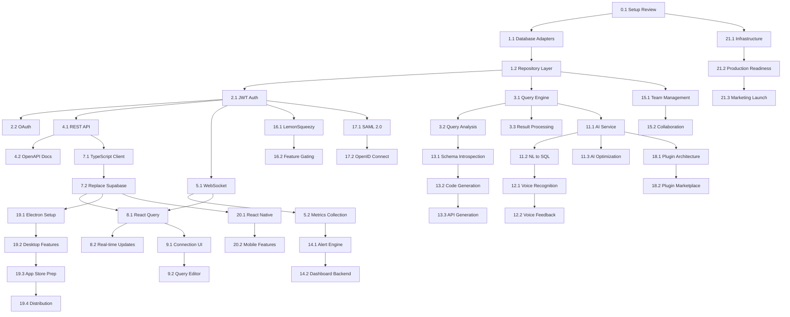

# QueryFlux Comprehensive Implementation Plan

## Executive Summary

QueryFlux is transforming from a UI-only prototype (~30% complete) into a fully functional AI-powered database management platform. This plan prioritizes **backend implementation as the critical path** while leveraging the existing 85% complete frontend.

### Current State:
- **Frontend**: 85% complete - React components exist, connected to Supabase mock
- **Backend**: 25% complete - Structure exists, minimal implementation
- **Database**: 15% complete - Schema ready, no real connectivity
- **Testing**: 15% coverage - Target: 100%

### Timeline: 14-16 months to production-ready platform

## Critical Path Analysis

The critical path consists of:
1. **Go Backend Foundation** (Weeks 1-8) - BLOCKS ALL OTHER DEVELOPMENT
2. **Database Adapter Implementation** (Weeks 3-10) - CORE VALUE PROPOSITION
3. **Frontend-Backend Integration** (Weeks 9-11) - MAKES APP FUNCTIONAL
4. **Query Execution Engine** (Weeks 8-12) - PRIMARY USER VALUE

All other tasks can run in parallel once the foundation is complete.

## Phase-Based Implementation Plan

### **PHASE 0: PREPARATION (Week 0)**
**Effort**: 2 days | **Priority**: P0

#### Task 0.1: Project Setup Review
- [ ] Review existing Go project structure
- [ ] Set up comprehensive test framework
- [ ] Configure CI/CD for automated testing
- [ ] Establish development standards
- **Dependencies**: None
- **Deliverable**: Ready-to-code development environment

---

## **PHASE 1: BACKEND FOUNDATION (Weeks 1-8)**
**Goal**: Fully functional Go backend with real database operations

### **Week 1: Core Architecture (P0)**
**Effort**: Critical path - 5 days

#### Task 1.1: Database Adapter Pattern 🔴
- [ ] Base DatabaseAdapter interface with methods:
  - Connect(ctx, config) error
  - ExecuteQuery(ctx, query, params) (Result, error)
  - GetSchema(ctx) ([]Table, error)
  - TestConnection(ctx) error
  - Close() error
- [ ] PostgreSQL adapter using pgx with connection pooling
- [ ] MySQL adapter using go-sql-driver
- [ ] MongoDB adapter using mongo-driver
- [ ] Redis adapter using go-redis
- **Dependencies**: Task 0.1
- **Effort**: 3 days
- **Acceptance**: All adapters connect and execute basic queries

#### Task 1.2: Repository Layer 🔴
- [ ] ConnectionRepository with user-scoped queries
- [ ] UserRepository with authentication methods
- [ ] QueryRepository with history tracking
- [ ] TeamRepository with permission management
- **Dependencies**: Task 1.1
- **Effort**: 2 days
- **Acceptance**: Full CRUD operations with tests

### **Week 2: Authentication System (P0)**
**Effort**: Critical path - 5 days

#### Task 2.1: JWT Authentication 🔴
- [ ] Token generation with RS256 keys
- [ ] Middleware for route protection
- [ ] Refresh token mechanism
- [ ] Password hashing with bcrypt
- [ ] Rate limiting for auth endpoints
- **Dependencies**: Task 1.2
- **Effort**: 3 days

#### Task 2.2: OAuth Integration 🟡
- [ ] Google OAuth 2.0 provider
- [ ] GitHub OAuth provider
- [ ] User profile mapping
- **Dependencies**: Task 2.1
- **Effort**: 2 days

### **Week 3-4: Query Engine (P0)**
**Effort**: Critical path - 10 days

#### Task 3.1: Query Execution Service 🔴
- [ ] Multi-database query execution
- [ ] Parameterized queries (SQL injection prevention)
- [ ] Query timeout and cancellation
- [ ] Transaction management
- [ ] Result streaming for large datasets
- **Dependencies**: Task 1.1
- **Effort**: 5 days

#### Task 3.2: Query Analysis 🟡
- [ ] EXPLAIN plan parsing
- [ ] Performance metrics collection
- [ ] Slow query detection
- **Dependencies**: Task 3.1
- **Effort**: 3 days

#### Task 3.3: Result Processing 🟡
- [ ] Type conversion and formatting
- [ ] Pagination support
- [ ] Export capabilities (JSON, CSV, Excel)
- **Dependencies**: Task 3.1
- **Effort**: 2 days

### **Week 5: HTTP API Layer (P0)**
**Effort**: Critical path - 5 days

#### Task 4.1: REST API Implementation 🔴
- [ ] Authentication endpoints (/api/v1/auth/*)
- [ ] Connection endpoints (/api/v1/connections/*)
- [ ] Query endpoints (/api/v1/queries/*)
- [ ] Error handling middleware
- [ ] Request validation
- **Dependencies**: Tasks 2.1, 3.1
- **Effort**: 3 days

#### Task 4.2: Documentation & OpenAPI 🟡
- [ ] OpenAPI 3.0 specification
- [ ] Swagger UI integration
- [ ] Postman collection
- **Dependencies**: Task 4.1
- **Effort**: 2 days

### **Week 6: Real-time Infrastructure (P1)**
**Effort**: 5 days | **Can run in parallel with Week 7-8 tasks**

#### Task 5.1: WebSocket System 🟡
- [ ] WebSocket hub for client management
- [ ] Room-based communication
- [ ] Authentication for WebSocket connections
- [ ] Message broadcasting
- **Dependencies**: Task 2.1
- **Effort**: 3 days

#### Task 5.2: Metrics Collection 🟡
- [ ] Database metrics gathering
- [ ] Time-series storage setup
- [ ] Real-time aggregation
- **Dependencies**: Task 5.1
- **Effort**: 2 days

### **Week 7-8: Testing & Quality (P0)**
**Effort**: Critical path - 10 days

#### Task 6.1: Comprehensive Testing 🔴
- [ ] Unit tests for all services (>95% coverage)
- [ ] Integration tests for database adapters
- [ ] API endpoint tests
- [ ] Load testing setup
- **Dependencies**: All previous tasks
- **Effort**: 5 days

#### Task 6.2: Security Hardening 🔴
- [ ] Input validation
- [ ] SQL injection prevention testing
- [ ] Rate limiting implementation
- [ ] Security headers configuration
- **Dependencies**: Task 6.1
- **Effort**: 3 days

#### Task 6.3: Performance Optimization 🔴
- [ ] Database query optimization
- [ ] Connection pool tuning
- [ ] Caching layer implementation
- **Dependencies**: Task 6.2
- **Effort**: 2 days

**PHASE 1 COMPLETE**: Backend is production-ready for core functionality

---

## **PHASE 2: FRONTEND INTEGRATION (Weeks 9-12)**
**Goal**: Connect React frontend to Go backend

### **Week 9: API Integration (P0)**
**Effort**: Critical path - 5 days

#### Task 7.1: TypeScript API Client 🔴
- [ ] Auto-generated types from OpenAPI spec
- [ ] Axios-based API client
- [ ] Token management
- [ ] Error handling
- **Dependencies**: Task 4.2
- **Effort**: 2 days

#### Task 7.2: Replace Supabase Calls 🔴
- [ ] Update all components to use Go API
- [ ] Migration scripts for existing data
- [ ] Authentication flow integration
- **Dependencies**: Task 7.1
- **Effort**: 3 days

### **Week 10: State Management (P0)**
**Effort**: Critical path - 5 days

#### Task 8.1: React Query Integration 🔴
- [ ] Server state management
- [ ] Caching configuration
- [ ] Error boundaries
- [ ] Loading states
- **Dependencies**: Task 7.2
- **Effort**: 2 days

#### Task 8.2: Real-time Updates 🟡
- [ ] WebSocket client integration
- [ ] Live query results
- [ ] Notification system
- **Dependencies**: Tasks 5.1, 8.1
- **Effort**: 3 days

### **Week 11: Feature Integration (P0)**
**Effort**: Critical path - 5 days

#### Task 9.1: Database Connections UI 🔴
- [ ] Connect to real backend endpoints
- [ ] Connection testing
- [ ] Error messaging
- **Dependencies**: Task 8.1
- **Effort**: 2 days

#### Task 9.2: Query Editor Integration 🔴
- [ ] Real query execution
- [ ] Results display
- [ ] History management
- **Dependencies**: Task 9.1
- **Effort**: 3 days

### **Week 12: Testing & Polish (P0)**
**Effort**: Critical path - 5 days

#### Task 10.1: E2E Testing 🔴
- [ ] Critical user journey tests
- [ ] Cross-browser testing
- [ ] Mobile responsiveness
- **Dependencies**: Task 9.2
- **Effort**: 3 days

#### Task 10.2: Performance & Optimization 🔴
- [ ] Bundle optimization
- [ ] Lazy loading
- [ ] Memory leak fixes
- **Dependencies**: Task 10.1
- **Effort**: 2 days

**PHASE 2 COMPLETE**: Full-stack application functional

---

## **PHASE 3: AI & ADVANCED FEATURES (Weeks 13-20)**
**Can start tasks in parallel once Phase 1 is complete**

### **Week 13-14: AI Integration (P1)**
**Effort**: 10 days

#### Task 11.1: AI Service Infrastructure 🟡
- [ ] OpenAI/Claude API integration
- [ ] Context management
- [ ] Rate limiting
- [ ] Cost tracking
- **Dependencies**: Phase 1 complete
- **Effort**: 4 days

#### Task 11.2: Natural Language to SQL 🟡
- [ ] Schema-aware query generation
- [ ] Multiple dialect support
- [ ] Confidence scoring
- **Dependencies**: Task 11.1
- **Effort**: 4 days

#### Task 11.3: Query Optimization AI 🟡
- [ ] Performance analysis
- [ ] Index recommendations
- **Dependencies**: Task 11.1
- **Effort**: 2 days

### **Week 15-16: Voice Features (P2)**
**Effort**: 10 days

#### Task 12.1: Voice Recognition 🟢
- [ ] Web Speech API integration
- [ ] Command parsing
- [ ] Custom commands
- **Dependencies**: Task 11.2
- **Effort**: 5 days

#### Task 12.2: Voice Feedback 🟢
- [ ] Text-to-s responses
- [ ] Confirmation system
- **Dependencies**: Task 12.1
- **Effort**: 5 days

### **Week 17-18: Code Generation (P2)**
**Effort**: 10 days

#### Task 13.1: Schema Introspection 🟢
- [ ] Database schema extraction
- [ ] Relationship mapping
- **Dependencies**: Task 3.2
- **Effort**: 3 days

#### Task 13.2: Multi-language Code Gen 🟢
- [ ] TypeScript models
- [ ] Python SQLAlchemy
- [ ] Go GORM
- [ ] Java JPA
- **Dependencies**: Task 13.1
- **Effort**: 4 days

#### Task 13.3: REST API Generation 🟢
- [ ] Express.js endpoints
- [ ] Go Gin handlers
- [ ] Django views
- **Dependencies**: Task 13.2
- **Effort**: 3 days

### **Week 19-20: Monitoring & Alerting (P1)**
**Effort**: 10 days

#### Task 14.1: Alert Engine 🟡
- [ ] Rule management
- [ ] Notification channels (email, webhook, Slack)
- [ ] Escalation rules
- **Dependencies**: Task 5.2
- **Effort**: 5 days

#### Task 14.2: Dashboard Backend 🟡
- [ ] Metrics aggregation
- [ ] Performance baselines
- [ ] Anomaly detection
- **Dependencies**: Task 14.1
- **Effort**: 5 days

**PHASE 3 COMPLETE**: Advanced features implemented

---

## **PHASE 4: ENTERPRISE FEATURES (Weeks 21-28)**

### **Week 21-22: Team Features (P1)**
**Effort**: 10 days

#### Task 15.1: Team Management 🟡
- [ ] Team creation and invitations
- [ ] Role-based permissions
- [ ] Shared resources
- **Dependencies**: Task 1.2
- **Effort**: 5 days

#### Task 15.2: Collaboration Features 🟡
- [ ] Real-time collaboration
- [ ] Activity feeds
- [ ] Conflict resolution
- **Dependencies**: Task 15.1, Task 5.1
- **Effort**: 5 days

### **Week 23-24: Payments (P1)**
**Effort**: 10 days

#### Task 16.1: LemonSqueezy Integration 🟡
- [ ] Checkout flow
- [ ] Subscription management
- [ ] Webhook handling
- **Dependencies**: Task 2.1
- **Effort**: 5 days

#### Task 16.2: Feature Gating 🟡
- [ ] Plan-based access control
- [ ] Usage tracking
- **Dependencies**: Task 16.1
- **Effort**: 5 days

### **Week 25-26: SSO Authentication (P1)**
**Effort**: 10 days

#### Task 17.1: SAML 2.0 Support 🟡
- [ ] Identity provider integration
- [ ] User provisioning
- **Dependencies**: Task 2.1
- **Effort**: 5 days

#### Task 17.2: OpenID Connect 🟡
- [ ] Azure AD, Okta integration
- **Dependencies**: Task 17.1
- **Effort**: 5 days

### **Week 27-28: Plugin System (P2)**
**Effort**: 10 days

#### Task 18.1: Plugin Architecture 🟢
- [ ] Plugin SDK
- [ ] Sandboxed execution
- **Dependencies**: Task 11.1
- **Effort**: 5 days

#### Task 18.2: Plugin Marketplace 🟢
- [ ] Registry management
- [ ] Installation system
- **Dependencies**: Task 18.1
- **Effort**: 5 days

---

## **PHASE 5: DESKTOP & MOBILE (Weeks 29-40)**

### **Week 29-32: Electron Desktop App (P1)**
**Effort**: 20 days

#### Task 19.1: Electron Setup 🟡
- [ ] Electron + Vite configuration
- [ ] IPC communication
- [ ] Native database drivers
- **Dependencies**: Phase 2 complete
- **Effort**: 5 days

#### Task 19.2: Desktop Features 🟡
- [ ] Native menus
- [ ] File dialogs
- [ ] System notifications
- **Dependencies**: Task 19.1
- **Effort**: 5 days

#### Task 19.3: App Store Prep 🟡
- [ ] Code signing
- [ ] Metadata
- **Dependencies**: Task 19.2
- **Effort**: 5 days

#### Task 19.4: Distribution 🟡
- [ ] Build automation
- [ ] Update mechanism
- **Dependencies**: Task 19.3
- **Effort**: 5 days

### **Week 33-36: Mobile App (P2)**
**Effort**: 20 days

#### Task 20.1: React Native App 🟢
- [ ] App structure
- [ ] Authentication
- **Dependencies**: Phase 2 complete
- **Effort**: 10 days

#### Task 20.2: Mobile Features 🟢
- [ ] Dashboard view
- [ ] Push notifications
- **Dependencies**: Task 20.1
- **Effort**: 10 days

### **Week 37-40: Production Deployment (P0)**
**Effort**: Critical path - 20 days

#### Task 21.1: Infrastructure Setup 🔴
- [ ] Kubernetes deployment
- [ ] Database clustering
- [ ] CI/CD pipeline
- **Dependencies**: Phase 1 complete (can start after Week 8)
- **Effort**: 10 days

#### Task 21.2: Production Readiness 🔴
- [ ] Performance testing
- [ ] Security audit
- [ ] Backup systems
- **Dependencies**: Task 21.1
- **Effort**: 5 days

#### Task 21.3: Marketing & Launch 🔴
- [ ] Website deployment
- [ ] Documentation
- **Dependencies**: Task 21.2
- **Effort**: 5 days

---

## Task Dependency Map

## Parallel Execution Opportunities

1. **After Week 8** (Backend complete):
   - AI features (Week 13-20) can be developed in parallel with:
   - Team features (Week 21-22)
   - Desktop app (Week 29-32)
   - Infrastructure setup (Task 21.1)

2. **After Week 12** (Full-stack complete):
   - All advanced features can be developed in parallel
   - Multiple teams can work on different tracks

## Risk Mitigation Strategy

### Technical Risks:
1. **Database Adapter Complexity**
   - Start with PostgreSQL only (Week 1)
   - Add MySQL, MongoDB after foundation works
   - Implement adapter pattern properly from start

2. **Performance Bottlenecks**
   - Implement connection pooling from Day 1
   - Add monitoring early (Week 6)
   - Regular load testing (Every 2 weeks)

3. **AI API Costs**
   - Implement caching before AI integration
   - Set strict rate limits
   - Create offline fallback

### Project Risks:
1. **Scope Creep**
   - Focus on MVP: Connect + Query + Basic UI
   - Defer nice-to-have features
   - Regular stakeholder reviews

2. **Timeline Delays**
   - Buffer time built into each phase
   - Parallel task execution
   - Clear prioritization (P0, P1, P2, P3)

## Success Metrics

### Phase 1 Success (Week 8):
- [ ] PostgreSQL, MySQL, MongoDB connections working
- [ ] Auth system complete with JWT
- [ ] Query execution engine operational
- [ ] REST API documented and tested
- [ ] 95%+ test coverage

### Phase 2 Success (Week 12):
- [ ] Full-stack app functional
- [ ] Real queries executing in UI
- [ ] Real-time features working
- [ ] E2E tests passing
- [ ] Performance benchmarks met

### Phase 3 Success (Week 20):
- [ ] AI features integrated
- [ ] Voice commands working
- [ ] Code generation functional
- [ ] Monitoring dashboard active

### Phase 4 Success (Week 28):
- [ ] Team collaboration working
- [ ] Payments and subscriptions active
- [ ] SSO authentication working
- [ ] Plugin system functional

### Phase 5 Success (Week 40):
- [ ] Desktop apps in app stores
- [ ] Mobile apps deployed
- [ ] Production infrastructure stable
- [ ] Marketing site live
- [ ] First paying customers onboarded

## Immediate Next Steps (This Week)

1. **Day 1-2**: Complete Task 0.1 - Setup review and test framework
2. **Day 3-5**: Start Task 1.1 - Database adapters (PostgreSQL first)
3. **Weekend**: Review and adjust plan based on progress

## Team Allocation Recommendations

- **Backend Developer (Primary)**: Tasks 1.1-6.3 (Phase 1)
- **Frontend Developer**: Tasks 7.1-10.2 (Phase 2)
- **AI/ML Engineer**: Tasks 11.1-12.2 (Phase 3)
- **DevOps Engineer**: Task 21.1-21.3 (Can start early)
- **QA Engineer**: Integration testing throughout all phases

## Conclusion

This plan prioritizes getting a functional product as quickly as possible by:
1. **Focusing on the critical path** - Backend implementation blocks everything else
2. **Parallelizing non-dependent tasks** - Advanced features can be developed together
3. **Maintaining quality from day one** - 100% test coverage requirement
4. **Regular delivery of value** - Each phase delivers usable functionality

The key is to have a **fully functional database management tool by Week 12** (Phase 2 complete), then incrementally add advanced features while preparing for production deployment.