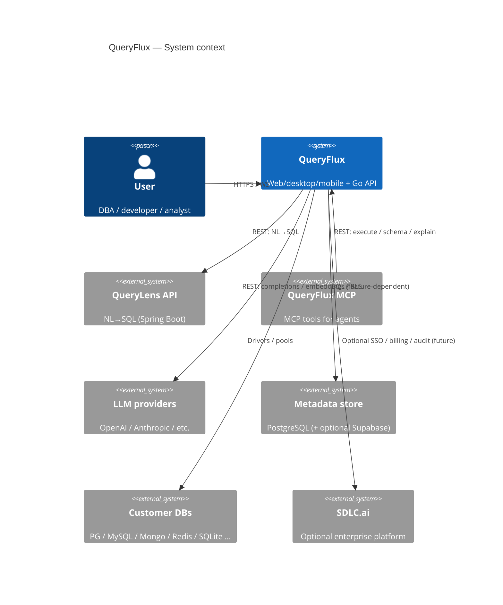
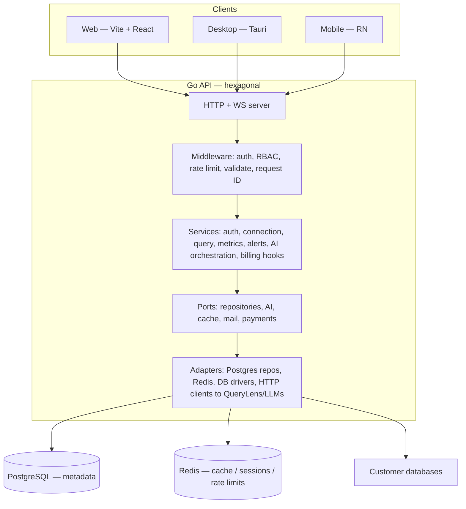

# QueryFlux — Technical Design Specification

**Generated**: 2026-04-21  
**Requirements sources**: `queryflux/.luna/queryflux/requirements.md`, `../../.luna/data-intelligence/requirements.md`  
**Status**: Ready for `/luna-plan` (implementation task breakdown)

---

## 1. Executive Summary

QueryFlux is an AI-assisted database management platform: React web UI (and Tauri desktop / React Native mobile in-repo), a Go API with hexagonal layout, optional Supabase-style metadata, and integrations with **QueryLens** (NL→SQL), **QueryFlux MCP Server** (agent tools), and **SDLC.ai** (separate enterprise stack). This design defines system boundaries, core components, data ownership, APIs, cross-service contracts, and implementation rules aligned with portfolio quality gates (security, coverage, file-size discipline).

---

## 2. Goals and Non-Goals

### 2.1 Goals

- **G1**: Single coherent **auth + RBAC** model across REST and WebSocket surfaces.
- **G2**: **Connection registry** with encrypted secrets, health, and per-engine adapters (PostgreSQL, MySQL, MongoDB, Redis, SQLite first).
- **G3**: **Safe query execution**: timeouts, cancellation, row limits, typed errors, audit trail.
- **G4**: **AI-assisted flows** (NL→SQL, explain, voice) with explicit confidence, user review before execute, and cost/rate limits.
- **G5**: **Observability**: structured logs, metrics, trace IDs, correlation across QueryFlux ↔ QueryLens ↔ MCP.

### 2.2 Non-Goals (this iteration)

- Full parity for 35+ database engines before MVP adapters ship.
- Replacing SDLC.ai’s gateway/RAG/vector stack inside QueryFlux (integration only).
- Full marketing-site CMS; treat as separate deployable.

---

## 3. System Context (C4 Level 1)

---

## 4. Logical Architecture (C4 Level 2)

### 4.1 QueryFlux application

### 4.2 Cross-product integration

| Integration | Direction | Protocol | Purpose |
|-------------|-----------|----------|---------|
| QueryLens | QueryFlux → QueryLens | HTTPS JSON | NL→SQL, schema-aware prompts |
| MCP | MCP → QueryFlux | HTTPS JSON | Agent-executed tools backed by same execution layer |
| SDLC.ai | Future / optional | HTTPS | Enterprise auth, billing, shared audit (explicit contracts only) |

**Rule**: QueryLens and MCP must not hold customer DB credentials; they receive **connection IDs** or **ephemeral scoped tokens** issued by QueryFlux after authorization.

---

## 5. Component Specifications

### 5.1 Client (React)

| Area | Responsibility | Tech |
|------|----------------|------|
| Routing & layout | Auth gates, nav, error boundaries | React Router |
| Server state | Queries/mutations, caching | TanStack Query |
| Client state | UI, selections, editor tabs | Zustand |
| API client | Typed requests, interceptors (tokens, trace ID) | Axios + Zod |
| Query editor | SQL editing, run/cancel, results grid | Textarea/Monaco (as implemented) |
| AI panels | NL bar, voice, masking UI | Feature modules |

**Contract**: All API errors map to a small union: `UNAUTHORIZED`, `FORBIDDEN`, `VALIDATION`, `NOT_FOUND`, `RATE_LIMIT`, `UPSTREAM`, `QUERY_FAILED`, `INTERNAL`.

### 5.2 Go API — layers

| Layer | Contents |
|-------|----------|
| `cmd/server` | Composition root, wiring, graceful shutdown |
| `internal/config` | Env, secrets, feature flags |
| `internal/domain` | Entities, value objects, invariants |
| `internal/port` | Interfaces only |
| `internal/services` | Use cases; no direct driver calls |
| `internal/infrastructure` / `internal/adapters` | DB, Redis, HTTP, WS, OAuth, AI |
| `internal/server` | Routes, handlers, WS hub |

### 5.3 Database engine abstraction

**Port**: `DatabaseEngine` (conceptual) with operations: connect, ping, execute (with limits), cancel, schema snapshot, explain (where supported).

**Adapters**: One package per family (SQL PG/MySQL, Mongo, Redis, SQLite), mapping connection DTO → driver config, TLS, pool settings.

**Policies**:

- Max rows per request (default + plan override).
- Statement timeout per request.
- Optional read-only mode per connection or role.

### 5.4 WebSocket hub

- **Channels**: per-user notifications, optional collaboration rooms (if enabled).
- **Backpressure**: drop/slow client updates under load; never block query execution path.

### 5.5 AI orchestration service

- **Inputs**: user intent, schema snippet, dialect, safety mode.
- **Outputs**: SQL draft, confidence, explanation, suggested edits.
- **Guards**: PII redaction in logs; no secrets in prompts; token budget per tier.

### 5.6 QueryLens API (external)

- Stateless REST: `POST /api/v1/nlp/query` with `question` + `schema` (and optional metadata).
- QueryFlux sends **trimmed schema** (tables/columns relevant to context), not full dumps by default.

### 5.7 QueryFlux MCP Server (external)

- Tools call QueryFlux HTTP API with service credentials or user-delegated token.
- Same execution and RBAC paths as UI; **dry-run** and **max rows** enforced server-side.

---

## 6. Data Model (Metadata)

### 6.1 Core entities (logical)

| Entity | Key fields | Notes |
|--------|------------|-------|
| `User` | id, email, status, created_at | Auth identity |
| `UserProfile` | display, preferences | Optional split |
| `Role` / `Membership` | team_id, user_id, role | RBAC |
| `Team` | id, name, plan | Collaboration |
| `Project` | id, team_id | Grouping connections |
| `Connection` | id, team_id, type, name, encrypted_config, health | Customer DB |
| `QueryRecord` | id, connection_id, sql_hash, status, duration_ms, row_count | History |
| `AlertRule` / `Alert` | thresholds, state | Monitoring |
| `Subscription` | plan, status, provider ids | Billing |
| `AuditLog` | actor, action, resource, payload hash | Compliance |

### 6.2 Relationships

- User **N:M** Team via membership; Connection belongs to **Team** (and optionally **Project**).
- Query history references **Connection** and **User**.

### 6.3 Secrets

- Store **encrypted** connection strings / keys; encryption keys from KMS or env (rotation documented).
- Never log raw credentials or full SQL with secrets.

---

## 7. API Design (QueryFlux)

### 7.1 Conventions

- **Base path**: `/api/v1`
- **Auth**: `Authorization: Bearer <access>`; refresh flow for long sessions
- **Idempotency**: optional `Idempotency-Key` for billing-sensitive mutations
- **Pagination**: `cursor` or `page` + `limit` for list endpoints
- **Tracing**: `X-Request-Id` echoed in responses

### 7.2 Endpoint groups (representative)

| Group | Examples | Notes |
|-------|----------|-------|
| Health | `GET /health` | Liveness |
| Auth | `POST /auth/register`, `POST /auth/login`, `POST /auth/refresh`, `POST /auth/logout` | Rate limited |
| Users | `GET/PUT /users/profile` | |
| Connections | `GET/POST /connections`, `GET/PUT/DELETE /connections/:id`, `POST /connections/:id/test` | RBAC |
| Queries | `POST /queries` (execute), `GET /queries/history`, `GET/DELETE /queries/:id` | Limits |
| Metrics | `GET /metrics/connections/:id`, `GET .../history` | |
| Alerts | `GET /alerts`, resolve/mute | |
| AI | internal or `/ai/*` routes as implemented | Proxy to providers + QueryLens |

**OpenAPI**: Single source generated or maintained under `docs/api/`; CI diff on PRs.

---

## 8. Security Architecture

### 8.1 Threat model (summary)

| Threat | Mitigation |
|--------|------------|
| Stolen JWT | Short TTL, refresh rotation, optional token blacklist (Redis) |
| IDOR on connections/queries | Server-side RBAC + resource ownership checks |
| SQL injection | Parameterized queries; no string concat for user SQL in adapters |
| Prompt injection → bad SQL | Schema-only context, validation pass, user confirm |
| MCP abuse | Scoped tokens, tool allowlists, audit logs |

### 8.2 Compliance hooks

- Audit log for auth, connection changes, query execution (configurable retention).
- Data export/delete requests pluggable via user service (enterprise roadmap).

---

## 9. Observability

- **Logs**: JSON, levels, **no PII/secrets**; `request_id`, `user_id`, `team_id` where safe.
- **Metrics**: RPS, latency histograms, pool usage, query failures, AI token usage.
- **Tracing**: W3C trace context propagation to QueryLens and LLM calls where supported.

---

## 10. Deployment Topology

| Environment | Notes |
|-------------|------|
| Local | `docker-compose` for Postgres, Redis, sample DBs; Vite + Go run |
| Staging | TLS, secrets manager, reduced quotas |
| Production | HA Postgres, Redis cluster, WAF, autoscaling API nodes |

**Desktop (Tauri)**: bundles web assets; same API base URL; secure credential storage via OS APIs.

---

## 11. Technology Stack (authoritative for this repo)

| Area | Choice |
|------|--------|
| Web UI | React 19, TypeScript, Vite, Tailwind, Radix |
| API | Go, modular monolith |
| Metadata DB | PostgreSQL |
| Cache | Redis |
| NL→SQL | QueryLens API (Java/Spring) |
| Agents | QueryFlux MCP (TypeScript) |
| Tests | Vitest + Playwright (web); Go test + integration; Maven (QueryLens) |

---

## 12. Implementation Guidelines

1. **File size**: Keep production source files ≤ **200 lines** where the repo enforces it; split by feature (handlers vs service vs dto).
2. **Typing**: Strict TypeScript; Go interfaces at ports; validate inputs with **Zod** / Go validators.
3. **Testing**: Minimum **90%** line / **85%** branch overall; **100%** on auth, payments, permissions, and security controls.
4. **Feature flags**: Gate AI and enterprise integrations for safe rollout.
5. **Migrations**: Versioned SQL migrations for metadata; reversible where possible.

---

## 13. Phased Delivery (maps to requirements)

| Phase | Focus | Exit criteria |
|-------|--------|----------------|
| P0 | Auth, connections, query execution, audit baseline | E2E happy path on real PG + MySQL |
| P1 | QueryLens + AI orchestration + MCP hardening | NL→SQL with review; MCP tools pass safety suite |
| P2 | Teams, monitoring, billing hooks | RBAC stories; metrics real; plan gates |
| P3 | Enterprise polish | SSO, compliance exports, SLO dashboards |

---

## 14. Open Design Decisions

1. **Metadata**: Supabase-only vs self-hosted Postgres for production (pick one per deployment).
2. **QueryLens hosting**: same VPC vs separate service; define SLA and fallback behavior.
3. **Collaboration**: CRDT vs last-write-wins for shared editor (if shipped).

---

## 15. Next Step

Run **`/luna-plan`** to derive ordered implementation tasks, dependencies, and verification steps from this design and the requirements checklists.
