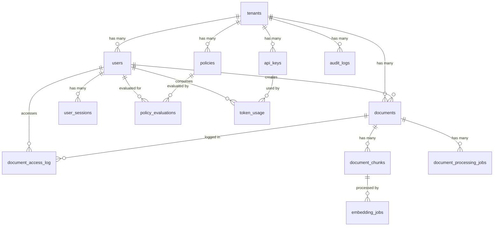

# Database Schema Reference

## Table Relationships



## Table Definitions

### tenants

**Purpose**: Multi-tenant organization management

| Column | Type | Description | Constraints |
|--------|------|-------------|-------------|
| id | UUID | Primary key | PRIMARY KEY DEFAULT uuid_generate_v4() |
| name | VARCHAR(255) | Tenant name | NOT NULL |
| domain | VARCHAR(255) | Unique domain identifier | UNIQUE NOT NULL |
| status | tenant_status | Current status | NOT NULL DEFAULT 'trial' |
| config | JSONB | Tenant configuration | NOT NULL DEFAULT '{}' |
| settings | JSONB | Tenant settings | NOT NULL DEFAULT '{}' |
| subscription_tier | VARCHAR(50) | Subscription level | NOT NULL DEFAULT 'basic' |
| data_region | VARCHAR(50) | Geographic region | NOT NULL DEFAULT 'us-east-1' |
| contact_email | VARCHAR(255) | Contact information | |
| billing_info | JSONB | Billing information | NOT NULL DEFAULT '{}' |
| created_at | TIMESTAMPTZ | Creation timestamp | DEFAULT NOW() |
| updated_at | TIMESTAMPTZ | Last update timestamp | DEFAULT NOW() |
| metadata | JSONB | Additional metadata | NOT NULL DEFAULT '{}' |
| retention_policy | JSONB | Data retention rules | NOT NULL DEFAULT |
| resource_limits | JSONB | Resource quotas | NOT NULL DEFAULT |
| compliance_requirements | JSONB | Compliance frameworks | NOT NULL DEFAULT |

**Indexes**:
- `idx_tenants_domain` (domain)
- `idx_tenants_status` (status)
- `idx_tenants_subscription_tier` (subscription_tier)
- `idx_tenants_created_at` (created_at)

**Enums**:
```sql
CREATE TYPE tenant_status AS ENUM ('active', 'suspended', 'trial', 'deleted');
```

---

### users

**Purpose**: User authentication and authorization

| Column | Type | Description | Constraints |
|--------|------|-------------|-------------|
| id | UUID | Primary key | PRIMARY KEY DEFAULT uuid_generate_v4() |
| tenant_id | UUID | Foreign key to tenants | NOT NULL REFERENCES tenants(id) ON DELETE CASCADE |
| email | VARCHAR(255) | User email address | NOT NULL |
| encrypted_password | BYTEA | Encrypted password | NOT NULL |
| password_hash | VARCHAR(255) | Bcrypt password hash | NOT NULL |
| role | user_role | User role | NOT NULL DEFAULT 'user' |
| permissions | JSONB | User permissions | NOT NULL DEFAULT '[]' |
| metadata | JSONB | User metadata | NOT NULL DEFAULT '{}' |
| created_at | TIMESTAMPTZ | Creation timestamp | DEFAULT NOW() |
| updated_at | TIMESTAMPTZ | Last update timestamp | DEFAULT NOW() |
| last_login | TIMESTAMPTZ | Last login time | |
| is_active | BOOLEAN | Account status | DEFAULT true |
| mfa_enabled | BOOLEAN | MFA enabled | DEFAULT false |
| mfa_secret | BYTEA | MFA secret key | |
| email_verified | BOOLEAN | Email verification status | DEFAULT false |
| phone_number | VARCHAR(20) | Phone number | |
| phone_verified | BOOLEAN | Phone verification status | DEFAULT false |
| failed_login_attempts | INTEGER | Failed login count | DEFAULT 0 |
| locked_until | TIMESTAMPTZ | Account lock expiration | |
| profile | JSONB | User profile information | NOT NULL DEFAULT '{}' |
| preferences | JSONB | User preferences | NOT NULL DEFAULT '{}' |

**Constraints**:
- `UNIQUE(tenant_id, email)` - Email unique within tenant
- `CHK_USER_EMAIL` - Email format validation
- `CHK_FAILED_ATTEMPTS` - Non-negative failed attempts

**Indexes**:
- `idx_users_tenant_id` (tenant_id)
- `idx_users_email` (email)
- `idx_users_tenant_email` (tenant_id, email)
- `idx_users_role` (role)
- `idx_users_is_active` (is_active)
- `idx_users_created_at` (created_at)
- `idx_users_last_login` (last_login)

**Enums**:
```sql
CREATE TYPE user_role AS ENUM (
    'super_admin', 
    'tenant_admin', 
    'data_scientist', 
    'analyst', 
    'viewer', 
    'user'
);
```

---

### documents

**Purpose**: Document metadata and storage tracking

| Column | Type | Description | Constraints |
|--------|------|-------------|-------------|
| id | UUID | Primary key | PRIMARY KEY DEFAULT uuid_generate_v4() |
| tenant_id | UUID | Foreign key to tenants | NOT NULL REFERENCES tenants(id) ON DELETE CASCADE |
| filename | VARCHAR(1000) | System filename | NOT NULL |
| original_filename | VARCHAR(1000) | Original filename | NOT NULL |
| content_type | VARCHAR(255) | MIME content type | NOT NULL |
| file_size | BIGINT | File size in bytes | NOT NULL |
| checksum | VARCHAR(64) | SHA-256 checksum | NOT NULL |
| storage_path | VARCHAR(1000) | Storage location | NOT NULL |
| storage_bucket | VARCHAR(255) | Storage bucket | NOT NULL |
| storage_provider | VARCHAR(50) | Storage provider | NOT NULL DEFAULT 'r2' |
| metadata | JSONB | Document metadata | NOT NULL DEFAULT '{}' |
| extraction_status | document_status | Text extraction status | NOT NULL DEFAULT 'pending' |
| processing_status | document_status | Processing status | NOT NULL DEFAULT 'pending' |
| dlp_status | document_status | DLP scan status | NOT NULL DEFAULT 'pending' |
| created_at | TIMESTAMPTZ | Creation timestamp | DEFAULT NOW() |
| updated_at | TIMESTAMPTZ | Last update timestamp | DEFAULT NOW() |
| created_by | UUID | Creator user ID | NOT NULL REFERENCES users(id) |
| encryption_key_id | VARCHAR(255) | Encryption key identifier | |
| encryption_algorithm | encryption_algorithm | Encryption method | DEFAULT 'aes-256-gcm' |
| retention_policy | JSONB | Retention rules | NOT NULL DEFAULT '{}' |
| access_level | VARCHAR(50) | Access level | NOT NULL DEFAULT 'private' |
| tags | JSONB | Document tags | NOT NULL DEFAULT '[]' |
| classification | data_classification | Data classification | NOT NULL DEFAULT 'internal' |
| content_hash | VARCHAR(64) | Content checksum | |
| language | VARCHAR(10) | Document language | DEFAULT 'en' |
| processing_duration_ms | INTEGER | Processing time | |

**Constraints**:
- `CHK_FILE_SIZE` - Positive file size

**Indexes**:
- `idx_documents_tenant_id` (tenant_id)
- `idx_documents_created_by` (created_by)
- `idx_documents_content_type` (content_type)
- `idx_documents_extraction_status` (extraction_status)
- `idx_documents_processing_status` (processing_status)
- `idx_documents_dlp_status` (dlp_status)
- `idx_documents_created_at` (created_at)
- `idx_documents_classification` (classification)
- `idx_documents_access_level` (access_level)
- `idx_documents_checksum` (checksum)
- `idx_documents_content_hash` (content_hash)

---

### document_chunks

**Purpose**: Text chunks for RAG processing with vector embeddings

| Column | Type | Description | Constraints |
|--------|------|-------------|-------------|
| id | UUID | Primary key | PRIMARY KEY DEFAULT uuid_generate_v4() |
| document_id | UUID | Foreign key to documents | NOT NULL REFERENCES documents(id) ON DELETE CASCADE |
| tenant_id | UUID | Foreign key to tenants | NOT NULL REFERENCES tenants(id) ON DELETE CASCADE |
| chunk_index | INTEGER | Chunk order within document | NOT NULL |
| content | TEXT | Chunk text content | NOT NULL |
| content_length | INTEGER | Content length in characters | NOT NULL |
| chunk_type | VARCHAR(50) | Type of chunk content | NOT NULL DEFAULT 'text' |
| embedding_model | VARCHAR(100) | Embedding model used | |
| embedding_dimensions | INTEGER | Vector dimensions | |
| embedding | VECTOR(1536) | Vector embedding | |
| embedding_status | document_status | Embedding processing status | NOT NULL DEFAULT 'pending' |
| metadata | JSONB | Chunk metadata | NOT NULL DEFAULT '{}' |
| created_at | TIMESTAMPTZ | Creation timestamp | DEFAULT NOW() |
| updated_at | TIMESTAMPTZ | Last update timestamp | DEFAULT NOW() |
| processing_time_ms | INTEGER | Processing time | |
| checksum | VARCHAR(64) | Content checksum | NOT NULL |
| token_count | INTEGER | Estimated token count | |
| source_page_number | INTEGER | Source page number | |
| source_section | VARCHAR(255) | Source section name | |
| language | VARCHAR(10) | Content language | DEFAULT 'en' |

**Constraints**:
- `CHK_CONTENT_LENGTH` - Positive content length
- `CHK_CHUNK_INDEX` - Non-negative chunk index

**Indexes**:
- `idx_document_chunks_document_id` (document_id)
- `idx_document_chunks_tenant_id` (tenant_id)
- `idx_document_chunks_chunk_index` (document_id, chunk_index)
- `idx_document_chunks_embedding` (embedding vector_cosine_ops) with HNSW
- `idx_document_chunks_embedding_status` (embedding_status)
- `idx_document_chunks_created_at` (created_at)
- `idx_document_chunks_token_count` (token_count)

---

### policies

**Purpose**: OPA policy management

| Column | Type | Description | Constraints |
|--------|------|-------------|-------------|
| id | UUID | Primary key | PRIMARY KEY DEFAULT uuid_generate_v4() |
| tenant_id | UUID | Foreign key to tenants | NOT NULL REFERENCES tenants(id) ON DELETE CASCADE |
| name | VARCHAR(255) | Policy name | NOT NULL |
| description | TEXT | Policy description | |
| type | policy_type | Policy type | NOT NULL |
| rego_policy | TEXT | Rego policy code | NOT NULL |
| version | INTEGER | Policy version | NOT NULL DEFAULT 1 |
| is_active | BOOLEAN | Policy status | DEFAULT true |
| priority | INTEGER | Policy priority | DEFAULT 100 |
| created_at | TIMESTAMPTZ | Creation timestamp | DEFAULT NOW() |
| updated_at | TIMESTAMPTZ | Last update timestamp | DEFAULT NOW() |
| created_by | UUID | Creator user ID | NOT NULL REFERENCES users(id) |
| metadata | JSONB | Policy metadata | NOT NULL DEFAULT '{}' |
| test_cases | JSONB | Policy test cases | NOT NULL DEFAULT '[]' |
| dependencies | JSONB | Policy dependencies | NOT NULL DEFAULT '[]' |
| tags | JSONB | Policy tags | NOT NULL DEFAULT '[]' |

**Constraints**:
- `CHK_POLICY_PRIORITY` - Non-negative priority
- `CHK_POLICY_VERSION` - Positive version

**Indexes**:
- `idx_policies_tenant_id` (tenant_id)
- `idx_policies_type` (type)
- `idx_policies_is_active` (is_active)
- `idx_policies_priority` (priority)
- `idx_policies_version` (version)
- `idx_policies_created_at` (created_at)

**Enums**:
```sql
CREATE TYPE policy_type AS ENUM (
    'auth', 
    'data_access', 
    'dlp', 
    'cost', 
    'compliance'
);
```

---

### audit_logs

**Purpose**: Comprehensive audit trail

| Column | Type | Description | Constraints |
|--------|------|-------------|-------------|
| id | UUID | Primary key | PRIMARY KEY DEFAULT uuid_generate_v4() |
| tenant_id | UUID | Foreign key to tenants | NOT NULL REFERENCES tenants(id) ON DELETE CASCADE |
| user_id | UUID | Foreign key to users | REFERENCES users(id) ON DELETE SET NULL |
| action | audit_action | Action performed | NOT NULL |
| resource_type | VARCHAR(100) | Resource type | NOT NULL |
| resource_id | UUID | Resource identifier | |
| details | JSONB | Action details | NOT NULL DEFAULT '{}' |
| ip_address | INET | Client IP address | |
| user_agent | TEXT | Client user agent | |
| session_id | UUID | User session ID | REFERENCES user_sessions(id) |
| created_at | TIMESTAMPTZ | Creation timestamp | DEFAULT NOW() |
| request_id | UUID | Request identifier | |
| response_status | INTEGER | HTTP response status | |
| processing_time_ms | INTEGER | Processing time | |
| metadata | JSONB | Additional metadata | NOT NULL DEFAULT '{}' |
| compliance_tags | JSONB | Compliance tags | NOT NULL DEFAULT '[]' |

**Indexes**:
- `idx_audit_logs_tenant_id` (tenant_id)
- `idx_audit_logs_user_id` (user_id)
- `idx_audit_logs_action` (action)
- `idx_audit_logs_resource_type` (resource_type)
- `idx_audit_logs_resource_id` (resource_id)
- `idx_audit_logs_created_at` (created_at)
- `idx_audit_logs_request_id` (request_id)

**Enums**:
```sql
CREATE TYPE audit_action AS ENUM (
    'create', 'read', 'update', 'delete', 
    'login', 'logout', 'access_denied'
);
```

---

## Views and Materialized Views

### tenant_statistics (Materialized View)

**Purpose**: Pre-computed tenant statistics for reporting

| Column | Type | Description |
|--------|------|-------------|
| id | UUID | Tenant ID |
| name | VARCHAR(255) | Tenant name |
| status | tenant_status | Tenant status |
| subscription_tier | VARCHAR(50) | Subscription level |
| tenant_created_at | TIMESTAMPTZ | Tenant creation date |
| total_users | BIGINT | Total user count |
| active_users | BIGINT | Active user count |
| total_documents | BIGINT | Total document count |
| processed_documents | BIGINT | Processed document count |
| total_storage_bytes | BIGINT | Storage used in bytes |
| total_tokens | BIGINT | Total token count |
| total_tokens_consumed | BIGINT | Tokens consumed |
| total_cost_usd | DECIMAL | Total cost in USD |
| dlp_scanned_documents | BIGINT | DLP scanned documents |
| avg_dlp_risk_score | REAL | Average DLP risk score |
| active_policies | BIGINT | Active policy count |
| active_enabled_policies | BIGINT | Enabled policy count |
| last_user_activity | TIMESTAMPTZ | Last user activity |
| active_sessions | BIGINT | Active session count |

**Refresh Function**: `refresh_materialized_views()`

---

### document_processing_queue (View)

**Purpose**: Monitor document processing jobs

| Column | Type | Description |
|--------|------|-------------|
| id | UUID | Job ID |
| document_id | UUID | Document ID |
| tenant_id | UUID | Tenant ID |
| job_type | VARCHAR(100) | Job type |
| status | document_status | Job status |
| progress | INTEGER | Progress percentage |
| created_at | TIMESTAMPTZ | Creation time |
| started_at | TIMESTAMPTZ | Start time |
| retry_count | INTEGER | Retry count |
| max_retries | INTEGER | Maximum retries |
| filename | VARCHAR(1000) | Document filename |
| content_type | VARCHAR(255) | Content type |
| file_size | BIGINT | File size |
| tenant_name | VARCHAR(255) | Tenant name |
| created_by_email | VARCHAR(255) | Creator email |
| queue_status | TEXT | Queue status |
| wait_time_seconds | REAL | Wait time in seconds |

---

## Security Policies

### Row-Level Security (RLS) Policies

#### Tenant Isolation
```sql
-- Basic tenant isolation
CREATE POLICY tenant_isolation ON table_name
    FOR ALL TO app_user
    USING (tenant_id = current_setting('app.current_tenant_id', true)::UUID);
```

#### Role-Based Access
```sql
-- Admin access
CREATE POLICY admin_full_access ON table_name
    FOR ALL TO app_user
    USING (current_setting('app.current_user_role', true) = 'super_admin');
```

#### Owner Access
```sql
-- Resource owner access
CREATE POLICY owner_access ON documents
    FOR ALL TO app_user
    USING (created_by = current_setting('app.current_user_id', true)::UUID);
```

### Context Functions

#### Setting Tenant Context
```sql
SELECT set_tenant_context(
    tenant_uuid := 'tenant-uuid',
    user_uuid := 'user-uuid', 
    user_role := 'tenant_admin'
);
```

#### Checking Access
```sql
SELECT check_tenant_access('tenant-uuid');
SELECT check_user_access('user-uuid', 'tenant-uuid');
SELECT check_document_access('document-uuid', 'tenant-uuid');
```

---

## Functions and Procedures

### Vector Search Functions

#### Basic Vector Search
```sql
SELECT * FROM search_documents_with_vector(
    query_vector => '[0.1,0.2,0.3,...]',
    tenant_id_param => 'tenant-uuid',
    similarity_threshold => 0.7,
    limit_count => 10
);
```

#### Hybrid Search
```sql
SELECT * FROM hybrid_search_documents(
    query_text => 'search terms',
    query_vector => '[0.1,0.2,0.3,...]',
    tenant_id_param => 'tenant-uuid',
    vector_weight => 0.7,
    keyword_weight => 0.2
);
```

### Monitoring Functions

#### Database Health Check
```sql
SELECT * FROM database_health_check();
```

#### Connection Pool Stats
```sql
SELECT * FROM get_connection_pool_stats();
```

#### Performance Metrics
```sql
SELECT * FROM collect_performance_metrics();
```

### Maintenance Functions

#### Automated Maintenance
```sql
SELECT * FROM automated_maintenance();
```

#### Vector Index Maintenance
```sql
SELECT maintain_vector_indexes();
```

---

## Triggers

### Automatic Timestamp Updates
```sql
CREATE TRIGGER update_table_updated_at 
    BEFORE UPDATE ON table_name 
    FOR EACH ROW EXECUTE FUNCTION update_updated_at_column();
```

### Audit Logging
```sql
CREATE TRIGGER audit_table_trigger
    AFTER INSERT OR UPDATE OR DELETE ON table_name
    FOR EACH ROW EXECUTE FUNCTION audit_trigger_function();
```

### Resource Limit Enforcement
```sql
CREATE TRIGGER check_tenant_resource_limit
    BEFORE INSERT ON table_name
    FOR EACH ROW EXECUTE FUNCTION check_tenant_resource_limits();
```

---

## Constraints and Validation

### Check Constraints
- Email format validation
- Non-negative numeric values
- Valid status enums
- File size positivity

### Foreign Key Constraints
- Cascade delete for dependent data
- Set null for optional relationships
- Restrict for critical relationships

### Unique Constraints
- Email uniqueness within tenant
- API key hash uniqueness
- Session token uniqueness

---

## Data Types and Extensions

### Custom Types
- `tenant_status`: Tenant status enumeration
- `user_role`: User role enumeration
- `document_status`: Document processing status
- `policy_type`: Policy category enumeration
- `encryption_algorithm`: Encryption method enumeration
- `data_classification`: Data sensitivity classification
- `audit_action`: Audit action enumeration

### Extensions
- `vector`: Vector similarity search
- `uuid-ossp`: UUID generation functions
- `pgcrypto`: Cryptographic functions
- `btree_gist`: Advanced indexing
- `pg_trgm`: Trigram text search
- `fuzzystrmatch`: String similarity functions

---

## Performance Considerations

### Indexing Strategy
- HNSW vector indexes for similarity search
- Composite indexes for common query patterns
- Partial indexes for frequently accessed subsets
- Regular index maintenance and optimization

### Query Optimization
- Materialized views for reporting queries
- Query result caching
- Parallel query execution
- Connection pooling for high concurrency

### Scaling Patterns
- Read replicas for reporting workloads
- Time-based partitioning for large tables
- Connection pooling for connection management
- Caching layers for frequently accessed data