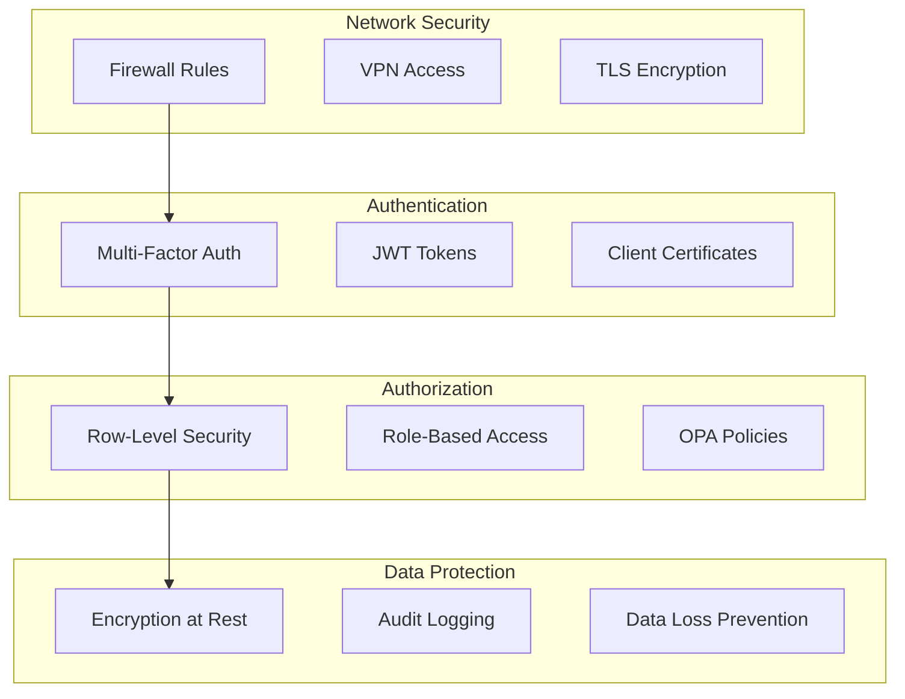

# Database Security Guide

## Overview

This guide covers the comprehensive security architecture and best practices for the SDLC.ai database system, implementing a zero-trust security model with multi-tenant isolation.

## Security Architecture

### Zero-Trust Model

The database implements a zero-trust architecture where:
- **Never Trust**: Every access request is authenticated and authorized
- **Always Verify**: Multi-factor verification for all access
- **Minimal Privilege**: Users get only necessary permissions
- **Continuous Monitoring**: Real-time security monitoring and alerting

### Security Layers



## Authentication and Authorization

### Multi-Factor Authentication (MFA)

#### User Authentication Flow
```sql
-- Set user context with MFA verification
SELECT set_tenant_context(
    tenant_uuid := 'tenant-uuid',
    user_uuid := 'user-uuid',
    user_role := 'data_scientist'
);
```

#### API Key Authentication
```sql
-- API key structure
CREATE TABLE api_keys (
    id UUID PRIMARY KEY DEFAULT uuid_generate_v4(),
    tenant_id UUID NOT NULL REFERENCES tenants(id) ON DELETE CASCADE,
    user_id UUID REFERENCES users(id) ON DELETE SET NULL,
    key_hash VARCHAR(255) UNIQUE NOT NULL,
    key_prefix VARCHAR(20) NOT NULL, -- First 8 chars for identification
    permissions JSONB NOT NULL DEFAULT '{}',
    rate_limit INTEGER NOT NULL DEFAULT 1000,
    expires_at TIMESTAMPTZ,
    is_active BOOLEAN DEFAULT true
);
```

#### JWT Token Integration
```sql
-- JWT validation function
CREATE OR REPLACE FUNCTION validate_jwt_token(token TEXT)
RETURNS TABLE(user_id UUID, tenant_id UUID, user_role TEXT, expires_at TIMESTAMPTZ) AS $$
BEGIN
    -- Implement JWT validation logic
    -- Decode token, verify signature, check expiration
    RETURN QUERY
    SELECT 
        decoded.payload->>'user_id'::UUID,
        decoded.payload->>'tenant_id'::UUID,
        decoded.payload->>'role'::TEXT,
        (decoded.payload->>'exp'::BIGINT)::TIMESTAMPTZ
    FROM decode_jwt(token) decoded
    WHERE decoded.valid = true;
END;
$$ LANGUAGE plpgsql SECURITY DEFINER;
```

### Role-Based Access Control (RBAC)

#### User Roles and Permissions
```sql
CREATE TYPE user_role AS ENUM (
    'super_admin',      -- Full system access
    'tenant_admin',     -- Tenant management
    'data_scientist',   -- Data analysis and AI queries
    'analyst',          -- Read-only access to reports
    'viewer',           -- Limited document access
    'user'              -- Basic user access
);
```

#### Permission Matrix
| Role | Tenant Management | User Management | Document Upload | AI Queries | Reports | System Config |
|------|-------------------|-----------------|----------------|------------|---------|---------------|
| super_admin | ✅ | ✅ | ✅ | ✅ | ✅ | ✅ |
| tenant_admin | ✅ | ✅ | ✅ | ✅ | ✅ | ❌ |
| data_scientist | ❌ | ❌ | ✅ | ✅ | ✅ | ❌ |
| analyst | ❌ | ❌ | ❌ | ✅ | ✅ | ❌ |
| viewer | ❌ | ❌ | ❌ | ❌ | ✅ | ❌ |
| user | ❌ | ❌ | ✅ | ✅ | ❌ | ❌ |

### Row-Level Security (RLS)

#### Tenant Isolation Policies
```sql
-- Enable RLS on all tenant-scoped tables
ALTER TABLE tenants ENABLE ROW LEVEL SECURITY;
ALTER TABLE users ENABLE ROW LEVEL SECURITY;
ALTER TABLE documents ENABLE ROW LEVEL SECURITY;
ALTER TABLE document_chunks ENABLE ROW LEVEL SECURITY;

-- Tenant isolation policy
CREATE POLICY tenant_isolation ON documents
    FOR ALL TO app_user
    USING (tenant_id = current_setting('app.current_tenant_id', true)::UUID);
```

#### Owner Access Policies
```sql
-- Document owner access
CREATE POLICY document_owner_access ON documents
    FOR ALL TO app_user
    USING (
        tenant_id = current_setting('app.current_tenant_id', true)::UUID 
        AND created_by = current_setting('app.current_user_id', true)::UUID
    );
```

#### Role-Based Access Policies
```sql
-- Admin access policy
CREATE POLICY admin_full_access ON documents
    FOR ALL TO app_user
    USING (
        current_setting('app.current_user_role', true) IN ('super_admin', 'tenant_admin')
    );

-- Data scientist access
CREATE POLICY data_scientist_access ON documents
    FOR SELECT TO app_user
    USING (
        tenant_id = current_setting('app.current_tenant_id', true)::UUID 
        AND current_setting('app.current_user_role', true) = 'data_scientist'
        AND classification != 'restricted'
    );
```

## Data Protection

### Encryption

#### Encryption at Rest
```sql
-- Column-level encryption
CREATE OR REPLACE FUNCTION encrypt_sensitive_data(data TEXT, key_id TEXT)
RETURNS BYTEA AS $$
BEGIN
    RETURN pgp_sym_encrypt(data, key_id);
END;
$$ LANGUAGE plpgsql SECURITY DEFINER;

-- Usage example
UPDATE users 
SET encrypted_password = encrypt_sensitive_data('password', 'tenant-key-id');
```

#### Encryption Configuration
```sql
-- Per-tenant encryption keys
CREATE TABLE tenant_encryption_keys (
    id UUID PRIMARY KEY DEFAULT uuid_generate_v4(),
    tenant_id UUID NOT NULL REFERENCES tenants(id) ON DELETE CASCADE,
    key_id VARCHAR(255) NOT NULL,
    key_version INTEGER NOT NULL DEFAULT 1,
    key_algorithm VARCHAR(50) NOT NULL DEFAULT 'aes-256-gcm',
    encrypted_key BYTEA NOT NULL, -- Key encrypted with master key
    created_at TIMESTAMPTZ DEFAULT NOW(),
    is_active BOOLEAN DEFAULT true
);
```

#### Encryption in Transit
```bash
# PostgreSQL SSL Configuration
ssl = on
ssl_cert_file = '/etc/ssl/certs/server.crt'
ssl_key_file = '/etc/ssl/private/server.key'
ssl_ca_file = '/etc/ssl/certs/ca.crt'
```

### Data Masking and Anonymization

#### Sensitive Data Masking
```sql
-- PII masking function
CREATE OR REPLACE FUNCTION mask_pii(data TEXT, data_type TEXT)
RETURNS TEXT AS $$
BEGIN
    CASE data_type
        WHEN 'email' THEN
            RETURN LEFT(data, 2) || '***@' || SPLIT_PART(data, '@', 2);
        WHEN 'phone' THEN
            RETURN '***-***-' || RIGHT(data, 4);
        WHEN 'ssn' THEN
            RETURN '***-**-' || RIGHT(data, 4);
        WHEN 'credit_card' THEN
            RETURN '****-****-****-' || RIGHT(data, 4);
        ELSE
            RETURN '***MASKED***';
    END CASE;
END;
$$ LANGUAGE plpgsql SECURITY DEFINER;
```

#### Dynamic Data Masking
```sql
-- Create masked view for non-privileged users
CREATE OR REPLACE VIEW users_masked AS
SELECT 
    id,
    tenant_id,
    email,
    mask_pii(email, 'email') as masked_email,
    role,
    is_active,
    created_at
FROM users;

-- Grant access to masked view
GRANT SELECT ON users_masked TO viewer_role;
```

## Audit and Compliance

### Comprehensive Audit Logging

#### Audit Trail Implementation
```sql
-- Automated audit trigger
CREATE OR REPLACE FUNCTION audit_trigger_function()
RETURNS TRIGGER AS $$
DECLARE
    audit_action audit_action;
    resource_type TEXT;
    tenant_id UUID;
    user_id UUID;
BEGIN
    -- Determine action based on operation
    IF TG_OP = 'INSERT' THEN
        audit_action := 'create';
    ELSIF TG_OP = 'UPDATE' THEN
        audit_action := 'update';
    ELSIF TG_OP = 'DELETE' THEN
        audit_action := 'delete';
    END IF;

    -- Insert audit log
    INSERT INTO audit_logs (
        tenant_id, user_id, action, resource_type, resource_id,
        details, ip_address, user_agent, compliance_tags
    ) VALUES (
        COALESCE(NEW.tenant_id, OLD.tenant_id),
        current_setting('app.current_user_id', true)::UUID,
        audit_action,
        TG_TABLE_NAME,
        COALESCE(NEW.id, OLD.id),
        jsonb_build_object(
            'operation', TG_OP,
            'old_values', row_to_json(OLD),
            'new_values', row_to_json(NEW)
        ),
        inet_client_addr(),
        current_setting('app.user_agent', true),
        determine_compliance_tags(TG_TABLE_NAME, audit_action)
    );

    RETURN COALESCE(NEW, OLD);
END;
$$ LANGUAGE plpgsql SECURITY DEFINER;
```

#### Compliance Tagging
```sql
-- Compliance tagging function
CREATE OR REPLACE FUNCTION determine_compliance_tags(
    table_name TEXT, 
    action audit_action
) RETURNS JSONB AS $$
BEGIN
    RETURN jsonb_build_array(
        CASE 
            WHEN table_name IN ('users', 'documents', 'audit_logs') THEN 'gdpr'
            ELSE NULL
        END,
        CASE 
            WHEN table_name = 'documents' AND action = 'create' THEN 'hipaa'
            ELSE NULL
        END,
        CASE 
            WHEN table_name IN ('audit_logs', 'policies', 'users') THEN 'soc2'
            ELSE NULL
        END
    ) NULL;
END;
$$ LANGUAGE plpgsql IMMUTABLE;
```

### GDPR Compliance

#### Right to be Forgotten
```sql
-- GDPR data deletion function
CREATE OR REPLACE FUNCTION gdpr_forget_user(user_id_param UUID, tenant_id_param UUID)
RETURNS BOOLEAN AS $$
DECLARE
    deletion_count INTEGER := 0;
BEGIN
    -- Anonymize user data instead of deletion for audit purposes
    UPDATE users SET
        email = 'deleted_' || id::TEXT || '@deleted.local',
        encrypted_password = '',
        phone_number = NULL,
        profile = '{"status": "deleted"}',
        is_active = false
    WHERE id = user_id_param AND tenant_id = tenant_id_param;
    
    GET DIAGNOSTICS deletion_count = ROW_COUNT;
    
    -- Log GDPR deletion request
    INSERT INTO audit_logs (
        tenant_id, user_id, action, resource_type, resource_id,
        details, compliance_tags
    ) VALUES (
        tenant_id_param,
        user_id_param,
        'delete',
        'user',
        user_id_param,
        '{"gdpr_request": true, "anonymized": true}',
        '["gdpr", "data_subject_request"]'
    );
    
    RETURN deletion_count > 0;
END;
$$ LANGUAGE plpgsql SECURITY DEFINER;
```

#### Data Subject Access Requests (DSAR)
```sql
-- DSAR export function
CREATE OR REPLACE FUNCTION export_user_data(user_id_param UUID, tenant_id_param UUID)
RETURNS JSONB AS $$
DECLARE
    user_data JSONB;
BEGIN
    -- Compile all user data
    SELECT jsonb_build_object(
        'user_profile', row_to_json(u.*),
        'documents', (
            SELECT jsonb_agg(row_to_json(d.*))
            FROM documents d
            WHERE d.created_by = user_id_param
        ),
        'audit_logs', (
            SELECT jsonb_agg(row_to_json(al.*))
            FROM audit_logs al
            WHERE al.user_id = user_id_param
        ),
        'token_usage', (
            SELECT jsonb_agg(row_to_json(tu.*))
            FROM token_usage tu
            WHERE tu.user_id = user_id_param
        )
    ) INTO user_data
    FROM users u
    WHERE u.id = user_id_param AND u.tenant_id = tenant_id_param;
    
    -- Log DSAR request
    INSERT INTO audit_logs (
        tenant_id, user_id, action, resource_type, resource_id,
        details, compliance_tags
    ) VALUES (
        tenant_id_param,
        user_id_param,
        'read',
        'user',
        user_id_param,
        '{"gdpr_request": true, "data_export": true}',
        '["gdpr", "data_subject_request"]'
    );
    
    RETURN user_data;
END;
$$ LANGUAGE plpgsql SECURITY DEFINER;
```

## Data Loss Prevention (DLP)

### PII Detection and Redaction

#### DLP Scanning Engine
```sql
-- DLP scanning function
CREATE OR REPLACE FUNCTION scan_content_for_pii(
    content TEXT, 
    content_type VARCHAR(100)
) RETURNS JSONB AS $$
DECLARE
    findings JSONB := '[]'::JSONB;
    risk_score DECIMAL := 0.0;
BEGIN
    -- Scan for SSN patterns
    IF content ~ '\b\d{3}-\d{2}-\d{4}\b' THEN
        findings := findings || jsonb_build_object(
            'type', 'ssn',
            'count', array_length(regexp_matches(content, '\b\d{3}-\d{2}-\d{4}\b', 'g'), 1),
            'risk_level', 'high'
        );
        risk_score := risk_score + 0.8;
    END IF;
    
    -- Scan for email addresses
    IF content ~ '\b[A-Za-z0-9._%+-]+@[A-Za-z0-9.-]+\.[A-Za-z]{2,}\b' THEN
        findings := findings || jsonb_build_object(
            'type', 'email',
            'count', array_length(regexp_matches(content, '\b[A-Za-z0-9._%+-]+@[A-Za-z0-9.-]+\.[A-Za-z]{2,}\b', 'g'), 1),
            'risk_level', 'medium'
        );
        risk_score := risk_score + 0.4;
    END IF;
    
    -- Scan for credit card numbers
    IF content ~ '\b\d{4}[-\s]?\d{4}[-\s]?\d{4}[-\s]?\d{4}\b' THEN
        findings := findings || jsonb_build_object(
            'type', 'credit_card',
            'count', array_length(regexp_matches(content, '\b\d{4}[-\s]?\d{4}[-\s]?\d{4}[-\s]?\d{4}\b', 'g'), 1),
            'risk_level', 'high'
        );
        risk_score := risk_score + 0.9;
    END IF;
    
    RETURN jsonb_build_object(
        'findings', findings,
        'risk_score', LEAST(risk_score, 1.0),
        'scan_timestamp', NOW()
    );
END;
$$ LANGUAGE plpgsql IMMUTABLE;
```

#### Real-time DLP Processing
```sql
-- DLP processing trigger
CREATE OR REPLACE FUNCTION dlp_processing_trigger()
RETURNS TRIGGER AS $$
DECLARE
    dlp_result JSONB;
    action_taken VARCHAR(100);
BEGIN
    -- Scan content for PII
    dlp_result := scan_content_for_pii(NEW.content, NEW.content_type);
    
    -- Determine action based on risk score
    CASE (dlp_result->>'risk_score')::DECIMAL
        WHEN 0.0 THEN
            action_taken := 'allowed';
        WHEN < 0.5 THEN
            action_taken := 'flagged';
        ELSE
            action_taken := 'blocked';
    END CASE;
    
    -- Log DLP scan results
    INSERT INTO dlp_scans (
        tenant_id, content_id, content_type, scan_results,
        risk_score, action_taken, scan_duration_ms
    ) VALUES (
        NEW.tenant_id,
        NEW.id,
        NEW.content_type,
        dlp_result,
        (dlp_result->>'risk_score')::DECIMAL,
        action_taken,
        EXTRACT(EPOCH FROM (NOW() - clock_timestamp())) * 1000
    );
    
    -- Update document DLP status
    NEW.dlp_status := CASE action_taken
        WHEN 'allowed' THEN 'completed'
        WHEN 'flagged' THEN 'needs_review'
        ELSE 'blocked'
    END;
    
    RETURN NEW;
END;
$$ LANGUAGE plpgsql SECURITY DEFINER;
```

## Security Monitoring and Alerting

### Real-time Security Monitoring

#### Security Event Detection
```sql
-- Security monitoring function
CREATE OR REPLACE FUNCTION monitor_security_events()
RETURNS TABLE(
    event_type TEXT,
    severity TEXT,
    description TEXT,
    recommendation TEXT
) AS $$
BEGIN
    -- Detect brute force attempts
    RETURN QUERY
    SELECT 
        'brute_force_attempt'::TEXT,
        'HIGH'::TEXT,
        format('Multiple failed login attempts for email: %s', details->>'email')::TEXT,
        'Lock user account and investigate source IP'::TEXT
    FROM audit_logs
    WHERE action = 'login'
    AND response_status = 401
    AND created_at > NOW() - INTERVAL '1 hour'
    GROUP BY details->>'email'
    HAVING count(*) >= 5;
    
    -- Detect unusual access patterns
    RETURN QUERY
    SELECT 
        'unusual_access_pattern'::TEXT,
        'MEDIUM'::TEXT,
        format('Unusual access from new IP: %s for user: %s', 
               ip_address::TEXT, user_id::TEXT)::TEXT,
        'Verify user identity and review session activity'::TEXT
    FROM audit_logs
    WHERE ip_address NOT IN (
        SELECT DISTINCT ip_address 
        FROM audit_logs 
        WHERE user_id = audit_logs.user_id 
        AND created_at > audit_logs.created_at - INTERVAL '30 days'
    )
    AND created_at > NOW() - INTERVAL '1 hour';
    
    -- Detect privilege escalation attempts
    RETURN QUERY
    SELECT 
        'privilege_escalation'::TEXT,
        'CRITICAL'::TEXT,
        format('Attempted access to restricted resource: %s', resource_type)::TEXT,
        'Immediate security investigation required'::TEXT
    FROM audit_logs
    WHERE action = 'access_denied'
    AND resource_type IN ('users', 'tenants', 'policies')
    AND created_at > NOW() - INTERVAL '24 hours';
    
END;
$$ LANGUAGE plpgsql SECURITY DEFINER;
```

#### Automated Security Alerts
```sql
-- Security alert system
CREATE OR REPLACE FUNCTION trigger_security_alerts()
RETURNS VOID AS $$
DECLARE
    alert_record RECORD;
BEGIN
    FOR alert_record IN SELECT * FROM monitor_security_events() LOOP
        -- Insert security alert
        INSERT INTO audit_logs (
            tenant_id, action, resource_type, resource_id,
            details, compliance_tags
        ) VALUES (
            NULL, -- System-level alert
            'security_alert',
            alert_record.event_type,
            uuid_generate_v4(),
            jsonb_build_object(
                'severity', alert_record.severity,
                'description', alert_record.description,
                'recommendation', alert_record.recommendation
            ),
            '["security", "compliance"]'
        );
        
        -- In production, this would trigger external notifications
        -- (email, Slack, PagerDuty, etc.)
    END LOOP;
END;
$$ LANGUAGE plpgsql SECURITY DEFINER;
```

### Intrusion Detection

#### SQL Injection Detection
```sql
-- SQL injection pattern detection
CREATE OR REPLACE FUNCTION detect_sql_injection(input_text TEXT)
RETURNS BOOLEAN AS $$
BEGIN
    RETURN input_text ~* 
        '(\b(UNION|SELECT|INSERT|UPDATE|DELETE|DROP|CREATE|ALTER|EXEC|EXECUTE)\b|--|/\*|\*/|;|''|\'\'|xp_|sp_)';
END;
$$ LANGUAGE plpgsql IMMUTABLE;

-- Input validation trigger
CREATE OR REPLACE FUNCTION validate_input_security()
RETURNS TRIGGER AS $$
BEGIN
    -- Check for SQL injection patterns
    IF TG_OP = 'INSERT' THEN
        IF detect_sql_injection(COALESCE(NEW.content::TEXT, '')) THEN
            RAISE EXCEPTION 'Potential SQL injection detected in content';
        END IF;
        
        IF detect_sql_injection(COALESCE(NEW.metadata::TEXT, '')) THEN
            RAISE EXCEPTION 'Potential SQL injection detected in metadata';
        END IF;
    END IF;
    
    RETURN NEW;
END;
$$ LANGUAGE plpgsql SECURITY DEFINER;
```

## Access Control Policies

### Attribute-Based Access Control (ABAC)

#### Policy Evaluation Framework
```sql
-- ABAC policy evaluation
CREATE OR REPLACE FUNCTION evaluate_access_policy(
    user_context JSONB,
    resource_context JSONB,
    action_context JSONB
) RETURNS BOOLEAN AS $$
DECLARE
    policy_decision BOOLEAN;
BEGIN
    -- Implement ABAC logic based on attributes
    
    -- Check user role permissions
    IF user_context->>'role' = 'super_admin' THEN
        RETURN true;
    END IF;
    
    -- Check tenant ownership
    IF user_context->>'tenant_id' != resource_context->>'tenant_id' THEN
        RETURN false;
    END IF;
    
    -- Check resource access based on classification
    IF resource_context->>'classification' = 'restricted' 
       AND user_context->>'role' NOT IN ('tenant_admin', 'super_admin') THEN
        RETURN false;
    END IF;
    
    -- Check action permissions
    IF action_context->>'action' = 'delete' 
       AND user_context->>'role' = 'viewer' THEN
        RETURN false;
    END IF;
    
    -- Time-based access control
    IF EXTRACT(HOUR FROM NOW()) < 6 
       AND user_context->>'role' = 'analyst' THEN
        RETURN false;
    END IF;
    
    RETURN true;
END;
$$ LANGUAGE plpgsql SECURITY DEFINER;
```

### Policy Management

#### Dynamic Policy Updates
```sql
-- Policy versioning and hot reload
CREATE TABLE policy_versions (
    id UUID PRIMARY KEY DEFAULT uuid_generate_v4(),
    policy_id UUID NOT NULL REFERENCES policies(id) ON DELETE CASCADE,
    version INTEGER NOT NULL,
    rego_policy TEXT NOT NULL,
    is_active BOOLEAN DEFAULT false,
    created_at TIMESTAMPTZ DEFAULT NOW(),
    created_by UUID NOT NULL REFERENCES users(id),
    activation_time TIMESTAMPTZ
);

-- Policy activation function
CREATE OR REPLACE FUNCTION activate_policy_version(
    policy_id_param UUID, 
    version_param INTEGER
) RETURNS BOOLEAN AS $$
BEGIN
    -- Deactivate all versions
    UPDATE policy_versions 
    SET is_active = false 
    WHERE policy_id = policy_id_param;
    
    -- Activate specified version
    UPDATE policy_versions 
    SET is_active = true, activation_time = NOW()
    WHERE policy_id = policy_id_param AND version = version_param;
    
    -- Log policy change
    INSERT INTO audit_logs (
        tenant_id, action, resource_type, resource_id,
        details, compliance_tags
    ) SELECT 
        tenant_id, 'update', 'policy', policy_id_param,
        jsonb_build_object(
            'version', version_param,
            'activated_at', NOW()
        ),
        '["policy_management", "compliance"]'
    FROM policies WHERE id = policy_id_param;
    
    RETURN true;
END;
$$ LANGUAGE plpgsql SECURITY DEFINER;
```

## Security Best Practices

### Operational Security

#### Regular Security Tasks
```sql
-- Daily security checklist
CREATE OR REPLACE FUNCTION daily_security_checklist()
RETURNS TABLE(
    check_name TEXT,
    status TEXT,
    details TEXT
) AS $$
BEGIN
    -- Check for failed login attempts
    RETURN QUERY
    SELECT 
        'failed_login_monitoring'::TEXT,
        CASE WHEN COUNT(*) > 100 THEN 'WARNING' ELSE 'OK' END,
        format('Failed login attempts in last 24h: %s', COUNT(*))::TEXT
    FROM audit_logs
    WHERE action = 'login' AND response_status = 401
    AND created_at > NOW() - INTERVAL '24 hours';
    
    -- Check for privilege escalation attempts
    RETURN QUERY
    SELECT 
        'privilege_escalation_monitoring'::TEXT,
        CASE WHEN COUNT(*) > 0 THEN 'CRITICAL' ELSE 'OK' END,
        format('Privilege escalation attempts: %s', COUNT(*))::TEXT
    FROM audit_logs
    WHERE action = 'access_denied'
    AND resource_type IN ('users', 'tenants', 'policies')
    AND created_at > NOW() - INTERVAL '24 hours';
    
    -- Check for unusual data access
    RETURN QUERY
    SELECT 
        'unusual_access_monitoring'::TEXT,
        CASE WHEN COUNT(*) > 50 THEN 'WARNING' ELSE 'OK' END,
        format('Unusual IP accesses: %s', COUNT(*))::TEXT
    FROM (
        SELECT ip_address, COUNT(*) as access_count
        FROM audit_logs
        WHERE created_at > NOW() - INTERVAL '24 hours'
        GROUP BY ip_address
        HAVING COUNT(*) > 100
    ) unusual_access;
    
END;
$$ LANGUAGE plpgsql SECURITY DEFINER;
```

#### Security Configuration Validation
```sql
-- Security configuration validator
CREATE OR REPLACE FUNCTION validate_security_configuration()
RETURNS TABLE(
    config_item TEXT,
    current_value TEXT,
    expected_value TEXT,
    status TEXT
) AS $$
BEGIN
    -- Check RLS is enabled
    RETURN QUERY
    SELECT 
        'row_level_security'::TEXT,
        'enabled'::TEXT,
        'enabled'::TEXT,
        CASE WHEN EXISTS (
            SELECT 1 FROM pg_tables 
            WHERE schemaname = 'public' 
            AND rowsecurity = true
        ) THEN 'PASS' ELSE 'FAIL' END;
    
    -- Check SSL is enabled
    RETURN QUERY
    SELECT 
        'ssl_encryption'::TEXT,
        setting::TEXT,
        'on'::TEXT,
        CASE WHEN setting = 'on' THEN 'PASS' ELSE 'FAIL' END
    FROM pg_settings WHERE name = 'ssl';
    
    -- Check password encryption
    RETURN QUERY
    SELECT 
        'password_encryption'::TEXT,
        setting::TEXT,
        'scram-sha-256'::TEXT,
        CASE WHEN setting = 'scram-sha-256' THEN 'PASS' ELSE 'WARNING' END
    FROM pg_settings WHERE name = 'password_encryption';
    
END;
$$ LANGUAGE plpgsql SECURITY DEFINER;
```

### Incident Response

#### Security Incident Response Procedure
```sql
-- Security incident logging
CREATE OR REPLACE FUNCTION log_security_incident(
    incident_type TEXT,
    severity TEXT,
    description TEXT,
    affected_resources JSONB,
    response_actions JSONB
) RETURNS UUID AS $$
DECLARE
    incident_id UUID;
BEGIN
    incident_id := uuid_generate_v4();
    
    -- Log security incident
    INSERT INTO audit_logs (
        tenant_id, action, resource_type, resource_id,
        details, compliance_tags
    ) VALUES (
        NULL, -- System-level incident
        'security_incident',
        incident_type,
        incident_id,
        jsonb_build_object(
            'incident_id', incident_id,
            'incident_type', incident_type,
            'severity', severity,
            'description', description,
            'affected_resources', affected_resources,
            'response_actions', response_actions,
            'created_at', NOW()
        ),
        '["security", "incident_response", "compliance"]'
    );
    
    RETURN incident_id;
END;
$$ LANGUAGE plpgsql SECURITY DEFINER;
```

## Compliance and Governance

### Regulatory Compliance Frameworks

#### GDPR Implementation Checklist
- [ ] Data subject rights implemented (access, rectification, erasure)
- [ ] Consent management system
- [ ] Data breach notification procedures
- [ ] Privacy by design principles
- [ ] Data protection impact assessments (DPIA)
- [ ] Data processing records maintained

#### HIPAA Compliance Checklist
- [ ] Protected health information (PHI) identification
- [ ] Access controls and audit logs
- [ ] Data encryption and transmission security
- [ ] Business associate agreements (BAAs)
- [ ] Incident response procedures
- [ ] Regular security assessments

#### SOC 2 Compliance Checklist
- [ ] Security controls implementation
- [ ] Availability monitoring
- [ ] Processing integrity validation
- [ ] Confidentiality measures
- [ ] Privacy controls
- [ ] Audit trail maintenance

## Security Monitoring Dashboard

### Real-time Security Metrics
```sql
-- Security metrics view
CREATE VIEW security_dashboard AS
SELECT 
    'security_status'::TEXT as metric_type,
    jsonb_build_object(
        'failed_logins_24h', (
            SELECT COUNT(*) FROM audit_logs 
            WHERE action = 'login' AND response_status = 401
            AND created_at > NOW() - INTERVAL '24 hours'
        ),
        'suspicious_access_24h', (
            SELECT COUNT(*) FROM monitor_security_events()
            WHERE severity = 'HIGH'
        ),
        'active_threats', (
            SELECT COUNT(*) FROM monitor_security_events()
        ),
        'policy_violations_24h', (
            SELECT COUNT(*) FROM policy_evaluations
            WHERE decision = false
            AND created_at > NOW() - INTERVAL '24 hours'
        ),
        'dlp_blocks_24h', (
            SELECT COUNT(*) FROM dlp_scans
            WHERE action_taken = 'blocked'
            AND created_at > NOW() - INTERVAL '24 hours'
        )
    ) as metrics;
```

This comprehensive security guide ensures that the SDLC.ai database implements industry-leading security practices, maintains regulatory compliance, and provides robust protection for sensitive data across all multi-tenant operations.