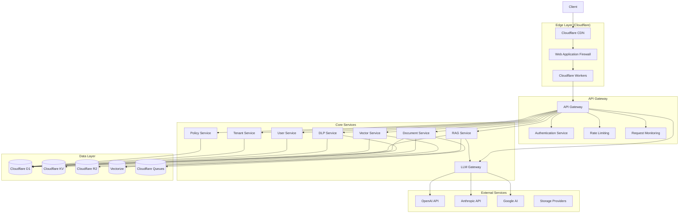
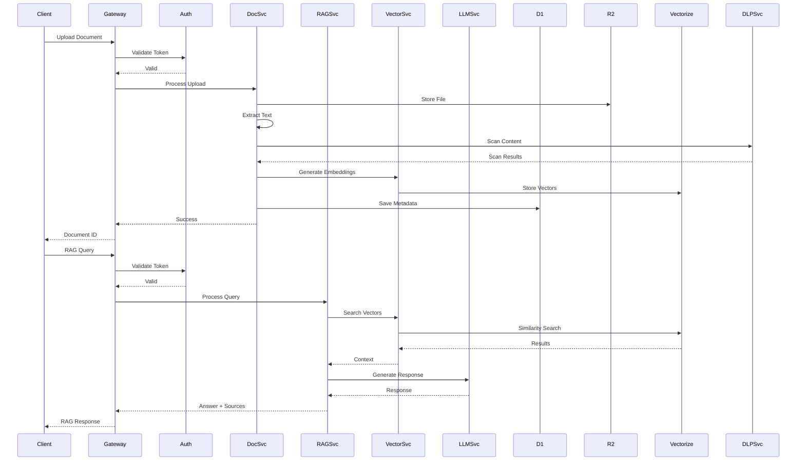
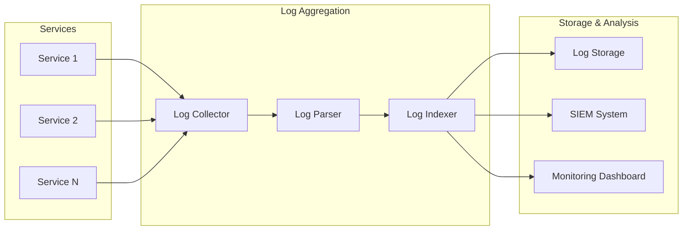

# SDLC.ai System Architecture

## Overview

The SDLC.ai Secure Data Learning Platform is a cloud-native, multi-tenant system built on Cloudflare's global infrastructure. The architecture follows zero-trust principles and provides secure AI-data interactions with enterprise-grade compliance and monitoring.

## High-Level Architecture



## Core Components

### 1. API Gateway

The API Gateway serves as the single entry point for all client requests. It handles:

- **Authentication**: JWT token validation and refresh
- **Authorization**: Role-based access control (RBAC) with OPA integration
- **Rate Limiting**: Tier-based rate limiting with burst capacity
- **Request Routing**: Intelligent routing to appropriate services
- **CORS**: Cross-origin resource sharing configuration
- **Caching**: Response caching for frequently accessed data
- **Monitoring**: Request/response logging and metrics collection

### 2. Authentication Service

Implements a comprehensive authentication framework:

- **Multi-Factor Authentication**: TOTP, SMS, Email verification
- **SSO Integration**: SAML 2.0, OAuth 2.0, OpenID Connect
- **Biometric Auth**: WebAuthn/FIDO2 support
- **Session Management**: Distributed sessions with Redis fallback
- **Token Management**: JWT with refresh tokens, rotation, and revocation
- **Directory Integration**: LDAP/Active Directory sync

### 3. Document Service

Handles all document-related operations:

- **File Upload**: Multi-part upload with resume capability
- **Storage**: Multi-tier storage (hot, warm, cold)
- **Processing Pipeline**:
  - Format validation and conversion
  - Text extraction (OCR for images)
  - Table detection and extraction
  - Metadata extraction
  - Content chunking
- **Versioning**: Document version control
- **Access Control**: Granular permissions per document

### 4. RAG Service

The core intelligence layer:

- **Query Understanding**: NLP-powered query analysis
- **Context Retrieval**: Hybrid search (vector + keyword)
- **Context Assembly**: Intelligent context window management
- **Source Attribution**: Reference tracking and citation
- **Quality Scoring**: Relevance and confidence scoring
- **Personalization**: User-specific result ranking

### 5. LLM Gateway

Manages interactions with various LLM providers:

- **Provider Abstraction**: Unified interface for multiple providers
- **Model Selection**: Automatic model routing based on requirements
- **Token Management**: Usage tracking and cost optimization
- **Prompt Engineering**: Template management and optimization
- **Response Processing**: Filtering, validation, and formatting
- **Fallback Handling**: Automatic failover between providers

### 6. Vector Service

Manages vector embeddings and similarity search:

- **Embedding Generation**: Multiple embedding models support
- **Index Management**: Automatic index creation and optimization
- **Similarity Search**: Various similarity metrics
- **Hybrid Search**: Vector + keyword search combination
- **Real-time Updates**: Incremental index updates
- **Performance Optimization**: Query optimization and caching

### 7. DLP Service

Data Loss Prevention and privacy protection:

- **PII Detection**: 50+ PII types detection
- **Content Classification**: Automated data classification
- **Redaction**: Selective data redaction
- **Compliance**: GDPR, HIPAA, SOX compliance checks
- **Audit Logging**: Immutable audit trails
- **Policy Enforcement**: Real-time policy application

## Data Architecture

### Primary Data Stores

1. **Cloudflare D1 (SQLite)**
   - User and tenant data
   - Metadata and indexes
   - Configuration and policies
   - Audit logs

2. **Cloudflare R2 (S3-compatible)**
   - Document storage
   - Model artifacts
   - Backups and archives
   - Large binary data

3. **Cloudflare KV**
   - Session storage
   - Cache data
   - Configuration
   - Rate limiting counters

4. **Cloudflare Vectorize**
   - Document embeddings
   - Semantic search indexes
   - Similarity vectors

5. **Cloudflare Queues**
   - Async job processing
   - Event streaming
   - Batch operations
   - Retry mechanisms

### Data Flow



## Security Architecture

### Zero-Trust Model

1. **Identity Verification**
   - Strong authentication requirements
   - Continuous authentication validation
   - Device fingerprinting
   - Behavioral analytics

2. **Network Security**
   - Encrypted everything-in-transit (TLS 1.3)
   - Private networking between services
   - Network segmentation
   - DDoS protection

3. **Application Security**
   - Input validation and sanitization
   - SQL injection prevention
   - XSS protection
   - CSRF protection

4. **Data Security**
   - Encryption at rest (AES-256)
   - Encryption in transit
   - Key management with Cloudflare KMS
   - Data masking and redaction

### Compliance Framework

- **GDPR**: Right to be forgotten, data portability, consent management
- **HIPAA**: PHI protection, audit trails, access controls
- **SOX**: Financial data protection, change management
- **SOC 2**: Security, availability, processing integrity
- **ISO 27001**: Information security management

## Scalability Architecture

### Horizontal Scaling

1. **Stateless Services**
   - All services designed to be stateless
   - Session data externalized
   - Auto-scaling based on load
   - Health checks and automatic recovery

2. **Database Scaling**
   - Read replicas for read-heavy workloads
   - Connection pooling
   - Query optimization
   - Partitioning strategies

3. **Caching Strategy**
   - Multi-level caching (L1, L2, L3)
   - CDN for static assets
   - Application-level caching
   - Database query caching

### Performance Optimization

1. **Edge Computing**
   - Cloudflare Workers at edge locations
   - Reduced latency
   - Geographic distribution
   - Smart routing

2. **Async Processing**
   - Queue-based processing
   - Non-blocking operations
   - Batch processing
   - Event-driven architecture

3. **Resource Management**
   - Connection pooling
   - Memory optimization
   - CPU utilization monitoring
   - Auto-scaling policies

## Monitoring & Observability

### Metrics Collection

1. **Application Metrics**
   - Request latency and throughput
   - Error rates and types
   - Resource utilization
   - Business metrics

2. **Infrastructure Metrics**
   - CPU, memory, disk usage
   - Network traffic
   - Database performance
   - Queue depths

3. **Security Metrics**
   - Authentication failures
   - Authorization denials
   - Security events
   - Vulnerability scans

### Logging Architecture



### Alerting Strategy

1. **Real-time Alerts**
   - Critical incidents (< 5 minutes)
   - Performance degradation
   - Security breaches
   - Service outages

2. **Proactive Monitoring**
   - Trend analysis
   - Capacity planning
   - Predictive alerts
   - Health checks

## Deployment Architecture

### Environment Strategy

1. **Development**
   - Local development setup
   - Shared staging environment
   - Feature flags
   - Mock services

2. **Staging**
   - Production-like environment
   - Full feature set
   - Performance testing
   - Security testing

3. **Production**
   - Multi-region deployment
   - Blue-green deployments
   - Zero-downtime updates
   - Disaster recovery

### CI/CD Pipeline

```mermaid
graph LR
    subgraph "Source"
        Git[Git Repository]
    end
    
    subgraph "Build"
        Build[Build Stage]
        Test[Unit Tests]
        Security[Security Scan]
    end
    
    subgraph "Deploy"
        Dev[Dev Deploy]
        Staging[Staging Deploy]
        Prod[Production Deploy]
    end
    
    subgraph "Validate"
        E2E[E2E Tests]
        Perf[Performance Tests]
        SecurityTest[Security Tests]
    end
    
    Git --> Build
    Build --> Test
    Test --> Security
    Security --> Dev
    Dev --> E2E
    E2E --> Staging
    Staging --> Perf
    Perf --> SecurityTest
    SecurityTest --> Prod
```

## Technology Stack

### Core Technologies

- **Runtime**: Cloudflare Workers (V8 isolates)
- **Language**: TypeScript, Go, Python
- **Database**: Cloudflare D1 (SQLite), PostgreSQL
- **Storage**: Cloudflare R2, S3-compatible
- **Vector DB**: Cloudflare Vectorize, Pinecone
- **Cache**: Cloudflare KV, Redis
- **Queue**: Cloudflare Queues, RabbitMQ

### External Integrations

- **LLM Providers**: OpenAI, Anthropic, Google AI
- **Authentication**: Auth0, Okta, Azure AD
- **Monitoring**: Datadog, New Relic, Grafana
- **Security**: OWASP ZAP, Snyk, Veracode
- **CI/CD**: GitHub Actions, GitLab CI

## Best Practices

### Development Practices

1. **Code Quality**
   - 95%+ test coverage
   - Code reviews mandatory
   - Static analysis
   - Security scanning

2. **Security First**
   - Threat modeling
   - Security by design
   - Regular audits
   - Penetration testing

3. **Performance Mindset**
   - Performance budgets
   - Lazy loading
   - Caching strategies
   - Optimization

### Operational Practices

1. **Site Reliability**
   - SLOs and SLIs
   - Error budgets
   - Incident response
   - Post-mortems

2. **Disaster Recovery**
   - Regular backups
   - Recovery procedures
   - DR testing
   - RTO/RPO targets

3. **Cost Optimization**
   - Resource utilization
   - Auto-scaling
   - Reserved capacity
   - Cost monitoring

## Future Architecture Considerations

### Scalability Enhancements

1. **Multi-region Deployment**
   - Geographic distribution
   - Data locality
   - Failover capabilities
   - Latency optimization

2. **AI/ML Model Hosting**
   - Custom model deployment
   - Model versioning
   - A/B testing
   - Model monitoring

3. **Edge Computing**
   - More processing at edge
   - Reduced latency
   - Bandwidth optimization
   - Privacy improvements

### Technology Evolution

1. **Post-quantum cryptography (roadmap, not implemented)**
   - Evaluating ML-KEM/Kyber for a future release; no PQC algorithms exist in the codebase today
   - Current crypto is classical AES-256 + ChaCha20-Poly1305
   - Future-proofing of encryption and security algorithm updates are aspirational, not shipped

2. **Advanced AI Features**
   - Multi-modal AI
   - Real-time processing
   - Federated learning
   - Explainable AI

3. **Integration Patterns**
   - Event-driven architecture
   - Microservices evolution
   - API governance
   - Platform engineering