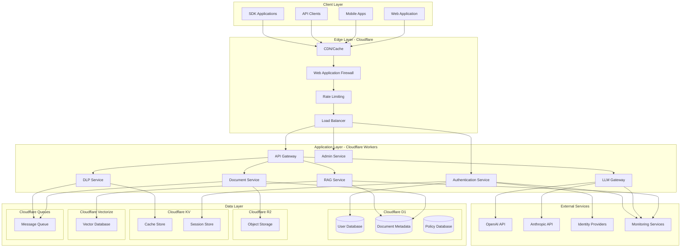
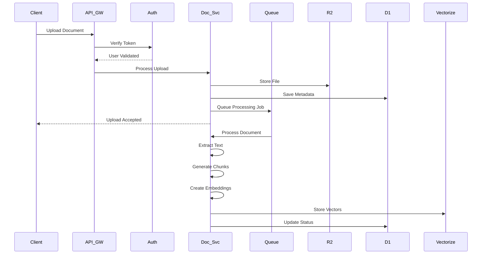
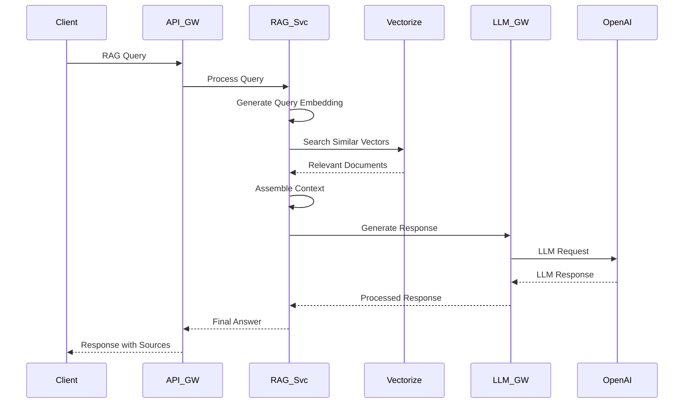
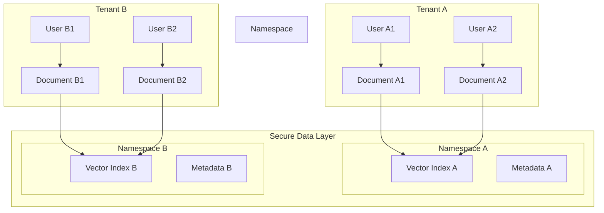
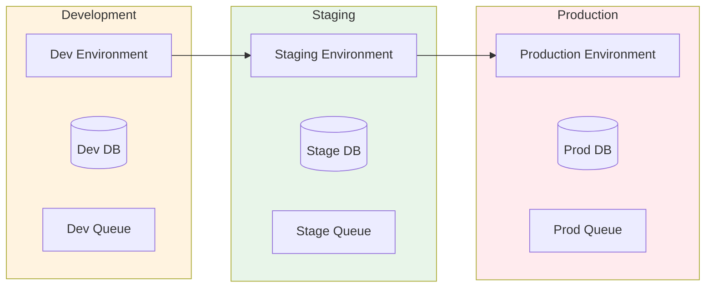

# SDLC.ai System Architecture Overview

## Table of Contents
1. [Introduction](#introduction)
2. [High-Level Architecture](#high-level-architecture)
3. [Core Components](#core-components)
4. [Data Flow](#data-flow)
5. [Security Architecture](#security-architecture)
6. [Scalability Design](#scalability-design)
7. [Technology Stack](#technology-stack)
8. [Deployment Architecture](#deployment-architecture)

## Introduction

The SDLC.ai Secure Data Learning Platform is a cloud-native, enterprise-grade middleware fabric that enables secure AI-data interactions while maintaining full compliance, transparency, and control. Built on Cloudflare's global network, the platform provides zero-trust architecture for connecting private data sources with AI models.

### Key Architectural Principles
- **Zero-Trust Security**: Every request is authenticated and authorized
- **Privacy by Design**: Data never leaves the secure perimeter
- **Cloud-Native**: Leveraging edge computing for global performance
- **Multi-Tenant**: Secure isolation of tenant data
- **API-First**: All functionality exposed through well-defined APIs
- **Event-Driven**: Asynchronous processing for scalability

## High-Level Architecture

## Core Components

### 1. API Gateway
**Location**: Cloudflare Workers  
**Responsibilities**:
- Request routing and load balancing
- Authentication and authorization
- Rate limiting and quota management
- Request/response transformation
- API versioning

**Key Features**:
- Sub-100ms response times
- Global edge distribution
- Auto-scaling based on demand
- Built-in DDoS protection

### 2. Authentication Service
**Location**: Cloudflare Workers  
**Responsibilities**:
- JWT token management
- Multi-factor authentication
- SSO/SAML integration
- Session management
- Password policies

**Security Features**:
- Zero-trust authentication
- Token rotation and refresh
- Audit logging
- Failed attempt lockout

### 3. Document Processing Service
**Location**: Cloudflare Workers + Queues  
**Responsibilities**:
- File upload and validation
- Text extraction (OCR for images)
- Document chunking
- Metadata extraction
- Vector embedding generation

**Supported Formats**:
- PDF, DOC, DOCX, TXT, MD
- Images (PNG, JPG, TIFF) with OCR
- CSV, JSON, XML
- Up to 50MB file size

### 4. RAG (Retrieval-Augmented Generation) Service
**Location**: Cloudflare Workers  
**Responsibilities**:
- Vector similarity search
- Context retrieval and ranking
- Context assembly
- LLM prompt engineering
- Source attribution

**Performance**:
- Millisecond-level vector search
- Hybrid search (vector + keyword)
- Re-ranking for accuracy
- Context caching

### 5. DLP (Data Loss Prevention) Service
**Location**: Cloudflare Workers  
**Responsibilities**:
- Sensitive data detection
- Content redaction
- Data classification
- Compliance enforcement
- Audit trail generation

**Detection Types**:
- PII (Personally Identifiable Information)
- Financial data (credit cards, bank accounts)
- Health information (PHI/HIPAA)
- Custom patterns and rules

### 6. LLM Gateway
**Location**: Cloudflare Workers  
**Responsibilities**:
- Multi-provider integration
- Token management and counting
- Cost optimization
- Model routing
- Response caching

**Supported Providers**:
- OpenAI (GPT-3.5, GPT-4, GPT-4-turbo)
- Anthropic (Claude-2, Claude-3)
- Google (Gemini Pro)
- Azure OpenAI
- Custom model endpoints

### 7. Vector Database
**Location**: Cloudflare Vectorize  
**Responsibilities**:
- Vector storage and indexing
- Similarity search
- Metadata filtering
- Index management
- Performance optimization

**Index Types**:
- Cosine similarity
- Euclidean distance
- Dot product
- Hybrid indexes

## Data Flow

### Document Upload Flow

### RAG Query Flow

## Security Architecture

### Zero-Trust Implementation
1. **Authentication**
   - JWT-based stateless authentication
   - Short-lived access tokens (1 hour)
   - Refresh tokens with rotation
   - Multi-factor authentication support

2. **Authorization**
   - Role-based access control (RBAC)
   - Attribute-based access control (ABAC)
   - Policy-based permissions
   - Resource-level scoping

3. **Data Encryption**
   - TLS 1.3 for all communications
   - AES-256 encryption at rest
   - End-to-end encryption for sensitive data
   - Customer-managed encryption keys

4. **Network Security**
   - Cloudflare WAF protection
   - DDoS mitigation
   - IP whitelisting/blacklisting
   - Geo-fencing capabilities

5. **Audit and Compliance**
   - Immutable audit logs
   - Real-time security monitoring
   - Automated compliance reporting
   - Data retention policies

### Multi-Tenant Isolation

## Scalability Design

### Horizontal Scaling
- **Auto-scaling Workers**: Cloudflare Workers automatically scale based on traffic
- **Global Distribution**: Edge locations worldwide reduce latency
- **Database Sharding**: Tenant-based data partitioning
- **Queue-based Processing**: Asynchronous handling of resource-intensive tasks

### Performance Optimization
1. **Caching Strategy**
   - L1: Edge caching (Cloudflare CDN)
   - L2: KV store for frequently accessed data
   - L3: Application-level caching

2. **Connection Pooling**
   - Database connection reuse
   - HTTP client connection management
   - Persistent connections to external APIs

3. **Batch Processing**
   - Bulk vector operations
   - Batch API requests
   - Queue-based job processing

### Capacity Planning
| Metric | Target | Current Capacity | Scaling Strategy |
|--------|--------|-------------------|------------------|
| Concurrent Users | 10,000 | 1,000 | Auto-scale Workers |
| API Requests/sec | 10,000 | 1,000 | Edge distribution |
| Document Storage | 1PB | 100TB | R2 auto-scaling |
| Vector Dimensions | 100M | 10M | Vectorize scaling |
| Database Connections | 50,000 | 5,000 | Connection pooling |

## Technology Stack

### Core Technologies
- **Runtime**: Cloudflare Workers (V8 Isolates)
- **Languages**: TypeScript, Go, Python
- **Databases**: 
  - D1 (SQLite at the edge)
  - Vectorize (Pinecone-compatible)
  - KV (Key-value store)
  - R2 (S3-compatible storage)
- **Queues**: Cloudflare Queues
- **CDN**: Cloudflare CDN

### Development Tools
- **Version Control**: Git
- **CI/CD**: GitHub Actions
- **Package Management**: npm, Go Modules, pip
- **Testing**: Jest, Go test, Pytest
- **Monitoring**: Cloudflare Analytics, Custom dashboards

### Security Tools
- **WAF**: Cloudflare WAF
- **DDoS Protection**: Cloudflare DDoS
- **Certificate Management**: Cloudflare SSL/TLS
- **Secret Management**: Cloudflare Secrets

## Deployment Architecture

### Environment Strategy

### Deployment Pipeline
1. **Code Commit** → GitHub Repository
2. **Automated Tests** → Unit, Integration, E2E
3. **Build & Package** → Worker bundles
4. **Deploy to Staging** → Automated deployment
5. **Staging Tests** → QA validation
6. **Deploy to Production** → Blue-green deployment
7. **Health Checks** → Automated monitoring
8. **Rollback if needed** → Instant rollback capability

### Monitoring and Observability
- **Application Metrics**: Response times, error rates, throughput
- **Infrastructure Metrics**: CPU, memory, network usage
- **Business Metrics**: User engagement, feature usage
- **Security Metrics**: Authentication failures, blocked requests
- **Custom Dashboards**: Real-time visibility
- **Alerting**: Proactive issue detection

## Future Architecture Considerations

### Planned Enhancements
1. **Edge AI**: Model inference at the edge
2. **Federated Learning**: Privacy-preserving model training
3. **Blockchain Integration**: Immutable audit trails
4. **Post-quantum cryptography (roadmap, not implemented)**: evaluating ML-KEM/Kyber for a future release; current crypto is classical AES-256 + ChaCha20-Poly1305. No PQC algorithms are present in the codebase today.
5. **Multi-Cloud Support**: Hybrid deployment options

### Technology Roadmap
- **Q1 2025**: Enhanced vector search capabilities
- **Q2 2025**: Custom model hosting
- **Q3 2025**: Advanced analytics platform
- **Q4 2025**: Machine learning pipeline automation

---

## Conclusion

The SDLC.ai architecture is designed for:
- **Security**: Zero-trust, end-to-end encryption, compliance
- **Scalability**: Auto-scaling, global distribution, performance
- **Reliability**: 99.9% uptime, disaster recovery
- **Flexibility**: Multi-provider, API-first, extensible
- **Usability**: Developer-friendly, well-documented

This architecture enables organizations to securely leverage AI capabilities on their sensitive data while maintaining full control and compliance with regulatory requirements.

For more detailed information about specific components, please refer to the component-specific documentation in this repository.