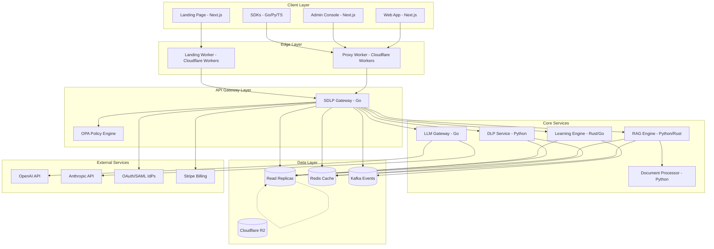
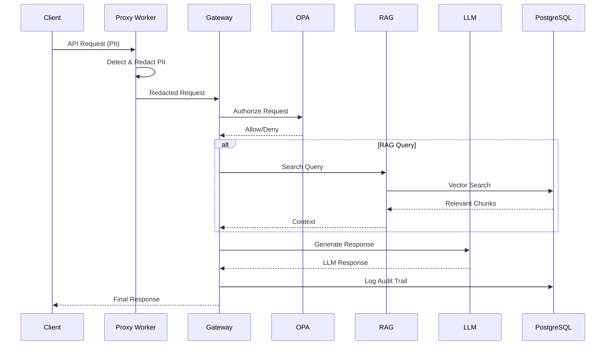
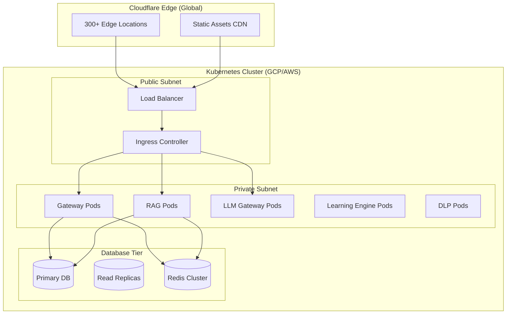
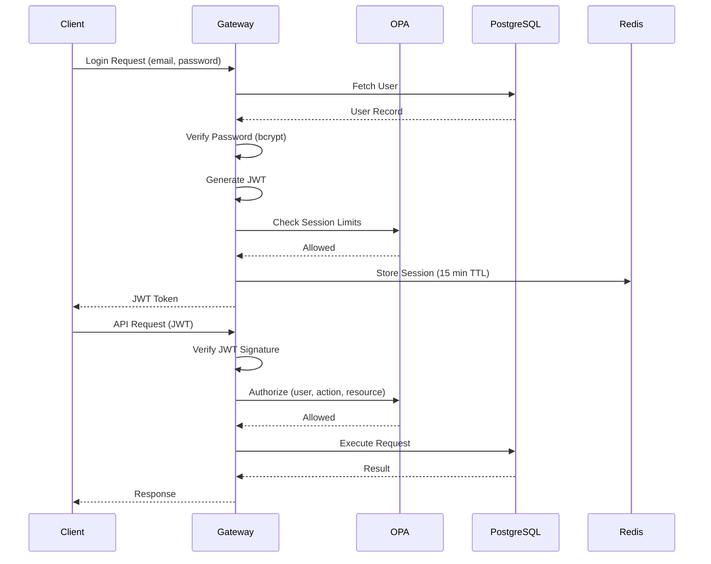
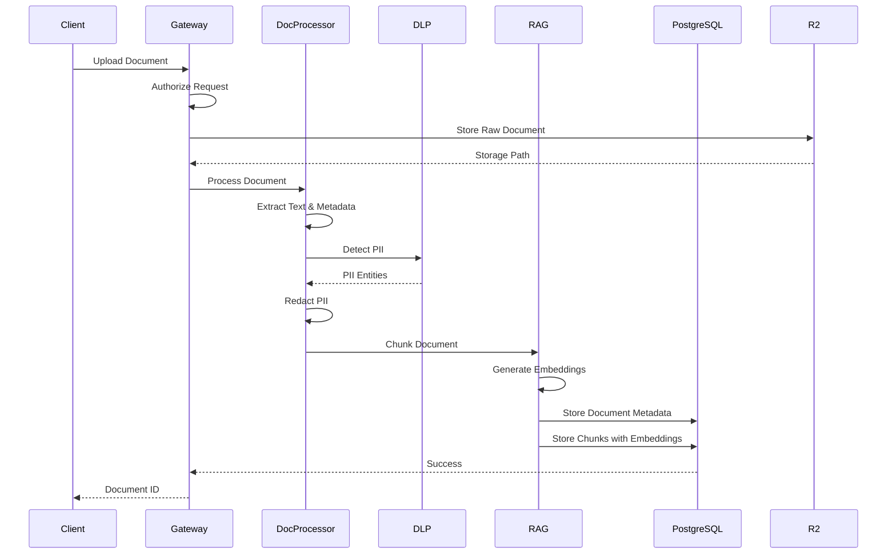
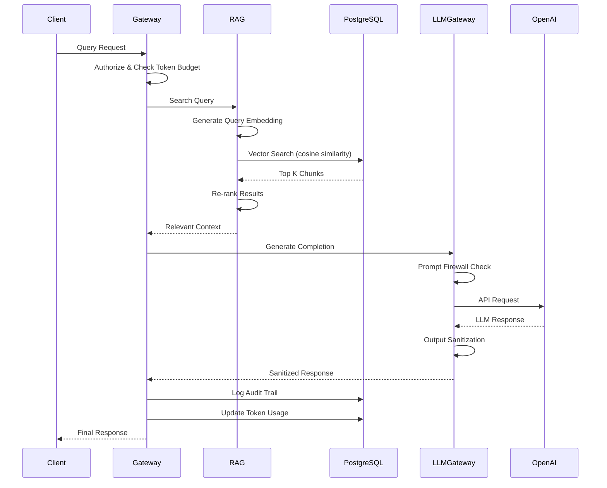
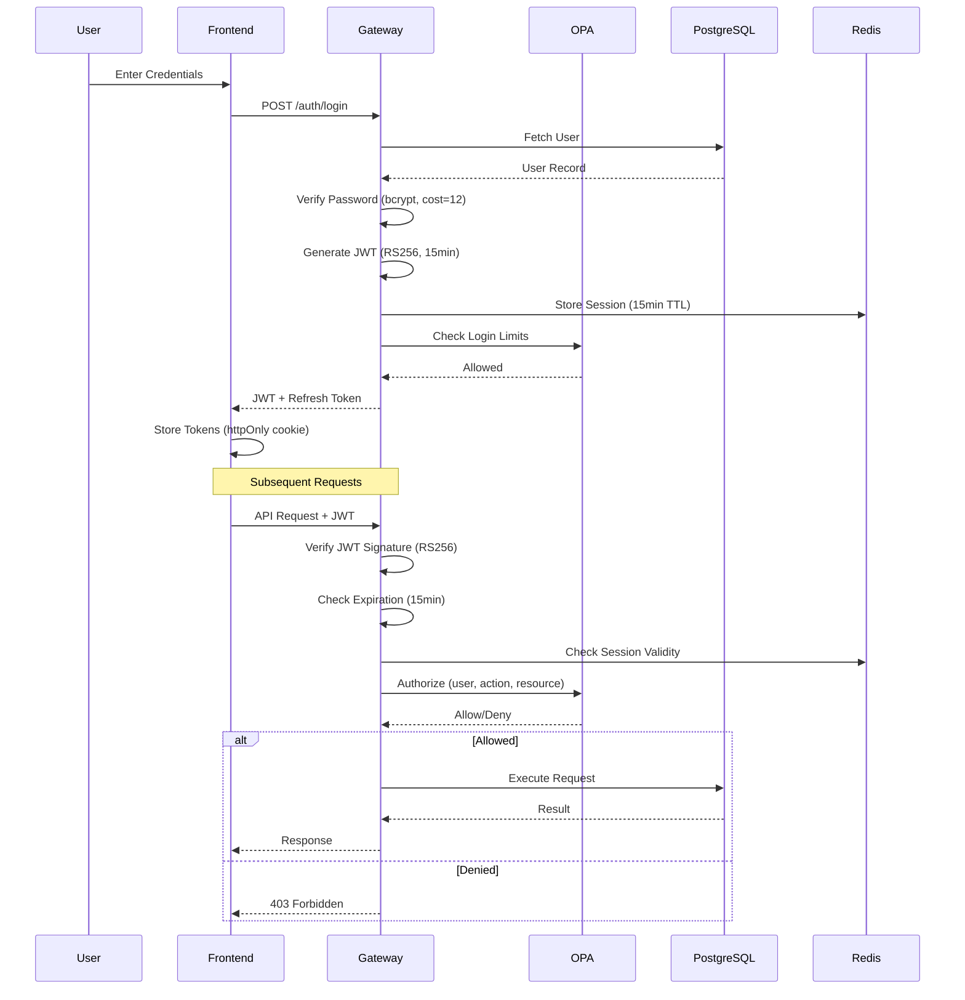
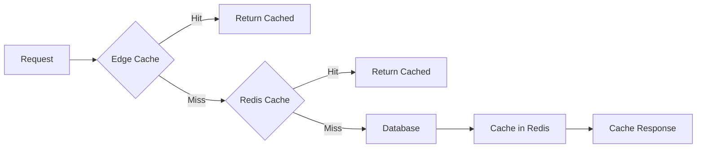
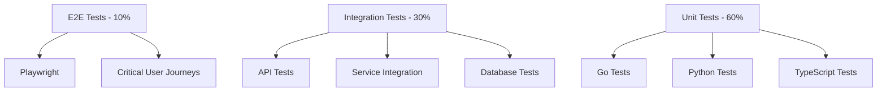
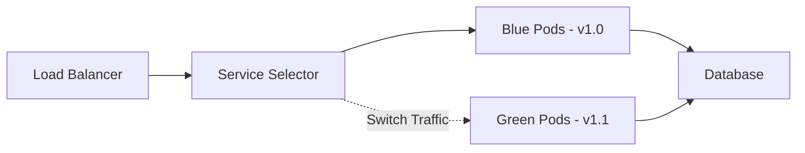

# SDLC Platform — Technical Design Document

**Scope**: SDLP v3 (Secure Data Learning Platform)
**Generated**: 2026-03-06
**Agent**: Design Architect Agent
**Based on**: requirements.md

---

## Overview

The SDLC Platform is a secure data learning platform that serves as the trust layer between enterprise data and AI models. This technical design document provides comprehensive architecture, component specifications, data models, API designs, and implementation guidelines for building a production-grade, scalable, and secure platform.

### Key Architectural Decisions

1. **Microservices Architecture**: Each core component (Gateway, RAG, LLM Gateway, Learning Engine, DLP) is deployed as an independent service for scalability and maintainability
2. **Zero-Trust Security**: All inter-service communication uses mTLS, with OPA policy enforcement at every layer
3. **Edge-First Design**: Cloudflare Workers at the edge for low-latency API proxy and initial PII handling
4. **Multi-Tenant by Design**: Row-level security and tenant isolation throughout the stack
5. **Event-Driven Patterns**: Kafka for async communication between services for audit, telemetry, and learning feedback loops
6. **Polyglot Persistence**: PostgreSQL for transactional data, pgvector for embeddings, Redis for caching, R2 for object storage

### Design Goals

- **Performance**: p95 latency <100ms for API Gateway, <200ms for RAG retrieval
- **Security**: Defense-in-depth with encryption, policy enforcement, and audit trails
- **Scalability**: Horizontal scaling to 10,000+ concurrent users
- **Compliance**: SOC 2 Type II, GDPR, HIPAA, PCI-DSS ready by design
- **Maintainability**: 100% test coverage on critical paths, ≤200 lines per file

---

## Architecture

### High-Level Architecture



### Service Communication Patterns



### Deployment Architecture



### Technology Stack

#### Frontend
- **Landing Page**: Next.js 15, React 18, TypeScript, Tailwind CSS
- **Web App**: Next.js 15, React 18, TypeScript, shadcn/ui components
- **Admin Console**: Next.js 15, React 18, TypeScript, custom dashboard components
- **Styling**: Tailwind CSS with custom design tokens
- **State Management**: React Context + hooks, Zustand for complex state
- **Forms**: React Hook Form + Zod validation
- **Data Fetching**: React Query (TanStack Query)

#### Backend Services
- **Gateway**: Go 1.25+, Chi router, pgx driver, OpenTelemetry
- **RAG Engine**: Python 3.11+, FastAPI, spaCy, Presidio, sentence-transformers
- **Vector Core**: Rust, ndarray, hnswlib
- **LLM Gateway**: Go 1.25+, OpenAI SDK, Anthropic SDK
- **Learning Engine**: Rust + Go, async agents, ML feedback loops
- **DLP Service**: Python 3.11+, Presidio 2.0+, custom ML models

#### Data & Storage
- **Primary Database**: PostgreSQL 15+ with pgvector extension
- **Cache**: Redis 7+ Cluster
- **Object Storage**: Cloudflare R2 (S3-compatible)
- **Event Stream**: Kafka or Redpanda
- **Search**: PostgreSQL full-text + pgvector

#### Infrastructure
- **Edge**: Cloudflare Workers, Cloudflare R2, Cloudflare D1
- **Container Orchestration**: Kubernetes (GKE/AKS/EKS)
- **CI/CD**: GitHub Actions, ArgoCD for GitOps
- **Monitoring**: Prometheus, Grafana, OpenTelemetry
- **Logging**: Loki, Grafana Tempo
- **Secrets**: HashiCorp Vault or AWS Secrets Manager
- **Service Mesh**: Istio (optional, for mTLS and traffic management)

#### Development Tools
- **Version Control**: Git + GitHub
- **Code Quality**: ESLint, Prettier, golangci-lint, black, ruff
- **Testing**: Jest, Playwright, Go testing, pytest
- **Documentation**: OpenAPI/Swagger, Godoc, Pydoc

---

## Components and Interfaces

### Edge Layer Components

#### Proxy Worker (Cloudflare Workers)

**Purpose**: Edge API proxy with initial PII detection, rate limiting, and request routing

**Responsibilities**:
- Detect and redact PII in request bodies before forwarding
- Enforce rate limits per API key using D1 database
- Route requests to appropriate backend services
- Handle CORS and security headers
- Implement basic authentication (API key validation)
- Cache frequent responses at edge

**Interface**:
```typescript
interface ProxyWorkerRequest {
  body: string;
  headers: Headers;
  method: string;
  url: string;
  apiKey?: string;
}

interface ProxyWorkerResponse {
  status: number;
  headers: Headers;
  body: string;
}

interface PIIResult {
  original: string;
  redacted: string;
  detectedPII: PIIEntity[];
}

interface PIIEntity {
  type: 'EMAIL' | 'SSN' | 'PHONE' | 'CREDIT_CARD' | 'PASSPORT';
  value: string;
  start: number;
  end: number;
  confidence: number;
}
```

**Dependencies**:
- Cloudflare Workers Runtime
- Cloudflare D1 (for rate limit state)
- Cloudflare R2 (for cached responses)

**Implementation Notes**:
- Must complete within 50ms execution limit
- Use WebAssembly for PII detection (compiled from Rust)
- Implement sliding window rate limiting
- Cache OAuth tokens in Workers KV
- Implement circuit breaker for backend failures

---

### API Gateway Layer Components

#### SDLP Gateway (Go)

**Purpose**: Central API gateway providing authentication, authorization, rate limiting, and request routing

**Responsibilities**:
- JWT and API key authentication
- OPA policy enforcement for fine-grained authorization
- Request validation and sanitization
- Rate limiting and quota management
- Distributed tracing propagation
- Circuit breaker for backend services
- Request/response logging with PII redaction
- Metrics and telemetry collection

**Interface**:
```go
// Gateway configuration
type GatewayConfig struct {
    Server           ServerConfig           `yaml:"server"`
    Database         DatabaseConfig         `yaml:"database"`
    Redis            RedisConfig            `yaml:"redis"`
    OPA              OPAConfig              `yaml:"opa"`
    Tracing          TracingConfig          `yaml:"tracing"`
    CircuitBreaker   CircuitBreakerConfig   `yaml:"circuit_breaker"`
    RateLimit        RateLimitConfig        `yaml:"rate_limit"`
}

// Authentication context
type AuthContext struct {
    UserID         string
    OrganizationID string
    Roles         []string
    APIKeyID      string
    Scopes        []string
}

// Authorization request
type AuthzRequest struct {
    User         string
    Action       string
    Resource     string
    Context      map[string]interface{}
}

// Authorization response
type AuthzResponse struct {
    Allowed bool
    Reason  string
}

// Rate limit result
type RateLimitResult struct {
    Allowed    bool
    Remaining  int64
    Reset      time.Time
    Limit      int64
}
```

**Dependencies**:
- PostgreSQL (for user/org data, API keys)
- Redis (for rate limiting, caching)
- OPA (for authorization decisions)
- OpenTelemetry (for distributed tracing)
- Kafka (for audit events)

**Implementation Notes**:
- Use Chi router with middleware pipeline
- Implement request ID generation and propagation
- Use connection pooling for database (PgBouncer)
- Cache OPA policy decisions in Redis (5-minute TTL)
- Implement graceful shutdown with 30-second timeout
- Use structured logging (JSON format)
- Expose Prometheus metrics on /metrics endpoint

**Middleware Pipeline**:
```go
func GatewayMiddleware(config *GatewayConfig) func(http.Handler) http.Handler {
    return func(next http.Handler) http.Handler {
        return http.HandlerFunc(func(w http.ResponseWriter, r *http.Request) {
            chain := chi.Chain(
                RequestIDMiddleware,
                CorrelationIDMiddleware,
                TracingMiddleware(config.Tracing),
                LoggingMiddleware(config.Logging),
                RecoveryMiddleware,
                SecurityHeadersMiddleware,
                CORSMiddleware,
                AuthenticationMiddleware(config.Auth),
                RateLimitMiddleware(config.RateLimit),
                AuthorizationMiddleware(config.OPA),
                RequestValidationMiddleware,
                CircuitBreakerMiddleware(config.CircuitBreaker),
            )

            chain.Handler(next).ServeHTTP(w, r)
        })
    }
}
```

---

### Core Service Components

#### RAG Engine (Python + Rust)

**Purpose**: Privacy-preserving retrieval-augmented generation with document processing, embedding generation, and vector search

**Responsibilities**:
- Document ingestion (PDF, DOCX, TXT, MD, HTML)
- Text extraction and preprocessing
- DLP detection and redaction during ingestion
- Document chunking with context preservation
- Embedding generation and caching
- Vector similarity search
- Hybrid search (vector + keyword)
- Relevance scoring and ranking

**Interface**:
```python
from typing import List, Optional
from pydantic import BaseModel
from datetime import datetime

class Document(BaseModel):
    id: str
    organization_id: str
    filename: str
    content_hash: str
    size: int
    format: str
    metadata: dict
    storage_path: str
    created_at: datetime
    uploaded_by: str

class Chunk(BaseModel):
    id: str
    document_id: str
    organization_id: str
    content: str
    embedding: Optional[List[float]]
    chunk_index: int
    metadata: dict
    created_at: datetime

class SearchResult(BaseModel):
    chunk_id: str
    document_id: str
    content: str
    score: float
    metadata: dict

class IngestionResult(BaseModel):
    document_id: str
    chunks_created: int
    pii_detected: int
    pii_redacted: int
    processing_time_ms: int

class SearchRequest(BaseModel):
    query: str
    organization_id: str
    limit: int = 10
    filters: Optional[dict] = None
    hybrid_search: bool = True
    rerank: bool = True

class SearchResponse(BaseModel):
    results: List[SearchResult]
    total_results: int
    search_time_ms: int
    query_embedding_time_ms: int
```

**Dependencies**:
- PostgreSQL + pgvector (for document metadata and vector storage)
- Redis (for embedding cache, query result cache)
- Cloudflare R2 (for raw document storage)
- OpenAI Embeddings API or Cohere Embeddings API
- Presidio (for DLP during ingestion)

**Implementation Notes**:
- Use FastAPI for async HTTP endpoints
- Implement async document processing with Celery or background tasks
- Use connection pooling for PostgreSQL (asyncpg)
- Cache embeddings in Redis with 24-hour TTL
- Implement batch embedding generation (max 100 docs per batch)
- Use HNSW index for fast vector search (M=16, ef_construction=64)
- Implement chunk overlap (20%) for context continuity
- Support custom chunking strategies per document type
- Implement query result caching with 1-hour TTL

**Chunking Strategy**:
```python
class ChunkingConfig(BaseModel):
    chunk_size: int = 800  # tokens
    chunk_overlap: int = 160  # 20%
    min_chunk_size: int = 100
    max_chunk_size: int = 1200
    preserve_structure: bool = True
    semantic_boundaries: bool = True

def chunk_document(
    text: str,
    config: ChunkingConfig
) -> List[str]:
    """
    Split document into overlapping chunks while preserving
    semantic boundaries (paragraphs, sentences).
    """
    # Implementation with spaCy for sentence boundaries
    pass
```

---

#### LLM Gateway (Go)

**Purpose**: Unified interface for multiple LLM providers with token budget management, prompt firewall, and output sanitization

**Responsibilities**:
- Provider abstraction (OpenAI, Anthropic, Llama, Mistral)
- Unified API for all providers
- Token budget enforcement per organization
- Prompt injection and jailbreak detection
- PII detection and redaction in LLM outputs
- Content policy enforcement
- Rate limiting and retry logic
- Cost tracking and optimization suggestions

**Interface**:
```go
// LLM provider configuration
type ProviderConfig struct {
    Name    string
    APIKey  string
    BaseURL string
    Models  []ModelConfig
}

type ModelConfig struct {
    ID          string
    Name        string
    ContextSize int
    Pricing     PricingConfig
}

type PricingConfig struct {
    InputPricePer1K  float64
    OutputPricePer1K float64
}

// LLM request
type LLMRequest struct {
    Provider       string
    Model          string
    Messages       []Message
    MaxTokens      int
    Temperature    float64
    Stream         bool
    OrganizationID string
    UserID         string
    RequestID      string
}

type Message struct {
    Role    string
    Content string
}

// LLM response
type LLMResponse struct {
    ID           string
    Content      string
    TokensUsed   TokenUsage
    Model        string
    FinishReason string
    Sanitized    bool
    PIIRedacted  int
}

type TokenUsage struct {
    PromptTokens     int
    CompletionTokens int
    TotalTokens      int
}

// Token budget
type TokenBudget struct {
    OrganizationID string
    Limit          int64
    Used           int64
    Period         string  // "monthly"
    ResetAt        time.Time
}

// Prompt firewall result
type FirewallResult struct {
    Allowed      bool
    Reason       string
    Detected     []ThreatDetection
    Sanitized    string
}

type ThreatDetection struct {
    Type    string  // "injection", "jailbreak", "policy_violation"
    Score   float64
    Context string
}
```

**Dependencies**:
- OpenAI API
- Anthropic API
- Redis (for token budget tracking, rate limiting)
- PostgreSQL (for audit logs, cost tracking)
- Kafka (for LLM request/response events)

**Implementation Notes**:
- Implement exponential backoff for retries (max 3 attempts)
- Use streaming responses for better UX
- Cache prompt firewall decisions (5-minute TTL)
- Implement token budget checks before making API calls
- Track costs per organization and per model
- Implement prompt injection detection using regex patterns + ML
- Implement output sanitization using DLP service
- Log all LLM requests and responses for audit
- Implement circuit breaker per provider
- Support fallback providers on failure

**Provider Interface**:
```go
type LLMProvider interface {
    Complete(ctx context.Context, req *LLMRequest) (*LLMResponse, error)
    Stream(ctx context.Context, req *LLMRequest) (<-chan *LLMResponse, error)
    GetModels() []ModelConfig
    ValidateRequest(req *LLMRequest) error
}

type OpenAIProvider struct {
    client *openai.Client
    config ProviderConfig
}

func (p *OpenAIProvider) Complete(ctx context.Context, req *LLMRequest) (*LLMResponse, error) {
    // Implementation
}
```

---

#### Learning Engine / LAM (Rust + Go)

**Purpose**: Autonomous agents for policy learning, DLP improvement, cost optimization, and performance tuning

**Responsibilities**:
- Analyze audit logs to identify policy gaps
- Suggest policy improvements with confidence scores
- Test policy changes in sandbox mode
- Learn from DLP false positives/negatives
- Optimize retrieval parameters based on feedback
- Analyze token usage patterns for cost savings
- Recommend optimal routing between LLM providers
- Forecast costs based on usage trends

**Interface**:
```rust
use serde::{Deserialize, Serialize};

#[derive(Debug, Serialize, Deserialize)]
pub struct PolicySuggestion {
    pub id: String,
    pub organization_id: String,
    pub policy_type: String,
    pub current_policy: String,
    pub suggested_policy: String,
    pub confidence: f64,
    pub reason: String,
    pub impact_analysis: ImpactAnalysis,
    pub status: SuggestionStatus,
}

#[derive(Debug, Serialize, Deserialize)]
pub struct ImpactAnalysis {
    pub affected_resources: Vec<String>,
    pub estimated_impact: String,
    pub risk_level: String,
    pub testing_required: bool,
}

#[derive(Debug, Serialize, Deserialize)]
pub enum SuggestionStatus {
    Pending,
    Testing,
    Approved,
    Rejected,
    Deployed,
}

#[derive(Debug, Serialize, Deserialize)]
pub struct DLPFeedback {
    pub id: String,
    pub organization_id: String,
    pub detection_id: String,
    pub was_correct: bool,
    pub correct_type: Option<String>,
    pub user_feedback: String,
    pub timestamp: chrono::DateTime<chrono::Utc>,
}

#[derive(Debug, Serialize, Deserialize)]
pub struct CostOptimization {
    pub organization_id: String,
    pub current_monthly_cost: f64,
    pub projected_savings: f64,
    pub recommendations: Vec<CostRecommendation>,
}

#[derive(Debug, Serialize, Deserialize)]
pub struct CostRecommendation {
    pub recommendation_type: String,
    pub description: String,
    pub estimated_savings: f64,
    pub implementation_effort: String,
}
```

**Dependencies**:
- PostgreSQL (for storing suggestions, feedback, models)
- Kafka (for consuming audit events, feedback events)
- ML models (for pattern detection, anomaly detection)
- Redis (for caching analysis results)

**Implementation Notes**:
- Implement async agents using Tokio
- Use Bayesian optimization for hyperparameter tuning
- Implement A/B testing framework for policy changes
- Use time series analysis for cost forecasting
- Implement anomaly detection for usage patterns
- Store all training data with versioning
- Implement human feedback loops for all suggestions
- Require explicit approval for policy changes
- Log all agent decisions for audit

**Agent Architecture**:
```rust
pub trait Agent {
    async fn run(&mut self) -> Result<(), AgentError>;
    fn name(&self) -> &str;
    fn status(&self) -> AgentStatus;
}

pub struct PolicyLearningAgent {
    id: String,
    state: AgentState,
    kafka_consumer: KafkaConsumer,
    db: Database,
}

impl Agent for PolicyLearningAgent {
    async fn run(&mut self) -> Result<(), AgentError> {
        // Analyze audit logs
        // Generate policy suggestions
        // Test in sandbox
        // Request approval
        // Deploy approved changes
        Ok(())
    }

    fn name(&self) -> &str {
        "policy_learning"
    }

    fn status(&self) -> AgentStatus {
        AgentStatus::Running
    }
}
```

---

#### DLP Service (Python)

**Purpose**: Detect, redact, and tokenize PII/PHI in text data with configurable rules and ML-based detection

**Responsibilities**:
- PII detection (SSN, email, phone, credit card, passport, driver's license)
- PHI detection (medical record numbers, diagnosis codes, patient IDs)
- Custom pattern detection
- Redaction (replacement with placeholders)
- Tokenization (reversible replacement)
- Encryption of sensitive data
- Audit logging of all DLP operations
- Role-based detokenization

**Interface**:
```python
from typing import List, Optional, Dict
from pydantic import BaseModel
from enum import Enum

class PIICategory(str, Enum):
    EMAIL = "EMAIL"
    SSN = "SSN"
    PHONE = "PHONE"
    CREDIT_CARD = "CREDIT_CARD"
    PASSPORT = "PASSPORT"
    DRIVERS_LICENSE = "DRIVERS_LICENSE"
    MEDICAL_RECORD = "MEDICAL_RECORD"
    DIAGNOSIS_CODE = "DIAGNOSIS_CODE"
    PATIENT_ID = "PATIENT_ID"
    CUSTOM = "CUSTOM"

class PIIEntity(BaseModel):
    type: PIICategory
    value: str
    start: int
    end: int
    confidence: float
    redacted_value: str

class DLPRequest(BaseModel):
    text: str
    organization_id: str
    operation: str  # "detect", "redact", "tokenize", "encrypt"
    custom_patterns: Optional[List[Dict]] = None

class DLPResponse(BaseModel):
    original_text: str
    processed_text: str
    entities_detected: List[PIIEntity]
    operation_performed: str
    processing_time_ms: int

class TokenizationRequest(BaseModel):
    text: str
    organization_id: str
    user_id: str
    ttl: Optional[int] = None

class TokenizationResponse(BaseModel):
    tokenized_text: str
    tokens: List[TokenInfo]

class TokenInfo(BaseModel):
    token: str
    type: PIICategory
    expires_at: Optional[datetime]
```

**Dependencies**:
- Presidio 2.0+ (for PII detection)
- spaCy (for NLP and entity recognition)
- PostgreSQL (for storing tokens, encryption keys)
- Redis (for caching detection results)
- KMS (for encryption key management)

**Implementation Notes**:
- Use Presidio for PII detection with custom recognizers
- Implement ML-based detection for context-aware PII
- Cache detection results for repeated content (1-hour TTL)
- Use deterministic encryption for tokenization (AES-256-GCM)
- Implement key rotation every 90 days
- Log all DLP operations with timestamp, user, and reason
- Implement role-based detokenization (authorized users only)
- Support custom regex patterns via Admin Console
- Target >95% precision and >90% recall for PII detection

---

#### Document Processor (Python)

**Purpose**: Extract text from various document formats while preserving structure and metadata

**Responsibilities**:
- Parse PDF documents (text-based and scanned)
- Parse DOCX documents
- Parse TXT, MD, HTML documents
- Extract metadata (author, creation date, etc.)
- Preserve document structure (headings, lists, tables)
- OCR for scanned documents
- Language detection

**Interface**:
```python
from typing import Optional, Dict, Any

class DocumentMetadata(BaseModel):
    filename: str
    size: int
    format: str
    author: Optional[str]
    created_at: Optional[datetime]
    modified_at: Optional[datetime]
    language: str
    page_count: Optional[int]
    title: Optional[str]

class ProcessingResult(BaseModel):
    text: str
    metadata: DocumentMetadata
    structure: Optional[Dict[str, Any]]
    images: List[str]
    processing_time_ms: int

class ProcessorRequest(BaseModel):
    file_path: str
    organization_id: str
    user_id: str
    extract_metadata: bool = True
    preserve_structure: bool = True
    ocr_enabled: bool = True
```

**Dependencies**:
- PyPDF2 or pdfplumber (for PDF parsing)
- python-docx (for DOCX parsing)
- Tesseract OCR (for scanned documents)
- langdetect (for language detection)
- Cloudflare R2 (for storing processed documents)

**Implementation Notes**:
- Implement async processing for large documents
- Store extracted text in R2 for archival
- Cache processed documents in Redis (24-hour TTL)
- Implement progress tracking for long-running jobs
- Support batch processing (up to 1000 documents)
- Extract and preserve document structure for better chunking
- Implement quality checks (min text length, encoding validation)

---

### Frontend Components

#### Landing Page (Next.js)

**Purpose**: Marketing website with SEO optimization, conversion tracking, and content management

**Responsibilities**:
- Render marketing pages (Home, Features, Pricing, About, Security)
- Capture lead information (demo requests, trial signups)
- SEO optimization (meta tags, sitemap, structured data)
- CTA tracking and analytics
- Content management via markdown or CMS

**Component Structure**:
```
landing-page/
├── app/
│   ├── (marketing)/
│   │   ├── page.tsx          # Home page
│   │   ├── features/
│   │   ├── pricing/
│   │   ├── about/
│   │   └── security/
│   ├── api/
│   │   ├── demo-request/
│   │   └── trial-signup/
│   └── layout.tsx
├── components/
│   ├── ui/                   # shadcn/ui components
│   ├── sections/             # Page sections
│   └── forms/                # Lead capture forms
├── lib/
│   ├── analytics.ts
│   └── seo.ts
└── content/
    └── pages/                # Markdown content
```

**Implementation Notes**:
- Use Next.js 15 with App Router
- Implement server-side rendering for SEO
- Use shadcn/ui for component library
- Integrate with Google Analytics 4
- Implement structured data (JSON-LD)
- Optimize images with next/image
- Implement A/B testing framework
- Target <2s page load time

---

#### Web App (Next.js)

**Purpose**: User dashboard for managing API keys, documents, policies, and monitoring usage

**Responsibilities**:
- User authentication and session management
- Organization management
- API key management
- Document upload and management
- Query interface
- Usage analytics and metrics
- Billing and subscription management

**Component Structure**:
```
web-app/
├── app/
│   ├── (dashboard)/
│   │   ├── dashboard/
│   │   ├── documents/
│   │   ├── queries/
│   │   ├── api-keys/
│   │   ├── policies/
│   │   ├── settings/
│   │   └── billing/
│   ├── auth/
│   │   ├── login/
│   │   ├── signup/
│   │   └── logout/
│   └── layout.tsx
├── components/
│   ├── ui/
│   ├── dashboard/
│   └── forms/
├── lib/
│   ├── api.ts                # API client
│   ├── auth.ts               # Auth utilities
│   └── query.ts              # React Query setup
└── hooks/
    ├── useAuth.ts
    ├── useOrganization.ts
    └── useDocuments.ts
```

**Implementation Notes**:
- Use Next.js 15 with App Router
- Implement middleware for protected routes
- Use React Query for data fetching
- Implement optimistic updates
- Use shadcn/ui for components
- Implement real-time updates via WebSocket
- Target <1s dashboard load time

---

#### Admin Console (Next.js)

**Purpose**: Administrative interface for policy management, audit logs, AI traceability, and compliance reporting

**Responsibilities**:
- Policy creation and management (Rego editor)
- Audit log viewing and export
- AI request traceability
- Usage analytics and dashboards
- Compliance report generation
- User and organization management
- System health monitoring

**Component Structure**:
```
admin-console/
├── app/
│   ├── (admin)/
│   │   ├── policies/
│   │   ├── audit/
│   │   ├── tracing/
│   │   ├── analytics/
│   │   ├── compliance/
│   │   ├── users/
│   │   └── system/
│   └── layout.tsx
├── components/
│   ├── ui/
│   ├── policy-editor/        # Rego editor with syntax highlighting
│   ├── audit-viewer/
│   ├── trace-viewer/
│   └── charts/
├── lib/
│   ├── api.ts
│   └── policy.ts
```

**Implementation Notes**:
- Implement Monaco Editor for Rego policy editing
- Use Recharts or Victory for data visualization
- Implement audit log export (CSV, JSON)
- Implement real-time metrics dashboard
- Implement policy testing interface
- Implement impact analysis for policy changes
- Target <1s page load time

---

### SDK Components

#### Go SDK

**Purpose**: Type-safe Go client library for integrating with SDLP APIs

**Interface**:
```go
package sdlc

// Client configuration
type Config struct {
    APIKey      string
    BaseURL     string
    HTTPClient  *http.Client
    RetryConfig RetryConfig
}

// Main client
type Client struct {
    config     Config
    RAG        *RAGService
    LLM        *LLMService
    DLP        *DLPService
    Documents  *DocumentService
    Policies   *PolicyService
}

// RAG service
type RAGService struct {
    client *Client
}

func (s *RAGService) Search(ctx context.Context, req *SearchRequest) (*SearchResponse, error) {
    // Implementation
}

func (s *RAGService) Ingest(ctx context.Context, req *IngestRequest) (*IngestResponse, error) {
    // Implementation
}

// Usage example
func main() {
    client := sdlc.NewClient(sdlc.Config{
        APIKey: os.Getenv("SDLP_API_KEY"),
        BaseURL: "https://api.sdlc.cc",
    })

    results, err := client.RAG.Search(ctx, &sdlc.SearchRequest{
        Query: "What are the security requirements?",
        OrganizationID: "org-123",
        Limit: 10,
    })
}
```

---

#### Python SDK

**Purpose**: Pythonic client library with async support and type hints

**Interface**:
```python
from typing import Optional, List
from pydantic import BaseModel
import httpx

class SDLPClient:
    def __init__(
        self,
        api_key: str,
        base_url: str = "https://api.sdlc.cc",
        async_client: bool = False,
    ):
        self.api_key = api_key
        self.base_url = base_url
        self.client = httpx.AsyncClient() if async_client else httpx.Client()

    async def search(
        self,
        query: str,
        organization_id: str,
        limit: int = 10,
    ) -> SearchResponse:
        response = await self.client.post(
            f"{self.base_url}/v1/rag/search",
            json={
                "query": query,
                "organization_id": organization_id,
                "limit": limit,
            },
            headers={"Authorization": f"Bearer {self.api_key}"}
        )
        return SearchResponse.model_validate(response.json())

# Usage example
import asyncio

async def main():
    client = SDLPClient(api_key="sk-...")
    results = await client.search(
        query="What are the security requirements?",
        organization_id="org-123",
        limit=10,
    )
    print(results)

asyncio.run(main())
```

---

#### TypeScript SDK

**Purpose**: TypeScript/JavaScript client for browser and Node.js environments

**Interface**:
```typescript
export interface SDLPClientConfig {
  apiKey: string;
  baseURL?: string;
  fetch?: typeof fetch;
}

export class SDLPClient {
  private config: SDLPClientConfig;

  constructor(config: SDLPClientConfig) {
    this.config = {
      ...config,
      baseURL: config.baseURL || 'https://api.sdlc.cc',
    };
  }

  async search(request: SearchRequest): Promise<SearchResponse> {
    const response = await fetch(`${this.config.baseURL}/v1/rag/search`, {
      method: 'POST',
      headers: {
        'Content-Type': 'application/json',
        'Authorization': `Bearer ${this.config.apiKey}`,
      },
      body: JSON.stringify(request),
    });

    if (!response.ok) {
      throw new SDLPError(response.statusText, response.status);
    }

    return response.json();
  }
}

// Usage example
const client = new SDLPClient({
  apiKey: 'sk-...',
});

const results = await client.search({
  query: 'What are the security requirements?',
  organization_id: 'org-123',
  limit: 10,
});
```

---

## Data Models

### Database Schema

#### Users Table
```sql
CREATE TABLE users (
    id UUID PRIMARY KEY DEFAULT gen_random_uuid(),
    email TEXT UNIQUE NOT NULL,
    password_hash TEXT,
    name TEXT,
    role TEXT NOT NULL CHECK (role IN ('owner', 'admin', 'editor', 'viewer')),
    organization_id UUID REFERENCES organizations(id) ON DELETE CASCADE,
    created_at TIMESTAMPTZ NOT NULL DEFAULT NOW(),
    updated_at TIMESTAMPTZ NOT NULL DEFAULT NOW(),
    last_login_at TIMESTAMPTZ,
    mfa_enabled BOOLEAN DEFAULT FALSE,
    mfa_secret_encrypted TEXT,
    CONSTRAINT valid_email CHECK (email ~* '^[A-Za-z0-9._%+-]+@[A-Za-z0-9.-]+\.[A-Z|a-z]{2,}$')
);

CREATE INDEX idx_users_email ON users(email);
CREATE INDEX idx_users_organization_id ON users(organization_id);
CREATE INDEX idx_users_last_login ON users(last_login_at);

-- Row-level security
ALTER TABLE users ENABLE ROW LEVEL SECURITY;

CREATE POLICY users_organization_isolation ON users
    FOR ALL
    USING (organization_id IN (
        SELECT id FROM organizations WHERE id = users.organization_id
    ));
```

**Relationships**: Belongs to organization, has many API keys, creates many documents

**Validation Rules**:
- Email must be valid format
- Role must be one of: owner, admin, editor, viewer
- Password hash uses bcrypt with cost factor 12
- MFA secret is encrypted at rest

**Indexes**:
- `idx_users_email` for login queries
- `idx_users_organization_id` for multi-tenancy
- `idx_users_last_login` for activity reports

---

#### Organizations Table
```sql
CREATE TABLE organizations (
    id UUID PRIMARY KEY DEFAULT gen_random_uuid(),
    name TEXT NOT NULL,
    plan TEXT NOT NULL CHECK (plan IN ('pilot', 'team', 'business', 'enterprise')),
    token_limit BIGINT DEFAULT 1000000,
    tokens_used BIGINT DEFAULT 0,
    billing_email TEXT,
    stripe_customer_id TEXT,
    created_at TIMESTAMPTZ NOT NULL DEFAULT NOW(),
    updated_at TIMESTAMPTZ NOT NULL DEFAULT NOW(),
    settings JSONB DEFAULT '{}',
    CONSTRAINT valid_plan CHECK (plan IN ('pilot', 'team', 'business', 'enterprise'))
);

CREATE INDEX idx_organizations_plan ON organizations(plan);
CREATE INDEX idx_organizations_stripe_customer ON organizations(stripe_customer_id);

-- Trigger to update updated_at
CREATE TRIGGER update_organizations_updated_at
    BEFORE UPDATE ON organizations
    FOR EACH ROW
    EXECUTE FUNCTION update_updated_at_column();
```

**Relationships**: Has many users, has many API keys, has many documents

**Validation Rules**:
- Plan must be valid tier
- Token limit must be positive
- Settings JSONB must be valid

**Indexes**:
- `idx_organizations_plan` for tier-based queries
- `idx_organizations_stripe_customer` for billing lookups

---

#### API Keys Table
```sql
CREATE TABLE api_keys (
    id UUID PRIMARY KEY DEFAULT gen_random_uuid(),
    key_hash TEXT UNIQUE NOT NULL,
    prefix TEXT NOT NULL,  -- First 8 characters for identification
    name TEXT,
    user_id UUID REFERENCES users(id) ON DELETE CASCADE,
    organization_id UUID REFERENCES organizations(id) ON DELETE CASCADE,
    scopes JSONB DEFAULT '[]',
    last_used_at TIMESTAMPTZ,
    expires_at TIMESTAMPTZ,
    created_at TIMESTAMPTZ NOT NULL DEFAULT NOW(),
    revoked_at TIMESTAMPTZ,
    CONSTRAINT valid_prefix CHECK (prefix ~* '^sk-[a-z0-9]{8}$')
);

CREATE INDEX idx_api_keys_key_hash ON api_keys(key_hash);
CREATE INDEX idx_api_keys_organization_id ON api_keys(organization_id);
CREATE INDEX idx_api_keys_user_id ON api_keys(user_id);
CREATE INDEX idx_api_keys_expires_at ON api_keys(expires_at) WHERE expires_at IS NOT NULL;
CREATE INDEX idx_api_keys_active ON api_keys(organization_id) WHERE revoked_at IS NULL AND (expires_at IS NULL OR expires_at > NOW());

-- Row-level security
ALTER TABLE api_keys ENABLE ROW LEVEL SECURITY;

CREATE POLICY api_keys_organization_isolation ON api_keys
    FOR ALL
    USING (organization_id IN (
        SELECT id FROM organizations WHERE id = api_keys.organization_id
    ));
```

**Relationships**: Belongs to user, belongs to organization

**Validation Rules**:
- Key hash is SHA-256 of full API key
- Prefix is first 8 characters for identification
- Scopes is array of permissions
- Active keys must not be revoked or expired

**Indexes**:
- `idx_api_keys_key_hash` for authentication (unique)
- `idx_api_keys_organization_id` for multi-tenancy
- `idx_api_keys_user_id` for user's API keys
- `idx_api_keys_expires_at` for cleanup jobs
- `idx_api_keys_active` for active key queries

---

#### Documents Table
```sql
CREATE TABLE documents (
    id UUID PRIMARY KEY DEFAULT gen_random_uuid(),
    organization_id UUID NOT NULL REFERENCES organizations(id) ON DELETE CASCADE,
    filename TEXT NOT NULL,
    content_hash TEXT NOT NULL,
    size BIGINT NOT NULL,
    format TEXT NOT NULL,
    metadata JSONB DEFAULT '{}',
    storage_path TEXT NOT NULL,
    created_at TIMESTAMPTZ NOT NULL DEFAULT NOW(),
    updated_at TIMESTAMPTZ NOT NULL DEFAULT NOW(),
    uploaded_by UUID REFERENCES users(id),
    processed BOOLEAN DEFAULT FALSE,
    pii_detected INT DEFAULT 0,
    pii_redacted INT DEFAULT 0
);

CREATE INDEX idx_documents_organization_id ON documents(organization_id);
CREATE INDEX idx_documents_content_hash ON documents(content_hash);
CREATE INDEX idx_documents_created_at ON documents(created_at DESC);
CREATE INDEX idx_documents_format ON documents(format);
CREATE INDEX idx_documents_processed ON documents(organization_id, processed) WHERE processed = FALSE;

-- Row-level security
ALTER TABLE documents ENABLE ROW LEVEL SECURITY;

CREATE POLICY documents_organization_isolation ON documents
    FOR ALL
    USING (organization_id IN (
        SELECT id FROM organizations WHERE id = documents.organization_id
    ));
```

**Relationships**: Belongs to organization, uploaded by user, has many chunks

**Validation Rules**:
- Content hash is SHA-256 for deduplication
- Size must be positive
- Format must be supported type
- Storage path is R2 object key

**Indexes**:
- `idx_documents_organization_id` for multi-tenancy
- `idx_documents_content_hash` for deduplication (unique per org)
- `idx_documents_created_at` for recent queries
- `idx_documents_format` for format filtering
- `idx_documents_processed` for processing queue

---

#### Chunks Table (with pgvector)
```sql
CREATE TABLE chunks (
    id UUID PRIMARY KEY DEFAULT gen_random_uuid(),
    document_id UUID NOT NULL REFERENCES documents(id) ON DELETE CASCADE,
    organization_id UUID NOT NULL REFERENCES organizations(id) ON DELETE CASCADE,
    content TEXT NOT NULL,
    embedding VECTOR(1536),
    chunk_index INT NOT NULL,
    metadata JSONB DEFAULT '{}',
    created_at TIMESTAMPTZ NOT NULL DEFAULT NOW()
);

CREATE INDEX idx_chunks_document_id ON chunks(document_id);
CREATE INDEX idx_chunks_organization_id ON chunks(organization_id);
CREATE INDEX idx_chunks_embedding ON chunks USING hnsw (embedding vector_cosine_ops) WITH (m = 16, ef_construction = 64);
CREATE INDEX idx_chunks_chunk_index ON chunks(document_id, chunk_index);

-- Row-level security
ALTER TABLE chunks ENABLE ROW LEVEL SECURITY;

CREATE POLICY chunks_organization_isolation ON chunks
    FOR ALL
    USING (organization_id IN (
        SELECT id FROM organizations WHERE id = chunks.organization_id
    ));
```

**Relationships**: Belongs to document, belongs to organization

**Validation Rules**:
- Content length must be 100-1200 tokens
- Chunk index must be unique per document
- Embedding is 1536-dimensional vector (OpenAI)

**Indexes**:
- `idx_chunks_document_id` for document queries
- `idx_chunks_organization_id` for multi-tenancy
- `idx_chunks_embedding` for vector similarity search (HNSW)
- `idx_chunks_chunk_index` for ordered retrieval

---

#### Audit Logs Table
```sql
CREATE TABLE audit_logs (
    id UUID PRIMARY KEY DEFAULT gen_random_uuid(),
    organization_id UUID REFERENCES organizations(id) ON DELETE CASCADE,
    user_id UUID REFERENCES users(id) ON DELETE SET NULL,
    action TEXT NOT NULL,
    resource_type TEXT NOT NULL,
    resource_id TEXT,
    request_id TEXT,
    ip_address INET,
    user_agent TEXT,
    details JSONB DEFAULT '{}',
    created_at TIMESTAMPTZ NOT NULL DEFAULT NOW(),
    hash TEXT UNIQUE NOT NULL,
    prev_hash TEXT
);

CREATE INDEX idx_audit_logs_organization_id ON audit_logs(organization_id);
CREATE INDEX idx_audit_logs_user_id ON audit_logs(user_id);
CREATE INDEX idx_audit_logs_action ON audit_logs(action);
CREATE INDEX idx_audit_logs_created_at ON audit_logs(created_at DESC);
CREATE INDEX idx_audit_logs_resource ON audit_logs(resource_type, resource_id);
CREATE INDEX idx_audit_logs_request_id ON audit_logs(request_id);
CREATE INDEX idx_audit_logs_hash ON audit_logs(hash);

-- Partitioning for performance
CREATE TABLE audit_logs_2026_01 PARTITION OF audit_logs
    FOR VALUES FROM ('2026-01-01') TO ('2026-02-01');

-- Row-level security
ALTER TABLE audit_logs ENABLE ROW LEVEL SECURITY;

CREATE POLICY audit_logs_organization_isolation ON audit_logs
    FOR SELECT
    USING (organization_id IN (
        SELECT id FROM organizations WHERE id = audit_logs.organization_id
    ));
```

**Relationships**: Belongs to organization, performed by user

**Validation Rules**:
- Hash chain must be valid (prev_hash references previous entry)
- Action must be valid audit action
- IP address must be valid format

**Indexes**:
- `idx_audit_logs_organization_id` for multi-tenancy
- `idx_audit_logs_user_id` for user activity
- `idx_audit_logs_action` for action filtering
- `idx_audit_logs_created_at` for time-based queries
- `idx_audit_logs_resource` for resource history
- `idx_audit_logs_request_id` for request tracing
- `idx_audit_logs_hash` for hash chain validation

---

#### Token Usage Table
```sql
CREATE TABLE token_usage (
    id UUID PRIMARY KEY DEFAULT gen_random_uuid(),
    organization_id UUID NOT NULL REFERENCES organizations(id) ON DELETE CASCADE,
    user_id UUID REFERENCES users(id) ON DELETE SET NULL,
    period_start TIMESTAMPTZ NOT NULL,
    period_end TIMESTAMPTZ NOT NULL,
    prompt_tokens INT NOT NULL DEFAULT 0,
    completion_tokens INT NOT NULL DEFAULT 0,
    total_tokens INT NOT NULL DEFAULT 0,
    cost_usd DECIMAL(10, 4) NOT NULL DEFAULT 0.0000,
    model TEXT NOT NULL,
    provider TEXT NOT NULL,
    created_at TIMESTAMPTZ NOT NULL DEFAULT NOW(),
    CONSTRAINT unique_period UNIQUE (organization_id, period_start, period_end, model)
);

CREATE INDEX idx_token_usage_organization_id ON token_usage(organization_id);
CREATE INDEX idx_token_usage_period ON token_usage(period_start, period_end);
CREATE INDEX idx_token_usage_user_id ON token_usage(user_id);

-- Row-level security
ALTER TABLE token_usage ENABLE ROW LEVEL SECURITY;

CREATE POLICY token_usage_organization_isolation ON token_usage
    FOR ALL
    USING (organization_id IN (
        SELECT id FROM organizations WHERE id = token_usage.organization_id
    ));
```

**Relationships**: Belongs to organization, belongs to user

**Validation Rules**:
- Period must be monthly (start = first day, end = last day)
- Tokens must be non-negative
- Cost must be calculated based on provider pricing

**Indexes**:
- `idx_token_usage_organization_id` for multi-tenancy
- `idx_token_usage_period` for time-based queries
- `idx_token_usage_user_id` for user usage

---

### Data Flow Diagrams

#### Authentication Flow


#### Document Ingestion Flow


#### RAG Query Flow


---

## API Design

### Authentication Endpoints

#### POST /auth/register
Register a new user account.

**Request**:
```json
{
  "email": "user@example.com",
  "password": "SecurePass123!",
  "name": "John Doe",
  "organization_name": "Acme Corp"
}
```

**Response** (201 Created):
```json
{
  "id": "user-123",
  "email": "user@example.com",
  "name": "John Doe",
  "organization_id": "org-123",
  "role": "owner",
  "created_at": "2026-03-06T10:00:00Z"
}
```

**Errors**:
- 400 Invalid input
- 409 Email already exists

---

#### POST /auth/login
Authenticate with email/password or OAuth.

**Request** (email/password):
```json
{
  "email": "user@example.com",
  "password": "SecurePass123!"
}
```

**Request** (OAuth):
```json
{
  "provider": "google",
  "code": "authorization_code",
  "redirect_uri": "https://app.sdlc.cc/auth/callback"
}
```

**Response** (200 OK):
```json
{
  "access_token": "eyJhbGciOiJSUzI1NiIs...",
  "refresh_token": "eyJhbGciOiJSUzI1NiIs...",
  "expires_in": 900,
  "user": {
    "id": "user-123",
    "email": "user@example.com",
    "name": "John Doe",
    "organization_id": "org-123",
    "role": "admin"
  }
}
```

**Errors**:
- 401 Invalid credentials
- 429 Too many login attempts

---

#### POST /auth/refresh
Refresh access token using refresh token.

**Request**:
```json
{
  "refresh_token": "eyJhbGciOiJSUzI1NiIs..."
}
```

**Response** (200 OK):
```json
{
  "access_token": "eyJhbGciOiJSUzI1NiIs...",
  "refresh_token": "eyJhbGciOiJSUzI1NiIs...",
  "expires_in": 900
}
```

**Errors**:
- 401 Invalid or expired refresh token

---

### RAG Endpoints

#### POST /v1/rag/search
Search for relevant document chunks.

**Request**:
```json
{
  "query": "What are the security requirements for API access?",
  "organization_id": "org-123",
  "limit": 10,
  "filters": {
    "format": ["pdf", "docx"],
    "created_after": "2026-01-01T00:00:00Z"
  },
  "hybrid_search": true,
  "rerank": true
}
```

**Response** (200 OK):
```json
{
  "results": [
    {
      "chunk_id": "chunk-123",
      "document_id": "doc-123",
      "content": "API access requires authentication via JWT or API key...",
      "score": 0.95,
      "metadata": {
        "filename": "security-policy.pdf",
        "page": 5,
        "pii_redacted": 2
      }
    }
  ],
  "total_results": 10,
  "search_time_ms": 150,
  "query_embedding_time_ms": 50
}
```

**Errors**:
- 400 Invalid query
- 401 Unauthorized
- 429 Rate limit exceeded

---

#### POST /v1/rag/ingest
Ingest a document into the RAG system.

**Request** (multipart/form-data):
```
file: <binary>
organization_id: org-123
user_id: user-123
metadata: {"category": "policy", "tags": ["security", "api"]}
```

**Response** (201 Created):
```json
{
  "document_id": "doc-123",
  "filename": "security-policy.pdf",
  "status": "processing",
  "chunks_created": 42,
  "pii_detected": 15,
  "pii_redacted": 15,
  "processing_time_ms": 2500
}
```

**Errors**:
- 400 Invalid file format
- 413 File too large (>100MB)
- 429 Rate limit exceeded

---

### LLM Endpoints

#### POST /v1/llm/completions
Generate a completion using an LLM.

**Request**:
```json
{
  "provider": "openai",
  "model": "gpt-4",
  "messages": [
    {"role": "system", "content": "You are a helpful assistant."},
    {"role": "user", "content": "Summarize the security policy."}
  ],
  "max_tokens": 1000,
  "temperature": 0.7,
  "stream": false,
  "organization_id": "org-123",
  "rag_context": [
    {"content": "API access requires authentication...", "score": 0.95}
  ]
}
```

**Response** (200 OK):
```json
{
  "id": "cmpl-123",
  "content": "The security policy states that API access requires...",
  "tokens_used": {
    "prompt_tokens": 150,
    "completion_tokens": 50,
    "total_tokens": 200
  },
  "model": "gpt-4",
  "finish_reason": "stop",
  "sanitized": true,
  "pii_redacted": 0,
  "cost_usd": 0.006
}
```

**Errors**:
- 400 Invalid request
- 401 Unauthorized
- 402 Insufficient token budget
- 429 Rate limit exceeded
- 500 Provider error

---

#### POST /v1/llm/completions/stream
Generate a streaming completion.

**Request**: Same as `/v1/llm/completions` but with `"stream": true`

**Response** (text/event-stream):
```
data: {"id":"cmpl-123","choices":[{"delta":{"content":"The"},"finish_reason":null}]}

data: {"id":"cmpl-123","choices":[{"delta":{"content":" security"},"finish_reason":null}]}

data: {"id":"cmpl-123","choices":[{"delta":{"content":" policy"},"finish_reason":"stop"}]}
```

---

### DLP Endpoints

#### POST /v1/dlp/detect
Detect PII/PHI in text.

**Request**:
```json
{
  "text": "John Smith's SSN is 123-45-6789. Email: john@example.com",
  "organization_id": "org-123"
}
```

**Response** (200 OK):
```json
{
  "entities": [
    {
      "type": "PERSON",
      "value": "John Smith",
      "start": 0,
      "end": 10,
      "confidence": 0.98
    },
    {
      "type": "SSN",
      "value": "123-45-6789",
      "start": 23,
      "end": 34,
      "confidence": 0.99
    },
    {
      "type": "EMAIL",
      "value": "john@example.com",
      "start": 44,
      "end": 60,
      "confidence": 0.95
    }
  ],
  "processing_time_ms": 25
}
```

---

#### POST /v1/dlp/redact
Redact PII/PHI in text.

**Request**:
```json
{
  "text": "John Smith's SSN is 123-45-6789. Email: john@example.com",
  "organization_id": "org-123",
  "operation": "redact"
}
```

**Response** (200 OK):
```json
{
  "original_text": "John Smith's SSN is 123-45-6789. Email: john@example.com",
  "redacted_text": "[PERSON]'s SSN is [SSN]. Email: [EMAIL]",
  "entities_redacted": 3,
  "processing_time_ms": 30
}
```

---

#### POST /v1/dlp/tokenize
Tokenize PII/PHI for reversible replacement.

**Request**:
```json
{
  "text": "John Smith's SSN is 123-45-6789",
  "organization_id": "org-123",
  "user_id": "user-123",
  "ttl": 86400
}
```

**Response** (200 OK):
```json
{
  "tokenized_text": "tok_abc123's SSN is tok_def456",
  "tokens": [
    {
      "token": "tok_abc123",
      "type": "PERSON",
      "original_value": "John Smith",
      "expires_at": "2026-03-07T10:00:00Z"
    },
    {
      "token": "tok_def456",
      "type": "SSN",
      "original_value": "123-45-6789",
      "expires_at": "2026-03-07T10:00:00Z"
    }
  ]
}
```

---

### Policy Endpoints

#### GET /v1/policies
List all policies for an organization.

**Query Parameters**:
- `organization_id` (required): Organization UUID
- `type` (optional): Filter by policy type
- `status` (optional): Filter by status (active, draft, archived)

**Response** (200 OK):
```json
{
  "policies": [
    {
      "id": "policy-123",
      "name": "Data Access Policy",
      "type": "authorization",
      "status": "active",
      "created_at": "2026-03-01T10:00:00Z",
      "updated_at": "2026-03-06T10:00:00Z"
    }
  ],
  "total": 1
}
```

---

#### POST /v1/policies
Create a new policy.

**Request**:
```json
{
  "organization_id": "org-123",
  "name": "Data Access Policy",
  "type": "authorization",
  "rego_policy": "package auth\n\ndefault allow = false\n\nallow {\n    input.user.role == \"admin\"\n}",
  "description": "Admins can access all data"
}
```

**Response** (201 Created):
```json
{
  "id": "policy-123",
  "name": "Data Access Policy",
  "type": "authorization",
  "status": "draft",
  "rego_policy": "package auth\n\ndefault allow = false\n\nallow {\n    input.user.role == \"admin\"\n}",
  "created_at": "2026-03-06T10:00:00Z"
}
```

---

#### POST /v1/policies/{policy_id}/test
Test a policy against sample inputs.

**Request**:
```json
{
  "rego_policy": "package auth\n\ndefault allow = false\n\nallow {\n    input.user.role == \"admin\"\n}",
  "test_cases": [
    {
      "input": {
        "user": {"role": "admin"}
      },
      "expected": true
    },
    {
      "input": {
        "user": {"role": "viewer"}
      },
      "expected": false
    }
  ]
}
```

**Response** (200 OK):
```json
{
  "results": [
    {
      "input": {"user": {"role": "admin"}},
      "expected": true,
      "actual": true,
      "passed": true
    },
    {
      "input": {"user": {"role": "viewer"}},
      "expected": false,
      "actual": false,
      "passed": true
    }
  ],
  "summary": {
    "total": 2,
    "passed": 2,
    "failed": 0
  }
}
```

---

### Audit Log Endpoints

#### GET /v1/audit/logs
Retrieve audit logs with filtering.

**Query Parameters**:
- `organization_id` (required): Organization UUID
- `start_date` (optional): ISO 8601 timestamp
- `end_date` (optional): ISO 8601 timestamp
- `action` (optional): Filter by action
- `user_id` (optional): Filter by user
- `resource_type` (optional): Filter by resource type
- `limit` (optional): Max results (default 100, max 1000)
- `offset` (optional): Pagination offset

**Response** (200 OK):
```json
{
  "logs": [
    {
      "id": "audit-123",
      "organization_id": "org-123",
      "user_id": "user-123",
      "action": "document.upload",
      "resource_type": "document",
      "resource_id": "doc-123",
      "request_id": "req-456",
      "ip_address": "192.168.1.1",
      "user_agent": "Mozilla/5.0...",
      "details": {
        "filename": "policy.pdf",
        "size": 1024000
      },
      "created_at": "2026-03-06T10:00:00Z"
    }
  ],
  "total": 1,
  "limit": 100,
  "offset": 0
}
```

---

#### POST /v1/audit/export
Export audit logs to CSV or JSON.

**Request**:
```json
{
  "organization_id": "org-123",
  "start_date": "2026-01-01T00:00:00Z",
  "end_date": "2026-03-06T23:59:59Z",
  "format": "csv",
  "filters": {
    "action": ["document.upload", "document.view"]
  }
}
```

**Response** (200 OK):
```
Returns a CSV file download with columns:
id, organization_id, user_id, action, resource_type, resource_id, created_at, ...
```

---

## Error Handling

### Error Response Format

```typescript
interface ErrorResponse {
  error: {
    code: string;           // Machine-readable error code
    message: string;        // Human-readable error message
    details?: any;          // Additional error details
    request_id: string;     // Correlation ID for debugging
    timestamp: string;      // ISO 8601 timestamp
  };
}
```

**Example**:
```json
{
  "error": {
    "code": "RATE_LIMIT_EXCEEDED",
    "message": "Rate limit exceeded. Please retry after 60 seconds.",
    "details": {
      "limit": 100,
      "remaining": 0,
      "reset_at": "2026-03-06T10:01:00Z"
    },
    "request_id": "req-123",
    "timestamp": "2026-03-06T10:00:00Z"
  }
}
```

### Error Categories

#### Authentication Errors (4XX)
- `INVALID_CREDENTIALS`: Invalid email or password
- `INVALID_TOKEN`: Invalid or expired JWT
- `TOKEN_EXPIRED`: Token has expired
- `MFA_REQUIRED`: Multi-factor authentication required

#### Authorization Errors (4XX)
- `INSUFFICIENT_PERMISSIONS`: User lacks required permissions
- `RESOURCE_FORBIDDEN`: User cannot access this resource
- `POLICY_DENIED`: OPA policy denied the request

#### Validation Errors (4XX)
- `INVALID_INPUT`: Request validation failed
- `MISSING_REQUIRED_FIELD`: Required field is missing
- `INVALID_FORMAT`: Field format is invalid

#### Rate Limit Errors (4XX)
- `RATE_LIMIT_EXCEEDED`: Rate limit exceeded
- `QUOTA_EXCEEDED`: Token quota exceeded
- `THROTTLED`: Request throttled

#### Server Errors (5XX)
- `INTERNAL_ERROR`: Internal server error
- `SERVICE_UNAVAILABLE`: Service temporarily unavailable
- `DATABASE_ERROR`: Database operation failed
- `PROVIDER_ERROR`: External provider error

### Logging Strategy

All errors are logged with structured JSON format:

```json
{
  "level": "error",
  "timestamp": "2026-03-06T10:00:00Z",
  "service": "gateway",
  "request_id": "req-123",
  "trace_id": "trace-456",
  "user_id": "user-789",
  "organization_id": "org-123",
  "error": {
    "code": "DATABASE_ERROR",
    "message": "Failed to connect to database",
    "stack_trace": "..."
  },
  "context": {
    "operation": "search_documents",
    "query": "security policy"
  }
}
```

**Logging Levels**:
- `DEBUG`: Detailed debugging information
- `INFO`: General informational messages
- `WARN`: Warning messages for potential issues
- `ERROR`: Error messages for failures
- `FATAL`: Critical errors requiring immediate attention

**Log Retention**:
- Application logs: 30 days (hot), 1 year (cold)
- Audit logs: 7 years (compliance)
- Security logs: 1 year

---

## Security Design

### Authentication Flow



**Security Measures**:
- Passwords hashed with bcrypt (cost factor 12+)
- JWT tokens signed with RS256 (asymmetric keys)
- JWT expires after 15 minutes of inactivity
- Refresh tokens rotate on each use
- Sessions stored in Redis with 15-minute TTL
- Failed login attempts trigger rate limiting
- MFA secrets encrypted at rest (AES-256)
- API keys generated with 256-bit entropy

### Authorization Model

#### Role-Based Access Control (RBAC)

**Roles**:
- `owner`: Full access to organization resources, can manage billing
- `admin`: Full access to organization resources, cannot manage billing
- `editor`: Can create, edit, and delete resources
- `viewer`: Read-only access to resources

**Permissions Matrix**:

| Resource | Owner | Admin | Editor | Viewer |
|----------|-------|-------|--------|--------|
| Users | Full | Full | Read | Read |
| API Keys | Full | Full | Create/Delete | Read |
| Documents | Full | Full | Full | Read |
| Policies | Full | Full | Read | Read |
| Audit Logs | Read | Read | Read | Read |
| Billing | Full | Read | None | None |

#### OPA Policy Integration

All authorization requests are evaluated by OPA:

```rego
package auth

default allow = false

# Owners can do everything
allow {
    input.user.role == "owner"
}

# Admins can manage users and documents
allow {
    input.user.role == "admin"
    input.resource.type in ["user", "document", "api_key"]
}

# Editors can manage documents
allow {
    input.user.role == "editor"
    input.action in ["create", "read", "update", "delete"]
    input.resource.type == "document"
}

# Viewers can only read
allow {
    input.user.role == "viewer"
    input.action == "read"
}

# Row-level security: users can only access their organization's data
allow {
    input.user.organization_id == input.resource.organization_id
}
```

**Policy Evaluation Flow**:
1. Extract user context from JWT
2. Build OPA input (user, action, resource)
3. Query OPA for allow/deny decision
4. Cache decision in Redis (5-minute TTL)
5. Enforce decision in application layer

### Data Protection

#### Encryption in Transit
- **Protocol**: TLS 1.3 only
- **Cipher Suites**: ECDHE-RSA-AES256-GCM-SHA384, ECDHE-ECDSA-AES256-GCM-SHA384
- **Certificate**: Let's Encrypt or AWS Certificate Manager
- **HSTS**: Enabled with max-age=31536000
- **Forward Secrecy**: Enabled (ECDHE key exchange)

#### Encryption at Rest
- **Database**: AES-256 with transparent data encryption (TDE)
- **Object Storage**: AES-256 with server-side encryption (SSE-S3 or SSE-KMS)
- **Backups**: AES-256 encrypted before archival
- **Secrets**: Encrypted in KMS with envelope encryption

#### Key Management
- **KMS**: AWS KMS or HashiCorp Vault
- **Key Rotation**: Every 90 days
- **Key Storage**: FIPS 140-2 Level 3 HSM
- **Key Access**: IAM-based policies with least privilege
- **Audit**: All key access logged

### Compliance Controls

#### SOC 2 Type II Controls
- **Access Control**: MFA, least privilege, access reviews
- **Change Management**: Code review, approval workflows, audit trails
- **Data Backup**: Daily automated backups, tested quarterly
- **Incident Response**: Documented procedures, tested annually
- **Monitoring**: 24/7 monitoring, alerting, dashboards
- **Penetration Testing**: Annual external pen test, bug bounty program

#### GDPR Compliance
- **Data Minimization**: Collect only necessary data
- **Right to Access**: Self-service data export (DSAR)
- **Right to be Forgotten**: Automated data deletion within 30 days
- **Data Portability**: Export in JSON, CSV formats
- **Consent Management**: Explicit consent tracking, withdrawal
- **Breach Notification**: Automated notification within 72 hours

#### HIPAA Compliance
- **BAA Available**: Signed BAA for covered entities
- **PHI Protection**: DLP detection and redaction
- **Access Controls**: Role-based access, audit logs
- **Encryption**: AES-256 for all PHI
- **Audit Trails**: Immutable logs for all PHI access
- **Minimum Necessary**: Limit PHI access to necessary personnel

---

## Performance Design

### Caching Strategy

#### Multi-Level Caching



**Cache Layers**:

1. **Edge Cache (Cloudflare CDN)**
   - TTL: 1 hour for static assets
   - TTL: 5 minutes for API responses (GET only)
   - Purge: On deployments, content updates

2. **Redis Cache**
   - Embeddings: 24-hour TTL
   - Query results: 1-hour TTL
   - Policy decisions: 5-minute TTL
   - User sessions: 15-minute TTL
   - API key validations: 5-minute TTL

3. **Application Cache (In-Memory)**
   - OPA policies: 1-minute TTL
   - Configuration: 5-minute TTL
   - Hot data: LRU cache with 10K items

**Cache Invalidation**:
- Time-based TTL (automatic)
- Event-based (manual purge on updates)
- Cache versioning (include version in key)

**Cache Keys**:
```
embedding:{organization_id}:{content_hash}
query:{organization_id}:{query_hash}
policy:{policy_id}:{version}
user:{user_id}:session
api_key:{key_hash}:valid
```

### Database Optimization

#### Indexing Strategy

**Primary Indexes**:
- All foreign keys (organization_id, user_id, document_id, etc.)
- Unique constraints (email, key_hash, content_hash)
- Frequently queried columns (status, created_at, updated_at)

**Vector Index (HNSW)**:
- Algorithm: HNSW (Hierarchical Navigable Small World)
- Parameters: M=16, ef_construction=64
- Distance function: Cosine similarity
- Maintenance: Rebuild weekly

**Full-Text Search**:
- PostgreSQL built-in full-text search
- GIN indexes on text columns
- tsvector for combined search (title + content)

#### Connection Pooling

**PgBouncer Configuration**:
```
pool_mode = transaction
max_client_conn = 1000
default_pool_size = 50
min_pool_size = 10
reserve_pool_size = 10
reserve_pool_timeout = 3
max_db_connections = 100
```

**Connection Lifecycle**:
1. Client connects to PgBouncer
2. PgBouncer assigns connection from pool
3. Transaction executes
4. Connection returns to pool
5. Connection closed after idle timeout

#### Query Optimization

**Best Practices**:
- Use prepared statements (prevent SQL injection, cache query plans)
- Limit result sets (use LIMIT/OFFSET, cursor-based pagination)
- Avoid N+1 queries (use JOIN, batch queries)
- Use materialized views for complex aggregations
- Partition large tables by date or tenant

**Example: Optimized Vector Search**
```sql
-- Before: Full table scan
SELECT * FROM chunks
WHERE organization_id = 'org-123'
ORDER BY embedding <=> query_vector
LIMIT 10;

-- After: Use HNSW index + filters
SELECT * FROM chunks
WHERE organization_id = 'org-123'
  AND embedding <=> query_vector < 0.3  -- Pre-filter by distance
ORDER BY embedding <=> query_vector
LIMIT 10;
```

### Frontend Optimization

#### Code Splitting

```typescript
// Route-based splitting
const Dashboard = lazy(() => import('./pages/Dashboard'));
const Documents = lazy(() => import('./pages/Documents'));
const Settings = lazy(() => import('./pages/Settings'));

// Component-based splitting
const HeavyComponent = lazy(() => import('./components/HeavyComponent'));
```

#### Lazy Loading

```typescript
// Image lazy loading
<Image
  src="/path/to/image.jpg"
  loading="lazy"
  width={800}
  height={600}
/>

// Data lazy loading (React Query)
const { data } = useQuery({
  queryKey: ['documents'],
  queryFn: fetchDocuments,
  staleTime: 60000,  // 1 minute
  cacheTime: 300000,  // 5 minutes
});
```

#### Asset Optimization

- **Images**: WebP format, responsive sizes, lazy loading
- **Fonts**: Subset fonts, WOFF2 format, font-display: swap
- **CSS**: Critical CSS inline, async CSS loading
- **JavaScript**: Minification, tree shaking, compression (gzip + brotli)

#### Performance Budgets

```json
{
  "budgets": [
    {
      "path": "landing-page/*",
      "timings": [
        {
          "metric": "FCP",
          "budget": 1500
        },
        {
          "metric": "LCP",
          "budget": 2000
        },
        {
          "metric": "TTFB",
          "budget": 200
        }
      ]
    },
    {
      "path": "web-app/*",
      "timings": [
        {
          "metric": "FCP",
          "budget": 1000
        },
        {
          "metric": "LCP",
          "budget": 1500
        },
        {
          "metric": "TTFB",
          "budget": 200
        }
      ]
    }
  ]
}
```

---

## Testing Strategy

### Test Pyramid



### Unit Testing

**Go Tests**:
```go
func TestAuthenticationSuccess(t *testing.T) {
    // Arrange
    mockDB := new(MockDatabase)
    mockOPA := new(MockOPAClient)
    service := NewAuthService(mockDB, mockOPA)

    mockDB.On("GetUserByEmail", "user@example.com").Return(&User{
        ID:    "user-123",
        Email: "user@example.com",
    }, nil)

    // Act
    token, err := service.Login(ctx, "user@example.com", "password")

    // Assert
    assert.NoError(t, err)
    assert.NotEmpty(t, token)
    mockDB.AssertExpectations(t)
}
```

**Python Tests**:
```python
def test_pii_detection():
    dlp = DLPService()

    result = dlp.detect(
        text="John Smith's SSN is 123-45-6789",
        organization_id="org-123"
    )

    assert len(result.entities) == 2
    assert any(e.type == PIICategory.SSN for e in result.entities)
    assert any(e.type == PIICategory.PERSON for e in result.entities)
```

**TypeScript Tests**:
```typescript
describe('APIClient', () => {
  it('should retry on 429 status', async () => {
    const client = new APIClient({ retries: 3 });
    const mockFetch = jest.fn()
      .mockRejectedValueOnce(new Error('429'))
      .mockResolvedValueOnce({ ok: true, json: async () => ({}) });

    const result = await client.search({ query: 'test' });

    expect(mockFetch).toHaveBeenCalledTimes(2);
    expect(result).toBeDefined();
  });
});
```

### Integration Testing

**API Tests**:
```python
def test_search_documents_integration():
    client = TestClient(app)

    # Create test document
    response = client.post(
        "/v1/rag/ingest",
        files={"file": ("test.pdf", b"test content")},
        headers={"Authorization": f"Bearer {api_key}"}
    )
    assert response.status_code == 201
    document_id = response.json()["document_id"]

    # Search for document
    response = client.post(
        "/v1/rag/search",
        json={"query": "test", "organization_id": "org-123"},
        headers={"Authorization": f"Bearer {api_key}"}
    )
    assert response.status_code == 200
    assert len(response.json()["results"]) > 0
```

**Database Tests**:
```go
func TestVectorSearchIntegration(t *testing.T) {
    db := setupTestDB(t)
    defer db.Close()

    // Insert test chunks
    chunks := []Chunk{
        {Content: "security policy", Embedding: generateEmbedding("security policy")},
        {Content: "access control", Embedding: generateEmbedding("access control")},
    }
    db.InsertChunks(chunks)

    // Perform vector search
    results, err := db.VectorSearch(
        ctx,
        "org-123",
        generateEmbedding("security requirements"),
        10,
    )

    assert.NoError(t, err)
    assert.Greater(t, len(results), 0)
    assert.Equal(t, "security policy", results[0].Content)
}
```

### End-to-End Testing

**Playwright Tests**:
```typescript
test('user can upload and search documents', async ({ page }) => {
  // Login
  await page.goto('https://app.sdlc.cc/login');
  await page.fill('[name="email"]', 'user@example.com');
  await page.fill('[name="password"]', 'password123');
  await page.click('button[type="submit"]');

  // Wait for dashboard
  await page.waitForURL('https://app.sdlc.cc/dashboard');

  // Upload document
  await page.click('text=Documents');
  await page.click('text=Upload Document');
  const fileInput = await page.inputFor('[type="file"]');
  await fileInput.setInputFiles('test-files/policy.pdf');
  await page.click('text=Upload');
  await page.waitForSelector('text=Upload successful');

  // Search
  await page.fill('[placeholder="Search documents..."]', 'security');
  await page.press('[placeholder="Search documents..."]', 'Enter');
  await page.waitForSelector('text=security policy');

  // Verify results
  const results = await page.locator('.search-result').count();
  expect(results).toBeGreaterThan(0);
});
```

### Performance Testing

**k6 Load Test**:
```javascript
import http from 'k6/http';
import { check, sleep } from 'k6';

export let options = {
  stages: [
    { duration: '1m', target: 100 },  // Ramp up to 100 users
    { duration: '5m', target: 100 },  // Stay at 100 users
    { duration: '1m', target: 0 },    // Ramp down
  ],
  thresholds: {
    http_req_duration: ['p(95)<500'],  // 95% of requests < 500ms
    http_req_failed: ['rate<0.01'],    // Error rate < 1%
  },
};

export default function() {
  let response = http.post(
    'https://api.sdlc.cc/v1/rag/search',
    JSON.stringify({
      query: 'test query',
      organization_id: 'org-123',
    }),
    {
      headers: {
        'Content-Type': 'application/json',
        'Authorization': `Bearer ${__ENV.API_KEY}`,
      },
    }
  );

  check(response, {
    'status is 200': (r) => r.status === 200,
    'response time < 500ms': (r) => r.timings.duration < 500,
  });

  sleep(1);
}
```

### Coverage Targets

| Component | Line Coverage | Branch Coverage | Critical Paths |
|-----------|---------------|-----------------|----------------|
| Gateway | ≥90% | ≥85% | 100% |
| RAG | ≥90% | ≥85% | 100% |
| LLM Gateway | ≥90% | ≥85% | 100% |
| DLP | ≥90% | ≥85% | 100% |
| Learning Engine | ≥90% | ≥85% | 100% |
| Frontend | ≥90% | ≥85% | 100% |

---

## Monitoring and Observability

### Metrics Collection

#### Application Metrics (RED Method)

**Rate (Requests)**
```promql
# Request rate per service
sum(rate(http_requests_total{service="gateway"}[5m])) by (endpoint)

# Request rate per organization
sum(rate(http_requests_total[5m])) by (organization_id)

# Error rate
sum(rate(http_requests_total{status=~"5.."}[5m])) by (service)
```

**Errors**
```promql
# Error percentage
rate(http_requests_total{status=~"5.."}[5m]) / rate(http_requests_total[5m]) * 100

# Errors by type
sum(rate(http_errors_total[5m])) by (error_type)

# OPA denials
sum(rate(opa_denials_total[5m])) by (policy_id)
```

**Duration (Latency)**
```promql
# P50, P95, P99 latency
histogram_quantile(0.50, sum(rate(http_request_duration_seconds_bucket[5m])) by (le, service))
histogram_quantile(0.95, sum(rate(http_request_duration_seconds_bucket[5m])) by (le, service))
histogram_quantile(0.99, sum(rate(http_request_duration_seconds_bucket[5m])) by (le, service))

# Database query latency
histogram_quantile(0.95, sum(rate(db_query_duration_seconds_bucket[5m])) by (le, query_type))
```

#### Business Metrics

**Token Usage**
```promql
# Tokens used per organization
sum(token_usage_total) by (organization_id)

# Tokens used per model
sum(token_usage_total) by (model)

# Cost per organization
sum(cost_usd_total) by (organization_id)
```

**Document Processing**
```promql
# Documents ingested per day
sum(increase(documents_ingested_total[1d])) by (organization_id)

# PII detection rate
sum(rate(pii_detected_total[5m])) by (organization_id)

# Average processing time
rate(document_processing_duration_seconds_sum[5m]) / rate(document_processing_duration_seconds_count[5m])
```

**User Metrics**
```promql
# Daily active users
count(distinct(user_id)) by (date)

# Signups per day
sum(increase(user_signups_total[1d]))

# MFA adoption rate
sum(user_mfa_enabled) / sum(users_total)
```

### Logging

#### Log Format

**Structured JSON Logs**:
```json
{
  "timestamp": "2026-03-06T10:00:00Z",
  "level": "info",
  "service": "gateway",
  "request_id": "req-123",
  "trace_id": "trace-456",
  "span_id": "span-789",
  "user_id": "user-123",
  "organization_id": "org-123",
  "message": "API request completed",
  "duration_ms": 150,
  "status_code": 200,
  "method": "POST",
  "path": "/v1/rag/search",
  "user_agent": "Mozilla/5.0...",
  "ip_address": "192.168.1.1"
}
```

**Log Levels**:
- `DEBUG`: Detailed diagnostic information
- `INFO`: General informational messages
- `WARN`: Warning messages for potential issues
- `ERROR`: Error messages for failures
- `FATAL`: Critical errors requiring immediate attention

**Log Aggregation**:
- Centralized logging with Loki or Elasticsearch
- Log retention: 30 days (hot), 1 year (cold)
- Audit log retention: 7 years (compliance)
- Full-text search and filtering

### Distributed Tracing

**OpenTelemetry Tracing**:
```go
// Create span
ctx, span := tracer.Start(
    ctx,
    "rag_search",
    trace.WithAttributes(
        attribute.String("organization_id", orgID),
        attribute.String("query", query),
    ),
)
defer span.End()

// Add nested spans
queryEmbeddingSpan, _ := tracer.Start(ctx, "generate_query_embedding")
embedding := generateEmbedding(query)
queryEmbeddingSpan.End()

vectorSearchSpan, _ := tracer.Start(ctx, "vector_search")
results := vectorSearch(ctx, embedding)
vectorSearchSpan.End()

// Record error if failed
if err != nil {
    span.RecordError(err)
    span.SetStatus(codes.Error, err.Error())
}
```

**Trace Visualization**:
- Jaeger or Grafana Tempo for trace visualization
- Trace sampling: 10% (production), 100% (staging)
- Automatic context propagation across services
- Correlate traces with logs and metrics

### Alerting

#### Critical Alerts (PagerDuty)

**Service Down**:
```promql
# Service unavailable for 5 minutes
up{job="gateway"} == 0
```

**High Error Rate**:
```promql
# Error rate > 5% for 5 minutes
rate(http_requests_total{status=~"5.."}[5m]) / rate(http_requests_total[5m]) > 0.05
```

**High Latency**:
```promql
# P99 latency > 1s for 5 minutes
histogram_quantile(0.99, sum(rate(http_request_duration_seconds_bucket[5m])) by (le, service)) > 1
```

**Security Vulnerability**:
```promql
# Critical or high vulnerability detected
security_vulnerabilities{severity=~"critical|high"} > 0
```

#### Warning Alerts (Slack)

**Elevated Error Rate**:
```promql
# Error rate > 1% for 15 minutes
rate(http_requests_total{status=~"5.."}[15m]) / rate(http_requests_total[15m]) > 0.01
```

**Elevated Latency**:
```promql
# P95 latency > 500ms for 15 minutes
histogram_quantile(0.95, sum(rate(http_request_duration_seconds_bucket[15m])) by (le, service)) > 0.5
```

**Low Cache Hit Rate**:
```promql
# Cache hit rate < 50% for 1 hour
rate(cache_hits_total[1h]) / (rate(cache_hits_total[1h]) + rate(cache_misses_total[1h])) < 0.5
```

**Disk Space Low**:
```promql
# Disk space < 20% for 1 hour
(node_filesystem_avail_bytes{mountpoint="/data"} / node_filesystem_size_bytes{mountpoint="/data"}) < 0.2
```

### Dashboards

#### Operational Dashboards

**Service Health**:
- Uptime percentage
- Request rate, error rate, latency
- Database connection pool status
- Circuit breaker states
- Memory and CPU usage

**Database Performance**:
- Query latency (P50, P95, P99)
- Connection pool utilization
- Lock contention
- Replication lag
- Table and index sizes

**Infrastructure Metrics**:
- CPU, memory, disk, network usage
- Kubernetes pod status
- Node capacity and utilization
- Network I/O
- Disk I/O

#### Business Dashboards

**User Metrics**:
- Daily/weekly/monthly active users
- New signups
- Churn rate
- User retention cohorts
- Feature adoption rates

**Usage Metrics**:
- Documents processed per day
- Queries per day
- Token usage trends
- Cost per organization
- Storage usage trends

**Financial Metrics**:
- MRR, ARR growth
- Revenue per organization
- Customer acquisition cost (CAC)
- Customer lifetime value (LTV)
- Net revenue retention (NRR)

---

## Deployment Strategy

### CI/CD Pipeline

```yaml
# .github/workflows/deploy.yml
name: Deploy to Production

on:
  push:
    branches: [main]

jobs:
  test:
    runs-on: ubuntu-latest
    steps:
      - uses: actions/checkout@v3
      - name: Run tests
        run: |
          go test ./... -cover -coverprofile=coverage.out
          pytest tests/ --cov
          npm test
      - name: Upload coverage
        run: |
          codecov -f coverage.out

  security-scan:
    runs-on: ubuntu-latest
    steps:
      - uses: actions/checkout@v3
      - name: Run security scans
        run: |
          semgrep --config=auto
          trivy image .
          gitleaks detect

  build:
    needs: [test, security-scan]
    runs-on: ubuntu-latest
    steps:
      - uses: actions/checkout@v3
      - name: Build images
        run: |
          docker build -t sdlc-gateway:${{ github.sha }} services/gateway
          docker build -t sdlc-rag:${{ github.sha }} services/rag
      - name: Push to registry
        run: |
          docker push sdlc-gateway:${{ github.sha }}
          docker push sdlc-rag:${{ github.sha }}

  deploy-staging:
    needs: build
    runs-on: ubuntu-latest
    steps:
      - name: Deploy to staging
        run: |
          kubectl set image deployment/gateway gateway=sdlc-gateway:${{ github.sha }} --namespace=staging
          kubectl rollout status deployment/gateway --namespace=staging

  smoke-tests:
    needs: deploy-staging
    runs-on: ubuntu-latest
    steps:
      - name: Run smoke tests
        run: |
          kubectl run smoke-test --image=smoke-test:latest --namespace=staging
          kubectl wait --for=condition=complete job/smoke-test --namespace=staging

  deploy-production:
    needs: smoke-tests
    runs-on: ubuntu-latest
    steps:
      - name: Deploy to production (blue-green)
        run: |
          # Create new deployment (green)
          kubectl apply -f k8s/production/green.yaml
          kubectl wait --for=condition=ready pod -l app=gateway,env=green --namespace=production

          # Run smoke tests on green
          kubectl run smoke-test-green --image=smoke-test:latest --namespace=production

          # Switch traffic to green
          kubectl patch service gateway -p '{"spec":{"selector":{"env":"green"}}}' --namespace=production

          # Wait for rollout
          kubectl rollout status deployment/gateway-green --namespace=production
```

### Blue-Green Deployment



**Deployment Steps**:
1. Deploy new version to green environment
2. Wait for green pods to be ready
3. Run smoke tests on green environment
4. Switch service selector to point to green
5. Monitor for errors and latency
6. If successful, terminate blue environment
7. If failed, rollback to blue

**Rollback Procedure**:
1. Switch service selector back to blue
2. Scale up blue pods to full capacity
3. Terminate green pods
4. Investigate failure and fix
5. Deploy fix to green and repeat process

### Environment Strategy

| Environment | Purpose | Data | Access | Deployment |
|-------------|---------|------|--------|------------|
| **Development** | Local development | Mock/test | All developers | Manual |
| **Staging** | Pre-production testing | Anonymized prod copy | Internal team | Auto on main merge |
| **Production** | Live customer traffic | Real customer data | Ops only | Blue-green with approval |

**Environment Configuration**:
- Secrets: Environment variables + KMS
- Config: ConfigMaps (non-sensitive) + Secrets (sensitive)
- Database: Separate instances per environment
- Infrastructure: Separate GKE clusters per environment

### Disaster Recovery

**Backup Strategy**:
- Daily automated backups at 2 AM UTC
- Backup retention: 30 days
- Off-site storage: Separate region
- Backup types:
  - Full backup: Weekly
  - Incremental backup: Daily
  - Transaction log shipping: Continuous

**Restore Procedure**:
1. Identify last good backup
2. Stop application traffic
3. Restore database from backup
4. Replay transaction logs
5. Verify data integrity
6. Restart application
7. Run smoke tests
8. Resume traffic

**RTO/RPO Targets**:
- Recovery Time Objective (RTO): <1 hour
- Recovery Point Objective (RPO): <5 minutes

**High Availability**:
- Multi-AZ deployment (3 zones)
- Database failover (RDS Multi-AZ)
- Load balancer health checks
- Graceful degradation
- Circuit breakers prevent cascading failures

---

## Migration and Rollout Plan

### Phase 1: Foundation (Weeks 1-4)

**Infrastructure Setup**
- [ ] Create GKE clusters (dev, staging, prod)
- [ ] Setup CI/CD pipeline with GitHub Actions
- [ ] Configure ArgoCD for GitOps
- [ ] Setup monitoring (Prometheus, Grafana, Loki)
- [ ] Configure security scanning (Semgrep, Trivy, gitleaks)
- [ ] Setup secrets management (KMS or Vault)

**Database Setup**
- [ ] Create PostgreSQL instances with pgvector
- [ ] Setup Redis cluster
- [ ] Configure database migrations
- [ ] Setup backup and restore procedures
- [ ] Implement row-level security policies

**Success Criteria**:
- Infrastructure can deploy a sample application
- Monitoring dashboards are operational
- Security scans are passing
- Backup and restore tested successfully

---

### Phase 2: Core Services (Weeks 5-8)

**Gateway Service**
- [ ] Implement authentication middleware (JWT, OAuth)
- [ ] Implement authorization middleware (OPA integration)
- [ ] Implement rate limiting (Redis-based)
- [ ] Implement distributed tracing (OpenTelemetry)
- [ ] Implement circuit breaker pattern
- [ ] Deploy to staging environment
- [ ] Run integration tests
- [ ] Deploy to production (blue-green)

**DLP Service**
- [ ] Implement PII detection (Presidio)
- [ ] Implement PII redaction
- [ ] Implement tokenization
- [ ] Implement audit logging
- [ ] Deploy to staging environment
- [ ] Run integration tests
- [ ] Deploy to production

**Success Criteria**:
- Gateway can authenticate and authorize requests
- DLP can detect and redact PII with >95% precision
- Services have >90% test coverage
- p95 latency <100ms for gateway, <50ms for DLP

---

### Phase 3: RAG Engine (Weeks 9-12)

**Document Processing**
- [ ] Implement document ingestion (PDF, DOCX, TXT)
- [ ] Implement text extraction
- [ ] Implement DLP during ingestion
- [ ] Implement document chunking
- [ ] Implement embedding generation
- [ ] Store chunks in pgvector with HNSW index

**Vector Search**
- [ ] Implement vector similarity search
- [ ] Implement hybrid search (vector + keyword)
- [ ] Implement relevance ranking
- [ ] Implement query result caching
- [ ] Deploy to staging environment
- [ ] Run integration tests
- [ ] Deploy to production

**Success Criteria**:
- Can ingest documents in <5 minutes for 1000 docs
- Vector search p95 latency <200ms
- Search results are relevant (>80% user satisfaction)
- Embeddings are cached with >80% hit rate

---

### Phase 4: LLM Gateway (Weeks 13-16)

**Provider Integration**
- [ ] Implement OpenAI integration
- [ ] Implement Anthropic integration
- [ ] Implement unified API interface
- [ ] Implement streaming responses

**Security & Cost**
- [ ] Implement prompt firewall
- [ ] Implement output sanitization
- [ ] Implement token budget management
- [ ] Implement cost tracking
- [ ] Deploy to staging environment
- [ ] Run integration tests
- [ ] Deploy to production

**Success Criteria**:
- Can generate completions with all supported providers
- Prompt firewall detects >95% of injection attempts
- Token budgets are enforced accurately
- Cost tracking is accurate to within 5%

---

### Phase 5: Learning Engine (Weeks 17-20)

**Policy Learning Agent**
- [ ] Implement audit log analysis
- [ ] Implement policy gap detection
- [ ] Implement policy suggestion generation
- [ ] Implement sandbox testing
- [ ] Deploy to staging environment
- [ ] Run integration tests
- [ ] Deploy to production

**DLP Learning Agent**
- [ ] Implement false positive/negative tracking
- [ ] Implement feedback loop
- [ ] Implement model retraining
- [ ] Deploy to staging environment
- [ ] Run integration tests
- [ ] Deploy to production

**Cost Optimization Agent**
- [ ] Implement usage pattern analysis
- [ ] Implement cost forecasting
- [ ] Implement optimization recommendations
- [ ] Deploy to staging environment
- [ ] Run integration tests
- [ ] Deploy to production

**Success Criteria**:
- Policy learning identifies >10 policy gaps per week
- DLP accuracy improves by >10% over 6 months
- Cost recommendations reduce costs by >15%

---

### Phase 6: Frontend (Weeks 21-24)

**Landing Page**
- [ ] Implement marketing pages (Home, Features, Pricing)
- [ ] Implement SEO optimization
- [ ] Implement lead capture forms
- [ ] Deploy to staging environment
- [ ] Run E2E tests
- [ ] Deploy to production

**Web App**
- [ ] Implement authentication flow
- [ ] Implement user dashboard
- [ ] Implement document management
- [ ] Implement query interface
- [ ] Deploy to staging environment
- [ ] Run E2E tests
- [ ] Deploy to production

**Admin Console**
- [ ] Implement policy management
- [ ] Implement audit log viewer
- [ ] Implement AI traceability
- [ ] Implement usage analytics
- [ ] Deploy to staging environment
- [ ] Run E2E tests
- [ ] Deploy to production

**Success Criteria**:
- Page load time <2s for landing page
- Dashboard load time <1s
- All E2E tests passing
- Accessibility audit passes (WCAG 2.1 AA)

---

### Phase 7: SDKs (Weeks 25-26)

**Go SDK**
- [ ] Implement client library
- [ ] Implement all public API endpoints
- [ ] Add code examples
- [ ] Write documentation
- [ ] Run tests

**Python SDK**
- [ ] Implement client library
- [ ] Implement all public API endpoints
- [ ] Add code examples
- [ ] Write documentation
- [ ] Run tests

**TypeScript SDK**
- [ ] Implement client library
- [ ] Implement all public API endpoints
- [ ] Add code examples
- [ ] Write documentation
- [ ] Run tests

**Success Criteria**:
- All SDKs installable via package managers
- All endpoints covered
- Examples run successfully
- Documentation is complete

---

## Appendices

### Design Decisions

1. **Go for Gateway Services**
   - **Rationale**: Performance, concurrency, low latency
   - **Trade-off**: Slower development cycle vs. Python
   - **Alternatives Considered**: Python, Rust, Node.js

2. **PostgreSQL + pgvector for Vector Database**
   - **Rationale**: Single database for relational and vector data, ACID compliance
   - **Trade-off**: Lower vector search performance vs. specialized vector DBs
   - **Alternatives Considered**: Pinecone, Weaviate, Milvus, Qdrant

3. **Cloudflare Workers for Edge**
   - **Rationale**: Global distribution, low latency, serverless
   - **Trade-off**: 50ms execution limit, cold starts
   - **Alternatives Considered**: AWS Lambda@Edge, Fastly Compute@Edge

4. **OPA for Authorization**
   - **Rationale**: Declarative policies, language-agnostic, fine-grained control
   - **Trade-off**: Additional infrastructure, policy complexity
   - **Alternatives Considered**: Casbin, custom RBAC, AWS IAM

5. **Multi-Tenant by Design**
   - **Rationale**: Cost efficiency, resource sharing, simplified operations
   - **Trade-off**: Tenant isolation complexity, noisy neighbor risk
   - **Alternatives Considered**: Single-tenant deployments per customer

6. **Python for RAG and DLP**
   - **Rationale**: ML ecosystem (spaCy, Presidio, sentence-transformers)
   - **Trade-off**: Performance vs. Go/Rust, GIL limitations
   - **Alternatives Considered**: Go, Rust, Node.js

7. **Rust for Vector Core**
   - **Rationale**: Performance, memory safety, numerical computing
   - **Trade-off**: Slower development, steeper learning curve
   - **Alternatives Considered**: Go, Python (NumPy), C++

### Conventions and Standards

#### Naming Conventions

**Go**:
- Package names: lowercase, single word, no underscores
- File names: lowercase with underscores, e.g., `auth_service.go`
- Constants: UPPER_SNAKE_CASE
- Variables: camelCase
- Interfaces: PascalCase with -er suffix, e.g., `Reader`, `Writer`

**Python**:
- Module names: lowercase with underscores
- File names: lowercase with underscores
- Classes: PascalCase
- Functions and variables: lowercase_with_underscores
- Constants: UPPER_SNAKE_CASE

**TypeScript**:
- Files: lowercase with hyphens, e.g., `auth-service.ts`
- Components: PascalCase
- Functions and variables: camelCase
- Constants: UPPER_SNAKE_CASE
- Types and interfaces: PascalCase

#### Code Organization

**Go**:
```
services/gateway/
├── cmd/
│   └── server/
│       └── main.go
├── internal/
│   ├── auth/
│   ├── middleware/
│   └── models/
├── pkg/
│   └── api/
└── go.mod
```

**Python**:
```
services/rag/
├── rag/
│   ├── __init__.py
│   ├── api/
│   ├── core/
│   └── models/
├── tests/
└── pyproject.toml
```

**TypeScript**:
```
web-app/
├── app/
├── components/
├── lib/
└── package.json
```

#### File Size Limits

- **Maximum**: 200 lines per file
- **Action**: Refactor when exceeded
- **Strategy**: Split by feature or module responsibility
- **Exceptions**: Generated code, test files (documented)

#### Git Conventions

**Branch Naming**:
- Feature: `feature/short-description`
- Bug fix: `fix/short-description`
- Hot fix: `hotfix/short-description`
- Release: `release/v1.0.0`

**Commit Messages**:
- Format: `type(scope): description`
- Types: feat, fix, docs, style, refactor, test, chore
- Example: `feat(gateway): add OAuth2 support`

**Pull Request Template**:
```markdown
## Description
Brief description of changes

## Type of Change
- [ ] Bug fix
- [ ] New feature
- [ ] Breaking change
- [ ] Documentation update

## Testing
- [ ] Unit tests pass
- [ ] Integration tests pass
- [ ] E2E tests pass
- [ ] Coverage >= 90%

## Security
- [ ] No secrets in code
- [ ] Input validation added
- [ ] Output encoding added
- [ ] Audit logging added

## Checklist
- [ ] Code follows style guide
- [ ] Self-review completed
- [ ] Documentation updated
- [ ] No merge conflicts
- [ ] CI/CD passes
- [ ] Ready for review
```

### Dependencies

#### Production Dependencies

**Gateway (Go)**:
- `github.com/go-chi/chi/v5` - HTTP router
- `github.com/go-redis/redis/v8` - Redis client
- `github.com/jackc/pgx/v5` - PostgreSQL driver
- `github.com/open-policy-agent/opa` - Policy engine
- `go.opentelemetry.io/otel` - Distributed tracing
- `github.com/prometheus/client_golang` - Metrics
- `github.com/lestrrat-go/jwx/v2` - JWT handling

**RAG (Python)**:
- `fastapi` - Web framework
- `uvicorn` - ASGI server
- `asyncpg` - Async PostgreSQL driver
- `presidio-analyzer` - PII detection
- `presidio-anonymizer` - PII redaction
- `sentence-transformers` - Embedding models
- `pgvector` - Vector similarity
- `redis` - Cache client

**LLM Gateway (Go)**:
- `github.com/openai/openai-go` - OpenAI client
- `github.com/anthropics/anthropic-go` - Anthropic client
- `github.com/go-redis/redis/v8` - Redis client

**Frontend (TypeScript)**:
- `next` - React framework
- `react` - UI library
- `@tanstack/react-query` - Data fetching
- `zod` - Schema validation
- `tailwindcss` - Styling

#### Development Dependencies

**Testing**:
- `jest` - JavaScript testing
- `playwright` - E2E testing
- `pytest` - Python testing
- `go test` - Go testing

**Linting**:
- `eslint` - JavaScript linting
- `prettier` - Code formatting
- `golangci-lint` - Go linting
- `ruff` - Python linting

**Security**:
- `semgrep` - SAST scanning
- `trivy` - Container scanning
- `gitleaks` - Secret scanning
- `snyk` - Dependency scanning

---

**Document Status**: Draft - Pending Review
**Next Review**: After architecture review (Q2 2026)
**Approval**: CTO, Chief Architect, Security Lead

---

*This document is maintained by the SDLC.ai Engineering Team. For questions or updates, please contact engineering@sdlc.cc*
