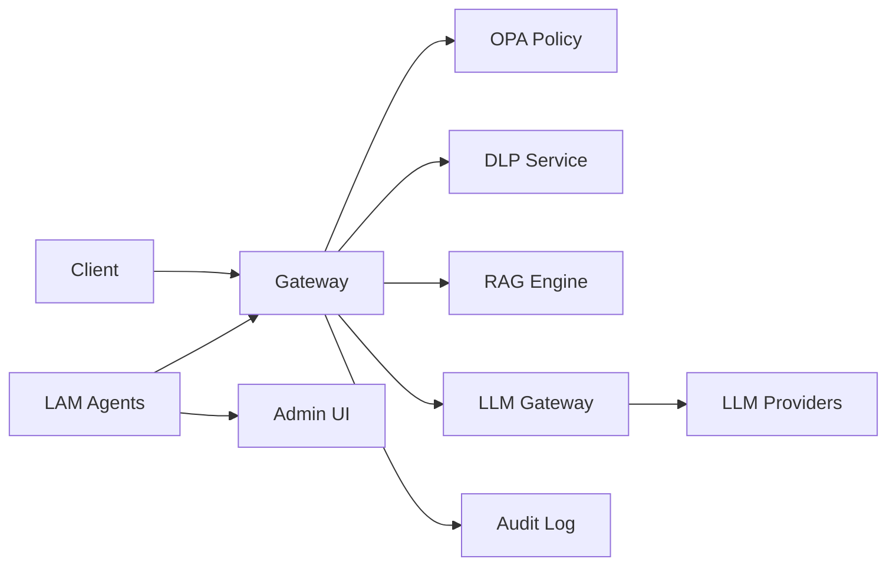

# SDLP Core Integration (RAG, DLP, OPA, LAM)

This document describes how RAG, DLP, OPA, and the Learning Engine (LAM) are intended to integrate with the Gateway and Admin UI, and the current status.

## Target architecture

- **Gateway:** Entry point; enforces auth, calls OPA for policy, can call DLP for scan/redact and RAG for retrieval before or after LLM.
- **OPA:** Policy evaluation (allow/deny, data minimization) in the request path.
- **DLP:** PII detection and redaction/tokenization; can run on request and/or response.
- **RAG:** Retrieval-augmented context; Gateway or a dedicated BFF can call RAG and inject context into the LLM request.
- **LAM:** Learning Engine agents (policy tuner, cost optimizer) consume telemetry and expose recommendations; Admin UI shows insights.

## Current status

| Component | Status | Location / notes |
|-----------|--------|-------------------|
| **Gateway** | In place | `services/gateway`; has PolicyEngine (OPA client), health, audit middleware |
| **Policy (OPA)** | Partial | `internal/policy` and `internal/infrastructure/opa`; policy evaluation can be wired into route handlers |
| **DLP** | Service exists | `services/dlp`; not yet in Gateway request path; integrate via HTTP or in-process call |
| **RAG** | Service exists | `services/rag`; not yet in Gateway request path; integrate for retrieval-before-LLM flows |
| **LLM Gateway** | In place | `services/llm-gateway`; completion, usage, validation |
| **LAM** | Services exist | `services/lam-*.js`; not yet wired to Gateway telemetry or Admin UI |
| **Admin UI** | Exists | `services/admin-ui`; add policy/LAM dashboards and audit views |

## Next implementation steps

1. **OPA in request path:** In Gateway, before proxying to LLM or RAG, call `PolicyEngine.Evaluate()` (or OPA client) with request context; deny or allow and optionally attach policy metadata for audit.
2. **DLP in request path:** Add an optional step in Gateway or LLM Gateway that sends request payload to DLP for scan/redact, then forwards the redacted payload to the LLM provider.
3. **RAG in request path:** For “retrieve then complete” flows, Gateway (or BFF) calls RAG with query, gets context, and injects it into the LLM request (e.g. as system or user message).
4. **LAM + Admin UI:** Expose LAM outputs (e.g. cost or policy recommendations) via an API and surface them in Admin UI (dashboards, “recommendations” panel).
5. **Audit:** Ensure all policy, DLP, and LAM-related decisions are written to the audit log (Gateway/LLM Gateway already have audit middleware; extend payload where needed).

## References

- [SPRINTS_PLAN.md](./SPRINTS_PLAN.md) — S5–S10 for RAG, LLM Gateway, OPA, LAM
- [VISION.md](./VISION.md) — SDLP v3 and 5-year roadmap
- Gateway: `services/gateway/internal/policy`, `services/gateway/internal/infrastructure/opa`
- DLP: `services/dlp`
- RAG: `services/rag`
- LAM: `services/lam-*.js`
- Admin UI: `services/admin-ui`
