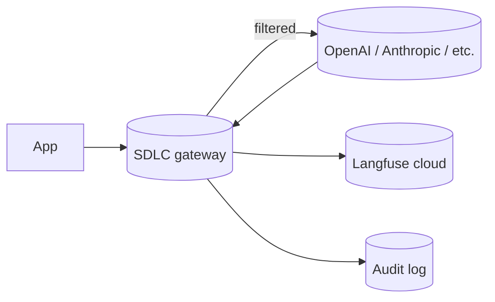
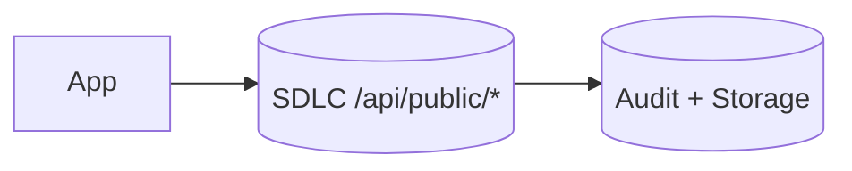

# Langfuse compatibility

The SDLC gateway exposes a subset of the [Langfuse](https://langfuse.com) public API at `/api/public/*`. Existing applications that use the Langfuse SDK can repoint `LANGFUSE_HOST` at SDLC and gain inline DLP, OPA policy enforcement, and audit logging on their LLM telemetry **without code changes**.

## Supported endpoints

| Endpoint | Method | Behavior |
|----------|--------|----------|
| `/api/public/traces` | POST | Validates JSON, dispatches to TraceSink (forwards to gateway events bus) |
| `/api/public/scores` | POST | Validates `traceId` + `name`, dispatches to ScoreSink |
| `/api/public/prompts` | GET | Returns latest version (or `?version=N` exact match) |
| `/api/public/prompts` | POST | Stores new version; auto-increments when `version` omitted |

## Auth

The shim accepts both Langfuse-style Basic auth and SDLC bearer tokens:

```bash
# Langfuse style
curl https://api.sdlc.cc/api/public/traces \
  -u "$PUBLIC_KEY:$SECRET_KEY" \
  -H 'Content-Type: application/json' \
  -d '{"id":"trace-1","name":"chat-completion"}'

# SDLC bearer
curl https://api.sdlc.cc/api/public/traces \
  -H "Authorization: Bearer $SDLC_API_KEY" \
  -H 'Content-Type: application/json' \
  -d '{"id":"trace-1","name":"chat-completion"}'
```

## Drop-in for the Langfuse Python SDK

```python
from langfuse import Langfuse

client = Langfuse(
    host="https://api.sdlc.cc",
    public_key="pk_xxx",
    secret_key="sk_xxx",
)
client.trace(id="trace-1", name="chat", input={"q": "..."})
client.score(trace_id="trace-1", name="quality", value=0.9)
```

## Reference architectures

### Pattern A — defense in depth



The app talks to SDLC for LLM calls; SDLC enforces DLP / policy and forwards traces to Langfuse for observability. Two systems, no overlap.

### Pattern B — drop-in replacement



The app keeps using the Langfuse SDK; `LANGFUSE_HOST` points at SDLC. SDLC is the only telemetry sink. Use this when you want one bill, one policy surface, one audit log.

## Gaps versus the full Langfuse API

The shim implements the 80% subset (traces, scores, prompts) that almost every Langfuse user touches. Endpoints not implemented today:

- `/api/public/datasets/*`
- `/api/public/observations/*`
- `/api/public/sessions/*`
- `/api/public/projects/*`

Open an issue if any of these block adoption — we ship in dependency order.
