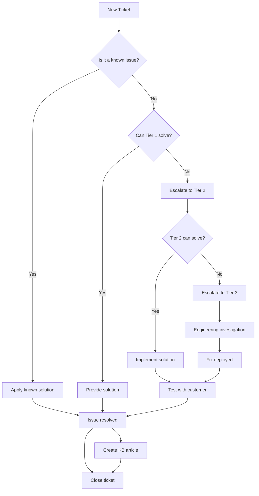

# Support Processes and Documentation

## Table of Contents
1. [Support Overview](#support-overview)
2. [Support Tiers](#support-tiers)
3. [Issue Management Process](#issue-management-process)
4. [Escalation Paths](#escalation-paths)
5. [SLAs and Response Times](#slas-and-response-times)
6. [Support Channels](#support-channels)
7. [Knowledge Base Management](#knowledge-base-management)
8. [Customer Onboarding](#customer-onboarding)
9. [Incident Management](#incident-management)
10. [Support Metrics and KPIs](#support-metrics-and-kpis)

---

## Support Overview

### Mission Statement
Our support team is committed to ensuring customer success by providing timely, effective, and empathetic assistance to resolve issues, answer questions, and help customers get the most value from SDLC.ai.

### Support Values
- **Customer First**: Every decision is made with the customer's success in mind
- **Ownership**: We take full responsibility for resolving issues completely
- **Empathy**: We understand and acknowledge the customer's situation
- **Continuous Improvement**: We learn from every interaction to improve our service
- **Collaboration**: We work together internally and with customers to find solutions

### Support Scope
**Included in Support:**
- API usage and troubleshooting
- SDK integration assistance
- Configuration and setup help
- Performance optimization guidance
- Security and compliance questions
- Feature documentation and best practices
- Bug reporting and resolution

**Not Included in Support:**
- Custom development services
- Third-party integration development
- Customer application code review
- Training on general programming concepts
- Hardware or infrastructure issues outside our control

---

## Support Tiers

### Tier 1: First Response Support
**Responsibilities:**
- Initial ticket triage and categorization
- Answering frequently asked questions
- Resolving simple technical issues
- Guiding customers to documentation
- Creating knowledge base articles from common issues
- Escalating complex issues to Tier 2

**Required Skills:**
- Strong communication and empathy
- Basic technical knowledge of APIs and SDKs
- Familiarity with all documentation
- Ticket system proficiency
- Problem-solving approach

**Average Resolution Time:** 30 minutes
**First Response SLA:** 1 hour (Free), 30 minutes (Pro), 15 minutes (Enterprise)

### Tier 2: Technical Support
**Responsibilities:**
- Handling escalated technical issues
- Debugging API and SDK problems
- Analyzing logs and error messages
- Reproducing customer issues
- Working with engineering on bug fixes
- Creating detailed bug reports
- Following up with customers on complex issues

**Required Skills:**
- Deep technical knowledge of SDLC.ai platform
- Proficiency in multiple programming languages
- Understanding of cloud infrastructure
- API debugging skills
- Log analysis experience

**Average Resolution Time:** 4 hours
**Response SLA:** 4 hours (Pro), 2 hours (Enterprise)

### Tier 3: Engineering Support
**Responsibilities:**
- Handling critical system issues
- Investigating platform bugs
- Code-level debugging
- Performance optimization
- Security incident response
- Feature request evaluation
- Architectural guidance

**Required Skills:**
- Expert knowledge of SDLC.ai codebase
- System architecture understanding
- Performance tuning expertise
- Security knowledge
- Cross-functional collaboration

**Resolution Time:** Varies based on complexity
**Response SLA:** 24 hours (Enterprise critical issues)

---

## Issue Management Process

### 1. Issue Creation
All issues must be created through one of our official channels:
- Support portal (https://support.sdlc.cc)
- Email (support@sdlc.cc)
- Slack community (community.sdlc.cc)
- In-app support widget

**Required Information for New Tickets:**
- Customer name and account
- Contact information
- Issue category (Bug, Question, Feature Request, Account Issue)
- Priority (Low, Medium, High, Critical)
- Detailed description
- Steps to reproduce (for bugs)
- Expected vs actual behavior
- Environment details (SDK version, API endpoints used)
- Attachments (logs, screenshots, code samples)

### 2. Triage Process
**Step 1: Initial Assessment (5 minutes)**
- Check customer's support tier
- Verify account status
- Determine urgency based on description
- Look for duplicate tickets

**Step 2: Categorization (5 minutes)**
- Assign category and subcategory
- Tag with relevant keywords
- Determine appropriate tier
- Set initial priority

**Step 3: Routing (5 minutes)**
- Route to appropriate queue
- Check agent availability
- Consider customer time zone
- Acknowledge receipt to customer

### 3. Issue Workflow


### 4. Priority Matrix
| Priority | Response Time | Resolution Target | Examples |
|----------|----------------|-------------------|----------|
| Critical | 15 minutes | 4 hours | Production down, data loss, security breach |
| High | 1 hour | 8 hours | Feature broken, significant impact |
| Medium | 4 hours | 24 hours | Feature not working, workaround available |
| Low | 24 hours | 72 hours | General question, minor issues |

### 5. SLA Tracking
- SLA clock starts when ticket is created
- Paused when waiting for customer response
- Tracks both response and resolution times
- Automatic alerts when approaching SLA breach
- Weekly SLA compliance reports

---

## Escalation Paths

### Automatic Escalation Triggers
1. **Time-based**: No response within SLA
2. **Customer request**: Customer explicitly requests escalation
3. **Priority change**: Issue severity increases
4. **Repeated issues**: Same customer reports similar issue >3 times
5. **Public impact**: Issue affects multiple customers

### Escalation Process
**Tier 1 to Tier 2:**
- Notify Tier 2 lead via Slack
- Provide full context and customer history
- Schedule handoff meeting if needed
- Document all attempted solutions

**Tier 2 to Tier 3:**
- Create detailed bug report with reproduction steps
- Include logs, metrics, and customer impact
- Schedule emergency triage if critical
- Notify customer of escalation

**Management Escalation:**
- Involve support manager for customer complaints
- Escalate to CTO for platform-wide issues
- Board notification for critical incidents

### Customer Communication During Escalation
- Inform customer of escalation
- Set new expectations for timeline
- Provide escalation reference number
- Assign dedicated point of contact
- Schedule regular updates

---

## SLAs and Response Times

### Service Level Agreements by Tier

#### Free Tier
- **First Response**: 24 hours
- **Resolution**: Best effort
- **Channels**: Email, Community Forum
- **Business Hours**: Mon-Fri, 9 AM - 5 PM PST

#### Professional Tier ($99/month)
- **First Response**: 8 hours
- **Resolution**: 48 hours
- **Channels**: Email, Priority Support
- **Business Hours**: Mon-Fri, 9 AM - 6 PM PST
- **Phone Support**: Available for additional fee

#### Enterprise Tier
- **Critical Issues**: 1 hour response, 4 hour resolution
- **High Priority**: 2 hour response, 8 hour resolution
- **Normal Priority**: 4 hour response, 24 hour resolution
- **Low Priority**: 24 hour response, 72 hour resolution
- **Channels**: Email, Phone, Slack, Dedicated Account Manager
- **Availability**: 24/7/365

### SLA Credits
If we fail to meet our SLAs:
- **Response Time Credit**: 10% of monthly fee per breach
- **Resolution Time Credit**: 20% of monthly fee per breach
- **Multiple Breaches**: Maximum 50% of monthly fee
- **Process**: Automatically applied, no action required

### SLA Exclusions
SLAs do not apply to:
- Issues caused by customer's code or infrastructure
- Third-party service outages
- Planned maintenance windows
- Beta features or preview releases
- Issues outside our control (force majeure)

---

## Support Channels

### 1. Support Portal
**URL**: https://support.sdlc.cc
**Features**:
- Ticket creation and tracking
- Knowledge base search
- Community forum access
- System status dashboard
- Account management

**Best For**: All issue types, comprehensive tracking

### 2. Email Support
**Address**: support@sdlc.cc
**Features**:
- Detailed issue description with attachments
- Thread-based conversation
- Automatic ticket creation
- 25MB attachment limit

**Best For**: Complex issues requiring detailed explanation

### 3. Community Forum
**URL**: https://community.sdlc.cc
**Features**:
- Peer-to-peer support
- SDLC.ai team participation
- Feature request voting
- Best practices sharing

**Best For**: General questions, best practices, community wisdom

### 4. Slack Community
**Invite**: https://sdlc.cc/slack
**Channels**:
- #general: General discussion
- #help: Quick questions
- #api: API-specific questions
- #sdks: SDK implementation help
- #feature-requests: New feature ideas

**Best For**: Real-time help, quick questions

### 5. Phone Support (Enterprise Only)
**Number**: 1-800-SDLC-AI
**Availability**: 24/7 for Enterprise
**Features**:
- Direct access to support engineers
- Screen sharing capabilities
- Emergency support line

**Best For**: Critical issues, urgent problems

### 6. In-App Support Widget
**Integration**: Embedded in SDLC.ai dashboard
**Features**:
- Context-aware help
- Suggested articles
- Quick ticket creation
- Live chat (Pro and Enterprise)

**Best For**: Immediate help while using the platform

---

## Knowledge Base Management

### KB Article Creation Process
1. **Identify Need**: Repetitive questions or complex solutions
2. **Assign Writer**: Based on expertise
3. **Draft Article**: Clear, step-by-step instructions
4. **Internal Review**: Technical accuracy check
5. **Edit for Clarity**: Ensure easy understanding
6. **Add Screenshots**: Visual aids where helpful
7. **SEO Optimization**: Proper keywords and tags
8. **Publish**: Make available to customers
9. **Link in Tickets**: Reference in support responses
10. **Review Monthly**: Update for accuracy

### KB Article Template
```markdown
# [Article Title]

## Overview
[Brief description of what the article covers]

## Prerequisites
[What the user needs before starting]

## Step-by-Step Instructions
1. [First step with details]
2. [Second step with details]
   - Substep 1
   - Substep 2
3. [Continue as needed]

## Common Issues
[List common problems and solutions]

## Best Practices
[Additional tips and recommendations]

## Related Articles
[Link to related KB articles]

## Need More Help?
[Link to support channels]
```

### KB Categories
- **Getting Started**: Onboarding and initial setup
- **API Reference**: Detailed API documentation
- **SDK Guides**: Language-specific implementation
- **Troubleshooting**: Common issues and solutions
- **Best Practices**: Optimization and recommendations
- **Security**: Authentication and data protection
- **Integration**: Third-party service connections
- **Advanced**: Complex use cases and features

### KB Metrics Tracked
- Article views and unique visitors
- Search terms leading to articles
- Time on page
- "Was this helpful?" ratings
- Comments and feedback
- Link clicks from support tickets
- Reduction in related support tickets

---

## Customer Onboarding

### Onboarding Timeline
**Day 1: Welcome Package**
- Account setup confirmation
- Welcome email with getting started guide
- Dedicated account manager assignment (Enterprise)
- Calendar invites for onboarding sessions

**Day 2: Platform Overview**
- 30-minute introductory call
- Dashboard walkthrough
- API key generation
- SDK installation guidance

**Day 3: First Integration**
- Technical implementation call
- First API call walkthrough
- Document upload demonstration
- Q&A session

**Day 7: Check-in**
- Progress review
- Issue resolution
- Advanced feature introduction
- Success metrics discussion

**Day 30: Success Review**
- Usage analysis
- Optimization recommendations
- Training on advanced features
- Long-term planning

### Onboarding Deliverables
1. **Welcome Kit**
   - Platform overview deck
   - Quick start guide
   - API cheat sheet
   - Best practices document

2. **Technical Resources**
   - Postman collection
   - Sample code repository
   - Integration checklist
   - Testing environment

3. **Training Materials**
   - Video tutorials
   - Interactive guides
   - Documentation access
   - Community forum invitation

### Onboarding Checklist
- [ ] Account created and verified
- [ ] Billing information updated
- [ ] API keys generated
- [ ] SDK installed
- [ ] First document uploaded
- [ ] First query executed
- [ ] Team members added
- [ ] Integrations configured
- [ ] Monitoring set up
- [ ] Training completed

---

## Incident Management

### Incident Classification
**Severity 1 - Critical**
- Service completely unavailable
- Data loss or corruption
- Security breach
- Impact: All customers affected

**Severity 2 - High**
- Major feature unavailable
- Significant performance degradation
- Partial data inconsistency
- Impact: Many customers affected

**Severity 3 - Medium**
- Minor feature issues
- Performance slightly degraded
- Workaround available
- Impact: Some customers affected

**Severity 4 - Low**
- Cosmetic issues
- Documentation errors
- Minor inconvenience
- Impact: Few customers affected

### Incident Response Process
1. **Detection**
   - Monitoring alerts
   - Customer reports
   - Internal discovery
   - Third-party notification

2. **Assessment** (5 minutes)
   - Verify incident
   - Determine scope
   - Classify severity
   - Identify affected systems

3. **Mobilization** (5 minutes)
   - Activate incident response team
   - Establish war room (Slack channel)
   - Assign incident commander
   - Notify stakeholders

4. **Communication** (10 minutes)
   - Update status page
   - Send email notifications
   - Post in community forums
   - Contact enterprise customers

5. **Mitigation** (Varies)
   - Implement temporary fix
   - Restore service
   - Verify functionality
   - Monitor closely

6. **Resolution**
   - Implement permanent fix
   - Test thoroughly
   - Deploy to production
   - Confirm resolution

7. **Post-Mortem**
   - Timeline creation
   - Root cause analysis
   - Improvement identification
   - Documentation updates

### Incident Communication Templates

**Initial Alert (Severity 1)**
```
🚨 INCIDENT ALERT - SERVICE UNAVAILABLE

We are currently experiencing a service outage affecting 
all SDLC.ai services. Our team is actively investigating.

Start Time: 2025-01-15 10:30 AM PST
Impact: All services unavailable
Next Update: 30 minutes

Status Page: https://status.sdlc.cc
```

**Update Template**
```
🔄 INCIDENT UPDATE

Summary: [Brief update on progress]
Actions Taken: [What we've done]
Next Steps: [What we're doing next]
ETA: [If available]

Thank you for your patience.
```

**Resolution Template**
```
✅ INCIDENT RESOLVED

The service outage has been resolved. All systems are 
operational.

Duration: 2 hours 15 minutes
Root Cause: [Brief explanation]
Prevention: [How we'll prevent this]

We apologize for the disruption.
```

---

## Support Metrics and KPIs

### Operational Metrics
**Response Metrics**
- First Response Time (FRT)
- Average Response Time (ART)
- SLA Compliance Rate
- Abandonment Rate

**Resolution Metrics**
- First Contact Resolution (FCR)
- Average Resolution Time
- Backlog Count
- Resolution Rate

**Quality Metrics**
- Customer Satisfaction (CSAT)
- Net Promoter Score (NPS)
- Quality Assurance Score
- Knowledge Base Feedback

**Efficiency Metrics**
- Tickets per Agent
- Handle Time
- Reassignment Rate
- Escalation Rate

### Dashboard Metrics
Updated daily and reviewed in team meetings:
```
Current Status:
- Open Tickets: 47 (35 normal, 8 high, 4 critical)
- Agents Available: 6/8
- Average Wait Time: 3 minutes
- SLA Compliance: 94%

Today's Performance:
- New Tickets: 82
- Resolved Tickets: 76
- CSAT Score: 4.6/5
- FCR Rate: 78%
```

### Reporting Schedule
- **Daily**: Team huddle with key metrics
- **Weekly**: Detailed performance report
- **Monthly**: Trend analysis and improvement plans
- **Quarterly**: Strategic review with leadership
- **Annually**: Service level agreement review

### Continuous Improvement
- Monthly process review meetings
- Quarterly training updates
- Annual tool evaluation
- Customer feedback integration
- Industry benchmark comparison

---

## Contact Information

### Support Team
- **Support Manager**: Sarah Chen (sarah.chen@sdlc.cc)
- **Tier 2 Lead**: Michael Rodriguez (michael.r@sdlc.cc)
- **Enterprise Support**: enterprise@sdlc.cc
- **Critical Issues**: 1-800-SDLC-AI option 1

### Emergency Contacts
- **On-Call Engineer**: Pager: 555-0123
- **Security Incident**: security@sdlc.cc
- **Data Breach**: incident@sdlc.cc

### Office Locations
- **Headquarters**: San Francisco, CA
- **EMEA Support**: London, UK
- **APAC Support**: Singapore

---

*Document Version: 2.0*
*Last Updated: November 2025*
*Next Review: December 2025*