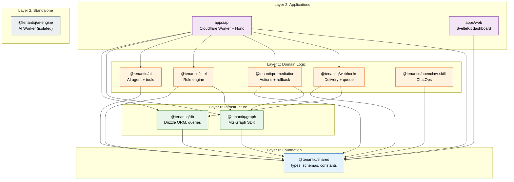
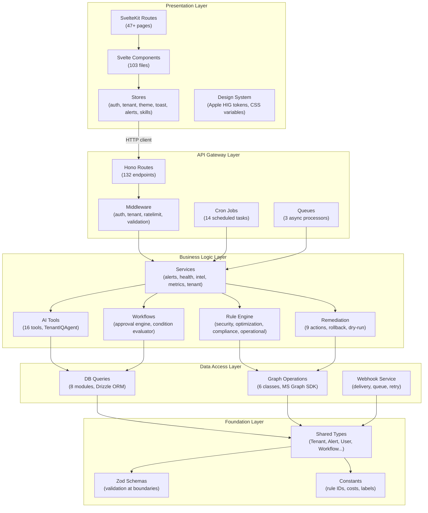

# TenantIQ Code Map

> Generated 2026-03-29 | 382+ files | 21,000+ LOC | 10 packages + 2 apps

---

## 1. Annotated File Tree

### apps/api/ — Cloudflare Workers + Hono (289 files)

```
apps/api/src/
├── index.ts                              # Worker entry: fetch, scheduled, queue handlers
├── types.ts                              # Global type definitions
├── app/
│   ├── create-app.ts                     # Hono app initialization + middleware chain
│   ├── register-routes.ts                # Route registration (all 132 routes)
│   ├── types.ts                          # Env & AppVariables types
│   └── worker-handlers.ts               # Scheduled/queue handler wiring
├── api/billing/
│   ├── checkout.ts                       # LemonSqueezy checkout flow
│   ├── plans.ts                          # Plan definitions
│   ├── types.ts                          # Billing types
│   └── webhook.ts                        # LemonSqueezy webhook handler
├── durable-objects/
│   └── tenant-events.ts                  # Durable Object: tenant event storage
├── middleware/ (14 files)
│   ├── auth.middleware.ts                # Clerk JWT validation
│   ├── auth.ts                           # Token extraction + user context
│   ├── cache.ts                          # Response caching
│   ├── performance.ts                    # Performance tracking
│   ├── rateLimit.middleware.ts           # Rate limiting
│   ├── request-id.ts                     # Request ID injection
│   ├── security-headers.ts              # Security headers (CSP, HSTS)
│   ├── skill-gate.ts                     # Feature paywall middleware
│   ├── tenant.ts                         # Multi-tenant context injection
│   └── validation.middleware.ts          # Zod request validation
├── routes/ (132 route files)
│   ├── ai.ts, ai-streaming.ts           # AI chat + streaming endpoints
│   ├── ai-export.ts, ai-engine.ts       # AI export + engine routes
│   ├── alerts.ts, alert-analytics.ts    # Alert CRUD + analytics
│   ├── anomaly-detection.ts             # Behavior anomaly detection
│   ├── auth.ts, auth-callback.ts        # OAuth flow
│   ├── backup-health.ts                 # Backup status endpoints
│   ├── billing.ts                        # Billing management
│   ├── cis-benchmark.ts                 # CIS scan trigger + results
│   ├── compliance-posture.ts            # Compliance framework status
│   ├── cost-optimization.ts             # License cost analysis
│   ├── governance.ts                     # Workspace governance
│   ├── health.ts, health-detailed.ts    # Health checks
│   ├── intelligence.ts                   # AI intelligence endpoints
│   ├── license-autopilot.ts             # Auto license optimization
│   ├── licenses.ts                       # License management
│   ├── marketplace.ts                    # Skill marketplace
│   ├── migration.ts                      # Data migration
│   ├── onboarding.ts                     # Onboarding flow
│   ├── remediations.ts                   # Remediation execution
│   ├── remediations-dryrun.ts           # Dry-run preview
│   ├── security.ts                       # Security overview
│   ├── security-compliance.ts           # Compliance endpoints
│   ├── storage-analytics.ts             # Storage usage analysis
│   ├── tenants.ts                        # Tenant dashboard + sync
│   ├── team.ts                           # Team management
│   ├── users.ts                          # User management
│   ├── workflows.ts                      # Workflow CRUD
│   ├── webhooks.ts                       # Webhook management
│   ├── zero-trust.ts                     # Zero trust assessment
│   ├── tenants/                          # Tenant sub-routes
│   │   ├── profile.ts                    # Tenant profile
│   │   ├── purview.ts, purview-data.ts  # Purview compliance
│   │   ├── threat-mapper.ts             # Threat mapping
│   │   ├── ueba-data.ts                 # User behavior analytics
│   │   ├── webhooks.ts                  # Tenant webhooks
│   │   └── skills-data.ts              # Skills data
│   ├── webhooks/                         # OpenClaw webhooks
│   │   ├── openclaw.ts                  # OpenClaw handler
│   │   ├── openclaw-delivery.ts         # Delivery tracking
│   │   └── openclaw-helpers.ts          # Helper utilities
│   └── platform/                         # Platform admin routes
│       ├── auth.ts, auth-helpers.ts     # Platform auth
│       ├── organizations.ts             # Org management
│       ├── subscriptions.ts             # Subscription management
│       ├── users.ts                      # Platform user management
│       └── admin-stats.ts              # Admin analytics
├── lib/ (55 core utility files)
│   ├── db.ts                             # Database connection factory
│   ├── logger.ts                         # Structured logging
│   ├── auth.ts                           # Auth logic
│   ├── constants.ts                      # API constants
│   ├── sentry.ts                         # Error tracking
│   ├── ai-anthropic.ts                  # Claude API integration
│   ├── ai-context.ts                    # LLM context builder
│   ├── ai-handlers.ts                   # AI tool call dispatcher
│   ├── graph-client.ts                  # MS Graph client wrapper
│   ├── graph-client-extended.ts         # Extended Graph operations
│   ├── graph-sync.ts                    # Bulk sync engine
│   ├── compliance-frameworks.ts         # GDPR, HIPAA, SOC2 mapping
│   ├── secure-score.ts                  # Secure score calculation
│   ├── cis/
│   │   ├── control-definitions.ts       # 100+ CIS controls
│   │   ├── scanner.ts                   # CIS benchmark scanner
│   │   └── federated-identity-auditor.ts
│   ├── compliance/
│   │   ├── gdpr-engine.ts              # GDPR compliance engine
│   │   ├── hipaa-engine.ts             # HIPAA compliance engine
│   │   └── soc2-engine.ts             # SOC2 compliance engine
│   ├── security/
│   │   ├── zero-trust-engine.ts        # Zero trust assessment
│   │   └── zero-trust-pillars.ts       # Zero trust pillar definitions
│   ├── snapshots/
│   │   ├── capture.ts                   # Config snapshot capture
│   │   ├── diff.ts                      # Snapshot diff engine
│   │   └── drift-detector.ts           # Config drift detection
│   ├── backup/
│   │   ├── content-backup.ts           # Content backup service
│   │   └── delta-sync.ts              # Incremental sync
│   ├── governance/
│   │   └── workspace-sync.ts           # Workspace governance sync
│   ├── lifecycle/
│   │   └── step-handlers.ts            # User lifecycle (10 Graph actions)
│   ├── workflows/
│   │   ├── approval-engine.ts          # Approval routing
│   │   └── condition-evaluator.ts      # Dynamic conditions
│   ├── lemonsqueezy.ts                  # Billing integration
│   ├── email-service.ts                 # Email via Resend
│   └── webhook-processor.ts             # Webhook processing
├── services/ (6 core services)
│   ├── alerts.ts                         # Alert management service
│   ├── health-score.ts                  # Health score computation
│   ├── intelligence-engine.ts           # Intel synthesis
│   ├── metrics.ts                        # Metrics collection
│   ├── tenant-provisioning.ts           # Tenant onboarding
│   └── tenant.ts                         # Tenant operations
├── cron/ (14 scheduled jobs)
│   ├── compliance-scan.ts               # Scheduled compliance scans
│   ├── drift-detection.ts              # Config drift checks
│   ├── group-cleanup.ts                # Stale group cleanup
│   ├── guest-review.ts                 # Guest user review
│   ├── nightly-backup.ts              # Nightly backups
│   ├── scheduled-remediation.ts        # Scheduled remediations
│   ├── scheduled-scans.ts             # Periodic security scans
│   ├── security-scan.ts               # Security scan runner
│   ├── user-sync.ts                    # User data sync
│   ├── webhook-retry.ts               # Failed webhook retry
│   └── workflow-trigger.ts            # Scheduled workflow triggers
└── queues/ (3 async processors)
    ├── notification-sender.ts           # Notification delivery
    ├── remediation-executor.ts          # Remediation action runner
    └── scan-processor.ts               # Scan result processor
```

### apps/web/ — SvelteKit 2.15 + Svelte 5 (103 components, 47+ routes)

```
apps/web/src/
├── app.css                               # Global CSS: Apple HIG tokens, dark/light mode
├── app.d.ts                              # SvelteKit type declarations
├── app.html                              # HTML template
├── lib/
│   ├── analytics.ts                      # Plausible/PostHog tracking
│   ├── sentry-client.ts                 # Error tracking init
│   ├── api/
│   │   └── client.ts                    # HTTP client (auth headers, token refresh, tenant context)
│   ├── config/
│   │   └── plan-limits.ts              # Plan tier limits & feature flags
│   ├── design-system/
│   │   └── tokens.ts                    # Apple HIG design tokens (colors, typography, spacing)
│   ├── stores/ (6 stores)
│   │   ├── auth.ts                      # User auth state + token
│   │   ├── tenant.ts                    # Current tenant context
│   │   ├── theme.ts                     # Dark/light/auto mode
│   │   ├── toast.ts                     # Notification queue
│   │   ├── alerts.ts                    # Active security alerts
│   │   └── skills.ts                    # 54 skills, promo codes, access control
│   ├── utils/
│   │   ├── export.ts                    # CSV/JSON/PDF export
│   │   ├── focus-trap.ts              # Accessibility focus management
│   │   ├── format.ts                   # Date/number formatting
│   │   └── sse.ts                      # Server-sent events client
│   └── components/ (103 Svelte files in 57 subdirectories)
│       ├── ui/                           # Primitives
│       │   ├── Button.svelte            # Apple HIG button (primary, secondary, destructive, ghost)
│       │   ├── Card.svelte              # Card container (default, elevated, outlined, flat)
│       │   ├── CopyButton.svelte        # Copy-to-clipboard
│       │   ├── ExportMenu.svelte        # Export dropdown
│       │   └── ToastContainer.svelte    # Toast renderer
│       ├── landing/ (10)                 # Public marketing pages
│       │   ├── LandingNav.svelte
│       │   ├── HeroSection.svelte
│       │   ├── FeaturesSection.svelte
│       │   ├── AISection.svelte
│       │   ├── PricingSection.svelte
│       │   ├── TestimonialsSection.svelte
│       │   └── LandingFooter.svelte
│       ├── onboarding/ (6)               # Setup wizard
│       │   ├── OnboardingWizard.svelte
│       │   ├── WelcomeStep.svelte
│       │   ├── CompanyProfileStep.svelte
│       │   ├── SyncStep.svelte
│       │   └── ResultsStep.svelte
│       ├── dashboard/ (3)                # Dashboard widgets
│       │   ├── LicenseUtilization.svelte
│       │   ├── RiskyUsersList.svelte
│       │   └── QuickActions.svelte
│       ├── cis/ (3)                      # CIS benchmark
│       │   ├── ControlTable.svelte
│       │   ├── CriticalFixSummary.svelte
│       │   └── SectionScoreCard.svelte
│       ├── email/ (4)                    # Email security
│       │   ├── MailAuthStatus.svelte
│       │   ├── ThreatTable.svelte
│       │   └── ThreatSummaryCards.svelte
│       ├── backup/ (6)                   # Backup management
│       │   ├── BackupCard.svelte
│       │   ├── BackupHealthPanel.svelte
│       │   ├── SnapshotCard.svelte
│       │   ├── RestoreModal.svelte
│       │   └── DiffViewer.svelte
│       ├── openclaw/ (10)                # ChatOps integration
│       │   ├── OverviewTab.svelte
│       │   ├── ChannelsTab.svelte
│       │   ├── SkillsTab.svelte
│       │   ├── WebhookConfig.svelte
│       │   └── InstallationGuide.svelte
│       ├── skills/ (3)                   # Skill marketplace
│       │   ├── SkillGate.svelte
│       │   ├── SkillCard.svelte
│       │   └── SkillRecommendation.svelte
│       ├── ai/ (3)                       # AI chat
│       │   ├── ChatTab.svelte
│       │   ├── SuggestedActions.svelte
│       │   └── ToolExecutionCard.svelte
│       ├── settings/ (4)                 # Settings panels
│       │   ├── AIProviderSettings.svelte
│       │   ├── BillingPlans.svelte
│       │   ├── TenantList.svelte
│       │   └── WebhookSettings.svelte
│       ├── msp/ (2)                      # MSP tools
│       │   ├── MspComparisonTable.svelte
│       │   └── ClientReportGenerator.svelte
│       └── (30 root-level components)
│           ├── Sidebar.svelte            # Main nav (27 links, lucide icons)
│           ├── DashboardContent.svelte   # Dashboard main content
│           ├── MetricCard.svelte         # Reusable metric widget
│           ├── ScoreRing.svelte          # Circular score display
│           ├── SeverityBadge.svelte      # Severity indicator
│           ├── AlertCard.svelte          # Alert display
│           ├── TenantSwitcher.svelte     # Org/tenant switcher
│           ├── ThemeToggle.svelte        # Dark/light toggle
│           ├── NotificationBell.svelte   # Notification dropdown
│           ├── TrialGate.svelte          # Trial paywall
│           ├── ConfirmModal.svelte       # Confirmation dialog
│           └── KeyboardShortcuts.svelte  # Keyboard shortcuts help
└── routes/ (47+ pages)
    ├── +layout.svelte                    # Root layout: Sidebar, auth, SSE
    ├── +layout.ts                        # SSR disabled (ssr = false)
    ├── +page.svelte                      # Dashboard / Onboarding
    ├── +error.svelte                     # Error page
    ├── ai/+page.svelte                   # AI Autopilot
    ├── alerts/+page.svelte               # Alert management
    ├── audit/+page.svelte                # Audit & compliance
    ├── audit/history/+page.svelte        # Audit history
    ├── backups/+page.svelte              # Backup management
    ├── backups/config/+page.svelte       # Backup config
    ├── behavior/+page.svelte             # Behavior analytics
    ├── governance/+page.svelte           # Workspace governance
    ├── governance/storage/+page.svelte   # Storage analytics
    ├── licenses/+page.svelte             # License optimization
    ├── marketplace/+page.svelte          # Skill marketplace
    ├── msp/+page.svelte                  # MSP dashboard
    ├── msp/benchmark/+page.svelte        # MSP benchmarking
    ├── msp/profit/+page.svelte           # MSP profit analytics
    ├── platform/+page.svelte             # Platform admin
    ├── platform/admin/+page.svelte       # Admin dashboard
    ├── reports/+page.svelte              # Executive reports
    ├── reports/builder/+page.svelte      # Report builder
    ├── sdlc/+page.svelte                 # AI compliance (SDLC)
    ├── security/+page.svelte             # Security hub
    ├── security/cis/+page.svelte         # CIS benchmark
    ├── security/compliance/+page.svelte  # Compliance dashboard
    ├── security/copilot/+page.svelte     # Copilot readiness
    ├── security/copilot-usage/+page.svelte
    ├── security/dashboard/+page.svelte   # Security dashboard
    ├── security/email/+page.svelte       # Email security
    ├── security/purview/+page.svelte     # Purview compliance
    ├── security/signin-logs/+page.svelte # Sign-in logs
    ├── security/zero-trust/+page.svelte  # Zero trust
    ├── settings/+page.svelte             # Settings
    ├── skills/+page.svelte               # Skills hub
    ├── team/+page.svelte                 # Team management
    ├── threats/+page.svelte              # Threat detection
    ├── workflows/+page.svelte            # Workflows hub
    ├── workflows/approvals/+page.svelte  # Approval workflows
    ├── workflows/lifecycle/+page.svelte  # User lifecycle
    └── home/+page.svelte                 # Home (landing)
```

### packages/ — 10 Workspace Packages

```
packages/
├── shared/          # Layer 0 — types, Zod schemas, constants (6 files, 618 LOC)
├── db/              # Layer 0 — Drizzle ORM, 15 tables, 8 query modules (14 files, 1067 LOC)
├── graph/           # Layer 0 — MS Graph SDK wrapper, 6 operation classes (8 files, 448 LOC)
├── ai/              # Layer 1 — AI agent + 16 tool definitions (17 files, 500+ LOC)
├── intel/           # Layer 1 — Rule engine, risk prioritization (14 files, 830 LOC)
├── remediation/     # Layer 1 — 9 remediation actions + rollback (16 files, 800 LOC)
├── webhooks/        # Layer 1 — Webhook delivery + queue (12 files, 641 LOC)
├── openclaw-skill/  # Layer 1 — ChatOps skill for messaging platforms
├── ai-engine/       # Layer 2 — Standalone Cloudflare Worker (6 files, 1478 LOC)
└── (tests/)         # E2E: 127 Playwright tests across 21 sections
```

---

## 2. Module Map — Public API & Consumers

| Package | Key Exports | Consumed By |
|---------|------------|-------------|
| **@tenantiq/shared** | `Tenant`, `Alert`, `Severity`, `CachedUser`, `Organization`, `Workflow` types; Zod schemas (`tenantOnboardSchema`, `aiChatMessageSchema`); Constants (`RULE_IDS`, `LICENSE_COSTS`) | All packages + both apps |
| **@tenantiq/db** | `getDb()`, table schemas (`tenants`, `users`, `securityAlerts`, `webhookConfigs`), query builders (`getAllActiveTenants`, `getUsersByTenant`, `getLicensesByTenant`) | apps/api |
| **@tenantiq/graph** | `GraphClient`, `UserOperations`, `GroupOperations`, `LicenseOperations`, `SecurityOperations`, `PolicyOperations`, `ReportOperations` | apps/api, intel, remediation |
| **@tenantiq/ai** | `TenantIQAgent`, `tools`, `SYSTEM_PROMPT`; 11 granular tool exports (`cost-optimizer`, `health-score`, `executive-report`, `license-autopilot`, etc.) | apps/api |
| **@tenantiq/intel** | `RuleEngine`, `securityRules`, `optimizationRules`, `complianceRules`, `operationalRules`, `prioritizeFindings()` | apps/api |
| **@tenantiq/remediation** | `RemediationExecutor`, 9 action functions (`enableMfa`, `blockIp`, `decommissionUser`, etc.), `createRollbackPlan()`, `getDryRunResult()` | apps/api |
| **@tenantiq/webhooks** | `WebhookDeliveryService`, `WebhookQueue`, event types | apps/api |
| **@tenantiq/openclaw-skill** | `TenantIQSkill` (ChatOps commands: security, licenses, users, compliance) | External (messaging platforms) |
| **@tenantiq/ai-engine** | Hono app (standalone worker: connector-generator, query-optimizer, traffic-analyst) | Independent deployment |

---

## 3. Dependency Graph



---

## 4. Entry Points

| Component | Entry File | Exports |
|-----------|-----------|---------|
| **API Worker** | `apps/api/src/index.ts` | `fetch()`, `scheduled()`, `queue()`, `TenantEvents` DO |
| **Web App** | `apps/web/src/routes/+layout.svelte` | Root layout (auth, sidebar, SSE) |
| **@tenantiq/shared** | `packages/shared/src/index.ts` | `* from types, schemas, constants` |
| **@tenantiq/db** | `packages/db/src/index.ts` | Schema, connection, all query modules |
| **@tenantiq/graph** | `packages/graph/src/index.ts` | `GraphClient` + 6 Operation classes |
| **@tenantiq/ai** | `packages/ai/src/index.ts` | `TenantIQAgent`, `tools`, `SYSTEM_PROMPT` |
| **@tenantiq/intel** | `packages/intel/src/index.ts` | `RuleEngine`, all rule sets, prioritization |
| **@tenantiq/remediation** | `packages/remediation/src/index.ts` | `RemediationExecutor`, actions, rollback |
| **@tenantiq/webhooks** | `packages/webhooks/src/index.ts` | `WebhookDeliveryService`, `WebhookQueue` |
| **AI Engine Worker** | `packages/ai-engine/src/index.ts` | Hono app (standalone Cloudflare Worker) |

---

## 5. Shared Utilities Index

### Types (from @tenantiq/shared/types)
`Tenant`, `TenantData`, `CachedUser`, `LicenseCache`, `Alert`, `AlertCandidate`, `RemediationLog`, `AuditLogEntry`, `Workflow`, `WorkflowStep`, `WorkflowRun`, `Organization`, `PlatformUser`, `DashboardMetrics`

### Enums
`Severity` (critical | high | medium | low), `AlertCategory` (security | optimization | compliance | operational), `AlertStatus`, `RemediationType`, `TenantStatus`, `UserRole`

### Schemas (Zod validation)
`tenantOnboardSchema`, `aiChatMessageSchema`, `alertFiltersSchema`, `remediationRequestSchema`, `workflowCreateSchema`, `auditFiltersSchema`

### Constants
`RULE_IDS` (SEC_001-006, OPT_001-003, CMP_001-003, OPS_001-002, BKP_001+), `REMEDIATION_ACTION_IDS`, `LICENSE_COSTS`, severity/category label mappings

### Web Stores
| Store | State | Used By |
|-------|-------|---------|
| `auth` | `{ user, token, loading }` | All authenticated pages |
| `tenant` | `{ currentTenantId, tenants, tenantsLoading }` | API client, all tenant-scoped pages |
| `theme` | `'light' \| 'dark' \| 'auto'` | ThemeToggle, app.css |
| `toast` | `Toast[]` | ToastContainer, all pages |
| `alerts` | `Alert[]` | AlertCard, NotificationBell, SSE |
| `skills` | `Skill[]` (54 skills, 5 categories) | SkillGate, marketplace, paywall |

### Design Tokens (Apple HIG)
| Token | Value |
|-------|-------|
| Primary | #007AFF (Apple Blue) |
| Success | #34C759 (Apple Green) |
| Warning | #FF9500 (Apple Orange) |
| Danger | #FF3B30 (Apple Red) |
| Font | SF Pro Display, system-ui |
| Touch target | 44px minimum |
| Border radius | 6-20px |
| Motion | 100-400ms, ease-out |

---

## 6. Layer Architecture



---

## 7. Circular Dependency Check

**Status: CLEAN** — Zero circular dependencies detected.

The dependency DAG is strictly acyclic:

```
shared (0 deps) ← db, graph (1 dep each) ← intel, remediation, ai, webhooks (1-2 deps) ← apps/api (7 deps)
                                                                                          ← apps/web (1 dep: shared types only)
```

Import flow is always downward through the layer stack. No package imports from a package at the same or higher layer.

---

## 8. Summary Statistics

| Metric | Count |
|--------|-------|
| Total source files | 382+ |
| Total lines of code | 21,000+ |
| Workspace packages | 10 |
| Applications | 2 (API worker + SvelteKit web) |
| API route files | 132 |
| Svelte components | 103 |
| SvelteKit routes | 47+ |
| Svelte stores | 6 |
| Cron jobs | 14 |
| Async queues | 3 |
| CIS controls | 100+ |
| Remediation actions | 9 |
| AI tools | 16 |
| Skills | 54 |
| Database tables | 15 |
| Playwright E2E tests | 127 |

---

## Next Steps

```
/luna-routemap    # Map routes and navigation in detail
/luna-hld         # Generate high-level design from the code
```
