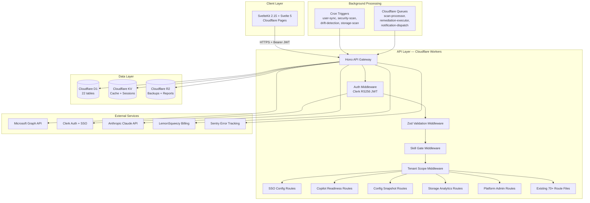
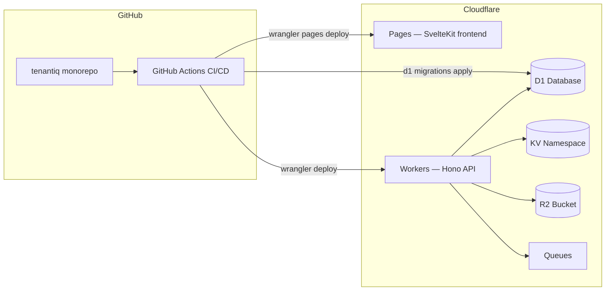
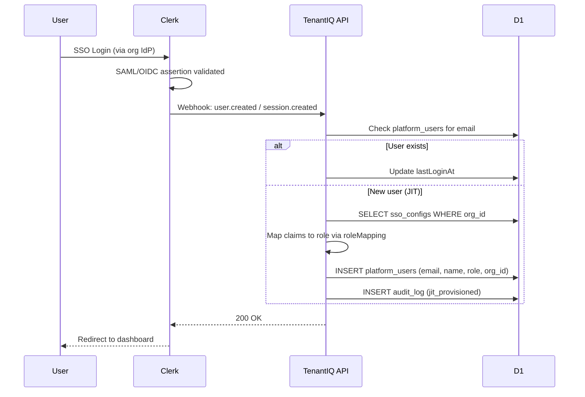
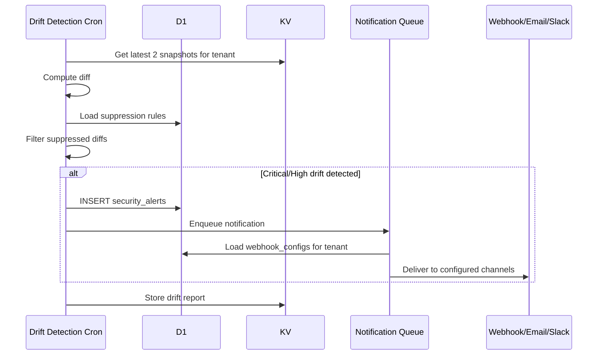
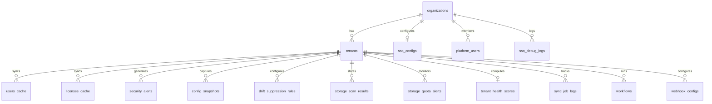

# TenantIQ Technical Design Document

**Scope**: TenantIQ / Full Project (Enterprise Readiness)
**Generated**: 2026-03-29
**Agent**: Design Architect Agent
**Based on**: requirements.md

---

## Overview

This document defines the technical design for TenantIQ's enterprise readiness milestone. It covers eight workstreams: Enterprise SAML/OIDC SSO, Copilot Readiness Assessment, Config Snapshot & Drift Detection enhancements, Storage Analytics & Quotas, Admin Panel & Observability, CI/CD Pipeline, Testing Infrastructure, and Security Hardening.

**Key architectural decisions**:
1. SSO handled via Clerk Enterprise Connections (not custom SAML/OIDC plumbing) to reduce attack surface and maintenance burden.
2. Auth migration from HS256 custom JWT to Clerk RS256 verification to align with documented architecture.
3. All new tables added to existing D1 schema via Drizzle migrations, maintaining the single-database model.
4. New features follow existing patterns: Hono route files (<200 lines), Zod validation middleware, KV caching, skill-gated access.
5. CI/CD on GitHub Actions with Cloudflare Wrangler deployment, enforcing portfolio quality gates.

---

## Architecture

### High-Level Architecture



### Deployment Architecture



### Technology Stack

- **Frontend**: SvelteKit 2.15, Svelte 5, TypeScript, Tailwind CSS
- **Backend**: Cloudflare Workers, Hono framework, TypeScript
- **Database**: Cloudflare D1 (SQLite), Drizzle ORM
- **Cache**: Cloudflare KV (tokens, sessions, scan results, feature flags)
- **Storage**: Cloudflare R2 (backups, PDF reports, snapshot exports)
- **Auth**: Clerk (RS256 JWT verification, Enterprise SSO Connections)
- **AI**: Anthropic Claude API (security analysis, report generation)
- **Billing**: LemonSqueezy (subscriptions, webhooks)
- **CI/CD**: GitHub Actions (lint, test, SAST, deploy)
- **Monitoring**: Sentry (errors), Cloudflare Analytics (performance)
- **Testing**: Vitest (unit/integration), Playwright (e2e)

---

## Feature 1: Enterprise SAML/OIDC SSO

### Design Decision: Clerk Enterprise Connections

Instead of building custom SAML/OIDC handling (XML parsing, certificate management, token exchange), we delegate to **Clerk Enterprise Connections**. Clerk supports SAML 2.0 and OIDC natively with per-organization provider configuration. This eliminates:
- Custom SAML assertion parsing and signature validation
- Certificate rotation management
- IdP metadata caching
- Session binding complexity

TenantIQ stores a lightweight `sso_configs` record pointing to the Clerk connection, plus JIT provisioning rules.

### Database Schema: `sso_configs`

```sql
CREATE TABLE sso_configs (
  id TEXT PRIMARY KEY,
  organization_id TEXT NOT NULL,
  provider_type TEXT NOT NULL,       -- 'saml' | 'oidc'
  provider_name TEXT NOT NULL,       -- 'okta' | 'entra' | 'google' | 'custom'
  clerk_connection_id TEXT,          -- Clerk Enterprise Connection ID
  metadata_url TEXT,                 -- IdP metadata URL (SAML)
  discovery_url TEXT,                -- OIDC discovery endpoint
  client_id_encrypted TEXT,          -- OIDC client ID (encrypted)
  client_secret_encrypted TEXT,      -- OIDC client secret (encrypted)
  default_role TEXT NOT NULL DEFAULT 'viewer',
  role_mapping TEXT,                 -- JSON: { "group_claim": "role" } mappings
  enforce_sso INTEGER DEFAULT 0,    -- 1 = password auth disabled for org
  jit_provisioning INTEGER DEFAULT 1,
  session_duration_hours INTEGER DEFAULT 24,
  status TEXT DEFAULT 'inactive',   -- 'inactive' | 'active' | 'testing'
  created_at INTEGER NOT NULL,
  updated_at INTEGER NOT NULL
);
CREATE UNIQUE INDEX idx_sso_org ON sso_configs(organization_id);
```

### Database Schema: `sso_debug_logs`

```sql
CREATE TABLE sso_debug_logs (
  id TEXT PRIMARY KEY,
  organization_id TEXT NOT NULL,
  event_type TEXT NOT NULL,          -- 'login_attempt' | 'jit_provision' | 'validation_error' | 'config_test'
  success INTEGER NOT NULL,
  user_email TEXT,
  error_message TEXT,
  raw_claims TEXT,                   -- JSON of SAML attributes / OIDC claims (sanitized)
  created_at INTEGER NOT NULL
);
CREATE INDEX idx_sso_debug_org ON sso_debug_logs(organization_id);
```

### API Endpoints

| Method | Path | Middleware | Purpose |
|--------|------|-----------|---------|
| `GET` | `/api/sso/config` | auth, orgAdmin | Get current SSO config for org |
| `PUT` | `/api/sso/config` | auth, orgAdmin, validate | Create/update SSO config |
| `POST` | `/api/sso/test` | auth, orgAdmin | Test IdP connection |
| `DELETE` | `/api/sso/config` | auth, orgAdmin | Remove SSO config, restore password auth |
| `GET` | `/api/sso/debug-logs` | auth, orgAdmin | SSO debug log viewer |
| `POST` | `/api/sso/jit-callback` | internal | Clerk webhook for JIT provisioning |

### Zod Schemas

```typescript
// apps/api/src/schemas/sso.ts
import { z } from 'zod';

export const SsoConfigSchema = z.object({
  providerType: z.enum(['saml', 'oidc']),
  providerName: z.enum(['okta', 'entra', 'google', 'custom']),
  metadataUrl: z.string().url().optional(),
  discoveryUrl: z.string().url().optional(),
  clientId: z.string().min(1).optional(),
  clientSecret: z.string().min(1).optional(),
  defaultRole: z.enum(['viewer', 'operator', 'admin']).default('viewer'),
  roleMapping: z.record(z.string()).optional(),
  enforceSso: z.boolean().default(false),
  jitProvisioning: z.boolean().default(true),
  sessionDurationHours: z.number().min(1).max(720).default(24),
}).refine(
  (d) => d.providerType === 'saml' ? !!d.metadataUrl : (!!d.discoveryUrl && !!d.clientId),
  { message: 'SAML requires metadataUrl; OIDC requires discoveryUrl and clientId' },
);
```

### JIT Provisioning Flow



### Frontend Components

| Component | Path | Purpose |
|-----------|------|---------|
| `SsoConfigPanel.svelte` | `lib/components/settings/` | SSO provider configuration form |
| `SsoTestButton.svelte` | `lib/components/settings/` | Test connection with result display |
| `SsoDebugLog.svelte` | `lib/components/settings/` | Debug log viewer table |
| `SsoMigrationBanner.svelte` | `lib/components/settings/` | Grace period notice during migration |

### Plan Gating

SSO configuration requires `enterprise` plan. Add to `plan-limits.ts`:

```typescript
ssoEnabled: false,    // trial
ssoEnabled: false,    // free
ssoEnabled: false,    // starter
ssoEnabled: false,    // professional
ssoEnabled: true,     // enterprise
```

---

## Feature 2: Copilot Readiness Assessment

### Current State

The API routes exist (`/api/copilot-readiness/assess`, `/latest`, `/history`) and a basic `assessCopilotReadiness` function. The scan dimensions need expansion and a PDF export needs implementation.

### Readiness Scan Dimensions

```typescript
// packages/ai/src/copilot-readiness-dimensions.ts
export interface ReadinessDimension {
  id: string;
  name: string;
  weight: number;       // 0-1, all weights sum to 1.0
  score: number;        // 0-100
  checks: ReadinessCheck[];
  recommendations: string[];
}

export interface ReadinessCheck {
  id: string;
  name: string;
  status: 'pass' | 'fail' | 'warn' | 'unknown';
  detail: string;
  impact: 'high' | 'medium' | 'low';
}

export const DIMENSIONS = [
  { id: 'data_governance',    name: 'Data Governance',      weight: 0.25 },
  { id: 'security_posture',   name: 'Security Posture',     weight: 0.25 },
  { id: 'license_readiness',  name: 'License Readiness',    weight: 0.20 },
  { id: 'user_readiness',     name: 'User Readiness',       weight: 0.15 },
  { id: 'info_architecture',  name: 'Information Architecture', weight: 0.15 },
] as const;
```

### Graph API Calls per Dimension

| Dimension | Graph Endpoints | Checks |
|-----------|----------------|--------|
| Data Governance | `/informationProtection/sensitivityLabels`, `/security/informationProtection/sensitivityLabels/evaluate` | Sensitivity labels configured, labels applied to sites, DLP policies active |
| Security Posture | `/security/secureScores`, `/identity/conditionalAccessPolicies`, `/security/alerts_v2` | Secure score >60, MFA enforced, CA policies for Copilot apps, no critical alerts |
| License Readiness | `/subscribedSkus`, `/users?$filter=assignedLicenses/any()` | E3/E5 base licenses, Copilot add-on count, unassigned Copilot licenses |
| User Readiness | `/users?$select=signInActivity`, `/reports/getM365AppUserDetail` | Active M365 usage >70%, OneDrive adoption, Teams adoption |
| Info Architecture | `/sites?search=*`, `/drives`, `/security/informationProtection` | SharePoint site classification, external sharing restricted, overshared sites detected |

### PDF Export

**PDF generation approach**: Render an HTML template server-side, then use Cloudflare's Browser Rendering binding to convert to PDF. Store generated PDF in R2 with a 7-day TTL.

```typescript
// apps/api/src/lib/copilot-readiness-pdf.ts
export async function generateReadinessPdf(
  result: ReadinessResult,
  tenantName: string,
  env: AppEnv['Bindings'],
): Promise<{ key: string; url: string }> {
  const html = renderReadinessHtml(result, tenantName);
  const pdf = await env.BROWSER.render(html, { format: 'pdf' });
  const key = `reports/copilot-readiness/${tenantName}/${Date.now()}.pdf`;
  await env.R2.put(key, pdf);
  return { key, url: `/api/copilot-readiness/report/download/${key}` };
}
```

### New API Endpoints

| Method | Path | Purpose |
|--------|------|---------|
| `POST` | `/api/copilot-readiness/assess` | Enhanced scan with 5 dimensions (existing, expanded) |
| `GET` | `/api/copilot-readiness/latest` | Cached latest result (existing) |
| `GET` | `/api/copilot-readiness/history` | Historical assessments (existing) |
| `GET` | `/api/copilot-readiness/report/pdf` | Generate and return PDF report |
| `GET` | `/api/copilot-readiness/benchmark` | Compare against MSP aggregate benchmark |

### Frontend Components

| Component | Path | Purpose |
|-----------|------|---------|
| `ReadinessScoreCard.svelte` | `lib/components/copilot/` | Overall score with dimensional breakdown radial chart |
| `DimensionDetail.svelte` | `lib/components/copilot/` | Expandable section with checks per dimension |
| `ReadinessTrend.svelte` | `lib/components/copilot/` | Line chart of readiness score over time |
| `ReadinessExportButton.svelte` | `lib/components/copilot/` | PDF download trigger |
| `CopilotUsageTable.svelte` | `lib/components/copilot/` | Per-user Copilot adoption table |

---

## Feature 3: Config Snapshot & Drift Detection Enhancements

### Current State

Snapshot capture, list, view, diff, and drift detection cron already exist. The gaps are: scheduled snapshots, visual diff UI, drift notifications, suppression rules, and one-click revert.

### Database Schema: `drift_suppression_rules`

```sql
CREATE TABLE drift_suppression_rules (
  id TEXT PRIMARY KEY,
  tenant_id TEXT NOT NULL,
  category TEXT NOT NULL,            -- 'conditionalAccess' | 'authMethods' | etc.
  property_path TEXT,                -- JSON path to ignore (e.g., 'modifiedDateTime')
  reason TEXT,
  created_by TEXT NOT NULL,
  created_at INTEGER NOT NULL
);
CREATE INDEX idx_drift_supp_tenant ON drift_suppression_rules(tenant_id);
```

### New API Endpoints

| Method | Path | Purpose |
|--------|------|---------|
| `POST` | `/api/config-snapshots/schedule` | Configure automatic snapshot schedule |
| `GET` | `/api/config-snapshots/:id/export` | Export diff as JSON/PDF |
| `POST` | `/api/config-snapshots/:id/revert/:category` | Revert a category to snapshot state via Graph API |
| `GET` | `/api/drift/suppression-rules` | List suppression rules |
| `POST` | `/api/drift/suppression-rules` | Create suppression rule |
| `DELETE` | `/api/drift/suppression-rules/:id` | Remove suppression rule |

### Drift Notification Integration



### Frontend Components

| Component | Path | Purpose |
|-----------|------|---------|
| `SnapshotDiffViewer.svelte` | `lib/components/config/` | Side-by-side diff with red/green highlighting |
| `DriftTimeline.svelte` | `lib/components/config/` | Visual timeline of config changes |
| `SuppressionRuleManager.svelte` | `lib/components/config/` | CRUD for drift suppression rules |
| `SnapshotScheduleForm.svelte` | `lib/components/config/` | Schedule automatic snapshots |

### Scheduled Snapshot Cron

Add to `apps/api/src/cron/scheduled-snapshots.ts`:
- Run on configurable schedule (stored in KV per tenant: `snapshot-schedule:{tenantId}`)
- Default: daily at 02:00 UTC
- Captures all config categories
- Auto-labels with "Scheduled - {date}"

---

## Feature 4: Storage Analytics & Quotas

### Enhanced Scan Architecture

Expand beyond SharePoint sites to include OneDrive per-user and Exchange mailbox storage.

### Graph API Data Sources

| Source | Graph Endpoint | Data Retrieved |
|--------|---------------|----------------|
| SharePoint Sites | `/sites?search=*` + `/sites/{id}/drive?$select=quota` | Per-site storage quota and usage |
| OneDrive per User | `/users?$select=id,displayName,mail` + `/users/{id}/drive?$select=quota` | Per-user OneDrive quota and usage |
| Exchange Mailboxes | `/reports/getMailboxUsageDetail(period='D7')` | Mailbox size, item count, quota status |
| Large Files | `/drives/{id}/items?$filter=size gt {threshold}&$orderby=size desc` | Files exceeding configurable threshold |

### Database Schema: `storage_scan_results`

```sql
CREATE TABLE storage_scan_results (
  id TEXT PRIMARY KEY,
  tenant_id TEXT NOT NULL,
  scan_type TEXT NOT NULL,           -- 'sharepoint' | 'onedrive' | 'exchange' | 'full'
  total_bytes INTEGER NOT NULL,
  used_bytes INTEGER NOT NULL,
  item_count INTEGER NOT NULL,
  details TEXT NOT NULL,             -- JSON: per-site/user breakdown
  scanned_at INTEGER NOT NULL
);
CREATE INDEX idx_storage_tenant ON storage_scan_results(tenant_id);
CREATE INDEX idx_storage_date ON storage_scan_results(scanned_at);
```

### Database Schema: `storage_quota_alerts`

```sql
CREATE TABLE storage_quota_alerts (
  id TEXT PRIMARY KEY,
  tenant_id TEXT NOT NULL,
  resource_type TEXT NOT NULL,       -- 'site' | 'onedrive' | 'mailbox'
  resource_id TEXT NOT NULL,
  resource_name TEXT NOT NULL,
  threshold_pct INTEGER NOT NULL,    -- 80, 90, 95
  current_pct INTEGER NOT NULL,
  created_at INTEGER NOT NULL,
  acknowledged INTEGER DEFAULT 0
);
CREATE INDEX idx_quota_alerts_tenant ON storage_quota_alerts(tenant_id);
```

### New API Endpoints

| Method | Path | Purpose |
|--------|------|---------|
| `POST` | `/api/storage-analytics/scan` | Enhanced: scan SP + OneDrive + Exchange (existing, expanded) |
| `GET` | `/api/storage-analytics` | Get cached scan results (existing, expanded) |
| `GET` | `/api/storage-analytics/trend` | Storage growth over time |
| `GET` | `/api/storage-analytics/large-files` | Files exceeding threshold |
| `GET` | `/api/storage-analytics/orphaned` | Content in deleted-user OneDrives |
| `GET` | `/api/storage-analytics/quota-alerts` | Active quota threshold alerts |
| `PUT` | `/api/storage-analytics/quota-thresholds` | Configure quota alert thresholds |
| `GET` | `/api/storage-analytics/cost-projection` | Estimated cost based on growth rate |

### Frontend Components

| Component | Path | Purpose |
|-----------|------|---------|
| `StorageOverview.svelte` | `lib/components/storage/` | Aggregate storage dashboard with donut chart |
| `SiteStorageTable.svelte` | `lib/components/storage/` | Sortable table of sites with usage bars |
| `UserStorageTable.svelte` | `lib/components/storage/` | Per-user OneDrive usage with ranking |
| `StorageTrendChart.svelte` | `lib/components/storage/` | Week-over-week growth line chart |
| `LargeFileList.svelte` | `lib/components/storage/` | Files over threshold with action buttons |
| `QuotaAlertBanner.svelte` | `lib/components/storage/` | Banner for sites approaching quota |
| `CostProjectionCard.svelte` | `lib/components/storage/` | Projected cost based on growth rate |

---

## Feature 5: Admin Panel & Observability

### Platform Admin Architecture

The platform admin panel is accessible only to users with `platform_admin` or `super_admin` roles. It operates in a separate route namespace `/api/platform/` with an admin-only middleware.

### Database Schema: `sync_job_logs`

```sql
CREATE TABLE sync_job_logs (
  id TEXT PRIMARY KEY,
  job_type TEXT NOT NULL,            -- 'user-sync' | 'security-scan' | 'compliance-scan' | 'drift-detection' | etc.
  tenant_id TEXT,                    -- NULL for platform-wide jobs
  status TEXT NOT NULL,              -- 'running' | 'completed' | 'failed'
  items_processed INTEGER DEFAULT 0,
  items_failed INTEGER DEFAULT 0,
  duration_ms INTEGER,
  error_message TEXT,
  error_stack TEXT,
  started_at INTEGER NOT NULL,
  completed_at INTEGER
);
CREATE INDEX idx_sync_jobs_type ON sync_job_logs(job_type);
CREATE INDEX idx_sync_jobs_tenant ON sync_job_logs(tenant_id);
CREATE INDEX idx_sync_jobs_status ON sync_job_logs(status);
CREATE INDEX idx_sync_jobs_started ON sync_job_logs(started_at DESC);
```

### Database Schema: `tenant_health_scores`

```sql
CREATE TABLE tenant_health_scores (
  id TEXT PRIMARY KEY,
  tenant_id TEXT NOT NULL,
  organization_id TEXT NOT NULL,
  overall_score INTEGER NOT NULL,    -- 0-100
  token_valid INTEGER NOT NULL,      -- 1 = valid, 0 = expired
  last_sync_age_hours INTEGER,
  active_alert_count INTEGER,
  cis_score_pct INTEGER,
  computed_at INTEGER NOT NULL
);
CREATE UNIQUE INDEX idx_health_tenant ON tenant_health_scores(tenant_id);
CREATE INDEX idx_health_org ON tenant_health_scores(organization_id);
CREATE INDEX idx_health_score ON tenant_health_scores(overall_score);
```

### New API Endpoints

| Method | Path | Middleware | Purpose |
|--------|------|-----------|---------|
| `GET` | `/api/platform/dashboard` | auth, platformAdmin | Real-time platform metrics |
| `GET` | `/api/platform/tenants/health` | auth, platformAdmin | All tenant health scores |
| `GET` | `/api/platform/sync-jobs` | auth, platformAdmin | Recent sync job log |
| `GET` | `/api/platform/sync-jobs/:id` | auth, platformAdmin | Sync job detail with error stack |
| `POST` | `/api/platform/sync-jobs/:jobType/trigger` | auth, platformAdmin | Manual re-trigger failed job |
| `GET` | `/api/platform/revenue` | auth, platformAdmin | MRR, churn, ARPU, plan distribution |
| `GET` | `/api/platform/usage` | auth, platformAdmin | Feature adoption rates |
| `GET` | `/api/platform/resources` | auth, platformAdmin | D1 row counts, KV key counts, R2 usage |
| `POST` | `/api/platform/announcements` | auth, platformAdmin | Create platform-wide announcement |
| `GET` | `/api/health` | none (public) | Health check for load balancers |

### Platform Dashboard Metrics

```typescript
// packages/shared/src/types/platform.ts
export interface PlatformDashboard {
  totalOrgs: number;
  activeOrgs: number;
  totalTenants: number;
  activeTenants: number;
  totalPlatformUsers: number;
  activeSubscriptions: number;
  mrr: number;
  churn30d: number;
  arpu: number;
  planDistribution: Record<string, number>;
  apiRequestsToday: number;
  apiErrorRate: number;
  avgResponseMs: number;
  syncJobsLast24h: { completed: number; failed: number; running: number };
  unhealthyTenants: number;
}
```

### Sync Job Instrumentation

Every cron handler must be wrapped with job logging:

```typescript
// apps/api/src/lib/sync-job-tracker.ts
export async function trackSyncJob(
  db: D1Database,
  jobType: string,
  tenantId: string | null,
  fn: () => Promise<{ processed: number; failed: number }>,
): Promise<void> {
  const jobId = crypto.randomUUID();
  const startedAt = Date.now();

  await db.prepare(
    'INSERT INTO sync_job_logs (id, job_type, tenant_id, status, started_at) VALUES (?, ?, ?, ?, ?)'
  ).bind(jobId, jobType, tenantId, 'running', startedAt).run();

  try {
    const result = await fn();
    await db.prepare(
      'UPDATE sync_job_logs SET status=?, items_processed=?, items_failed=?, duration_ms=?, completed_at=? WHERE id=?'
    ).bind('completed', result.processed, result.failed, Date.now() - startedAt, Date.now(), jobId).run();
  } catch (err) {
    const msg = err instanceof Error ? err.message : 'Unknown error';
    const stack = err instanceof Error ? err.stack ?? '' : '';
    await db.prepare(
      'UPDATE sync_job_logs SET status=?, error_message=?, error_stack=?, duration_ms=?, completed_at=? WHERE id=?'
    ).bind('failed', msg, stack, Date.now() - startedAt, Date.now(), jobId).run();
    throw err;
  }
}
```

### Tenant Health Computation

Run as a cron job every 15 minutes. Scoring formula:

| Factor | Points | Criteria |
|--------|--------|----------|
| Token validity | 30 | Graph API token is valid and not expired |
| Sync freshness | 25 | Last sync within 24 hours |
| CIS score | 25 | CIS benchmark score > 70% |
| Alert count | 20 | Zero critical or high severity alerts |

Overall score: 0-100, computed as sum of applicable points.

### Frontend Pages

| Page | Route | Purpose |
|------|-------|---------|
| Platform Dashboard | `/platform` | Overview metrics, charts, health summary |
| Tenant Health | `/platform/tenants` | Table of all tenants with health indicators |
| Sync Jobs | `/platform/sync-jobs` | Job log table with status, duration, error view |
| Revenue | `/platform/revenue` | MRR chart, plan distribution, churn |
| Announcements | `/platform/announcements` | Create/manage platform announcements |

---

## Feature 6: Auth Migration (HS256 to Clerk RS256)

### Current State

`apps/api/src/middleware/auth.ts` uses `jose.jwtVerify` with a symmetric `JWT_SECRET` (HS256). The documented architecture references Clerk but Clerk verification is not active.

### Migration Plan

**Phase 1**: Add Clerk RS256 verification alongside HS256.

```typescript
// apps/api/src/middleware/auth.ts (updated)
import { createMiddleware } from 'hono/factory';
import * as jose from 'jose';
import type { AppEnv, AppVariables } from '../index';

let clerkJwks: jose.JWKSMultipleBinding | null = null;

export const authMiddleware = createMiddleware<AppEnv>(async (c, next) => {
  const token = extractToken(c);
  if (!token) return c.json({ error: 'Missing authorization' }, 401);

  // Try Clerk RS256 first
  try {
    if (!clerkJwks) {
      clerkJwks = jose.createRemoteJWKSet(
        new URL(`https://${c.env.CLERK_DOMAIN}/.well-known/jwks.json`)
      );
    }
    const { payload } = await jose.jwtVerify(token, clerkJwks, {
      issuer: `https://${c.env.CLERK_DOMAIN}`,
    });
    c.set('user', mapClerkPayload(payload));
    return next();
  } catch { /* fall through to HS256 */ }

  // Fallback: legacy HS256
  try {
    const secret = new TextEncoder().encode(c.env.JWT_SECRET);
    const { payload } = await jose.jwtVerify(token, secret);
    c.set('user', payload as unknown as AuthPayload);
    return next();
  } catch {
    return c.json({ error: 'Invalid or expired token' }, 401);
  }
});
```

**Phase 2**: Migrate all frontend auth to Clerk SDK (SvelteKit Clerk integration).

**Phase 3**: Remove HS256 fallback after confirming all active sessions use Clerk.

### Environment Variables

New required env vars in `wrangler.toml`:
- `CLERK_DOMAIN` -- e.g., `clerk.tenantiq.com`
- `CLERK_SECRET_KEY` -- for Clerk backend API calls (server-side only)

---

## Feature 7: CI/CD Pipeline

### GitHub Actions Workflow

```yaml
# .github/workflows/ci.yml
name: CI

on:
  pull_request:
    branches: [main]
  push:
    branches: [main]

concurrency:
  group: ci-${{ github.ref }}
  cancel-in-progress: true

jobs:
  lint-typecheck:
    runs-on: ubuntu-latest
    steps:
      - uses: actions/checkout@v4
      - uses: pnpm/action-setup@v4
      - uses: actions/setup-node@v4
        with:
          node-version: 20
          cache: pnpm
      - run: pnpm install --frozen-lockfile
      - run: pnpm run lint
      - run: pnpm run typecheck

  test-api:
    runs-on: ubuntu-latest
    needs: lint-typecheck
    steps:
      - uses: actions/checkout@v4
      - uses: pnpm/action-setup@v4
      - uses: actions/setup-node@v4
        with:
          node-version: 20
          cache: pnpm
      - run: pnpm install --frozen-lockfile
      - run: cd apps/api && pnpm test -- --coverage
      - uses: actions/upload-artifact@v4
        with:
          name: api-coverage
          path: apps/api/coverage/

  test-web:
    runs-on: ubuntu-latest
    needs: lint-typecheck
    steps:
      - uses: actions/checkout@v4
      - uses: pnpm/action-setup@v4
      - uses: actions/setup-node@v4
        with:
          node-version: 20
          cache: pnpm
      - run: pnpm install --frozen-lockfile
      - run: cd apps/web && pnpm test -- --coverage
      - uses: actions/upload-artifact@v4
        with:
          name: web-coverage
          path: apps/web/coverage/

  coverage-check:
    runs-on: ubuntu-latest
    needs: [test-api, test-web]
    steps:
      - uses: actions/download-artifact@v4
      - name: Check coverage thresholds
        run: |
          # Enforce 90% line, 85% branch, 100% critical paths
          # Parse vitest coverage JSON and fail if below thresholds

  security-scan:
    runs-on: ubuntu-latest
    steps:
      - uses: actions/checkout@v4
      - name: SAST with Semgrep
        uses: returntocorp/semgrep-action@v1
        with:
          config: p/typescript p/owasp-top-ten
      - name: Dependency vulnerability scan
        run: pnpm audit --audit-level=high
      - name: Secret scan
        uses: trufflesecurity/trufflehog@main
        with:
          extra_args: --only-verified
      - name: License compliance
        run: npx license-checker --failOn "GPL-3.0;AGPL-3.0"

  e2e:
    runs-on: ubuntu-latest
    needs: [test-api, test-web]
    steps:
      - uses: actions/checkout@v4
      - uses: pnpm/action-setup@v4
      - uses: actions/setup-node@v4
        with:
          node-version: 20
          cache: pnpm
      - run: pnpm install --frozen-lockfile
      - run: npx playwright install --with-deps chromium
      - run: pnpm run build
      - run: npx playwright test
      - uses: actions/upload-artifact@v4
        if: failure()
        with:
          name: playwright-report
          path: playwright-report/

  deploy-staging:
    if: github.ref == 'refs/heads/main'
    needs: [coverage-check, security-scan, e2e]
    runs-on: ubuntu-latest
    environment: staging
    steps:
      - uses: actions/checkout@v4
      - uses: pnpm/action-setup@v4
      - uses: actions/setup-node@v4
        with:
          node-version: 20
          cache: pnpm
      - run: pnpm install --frozen-lockfile
      - name: Migrate D1
        run: npx wrangler d1 migrations apply tenantiq-staging --remote
        env:
          CLOUDFLARE_API_TOKEN: ${{ secrets.CF_API_TOKEN }}
      - name: Deploy API
        run: cd apps/api && npx wrangler deploy --env staging
        env:
          CLOUDFLARE_API_TOKEN: ${{ secrets.CF_API_TOKEN }}
      - name: Deploy Web
        run: cd apps/web && pnpm run build && npx wrangler pages deploy .svelte-kit/cloudflare --project-name tenantiq-staging
        env:
          CLOUDFLARE_API_TOKEN: ${{ secrets.CF_API_TOKEN }}
```

---

## Feature 8: Testing Infrastructure

### Frontend Testing Setup

```typescript
// apps/web/vitest.config.ts
import { defineConfig } from 'vitest/config';
import { svelte } from '@sveltejs/vite-plugin-svelte';

export default defineConfig({
  plugins: [svelte({ hot: false })],
  test: {
    include: ['src/**/*.test.ts'],
    environment: 'jsdom',
    setupFiles: ['./src/test-setup.ts'],
    coverage: {
      provider: 'v8',
      reporter: ['text', 'json', 'html'],
      thresholds: {
        lines: 90,
        branches: 85,
        functions: 90,
        statements: 90,
      },
    },
  },
});
```

### Test Categories and Targets

| Category | Framework | Target | Current |
|----------|-----------|--------|---------|
| API unit tests | Vitest | 90% line, 85% branch | 86 files |
| Frontend unit tests | Vitest + @testing-library/svelte | 90% line, 85% branch | 0 files |
| Critical path tests | Vitest | 100% line/branch | Partial |
| Integration tests | Vitest + miniflare | All API routes | Partial |
| E2E tests | Playwright | 127 tests, 21 sections | 1 file |

### Critical Path Files (100% Coverage Required)

```
apps/api/src/middleware/auth.ts
apps/api/src/middleware/tenant.ts
apps/api/src/middleware/skill-gate.ts
apps/api/src/routes/remediations.ts
apps/api/src/routes/billing.ts
apps/api/src/routes/platform/auth.ts
apps/api/src/lib/graph-client.ts
apps/web/src/lib/config/plan-limits.ts
apps/web/src/lib/stores/auth.ts
```

### E2E Test Structure

```
tests/e2e/
├── auth/
│   ├── login.spec.ts
│   ├── sso-login.spec.ts
│   └── role-access.spec.ts
├── tenants/
│   ├── connect-tenant.spec.ts
│   ├── sync-users.spec.ts
│   └── switch-tenant.spec.ts
├── security/
│   ├── cis-scan.spec.ts
│   ├── remediation.spec.ts
│   └── threat-alerts.spec.ts
├── compliance/
│   ├── copilot-readiness.spec.ts
│   ├── config-drift.spec.ts
│   └── compliance-posture.spec.ts
├── governance/
│   ├── storage-analytics.spec.ts
│   ├── workflow-crud.spec.ts
│   └── lifecycle.spec.ts
├── billing/
│   ├── plan-upgrade.spec.ts
│   └── trial-gating.spec.ts
├── team/
│   ├── invite-member.spec.ts
│   └── role-change.spec.ts
├── ai/
│   └── ai-agent.spec.ts
└── admin/
    ├── platform-dashboard.spec.ts
    └── sync-jobs.spec.ts
```

---

## Security Hardening

### Zod Validation Audit

Routes missing Zod validation that must be updated:

| Route File | Endpoints | Action |
|------------|-----------|--------|
| `team.ts` | POST /invite | Add `validateBody(TeamInviteSchema)` |
| `config-snapshots.ts` | POST /capture | Add `validateBody(SnapshotCaptureSchema)` |
| `workflows.ts` | POST / | Add `validateBody(WorkflowCreateSchema)` |
| `webhook-config.ts` | POST /, PUT /:id | Add `validateBody(WebhookConfigSchema)` |
| `credential-rotation.ts` | POST /rotate | Add `validateBody(CredentialRotateSchema)` |
| `storage-analytics.ts` | POST /scan | Add `validateBody(StorageScanSchema)` |

### Remediation Rollback Completion

Each of the 9 remediation actions needs a complete `rollback()` implementation:

```typescript
// apps/api/src/lib/remediations/rollback-registry.ts
export interface RollbackHandler {
  actionId: string;
  reversible: boolean;
  validate(beforeState: unknown): boolean;
  execute(graph: GraphClient, beforeState: unknown): Promise<void>;
}

export const ROLLBACK_HANDLERS: Record<string, RollbackHandler> = {
  decommission_user: {
    actionId: 'decommission_user',
    reversible: true,
    validate: (state) => state?.accountEnabled !== undefined,
    execute: async (graph, state) => {
      // Re-enable account, re-assign licenses from beforeState
    },
  },
  enable_conditional_access: {
    actionId: 'enable_conditional_access',
    reversible: true,
    validate: (state) => !!state?.policyId,
    execute: async (graph, state) => {
      // Disable the conditional access policy
    },
  },
  block_ip: {
    actionId: 'block_ip',
    reversible: true,
    validate: (state) => !!state?.ipAddress,
    execute: async (graph, state) => {
      // Remove IP from named location block list
    },
  },
  downgrade_license: {
    actionId: 'downgrade_license',
    reversible: true,
    validate: (state) => !!state?.originalSkuId,
    execute: async (graph, state) => {
      // Re-assign original license SKU
    },
  },
  revoke_sessions: {
    actionId: 'revoke_sessions',
    reversible: false,
    validate: () => false,
    execute: async () => { throw new Error('Session revocation cannot be rolled back'); },
  },
  force_password_reset: {
    actionId: 'force_password_reset',
    reversible: false,
    validate: () => false,
    execute: async () => { throw new Error('Password reset cannot be rolled back'); },
  },
  remove_guest: {
    actionId: 'remove_guest',
    reversible: true,
    validate: (state) => !!state?.email,
    execute: async (graph, state) => {
      // Re-invite guest user with original permissions
    },
  },
  enable_mfa: {
    actionId: 'enable_mfa',
    reversible: true,
    validate: (state) => !!state?.userId,
    execute: async (graph, state) => {
      // Disable MFA requirement for user
    },
  },
  restrict_external_sharing: {
    actionId: 'restrict_external_sharing',
    reversible: true,
    validate: (state) => state?.previousPolicy !== undefined,
    execute: async (graph, state) => {
      // Restore previous sharing policy
    },
  },
};
```

### Rate Limiting Expansion

Apply rate limiting to all routes via middleware tiers:

```typescript
// apps/api/src/middleware/rate-tiers.ts
export const RATE_TIERS = {
  auth:     { requests: 20,  windowMinutes: 5 },
  standard: { requests: 100, windowMinutes: 1 },
  scan:     { requests: 10,  windowMinutes: 1 },
  admin:    { requests: 50,  windowMinutes: 1 },
  ai:       { requests: 20,  windowMinutes: 1 },
} as const;
```

### Structured Error Codes

```typescript
// packages/shared/src/error-codes.ts
export enum ErrorCode {
  // Auth
  AUTH_MISSING = 'AUTH_MISSING',
  AUTH_INVALID = 'AUTH_INVALID',
  AUTH_EXPIRED = 'AUTH_EXPIRED',
  AUTH_FORBIDDEN = 'AUTH_FORBIDDEN',
  // Tenant
  TENANT_NOT_FOUND = 'TENANT_NOT_FOUND',
  TENANT_NO_TOKEN = 'TENANT_NO_TOKEN',
  TENANT_SUSPENDED = 'TENANT_SUSPENDED',
  // Validation
  VALIDATION_ERROR = 'VALIDATION_ERROR',
  // Skill gating
  SKILL_REQUIRED = 'SKILL_REQUIRED',
  PLAN_LIMIT_EXCEEDED = 'PLAN_LIMIT_EXCEEDED',
  // Graph API
  GRAPH_THROTTLED = 'GRAPH_THROTTLED',
  GRAPH_UNAVAILABLE = 'GRAPH_UNAVAILABLE',
  // General
  INTERNAL_ERROR = 'INTERNAL_ERROR',
  NOT_FOUND = 'NOT_FOUND',
  RATE_LIMITED = 'RATE_LIMITED',
}

export interface ApiError {
  error: string;
  code: ErrorCode;
  details?: unknown;
  requestId?: string;
}
```

---

## Data Models Summary

### New Tables (7 additions to existing 15)

| Table | Purpose | Estimated Rows |
|-------|---------|----------------|
| `sso_configs` | Per-org SSO provider configuration | 1 per org |
| `sso_debug_logs` | SSO login attempt debugging | ~100/org/month |
| `drift_suppression_rules` | Ignore known-safe config drifts | ~10/tenant |
| `storage_scan_results` | Historical storage scan data | ~30/tenant/month |
| `storage_quota_alerts` | Quota threshold violation alerts | ~5/tenant |
| `sync_job_logs` | Cron/sync job execution tracking | ~1000/day platform-wide |
| `tenant_health_scores` | Computed tenant health (1 per tenant) | 1 per tenant |

Total tables after migration: **22** (15 existing + 7 new).

### Entity Relationship Diagram



---

## Performance Design

### Caching Strategy

| Data | Store | TTL | Invalidation |
|------|-------|-----|-------------|
| Graph API tokens | KV | Token expiry - 5min | On refresh |
| Copilot readiness results | KV | 2 hours | On new scan |
| Storage analytics | KV | 1 hour | On new scan |
| Config snapshots | KV | Permanent (manual delete) | N/A |
| Drift reports | KV | 7 days | On new drift detection |
| Tenant health scores | D1 | Computed every 15min | Cron |
| Platform dashboard metrics | KV | 5 minutes | Cron |
| SSO JWKS | In-memory (Worker) | Per-request (cached by jose) | Auto |

### Database Optimization

New indexes for common query patterns are defined in each table schema above. Key patterns:

- Sync job queries by platform admin: `idx_sync_jobs_started` (DESC ordering)
- Storage trend queries: `idx_storage_tenant_date` (compound tenant + date)
- Health score dashboard: `idx_health_score` (for sorting unhealthy tenants)
- SSO debug filtering: `idx_sso_debug_org` (per-org log retrieval)

### Frontend Optimization

- **Code splitting**: Each feature section lazy-loaded via SvelteKit dynamic imports
- **Skeleton loading**: All data-fetching pages show skeleton within 200ms
- **Virtual scrolling**: Storage analytics tables with 1000+ rows use virtual list
- **PDF generation**: Offloaded to Worker; client receives download URL, not inline data
- **Image optimization**: All chart components use Canvas-based rendering for performance

---

## Monitoring and Observability

### Key Metrics

| Metric | Source | Alert Threshold |
|--------|--------|----------------|
| API error rate (5xx) | Cloudflare Analytics | > 1% over 5 minutes |
| API p95 latency | Cloudflare Analytics | > 500ms |
| Sync job failure rate | sync_job_logs | > 20% in 1 hour |
| Unhealthy tenants | tenant_health_scores | > 10% of total |
| D1 row count | Platform admin API | > 8M rows (80% of 10M limit) |
| Queue depth | Cloudflare Queues | > 1000 pending messages |

### Structured Logging

All API log output uses structured JSON format:

```typescript
// apps/api/src/lib/logger.ts
export function log(
  level: 'info' | 'warn' | 'error',
  message: string,
  context: Record<string, unknown>,
) {
  console.log(JSON.stringify({
    level,
    message,
    timestamp: new Date().toISOString(),
    requestId: context.requestId,
    tenantId: context.tenantId,
    ...context,
  }));
}
```

---

## Migration and Rollout Plan

### Phase 1: Foundation (Week 1-2)

**Deliverables**:
- CI/CD pipeline (GitHub Actions)
- Auth migration (Clerk RS256 with HS256 fallback)
- Zod validation on all routes
- Structured error codes
- Sync job tracking infrastructure
- Database migrations for 7 new tables
- Health check endpoint (`GET /api/health`)

**Success Criteria**: CI passes on all PRs, auth works with both Clerk and legacy tokens.

### Phase 2: Testing Infrastructure (Week 2-3)

**Deliverables**:
- Frontend testing setup (Vitest + @testing-library/svelte)
- Component tests for all critical components
- E2E test framework with Playwright
- 8 critical flow e2e tests
- Coverage enforcement in CI (90%/85%/100%)

**Success Criteria**: Coverage gates enforced, e2e tests run in CI.

### Phase 3: Admin Panel & Observability (Week 3-4)

**Deliverables**:
- Sync job instrumentation in all cron handlers
- Tenant health scoring cron
- Platform admin dashboard (5 pages)
- Rate limiting on all routes
- Monitoring alerts configured

**Success Criteria**: Platform admins can view all tenant health, sync job status, and revenue metrics.

### Phase 4: Enterprise SSO (Week 4-5)

**Deliverables**:
- SSO config UI in Settings
- Clerk Enterprise Connection integration
- JIT provisioning via Clerk webhooks
- SSO debug log viewer
- Test with Okta, Entra ID, Google Workspace

**Success Criteria**: Enterprise org can configure SAML/OIDC and users are JIT-provisioned.

### Phase 5: Feature Expansion (Week 5-7)

**Deliverables**:
- Copilot Readiness: 5 scan dimensions, PDF export, benchmark comparison
- Config Snapshots: scheduled snapshots, visual diff viewer, suppression rules, one-click revert
- Storage Analytics: OneDrive + Exchange scanning, quota alerts, cost projection
- Remediation rollback completion for all 9 actions

**Success Criteria**: All 5 priority features functional, gated by plan/skill.

### Phase 6: Polish & Launch (Week 7-8)

**Deliverables**:
- Full e2e test suite (127 tests, 21 sections)
- Performance optimization (LCP < 2.5s, API p95 < 200ms)
- Accessibility audit (WCAG 2.1 AA)
- Documentation and changelog
- Production deployment with rollback plan

**Success Criteria**: All quality gates green, production readiness checklist complete.

---

## Appendices

### Design Decisions

| Decision | Choice | Rationale |
|----------|--------|-----------|
| SSO implementation | Clerk Enterprise Connections | Reduces security surface, no custom SAML/OIDC code, Clerk handles cert rotation |
| Auth migration | Dual-mode (RS256 + HS256 fallback) | Zero-downtime migration, existing sessions continue working |
| PDF generation | Cloudflare Browser Rendering | Native Cloudflare integration, no external PDF service dependency |
| Sync job tracking | D1 table (not KV) | Need queryable historical data, aggregation for admin dashboard |
| Tenant health scoring | Cron-computed, stored in D1 | Avoids computing on every admin page load; 15-min staleness acceptable |
| Storage scan scope | SP + OneDrive + Exchange | Comprehensive coverage; separate scan types to avoid Graph API throttling |
| Test framework (frontend) | Vitest + @testing-library/svelte | Matches API test framework, native Svelte 5 support |
| CI platform | GitHub Actions | Already using GitHub; native integration, no additional vendor |

### File Size Compliance

All new files must be under 200 lines. For complex features, split into:
- Route file (endpoints only, <200 lines)
- Service/logic file (business logic, <200 lines)
- Schema file (Zod schemas, <200 lines)
- Type file (interfaces, <200 lines)

Example for SSO:
```
apps/api/src/routes/sso.ts            (~120 lines — endpoints)
apps/api/src/lib/sso/clerk-sync.ts    (~80 lines — Clerk API calls)
apps/api/src/lib/sso/jit-provision.ts (~60 lines — JIT user creation)
apps/api/src/schemas/sso.ts           (~40 lines — Zod schemas)
```

### Conventions

- **Route files**: Export a `Hono` router, use `authMiddleware`, `validateBody()`, return `{ data }` or `{ error }`
- **KV keys**: `{feature}:{tenantId}:{subkey}` (e.g., `copilot:{tenantId}:latest`)
- **D1 queries**: Always include `WHERE tenant_id = ?` or `WHERE organization_id = ?`
- **Error responses**: Use `ApiError` type with `ErrorCode` enum
- **Component files**: One Svelte component per file, props via `$props()`, state via `$state()`
- **Test files**: Co-located with source (`Component.test.ts` next to `Component.svelte`)

### New Dependencies

| Package | Purpose | Added To |
|---------|---------|----------|
| `@testing-library/svelte` | Frontend component testing | `apps/web` devDependencies |
| `@testing-library/jest-dom` | DOM assertions | `apps/web` devDependencies |
| `jsdom` | Test environment | `apps/web` devDependencies |
| `@playwright/test` | E2E testing | Root devDependencies |
| `semgrep` | SAST scanning | CI only (GitHub Action) |
| `trufflehog` | Secret scanning | CI only (GitHub Action) |
| `license-checker` | License compliance | Root devDependencies |
