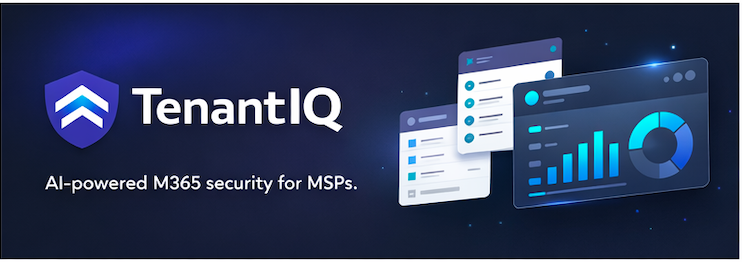

<p align="center">
  
</p>

# TenantIQ

**AI-Powered Microsoft 365 Intelligence Platform for MSPs and Enterprises**

TenantIQ is a modern, serverless SaaS platform that provides automated security monitoring, license optimization, compliance management, and AI-driven remediation for Microsoft 365 tenants. Built for Managed Service Providers (MSPs) and enterprise IT teams.

## 🚀 Quick Start

Get started in 5 minutes with our automated onboarding wizard:

```bash
pnpm install
pnpm onboard
```

The interactive wizard will guide you through Azure AD setup, credential configuration, and deployment to Cloudflare. See [QUICKSTART.md](QUICKSTART.md) for details.

## Features

### Security Intelligence
- **Automated Threat Detection**: 6 security rules including MFA enforcement, legacy authentication detection, impossible travel detection, failed login spike analysis, risky sign-in monitoring, and external sharing oversight
- **Real-time Alerts**: Server-sent events (SSE) for instant security notifications
- **Secure Score Monitoring**: Track and visualize Microsoft Secure Score trends

### License Optimization
- **Cost Savings Analysis**: Identify inactive users (30/60/90 days) with projected cost savings
- **License Right-sizing**: Detect underutilized E5 licenses and recommend downgrades
- **Waste Elimination**: Track unassigned licenses across your tenant
- **Bulk Operations**: Execute license changes across multiple users simultaneously

### Compliance & Governance
- **Guest User Management**: Identify and remediate stale guest accounts
- **Group Ownership Tracking**: Monitor groups without owners
- **Policy Enforcement**: Track conditional access policy status
- **Complete Audit Trail**: Every action logged with rollback capabilities

### AI-Powered Automation
- **Natural Language Interface**: Claude AI agent with 7 specialized tools for tenant management
- **Automated Remediations**: 9 remediation actions with dry-run and rollback support
- **Workflow Engine**: Build conditional workflows with scheduled execution
- **Tool Calling**: AI can query users, licenses, alerts, security posture, groups, audit logs, and execute remediations

### MSP Dashboard
- **Multi-tenant Management**: Manage multiple customer tenants from a single interface
- **Cross-tenant Health Monitoring**: Aggregate security and compliance metrics across all tenants
- **Organization Management**: Role-based access control for MSP teams

## Architecture

### Technology Stack

**Backend:**
- **Runtime**: Cloudflare Workers (serverless edge compute)
- **Framework**: Hono (lightweight HTTP framework)
- **Database**: Neon PostgreSQL (serverless Postgres)
- **ORM**: Drizzle ORM
- **Authentication**: Azure AD OAuth2 + JWT
- **Storage**: Cloudflare KV (sessions, rate limits), R2 (exports)
- **Queues**: Cloudflare Queues for async processing
- **Real-time**: Durable Objects for SSE

**Frontend:**
- **Framework**: SvelteKit 2.15 with Svelte 5
- **Styling**: Tailwind CSS v4
- **Icons**: Lucide Svelte
- **Deployment**: Cloudflare Pages

**External APIs:**
- Microsoft Graph API (tenant management)
- Anthropic Claude API (AI agent)

### Monorepo Structure

```
tenantiq/
├── apps/
│   ├── api/              # Cloudflare Worker backend
│   │   ├── src/
│   │   │   ├── routes/         # 10 API route modules
│   │   │   ├── middleware/     # Auth, tenant context, rate limiting, security headers
│   │   │   ├── cron/           # 4 scheduled jobs (sync, scans, workflow triggers)
│   │   │   ├── queues/         # 3 queue processors (scan, remediation, notification)
│   │   │   ├── durable-objects/# SSE for real-time alerts
│   │   │   └── index.ts
│   │   └── wrangler.toml
│   │
│   └── web/              # SvelteKit frontend
│       ├── src/
│       │   ├── routes/         # 10 page routes
│       │   ├── lib/
│       │   │   ├── components/ # Svelte components
│       │   │   ├── stores/     # State management
│       │   │   └── api/        # API client
│       │   └── app.d.ts
│       └── svelte.config.js
│
├── packages/
│   ├── shared/           # Common types, schemas, constants
│   ├── db/               # Database schema and queries (11 tables)
│   ├── graph/            # Microsoft Graph API client
│   ├── intel/            # Intelligence engine (14 rules)
│   ├── remediation/      # Remediation framework (9 actions)
│   └── ai/               # Claude AI agent
│
├── package.json
├── pnpm-workspace.yaml
├── turbo.json
└── tsconfig.json
```

## Quick Start

### Prerequisites

- **Node.js**: v20 or later
- **pnpm**: v9.15.0 or later
- **Cloudflare Account**: For deployment
- **Azure AD App Registration**: For Microsoft Graph API access
- **Neon PostgreSQL**: Database instance
- **Anthropic API Key**: For Claude AI

### Installation

1. **Clone the repository:**
   ```bash
   git clone <repository-url>
   cd tenantiq
   ```

2. **Install dependencies:**
   ```bash
   pnpm install
   ```

3. **Configure environment variables:**
   ```bash
   cp .env.example .env
   # Edit .env with your configuration
   ```

   Required environment variables:
   - `AZURE_CLIENT_ID` - Azure AD app client ID
   - `AZURE_CLIENT_SECRET` - Azure AD app secret
   - `AZURE_TENANT_ID` - Azure AD tenant ID
   - `JWT_SECRET` - Secret for JWT signing (generate with `openssl rand -hex 32`)
   - `DATABASE_URL` - Neon PostgreSQL connection string
   - `ANTHROPIC_API_KEY` - Claude API key
   - `CLOUDFLARE_API_TOKEN` - Cloudflare API token
   - `CLOUDFLARE_ACCOUNT_ID` - Cloudflare account ID

4. **Run database migrations:**
   ```bash
   cd packages/db
   pnpm run migrate
   ```

5. **Start development servers:**
   ```bash
   pnpm dev
   ```

   This starts:
   - API: http://localhost:8787 (Cloudflare Workers local)
   - Web: http://localhost:5173 (SvelteKit dev server)

### Azure AD App Registration Setup

1. **Create App Registration** in Azure Portal
2. **Configure Authentication**:
   - Platform: Web
   - Redirect URI: `https://your-domain.com/auth/callback`
   - Implicit flow: ID tokens
3. **API Permissions** (Application permissions):
   - `User.Read.All`
   - `Group.Read.All`
   - `GroupMember.Read.All`
   - `Organization.Read.All`
   - `Directory.Read.All`
   - `AuditLog.Read.All`
   - `Policy.Read.All`
   - `Policy.ReadWrite.ConditionalAccess`
   - `SecurityEvents.Read.All`
   - `IdentityRiskyUser.Read.All`
4. **Grant Admin Consent** for the tenant
5. **Create Client Secret** and save securely

### Cloudflare Setup

1. **Create Cloudflare account** at https://dash.cloudflare.com
2. **Create KV namespaces:**
   ```bash
   wrangler kv:namespace create "SESSIONS"
   wrangler kv:namespace create "RATE_LIMITS"
   ```
3. **Create R2 buckets:**
   ```bash
   wrangler r2 bucket create tenantiq-exports
   wrangler r2 bucket create tenantiq-reports
   ```
4. **Create Queues:**
   ```bash
   wrangler queues create scan-results
   wrangler queues create remediation-tasks
   wrangler queues create notifications
   ```
5. **Update wrangler.toml** with your namespace/bucket IDs

## Development

### Project Commands

```bash
# Development
pnpm dev              # Start all apps in dev mode
pnpm dev --filter=api # Start only API
pnpm dev --filter=web # Start only web

# Building
pnpm build            # Build all apps and packages
pnpm build --filter=api
pnpm build --filter=web

# Testing
pnpm test             # Run all tests
pnpm test --filter=intel # Run tests for specific package

# Linting & Type Checking
pnpm lint             # Lint all packages
pnpm check            # Type check all packages

# Cleaning
pnpm clean            # Clean all build artifacts
```

### Package Scripts

Each package/app has its own scripts:

```bash
cd apps/api
pnpm dev              # Start Wrangler dev server
pnpm deploy           # Deploy to Cloudflare Workers
pnpm tail             # View production logs

cd apps/web
pnpm dev              # Start SvelteKit dev server
pnpm build            # Build for production
pnpm preview          # Preview production build

cd packages/db
pnpm migrate          # Run database migrations
pnpm generate         # Generate Drizzle schema
pnpm studio           # Open Drizzle Studio
```

### Database Management

**Run migrations:**
```bash
cd packages/db
pnpm run migrate
```

**Generate new migration:**
```bash
cd packages/db
# Edit src/schema.ts
pnpm run generate
pnpm run migrate
```

**Open Drizzle Studio:**
```bash
cd packages/db
pnpm run studio
# Opens at http://localhost:4983
```

### Adding New Intelligence Rules

1. **Define rule in appropriate category** ([packages/intel/src/rules/](packages/intel/src/rules/)):
   - `security.ts` - Security threats
   - `optimization.ts` - Cost optimization
   - `compliance.ts` - Compliance violations
   - `operational.ts` - Operational issues

2. **Add rule ID to constants** ([packages/shared/src/constants.ts](packages/shared/src/constants.ts))

3. **Register rule in engine** ([packages/intel/src/engine.ts](packages/intel/src/engine.ts))

4. **Write tests** ([packages/intel/src/engine.test.ts](packages/intel/src/engine.test.ts))

Example rule structure:
```typescript
export async function evaluateMyRule(data: TenantData): Promise<AlertCandidate[]> {
  const candidates: AlertCandidate[] = [];

  // Your rule logic here
  if (condition) {
    candidates.push({
      ruleId: 'SEC-007',
      severity: 'high',
      title: 'Alert title',
      description: 'Alert description',
      affectedEntities: ['entity-id'],
      metadata: { key: 'value' },
      suggestedRemediations: ['REM-001']
    });
  }

  return candidates;
}
```

### Adding New Remediation Actions

1. **Create action file** in [packages/remediation/src/actions/](packages/remediation/src/actions/)

2. **Implement action interface:**
   ```typescript
   import type { GraphClient } from '@tenantiq/graph';

   export async function executeMyRemediation(
     graphClient: GraphClient,
     params: { param1: string },
     dryRun: boolean
   ): Promise<{ success: boolean; beforeState?: any; afterState?: any; message: string }> {
     if (dryRun) {
       return { success: true, message: 'Dry run successful' };
     }

     // Capture before state for rollback
     const beforeState = await graphClient.getState();

     // Execute action
     await graphClient.doAction(params);

     // Capture after state
     const afterState = await graphClient.getState();

     return { success: true, beforeState, afterState, message: 'Action completed' };
   }
   ```

3. **Add action ID to constants** ([packages/shared/src/constants.ts](packages/shared/src/constants.ts))

4. **Register in executor** ([packages/remediation/src/executor.ts](packages/remediation/src/executor.ts))

5. **Add rollback logic if reversible** ([packages/remediation/src/rollback.ts](packages/remediation/src/rollback.ts))

## Deployment

### Production Deployment

1. **Configure secrets in Cloudflare:**
   ```bash
   cd apps/api
   wrangler secret put AZURE_CLIENT_ID
   wrangler secret put AZURE_CLIENT_SECRET
   wrangler secret put AZURE_TENANT_ID
   wrangler secret put JWT_SECRET
   wrangler secret put DATABASE_URL
   wrangler secret put ANTHROPIC_API_KEY
   ```

2. **Deploy API:**
   ```bash
   cd apps/api
   pnpm deploy
   ```

3. **Deploy Web:**
   ```bash
   cd apps/web
   pnpm build
   # Deploy to Cloudflare Pages via dashboard or Wrangler
   ```

4. **Run production migrations:**
   ```bash
   cd packages/db
   DATABASE_URL=<production-url> pnpm run migrate
   ```

### Environment-specific Configuration

**Development** (`.env`):
- Local Wrangler dev server
- Local/development database
- Development Azure AD app

**Staging** (separate Cloudflare environment):
- Staging Worker environment
- Staging database (Neon branch)
- Staging Azure AD app

**Production** (Cloudflare secrets):
- Production Worker
- Production database
- Production Azure AD app

## API Documentation

See [docs/api-reference.md](docs/api-reference.md) for complete API documentation.

### Key Endpoints

**Authentication:**
- `GET /auth/login` - Initiate Azure AD OAuth flow
- `GET /auth/callback` - OAuth callback handler
- `POST /auth/logout` - End session

**Tenants:**
- `GET /tenants` - List all tenants
- `POST /tenants` - Connect new tenant
- `GET /tenants/:id` - Get tenant details
- `GET /tenants/:id/dashboard` - Get dashboard metrics
- `POST /tenants/:id/sync` - Trigger manual sync

**Alerts:**
- `GET /alerts` - List alerts with filtering
- `POST /alerts/:id/acknowledge` - Acknowledge alert
- `POST /alerts/:id/dismiss` - Dismiss alert
- `POST /alerts/:id/resolve` - Mark alert as resolved

**AI Agent:**
- `POST /ai/chat` - Send message to Claude AI
- `GET /ai/conversations` - List conversations
- `GET /ai/conversations/:id` - Get conversation history

**Full API documentation:** [docs/api-reference.md](docs/api-reference.md)

## Intelligence Rules

TenantIQ includes 14 built-in intelligence rules across 4 categories:

### Security (6 rules)
- **SEC-001**: MFA not enforced for admins (Critical)
- **SEC-002**: Legacy authentication enabled (Critical)
- **SEC-003**: Impossible travel detection (High)
- **SEC-004**: Failed login spike detected (High)
- **SEC-005**: Risky sign-ins unaddressed (High)
- **SEC-006**: External sharing overshare (Medium)

### Optimization (3 rules)
- **OPT-001**: Inactive users with cost analysis (High)
- **OPT-002**: Underutilized E5 licenses (High)
- **OPT-003**: Unassigned licenses (Medium)

### Compliance (3 rules)
- **CMP-001**: Stale guest users (Medium)
- **CMP-002**: Groups without owners (Low)
- **CMP-003**: Conditional access policy disabled (High)

### Operational (2 rules)
- **OPS-001**: Service health degradation (Medium)
- **OPS-002**: Sync errors detected (Low)

## Remediation Actions

TenantIQ supports 9 automated remediation actions:

- **REM-001**: Decommission user (disable account, remove licenses)
- **REM-002**: Enable MFA conditional access policy
- **REM-003**: Block IP range via named location
- **REM-004**: Downgrade license (E5 to E3)
- **REM-005**: Revoke all user sessions
- **REM-006**: Force password reset
- **REM-007**: Remove guest user
- **REM-008**: Restrict external sharing
- **REM-009**: Enable conditional access policy

All actions support:
- **Dry-run mode**: Preview changes without execution
- **Rollback**: Undo reversible actions within 7 days
- **Audit logging**: Complete trail of all executions

## Security

### Authentication & Authorization
- **OAuth 2.0**: Azure AD integration with PKCE flow
- **JWT Sessions**: Signed tokens stored in Cloudflare KV (24-hour expiry)
- **Role-Based Access Control**: 4 roles (viewer, operator, admin, super_admin)
- **Tenant Isolation**: Multi-tenant architecture with data isolation

### API Security
- **Rate Limiting**: Per-IP and per-user rate limits via Cloudflare KV
- **Input Validation**: Zod schemas on all endpoints
- **Security Headers**: CSP, HSTS, X-Frame-Options, X-Content-Type-Options
- **CORS**: Configurable CORS policies
- **SQL Injection Protection**: Drizzle ORM parameterized queries

### Data Security
- **Encrypted Tokens**: Azure AD tokens encrypted at rest in database
- **Secure Storage**: Cloudflare KV encryption at rest
- **Audit Logging**: Complete audit trail of all actions
- **Token Rotation**: Automatic Azure AD token refresh

### Compliance
- **GDPR**: Data retention policies and right to erasure
- **SOC 2**: Audit logging and access controls
- **Least Privilege**: Minimal Graph API permissions required

## Monitoring & Observability

### Logging
- **Structured Logging**: JSON-formatted logs with contextual metadata
- **Log Levels**: ERROR, WARN, INFO, DEBUG
- **Correlation IDs**: Request tracing across services

### Metrics (Recommended Setup)
- **Application Performance**: Response times, error rates
- **Business Metrics**: Tenants, alerts, remediations, cost savings
- **Infrastructure**: Worker CPU time, KV operations, Queue depth

### Alerting (Recommended Setup)
- **Error Tracking**: Integration with Sentry or similar
- **Uptime Monitoring**: Cloudflare health checks
- **Performance Degradation**: P95 latency alerts

### Cloudflare Analytics
- View production metrics:
  ```bash
  cd apps/api
  pnpm tail
  ```

## Testing

### Running Tests

```bash
# Run all tests
pnpm test

# Run tests for specific package
pnpm test --filter=intel
pnpm test --filter=shared

# Run tests in watch mode
pnpm test --watch

# Run with coverage
pnpm test --coverage
```

### Test Structure

```
packages/intel/src/
├── engine.ts
└── engine.test.ts

packages/shared/src/
├── schemas.ts
└── schemas.test.ts
```

### Writing Tests

Using Vitest:

```typescript
import { describe, it, expect } from 'vitest';

describe('My Feature', () => {
  it('should do something', () => {
    const result = myFunction();
    expect(result).toBe(expected);
  });
});
```

## Troubleshooting

### Common Issues

**"Unauthorized" errors:**
- Check JWT_SECRET matches between environments
- Verify token hasn't expired (24-hour TTL)
- Check Azure AD app permissions granted

**Database connection errors:**
- Verify DATABASE_URL is correct
- Check Neon database is running
- Verify Hyperdrive configuration (if using)

**Microsoft Graph API errors:**
- Verify Azure AD app permissions
- Check admin consent granted
- Verify tenant token not expired (refresh automatically)

**Cloudflare Worker errors:**
- Check wrangler.toml configuration
- Verify KV namespace IDs correct
- Check secrets configured: `wrangler secret list`

**Build errors:**
- Clear cache: `pnpm clean`
- Reinstall: `rm -rf node_modules pnpm-lock.yaml && pnpm install`
- Check TypeScript version: `pnpm list typescript`

## Contributing

### Development Workflow

1. Create feature branch: `git checkout -b feature/my-feature`
2. Make changes and add tests
3. Run tests: `pnpm test`
4. Type check: `pnpm check`
5. Lint: `pnpm lint`
6. Commit changes: `git commit -m "feat: add my feature"`
7. Push and create PR: `git push origin feature/my-feature`

### Code Style

- **TypeScript**: Strict mode enabled
- **Formatting**: Prettier (run with `pnpm format`)
- **Linting**: ESLint (run with `pnpm lint`)
- **Commits**: Conventional commits format

### Pull Request Guidelines

- Include tests for new features
- Update documentation as needed
- Ensure CI passes (tests, lint, type-check)
- Keep PRs focused and atomic
- Reference related issues

## License

[Add your license here]

## Support

- **Documentation**: [docs/](docs/)
- **Issues**: [GitHub Issues](https://github.com/your-org/tenantiq/issues)
- **Discussions**: [GitHub Discussions](https://github.com/your-org/tenantiq/discussions)

## Roadmap

See [docs/roadmap.md](docs/roadmap.md) for planned features and improvements.

## Acknowledgments

Built with:
- [Cloudflare Workers](https://workers.cloudflare.com/)
- [SvelteKit](https://kit.svelte.dev/)
- [Neon](https://neon.tech/)
- [Microsoft Graph API](https://docs.microsoft.com/graph/)
- [Anthropic Claude](https://www.anthropic.com/)
