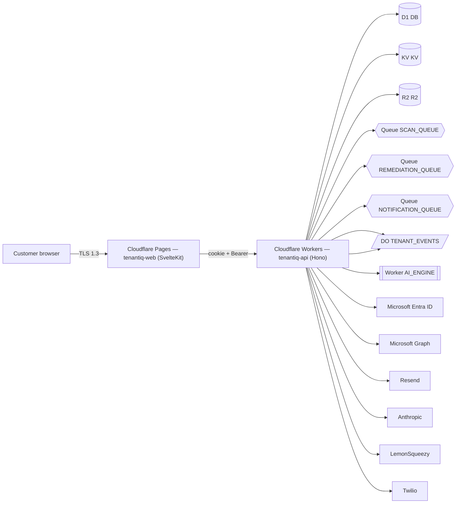

# Architecture diagram (auto-generated)

> Generated: 2026-04-30T18:35:27.795Z
> Regenerate: `pnpm tsx scripts/gen-architecture-diagram.ts`
> Source of truth: `apps/api/wrangler.toml` + URL literals in `apps/api/src` + `packages/*`.

## Bindings

- D1: DB
- KV: KV
- R2: R2
- Queues (producers): SCAN_QUEUE, REMEDIATION_QUEUE, NOTIFICATION_QUEUE
- Durable Objects: TENANT_EVENTS, TENANT_EVENTS
- Service bindings: AI_ENGINE
- External vendors discovered in source: Microsoft Entra ID, Microsoft Graph, Resend, Anthropic, LemonSqueezy, Twilio

## Diagram

## Drift check

Compare the External vendors list against `docs/SUB_PROCESSORS.md`. The drift script (`scripts/check-cert-drift.ts`) enforces this in CI.
